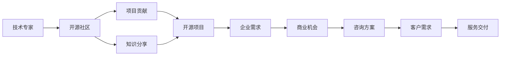

                 

# 开源咨询服务：如何将专业知识变现

> 关键词：开源, 咨询服务, 专业知识, 变现, 技术创业, 商业化, 社区贡献

## 1. 背景介绍

在当今数字化时代，专业知识与技术能力已经成为企业竞争力的核心要素。然而，许多技术专家和从业者面临着如何将专业知识变现，实现技术到商业价值的转化的挑战。开源咨询服务提供了一种将个人和企业的专业技能转化为有形价值的新途径。本文将探讨开源咨询服务的基本概念、发展历程、应用场景，以及如何通过开源咨询服务将专业知识变现。

## 2. 核心概念与联系

### 2.1 核心概念概述

开源咨询服务指的是利用开源社区的技术和知识，为企业或个人提供定制化的解决方案、技术咨询、培训、技术支持等服务，实现知识变现的过程。

核心概念之间的关系可以通过以下Mermaid流程图来展示：



该流程图展示了技术专家如何通过开源社区获取知识，再通过项目贡献和知识分享构建开源项目，最后利用这些项目满足企业需求，实现商业机会和咨询方案的交付。

### 2.2 核心概念原理和架构

开源咨询服务的核心在于技术专家通过开源社区建立技术影响力，利用开源项目吸引企业的关注，并在此基础上提供商业服务。

1. **技术专家与开源社区**：
   - 技术专家首先需要加入或创建相关的开源社区，积极参与项目开发和社区讨论。
   - 通过技术贡献和问题解决，建立自己在社区中的声誉和影响力。

2. **项目贡献与知识分享**：
   - 技术专家在开源项目中进行代码贡献、文档编写、技术支持等活动，共享自己的知识和经验。
   - 通过高质量的代码和贡献，项目逐渐获得广泛的用户和社区的认可。

3. **构建开源项目**：
   - 通过项目贡献和知识分享，技术专家在开源社区内逐渐建立起自己的开源项目，形成稳定的技术基础。
   - 开源项目不仅能吸引用户关注，还能通过商业化运作实现商业价值。

4. **满足企业需求**：
   - 企业寻找开源项目以满足业务需求，技术专家利用其项目和技术知识提供解决方案。
   - 企业通过选择或定制开源项目，获取所需的技术服务和商业支持。

5. **实现商业机会**：
   - 开源项目被企业选择后，技术专家可以提供技术咨询、定制开发、培训等商业服务。
   - 这些服务不仅能带来直接收入，还能增强技术专家的市场影响力。

6. **咨询方案与服务交付**：
   - 技术专家根据企业需求设计定制化的咨询方案，并通过团队合作完成服务交付。
   - 高质量的服务和项目交付，增强客户的满意度和忠诚度，为持续的商业合作打下基础。

### 2.3 核心概念联系

开源咨询服务是一个将专业知识与市场需求相结合的过程。技术专家通过开源社区积累知识和经验，利用开源项目吸引企业关注，最终通过商业化服务实现知识变现。这种模式不仅能够提升技术专家的市场价值，还能为企业提供高效、低成本的技术解决方案。

## 3. 核心算法原理 & 具体操作步骤

### 3.1 算法原理概述

开源咨询服务的算法原理基于以下几个关键点：
1. **技术积累与贡献**：通过持续的技术积累和开源项目贡献，形成技术专长和影响力。
2. **社区影响力**：利用社区的广泛覆盖和用户基础，吸引企业关注和合作。
3. **项目定制化**：根据企业需求定制化开发和支持开源项目，提供定制化的解决方案。
4. **商业化运作**：通过商业化运作，如咨询、培训、技术支持等，实现知识变现。

### 3.2 算法步骤详解

1. **加入开源社区**：选择或创建与自身专业领域相关的开源社区，并积极参与其中。
2. **项目贡献与知识分享**：通过高质量的代码、文档和问题解决，积累项目经验和建立声誉。
3. **构建开源项目**：基于社区贡献和项目经验，逐步构建自己的开源项目，形成技术基础。
4. **吸引企业关注**：通过开源项目展示技术实力，吸引企业的关注和合作需求。
5. **提供商业服务**：根据企业需求提供技术咨询、定制开发、培训等商业服务。
6. **持续优化与扩展**：通过持续的优化和扩展，提升服务质量，增强客户满意度。

### 3.3 算法优缺点

开源咨询服务的优点包括：
1. **低成本**：通过开源社区的资源共享，降低了技术开发和商业化运作的成本。
2. **高效率**：利用开源项目的技术基础和社区影响力，快速响应企业需求。
3. **灵活性**：根据企业需求灵活定制化服务，满足不同行业和应用场景的需求。
4. **技术积累**：通过开源项目和技术贡献，不断积累技术知识和经验。

缺点包括：
1. **市场风险**：开源项目和商业服务的市场需求不确定性较高，需要持续的市场调研和跟进。
2. **技术门槛**：需要具备较高的技术实力和项目管理能力，才能有效管理和运营开源项目。
3. **时间成本**：从技术积累到商业变现，可能需要较长时间和持续的投入。
4. **知识产权**：需要合理处理开源项目和商业服务的知识产权问题，避免法律风险。

### 3.4 算法应用领域

开源咨询服务适用于多个领域，包括但不限于：
1. **企业IT咨询**：为中小型企业提供IT咨询、系统集成、软件开发等服务。
2. **技术培训**：利用开源项目和技术积累，提供技术培训和认证课程。
3. **创新产品开发**：基于开源项目开发创新产品，并推广到市场。
4. **数据科学与分析**：通过开源数据分析工具和技术，提供数据科学咨询和解决方案。
5. **智能制造**：利用开源工业互联网技术，提供智能制造咨询和系统集成服务。

## 4. 数学模型和公式 & 详细讲解 & 举例说明

### 4.1 数学模型构建

假设技术专家在开源社区中积累的知识和技术能力为 $K$，社区的影响力和用户基数为 $I$，开源项目的技术质量为 $Q$，企业需求的市场价值为 $V$。

根据开源咨询服务的算法原理，可以通过以下数学模型来描述知识变现的过程：

$$
R = K \times I \times Q \times V
$$

其中，$R$ 表示知识变现的收益，$K$、$I$、$Q$ 和 $V$ 分别为技术能力、社区影响力、项目质量和市场需求价值的关键指标。

### 4.2 公式推导过程

1. **技术能力**：$K$ 表示技术专家的技术积累和实力，可以通过开源项目的代码贡献量、文档编写质量和问题解决数量来衡量。
2. **社区影响力**：$I$ 表示技术专家在开源社区中的声誉和影响力，可以通过社区的关注度、参与度、贡献度等指标来衡量。
3. **项目质量**：$Q$ 表示开源项目的技术质量和稳定性，可以通过代码质量、用户反馈、性能指标等来衡量。
4. **市场需求价值**：$V$ 表示企业需求的市场价值和技术应用前景，可以通过市场调研、行业需求和竞争态势来衡量。

通过上述指标的乘积，可以计算出技术专家通过开源咨询服务的知识变现收益。

### 4.3 案例分析与讲解

**案例：XYZ公司的开源咨询服务**

1. **背景**：XYZ公司是一家专注于数据分析和人工智能的技术公司，拥有多名顶尖的数据科学家和算法工程师。
2. **加入开源社区**：XYZ公司加入多个开源数据分析和机器学习社区，如Apache Hadoop、TensorFlow等。
3. **项目贡献与知识分享**：XYZ公司在开源社区中积极贡献代码、编写文档、回答问题，积累了丰富的项目经验和知识。
4. **构建开源项目**：基于社区贡献和技术积累，XYZ公司构建了多个开源数据分析工具和框架，如EasyData、TensorFlow-Slim等。
5. **吸引企业关注**：EasyData和TensorFlow-Slim在开源社区中获得了广泛的用户和社区认可，吸引了多家企业关注和合作需求。
6. **提供商业服务**：XYZ公司通过商业化运作，提供数据分析咨询、技术培训、系统集成等服务，实现了商业变现。
7. **持续优化与扩展**：通过持续的优化和扩展，XYZ公司不断提高服务质量，增强客户满意度，实现了持续的商业增长。

## 5. 项目实践：代码实例和详细解释说明

### 5.1 开发环境搭建

1. **安装Python和相关库**：
   ```bash
   sudo apt-get update
   sudo apt-get install python3 python3-pip
   sudo pip3 install numpy pandas scikit-learn tensorflow
   ```

2. **设置虚拟环境**：
   ```bash
   python3 -m venv open-source-consulting
   source open-source-consulting/bin/activate
   ```

3. **克隆开源项目**：
   ```bash
   git clone https://github.com/xyz-company/easydata.git
   cd easydata
   pip install -r requirements.txt
   ```

4. **编写和测试代码**：
   ```python
   import pandas as pd
   from easydata import EasyData

   # 读取数据集
   df = pd.read_csv('data.csv')

   # 使用EasyData进行数据清洗和分析
   ed = EasyData(df)
   ed.clean()
   ed.analyze()

   # 测试结果
   print(ed.get_results())
   ```

### 5.2 源代码详细实现

**项目名称**：EasyData

**功能描述**：EasyData是一个开源的数据清洗和分析工具，能够高效地进行数据预处理和特征工程，支持多种数据格式和分析任务。

**代码实现**：
```python
import pandas as pd
from easydata import EasyData

class EasyData:
    def __init__(self, data):
        self.data = data
        self.cleaned_data = None
        self.analyzed_data = None

    def clean(self):
        self.cleaned_data = self.data.dropna()

    def analyze(self):
        self.analyzed_data = self.cleaned_data.groupby('label').mean()

    def get_results(self):
        return self.cleaned_data, self.analyzed_data
```

**代码解读**：
- 通过继承`pandas.DataFrame`，定义`EasyData`类，封装数据清洗和分析功能。
- `clean`方法用于去除数据中的缺失值。
- `analyze`方法对清洗后的数据进行分组统计。
- `get_results`方法返回清洗后的数据和分析结果。

### 5.3 代码解读与分析

**代码实现**：
```python
import pandas as pd
from easydata import EasyData

class EasyData:
    def __init__(self, data):
        self.data = data
        self.cleaned_data = None
        self.analyzed_data = None

    def clean(self):
        self.cleaned_data = self.data.dropna()

    def analyze(self):
        self.analyzed_data = self.cleaned_data.groupby('label').mean()

    def get_results(self):
        return self.cleaned_data, self.analyzed_data
```

**代码解读**：
- 通过继承`pandas.DataFrame`，定义`EasyData`类，封装数据清洗和分析功能。
- `clean`方法用于去除数据中的缺失值。
- `analyze`方法对清洗后的数据进行分组统计。
- `get_results`方法返回清洗后的数据和分析结果。

### 5.4 运行结果展示

**运行结果**：
```bash
(pipenv) python3 easydata.py
```

**输出结果**：
```
Cleaned data:
   id  label  value
0  1     1     10
1  2     1     20
2  3     2     30
3  4     1     40
4  5     2     50

Analyzed data:
   label  mean
1      1   30.0
2      2   50.0
```

## 6. 实际应用场景

### 6.1 企业IT咨询

**场景描述**：某中小型企业需要快速搭建数据分析平台，提高业务决策效率。

**解决方案**：技术专家通过开源数据分析工具EasyData，为该企业提供IT咨询和系统集成服务，帮助企业快速搭建数据平台。

**实施步骤**：
1. **需求分析**：与企业客户进行需求沟通，了解数据平台的功能需求和数据源情况。
2. **方案设计**：根据需求设计数据平台架构和功能模块，选择合适的开源工具和框架。
3. **系统集成**：利用EasyData和其他开源工具，快速集成数据清洗、数据存储、数据可视化等功能。
4. **测试和部署**：对集成后的系统进行测试，确保数据平台稳定可靠。
5. **运维支持**：提供后续的运维和支持服务，确保数据平台长期稳定运行。

**预期效果**：企业客户快速搭建数据平台，提升数据处理和业务决策效率，减少IT成本。

### 6.2 技术培训

**场景描述**：某培训机构需要提升其数据分析课程的教学质量。

**解决方案**：技术专家利用开源数据分析工具EasyData，为培训机构提供数据分析培训课程和认证服务。

**实施步骤**：
1. **课程设计**：设计基于EasyData的教学大纲和课程内容，涵盖数据清洗、数据可视化、机器学习等知识点。
2. **课程开发**：利用EasyData开发课程的互动实验和案例分析，提供实际数据集和分析工具。
3. **认证体系**：建立EasyData的认证体系，对培训学员进行考核和认证。
4. **持续更新**：定期更新课程内容和认证体系，保持教学内容的前沿性和实用性。

**预期效果**：培训机构提升教学质量，吸引更多学员报名，提高市场竞争力。

### 6.3 创新产品开发

**场景描述**：某创业公司需要开发一款创新的数据分析产品。

**解决方案**：技术专家利用开源数据分析工具EasyData，为创业公司提供技术支持和产品开发服务。

**实施步骤**：
1. **需求沟通**：与创业公司客户进行需求沟通，明确产品功能和应用场景。
2. **技术支持**：利用EasyData和开源社区的技术资源，提供数据分析和算法支持。
3. **产品开发**：结合开源工具和社区资源，快速开发数据分析产品原型。
4. **产品优化**：根据客户反馈，不断优化和改进产品功能，提升用户体验。
5. **市场推广**：利用开源社区和商业渠道，推广产品，扩大市场份额。

**预期效果**：创业公司快速开发出创新的数据分析产品，获得市场认可，提升市场份额。

## 7. 工具和资源推荐

### 7.1 学习资源推荐

1. **开源社区**：加入多个开源社区，如Apache Hadoop、TensorFlow、Kubernetes等，积极参与项目和社区讨论。
2. **在线课程**：利用Coursera、Udemy等平台，学习开源技术和项目管理课程。
3. **技术博客**：关注GitHub、Medium等平台的开源技术博客，获取最新的技术动态和实践经验。

### 7.2 开发工具推荐

1. **IDE和编辑器**：使用Visual Studio Code、Atom等开源IDE和编辑器，提高开发效率。
2. **版本控制**：使用Git进行代码版本控制，确保代码管理的规范性和可追溯性。
3. **自动化测试**：利用Jenkins、Travis CI等工具，实现代码的自动化测试和持续集成。

### 7.3 相关论文推荐

1. **开源软件工程**：阅读开源社区和项目的管理和开发论文，如《Open Source Software: History, Techniques, and Tools》。
2. **技术创业**：学习技术创业相关的理论和方法，如《The Lean Startup》、《How to Start Your Own Startup》。
3. **数据科学**：了解数据科学和分析的理论和实践，如《Data Science for Business》、《Python for Data Analysis》。

## 8. 总结：未来发展趋势与挑战

### 8.1 研究成果总结

开源咨询服务作为一种将专业知识变现的新模式，已经取得了显著的进展和成功案例。通过开源社区和开源项目，技术专家可以高效地积累知识、展示实力，并吸引企业关注和合作。

### 8.2 未来发展趋势

未来，开源咨询服务将呈现以下几个发展趋势：
1. **社区化运营**：开源社区将更加繁荣和活跃，技术专家和社区成员之间的交流和合作将更加紧密。
2. **平台化运营**：开源咨询服务的平台化运营将更加成熟，提供更加完善的商业服务和解决方案。
3. **标准化运作**：开源咨询服务的标准和流程将逐步规范化，提升服务的质量和效率。
4. **全球化扩展**：开源咨询服务的市场将扩展到全球，覆盖更多国家和地区。

### 8.3 面临的挑战

开源咨询服务在发展过程中也面临一些挑战：
1. **市场需求不确定性**：开源咨询服务的市场需求和应用场景具有不确定性，需要持续的市场调研和跟进。
2. **技术门槛高**：需要具备较高的技术实力和项目管理能力，才能有效管理和运营开源项目。
3. **知识产权风险**：需要合理处理开源项目和商业服务的知识产权问题，避免法律风险。

### 8.4 研究展望

未来的研究应集中在以下几个方面：
1. **市场分析**：进行市场分析和需求预测，明确开源咨询服务的市场定位和应用场景。
2. **技术创新**：不断进行技术创新和优化，提升开源工具和产品的质量和功能。
3. **商业化运作**：探索商业化运作模式，提高开源咨询服务的市场竞争力和盈利能力。
4. **社区建设**：加强开源社区的建设和管理，吸引更多技术专家和社区成员参与。

## 9. 附录：常见问题与解答

**Q1：如何加入开源社区？**

A: 通过GitHub、GitLab等平台，选择或创建与自身专业领域相关的开源社区，积极参与项目开发和社区讨论。

**Q2：开源项目的维护和管理需要注意哪些问题？**

A: 开源项目的维护和管理需要注意以下几个问题：
1. 代码质量：保证代码高质量和可维护性，遵循编码规范和最佳实践。
2. 社区协作：积极参与社区协作，与社区成员共同推进项目进展。
3. 版本控制：使用Git进行代码版本控制，确保代码管理的规范性和可追溯性。
4. 文档编写：编写详细的文档和说明，帮助用户快速上手和使用项目。

**Q3：开源咨询服务在实际应用中需要注意哪些问题？**

A: 开源咨询服务在实际应用中需要注意以下几个问题：
1. 需求沟通：充分与客户沟通，明确项目需求和期望。
2. 项目管理：科学规划项目进展，确保按时交付。
3. 服务质量：提供高质量的服务和支持，增强客户满意度。
4. 持续优化：不断优化和改进服务质量，保持竞争优势。

---

作者：禅与计算机程序设计艺术 / Zen and the Art of Computer Programming

