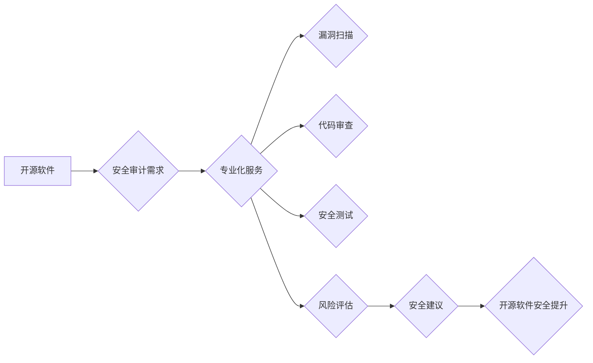

                 

## 开源安全审计：专业化服务的机会

> 关键词：开源软件、安全审计、专业化服务、漏洞发现、风险评估、代码审查、安全最佳实践、DevSecOps

## 1. 背景介绍

开源软件在现代软件生态系统中扮演着越来越重要的角色。其灵活、可定制、成本效益等优势吸引了无数开发者和企业。然而，开源软件的安全问题也日益受到关注。开源项目的开发和维护通常依赖于社区志愿者，这使得其安全审计工作相对薄弱，潜在的安全漏洞更容易被忽视。

随着开源软件的广泛应用，对开源软件安全审计的需求也日益增长。企业需要确保其使用开源软件的安全性和可靠性，避免潜在的安全风险和数据泄露。同时，开源软件社区也需要加强安全审计工作，提升开源软件的整体安全水平。

## 2. 核心概念与联系

**2.1 开源安全审计**

开源安全审计是指对开源软件进行系统性的安全评估和测试，以识别潜在的安全漏洞、风险和缺陷。其目标是确保开源软件的安全性和可靠性，并提供相应的安全建议和解决方案。

**2.2 专业化服务**

专业化服务是指由具备专业知识和经验的安全审计团队提供的一系列安全审计服务，包括漏洞扫描、代码审查、安全测试、风险评估等。

**2.3 联系**

开源安全审计与专业化服务紧密相连。专业化服务可以为开源软件提供更深入、更全面的安全审计，帮助企业和开源社区更好地识别和应对安全风险。

**Mermaid 流程图**

## 3. 核心算法原理 & 具体操作步骤

**3.1 算法原理概述**

开源安全审计的核心算法原理基于静态分析和动态分析两种技术。

* **静态分析**：是指对软件代码进行无执行环境下的分析，识别潜在的安全漏洞和缺陷。常用的静态分析工具包括代码扫描器、漏洞检测器等。
* **动态分析**：是指对软件代码在运行时进行分析，观察其行为和交互，识别潜在的安全漏洞和攻击向量。常用的动态分析工具包括沙盒环境、漏洞利用框架等。

**3.2 算法步骤详解**

1. **需求分析**: 首先，需要明确开源软件的安全审计目标和范围，包括需要评估的安全特性、潜在的安全风险等。
2. **代码扫描**: 使用代码扫描工具对开源软件代码进行扫描，识别潜在的安全漏洞和缺陷，例如SQL注入、跨站脚本攻击、缓冲区溢出等。
3. **代码审查**: 由经验丰富的安全审计人员对开源软件代码进行人工审查，深入分析代码逻辑和设计，识别潜在的安全问题。
4. **安全测试**: 使用安全测试工具对开源软件进行模拟攻击，验证其安全防护能力，识别潜在的安全漏洞和攻击向量。
5. **风险评估**: 对识别出的安全漏洞和缺陷进行风险评估，确定其严重程度和潜在影响，并制定相应的安全缓解措施。
6. **报告生成**: 生成一份详细的安全审计报告，包括安全漏洞和缺陷的描述、风险评估结果、安全建议和解决方案等。

**3.3 算法优缺点**

* **优点**:
    * 能够识别潜在的安全漏洞和缺陷，提升开源软件的安全水平。
    * 可以帮助企业和开源社区更好地了解开源软件的安全风险，制定相应的安全策略。
    * 可以提高开源软件的安全性，降低安全风险。
* **缺点**:
    * 静态分析方法无法覆盖所有类型的安全漏洞，需要结合动态分析方法才能更全面地评估安全风险。
    * 代码审查需要专业人员进行，成本较高。
    * 安全测试需要专业的工具和技术，操作复杂。

**3.4 算法应用领域**

开源安全审计算法广泛应用于以下领域：

* **软件开发**: 在软件开发过程中，进行开源软件安全审计可以帮助开发人员识别和修复潜在的安全漏洞，提高软件的安全性。
* **软件维护**: 在软件维护过程中，定期进行开源软件安全审计可以帮助发现新的安全漏洞，及时修复安全问题。
* **安全评估**: 企业可以对使用开源软件进行安全评估，识别潜在的安全风险，制定相应的安全策略。
* **开源社区**: 开源社区可以利用开源安全审计工具和方法，提升开源软件的整体安全水平。

## 4. 数学模型和公式 & 详细讲解 & 举例说明

**4.1 数学模型构建**

开源安全审计可以利用数学模型来量化安全风险。例如，可以构建一个基于漏洞严重程度和漏洞利用概率的风险评估模型。

**4.2 公式推导过程**

风险评估模型可以采用以下公式：

$$Risk = Vulnerability Severity * Exploit Probability$$

其中：

* **Risk** 代表安全风险等级。
* **Vulnerability Severity** 代表漏洞的严重程度，通常采用等级划分，例如低、中、高。
* **Exploit Probability** 代表漏洞被利用的概率。

**4.3 案例分析与讲解**

假设一个开源软件存在一个高危漏洞，其漏洞利用概率为 0.8，则其风险等级为：

$$Risk = High * 0.8 = High$$

该漏洞的风险等级为高，需要及时修复。

## 5. 项目实践：代码实例和详细解释说明

**5.1 开发环境搭建**

开源安全审计项目需要搭建相应的开发环境，包括：

* **操作系统**: Linux 或 macOS
* **编程语言**: Python 或 Java
* **安全审计工具**: SonarQube、OWASP ZAP、Burp Suite 等

**5.2 源代码详细实现**

开源安全审计项目可以利用开源工具和框架进行实现，例如：

* **SonarQube**: 用于代码静态分析，识别潜在的安全漏洞和缺陷。
* **OWASP ZAP**: 用于Web应用程序安全测试，识别跨站脚本攻击、SQL注入等漏洞。
* **Burp Suite**: 用于Web应用程序安全测试，提供更全面的漏洞扫描和攻击模拟功能。

**5.3 代码解读与分析**

开源安全审计项目代码通常包含以下模块：

* **数据处理模块**: 处理安全审计数据，例如代码文件、漏洞报告等。
* **分析模块**: 对安全审计数据进行分析，识别潜在的安全漏洞和缺陷。
* **报告生成模块**: 生成安全审计报告，包括漏洞描述、风险评估、安全建议等。

**5.4 运行结果展示**

开源安全审计项目运行结果通常包括：

* **漏洞报告**: 列出识别出的安全漏洞和缺陷，包括漏洞类型、严重程度、影响范围等。
* **风险评估报告**: 对识别出的安全漏洞和缺陷进行风险评估，确定其严重程度和潜在影响。
* **安全建议报告**: 提供相应的安全建议和解决方案，帮助企业和开源社区修复安全漏洞和提升安全水平。

## 6. 实际应用场景

**6.1 企业应用场景**

企业可以使用开源安全审计服务来评估其使用开源软件的安全风险，并制定相应的安全策略。例如，金融机构可以使用开源安全审计服务来评估其核心业务系统使用的开源软件安全风险，确保其数据安全和业务连续性。

**6.2 开源社区应用场景**

开源社区可以使用开源安全审计服务来提升其开源软件的整体安全水平。例如，Linux基金会可以使用开源安全审计服务来评估其维护的开源软件安全风险，并提供相应的安全建议和解决方案。

**6.3 未来应用展望**

随着开源软件的广泛应用，开源安全审计服务将迎来更大的发展空间。未来，开源安全审计服务将更加智能化、自动化，并能够提供更深入、更全面的安全评估和建议。

## 7. 工具和资源推荐

**7.1 学习资源推荐**

* **OWASP Top 10**: https://owasp.org/www-project-top-ten/
* **SANS Institute**: https://www.sans.org/
* **NIST Cybersecurity Framework**: https://www.nist.gov/cyberframework

**7.2 开发工具推荐**

* **SonarQube**: https://www.sonarqube.org/
* **OWASP ZAP**: https://owasp.org/www-project-zap/
* **Burp Suite**: https://portswigger.net/burp

**7.3 相关论文推荐**

* **The Open Source Security Audit: A Comprehensive Approach**
* **Automated Security Auditing of Open Source Software**
* **A Framework for Evaluating the Security of Open Source Software**

## 8. 总结：未来发展趋势与挑战

**8.1 研究成果总结**

开源安全审计研究取得了显著成果，开发了多种安全审计工具和方法，并建立了相应的安全评估框架。

**8.2 未来发展趋势**

开源安全审计将朝着以下方向发展：

* **智能化**: 利用人工智能和机器学习技术，提高安全审计的自动化程度和准确性。
* **自动化**: 利用自动化工具和流程，简化安全审计工作，降低成本。
* **协作**: 建立开源安全审计平台，促进安全审计信息共享和协作。

**8.3 面临的挑战**

开源安全审计仍然面临一些挑战：

* **开源软件的复杂性**: 开源软件的代码结构和功能复杂，安全审计难度较大。
* **安全漏洞的不断涌现**: 随着软件技术的不断发展，新的安全漏洞不断涌现，需要持续更新安全审计工具和方法。
* **安全审计人才短缺**: 安全审计需要专业知识和经验，安全审计人才短缺是制约开源安全审计发展的瓶颈。

**8.4 研究展望**

未来，开源安全审计研究需要重点关注以下方面：

* **开发更智能、更自动化、更协作的开源安全审计工具和平台。**
* **建立更完善的开源安全审计标准和规范。**
* **培养更多专业的开源安全审计人才。**

## 9. 附录：常见问题与解答

**9.1 如何选择合适的开源安全审计工具？**

选择合适的开源安全审计工具需要根据具体的项目需求和预算进行选择。一些常用的开源安全审计工具包括SonarQube、OWASP ZAP、Burp Suite等。

**9.2 开源安全审计的成本如何控制？**

开源安全审计的成本可以通过以下方式控制：

* 选择开源工具和框架。
* 利用自动化工具和流程。
* 培养内部安全审计人才。

**9.3 开源安全审计的报告如何撰写？**

开源安全审计报告应包含以下内容：

* 审计目标和范围
* 审计方法和工具
* 识别出的安全漏洞和缺陷
* 风险评估结果
* 安全建议和解决方案

作者：禅与计算机程序设计艺术 / Zen and the Art of Computer Programming 
<end_of_turn>

