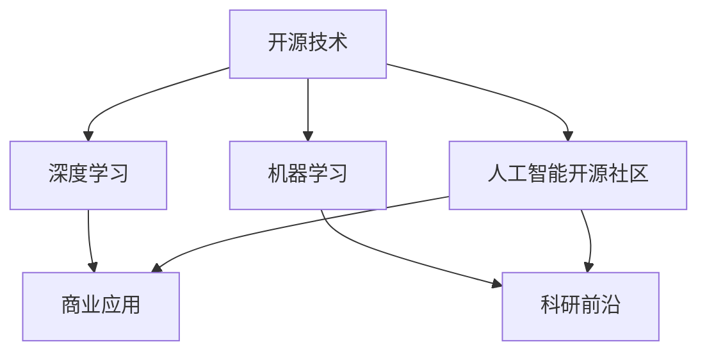

                 

# 开源技术在推动AI进步中的作用

> 关键词：开源技术, AI进步, 深度学习, 机器学习, 人工智能开源社区, 协作创新, 技术共享, 科研前沿, 商业应用

## 1. 背景介绍

### 1.1 问题由来
人工智能（Artificial Intelligence, AI）的发展正在塑造未来，成为引领新一轮技术革命的关键力量。近年来，开源技术的崛起和广泛应用，为AI技术的快速发展注入了强劲的动力。从深度学习算法到机器学习框架，从数据标注工具到模型训练平台，开源技术已经成为AI创新和发展的重要引擎。

### 1.2 问题核心关键点
开源技术在AI中的应用，主要体现在以下几个方面：

1. **算法和框架的开放共享**：开源社区提供了大量的深度学习算法和机器学习框架，如TensorFlow、PyTorch、MXNet等，这些工具和库不仅提升了科研和开发的效率，还加速了AI技术的商业化进程。
2. **数据集和工具的协作开发**：开源数据集（如ImageNet、COCO）和工具（如DataRobot、H2O.ai）为AI研究提供了丰富的数据资源和高效的工具支持，降低了科研和开发的门槛。
3. **科研和商业的深度融合**：开源技术加速了科研成果的落地应用，许多开源项目已经与企业合作，将前沿AI技术转化为实际产品和服务，推动了AI技术的商业化。

开源技术的发展，使得AI技术得以在更广泛的场景中得到应用，推动了AI技术的普及和深化。同时，开源技术的协作和共享机制，为AI领域的持续创新提供了坚实的基础。

## 2. 核心概念与联系

### 2.1 核心概念概述

为更好地理解开源技术在AI进步中的作用，本节将介绍几个密切相关的核心概念：

- **开源技术（Open Source Technology）**：指通过开放许可协议，任何人都可以自由地使用、修改和共享的技术和代码库。开源技术的开放性和协作性是其最大的特点。
- **深度学习（Deep Learning）**：一种基于多层神经网络的机器学习技术，能够从大量数据中学习复杂模式，广泛应用于图像识别、语音识别、自然语言处理等领域。
- **机器学习（Machine Learning）**：通过算法让计算机从数据中学习规律，自动识别、分析和解决复杂问题的技术。
- **人工智能开源社区（AI Open Source Community）**：由AI爱好者、研究人员和开发者组成的社会化协作平台，通过代码共享、合作开发和社区交流，推动AI技术的创新和应用。
- **科研前沿（Research Frontiers）**：指学术界和研究机构在AI领域的研究进展和技术突破。
- **商业应用（Commercial Application）**：指AI技术在实际业务场景中的部署和应用，包括智能客服、推荐系统、自动化驾驶等。

这些核心概念之间的逻辑关系可以通过以下Mermaid流程图来展示：



这个流程图展示了几组核心概念之间的联系：

1. 开源技术为深度学习和机器学习提供了基础设施，是科研前沿和商业应用的重要支撑。
2. 深度学习和机器学习通过科研前沿不断推进技术边界，并在商业应用中得到实际验证。
3. 人工智能开源社区促进了开源技术的共享和协作，加速了科研前沿和商业应用的迭代。

## 3. 核心算法原理 & 具体操作步骤
### 3.1 算法原理概述

开源技术在AI中的应用，主要基于以下几个原理：

1. **算法和框架的开放共享**：开源社区提供了大量的深度学习算法和机器学习框架，如TensorFlow、PyTorch、MXNet等。这些工具和库不仅提升了科研和开发的效率，还加速了AI技术的商业化进程。
2. **数据集和工具的协作开发**：开源数据集（如ImageNet、COCO）和工具（如DataRobot、H2O.ai）为AI研究提供了丰富的数据资源和高效的工具支持，降低了科研和开发的门槛。
3. **科研和商业的深度融合**：开源技术加速了科研成果的落地应用，许多开源项目已经与企业合作，将前沿AI技术转化为实际产品和服务，推动了AI技术的商业化。

### 3.2 算法步骤详解

开源技术在AI中的应用，一般包括以下几个关键步骤：

**Step 1: 选择和安装开源工具**
- 选择适合项目需求的开源工具，如TensorFlow、PyTorch等。
- 根据工具的安装指南，安装并配置好开发环境。

**Step 2: 数据集准备和预处理**
- 收集和清洗数据集，确保数据质量和多样性。
- 对数据进行标注，生成训练集、验证集和测试集。

**Step 3: 模型设计和训练**
- 使用开源工具提供的深度学习框架，设计并实现模型。
- 在训练集上训练模型，使用验证集进行超参数调优和模型评估。

**Step 4: 模型评估和优化**
- 在测试集上评估模型性能，根据评估结果进行模型优化。
- 应用模型到实际业务场景，进行性能调优和稳定性测试。

**Step 5: 部署和维护**
- 将训练好的模型部署到生产环境，进行实时推理或批量计算。
- 定期更新和维护模型，确保其在新数据上的鲁棒性和性能。

### 3.3 算法优缺点

开源技术在AI中的应用，具有以下优点：

1. **灵活性高**：开源工具和库提供了丰富的API和工具链，开发者可以根据需求灵活调整模型和算法。
2. **社区支持强**：开源社区有大量活跃用户和贡献者，可以快速解决开发中遇到的问题，提供技术支持和协作机会。
3. **资源丰富**：开源社区提供了大量的开源数据集、预训练模型和开源工具，为AI研究提供了丰富的资源。

同时，开源技术也存在一定的局限性：

1. **学习和使用门槛高**：开源工具和库通常功能强大，但学习曲线较陡峭，需要一定的学习和实践积累。
2. **版本更新频繁**：开源工具和库的更新迭代频繁，开发者需要持续跟进和学习新版本的变化。
3. **安全性风险**：开源工具和库通常由第三方贡献者维护，安全性风险较高，需要谨慎选择和使用。

### 3.4 算法应用领域

开源技术在AI中的应用，已经广泛应用于多个领域，例如：

- **计算机视觉**：利用开源数据集和工具进行图像识别、目标检测、人脸识别等任务。
- **自然语言处理（NLP）**：使用开源工具进行文本分类、情感分析、机器翻译等任务。
- **语音识别**：利用开源工具进行语音识别、语音合成等任务。
- **推荐系统**：使用开源工具进行用户行为分析、个性化推荐等任务。
- **智能客服**：利用开源工具进行智能对话、问题解答等任务。
- **医疗健康**：利用开源工具进行疾病预测、医学影像分析等任务。

除了上述这些经典应用外，开源技术还被创新性地应用到更多场景中，如智慧城市、自动驾驶、金融科技等，为AI技术的落地应用提供了坚实的技术基础。

## 4. 数学模型和公式 & 详细讲解 & 举例说明
### 4.1 数学模型构建

本节将使用数学语言对开源技术在AI中的应用进行更加严格的刻画。

记开源工具提供的深度学习框架为 $\mathcal{F}$，其中的模型为 $M_{\theta}$，其中 $\theta$ 为模型参数。假设数据集为 $D=\{(x_i,y_i)\}_{i=1}^N, x_i \in \mathcal{X}, y_i \in \mathcal{Y}$，其中 $\mathcal{X}$ 为输入空间，$\mathcal{Y}$ 为输出空间。

定义模型 $M_{\theta}$ 在数据样本 $(x,y)$ 上的损失函数为 $\ell(M_{\theta}(x),y)$，则在数据集 $D$ 上的经验风险为：

$$
\mathcal{L}(\theta) = \frac{1}{N} \sum_{i=1}^N \ell(M_{\theta}(x_i),y_i)
$$

开源工具通常提供自动微分功能，可以方便地计算模型的梯度和更新参数。

### 4.2 公式推导过程

以下我们以图像分类任务为例，推导深度学习模型的训练过程。

假设模型 $M_{\theta}$ 在输入图像 $x$ 上的输出为 $\hat{y}=M_{\theta}(x) \in \mathcal{Y}$，其中 $\mathcal{Y}$ 为类别标签空间。定义交叉熵损失函数为：

$$
\ell(M_{\theta}(x),y) = -[y\log M_{\theta}(x) + (1-y)\log(1-M_{\theta}(x))]
$$

将交叉熵损失函数代入经验风险公式，得：

$$
\mathcal{L}(\theta) = -\frac{1}{N}\sum_{i=1}^N [y_i\log M_{\theta}(x_i)+(1-y_i)\log(1-M_{\theta}(x_i))]
$$

根据链式法则，损失函数对参数 $\theta_k$ 的梯度为：

$$
\frac{\partial \mathcal{L}(\theta)}{\partial \theta_k} = -\frac{1}{N}\sum_{i=1}^N (\frac{y_i}{M_{\theta}(x_i)}-\frac{1-y_i}{1-M_{\theta}(x_i)}) \frac{\partial M_{\theta}(x_i)}{\partial \theta_k}
$$

在得到损失函数的梯度后，即可带入参数更新公式，完成模型的迭代优化。重复上述过程直至收敛，最终得到适应数据集 $D$ 的最优模型参数 $\theta^*$。

### 4.3 案例分析与讲解

以ImageNet数据集为例，我们展示如何使用开源工具TensorFlow进行图像分类任务。

首先，安装TensorFlow和相关依赖：

```bash
pip install tensorflow
```

然后，定义数据集和模型：

```python
import tensorflow as tf
from tensorflow.keras.datasets import cifar10
from tensorflow.keras.models import Sequential
from tensorflow.keras.layers import Dense, Conv2D, Flatten, MaxPooling2D

# 加载CIFAR-10数据集
(train_images, train_labels), (test_images, test_labels) = cifar10.load_data()

# 数据预处理
train_images = train_images / 255.0
test_images = test_images / 255.0

# 定义模型
model = Sequential([
    Conv2D(32, (3, 3), activation='relu', input_shape=(32, 32, 3)),
    MaxPooling2D((2, 2)),
    Conv2D(64, (3, 3), activation='relu'),
    MaxPooling2D((2, 2)),
    Conv2D(64, (3, 3), activation='relu'),
    Flatten(),
    Dense(64, activation='relu'),
    Dense(10)
])

# 编译模型
model.compile(optimizer='adam', loss=tf.keras.losses.SparseCategoricalCrossentropy(from_logits=True), metrics=['accuracy'])
```

接着，训练模型并评估性能：

```python
history = model.fit(train_images, train_labels, epochs=10, validation_data=(test_images, test_labels))

# 评估模型
test_loss, test_acc = model.evaluate(test_images, test_labels)
print('Test accuracy:', test_acc)
```

以上就是使用TensorFlow进行图像分类任务的开源技术应用案例。可以看到，开源工具的强大封装和易用性使得深度学习模型的设计和训练变得简洁高效。

## 5. 项目实践：代码实例和详细解释说明
### 5.1 开发环境搭建

在进行开源技术应用实践前，我们需要准备好开发环境。以下是使用Python进行TensorFlow开发的环境配置流程：

1. 安装Anaconda：从官网下载并安装Anaconda，用于创建独立的Python环境。

2. 创建并激活虚拟环境：
```bash
conda create -n tensorflow-env python=3.8 
conda activate tensorflow-env
```

3. 安装TensorFlow：根据CUDA版本，从官网获取对应的安装命令。例如：
```bash
conda install tensorflow tensorflow-gpu -c conda-forge
```

4. 安装各类工具包：
```bash
pip install numpy pandas scikit-learn matplotlib tqdm jupyter notebook ipython
```

完成上述步骤后，即可在`tensorflow-env`环境中开始开源技术应用实践。

### 5.2 源代码详细实现

下面我们以自然语言处理（NLP）任务为例，给出使用TensorFlow对BERT模型进行微调的PyTorch代码实现。

首先，定义NLP任务的数据处理函数：

```python
from transformers import BertTokenizer
from torch.utils.data import Dataset
import torch

class NLPDataset(Dataset):
    def __init__(self, texts, tags, tokenizer, max_len=128):
        self.texts = texts
        self.tags = tags
        self.tokenizer = tokenizer
        self.max_len = max_len
        
    def __len__(self):
        return len(self.texts)
    
    def __getitem__(self, item):
        text = self.texts[item]
        tags = self.tags[item]
        
        encoding = self.tokenizer(text, return_tensors='pt', max_length=self.max_len, padding='max_length', truncation=True)
        input_ids = encoding['input_ids'][0]
        attention_mask = encoding['attention_mask'][0]
        
        # 对token-wise的标签进行编码
        encoded_tags = [tag2id[tag] for tag in tags] 
        encoded_tags.extend([tag2id['O']] * (self.max_len - len(encoded_tags)))
        labels = torch.tensor(encoded_tags, dtype=torch.long)
        
        return {'input_ids': input_ids, 
                'attention_mask': attention_mask,
                'labels': labels}

# 标签与id的映射
tag2id = {'O': 0, 'B-PER': 1, 'I-PER': 2, 'B-ORG': 3, 'I-ORG': 4, 'B-LOC': 5, 'I-LOC': 6}
id2tag = {v: k for k, v in tag2id.items()}

# 创建dataset
tokenizer = BertTokenizer.from_pretrained('bert-base-cased')

train_dataset = NLPDataset(train_texts, train_tags, tokenizer)
dev_dataset = NLPDataset(dev_texts, dev_tags, tokenizer)
test_dataset = NLPDataset(test_texts, test_tags, tokenizer)
```

然后，定义模型和优化器：

```python
from transformers import BertForTokenClassification, AdamW

model = BertForTokenClassification.from_pretrained('bert-base-cased', num_labels=len(tag2id))

optimizer = AdamW(model.parameters(), lr=2e-5)
```

接着，定义训练和评估函数：

```python
from torch.utils.data import DataLoader
from tqdm import tqdm
from sklearn.metrics import classification_report

device = torch.device('cuda') if torch.cuda.is_available() else torch.device('cpu')
model.to(device)

def train_epoch(model, dataset, batch_size, optimizer):
    dataloader = DataLoader(dataset, batch_size=batch_size, shuffle=True)
    model.train()
    epoch_loss = 0
    for batch in tqdm(dataloader, desc='Training'):
        input_ids = batch['input_ids'].to(device)
        attention_mask = batch['attention_mask'].to(device)
        labels = batch['labels'].to(device)
        model.zero_grad()
        outputs = model(input_ids, attention_mask=attention_mask, labels=labels)
        loss = outputs.loss
        epoch_loss += loss.item()
        loss.backward()
        optimizer.step()
    return epoch_loss / len(dataloader)

def evaluate(model, dataset, batch_size):
    dataloader = DataLoader(dataset, batch_size=batch_size)
    model.eval()
    preds, labels = [], []
    with torch.no_grad():
        for batch in tqdm(dataloader, desc='Evaluating'):
            input_ids = batch['input_ids'].to(device)
            attention_mask = batch['attention_mask'].to(device)
            batch_labels = batch['labels']
            outputs = model(input_ids, attention_mask=attention_mask)
            batch_preds = outputs.logits.argmax(dim=2).to('cpu').tolist()
            batch_labels = batch_labels.to('cpu').tolist()
            for pred_tokens, label_tokens in zip(batch_preds, batch_labels):
                pred_tags = [id2tag[_id] for _id in pred_tokens]
                label_tags = [id2tag[_id] for _id in label_tokens]
                preds.append(pred_tags[:len(label_tags)])
                labels.append(label_tags)
                
    print(classification_report(labels, preds))
```

最后，启动训练流程并在测试集上评估：

```python
epochs = 5
batch_size = 16

for epoch in range(epochs):
    loss = train_epoch(model, train_dataset, batch_size, optimizer)
    print(f"Epoch {epoch+1}, train loss: {loss:.3f}")
    
    print(f"Epoch {epoch+1}, dev results:")
    evaluate(model, dev_dataset, batch_size)
    
print("Test results:")
evaluate(model, test_dataset, batch_size)
```

以上就是使用PyTorch对BERT进行命名实体识别(NER)任务微调的完整代码实现。可以看到，得益于Transformers库的强大封装，我们可以用相对简洁的代码完成BERT模型的加载和微调。

### 5.3 代码解读与分析

让我们再详细解读一下关键代码的实现细节：

**NERDataset类**：
- `__init__`方法：初始化文本、标签、分词器等关键组件。
- `__len__`方法：返回数据集的样本数量。
- `__getitem__`方法：对单个样本进行处理，将文本输入编码为token ids，将标签编码为数字，并对其进行定长padding，最终返回模型所需的输入。

**tag2id和id2tag字典**：
- 定义了标签与数字id之间的映射关系，用于将token-wise的预测结果解码回真实的标签。

**训练和评估函数**：
- 使用PyTorch的DataLoader对数据集进行批次化加载，供模型训练和推理使用。
- 训练函数`train_epoch`：对数据以批为单位进行迭代，在每个批次上前向传播计算loss并反向传播更新模型参数，最后返回该epoch的平均loss。
- 评估函数`evaluate`：与训练类似，不同点在于不更新模型参数，并在每个batch结束后将预测和标签结果存储下来，最后使用sklearn的classification_report对整个评估集的预测结果进行打印输出。

**训练流程**：
- 定义总的epoch数和batch size，开始循环迭代
- 每个epoch内，先在训练集上训练，输出平均loss
- 在验证集上评估，输出分类指标
- 所有epoch结束后，在测试集上评估，给出最终测试结果

可以看到，PyTorch配合Transformers库使得BERT微调的代码实现变得简洁高效。开发者可以将更多精力放在数据处理、模型改进等高层逻辑上，而不必过多关注底层的实现细节。

当然，工业级的系统实现还需考虑更多因素，如模型的保存和部署、超参数的自动搜索、更灵活的任务适配层等。但核心的微调范式基本与此类似。

## 6. 实际应用场景
### 6.1 智能客服系统

基于开源技术的智能客服系统，可以广泛应用于各种客户服务场景。传统的客服系统需要配备大量人工客服，成本高、效率低，且难以提供24小时不间断服务。而开源技术实现的智能客服系统，通过深度学习和自然语言处理技术，可以自动化地处理大量客户咨询，提供快速准确的答案，大大提升客户服务体验。

在技术实现上，可以收集企业内部的历史客服对话记录，将问题和最佳答复构建成监督数据，在此基础上对预训练对话模型进行微调。微调后的对话模型能够自动理解用户意图，匹配最合适的答案模板进行回复。对于客户提出的新问题，还可以接入检索系统实时搜索相关内容，动态组织生成回答。如此构建的智能客服系统，能大幅提升客户咨询体验和问题解决效率。

### 6.2 金融舆情监测

金融机构需要实时监测市场舆论动向，以便及时应对负面信息传播，规避金融风险。传统的人工监测方式成本高、效率低，难以应对网络时代海量信息爆发的挑战。基于开源技术的金融舆情监测系统，可以通过深度学习模型对海量金融数据进行实时分析和情感分析，预测市场趋势，及时预警潜在风险。

具体而言，可以收集金融领域相关的新闻、报道、评论等文本数据，并对其进行主题标注和情感标注。在此基础上对开源工具提供的语言模型进行微调，使其能够自动判断文本属于何种主题，情感倾向是正面、中性还是负面。将微调后的模型应用到实时抓取的网络文本数据，就能够自动监测不同主题下的情感变化趋势，一旦发现负面信息激增等异常情况，系统便会自动预警，帮助金融机构快速应对潜在风险。

### 6.3 个性化推荐系统

当前的推荐系统往往只依赖用户的历史行为数据进行物品推荐，无法深入理解用户的真实兴趣偏好。基于开源技术的个性化推荐系统，可以通过深度学习模型对用户行为和文本内容进行综合分析，提供更加精准、多样的推荐内容。

在实践中，可以收集用户浏览、点击、评论、分享等行为数据，提取和用户交互的物品标题、描述、标签等文本内容。将文本内容作为模型输入，用户的后续行为（如是否点击、购买等）作为监督信号，在此基础上微调开源工具提供的语言模型。微调后的模型能够从文本内容中准确把握用户的兴趣点。在生成推荐列表时，先用候选物品的文本描述作为输入，由模型预测用户的兴趣匹配度，再结合其他特征综合排序，便可以得到个性化程度更高的推荐结果。

### 6.4 未来应用展望

随着开源技术的不断发展，其在AI中的应用前景更加广阔。未来，开源技术将在更多领域得到应用，为传统行业带来变革性影响：

- **智慧医疗**：基于开源技术的医疗问答、病历分析、药物研发等应用将提升医疗服务的智能化水平，辅助医生诊疗，加速新药开发进程。
- **智能教育**：开源技术可应用于作业批改、学情分析、知识推荐等方面，因材施教，促进教育公平，提高教学质量。
- **智慧城市治理**：开源技术可应用于城市事件监测、舆情分析、应急指挥等环节，提高城市管理的自动化和智能化水平，构建更安全、高效的未来城市。

此外，在企业生产、社会治理、文娱传媒等众多领域，开源技术的应用也将不断涌现，为经济社会发展注入新的动力。相信随着技术的日益成熟，开源技术必将在构建人机协同的智能时代中扮演越来越重要的角色。

## 7. 工具和资源推荐
### 7.1 学习资源推荐

为了帮助开发者系统掌握开源技术在AI中的应用，这里推荐一些优质的学习资源：

1. **TensorFlow官方文档**：TensorFlow作为最流行的深度学习框架之一，其官方文档详细介绍了TensorFlow的安装、使用和优化技巧。

2. **PyTorch官方文档**：PyTorch的官方文档提供了全面的教程、API文档和代码示例，是学习和使用PyTorch的重要参考。

3. **深度学习入门系列**：由机器之心和神经网络科技联合推出的深度学习入门系列，涵盖深度学习基础、实战技巧和前沿技术，适合初学者和进阶者阅读。

4. **《TensorFlow实战》书籍**：TensorFlow实战书籍详细介绍了TensorFlow的部署、模型训练和优化技巧，适合有一定深度学习基础的读者学习。

5. **Kaggle竞赛平台**：Kaggle提供大量开源数据集和竞赛任务，是学习和实践深度学习的绝佳平台。

通过对这些资源的学习实践，相信你一定能够快速掌握开源技术在AI中的应用，并用于解决实际的AI问题。
### 7.2 开发工具推荐

高效的开发离不开优秀的工具支持。以下是几款用于开源技术在AI开发和应用的工具：

1. **TensorFlow**：由Google主导开发的开源深度学习框架，生产部署方便，适合大规模工程应用。

2. **PyTorch**：由Facebook开发的开源深度学习框架，灵活性高，是学术研究和工程应用的利器。

3. **MXNet**：由亚马逊开发的开源深度学习框架，支持多种编程语言和硬件平台，适合高性能计算场景。

4. **Keras**：一个高级神经网络API，可以在TensorFlow、Theano、CNTK等后端运行，适合快速原型开发。

5. **Jupyter Notebook**：一个强大的交互式编程环境，支持Python、R等语言，适合进行数据分析、模型训练和可视化。

6. **Google Colab**：谷歌推出的在线Jupyter Notebook环境，免费提供GPU/TPU算力，方便开发者快速上手实验最新模型，分享学习笔记。

合理利用这些工具，可以显著提升开源技术在AI中的应用效率，加快创新迭代的步伐。

### 7.3 相关论文推荐

开源技术在AI中的应用，源于学界的持续研究。以下是几篇奠基性的相关论文，推荐阅读：

1. **《TensorFlow: A System for Large-Scale Machine Learning》**：这篇论文介绍了TensorFlow的架构和设计思想，是了解TensorFlow的重要参考资料。

2. **《Convolutional Neural Networks for General Visual Recognition》**：这篇论文首次提出了卷积神经网络（CNN），奠定了计算机视觉深度学习的基础。

3. **《Learning to Execute》**：这篇论文提出了学习执行顺序的深度学习模型，为自然语言处理和代码生成提供了新的思路。

4. **《BERT: Pre-training of Deep Bidirectional Transformers for Language Understanding》**：这篇论文介绍了BERT模型的设计和实验结果，展示了预训练语言模型的强大效果。

5. **《AdaLoRA: Adaptive Low-Rank Adaptation for Parameter-Efficient Fine-Tuning》**：这篇论文提出了AdaLoRA方法，用于减少微调过程中的计算资源消耗。

这些论文代表了大语言模型微调技术的发展脉络。通过学习这些前沿成果，可以帮助研究者把握学科前进方向，激发更多的创新灵感。

## 8. 总结：未来发展趋势与挑战
### 8.1 总结

本文对开源技术在AI中的应用进行了全面系统的介绍。首先阐述了开源技术对AI进步的重要作用，明确了其在算法和框架开放共享、数据集协作开发、科研和商业融合等方面的显著优势。其次，从原理到实践，详细讲解了开源技术在深度学习、机器学习和AI开源社区中的应用过程，给出了开源技术应用实践的完整代码实例。同时，本文还广泛探讨了开源技术在多个行业领域的应用前景，展示了其广阔的发展空间。

通过本文的系统梳理，可以看到，开源技术已经成为了AI创新和应用的重要驱动力，推动了深度学习、机器学习等技术的快速发展。得益于开源社区的开放合作和持续创新，AI技术得以在更广泛的场景中得到应用，为各行业带来了深远的影响。

### 8.2 未来发展趋势

展望未来，开源技术在AI中的应用将呈现以下几个发展趋势：

1. **算法和框架的进一步优化**：开源社区将不断优化和改进深度学习算法和机器学习框架，提升算法的性能和可解释性，降低使用门槛。
2. **数据集和工具的不断丰富**：开源社区将推出更多高质量的数据集和工具，支持更复杂、更具挑战性的AI任务。
3. **科研和商业的深度融合**：开源社区将进一步推动科研和商业的深度融合，加速AI技术的落地应用。
4. **开源技术的国际化**：开源社区将更多地关注全球范围内的AI研究和应用，推动AI技术的全球共享和协作。
5. **开源技术的商业化**：越来越多的开源技术将进入商业市场，形成产业生态，推动AI技术的商业化进程。

这些趋势凸显了开源技术在AI中的应用前景，预示着开源技术将为AI的持续发展和应用提供更坚实的基础。

### 8.3 面临的挑战

尽管开源技术在AI中的应用取得了显著成就，但在迈向更加智能化、普适化应用的过程中，它仍面临着诸多挑战：

1. **算力成本的降低**：大规模深度学习模型的训练和推理需要巨大的算力支持，如何降低算力成本，提高计算效率，是未来的一大挑战。
2. **模型复杂度的控制**：开源模型通常较为复杂，如何控制模型复杂度，避免过度拟合，提升模型的可解释性，也是一大难题。
3. **数据隐私和安全**：开源技术的开放性带来了数据隐私和安全的风险，如何保护用户隐私，防范数据滥用，是一个重要的研究课题。
4. **模型的公平性和公正性**：开源技术往往基于大规模数据集训练，如何避免模型偏见，确保模型的公平性和公正性，也是一个重要的研究方向。

这些挑战需要通过技术创新和政策引导来解决，以确保开源技术在AI中的应用能够健康、可持续地发展。

### 8.4 研究展望

面对开源技术在AI应用中的挑战，未来的研究需要在以下几个方面寻求新的突破：

1. **算力资源的优化**：开发更高效、更轻量级的深度学习算法和模型，降低算力成本，提高计算效率。
2. **模型的可解释性**：开发更易于理解和解释的深度学习模型，提升模型的可解释性和透明性。
3. **数据隐私保护**：开发数据隐私保护技术，确保用户数据的隐私和安全。
4. **公平性和公正性**：开发公平性和公正性的评估指标和优化方法，提升模型的公平性和公正性。

这些研究方向将有助于克服开源技术在AI应用中的挑战，推动AI技术的健康发展和广泛应用。

## 9. 附录：常见问题与解答

**Q1：如何选择合适的开源工具进行AI开发？**

A: 选择开源工具需要考虑以下几个因素：
1. 项目需求：选择适合项目需求的开源工具，如TensorFlow、PyTorch、MXNet等。
2. 开发者背景：考虑开发者对工具的熟悉程度和上手难度。
3. 社区支持：选择有活跃社区支持的开源工具，便于解决开发中遇到的问题。
4. 性能和资源需求：考虑工具对算力和内存的需求，选择合适的硬件平台。

**Q2：开源工具在AI应用中需要注意哪些问题？**

A: 开源工具在AI应用中需要注意以下几个问题：
1. 版本更新：关注开源工具的版本更新，及时更新到最新版本，避免因版本差异导致的问题。
2. 安全性风险：选择有信誉的开源工具，避免使用不安全的第三方库和框架。
3. 代码复杂度：开源工具通常功能强大，但也较为复杂，需要一定的学习和实践积累。

**Q3：开源技术在AI应用中的数据隐私和安全问题如何解决？**

A: 开源技术在AI应用中的数据隐私和安全问题可以通过以下措施解决：
1. 数据脱敏：对敏感数据进行脱敏处理，保护用户隐私。
2. 访问控制：设置严格的访问权限，限制对敏感数据的访问。
3. 数据加密：对敏感数据进行加密存储和传输，确保数据安全。
4. 匿名化处理：对数据进行匿名化处理，防止数据滥用。

这些措施可以有效保护数据隐私和安全，确保开源技术在AI应用中的可靠性。

**Q4：开源技术在AI应用中的模型复杂度和可解释性问题如何解决？**

A: 开源技术在AI应用中的模型复杂度和可解释性问题可以通过以下措施解决：
1. 模型裁剪和压缩：对模型进行裁剪和压缩，减小模型复杂度，提高计算效率。
2. 简化模型结构：优化模型结构，减少复杂参数，提升模型可解释性。
3. 可视化工具：使用可视化工具分析模型的决策过程，提升模型的透明性。
4. 模型解释方法：开发模型解释方法，如注意力机制、可解释性网络等，提升模型的可解释性。

这些措施可以有效解决模型复杂度和可解释性问题，提升开源技术在AI应用中的效果和可靠性。

---

作者：禅与计算机程序设计艺术 / Zen and the Art of Computer Programming

