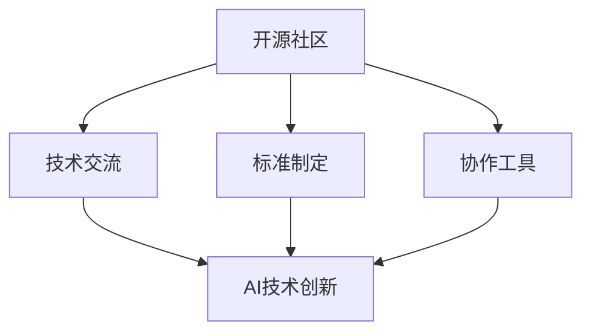

                 

# 开源技术推动AI进步的重要性

> 关键词：
- 开源社区
- 人工智能
- 技术交流
- 创新驱动
- 标准制定
- 协作工具

## 1. 背景介绍

### 1.1 问题由来
随着人工智能（AI）技术的迅猛发展，开源社区在AI领域的贡献日益凸显。开源技术以其开放性、共享性和协作性，加速了AI技术从实验室到产业化的进程。开源AI项目不仅提供了丰富的算法和模型资源，还吸引了全球开发者共同参与，推动了技术创新和生态建设。

近年来，人工智能领域涌现了大量优秀的开源项目，如TensorFlow、PyTorch、Scikit-learn等，这些项目不仅在学术界和工业界得到了广泛应用，也成为许多AI技术创新和产业化的基础。然而，开源技术的广泛应用也带来了新的挑战，如版权纠纷、标准不一、协作困难等。这些问题需要通过更深入的研究和合理的机制来解决。

## 2. 核心概念与联系

### 2.1 核心概念概述

本节将介绍几个与开源AI相关的核心概念及其相互联系。

- **开源社区**：由开发者共同维护、共享的代码库和相关资源，支持全球开发者协作创新。
- **AI技术创新**：通过开源社区的交流和合作，快速推进AI算法的优化和模型训练，提升AI技术的综合实力。
- **技术交流**：开源社区提供了一个技术交流的平台，促进了不同背景和专业之间的知识共享和合作。
- **标准制定**：开源社区通过讨论和投票，制定并推广AI领域的通用标准和最佳实践，提升整体技术水平。
- **协作工具**：开源社区提供了丰富的协作工具，如Git、Jupyter Notebook、Docker等，支持高效的团队合作。

这些概念之间的逻辑关系可以通过以下Mermaid流程图来展示：



该流程图展示了开源社区如何通过技术交流、标准制定和协作工具，推动AI技术创新。开源社区的开放性和共享性，使得不同背景和专业的开发者能够相互协作，共同推进AI技术的发展。

## 3. 核心算法原理 & 具体操作步骤
### 3.1 算法原理概述

开源AI技术的发展依赖于算法和模型的不断优化和创新。本文将以TensorFlow为例，阐述其核心算法原理和具体操作步骤。

### 3.2 算法步骤详解

TensorFlow是谷歌开源的一个机器学习框架，支持分布式计算和GPU加速，适用于深度学习模型的开发和训练。其核心算法包括：

1. **计算图**：TensorFlow采用计算图的方式，将模型的构建过程转换为计算图。每个节点代表一个操作，输入输出通过边连接。这种方式允许TensorFlow进行自动微分和优化，提升模型训练效率。

2. **反向传播**：TensorFlow通过反向传播算法，自动计算梯度并更新模型参数，实现端到端的模型训练。反向传播算法利用链式法则，计算损失函数对模型参数的梯度。

3. **分布式训练**：TensorFlow支持多台机器分布式训练，可以显著提升模型训练速度和效率。分布式训练通过数据并行和模型并行，将数据和模型任务分别分配到多个节点上，同时更新模型参数。

### 3.3 算法优缺点

开源AI技术如TensorFlow在推动AI进步方面具有以下优点：

- **开放性**：开源社区的代码和算法资源共享，便于全球开发者学习和使用。
- **社区支持**：开源社区拥有庞大的开发者群体，能够快速响应和解决问题。
- **高效性**：TensorFlow提供了高效的计算图和自动微分功能，支持分布式训练，提升模型训练效率。
- **跨平台支持**：TensorFlow支持多种平台，包括CPU、GPU、TPU等，便于不同硬件环境下的应用。

但开源AI技术也存在以下缺点：

- **标准不一**：不同开源项目可能存在兼容性问题，导致开发者需要掌握多种工具和技术。
- **复杂性**：开源AI框架涉及底层计算图和高级优化算法，门槛较高。
- **版权问题**：开源代码的版权问题可能导致版权纠纷，影响社区的协作和创新。

### 3.4 算法应用领域

开源AI技术已经广泛应用于多个领域，包括计算机视觉、自然语言处理、语音识别、推荐系统等。这里以计算机视觉和自然语言处理为例，介绍TensorFlow的应用：

- **计算机视觉**：TensorFlow提供了丰富的计算机视觉库，如TensorFlow Object Detection API，支持目标检测、图像分割、图像生成等任务。开发者可以通过自定义模型，快速部署视觉识别系统。

- **自然语言处理**：TensorFlow支持自然语言处理模型的开发，如BERT、GPT-2等模型。开发者可以通过微调这些模型，在机器翻译、文本分类、情感分析等任务上取得优异效果。

## 4. 数学模型和公式 & 详细讲解 & 举例说明

### 4.1 数学模型构建

TensorFlow的数学模型构建过程包括以下步骤：

1. **定义变量**：使用`tf.Variable`定义模型的变量，如权重和偏置等。

2. **定义模型结构**：使用`tf.keras.layers`等模块定义神经网络模型，包括卷积层、池化层、全连接层等。

3. **定义损失函数**：使用`tf.keras.losses`定义模型损失函数，如交叉熵损失、均方误差损失等。

4. **定义优化器**：使用`tf.keras.optimizers`定义优化器，如Adam、SGD等。

5. **定义评估指标**：使用`tf.keras.metrics`定义模型评估指标，如准确率、精确率、召回率等。

### 4.2 公式推导过程

以下是TensorFlow中卷积神经网络的公式推导过程：

卷积层公式为：
$$ y = \sigma(\text{conv}(x, w) + b) $$
其中，$x$为输入，$w$为卷积核，$b$为偏置，$\sigma$为激活函数。

池化层公式为：
$$ y = \text{pool}(x) $$
其中，$x$为输入，$\text{pool}$为池化操作。

全连接层公式为：
$$ y = \text{fc}(x, W) + b $$
其中，$x$为输入，$W$为权重矩阵，$b$为偏置。

### 4.3 案例分析与讲解

以下是一个简单的图像分类任务示例，通过TensorFlow实现：

```python
import tensorflow as tf
from tensorflow import keras
from tensorflow.keras import layers, models

# 定义模型
model = models.Sequential()
model.add(layers.Conv2D(32, (3, 3), activation='relu', input_shape=(28, 28, 1)))
model.add(layers.MaxPooling2D((2, 2)))
model.add(layers.Conv2D(64, (3, 3), activation='relu'))
model.add(layers.MaxPooling2D((2, 2)))
model.add(layers.Conv2D(64, (3, 3), activation='relu'))
model.add(layers.Flatten())
model.add(layers.Dense(64, activation='relu'))
model.add(layers.Dense(10, activation='softmax'))

# 编译模型
model.compile(optimizer='adam',
              loss='sparse_categorical_crossentropy',
              metrics=['accuracy'])

# 训练模型
model.fit(train_images, train_labels, epochs=5, 
          validation_data=(test_images, test_labels))
```

## 5. 项目实践：代码实例和详细解释说明
### 5.1 开发环境搭建

在TensorFlow开发环境中，需要安装Python、pip、TensorFlow等工具。具体步骤如下：

1. 安装Python：从官网下载并安装Python，确保最新版本支持TensorFlow。

2. 安装pip：从官网下载并安装pip，用于安装Python包。

3. 安装TensorFlow：使用pip安装TensorFlow，命令为`pip install tensorflow`。

4. 创建虚拟环境：使用`python -m venv myenv`创建虚拟环境，进入环境后激活，命令为`source myenv/bin/activate`。

### 5.2 源代码详细实现

以下是一个简单的图像分类任务的TensorFlow代码实现：

```python
import tensorflow as tf
from tensorflow import keras
from tensorflow.keras import layers, models

# 定义模型
model = models.Sequential()
model.add(layers.Conv2D(32, (3, 3), activation='relu', input_shape=(28, 28, 1)))
model.add(layers.MaxPooling2D((2, 2)))
model.add(layers.Conv2D(64, (3, 3), activation='relu'))
model.add(layers.MaxPooling2D((2, 2)))
model.add(layers.Conv2D(64, (3, 3), activation='relu'))
model.add(layers.Flatten())
model.add(layers.Dense(64, activation='relu'))
model.add(layers.Dense(10, activation='softmax'))

# 编译模型
model.compile(optimizer='adam',
              loss='sparse_categorical_crossentropy',
              metrics=['accuracy'])

# 训练模型
model.fit(train_images, train_labels, epochs=5, 
          validation_data=(test_images, test_labels))
```

### 5.3 代码解读与分析

以下是代码各部分的详细解读：

- **模型定义**：使用`Sequential`定义顺序模型，依次添加卷积层、池化层、全连接层等。

- **编译模型**：使用`compile`方法设置优化器、损失函数和评估指标。

- **训练模型**：使用`fit`方法训练模型，设置训练集、验证集和迭代轮数。

### 5.4 运行结果展示

训练过程可以使用TensorBoard进行可视化，输出训练过程中的损失和精度变化。具体步骤如下：

1. 安装TensorBoard：使用`pip install tensorboard`安装TensorBoard。

2. 启动TensorBoard：运行`tensorboard --logdir=path/to/logs`启动TensorBoard服务，通过浏览器访问`http://localhost:6006`查看训练结果。

## 6. 实际应用场景
### 6.1 医疗诊断

开源AI技术在医疗诊断领域具有重要应用价值。例如，TensorFlow支持医疗图像分析，可以对X光片、CT扫描等医学图像进行自动诊断。通过预训练模型和微调，可以识别病灶、肿瘤等关键区域，辅助医生进行诊断和治疗。

### 6.2 智能推荐

开源AI技术可以应用于智能推荐系统，提升推荐效果和用户满意度。例如，TensorFlow中的推荐系统库支持协同过滤、基于内容的推荐、深度学习推荐等多种推荐算法，可以应用于电商、视频、新闻等场景。

### 6.3 金融风控

开源AI技术在金融风控领域具有广泛应用。例如，TensorFlow支持时间序列分析和异常检测，可以对交易数据进行实时监控和风险预警。通过预训练模型和微调，可以检测出欺诈行为、异常交易等风险，提升金融机构的业务效率和风险管理能力。

### 6.4 未来应用展望

开源AI技术在更多领域具有广阔应用前景。未来，随着技术不断进步，开源AI将进一步推动AI技术的落地应用，提升各个行业的数字化水平。

## 7. 工具和资源推荐
### 7.1 学习资源推荐

- **官方文档**：TensorFlow官方文档提供了丰富的教程和API文档，是学习和使用TensorFlow的最佳资源。

- **在线课程**：如Coursera、Udacity等平台的TensorFlow课程，提供系统学习TensorFlow的机会。

- **开源项目**：GitHub上的TensorFlow项目提供了大量的代码示例和应用案例，可以从中学习和借鉴。

- **社区论坛**：TensorFlow社区和Stack Overflow等论坛，可以解决使用过程中遇到的问题，与全球开发者交流。

### 7.2 开发工具推荐

- **Git**：开源项目和代码版本控制的重要工具，可以协作管理和追踪代码变化。

- **Jupyter Notebook**：支持交互式编程和数据可视化的IDE，适合TensorFlow开发。

- **Docker**：容器化技术可以方便地部署和管理TensorFlow应用，提高开发和部署效率。

### 7.3 相关论文推荐

- **"TensorFlow: A System for Large-Scale Machine Learning"**：原论文介绍了TensorFlow的设计理念和技术实现，是理解TensorFlow的重要参考资料。

- **"Imagenet Classification with Deep Convolutional Neural Networks"**：AlexNet论文，展示了深度学习在图像分类任务上的应用效果，推动了深度学习的发展。

- **"Attention Is All You Need"**：Transformer论文，介绍了注意力机制在机器翻译等任务上的应用效果，开启了Transformer架构的时代。

## 8. 总结：未来发展趋势与挑战
### 8.1 研究成果总结

开源AI技术在推动AI进步方面取得了显著成效。TensorFlow等开源项目已经成为全球开发者广泛使用的工具，加速了AI技术的研发和应用。未来，开源AI将继续发挥其开放性和共享性的优势，推动AI技术的进一步发展。

### 8.2 未来发展趋势

未来，开源AI技术将呈现以下几个发展趋势：

- **技术融合**：开源AI技术将与其他新兴技术（如量子计算、区块链）进行融合，推动AI技术的跨界创新。

- **跨平台支持**：开源AI技术将支持更多的硬件平台和操作系统，提高其通用性和普及度。

- **安全性提升**：开源AI技术将引入更多安全性保障措施，如数据加密、模型审计等，提升AI系统的安全性和可靠性。

- **应用场景拓展**：开源AI技术将进一步拓展到更多垂直领域，如智能制造、智慧城市等，为各行各业提供解决方案。

### 8.3 面临的挑战

开源AI技术在推动AI进步的同时，也面临一些挑战：

- **标准不一**：不同开源项目存在兼容性问题，需要制定统一的标准和规范。

- **社区协作**：开源社区需要更多的协作机制，解决代码维护和更新问题。

- **版权问题**：开源代码的版权问题可能导致版权纠纷，影响社区的稳定和发展。

- **技术门槛**：开源AI技术的技术门槛较高，需要更多用户培训和社区支持。

### 8.4 研究展望

未来，开源AI技术需要在以下几个方面进行深入研究：

- **模型压缩与优化**：提升模型压缩和优化技术，减少计算资源消耗，提高模型部署效率。

- **协作工具优化**：优化协作工具和社区管理机制，提高开源项目的协作效率。

- **数据隐私保护**：加强数据隐私保护技术，确保AI系统的数据安全和用户隐私。

- **伦理与法规研究**：研究AI伦理和法规问题，推动AI技术的健康发展。

## 9. 附录：常见问题与解答

**Q1：开源AI技术有哪些优点？**

A: 开源AI技术具有以下优点：

- **开放性**：开源社区的代码和算法资源共享，便于全球开发者学习和使用。

- **社区支持**：开源社区拥有庞大的开发者群体，能够快速响应和解决问题。

- **高效性**：开源AI框架提供了高效的计算图和自动微分功能，支持分布式训练，提升模型训练效率。

- **跨平台支持**：开源AI框架支持多种平台，包括CPU、GPU、TPU等，便于不同硬件环境下的应用。

**Q2：开源AI技术有哪些缺点？**

A: 开源AI技术也存在以下缺点：

- **标准不一**：不同开源项目可能存在兼容性问题，导致开发者需要掌握多种工具和技术。

- **复杂性**：开源AI框架涉及底层计算图和高级优化算法，门槛较高。

- **版权问题**：开源代码的版权问题可能导致版权纠纷，影响社区的协作和创新。

**Q3：开源AI技术的应用场景有哪些？**

A: 开源AI技术已经广泛应用于多个领域，包括计算机视觉、自然语言处理、语音识别、推荐系统等。

**Q4：如何优化开源AI模型的性能？**

A: 优化开源AI模型的性能可以通过以下方法：

- **数据增强**：通过数据增强技术，扩充训练集，提高模型的泛化能力。

- **模型压缩**：使用模型压缩技术，减少计算资源消耗，提高模型部署效率。

- **超参数调优**：通过超参数调优，找到最优的模型配置，提升模型性能。

- **模型并行**：使用模型并行技术，提升模型的训练速度和效率。

通过不断优化开源AI模型，可以在保证性能的同时，提高模型的可部署性和实用性。

---

作者：禅与计算机程序设计艺术 / Zen and the Art of Computer Programming

