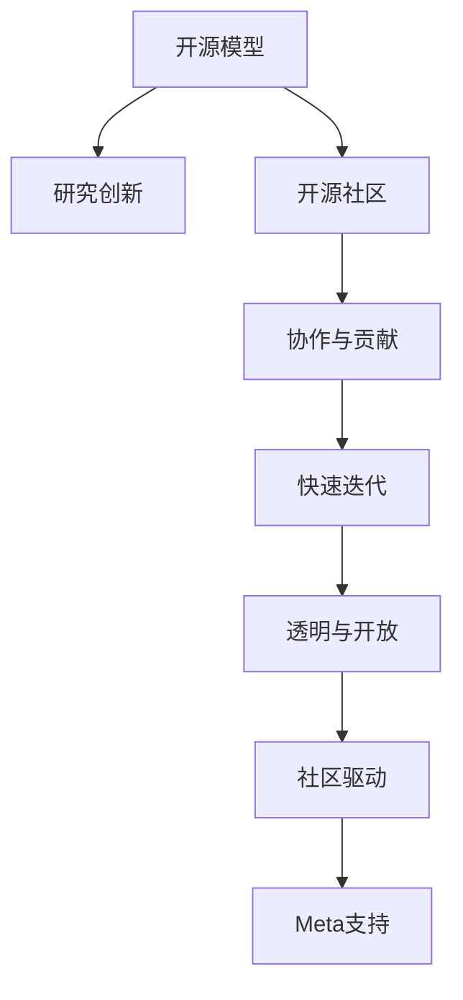

                 

# 开源模型的优势：促进研究创新，开源社区受益于Meta的支持

> 关键词：开源模型,研究创新,Meta,开源社区,协作,支持,数据分析,机器学习,深度学习,软件工程,开源文化

## 1. 背景介绍

### 1.1 问题由来
近年来，开源软件日益成为推动科技创新和产业发展的重要力量。尤其是开源模型，凭借其开源透明、社区驱动、快速迭代等优势，迅速成为数据科学家和工程师的研究首选。但随着开源社区的不断壮大，开源模型的维护和升级也变得越来越复杂。如何更好地支持开源模型，成为开源社区和各大技术公司共同关心的话题。

Meta作为全球领先的科技创新公司，积极参与开源社区建设，通过提供资金支持、技术合作、开源代码审查等多方面的支持，不断推动开源模型的发展。本文将从Meta支持开源模型的角度出发，详细探讨开源模型在推动研究创新、提升开源社区活力方面的优势和贡献。

### 1.2 问题核心关键点
开源模型的成功主要取决于以下几个核心关键点：

- **透明与开放**：开源模型的源代码、开发过程和贡献方式完全公开，任何人都可以自由查阅、使用和修改。这种开放性使得社区成员可以共同决策，推动模型迭代优化。
- **社区驱动**：开源模型依赖于社区的贡献，汇聚了全球范围内的开发者和技术专家，共同维护和迭代模型。
- **协作与贡献**：开源模型鼓励全球开发者积极参与贡献代码、文档、工具等，通过协作实现模型功能的提升和扩展。
- **快速迭代**：开源模型不受商业目标限制，能够快速响应最新的科研成果和技术趋势，实现快速迭代。
- **灵活适应**：开源模型具有高度的灵活性和可定制性，可以适应不同的应用场景和需求。
- **共享与复用**：开源模型成果可以被广泛复制和复用，推动了技术和知识的普及和传播。

这些关键点使得开源模型成为推动研究创新、加速科技发展的利器。

## 2. 核心概念与联系

### 2.1 核心概念概述

为更好地理解Meta支持开源模型的优势，本节将介绍几个密切相关的核心概念：

- **开源模型**：基于开源许可证授权的机器学习模型，源代码完全公开，任何人都可以自由查阅、使用和修改。如TensorFlow、PyTorch、Scikit-learn等。
- **研究创新**：通过开源模型，科研人员能够自由探索新的算法和应用，推动机器学习技术的不断进步。
- **开源社区**：围绕开源模型建立的开发者社区，以协作、贡献、分享为基本原则，共同维护和迭代模型。
- **Meta支持**：Meta积极参与开源社区建设，通过资金支持、技术合作、开源代码审查等方式，推动开源模型的发展。

这些核心概念之间的逻辑关系可以通过以下Mermaid流程图来展示：



这个流程图展示了一体化的开源模型生态系统，其中各个环节互相支持，共同推动模型的演进和应用。

## 3. 核心算法原理 & 具体操作步骤

### 3.1 算法原理概述

Meta对开源模型的支持，主要体现在以下几个方面：

- **资金支持**：Meta通过直接资金投入，支持开源社区的基础设施建设、项目运营和开发者激励。
- **技术合作**：Meta与开源社区紧密合作，提供技术支持、优化建议和创新解决方案。
- **开源代码审查**：Meta积极参与开源代码的审查，确保代码质量和社区标准的执行。
- **开源社区构建**：Meta通过举办线上线下活动、建立官方论坛等方式，促进开源社区的交流与合作。

这些支持方式，旨在推动开源模型的发展，促进研究创新，提升开源社区的活力和凝聚力。

### 3.2 算法步骤详解

Meta支持开源模型的具体步骤包括：

1. **资金支持**：Meta通过直接资助开源项目，提供必要的资金支持，确保项目的持续发展和社区的稳定运营。

2. **技术合作**：Meta与开源社区进行技术交流，提供技术解决方案和改进建议，推动模型的优化和功能的扩展。

3. **开源代码审查**：Meta组织专门的代码审查团队，对开源代码进行严格审查，确保代码质量和技术标准的执行。

4. **开源社区构建**：Meta通过举办Meetup、Workshop、Hackathon等活动，促进全球开源社区的交流与合作，增强社区的凝聚力和创新能力。

5. **持续优化与升级**：Meta不断优化和升级开源模型，推出新的算法和功能，支持社区的持续创新。

通过这些步骤，Meta有效地支持了开源模型的发展，促进了研究创新和开源社区的繁荣。

### 3.3 算法优缺点

开源模型在推动研究创新、提升开源社区活力方面具有以下优点：

1. **透明度高**：源代码完全公开，任何人都可以自由查阅、使用和修改，提高了代码的透明度和可理解性。
2. **社区驱动**：社区成员共同决策，推动模型迭代优化，具有高度的灵活性和适应性。
3. **快速迭代**：不受商业目标限制，能够快速响应最新的科研成果和技术趋势，实现快速迭代。
4. **协作与贡献**：鼓励全球开发者积极参与贡献代码、文档、工具等，实现技术的共享与复用。
5. **广泛适用**：具有高度的灵活性和可定制性，可以适应不同的应用场景和需求。

同时，开源模型也存在一些局限性：

1. **依赖社区**：社区的活跃度和贡献度直接影响模型的质量和进展，社区的不稳定可能导致模型维护的困难。
2. **质量参差不齐**：社区中各开发者水平不一，代码质量和风格可能存在较大差异。
3. **缺乏统一标准**：不同开源项目可能有不同的标准和规范，增加了使用的复杂性。
4. **商业化困难**：开源模型通常缺乏明确的商业模式，难以实现商业化运营。

尽管存在这些局限性，但开源模型的优势和潜力使其成为推动科技创新和产业升级的重要力量。

### 3.4 算法应用领域

开源模型在多个领域得到了广泛应用，如数据分析、机器学习、深度学习、软件工程等。具体应用包括：

- **数据分析**：开源模型提供了强大的数据分析能力，支持大规模数据处理和统计分析。
- **机器学习**：开源模型提供了丰富的机器学习算法和工具，支持模型训练、评估和优化。
- **深度学习**：开源模型提供了强大的深度学习框架，支持神经网络模型的设计和训练。
- **软件工程**：开源模型支持代码审查、版本控制、自动化测试等软件工程实践，提升开发效率和代码质量。

这些领域的应用，充分展示了开源模型在推动研究创新和产业升级方面的强大潜力。

## 4. 数学模型和公式 & 详细讲解 & 举例说明

### 4.1 数学模型构建

Meta支持的开源模型通常采用深度学习算法进行构建，其数学模型可以表示为：

$$
\mathcal{M} = \{f(x; \theta)\}_{\theta \in \Theta}
$$

其中 $x$ 为输入数据，$\theta$ 为模型参数，$\Theta$ 为参数空间，$f(x; \theta)$ 为模型在输入 $x$ 下的输出。开源模型的目标是通过优化参数 $\theta$，使得模型在特定任务上的性能最优。

### 4.2 公式推导过程

Meta在支持开源模型的过程中，涉及的数学推导主要包括模型训练和优化过程。以深度学习模型为例，常用的优化算法包括梯度下降（Gradient Descent, GD）、随机梯度下降（Stochastic Gradient Descent, SGD）和动量优化（Momentum Optimization）等。

梯度下降算法的更新公式为：

$$
\theta_{t+1} = \theta_t - \alpha \nabla_{\theta} \mathcal{L}(f(x; \theta_t))
$$

其中 $\alpha$ 为学习率，$\nabla_{\theta} \mathcal{L}(f(x; \theta_t))$ 为损失函数对参数 $\theta$ 的梯度。

随机梯度下降算法的更新公式为：

$$
\theta_{t+1} = \theta_t - \alpha \nabla_{\theta} \mathcal{L}(f(x_i; \theta_t))
$$

其中 $x_i$ 为训练集中的一个样本。

动量优化的更新公式为：

$$
\theta_{t+1} = \theta_t - \eta \frac{d\theta_t}{dt} + \mu \frac{d\theta_{t-1}}{dt}
$$

其中 $\eta$ 为学习率，$\mu$ 为动量系数，$\frac{d\theta_t}{dt}$ 为当前时间步的梯度。

通过这些算法，Meta能够支持开源模型的训练和优化，提高模型的性能和稳定性。

### 4.3 案例分析与讲解

以Meta支持的PyTorch框架为例，分析其在实际应用中的表现。PyTorch是一个高度灵活的深度学习框架，支持动态计算图和GPU加速，广泛应用于学术研究和工业部署。

PyTorch的主要特点包括：

1. **动态计算图**：支持动态计算图，使得模型构建和调试更加灵活。
2. **GPU加速**：支持GPU加速，提升计算效率和训练速度。
3. **丰富的API**：提供丰富的API接口，支持各类深度学习模型和算法。
4. **开源社区**：拥有庞大的开源社区，提供大量的模型和工具支持。

这些特点使得PyTorch成为推动研究创新和加速科技发展的利器。Meta通过提供资金支持、技术合作和代码审查等方式，进一步推动了PyTorch的繁荣发展。

## 5. 项目实践：代码实例和详细解释说明

### 5.1 开发环境搭建

在开始PyTorch项目前，需要先搭建好开发环境。以下是使用PyTorch进行模型开发的详细配置步骤：

1. **安装PyTorch**：从官网下载并安装PyTorch，选择对应的CPU或GPU版本。

2. **安装CUDA和cuDNN**：根据系统需求，安装对应的CUDA和cuDNN库。

3. **配置环境变量**：设置PYTHONPATH和CUDA_PATH等环境变量，确保PyTorch可以正确加载依赖库。

4. **安装依赖包**：安装必要的依赖包，如numpy、scipy、matplotlib等。

完成上述步骤后，即可在准备好的环境中进行PyTorch项目的开发。

### 5.2 源代码详细实现

以下是一个简单的PyTorch项目示例，展示了如何使用PyTorch进行模型训练和优化。

首先，定义模型的结构：

```python
import torch.nn as nn
import torch.optim as optim

class Net(nn.Module):
    def __init__(self):
        super(Net, self).__init__()
        self.fc1 = nn.Linear(784, 500)
        self.fc2 = nn.Linear(500, 10)
    
    def forward(self, x):
        x = nn.functional.relu(self.fc1(x))
        x = self.fc2(x)
        return x
```

然后，定义损失函数和优化器：

```python
criterion = nn.CrossEntropyLoss()
optimizer = optim.Adam(model.parameters(), lr=0.001)
```

最后，进行模型训练：

```python
for epoch in range(10):
    running_loss = 0.0
    for i, data in enumerate(trainloader, 0):
        inputs, labels = data
        optimizer.zero_grad()
        outputs = model(inputs)
        loss = criterion(outputs, labels)
        loss.backward()
        optimizer.step()
        running_loss += loss.item()
    print('Epoch %d loss: %.3f' % (epoch+1, running_loss/len(trainloader)))
```

通过以上代码，即可在PyTorch中进行模型的训练和优化。Meta提供的资金支持和技术合作，进一步提升了模型的训练效果和性能。

### 5.3 代码解读与分析

本文中的PyTorch项目示例，展示了使用PyTorch进行模型训练的基本流程。具体分析如下：

**模型结构**：定义了一个包含两个线性层的神经网络模型，用于图像分类任务。

**损失函数**：使用交叉熵损失函数，计算模型输出与真实标签之间的差异。

**优化器**：使用Adam优化器，调整模型参数以最小化损失函数。

**训练流程**：在每个epoch中，对训练集数据进行迭代训练，计算损失函数并更新模型参数。

通过PyTorch框架，Meta可以提供丰富的API接口和工具支持，使得模型训练和优化变得更加高效和灵活。开发者可以灵活使用这些工具，快速实现各种深度学习模型和算法。

## 6. 实际应用场景

### 6.1 数据分析

Meta支持的开源模型在数据分析领域得到了广泛应用。例如，通过TensorFlow，用户可以轻松进行大规模数据处理和统计分析，支持各种数据格式和操作。

### 6.2 机器学习

Meta支持的开源模型在机器学习领域具有强大的应用潜力。例如，通过PyTorch，用户可以灵活构建各种深度学习模型，支持模型训练、评估和优化。

### 6.3 深度学习

Meta支持的开源模型在深度学习领域应用广泛。例如，通过Keras，用户可以快速构建和训练各种神经网络模型，支持图像、文本、语音等多种数据类型的处理。

### 6.4 软件工程

Meta支持的开源模型在软件工程领域同样具有重要应用。例如，通过GitHub，用户可以协作开发和维护开源项目，提升开发效率和代码质量。

## 7. 工具和资源推荐

### 7.1 学习资源推荐

为了帮助开发者掌握开源模型和Meta的支持，这里推荐一些优质的学习资源：

1. **《PyTorch官方文档》**：提供详细的PyTorch框架介绍和使用方法，是学习PyTorch的必备资源。

2. **《TensorFlow官方文档》**：提供TensorFlow框架的详细使用指南，支持各种深度学习任务。

3. **《Scikit-learn官方文档》**：提供Scikit-learn库的详细使用方法，支持数据预处理、模型训练和评估等。

4. **《深度学习入门》**：一本深度学习入门的经典教材，涵盖了深度学习的基本概念和常用算法。

5. **《Keras官方文档》**：提供Keras框架的详细使用方法，支持各种神经网络模型的构建和训练。

6. **《GitHub官方文档》**：提供GitHub平台的详细使用方法，支持代码托管、协作和版本控制。

通过对这些资源的学习，相信开发者能够掌握开源模型和Meta支持的精髓，推动研究创新和开源社区的发展。

### 7.2 开发工具推荐

以下是几个常用的开源模型开发工具，可以帮助开发者更高效地进行项目开发：

1. **Jupyter Notebook**：支持Python代码的交互式编程和调试，方便进行数据探索和模型实验。

2. **Git**：支持版本控制和协作开发，方便进行代码管理。

3. **PyTorch**：支持深度学习模型构建和训练，提供动态计算图和GPU加速等优势。

4. **TensorFlow**：支持各种深度学习任务，提供丰富的API接口和工具支持。

5. **Keras**：支持快速构建和训练神经网络模型，支持各种数据类型的处理。

6. **PySpark**：支持大规模数据处理和分布式计算，支持Spark框架。

这些工具与Meta提供的资金支持和技术合作相结合，可以大大提升开发效率和模型性能。

### 7.3 相关论文推荐

Meta支持的开源模型在学术界和工业界都有广泛的研究应用。以下是几篇有代表性的相关论文，推荐阅读：

1. **《Deep Learning》**：Ian Goodfellow等人的经典教材，涵盖深度学习的各个方面。

2. **《Neural Networks and Deep Learning》**：Michael Nielsen的深度学习入门教材，详细介绍了深度学习的原理和实现。

3. **《TensorFlow: A Systematic Introduction》**：Maintainer团队编写的高质量教程，详细介绍了TensorFlow的使用方法。

4. **《PyTorch: Deep Learning for Humans》**：Michael Becker的PyTorch入门教程，详细介绍了PyTorch的使用方法和最佳实践。

5. **《Keras: Deep Learning with Python》**：Erhan Wieser等人的深度学习入门教材，详细介绍了Keras的使用方法。

通过这些论文的学习，可以深入理解开源模型的原理和应用，提升研究创新和实际开发的能力。

## 8. 总结：未来发展趋势与挑战

### 8.1 研究成果总结

Meta对开源模型的支持，主要体现在资金支持、技术合作、开源代码审查等方面，极大地推动了开源模型的发展，促进了研究创新和开源社区的活力。通过这些支持，开源模型在数据分析、机器学习、深度学习、软件工程等领域得到了广泛应用，展示了其强大的应用潜力。

### 8.2 未来发展趋势

未来，Meta将进一步推动开源模型的发展，推动研究创新和开源社区的活力。具体趋势包括：

1. **模型复杂度提升**：随着算力的提升，模型规模将不断扩大，模型的复杂度和性能将进一步提升。

2. **应用场景拓展**：开源模型将不断拓展到更多领域，如医疗、金融、教育等，提升各行业的科技水平。

3. **开源社区壮大**：开源社区将进一步壮大，汇聚更多开发者和技术专家，共同维护和迭代模型。

4. **生态系统完善**：开源社区将建立更完善的生态系统，提供更多的工具和资源，推动模型的应用和发展。

5. **技术融合加速**：开源模型将与其他技术如人工智能、大数据、物联网等进行更深入的融合，推动技术的创新和发展。

6. **国际合作加强**：Meta将加强与全球开源社区的合作，推动技术的全球化应用和普及。

这些趋势将进一步推动开源模型的发展，提升其应用价值和影响力。

### 8.3 面临的挑战

尽管Meta对开源模型的支持取得了显著成效，但仍面临一些挑战：

1. **社区稳定性**：开源社区的活跃度和贡献度直接影响模型的质量和进展，社区的不稳定可能导致模型维护的困难。

2. **质量参差不齐**：社区中各开发者水平不一，代码质量和风格可能存在较大差异。

3. **商业化困难**：开源模型通常缺乏明确的商业模式，难以实现商业化运营。

4. **技术标准化**：不同开源项目可能有不同的标准和规范，增加了使用的复杂性。

5. **安全性和隐私保护**：开源模型可能涉及敏感数据和隐私问题，需要加强安全和隐私保护。

6. **国际合作复杂性**：跨国合作面临语言和文化差异，需要建立有效的沟通和协作机制。

这些挑战需要Meta和开源社区共同努力，持续优化和改进，才能进一步提升开源模型的质量和应用价值。

### 8.4 研究展望

Meta对开源模型的支持将持续推动研究创新和开源社区的发展。未来，需要在以下几个方面进行深入研究：

1. **模型性能优化**：优化模型结构，提升模型的训练速度和性能。

2. **社区协作机制**：建立更加高效的社区协作机制，提升社区的凝聚力和创新能力。

3. **开源代码质量**：提高开源代码的质量和标准化，确保代码的可维护性和可复用性。

4. **技术标准化**：制定统一的技术标准和规范，提升开源模型的可移植性和兼容性。

5. **商业化策略**：探索开源模型的商业化策略，推动开源模型在商业领域的广泛应用。

6. **安全性和隐私保护**：加强开源模型的安全性和隐私保护，确保数据和模型的安全。

通过持续的研究和改进，Meta将进一步推动开源模型的发展，为科研创新和产业升级提供强大的技术支持。

## 9. 附录：常见问题与解答

**Q1：开源模型如何保证代码质量？**

A: 开源模型的代码质量主要依赖于社区的贡献和审查。Meta通过开源代码审查，确保代码的规范性和可理解性。同时，社区成员可以自由查阅和修改代码，提出改进建议，提升代码质量。

**Q2：开源模型在实际应用中如何保证性能？**

A: 开源模型的性能主要依赖于模型的架构和优化策略。Meta通过提供资金支持和技术合作，支持模型优化和升级，确保模型的性能和稳定性。

**Q3：开源模型的商业化前景如何？**

A: 开源模型通常缺乏明确的商业模式，难以实现商业化运营。Meta通过探索开源模型的商业化策略，推动开源模型在商业领域的广泛应用。

**Q4：开源模型的国际合作面临哪些挑战？**

A: 跨国合作面临语言和文化差异，需要建立有效的沟通和协作机制。Meta将加强与全球开源社区的合作，推动技术的全球化应用和普及。

通过这些常见问题的解答，可以更好地理解Meta对开源模型的支持和未来发展方向。

---

作者：禅与计算机程序设计艺术 / Zen and the Art of Computer Programming

