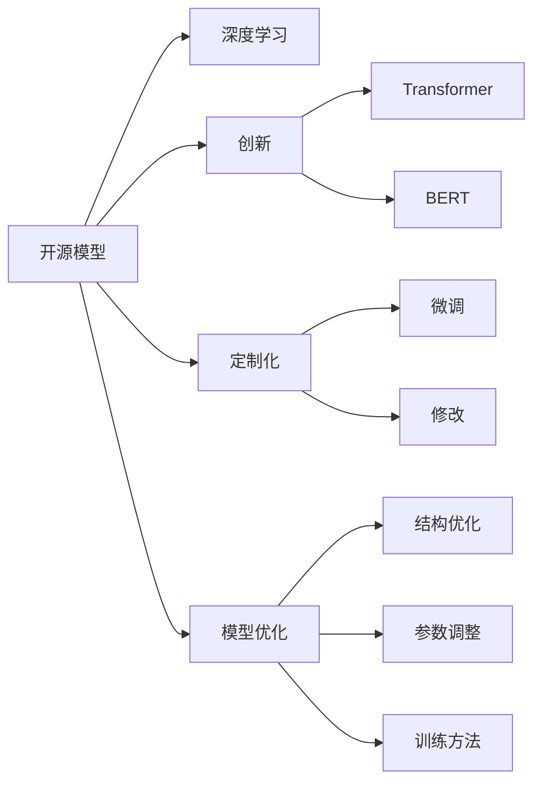
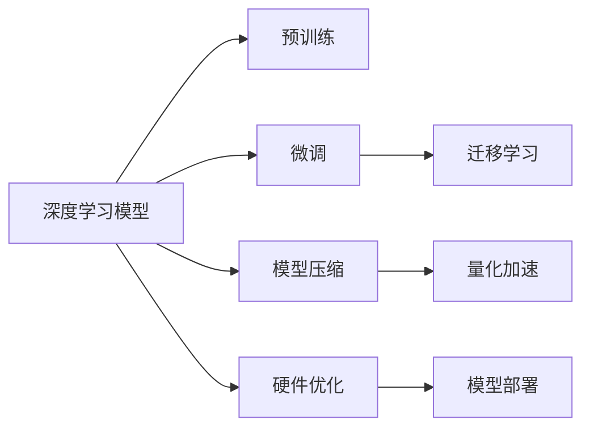

                 

# 开源模型的发展：贾扬清的观点，创新与定制化优势助力发展

> 关键词：开源模型,创新,定制化,深度学习,AI,贾扬清,模型优化

## 1. 背景介绍

随着人工智能(AI)技术的快速发展，开源模型在科学研究和工业应用中发挥着越来越重要的作用。越来越多的研究者、工程师和科学家投入到开源模型的开发和应用中，这不仅加速了AI技术的进步，也推动了整个科技行业的创新和发展。本文将从贾扬清教授的角度，探讨开源模型发展的现状、挑战与未来趋势，强调创新和定制化在推动开源模型进步中的关键作用。

## 2. 核心概念与联系

### 2.1 核心概念概述

- **开源模型**：基于开源许可证的深度学习模型，允许任何人免费使用、修改和分发，促进了AI技术的普及和创新。

- **深度学习**：一种基于神经网络的机器学习方法，能够处理复杂的数据和非线性关系，广泛应用于图像识别、语音识别、自然语言处理等领域。

- **创新**：在开源模型开发和应用中引入的新技术、新算法和新设计，如Transformer、BERT等，推动了AI技术的边界不断扩展。

- **定制化**：针对特定应用场景或需求，对开源模型进行微调或修改，以提高其适用性和性能。

- **模型优化**：通过对模型结构、参数和训练方法进行改进，提升模型的准确性、效率和稳定性。

这些核心概念通过以下Mermaid流程图来展示它们之间的联系：



这个流程图展示了一个开源模型从诞生到应用的整个生命周期：

1. 开源模型基于深度学习技术。
2. 在模型开发和应用过程中引入创新技术，如Transformer和BERT。
3. 为了提高模型的适用性和性能，进行定制化修改，如微调和参数调整。
4. 通过优化模型结构和训练方法，进一步提升模型性能。

### 2.2 核心概念原理和架构的 Mermaid 流程图

下面是一个简单的Mermaid流程图，展示了从深度学习模型到开源模型的构建和优化过程：



这个流程图示例说明了深度学习模型在开源过程中的关键步骤：

1. 深度学习模型通过预训练学习通用知识。
2. 通过微调和迁移学习针对特定任务进行优化。
3. 模型压缩、量化加速和硬件优化以提高性能。
4. 最终部署到实际应用中。

## 3. 核心算法原理 & 具体操作步骤

### 3.1 算法原理概述

开源模型的发展得益于深度学习算法的不断创新和优化。以下是几个关键算法原理：

- **Transformer算法**：Transformer通过自注意力机制，提升了模型的并行计算能力和表现力，成为当前最先进的深度学习算法之一。

- **BERT算法**：BERT通过双向上下文表示学习，捕捉了文本中的丰富语义信息，提升了自然语言处理任务的性能。

- **模型压缩和量化**：通过模型剪枝、知识蒸馏等方法，减少模型的参数量和计算量，提升推理效率。

- **硬件优化**：利用GPU、TPU等硬件加速技术，加速模型的前向和反向传播过程，提高训练和推理速度。

- **微调和迁移学习**：通过在特定任务上微调模型，或利用预训练模型的迁移学习能力，提升模型在特定场景下的性能。

### 3.2 算法步骤详解

开源模型的开发和优化通常包括以下步骤：

1. **模型设计**：选择合适的深度学习框架和模型结构，如TensorFlow、PyTorch、BERT等。
2. **数据预处理**：收集和清洗数据集，进行分词、标准化等处理，生成训练集和验证集。
3. **模型训练**：使用优化器进行模型训练，如Adam、SGD等，通过反向传播更新模型参数。
4. **模型评估**：在验证集上评估模型性能，如准确率、F1分数等指标。
5. **模型优化**：通过模型压缩、量化、硬件优化等方法提升模型性能。
6. **模型部署**：将训练好的模型部署到实际应用中，如推理服务、API接口等。

### 3.3 算法优缺点

开源模型具有以下优点：

- **灵活性**：任何人都可以免费使用、修改和分发开源模型，促进了学术和工业界的合作与创新。
- **透明度**：开源模型通常具有高透明度，用户可以查阅源代码和算法实现，进行独立验证和改进。
- **社区支持**：开源模型有强大的社区支持，可以快速获取反馈、修复漏洞和改进功能。

同时，开源模型也存在一些缺点：

- **性能瓶颈**：大规模深度学习模型的计算和存储需求巨大，往往需要高性能硬件支持。
- **过度依赖算法**：开源模型的性能很大程度上取决于算法的先进性和优化程度，对算法创新提出较高要求。
- **可解释性不足**：深度学习模型往往是"黑盒"系统，难以解释其内部工作机制和决策逻辑。

### 3.4 算法应用领域

开源模型在各个领域中得到了广泛应用：

- **自然语言处理(NLP)**：开源模型如BERT、GPT等，在文本分类、情感分析、问答系统等任务上取得了优异性能。
- **计算机视觉(CV)**：开源模型如ResNet、Inception等，在图像识别、目标检测、图像生成等任务上表现出色。
- **语音识别**：开源模型如DeepSpeech、Wav2Vec等，在语音转文本、语音合成等任务上实现了突破。
- **推荐系统**：开源模型如LightFM、DeepFM等，在个性化推荐、广告推荐等任务上提升了用户体验。
- **医疗健康**：开源模型如ImageNet、ChestX-ray8等，在医学图像分析、疾病预测等任务上提供了支持。

## 4. 数学模型和公式 & 详细讲解 & 举例说明

### 4.1 数学模型构建

我们以自然语言处理(NLP)中的BERT模型为例，展示其数学模型构建过程。

BERT的数学模型可以表示为：

$$
y = f(x; \theta) = \text{softmax}(\text{MLP}(\text{Attention}(x, x)))
$$

其中，$f$ 表示模型函数，$x$ 表示输入的文本序列，$\theta$ 表示模型参数，$\text{MLP}$ 表示多层次感知机，$\text{Attention}$ 表示自注意力机制。

### 4.2 公式推导过程

在BERT模型中，自注意力机制的公式为：

$$
\text{Attention}(x, x) = \text{softmax}(Q \cdot K^T / \sqrt{d_k}) \cdot V
$$

其中，$Q$、$K$、$V$ 分别是查询、键、值矩阵，$d_k$ 是键向量的维度。

### 4.3 案例分析与讲解

以情感分析任务为例，展示如何使用预训练的BERT模型进行微调。

1. **数据准备**：收集情感标注数据集，划分为训练集和验证集。
2. **模型加载**：加载预训练的BERT模型，通常使用BERT-base或BERT-large两种版本。
3. **任务适配**：在模型顶部添加全连接层和softmax函数，用于二分类任务。
4. **微调训练**：在训练集上微调模型，学习情感分类任务。
5. **模型评估**：在验证集上评估模型性能，调整学习率、批量大小等超参数。
6. **模型部署**：将微调后的模型部署到实际应用中，进行情感分析。

## 5. 项目实践：代码实例和详细解释说明

### 5.1 开发环境搭建

以下是使用Python和PyTorch搭建深度学习模型的环境：

1. 安装Python：选择Python 3.7及以上版本，确保环境稳定。
2. 安装PyTorch：通过pip安装PyTorch，建议选择GPU版本的安装。
3. 安装相关库：安装Tensorboard、tqdm等常用库，用于模型训练和调试。
4. 安装数据集：下载和使用公开数据集，如MNIST、CIFAR等。

### 5.2 源代码详细实现

下面是一个简单的代码示例，展示如何使用PyTorch加载和微调BERT模型：

```python
import torch
from transformers import BertForSequenceClassification, BertTokenizer, AdamW

# 加载数据集
train_dataset = ...
dev_dataset = ...

# 初始化BERT模型
model = BertForSequenceClassification.from_pretrained('bert-base-uncased', num_labels=2)

# 初始化优化器和分词器
tokenizer = BertTokenizer.from_pretrained('bert-base-uncased')
optimizer = AdamW(model.parameters(), lr=2e-5)

# 定义训练和评估函数
def train_epoch(model, dataset, batch_size, optimizer):
    # 省略具体实现
    pass

def evaluate(model, dataset, batch_size):
    # 省略具体实现
    pass

# 训练和评估
epochs = 3
batch_size = 16

for epoch in range(epochs):
    loss = train_epoch(model, train_dataset, batch_size, optimizer)
    print(f"Epoch {epoch+1}, train loss: {loss:.3f}")

    print(f"Epoch {epoch+1}, dev results:")
    evaluate(model, dev_dataset, batch_size)
    
print("Test results:")
evaluate(model, test_dataset, batch_size)
```

### 5.3 代码解读与分析

这个代码示例展示了深度学习模型微调的基本流程：

1. **数据准备**：通过分词和标准化处理，将文本数据转换为模型所需的格式。
2. **模型加载**：使用预训练的BERT模型和分词器。
3. **任务适配**：在模型顶部添加分类层和损失函数。
4. **优化器选择**：使用AdamW优化器，调整学习率。
5. **训练和评估**：在训练集上训练模型，在验证集上评估性能。
6. **模型部署**：将训练好的模型部署到实际应用中，进行推理预测。

## 6. 实际应用场景

### 6.1 自然语言处理

在自然语言处理(NLP)中，开源模型如BERT、GPT等在文本分类、情感分析、问答系统等任务上表现出色。以BERT为例，其双向上下文表示学习机制，能够捕捉丰富的语义信息，提升了文本分类任务的精度。

### 6.2 计算机视觉

在计算机视觉(CV)领域，开源模型如ResNet、Inception等在图像识别、目标检测、图像生成等任务上取得了突破。以ResNet为例，其残差结构能够缓解梯度消失问题，提高了深层神经网络的训练效率和精度。

### 6.3 语音识别

在语音识别领域，开源模型如DeepSpeech、Wav2Vec等在语音转文本、语音合成等任务上实现了突破。以DeepSpeech为例，其端到端模型能够直接从原始音频信号中提取文本信息，提升了语音识别的准确性和效率。

### 6.4 未来应用展望

未来，开源模型将在更多领域中发挥重要作用：

- **智能交通**：开源模型在交通数据分析、智能导航等任务上能够提供实时、高效的支持。
- **智能制造**：开源模型在工业质量检测、设备维护等任务上能够提升生产效率和精度。
- **智能医疗**：开源模型在医学影像分析、疾病预测等任务上能够提供可靠的医疗支持。

## 7. 工具和资源推荐

### 7.1 学习资源推荐

1. **Coursera**：提供深度学习、自然语言处理等课程，适合初学者和进阶学习者。
2. **Kaggle**：提供大量的数据集和竞赛，适合实战练习和应用开发。
3. **GitHub**：提供丰富的开源代码和项目，适合查找和借鉴优秀实践。

### 7.2 开发工具推荐

1. **PyTorch**：基于Python的深度学习框架，易于使用和扩展。
2. **TensorFlow**：由Google开发的深度学习框架，支持多种硬件和部署方式。
3. **Jupyter Notebook**：强大的代码编写和展示工具，支持Python和R等语言。

### 7.3 相关论文推荐

1. **《Attention is All You Need》**：Transformer论文，提出了自注意力机制，推动了深度学习的发展。
2. **《BERT: Pre-training of Deep Bidirectional Transformers for Language Understanding》**：BERT论文，提出了双向上下文表示学习，提升了NLP任务的性能。
3. **《Deep Learning》**：深度学习领域的经典教材，涵盖深度学习的基本概念和算法。

## 8. 总结：未来发展趋势与挑战

### 8.1 研究成果总结

开源模型在深度学习领域取得了巨大的成功，推动了AI技术的普及和创新。其核心优势在于灵活性、透明度和社区支持，但也面临计算资源瓶颈、算法依赖和可解释性不足等问题。

### 8.2 未来发展趋势

未来，开源模型将呈现以下几个发展趋势：

1. **算法创新**：引入更多的创新算法和技术，如Transformer、BERT等，提升模型的性能和泛化能力。
2. **定制化开发**：针对特定应用场景进行定制化开发，提升模型的适用性和性能。
3. **硬件优化**：利用高性能硬件如GPU、TPU等，提升模型训练和推理的效率。
4. **模型压缩和量化**：通过模型压缩和量化等技术，减少模型参数和计算量，提升推理速度。

### 8.3 面临的挑战

尽管开源模型具有诸多优势，但也面临以下挑战：

1. **计算资源瓶颈**：大规模深度学习模型的计算和存储需求巨大，往往需要高性能硬件支持。
2. **算法依赖**：开源模型的性能很大程度上取决于算法的先进性和优化程度，对算法创新提出较高要求。
3. **可解释性不足**：深度学习模型往往是"黑盒"系统，难以解释其内部工作机制和决策逻辑。

### 8.4 研究展望

未来，开源模型的研究需要在以下几个方向进行探索：

1. **算法优化**：通过优化算法和模型结构，提升模型的准确性和效率。
2. **模型压缩和量化**：减少模型的参数量和计算量，提升推理速度和资源利用率。
3. **可解释性研究**：开发可解释性强的模型，提升模型在实际应用中的可靠性和安全性。

## 9. 附录：常见问题与解答

**Q1: 如何选择合适的深度学习框架？**

A: 根据任务需求和开发经验选择合适的深度学习框架。通常PyTorch和TensorFlow都是不错的选择，前者易于使用和调试，后者支持多种硬件和部署方式。

**Q2: 如何提升深度学习模型的性能？**

A: 提升模型性能的方法包括算法优化、模型压缩和量化、硬件加速等。可以通过调整超参数、增加数据量、引入先验知识等方法进行优化。

**Q3: 深度学习模型有哪些应用场景？**

A: 深度学习模型在图像识别、语音识别、自然语言处理、推荐系统、医疗健康等领域都有广泛应用。具体应用场景需要根据实际需求进行选择和优化。

---

作者：禅与计算机程序设计艺术 / Zen and the Art of Computer Programming

