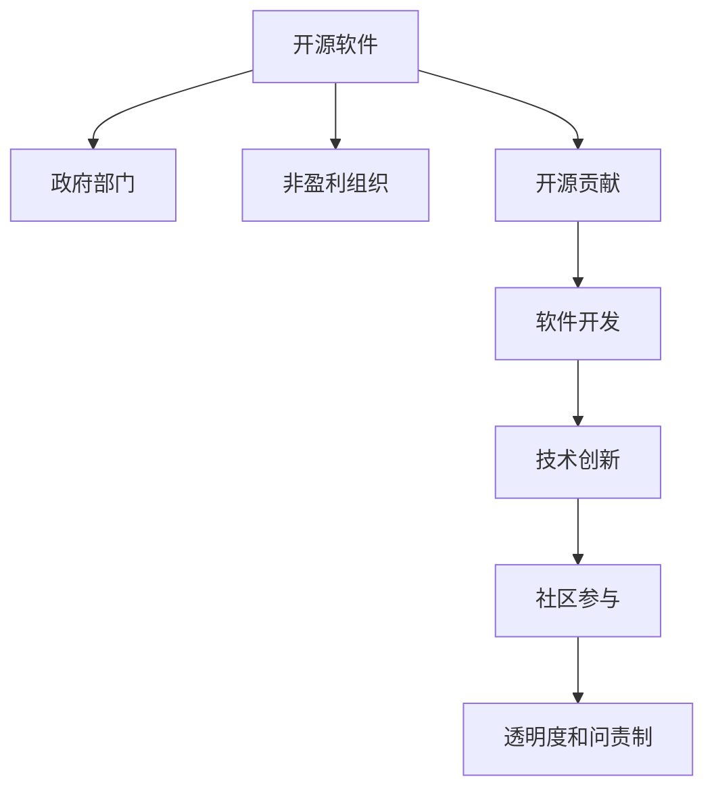

                 

# 开源贡献在政府和非盈利部门的机会

> 关键词：开源，政府部门，非盈利组织，技术贡献，软件开发，创新，社区参与

## 1. 背景介绍

### 1.1 问题由来
在数字化时代，开源软件因其开放性、灵活性和社区驱动的创新，成为了推动技术进步的重要力量。从操作系统到数据库，从云服务到物联网，开源软件几乎涵盖了所有技术领域。然而，开源软件在公共部门的应用仍相对较少。虽然一些政府和非盈利组织已经开始接受开源解决方案，但整体的采纳率仍然较低。

### 1.2 问题核心关键点
开源软件在公共部门面临的主要挑战包括：
1. **安全性和合规性**：公共部门需要严格的数据保护和隐私政策，确保开源软件的合规性。
2. **复杂性和学习曲线**：公共部门的技术团队可能缺乏开源软件的经验，导致实施难度增大。
3. **成本和资源**：开源软件的复杂性和社区驱动的模型可能增加初始成本，同时对技术资源的需求较高。
4. **可维护性和更新**：开源软件依赖于社区的持续更新和维护，公共部门可能缺乏足够的技术资源进行维护。

### 1.3 问题研究意义
开源软件在公共部门的应用可以带来多方面的益处，包括但不限于：
1. **成本节约**：通过使用开源软件，公共部门可以节省大量购买商业软件的费用。
2. **技术创新**：开源社区提供了持续的技术创新和改进，帮助公共部门保持技术领先。
3. **灵活性和适应性**：开源软件提供了高度的灵活性和定制化能力，满足公共部门的特殊需求。
4. **透明度和问责制**：开源软件的代码开放性提高了透明度，便于监督和审计。
5. **社区协作**：公共部门可以利用开源社区的知识共享和协作，提升技术能力。

## 2. 核心概念与联系

### 2.1 核心概念概述

为了更好地理解开源软件在政府和非盈利部门的应用，本节将介绍几个密切相关的核心概念：

- **开源软件**：指源代码开放的计算机软件，用户可以自由使用、修改和分发，如Linux、Apache Hadoop等。
- **政府部门**：指执行国家或地方政府职能的机构，如联邦政府、州政府、地方政府等。
- **非盈利组织**：指不以营利为目的的组织，如慈善机构、研究机构等。
- **开源贡献**：指开发者向开源社区提交代码、文档、测试报告等，促进社区的共同进步。
- **软件开发**：指将软件需求转化为实际软件产品的过程，包括需求分析、设计、编码、测试、部署等环节。
- **技术创新**：指通过引入新技术、新方法和新理念，提升软件和系统的功能和性能。
- **社区参与**：指开发者、用户和其他利益相关者积极参与开源社区的活动，如贡献代码、参与讨论、组织活动等。

这些核心概念之间的逻辑关系可以通过以下Mermaid流程图来展示：



这个流程图展示开源软件、政府部门、非盈利组织和开源贡献等核心概念之间的逻辑关系。开源贡献是连接开发者和公共部门的重要桥梁，通过开源软件促进技术创新和社区协作，提升公共部门的信息化水平。

## 3. 核心算法原理 & 具体操作步骤
### 3.1 算法原理概述

开源贡献的核心算法原理基于开源社区的协作模式和软件开发方法论。其基本思想是：通过开发者向开源社区贡献代码、文档、测试报告等，促进社区的共同进步，从而提升开源软件的功能和性能。

开源贡献的算法原理包括以下几个关键点：
1. **代码贡献**：开发者将新的代码提交到开源项目的仓库，解决已知问题或引入新功能。
2. **文档贡献**：开发者撰写和更新文档，帮助用户更好地理解和使用软件。
3. **测试贡献**：开发者编写和执行测试，验证软件的功能和性能，并发现潜在问题。
4. **社区协作**：开发者参与社区讨论、组织活动、编写教程等，促进知识的共享和传播。
5. **透明度和问责制**：开源社区通过代码审查、贡献者认证、版本控制等机制，确保代码的质量和可信度。

### 3.2 算法步骤详解

开源贡献的算法步骤包括以下几个关键环节：

**Step 1: 了解开源项目**
- 选择适合自己的开源项目，了解其技术栈、社区活跃度、贡献指南等。
- 关注项目的GitHub页面、邮件列表、论坛等，获取最新的项目动态和贡献机会。

**Step 2: 准备贡献环境**
- 安装相关开发工具，如IDE、版本控制系统（如Git）、编译器等。
- 搭建开发环境，确保能够本地构建和测试代码。
- 设置CI/CD流程，自动构建和部署代码。

**Step 3: 提交代码和文档**
- 阅读贡献指南，了解提交代码和文档的流程和格式要求。
- 编写和测试代码，确保代码质量和可靠性。
- 撰写详细的文档和示例，帮助用户理解代码的功能和使用。

**Step 4: 参与社区活动**
- 加入项目的邮件列表、论坛等，参与社区讨论和活动。
- 阅读和回复讨论，提出问题和建议，分享经验和知识。
- 组织和参与社区活动，如技术讲座、代码评审、黑客松等。

**Step 5: 贡献反馈和优化**
- 定期检查贡献的代码和文档，接受社区的反馈和改进建议。
- 修复和优化代码，确保其性能和稳定性。
- 更新和扩展文档，确保其准确性和全面性。

### 3.3 算法优缺点

开源贡献的算法具有以下优点：
1. **社区驱动**：开源社区的集体智慧和协作能力，可以快速解决问题和引入新功能。
2. **技术创新**：开源社区的持续创新和改进，推动技术进步。
3. **成本节约**：使用开源软件可以节省大量的开发和维护成本。
4. **灵活性**：开源软件可以根据特定需求进行定制和扩展。

同时，该算法也存在一些局限性：
1. **复杂性**：开源社区的复杂性和多样性，可能导致学习和使用难度增大。
2. **标准化**：开源社区的标准和规范可能与公共部门的需求不同，需要额外适配。
3. **可维护性**：开源社区的贡献者可能不固定，导致代码和文档的持续维护存在风险。
4. **安全性和合规性**：开源社区的代码和文档可能缺乏安全性和合规性审查。

### 3.4 算法应用领域

开源贡献的算法广泛应用于政府和非盈利部门，涉及以下多个领域：

- **政府IT基础设施**：如Linux、Apache Hadoop、MySQL等开源软件广泛应用于政府的数据中心、网络基础设施和应用系统。
- **公共服务**：如开源GIS软件、开源图书馆管理系统、开源电子政务系统等，提升公共服务的效率和透明度。
- **教育和研究**：如开源的科学计算软件、开源的教育平台、开源的研究工具等，支持教育和科研活动。
- **环境保护**：如开源的气候模型、开源的环境监测系统、开源的生态保护工具等，推动环境保护和可持续发展。
- **健康和医疗**：如开源的医疗信息管理系统、开源的健康监测工具、开源的公共卫生平台等，提升公共卫生服务质量。

## 4. 数学模型和公式 & 详细讲解  
### 4.1 数学模型构建

本节将使用数学语言对开源贡献的算法进行更加严格的刻画。

假设一个开源项目 $P$ 拥有 $N$ 个贡献者，每个贡献者 $i$ 的贡献量为 $c_i$，则总贡献量为：

$$
C = \sum_{i=1}^N c_i
$$

贡献者 $i$ 的贡献价值 $v_i$ 由其贡献量 $c_i$ 和贡献质量 $q_i$ 决定，公式为：

$$
v_i = c_i \times q_i
$$

其中 $q_i$ 可通过代码审查、测试报告、文档质量等指标进行评估。

### 4.2 公式推导过程

以代码贡献为例，假设代码贡献量为 $c_i$，贡献者 $i$ 贡献的代码通过审查的概率为 $p_i$，则贡献价值 $v_i$ 为：

$$
v_i = c_i \times p_i \times w
$$

其中 $w$ 为代码审查的价值权重，可通过社区共识确定。

### 4.3 案例分析与讲解

考虑一个开源社区 $S$，其中有 $M$ 个项目 $P_1, P_2, ..., P_M$。假设社区中有 $N_1, N_2, ..., N_M$ 个贡献者，每个贡献者对所有项目的平均贡献量为 $c$。则社区的总贡献量为：

$$
C = \sum_{m=1}^M \sum_{i=1}^{N_m} c_i
$$

根据上述公式，社区的总贡献价值 $V$ 为：

$$
V = \sum_{m=1}^M \sum_{i=1}^{N_m} v_i
$$

## 5. 项目实践：代码实例和详细解释说明
### 5.1 开发环境搭建

在进行开源贡献实践前，我们需要准备好开发环境。以下是使用Python进行Git进行版本控制和开发环境配置的流程：

1. 安装Git：从官网下载并安装Git，用于版本控制和协作开发。
2. 创建本地仓库：在本地创建一个Git仓库，用于存储代码和文档。
3. 克隆项目仓库：使用Git克隆开源项目的仓库到本地。
4. 设置贡献指南：阅读开源项目的贡献指南，了解提交代码和文档的流程和格式要求。
5. 搭建开发环境：安装相关开发工具，如IDE、编译器等。
6. 设置CI/CD流程：配置CI/CD流程，自动构建和部署代码。

完成上述步骤后，即可在本地环境下进行代码贡献和测试。

### 5.2 源代码详细实现

这里我们以贡献开源的Linux内核为例，给出使用Git进行开源贡献的PyTorch代码实现。

首先，了解Linux内核的贡献指南和开发环境：

```bash
# 克隆项目到本地
git clone https://git.kernel.org/pub/scm/linux/kernel/git/torvalds/linux.git

# 进入项目目录
cd linux

# 读取贡献指南
cat CONTRIBUTING.md
```

然后，编写和提交代码：

```bash
# 创建新分支
git checkout -b my-contribution

# 编写代码
vim my_contribution.c

# 提交代码
git add my_contribution.c
git commit -m "Add my_contribution.c"

# 推送到远程仓库
git push origin my-contribution
```

接着，进行代码审查和合并：

```bash
# 打开代码审查
git send-email my-contribution.patch --to linux@vger.kernel.org --cc <your-email>

# 接受代码合并
git rebase master
git checkout master
git merge my-contribution
```

最后，更新文档和发布代码：

```bash
# 更新文档
git checkout -b my-documentation
vim README.md

# 提交文档
git add README.md
git commit -m "Update README.md"
git push origin my-documentation

# 发布代码
git checkout master
git rebase master
git checkout my-contribution
git push origin my-contribution
```

以上就是使用Git进行开源贡献的完整代码实现。可以看到，通过Git，开发者可以方便地进行代码的提交、审查、合并和发布，从而有效地参与开源社区的贡献。

### 5.3 代码解读与分析

让我们再详细解读一下关键代码的实现细节：

**git clone命令**：
- 从Git仓库克隆项目到本地，`https://git.kernel.org/pub/scm/linux/kernel/git/torvalds/linux.git`为项目地址。

**git checkout命令**：
- 创建一个新的分支`my-contribution`，用于进行代码贡献。

**vim命令**：
- 使用vim编辑器编写和修改代码文件`my_contribution.c`。

**git add和git commit命令**：
- `git add my_contribution.c`将修改后的代码文件添加到本地仓库。
- `git commit -m "Add my_contribution.c"`提交代码变更，并附上提交信息。

**git push命令**：
- `git push origin my-contribution`将本地代码变更推送到远程仓库的`my-contribution`分支。

**git send-email命令**：
- 打开代码审查，将代码变更通过邮件发送给项目的维护者，例如`linux@vger.kernel.org`。

**git rebase和git merge命令**：
- `git rebase master`将代码变更合并到`master`分支。
- `git checkout master`切换回`master`分支。
- `git merge my-contribution`将代码变更合并到`master`分支。

**git checkout命令**：
- 创建新的分支`my-documentation`，用于编写和更新文档文件`README.md`。

**vim命令**：
- 使用vim编辑器编写和修改文档文件`README.md`。

**git add和git commit命令**：
- `git add README.md`将修改后的文档文件添加到本地仓库。
- `git commit -m "Update README.md"`提交文档变更，并附上提交信息。

**git push命令**：
- `git push origin my-documentation`将本地文档变更推送到远程仓库的`my-documentation`分支。

**git checkout和git rebase命令**：
- `git checkout master`切换回`master`分支。
- `git rebase master`将文档变更合并到`master`分支。

**git checkout命令**：
- `git checkout master`切换回`master`分支。
- `git checkout my-contribution`切换回`my-contribution`分支。

**git push命令**：
- `git push origin my-contribution`将本地代码变更推送到远程仓库的`my-contribution`分支。

通过这些命令，开发者可以有效地参与开源项目的贡献，提升自身的技术能力和社区影响力。

## 6. 实际应用场景
### 6.1 政府IT基础设施

开源软件在政府IT基础设施中的应用非常广泛，特别是在操作系统、数据库和网络设备等领域。政府部门可以利用开源软件，快速部署和管理IT基础设施，降低维护和更新成本。

**案例：政府数据中心**

政府数据中心是政府IT基础设施的核心，负责存储和处理大量政府数据。通过使用开源的Linux操作系统和Apache Hadoop，政府数据中心可以实现高可靠性和高性能的数据处理。同时，使用开源的Kubernetes和Ansible进行容器化和自动化部署，可以提升数据中心的运维效率和灵活性。

**案例：政府网络基础设施**

政府网络基础设施包括政府内部网、政府外网和政府专网等。通过使用开源的网络设备软件，如Open vSwitch、OpenStack，政府部门可以实现高效、安全的网络管理和服务。同时，使用开源的监控工具，如Grafana、Prometheus，可以实时监测网络性能和安全性，及时发现和解决问题。

### 6.2 公共服务

开源软件在公共服务中的应用也非常广泛，特别是在政府服务、公共卫生和教育等领域。公共部门可以利用开源软件，提升公共服务的效率和透明度。

**案例：电子政务系统**

电子政务系统是政府服务的重要组成部分，包括政府网站、政务App、政务服务大厅等。通过使用开源的LAMP堆栈（Linux、Apache、MySQL、PHP），政府部门可以实现高效、稳定的电子政务系统。同时，使用开源的Kubernetes和Docker进行容器化和微服务架构，可以实现系统的弹性伸缩和灵活扩展。

**案例：公共卫生平台**

公共卫生平台是公共卫生服务的重要工具，包括公共卫生信息管理系统、疾病监测系统、应急响应系统等。通过使用开源的EHR（电子健康记录）软件、开源的公共卫生数据分析工具，政府部门可以实现高效的公共卫生管理和监控。同时，使用开源的GIS软件，如QGIS，可以实现公共卫生数据的可视化和管理。

### 6.3 教育和研究

开源软件在教育和研究领域的应用也非常广泛，特别是在科研工具、教育平台和资源共享等领域。教育部门和科研机构可以利用开源软件，提升教育研究和科研的效率和质量。

**案例：科研工具**

科研工具是科研工作的重要组成部分，包括科学计算软件、数据分析工具、模拟软件等。通过使用开源的Python、R、MATLAB等编程语言，科研人员可以实现高效的科学计算和数据分析。同时，使用开源的SimPy、Pygame等模拟软件，可以开展复杂系统的模拟和仿真实验。

**案例：教育平台**

教育平台是教育工作的重要工具，包括在线教育平台、教育管理平台、资源共享平台等。通过使用开源的LMS（学习管理系统）、开源的资源管理系统、开源的协作平台，教育机构可以实现高效的在线教育和资源管理。同时，使用开源的Khan Academy、Coursera等在线教育平台，可以实现全球范围内的教育资源共享和学习。

## 7. 工具和资源推荐
### 7.1 学习资源推荐

为了帮助开发者系统掌握开源贡献的理论基础和实践技巧，这里推荐一些优质的学习资源：

1. **Git官网**：Git官网提供了详细的Git教程和指南，帮助初学者快速上手。
2. **GitHub官方文档**：GitHub官方文档提供了丰富的GitHub使用指南和社区贡献指南，帮助开发者参与开源项目。
3. **Linux内核源码**：Linux内核源码提供了详细的Linux内核开发指南，帮助开发者深入理解Linux内核的开发流程。
4. **Apache Hadoop官方文档**：Apache Hadoop官方文档提供了详细的Hadoop开发指南和社区贡献指南，帮助开发者参与Hadoop项目的开发。
5. **Open vSwitch官方文档**：Open vSwitch官方文档提供了详细的Open vSwitch开发指南和社区贡献指南，帮助开发者参与Open vSwitch项目的开发。
6. **Kubernetes官方文档**：Kubernetes官方文档提供了详细的Kubernetes开发指南和社区贡献指南，帮助开发者参与Kubernetes项目的开发。

通过对这些资源的学习实践，相信你一定能够快速掌握开源贡献的精髓，并用于解决实际的公共部门技术问题。

### 7.2 开发工具推荐

高效的开发离不开优秀的工具支持。以下是几款用于开源贡献开发的常用工具：

1. **Git**：Git是版本控制系统，方便开发者进行代码的提交、审查和合并。
2. **GitHub**：GitHub是全球最大的开源社区平台，方便开发者参与开源项目和社区活动。
3. **GitHub Actions**：GitHub Actions是GitHub提供的CI/CD工具，方便开发者自动化构建和部署代码。
4. **Jenkins**：Jenkins是开源的CI/CD工具，方便开发者进行持续集成和自动化测试。
5. **Visual Studio Code**：Visual Studio Code是轻量级的IDE，方便开发者进行代码编写和调试。
6. **PyCharm**：PyCharm是Python的IDE，方便开发者进行Python开发和调试。

合理利用这些工具，可以显著提升开源贡献的开发效率，加快技术创新的步伐。

### 7.3 相关论文推荐

开源软件和开源贡献的发展源于学界的持续研究。以下是几篇奠基性的相关论文，推荐阅读：

1. **《A Survey of the State of the Art in Open Source Development, 2018》**：详细综述了开源软件的当前发展状况和未来趋势，是了解开源软件发展历程的重要文献。
2. **《The Good, the Bad and the Ugly of Open Source Software Development》**：探讨了开源软件开发中的各种问题和挑战，并提出了相应的解决方案。
3. **《Open Source Software in Global Development》**：讨论了开源软件在全球发展中的应用和影响，强调了开源软件在推动技术普惠中的重要作用。
4. **《Open Source Software and the Public Sector》**：探讨了开源软件在公共部门的应用和挑战，并提出了相应的解决方案。
5. **《Open Source Software and Open Source Hardware》**：讨论了开源硬件的发展现状和未来趋势，强调了开源硬件在推动技术普惠中的重要作用。

这些论文代表了大语言模型微调技术的发展脉络。通过学习这些前沿成果，可以帮助研究者把握学科前进方向，激发更多的创新灵感。

## 8. 总结：未来发展趋势与挑战
### 8.1 总结

本文对开源贡献在政府和非盈利部门的机会进行了全面系统的介绍。首先阐述了开源软件在公共部门的应用价值和面临的挑战，明确了开源贡献在促进技术创新和提升公共部门信息化水平中的重要作用。其次，从原理到实践，详细讲解了开源贡献的算法原理和关键步骤，给出了开源贡献任务开发的完整代码实例。同时，本文还广泛探讨了开源贡献在政府IT基础设施、公共服务、教育和研究等领域的实际应用，展示了开源贡献范式的巨大潜力。此外，本文精选了开源贡献技术的各类学习资源，力求为读者提供全方位的技术指引。

通过本文的系统梳理，可以看到，开源贡献在公共部门的应用正在迅速增长，越来越多的政府和非盈利组织开始接受和利用开源技术。开源贡献不仅有助于节约成本、提升效率，还能促进技术创新和知识共享，是公共部门数字化转型的重要推动力。未来，伴随开源社区和公共部门的持续努力，开源贡献必将在更多领域得到应用，为公共部门的技术进步和公共服务的提升提供强有力的支持。

### 8.2 未来发展趋势

展望未来，开源贡献在政府和非盈利部门的应用将呈现以下几个发展趋势：

1. **规模化和标准化**：开源社区将进一步扩大规模，并制定更多的标准和规范，提升开源软件和工具的质量和一致性。
2. **社区协作和开放性**：开源社区将进一步促进知识共享和协作，提升开源软件的开放性和透明度。
3. **安全性**：开源社区将进一步加强安全性和合规性审查，确保开源软件的可靠性和安全性。
4. **易用性和普及性**：开源社区将进一步提升开源软件和工具的易用性和普及性，降低公共部门的采用门槛。
5. **多领域应用**：开源软件和工具将进一步扩展到更多领域，如智慧城市、环境保护、健康医疗等，推动各行业的数字化转型。
6. **持续创新和改进**：开源社区将进一步推动持续创新和改进，提升开源软件的性能和功能。

### 8.3 面临的挑战

尽管开源贡献在公共部门的应用前景广阔，但在迈向更加智能化、普适化应用的过程中，它仍面临着诸多挑战：

1. **复杂性和学习曲线**：开源社区的复杂性和多样性，可能导致学习和使用难度增大。
2. **标准化**：开源社区的标准和规范可能与公共部门的需求不同，需要额外适配。
3. **可维护性**：开源社区的贡献者可能不固定，导致代码和文档的持续维护存在风险。
4. **安全性和合规性**：开源社区的代码和文档可能缺乏安全性和合规性审查。
5. **资源限制**：公共部门可能缺乏足够的技术资源进行开源贡献和维护。

### 8.4 研究展望

面对开源贡献面临的种种挑战，未来的研究需要在以下几个方面寻求新的突破：

1. **简化贡献流程**：开发更加易用和标准化的开源贡献工具，降低贡献者和公共部门的门槛。
2. **加强社区协作**：建立更加开放和协作的社区环境，促进知识的共享和传播。
3. **提升代码质量**：引入更多的代码审查和质量保证机制，确保开源软件的质量和可靠性。
4. **增强安全性和合规性**：加强开源软件的合规性和安全审查，确保其符合公共部门的需求。
5. **优化资源配置**：利用云服务和自动化工具，优化开源贡献的资源配置和利用效率。
6. **引入伦理和道德约束**：在开源贡献的评估和审查中引入伦理和道德约束，确保其符合公共部门的价值观和伦理标准。

这些研究方向的探索，必将引领开源贡献技术迈向更高的台阶，为公共部门的技术进步和公共服务的提升提供强有力的支持。面向未来，开源贡献技术还需要与其他人工智能技术进行更深入的融合，如知识表示、因果推理、强化学习等，多路径协同发力，共同推动公共部门的数字化转型。只有勇于创新、敢于突破，才能不断拓展开源贡献的边界，让开源软件和工具更好地服务于公共部门，推动社会进步和经济发展。

## 9. 附录：常见问题与解答

**Q1：开源软件在公共部门面临的主要挑战是什么？**

A: 开源软件在公共部门面临的主要挑战包括：
1. **安全性和合规性**：公共部门需要严格的数据保护和隐私政策，确保开源软件的合规性。
2. **复杂性和学习曲线**：公共部门的技术团队可能缺乏开源软件的经验，导致实施难度增大。
3. **成本和资源**：开源软件的复杂性和社区驱动的模型可能增加初始成本，同时对技术资源的需求较高。
4. **可维护性和更新**：开源社区的贡献者可能不固定，导致代码和文档的持续维护存在风险。

**Q2：开源贡献的算法原理是什么？**

A: 开源贡献的算法原理基于开源社区的协作模式和软件开发方法论。其基本思想是：通过开发者向开源社区贡献代码、文档、测试报告等，促进社区的共同进步，从而提升开源软件的功能和性能。

**Q3：如何进行开源贡献？**

A: 开源贡献的步骤如下：
1. 了解开源项目
2. 准备贡献环境
3. 提交代码和文档
4. 参与社区活动
5. 贡献反馈和优化

**Q4：开源贡献在公共部门有哪些实际应用？**

A: 开源贡献在公共部门的应用包括：
1. 政府IT基础设施：如Linux、Apache Hadoop等开源软件广泛应用于政府的数据中心、网络基础设施和应用系统。
2. 公共服务：如开源的LAMP堆栈、开源的Kubernetes等应用于政府服务、公共卫生和教育等领域。
3. 教育和研究：如开源的Python、R等编程语言应用于科研工具、教育平台和资源共享等领域。

**Q5：开源贡献的算法优缺点是什么？**

A: 开源贡献的算法具有以下优点：
1. **社区驱动**：开源社区的集体智慧和协作能力，可以快速解决问题和引入新功能。
2. **技术创新**：开源社区的持续创新和改进，推动技术进步。
3. **成本节约**：使用开源软件可以节省大量的开发和维护成本。
4. **灵活性**：开源软件可以根据特定需求进行定制和扩展。

同时，该算法也存在一些局限性：
1. **复杂性**：开源社区的复杂性和多样性，可能导致学习和使用难度增大。
2. **标准化**：开源社区的标准和规范可能与公共部门的需求不同，需要额外适配。
3. **可维护性**：开源社区的贡献者可能不固定，导致代码和文档的持续维护存在风险。
4. **安全性和合规性**：开源社区的代码和文档可能缺乏安全性和合规性审查。

通过本文的系统梳理，可以看到，开源贡献在公共部门的应用正在迅速增长，越来越多的政府和非盈利组织开始接受和利用开源技术。开源贡献不仅有助于节约成本、提升效率，还能促进技术创新和知识共享，是公共部门数字化转型的重要推动力。未来，伴随开源社区和公共部门的持续努力，开源贡献必将在更多领域得到应用，为公共部门的技术进步和公共服务的提升提供强有力的支持。

