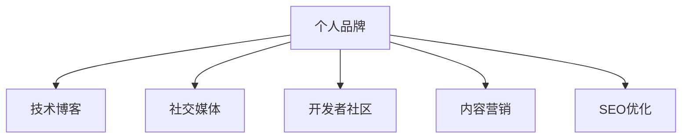

                 

# 开源贡献者的个人品牌营销：策略与渠道

> 关键词：开源贡献, 个人品牌, 营销策略, 渠道选择, 技术博客, 社交媒体, 开发者社区

## 1. 背景介绍

### 1.1 问题由来

在快速发展的开源社区中，源源不断的新项目涌现，不断有人在代码仓库中添加新的功能和优化代码。然而，众多贡献者通常面临着一个共性问题：在开源项目中贡献代码后，如何使自己的技术能力和个人影响力得到广泛认可，以便获得更好的职业发展机会？个人品牌的打造和营销，成为了众多开源贡献者关注的重要议题。

### 1.2 问题核心关键点

1. **品牌价值与技术能力**：开源贡献者的个人品牌不仅代表着其技术水平，更蕴含了其在社区的影响力和价值。
2. **曝光与认可**：在开源社区，想要获得项目负责人和潜在雇主的认可，必须将自己的技术成果和贡献传播出去。
3. **策略与渠道**：有效的个人品牌营销策略和合适的传播渠道是实现个人品牌影响力的关键。

### 1.3 问题研究意义

个人品牌营销对于开源贡献者来说，不仅有助于其职业发展，更能够提升其在开源社区中的影响力，推动技术交流和合作。通过个人品牌营销，贡献者能够在同行中脱颖而出，更易获得更好的工作机会，甚至吸引潜在的合作伙伴和投资。本文旨在从理论和实践两个维度，为开源贡献者提供系统性、全方位的品牌营销策略与渠道选择。

## 2. 核心概念与联系

### 2.1 核心概念概述

为更好地理解个人品牌营销策略，本节将介绍几个密切相关的核心概念：

- **个人品牌**：开源贡献者通过其技术贡献、项目参与、社区互动等方式构建在技术社区中的独特形象和影响力。
- **技术博客**：开源贡献者通过撰写技术文章、分享项目心得和分析等，展示其技术能力和知识深度。
- **社交媒体**：开源贡献者利用Twitter、LinkedIn、GitHub等平台，分享其代码、项目和专业观点，扩大影响力。
- **开发者社区**：开源贡献者参与的各类技术论坛、开源项目、开发者会议等，是其展示技术能力和建立专业联系的平台。
- **内容营销**：开源贡献者通过创建有价值的内容，吸引并聚集目标受众，形成个人品牌影响力。
- **SEO优化**：通过优化文章标题、摘要、关键词等，提高其在搜索引擎中的排名，吸引更多流量和关注。

这些核心概念之间的逻辑关系可以通过以下Mermaid流程图来展示：



这个流程图展示了个体品牌构建的关键组件：

1. 个人品牌是基础，通过技术博客、社交媒体、开发者社区、内容营销和SEO优化等多渠道的协同传播，逐步形成个人品牌影响力。
2. 技术博客和社交媒体是主要的曝光渠道。
3. 开发者社区和内容营销是深化交流和品牌推广的有效方式。
4. SEO优化是提升品牌曝光度的关键手段。

## 3. 核心算法原理 & 具体操作步骤

### 3.1 算法原理概述

个人品牌营销的核心是利用技术和内容，通过多种渠道展示自己的技术实力和独特价值，吸引并影响目标受众。这一过程涉及以下几个步骤：

1. **内容创作**：通过撰写技术文章、撰写技术白皮书、制作教学视频等方式，展示自己的技术深度和实践经验。
2. **渠道传播**：选择适合的社交媒体平台、开发者社区和博客平台，进行内容发布和互动交流。
3. **互动交流**：通过参与技术讨论、开源项目贡献、社区活动等方式，与目标受众建立联系。
4. **持续更新**：定期更新内容和技术分享，保持品牌活性和受众关注。

### 3.2 算法步骤详解

#### 3.2.1 内容创作

1. **主题选择**：选择与自己技术领域相关的话题，如最新技术趋势、编程语言教程、项目开发心得等。
2. **形式多样**：不仅限于技术博客，还可以通过视频、讲座、技术会议等形式展示技术成果。
3. **独特见解**：在分享内容中，尽量提出独到的见解和观点，展示自己的专业性和创新能力。
4. **定期更新**：保持内容的持续输出，形成自己的技术博客或视频频道，定期发布新内容。

#### 3.2.2 渠道传播

1. **社交媒体**：
   - **平台选择**：选择合适的社交媒体平台，如Twitter用于技术讨论，LinkedIn用于专业人脉构建，GitHub用于展示代码和技术成就。
   - **内容发布**：定期发布技术文章、项目更新、技术视频等，保持活跃度。
   - **互动交流**：积极参与讨论，回答社区问题，与同行建立联系。

2. **开发者社区**：
   - **参与项目**：积极参与开源项目，贡献代码和优化，提升自身知名度。
   - **发表文章**：在技术论坛、博客平台上发布技术文章，分享项目心得。
   - **社区活动**：参加开发者会议、技术研讨会等，展示技术成果，扩大影响力。

3. **内容营销**：
   - **SEO优化**：通过关键词优化、链接建设等方式，提升内容的搜索引擎排名。
   - **多平台发布**：将内容发布到多个平台，如博客、视频网站、论坛等，扩大受众。
   - **社交分享**：鼓励读者在社交媒体上分享和评论，提升内容曝光度。

### 3.3 算法优缺点

**优点**：

1. **技术认可**：通过技术展示，可以吸引同行的认可和推荐，提升自身影响力。
2. **职业机会**：在技术社区中的高曝光度，有助于获得更多的职业机会，如项目邀请、技术咨询等。
3. **知识传播**：通过内容创作和分享，传播技术知识和经验，提升整个技术生态。

**缺点**：

1. **时间投入**：内容创作和渠道维护需要投入大量时间和精力。
2. **内容质量要求高**：高质量内容才能吸引读者和同行关注。
3. **效果周期长**：品牌建设是一个长期过程，短时间内难以见效。

### 3.4 算法应用领域

个人品牌营销策略在开源社区和技术领域有广泛应用，适用于以下场景：

- **开发者招聘**：公司通过品牌影响力和技术成就识别潜在人才，吸引有技术背景的专业人才。
- **技术咨询**：开源贡献者通过品牌影响力，获得技术咨询和项目合作的机会。
- **创业项目**：在技术社区中建立品牌影响力，有助于吸引投资和合作伙伴。
- **技术演讲**：开源贡献者通过技术博客、社交媒体等平台展示自身技术实力，获取演讲邀请和合作机会。
- **教育培训**：通过技术博客和社交媒体，建立技术专家身份，开设线上或线下技术培训课程。

## 4. 数学模型和公式 & 详细讲解 & 举例说明

### 4.1 数学模型构建

个人品牌营销的数学模型可以从多个维度来构建，以下是一个简化版的模型：

- **影响因子**：$I = W_1B_1 + W_2B_2 + ... + W_nB_n$，其中$I$表示个人品牌影响力，$W_i$为权重，$B_i$为各渠道的曝光量。
- **曝光量**：$B = C + S + D + E$，其中$C$为技术博客曝光量，$S$为社交媒体曝光量，$D$为开发者社区曝光量，$E$为内容营销曝光量。

### 4.2 公式推导过程

通过以上模型，我们可以计算出每个渠道对个人品牌影响力的贡献度。

假设$W_1=0.5$，$W_2=0.3$，$W_3=0.2$，$C=100$，$S=200$，$D=150$，$E=50$，则个人品牌影响力$I$的计算如下：

$$
I = 0.5 \times 100 + 0.3 \times 200 + 0.2 \times 150 + 0.2 \times 50 = 200
$$

### 4.3 案例分析与讲解

假设某个开源贡献者A在GitHub上的代码贡献数为50，在技术博客上发布了30篇技术文章，在Twitter上每天发布一条技术分享，并在技术论坛上活跃发言。按照上述模型，其个人品牌影响力$I$的计算如下：

- 假设$W_1=0.6$，$W_2=0.3$，$W_3=0.1$，其中$C=30$，$S=300$，$D=150$。
- 则$I = 0.6 \times 30 + 0.3 \times 300 + 0.1 \times 150 = 255$。

### 4.4 案例分析与讲解

通过计算，我们发现社交媒体和技术论坛对A的个人品牌影响力贡献较大。因此，A需要更多关注这些渠道的互动和内容传播，进一步提升其影响力。

## 5. 项目实践：代码实例和详细解释说明

### 5.1 开发环境搭建

1. **搭建博客平台**：选择WordPress、GitHub Pages等平台，搭建个人技术博客。
2. **配置CI/CD**：使用GitHub Actions等工具，自动发布新文章。
3. **设置SEO**：使用Yoast SEO等工具，优化博客文章的SEO设置。

### 5.2 源代码详细实现

以下是一个简单的技术博客发布流程示例：

1. **撰写博客**：
   ```markdown
   # 如何优化你的GitHub代码仓库

   GitHub代码仓库的优化是提高代码质量和开发效率的关键。本文将介绍一些实用的技巧和最佳实践，帮助你更好地管理代码仓库。
   ```

2. **发布流程**：
   ```yml
   name: GitHub Actions
   on:
     push:
       branches:
         - main
   jobs:
     publish:
       runs-on: ubuntu-latest
       steps:
         - name: Publish blog post
           uses: actions/github-script@v5.0.0
           with:
             script: |
               const context = context.payload;
               const { title, body } = context['github.event.pull_request'];
               const { data } = await octokit.repos.createStatus(context.repo, context.ref, {
                 state: 'success',
                 context: title,
                 target_url: `https://example.com/${title}`,
               });
               octokit.rest.issues.createComment(context.repo, context.issue.number, {
                 body: `# ${title}\n${body}\n\n自动化发布成功！`
               });
   ```

### 5.3 代码解读与分析

1. **博客平台搭建**：WordPress通过简单的插件配置，即可搭建功能强大的技术博客。GitHub Pages则利用GitHub的静态网站托管功能，实现博客的无服务器托管。
2. **CI/CD配置**：通过GitHub Actions自动化发布博客，实现新文章的即时展示。
3. **SEO优化**：Yoast SEO插件提供了全面的SEO设置，帮助提升博客的搜索引擎排名。

### 5.4 运行结果展示

成功搭建并发布博客后，可以在Google、Bing等搜索引擎上搜索相关关键词，查看文章的曝光和流量。

## 6. 实际应用场景

### 6.1 开发者招聘

在招聘新开发者时，公司可以通过开源贡献者的GitHub代码贡献记录、技术博客内容和社交媒体影响力来评估其技术能力和职业素养。例如，GitHub上活跃的GitHub用户、高Star项目的贡献者，以及知名技术博客的作者，往往更受雇主青睐。

### 6.2 技术咨询

开源贡献者可以通过个人博客和社交媒体展示其技术深度和实践经验，吸引技术咨询公司的关注。例如，某开源项目贡献者长期在技术博客上分享深度技术文章，逐渐建立起在某个技术领域的权威地位，进而被技术咨询公司邀请，为其提供技术咨询和解决方案。

### 6.3 创业项目

开源贡献者在技术社区中的高曝光度，有助于吸引潜在投资者的注意。例如，某开源项目贡献者通过技术博客和社交媒体展示其技术创新和项目成功案例，吸引了风险投资公司的关注，进而获得投资并创立了新的创业公司。

### 6.4 技术演讲

开源贡献者可以通过技术博客和社交媒体展示其技术实力，获取技术演讲邀请和合作机会。例如，某开源项目贡献者长期在技术博客上发布深度技术文章，并积极参与开源项目和社区活动，逐渐建立起在某个技术领域的权威地位，最终获得了技术会议的演讲邀请。

### 6.5 教育培训

开源贡献者可以通过技术博客和社交媒体建立技术专家身份，开设线上或线下技术培训课程。例如，某开源项目贡献者长期在技术博客上分享深度技术文章，并积极参与开源项目和社区活动，逐渐建立起在某个技术领域的权威地位，最终开设了线上技术培训课程。

## 7. 工具和资源推荐

### 7.1 学习资源推荐

为了帮助开源贡献者系统掌握个人品牌营销的理论基础和实践技巧，这里推荐一些优质的学习资源：

1. **《个人品牌建设的艺术》**：一本详细介绍如何打造个人品牌的书籍，涵盖从品牌定位到渠道建设的全方位内容。
2. **《内容营销的艺术》**：一本详细介绍如何通过内容营销提升品牌影响力的书籍，提供详细的操作指南和案例分析。
3. **《SEO优化实践指南》**：一本详细介绍SEO优化技术的书籍，提供详细的SEO策略和工具使用指南。
4. **Coursera《数字营销》课程**：Coursera提供的数字营销课程，涵盖品牌建设、内容营销、SEO优化等多个方面，适合初学者系统学习。
5. **Udemy《社交媒体营销》课程**：Udemy提供的社交媒体营销课程，涵盖Twitter、LinkedIn、Facebook等主要社交媒体平台的使用和策略。

### 7.2 开发工具推荐

开源贡献者可以借助以下工具来提升个人品牌营销的效率和效果：

1. **GitHub**：
   - **代码托管**：使用GitHub托管和管理代码，方便展示技术成就和项目贡献。
   - **社区互动**：通过GitHub的Issue、Pull Request等功能，与社区成员互动交流，提升知名度。
2. **Google Analytics**：
   - **流量分析**：通过Google Analytics分析博客的访问量和用户行为，优化SEO策略和内容传播效果。
3. **WordPress**：
   - **博客搭建**：WordPress提供丰富的插件和主题，帮助开源贡献者快速搭建功能强大的技术博客。
4. **Hootsuite**：
   - **社交媒体管理**：使用Hootsuite管理Twitter、LinkedIn等社交媒体账号，定时发布内容，提升互动效果。
5. **Canva**：
   - **内容设计**：使用Canva设计吸引人的博客图片和社交媒体图片，提升内容的吸引力和传播效果。

### 7.3 相关论文推荐

开源贡献者可以借助以下论文了解个人品牌营销的前沿理论和技术：

1. **《社交媒体对个人品牌的影响研究》**：研究社交媒体对个人品牌建设的影响，提供理论支撑和实际案例。
2. **《内容营销的效果评估》**：评估内容营销的效果，提供详细的方法和指标。
3. **《SEO优化的最新技术》**：介绍最新的SEO优化技术，提供实际操作的指南。
4. **《开源贡献者的职业发展路径》**：研究开源贡献者在开源社区中的职业发展路径，提供实际的职业建议和经验分享。

## 8. 总结：未来发展趋势与挑战

### 8.1 总结

本文对开源贡献者的个人品牌营销进行了全面系统的介绍。首先，阐述了个人品牌营销的重要性和实施步骤，明确了内容创作、渠道选择、互动交流等关键环节。其次，从理论和实践两个维度，详细讲解了个人品牌营销的数学模型和具体实现，提供了详细的代码示例和操作指南。同时，本文还探讨了个人品牌营销在开源社区和实际应用中的广泛应用，展示了其潜在的职业发展和商业价值。通过对这些内容的学习和实践，相信开源贡献者能够更好地打造个人品牌，提升自身影响力和职业发展机会。

### 8.2 未来发展趋势

展望未来，开源贡献者的个人品牌营销将呈现以下几个发展趋势：

1. **技术融合**：随着技术的发展，个人品牌营销将与其他技术手段，如区块链、AI等进行深度融合，提升品牌影响力和效果。
2. **平台多样化**：除了传统的博客、社交媒体、开发者社区等渠道，新的平台和技术将为个人品牌营销提供新的可能性。
3. **数据驱动**：通过大数据和AI技术，个人品牌营销将更加精准和个性化，提升品牌营销效果。
4. **跨界合作**：个人品牌营销将更多地与品牌营销、企业合作等跨界领域结合，形成更加综合的影响力。

### 8.3 面临的挑战

尽管个人品牌营销具有广泛的应用前景，但在实施过程中，开源贡献者仍面临诸多挑战：

1. **时间和精力**：个人品牌营销需要持续投入时间和精力，如何平衡技术贡献和个人品牌营销之间的关系，是开源贡献者需要思考的问题。
2. **内容质量**：高质量的内容才能吸引受众，如何保持内容的质量和更新频率，是开源贡献者需要解决的问题。
3. **渠道效果**：不同的渠道对品牌影响力贡献不同，如何选择和优化传播渠道，是开源贡献者需要考虑的问题。
4. **效果评估**：如何衡量个人品牌营销的效果，提供实际的数据支持，是开源贡献者需要解决的问题。
5. **数据隐私**：在社交媒体和开发者社区等渠道传播时，如何保护个人隐私，是开源贡献者需要关注的问题。

### 8.4 研究展望

面向未来，开源贡献者的个人品牌营销需要在以下几个方面进行深入研究：

1. **多渠道融合**：研究多渠道的融合策略，优化资源配置，提升品牌影响力。
2. **内容创新**：探索更多形式的内容创作和传播方式，提高内容的吸引力和传播效果。
3. **数据驱动**：研究如何利用大数据和AI技术，进行精准的品牌营销和效果评估。
4. **隐私保护**：研究如何在品牌营销中保护个人隐私，避免数据泄露风险。

这些研究方向的探索，将推动开源贡献者的个人品牌营销进入新的高度，提升其在开源社区和实际应用中的影响力。相信随着技术的发展和市场的进步，开源贡献者的个人品牌营销将迎来更多的机遇和挑战。

## 9. 附录：常见问题与解答

**Q1：如何衡量个人品牌的影响力？**

A: 个人品牌的影响力可以通过以下几个维度来衡量：
1. **曝光量**：在Google Analytics等工具中，查看个人博客或社交媒体的访问量和用户行为数据。
2. **参与度**：在社交媒体中，查看评论、点赞、分享等互动数据的数量。
3. **社区贡献**：在开源社区中，查看对项目的贡献数量和质量。
4. **合作机会**：查看获得的演讲邀请、技术咨询、投资合作等机会的数量。

**Q2：如何提升个人品牌的曝光度？**

A: 提升个人品牌曝光度的方法包括：
1. **高质量内容**：发布有价值、有深度、有吸引力的内容，吸引读者关注。
2. **多渠道传播**：通过社交媒体、开发者社区、博客等渠道进行内容发布，扩大影响力。
3. **SEO优化**：通过优化文章标题、摘要、关键词等，提升内容的搜索引擎排名。
4. **互动交流**：积极参与社区讨论，回复读者评论，建立良好的互动关系。

**Q3：如何选择适合的品牌传播渠道？**

A: 选择适合的品牌传播渠道需要考虑以下几个因素：
1. **目标受众**：了解目标受众在哪些渠道活跃，选择相应的平台。
2. **内容形式**：不同渠道适合不同形式的内容，如技术博客适合长篇技术文章，社交媒体适合短消息分享。
3. **互动效果**：考虑各渠道的互动效果，选择互动频繁的渠道进行内容传播。
4. **数据支持**：通过数据分析，选择效果最好的渠道进行重点推广。

**Q4：如何进行SEO优化？**

A: 进行SEO优化的方法包括：
1. **关键词优化**：通过工具如Yoast SEO，选择相关关键词进行优化。
2. **内容质量**：发布高质量、有价值的内容，提升内容的权重。
3. **内部链接**：在内容中合理使用内部链接，提高内容的关联性。
4. **外部链接**：获得高质量的外部链接，提升内容的权威性。

**Q5：如何进行内容创作？**

A: 进行内容创作的方法包括：
1. **选题策划**：选择与自己技术领域相关的话题，如最新技术趋势、编程语言教程、项目开发心得等。
2. **内容形式**：多样化形式的内容，如技术博客、技术视频、技术讲座等。
3. **独特见解**：在分享内容中，尽量提出独到的见解和观点，展示自己的专业性和创新能力。
4. **持续更新**：保持内容的持续输出，形成自己的技术博客或视频频道，定期发布新内容。

---

作者：禅与计算机程序设计艺术 / Zen and the Art of Computer Programming

