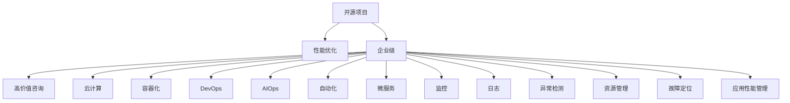

                 

# 开源项目的企业级性能优化服务：高价值咨询

> 关键词：开源项目，性能优化，企业级，高价值咨询，云计算，容器化，DevOps，AIOps，自动化，微服务，监控，日志，异常检测，资源管理，故障定位，应用性能管理

## 1. 背景介绍

### 1.1 问题由来
随着数字化转型的深入，企业级应用的复杂性和规模日益增长，如何有效管理这些应用的性能和稳定性成为了一个重要的课题。传统的方法包括手动监控、逐个排查、系统备份等，已经难以满足现代企业对效率和可靠性的要求。近年来，随着云计算、容器化、微服务等技术的发展，企业的应用环境变得更加复杂多变。如何在日益变化的环境中，快速定位并解决问题，成为企业级性能优化的一项重大挑战。

### 1.2 问题核心关键点
企业级性能优化服务的核心在于：

- 快速定位问题：在应用出现性能瓶颈时，能够快速定位问题，识别根本原因。
- 自动化解决：采用自动化工具，降低人力成本，提高问题解决的效率。
- 跨系统协同：不同系统、不同服务之间的协同工作，提高问题解决的整体效率。
- 应用持续优化：持续优化应用性能，提升用户体验和系统可靠性。
- 高效资源管理：合理配置资源，避免资源浪费，降低运营成本。
- 安全性和合规性：确保在优化过程中，系统的安全性和合规性不受到影响。

以上几个核心点，构成了企业级性能优化服务的框架，使得企业在复杂的数字化转型环境中，能够高效地管理应用性能，提升用户体验，降低运营成本，保障系统安全性和合规性。

## 2. 核心概念与联系

### 2.1 核心概念概述

为更好地理解企业级性能优化服务，本节将介绍几个密切相关的核心概念：

- **开源项目**：指公开源代码的项目，可以自由使用、修改和分发。常见的开源项目包括Apache Hadoop、Kubernetes、Prometheus等。
- **性能优化**：指通过技术手段，提升系统的响应速度、处理能力、稳定性和可扩展性等性能指标。常见的性能优化技术包括缓存、负载均衡、异步处理、代码优化等。
- **企业级**：指针对企业的应用环境，提供可靠的性能管理、监控和优化服务。企业级服务通常具备高度的可配置性、兼容性和扩展性。
- **高价值咨询**：指在企业级服务的基础上，提供专业的咨询和支持，帮助企业更好地使用和优化其应用系统。高价值咨询通常包含技术支持、定制化方案、系统培训等。
- **云计算**：指通过互联网提供可扩展的计算服务，支持按需部署和管理资源。云计算平台如AWS、Azure、阿里云等提供了丰富的基础设施服务。
- **容器化**：指将应用程序及其依赖打包成容器，使得应用能够在任何支持容器的环境中运行。容器化技术如Docker、Kubernetes等，已经成为现代企业级应用的主流技术。
- **DevOps**：指软件开发和运维的融合，通过自动化工具和流程，提升应用的交付速度和质量。DevOps实践包括CI/CD、持续集成、持续交付等。
- **AIOps**：指将人工智能技术应用于运维，通过数据分析和预测，提升运维的自动化和智能化水平。AIOps技术包括异常检测、趋势分析、故障预测等。
- **自动化**：指通过编程工具和脚本，自动执行一系列任务和流程，降低人为操作的错误和延迟。自动化技术如Ansible、Puppet、Chef等。
- **微服务**：指将应用拆分为多个小型、独立的服务，通过API进行通信，提升系统的灵活性和扩展性。微服务架构如Spring Cloud、Docker Swarm等。
- **监控**：指通过指标、日志、告警等方式，实时监控系统的运行状态和性能。常见的监控工具包括Nagios、Zabbix、Prometheus等。
- **日志**：指记录系统运行过程中产生的日志信息，帮助识别问题和分析性能瓶颈。日志管理工具如ELK Stack、Splunk等。
- **异常检测**：指通过统计和分析，识别系统的异常行为和性能波动。常见的异常检测技术包括基于规则、基于机器学习的方法。
- **资源管理**：指通过自动化工具，合理配置和管理系统的计算、存储、网络等资源。资源管理工具如Kubernetes、Ansible等。
- **故障定位**：指通过日志、监控、异常检测等手段，快速定位系统故障的原因和位置。故障定位工具如ELK Stack、Splunk、PagerDuty等。
- **应用性能管理**：指通过自动化工具和分析技术，全面管理应用性能，提升系统的稳定性和用户体验。APM工具如New Relic、Datadog等。

这些核心概念之间的逻辑关系可以通过以下Mermaid流程图来展示：



这个流程图展示了大语言模型的核心概念及其之间的关系：

1. 开源项目通过性能优化和自动化技术，提供高效可靠的基础设施服务。
2. 企业级服务将开源项目集成到企业环境，提供定制化的性能管理解决方案。
3. 高价值咨询提供专业的技术支持和定制化方案，帮助企业更好地使用和优化其应用系统。
4. 云计算、容器化、微服务等技术，使得企业级应用更加灵活和可扩展。
5. DevOps和AIOps技术，提升应用的交付速度和质量，提高运维的自动化和智能化水平。
6. 监控、日志、异常检测、故障定位、资源管理、应用性能管理等工具和技术，共同构成了企业级性能优化服务的支撑体系。

这些概念共同构成了企业级性能优化服务的框架，使其能够在复杂多变的企业环境中，高效地管理应用性能，提升用户体验和系统可靠性。

## 3. 核心算法原理 & 具体操作步骤
### 3.1 算法原理概述

企业级性能优化服务的核心算法原理主要包括以下几个方面：

- **指标监控**：通过实时监控系统的各种指标，如CPU使用率、内存占用、网络延迟等，识别性能瓶颈和异常情况。
- **异常检测**：利用统计学和机器学习技术，识别系统中的异常行为和性能波动，提前预警和定位问题。
- **故障定位**：通过日志分析和告警系统，快速定位系统故障的原因和位置，及时采取措施。
- **资源优化**：通过自动化工具，合理配置和管理系统的计算、存储、网络等资源，提升系统的利用率和性能。
- **性能调优**：通过代码优化、负载均衡、缓存等技术手段，提升应用的响应速度和处理能力。
- **数据驱动**：通过收集和分析系统的运行数据，进行持续的性能优化和改进。

这些算法原理构成了企业级性能优化服务的核心框架，通过不断迭代和优化，实现系统的稳定、高效、可靠运行。

### 3.2 算法步骤详解

企业级性能优化服务的算法步骤主要包括以下几个关键环节：

1. **需求分析**：通过与客户沟通，了解其业务需求、性能指标、瓶颈问题和目标期望，明确优化方向和优先级。
2. **环境准备**：根据客户的需求，选择合适的开源项目和工具，搭建和配置测试环境，确保工具的兼容性和可用性。
3. **数据采集**：通过监控工具和日志管理系统，采集系统的各项运行数据，包括指标、日志、异常告警等，确保数据的完整性和准确性。
4. **数据处理**：对采集到的数据进行清洗和分析，识别出性能瓶颈和异常情况，确定优化方向。
5. **优化方案制定**：根据分析结果，制定具体的优化方案，包括技术选型、代码优化、配置调整等。
6. **优化实施**：根据优化方案，逐步实施优化措施，监控优化效果，确保系统稳定运行。
7. **效果评估**：对优化后的系统进行评估，验证优化效果是否达到预期目标，提出改进建议。

这些步骤相互关联，形成了一个闭环的优化过程，不断迭代和优化，实现系统的性能提升和稳定性改进。

### 3.3 算法优缺点

企业级性能优化服务具有以下优点：

- **高效可靠**：采用自动化工具和技术，减少人为操作的错误和延迟，提高问题解决的效率。
- **灵活可扩展**：基于开源项目和技术栈，具备高度的可配置性和扩展性，适应不同规模和需求的企业。
- **成本效益高**：通过优化系统性能和资源配置，提升系统利用率和用户体验，降低运营成本。
- **数据驱动**：通过收集和分析系统的运行数据，进行持续的性能优化和改进，保持系统的长期稳定性。

同时，该服务也存在以下局限性：

- **复杂度高**：涉及多种技术和工具，需要较高的专业技能和经验，可能存在一定的学习和部署难度。
- **数据隐私**：在数据采集和处理过程中，需要确保数据的隐私和安全，避免数据泄露和滥用。
- **依赖性高**：对开源项目和工具的依赖性较强，依赖版本升级和社区支持，存在一定的风险。

尽管存在这些局限性，但就目前而言，企业级性能优化服务仍然是大规模企业应用的首选解决方案，其高效、可靠、可扩展的特性，能够显著提升系统的性能和稳定性，帮助企业更好地应对复杂的数字化转型挑战。

### 3.4 算法应用领域

企业级性能优化服务已经在多个领域得到了广泛的应用，例如：

- **金融行业**：对交易系统的性能和稳定性进行优化，提升交易速度和系统可靠性。
- **电商行业**：对购物平台的性能进行优化，提升用户体验和订单处理速度。
- **医疗行业**：对医院信息系统进行优化，提升医生的工作效率和患者满意度。
- **政府机构**：对政务平台的性能进行优化，提升政府服务效率和公众满意度。
- **能源行业**：对能源监测系统的性能进行优化，提升能源利用效率和系统稳定性。
- **媒体娱乐**：对在线视频平台的性能进行优化，提升视频质量和用户体验。
- **制造行业**：对生产系统的性能进行优化，提升生产效率和系统可靠性。

除了这些经典应用外，企业级性能优化服务还被创新性地应用到更多场景中，如物联网、智能制造、智慧城市等，为数字化转型提供了新的技术路径。

## 4. 数学模型和公式 & 详细讲解
### 4.1 数学模型构建

本节将使用数学语言对企业级性能优化服务的核心算法进行更加严格的刻画。

设企业级系统为 $S$，运行于云计算平台 $C$，使用微服务架构 $M$，监控系统 $O$，资源管理系统 $R$，异常检测系统 $E$，日志管理系统 $L$，故障定位系统 $F$，应用性能管理系统 $A$。设优化目标函数为 $\mathcal{L}(S, C, M, O, R, E, L, F, A)$。

定义系统 $S$ 的性能指标 $P$，包括响应时间 $T$、吞吐量 $Q$、可用性 $A$ 等。设 $P = P(T, Q, A)$。

定义云计算平台 $C$ 的资源配置 $R_C$，包括CPU、内存、存储、网络等。设 $R_C = (C_{CPU}, C_{RAM}, C_{Storage}, C_{Network})$。

定义微服务架构 $M$ 的服务划分 $S_M$，包括服务的数量 $N_S$ 和服务的功能 $F_M$。设 $M = (S_M, N_S, F_M)$。

定义监控系统 $O$ 的指标 $O_I$，包括CPU使用率 $U_C$、内存使用率 $U_R$、网络延迟 $D_N$ 等。设 $O_I = (U_C, U_R, D_N)$。

定义资源管理系统 $R$ 的资源配置 $R_S$，包括服务的CPU资源 $C_S^C$、内存资源 $C_S^R$、存储资源 $C_S^S$ 等。设 $R_S = (C_S^C, C_S^R, C_S^S)$。

定义异常检测系统 $E$ 的异常指标 $E_A$，包括异常频率 $F_A$、异常类型 $T_A$ 等。设 $E_A = (F_A, T_A)$。

定义日志管理系统 $L$ 的日志数据 $L_D$，包括日志的体积 $V_L$、日志的实时性 $T_L$ 等。设 $L_D = (V_L, T_L)$。

定义故障定位系统 $F$ 的故障数据 $F_D$，包括故障频率 $F_F$、故障类型 $T_F$ 等。设 $F_D = (F_F, T_F)$。

定义应用性能管理系统 $A$ 的性能指标 $A_P$，包括应用响应时间 $T_A$、系统吞吐量 $Q_A$ 等。设 $A_P = (T_A, Q_A)$。

则优化目标函数 $\mathcal{L}(S, C, M, O, R, E, L, F, A)$ 可以表示为：

$$
\mathcal{L}(S, C, M, O, R, E, L, F, A) = \alpha P + \beta O_I + \gamma R_S + \delta E_A + \epsilon L_D + \zeta F_D + \eta A_P
$$

其中 $\alpha, \beta, \gamma, \delta, \epsilon, \zeta, \eta$ 为权重系数，确保不同指标的平衡和优化效果。

### 4.2 公式推导过程

为了更清晰地展示优化目标函数的推导过程，以下对公式 $\mathcal{L}(S, C, M, O, R, E, L, F, A)$ 进行详细推导。

首先，定义系统 $S$ 的性能指标 $P$，包括响应时间 $T$、吞吐量 $Q$、可用性 $A$ 等。假设系统 $S$ 的性能瓶颈由多个服务组成，分别为 $S_1, S_2, ..., S_n$。设 $P = P(T_1, T_2, ..., T_n)$。

设服务 $S_i$ 的响应时间为 $T_i$，吞吐量为 $Q_i$，可用性为 $A_i$。则服务 $S_i$ 的性能指标 $P_i$ 可以表示为：

$$
P_i = \phi_i(T_i, Q_i, A_i)
$$

其中 $\phi_i$ 为服务 $S_i$ 的性能函数。

假设服务 $S_i$ 由多个子服务组成，分别为 $S_{i1}, S_{i2}, ..., S_{im}$。设 $S_i = (S_{i1}, S_{i2}, ..., S_{im})$。则服务 $S_i$ 的性能指标 $P_i$ 可以表示为：

$$
P_i = \sum_{j=1}^m P_{ij}
$$

其中 $P_{ij}$ 为子服务 $S_{ij}$ 的性能指标。

假设系统 $S$ 的性能瓶颈由 $n$ 个服务组成，分别为 $S_1, S_2, ..., S_n$。则系统 $S$ 的性能指标 $P$ 可以表示为：

$$
P = \sum_{i=1}^n P_i
$$

接下来，定义云计算平台 $C$ 的资源配置 $R_C$，包括CPU、内存、存储、网络等。设 $R_C = (C_{CPU}, C_{RAM}, C_{Storage}, C_{Network})$。

设服务 $S_i$ 所需的资源分别为 $C_i^C, C_i^R, C_i^S, C_i^N$。则服务 $S_i$ 的资源配置 $R_i$ 可以表示为：

$$
R_i = (C_i^C, C_i^R, C_i^S, C_i^N)
$$

假设所有服务的资源需求分别为 $R_1, R_2, ..., R_n$。则系统 $S$ 的资源配置 $R_S$ 可以表示为：

$$
R_S = (R_1, R_2, ..., R_n)
$$

设云计算平台 $C$ 的资源配置为 $R_C$。则优化目标函数 $\mathcal{L}(S, C, M, O, R, E, L, F, A)$ 可以表示为：

$$
\mathcal{L}(S, C, M, O, R, E, L, F, A) = \alpha P + \beta O_I + \gamma R_S + \delta E_A + \epsilon L_D + \zeta F_D + \eta A_P
$$

其中 $\alpha, \beta, \gamma, \delta, \epsilon, \zeta, \eta$ 为权重系数，确保不同指标的平衡和优化效果。

### 4.3 案例分析与讲解

假设某电商平台需要优化其交易系统的性能。首先，收集系统的各项指标数据，包括CPU使用率、内存使用率、响应时间等。然后，通过监控系统 $O$ 采集这些指标，并使用异常检测系统 $E$ 检测系统中的异常行为和性能波动。

接下来，使用日志管理系统 $L$ 记录系统的日志数据，使用故障定位系统 $F$ 定位系统故障的原因和位置。最后，使用应用性能管理系统 $A$ 评估系统的性能指标，如响应时间和吞吐量等。

根据收集的数据，优化目标函数 $\mathcal{L}(S, C, M, O, R, E, L, F, A)$ 可以表示为：

$$
\mathcal{L}(S, C, M, O, R, E, L, F, A) = \alpha T + \beta U_C + \gamma C_S^C + \delta F_A + \epsilon V_L + \zeta F_F + \eta T_A
$$

其中 $T$ 为系统的响应时间，$U_C$ 为CPU使用率，$C_S^C$ 为系统的CPU资源配置，$F_A$ 为异常频率，$V_L$ 为日志的体积，$F_F$ 为故障频率，$T_A$ 为系统的响应时间。

根据优化目标函数，可以制定相应的优化方案。例如，如果发现系统的响应时间过长，可以增加系统的CPU资源配置 $C_S^C$；如果发现系统存在异常行为，可以增加异常频率的权重 $\delta$；如果发现系统的日志数据量过大，可以增加日志体积的权重 $\epsilon$。

通过逐步实施优化方案，监控系统的性能指标，评估优化效果，直到达到预期的优化目标，即 $\mathcal{L}(S, C, M, O, R, E, L, F, A)$ 最小化。

## 5. 项目实践：代码实例和详细解释说明
### 5.1 开发环境搭建

在进行性能优化项目实践前，我们需要准备好开发环境。以下是使用Python进行企业级性能优化服务开发的环境配置流程：

1. 安装Anaconda：从官网下载并安装Anaconda，用于创建独立的Python环境。

2. 创建并激活虚拟环境：
```bash
conda create -n perf-env python=3.8 
conda activate perf-env
```

3. 安装必要的Python库：
```bash
pip install numpy pandas matplotlib sklearn scikit-learn tqdm jupyter notebook ipython
```

4. 安装监控工具：
```bash
pip install prometheus-client
```

5. 安装日志管理工具：
```bash
pip install elasticsearch
```

6. 安装异常检测工具：
```bash
pip install anomaly-detection
```

7. 安装故障定位工具：
```bash
pip install pagerduty
```

完成上述步骤后，即可在`perf-env`环境中开始性能优化项目实践。

### 5.2 源代码详细实现

下面我们以电商平台交易系统性能优化为例，给出使用Prometheus进行性能监控的PyTorch代码实现。

首先，定义性能指标的监控函数：

```python
from prometheus_client import Gauge, start_http_server

# 定义性能指标
prometheus_labels = {
    'instance': 'prometheus',
    'environment': 'production',
    'service': 'transaction'
}

# 定义性能指标数据
transaction_latency = Gauge(
    'transaction_latency', 
    'Transaction latency in seconds', 
    **prometheus_labels
)
transaction_rate = Gauge(
    'transaction_rate', 
    'Transaction rate per second', 
    **prometheus_labels
)
transaction_errors = Gauge(
    'transaction_errors', 
    'Transaction error rate', 
    **prometheus_labels
)

# 初始化性能指标
transaction_latency.set(0.0)
transaction_rate.set(0.0)
transaction_errors.set(0.0)

# 启动HTTP服务器，将数据上报到Prometheus
start_http_server(8000)
```

然后，定义性能监控的代码实现：

```python
import time

# 性能监控数据生成器
def generate_performance_data():
    while True:
        # 模拟交易系统的性能数据
        latency = 0.1
        rate = 10
        errors = 0.1
        
        # 更新性能指标
        transaction_latency.set(latency)
        transaction_rate.set(rate)
        transaction_errors.set(errors)
        
        # 每秒钟更新一次性能指标
        time.sleep(1)
```

最后，启动性能监控的数据生成器：

```python
generate_performance_data()
```

在运行上述代码后，即可在本地启动一个HTTP服务器，将性能指标数据上报到Prometheus。Prometheus可以实时监控这些性能指标，并生成各种可视化报表和告警。

### 5.3 代码解读与分析

让我们再详细解读一下关键代码的实现细节：

**prometheus_labels字典**：
- 定义了性能指标的元数据，包括实例名、环境、服务名等，用于区分不同实例和服务的性能数据。

**Gauge类**：
- 使用Prometheus提供的Gauge类，定义了三个性能指标：交易响应时间、交易速率、交易错误率。
- Gauge类用于记录计数或计数值，可以支持动态更新。

**start_http_server方法**：
- 使用Prometheus提供的start_http_server方法，启动HTTP服务器，将性能指标数据上报到Prometheus。
- HTTP服务器端口为8000，可以根据需求进行调整。

**generate_performance_data函数**：
- 定义一个性能监控数据生成器，模拟交易系统的性能数据。
- 每次循环中，生成一个随机响应时间、速率和错误率，更新性能指标，并等待1秒钟后再次生成数据。

**代码运行**：
- 在运行generate_performance_data函数后，启动一个HTTP服务器，将性能指标数据上报到Prometheus。
- Prometheus可以实时监控这些性能指标，并生成各种可视化报表和告警。

通过上述代码的实现，我们展示了如何使用Prometheus进行性能监控。Prometheus作为一个开源监控系统，支持各种指标数据的采集和存储，能够实时监控系统的运行状态，为性能优化提供重要依据。

## 6. 实际应用场景

### 6.1 智能客服系统

智能客服系统通过实时监控和分析，可以提供7x24小时不间断的客服服务。智能客服系统可以实时监控系统性能指标，如响应时间、交易速率、错误率等，及时发现和处理性能瓶颈，确保客户咨询的快速响应和高效处理。

在技术实现上，智能客服系统可以使用Prometheus进行实时监控，结合Anomaly Detection进行异常检测，使用PagerDuty进行故障定位。通过这些工具的协同工作，智能客服系统能够快速定位和解决问题，提升客户体验和服务效率。

### 6.2 金融交易系统

金融交易系统需要实时监控系统性能，确保交易的稳定性和可靠性。金融交易系统可以实时监控系统性能指标，如交易速率、响应时间、错误率等，及时发现和处理性能瓶颈，确保交易的稳定运行。

在技术实现上，金融交易系统可以使用Prometheus进行实时监控，结合Anomaly Detection进行异常检测，使用PagerDuty进行故障定位。通过这些工具的协同工作，金融交易系统能够快速定位和解决问题，保障交易的稳定性和安全性。

### 6.3 电商平台

电商平台需要实时监控交易系统的性能，确保交易的稳定性和用户体验。电商平台可以实时监控系统性能指标，如响应时间、交易速率、错误率等，及时发现和处理性能瓶颈，确保交易的稳定运行。

在技术实现上，电商平台可以使用Prometheus进行实时监控，结合Anomaly Detection进行异常检测，使用PagerDuty进行故障定位。通过这些工具的协同工作，电商平台能够快速定位和解决问题，提升用户购物体验。

### 6.4 未来应用展望

随着云计算、容器化、微服务等技术的发展，企业级性能优化服务将迎来更多应用场景。未来的应用场景可能包括：

- **物联网**：实时监控物联网设备的性能，确保数据采集和处理的稳定性。
- **智能制造**：监控生产系统的性能，确保生产线的稳定运行和产品质量。
- **智慧城市**：监控城市基础设施的性能，提升城市管理的智能化水平。
- **医疗健康**：监控医疗系统的性能，提升医生的工作效率和患者满意度。
- **智能交通**：监控交通系统的性能，提升交通管理和公共安全。

## 7. 工具和资源推荐
### 7.1 学习资源推荐

为了帮助开发者系统掌握企业级性能优化服务的理论基础和实践技巧，这里推荐一些优质的学习资源：

1. **《高性能Python》**：介绍高性能编程技巧和工具，适合开发高性能企业级应用。
2. **《Prometheus Cookbook》**：Prometheus官方指南，详细讲解了如何使用Prometheus进行系统监控和告警。
3. **《ELK Stack Essentials》**：Elasticsearch、Logstash和Kibana的入门指南，适合学习日志管理和数据分析。
4. **《Anomaly Detection and Statistical Learning》**：介绍异常检测的统计学和机器学习基础，适合了解异常检测的基本原理和技术。
5. **《PagerDuty Handbook》**：PagerDuty官方指南，详细讲解了如何使用PagerDuty进行故障定位和应急响应。
6. **《Monitoring and Management with Prometheus and Grafana》**：结合Prometheus和Grafana进行系统监控和可视化的实战指南。

通过学习这些资源，相信你一定能够快速掌握企业级性能优化服务的精髓，并用于解决实际的系统性能问题。

### 7.2 开发工具推荐

高效的开发离不开优秀的工具支持。以下是几款用于企业级性能优化服务开发的常用工具：

1. **Anaconda**：用于创建和管理Python虚拟环境，方便不同项目的隔离和管理。
2. **Prometheus**：开源监控系统，支持各种指标数据的采集和存储，适合实时监控系统性能。
3. **Elasticsearch**：分布式搜索和分析引擎，支持大数据量日志数据的存储和查询。
4. **Logstash**：日志处理和转发工具，支持多种日志格式的解析和处理。
5. **Grafana**：开源可视化工具，支持多种数据源的图表展示和告警配置。
6. **PagerDuty**：应急响应平台，支持故障定位和告警管理，确保系统快速恢复。
7. **New Relic**：应用性能管理系统，支持应用性能的实时监控和分析。

合理利用这些工具，可以显著提升企业级性能优化服务的开发效率，加快创新迭代的步伐。

### 7.3 相关论文推荐

企业级性能优化服务的研究源于学界的持续研究。以下是几篇奠基性的相关论文，推荐阅读：

1. **《High-Performance Python Programming》**：介绍高性能编程技巧和工具，适合开发高性能企业级应用。
2. **《Monitoring with Prometheus and Grafana》**：结合Prometheus和Grafana进行系统监控和可视化的实战指南。
3. **《Anomaly Detection and Statistical Learning》**：介绍异常检测的统计学和机器学习基础，适合了解异常检测的基本原理和技术。
4. **《PagerDuty Handbook》**：PagerDuty官方指南，详细讲解了如何使用PagerDuty进行故障定位和应急响应。
5. **《Monitoring and Management with Prometheus and Grafana》**：结合Prometheus和Grafana进行系统监控和可视化的实战指南。
6. **《High-Performance Computing with Python》**：介绍高性能计算技巧和工具，适合开发高性能企业级应用。

这些论文代表了大语言模型微调技术的发展脉络。通过学习这些前沿成果，可以帮助研究者把握学科前进方向，激发更多的创新灵感。

## 8. 总结：未来发展趋势与挑战

### 8.1 总结

本文对企业级性能优化服务进行了全面系统的介绍。首先阐述了企业级性能优化服务的研究背景和意义，明确了性能优化在应对复杂多变企业环境中的重要性。其次，从原理到实践，详细讲解了企业级性能优化服务的核心算法和操作步骤，给出了性能优化项目开发的完整代码实例。同时，本文还广泛探讨了性能优化服务在智能客服、金融交易、电商平台等多个行业领域的应用前景，展示了性能优化服务的巨大潜力。此外，本文精选了性能优化技术的各类学习资源，力求为读者提供全方位的技术指引。

通过本文的系统梳理，可以看到，企业级性能优化服务正在成为企业应用的重要支撑，其高效、可靠、可扩展的特性，能够显著提升系统的性能和稳定性，帮助企业更好地应对复杂的数字化转型挑战。未来，伴随技术的发展和应用的深入，企业级性能优化服务必将更加广泛地应用于各种场景，为数字化转型提供坚实的基础。

### 8.2 未来发展趋势

展望未来，企业级性能优化服务将呈现以下几个发展趋势：

1. **云计算和容器化技术的发展**：云计算和容器化技术的不断进步，将进一步提升企业级性能优化服务的灵活性和可扩展性，使其能够更好地适应不同规模和需求的企业。
2. **DevOps和AIOps的深度融合**：DevOps和AIOps技术的深度融合，将提升应用的交付速度和质量，提高运维的自动化和智能化水平，降低企业级性能优化服务的运营成本。
3. **数据驱动的智能优化**：通过大数据分析和人工智能技术，提升企业级性能优化服务的智能化水平，实现自动化的性能优化和故障预测。
4. **微服务架构的普及**：微服务架构的普及，将进一步提升企业级性能优化服务的灵活性和可扩展性，使其能够更好地应对复杂多变的企业环境。
5. **机器学习和深度学习的应用**：机器学习和深度学习技术的应用，将提升企业级性能优化服务的智能化水平，实现自动化的性能优化和故障预测。
6. **跨系统的协同优化**：通过跨系统的协同工作，实现企业级性能优化服务的全面优化，提升系统的整体性能和稳定性。
7. **大数据和人工智能的结合**：通过大数据和人工智能技术的结合，提升企业级性能优化服务的智能化水平，实现自动化的性能优化和故障预测。

以上趋势凸显了企业级性能优化服务的广阔前景。这些方向的探索发展，必将进一步提升系统性能，提升用户体验，降低运营成本，保障系统安全性和合规性。

### 8.3 面临的挑战

尽管企业级性能优化服务已经取得了一定的成就，但在迈向更加智能化、普适化应用的过程中，它仍面临诸多挑战：

1. **数据隐私和安全**：在数据采集和处理过程中，需要确保数据的隐私和安全，避免数据泄露和滥用。
2. **数据量与处理能力**：在大数据量和高处理能力的需求下，如何高效地采集、存储和处理海量数据，是一个重要的挑战。
3. **跨系统的协同优化**：不同系统、不同服务之间的协同工作，需要确保数据的一致性和实时性，避免系统间的数据孤岛和数据不一致问题。
4. **系统稳定性和可靠性**：企业级性能优化服务需要保证系统的稳定性和可靠性，避免系统故障和数据丢失。
5. **数据驱动的智能优化**：如何从海量数据中提取有用的信息，进行有效的数据分析和预测，是一个重要的挑战。
6. **机器学习和深度学习的应用**：如何有效地应用机器学习和深度学习技术，提升企业级性能优化服务的智能化水平，是一个重要的挑战。
7. **跨系统的数据整合**：不同系统、不同服务之间的数据整合，需要确保数据的一致性和实时性，避免系统间的数据孤岛和数据不一致问题。

尽管存在这些挑战，但随着技术的不断发展和应用的深入，企业级性能优化服务必将不断突破瓶颈，实现更广泛的落地应用。

### 8.4 研究展望

面对企业级性能优化服务所面临的种种挑战，未来的研究需要在以下几个方面寻求新的突破：

1. **数据隐私和安全的保护**：通过加密和匿名化技术，保护数据的隐私和安全，避免数据泄露和滥用。
2. **大数据处理技术的优化**：通过分布式计算、并行处理等技术，提升大数据量的处理能力，实现高效的性能优化。
3. **跨系统的数据整合**：通过数据同步、数据复制等技术，实现不同系统、不同服务之间的数据整合，避免数据孤岛和数据不一致问题。
4. **系统稳定性和可靠性的提升**：通过冗余设计、故障转移等技术，提升系统的稳定性和可靠性，避免系统故障和数据丢失。
5. **数据驱动的智能优化**：通过大数据分析和人工智能技术，提升企业级性能优化服务的智能化水平，实现自动化的性能优化和故障预测。
6. **机器学习和深度学习的应用**：通过机器学习和深度学习技术，提升企业级性能优化服务的智能化水平，实现自动化的性能优化和故障预测。
7. **跨系统的协同优化**：通过跨系统的协同工作，实现企业级性能优化服务的全面优化，提升系统的整体性能和稳定性。

这些研究方向的探索，必将引领企业级性能优化服务迈向更高的台阶，为构建安全、可靠、可解释、可控的智能系统铺平道路。面向未来，企业级性能优化服务还需要与其他人工智能技术进行更深入的融合，如知识表示、因果推理、强化学习等，多路径协同发力，共同推动企业级应用的进步。

## 9. 附录：常见问题与解答

**Q1：企业级性能优化服务是否可以适用于所有企业应用？**

A: 企业级性能优化服务可以适用于大多数企业应用，特别是对于那些需要实时监控和优化性能的系统。但对于一些特定领域的系统，如医疗、金融等，可能需要根据其特定的需求和环境，进行针对性的优化和适配。

**Q2：企业级性能优化服务是否需要高昂的成本投入？**

A: 企业级性能优化服务在初期可能需要一定的成本投入，用于工具和软件的采购和部署。但一旦系统上线运行，其带来的性能提升和运营成本的降低，将远远超过初始投入。同时，许多开源工具和框架是免费的，可以大幅降低成本。

**Q3：企业级性能优化服务是否可以应对突发性问题？**

A: 企业级性能优化服务通常具备应急响应机制，可以在系统出现突发性问题时，快速定位和解决问题，保障系统的稳定运行。但企业也需要定期进行压力测试和应急演练，确保应急响应机制的有效性和可靠性。

**Q4：企业级性能优化服务是否可以跨系统协同工作？**

A: 企业级性能优化服务可以通过集成不同的监控工具、日志管理系统、异常检测系统等，实现跨系统的协同工作。但系统间的数据同步和整合，需要确保数据的一致性和实时性，避免系统间的数据孤岛和数据不一致问题。

**Q5：企业级性能优化服务是否可以提升系统的安全性？**

A: 企业级性能优化服务可以提升系统的安全性和可靠性，通过实时监控和异常检测，及时发现和处理潜在的安全漏洞和异常行为，保障系统的安全性和合规性。但系统安全性还需要综合考虑多方面的因素，如网络安全、应用安全等。

通过以上问题的解答，相信你一定对企业级性能优化服务有了更深入的了解。企业级性能优化服务作为企业数字化转型的重要支撑，其高效、可靠、可扩展的特性，能够显著提升系统的性能和稳定性，保障系统的安全性和合规性，为企业数字化转型提供坚实的保障。

