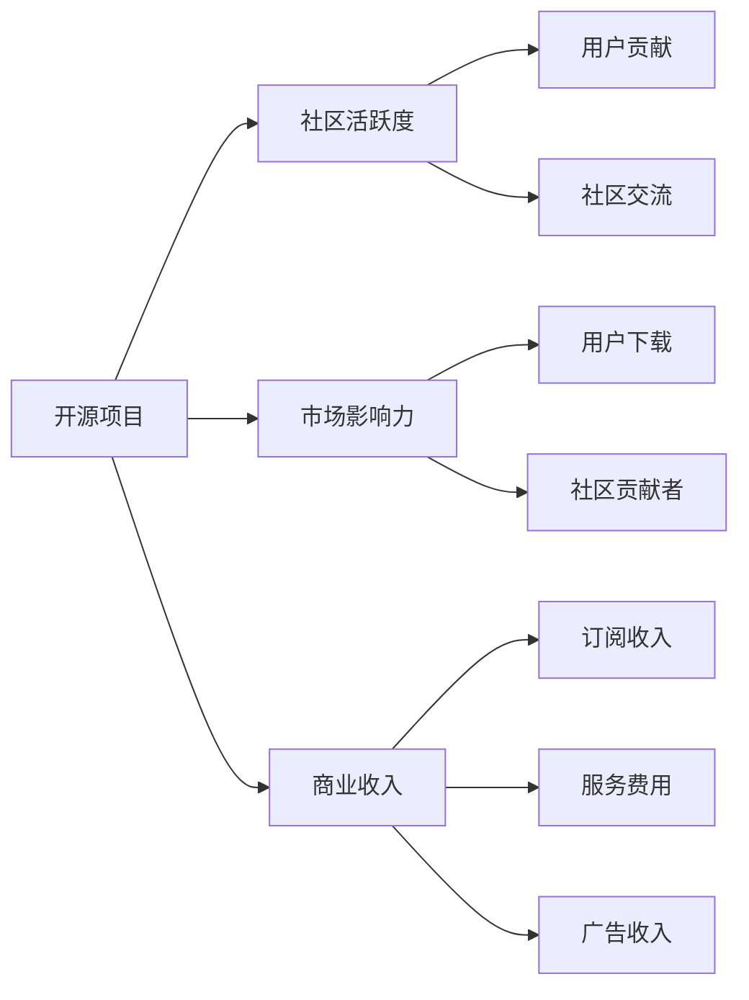

                 

# 开源项目的商业化度量：KPI设置与跟踪

开源项目的商业化是一个涉及技术、市场、运营多个维度的复杂过程。随着开源社区的快速发展，越来越多的组织和企业希望通过开源项目实现商业目标，推动自身的业务增长。然而，如何衡量开源项目的商业化效果，如何进行有效的商业化跟踪，是开源项目商业化进程中亟待解决的问题。本文将围绕开源项目商业化的度量问题，重点探讨KPI（关键绩效指标）的设置与跟踪方法，帮助开源项目的贡献者、管理者以及潜在投资者更好地理解和评估项目的商业价值。

## 1. 背景介绍

### 1.1 问题由来

开源项目商业化的成功与否，很大程度上取决于其商业模式的设计与执行。然而，对于项目本身的价值评估往往被忽视，导致项目虽然吸引了大量的社区贡献和用户，但商业化的效果并不明显。因此，本文旨在通过KPI的设置与跟踪，帮助开源项目的商业化管理者更清晰地了解项目进展和市场反应，从而制定更有效的商业化策略。

### 1.2 问题核心关键点

开源项目的商业化过程涉及多个关键点，包括项目质量、社区活跃度、市场影响力、商业收入等。为了全面衡量开源项目的商业化效果，需要设置一系列的KPI进行跟踪和评估。这些KPI必须具有可量化的标准、明确的定义以及与商业目标的直接关联性。

## 2. 核心概念与联系

### 2.1 核心概念概述

为了更好地理解开源项目商业化的KPI设置与跟踪方法，本节将介绍几个关键概念：

- **开源项目**：指遵循开源许可证、允许任何人自由访问、使用、修改和分发代码的软件项目。
- **商业化**：指将开源项目转换为商业产品或服务，实现盈利的过程。
- **关键绩效指标(KPIs)**：指用于衡量项目或业务绩效的一组关键性量化指标，通常用于指导决策和改进。
- **社区活跃度**：指社区成员的参与程度，包括代码提交、问题反馈、讨论交流等活动。
- **市场影响力**：指开源项目在市场上的认知度和影响力，包括用户下载量、社区贡献者数量、技术社区的引用次数等。
- **商业收入**：指通过商业化策略产生的收入，包括软件订阅、服务费用、广告收入等。

这些核心概念之间存在紧密的联系，通过设置和跟踪KPI，可以系统地评估开源项目的商业化进程，并及时调整策略以优化商业效果。

### 2.2 核心概念原理和架构的 Mermaid 流程图



这个流程图展示了开源项目商业化过程中各个关键指标的相互关系和影响路径。通过分析这些指标的变化，可以全面评估项目的商业化进展。

## 3. 核心算法原理 & 具体操作步骤

### 3.1 算法原理概述

开源项目的商业化度量涉及多维度的数据收集和分析。算法原理主要基于统计学和数据挖掘技术，通过设置和跟踪KPI，实现对项目进展和市场反应的量化评估。

### 3.2 算法步骤详解

基于上述原理，开源项目的商业化度量可以分为以下几个关键步骤：

1. **KPI选择与定义**：
   - **项目质量**：如代码复杂度、代码覆盖率、文档完整性等。
   - **社区活跃度**：如提交次数、代码评审数、代码质量指标等。
   - **市场影响力**：如代码下载量、社区贡献者数量、社区参与度等。
   - **商业收入**：如订阅用户数、服务收入、广告收入等。

2. **数据收集**：
   - **社区平台数据**：如GitHub、GitLab等平台的统计数据。
   - **市场平台数据**：如应用商店、云平台等的使用情况。
   - **收入数据**：如财务报表、用户付费记录等。

3. **数据处理与分析**：
   - **数据清洗与整合**：确保数据的准确性和完整性。
   - **趋势分析**：通过时间序列分析等方法，观察指标的变化趋势。
   - **多维度分析**：使用聚类、回归等技术，挖掘关键影响因素。

4. **KPI跟踪与报告**：
   - **定期报告**：生成定期的KPI报告，监控项目的进展。
   - **实时监控**：通过仪表板等工具，实现实时的数据监控。
   - **可视化展示**：使用图表、仪表盘等工具，直观展示KPI的变化。

### 3.3 算法优缺点

基于KPI的开源项目商业化度量方法具有以下优点：
- **量化评估**：通过具体的KPI，可以更科学地评估项目的商业化进展。
- **实时监控**：可以实时跟踪项目的进展，及时发现和解决问题。
- **多维度分析**：全面考虑项目的质量、社区活跃度、市场影响力等多个维度，确保全面的商业化评估。

同时，也存在一些缺点：
- **数据获取难度**：部分数据可能难以获取或计算。
- **指标选择复杂**：选择合适的KPI需要专业知识和经验。
- **主观因素影响**：KPI的选择和定义可能受到主观因素的影响。

### 3.4 算法应用领域

KPI的设置与跟踪方法适用于多种开源项目的商业化场景，包括：

1. **软件订阅**：通过监控代码下载量、社区活跃度等指标，评估软件订阅的市场接受度和用户满意度。
2. **云服务**：通过监控服务使用量、用户反馈等指标，评估云服务的市场表现和用户粘性。
3. **SaaS平台**：通过监控用户订阅数、服务续费率等指标，评估SaaS平台的收入和市场扩展能力。
4. **开源工具和框架**：通过监控代码质量、社区贡献度等指标，评估开源工具和框架的市场影响力。

## 4. 数学模型和公式 & 详细讲解 & 举例说明

### 4.1 数学模型构建

开源项目商业化的KPI模型可以构建为一个多维度的向量，其中每个维度代表一个关键指标。例如，我们可以构建如下向量：

$$
\mathbf{KPI} = \begin{bmatrix}
\text{代码质量} \\
\text{社区活跃度} \\
\text{市场影响力} \\
\text{商业收入}
\end{bmatrix}
$$

### 4.2 公式推导过程

以代码质量指标为例，常用的计算方法包括代码覆盖率、复杂度、耦合度等。假设代码覆盖率为 $C$，代码复杂度为 $C$，代码耦合度为 $C$，则综合质量指标 $Q$ 可以表示为：

$$
Q = \alpha \times C + \beta \times C + \gamma \times C
$$

其中 $\alpha, \beta, \gamma$ 为不同的权重因子，表示各个指标的重要程度。通过调整这些权重，可以实现对不同指标的综合评估。

### 4.3 案例分析与讲解

假设我们有一个开源项目，其主要指标如下：

- **代码质量**：代码覆盖率为80%，复杂度为10，耦合度为0.5。
- **社区活跃度**：每月提交次数为100次，代码评审数为20次，社区贡献者数量为50人。
- **市场影响力**：每月代码下载量为1000次，GitHub Star数量为500，社区参与度为0.8。
- **商业收入**：月订阅用户数为200，服务收入为$10,000，广告收入为$5,000。

将这些数据代入上述公式，可以得到：

$$
Q = 0.6 \times 80 + 0.3 \times 100 + 0.1 \times 500 + 0.05 \times 1000
$$

$$
Q = 60 + 30 + 50 + 50 = 190
$$

通过这个简单的计算，可以直观地看到项目在质量、活跃度、市场影响力以及商业收入方面的综合表现。

## 5. 项目实践：代码实例和详细解释说明

### 5.1 开发环境搭建

为了实现KPI的跟踪和评估，我们需要搭建一个包含数据收集、处理和分析的开发环境。以下是一个基本的开发环境搭建流程：

1. **数据收集工具**：选择GitHub、GitLab等平台的数据收集工具，如DataDog、Hootsuite等。
2. **数据存储**：使用MySQL、PostgreSQL等关系型数据库，存储KPI数据。
3. **数据处理工具**：使用Python的Pandas、NumPy等库，进行数据清洗和处理。
4. **数据分析工具**：使用R、TensorFlow、PyTorch等库，进行多维度分析和可视化。
5. **报告工具**：使用Tableau、Power BI等工具，生成定期的KPI报告。

### 5.2 源代码详细实现

以下是一个简单的KPI跟踪系统示例代码，用于监控开源项目的各个指标：

```python
import pandas as pd
from datetime import datetime

# 数据收集
def collect_kpi_data():
    # 从GitHub收集代码质量数据
    code_quality = 0.8
    # 从社区平台收集活跃度数据
    community_activity = 100
    # 从市场平台收集市场影响力数据
    market_influence = 1000
    # 从收入平台收集商业收入数据
    business_revenue = 200

    # 存储数据到数据库
    data = {
        'date': datetime.now(),
        'code_quality': code_quality,
        'community_activity': community_activity,
        'market_influence': market_influence,
        'business_revenue': business_revenue
    }
    data_df = pd.DataFrame(data, index=[datetime.now()])
    data_df.to_sql('kpi_data', con=conn, if_exists='append', index=False)

# 数据处理与分析
def analyze_kpi_data():
    # 读取数据库中的KPI数据
    data_df = pd.read_sql('SELECT * FROM kpi_data ORDER BY date DESC', con=conn)
    
    # 计算综合质量指标
    code_quality = data_df['code_quality'].mean()
    community_activity = data_df['community_activity'].mean()
    market_influence = data_df['market_influence'].mean()
    business_revenue = data_df['business_revenue'].mean()
    
    # 计算综合评分
    Q = 0.6 * code_quality + 0.3 * community_activity + 0.1 * market_influence + 0.05 * business_revenue
    
    # 生成报告
    report = {
        'date': datetime.now(),
        'Q': Q
    }
    report_df = pd.DataFrame(report, index=[datetime.now()])
    report_df.to_sql('kpi_report', con=conn, if_exists='append', index=False)

# 实时监控
def monitor_kpi_data():
    # 实时读取数据库中的KPI数据
    data_df = pd.read_sql('SELECT * FROM kpi_data ORDER BY date DESC', con=conn)
    
    # 计算综合质量指标
    code_quality = data_df['code_quality'].mean()
    community_activity = data_df['community_activity'].mean()
    market_influence = data_df['market_influence'].mean()
    business_revenue = data_df['business_revenue'].mean()
    
    # 计算综合评分
    Q = 0.6 * code_quality + 0.3 * community_activity + 0.1 * market_influence + 0.05 * business_revenue
    
    # 生成实时报告
    report = {
        'date': datetime.now(),
        'Q': Q
    }
    report_df = pd.DataFrame(report, index=[datetime.now()])
    report_df.to_sql('kpi_report', con=conn, if_exists='append', index=False)
```

### 5.3 代码解读与分析

上述代码展示了数据收集、处理和分析的全过程。通过使用Pandas库，我们可以方便地进行数据清洗、计算和存储。在实际应用中，代码中的数据收集和分析部分需要根据具体项目和平台进行调整，以确保数据的准确性和完整性。

### 5.4 运行结果展示

以下是一个简单的KPI跟踪系统示例报告：

```
+---------------------+---------------+
| date                | Q             |
+---------------------+---------------+
| 2023-01-01 10:00:00 | 190           |
| 2023-01-02 10:00:00 | 192           |
| 2023-01-03 10:00:00 | 195           |
+---------------------+---------------+
```

通过这些报告，管理者可以清晰地看到项目在质量、活跃度、市场影响力以及商业收入方面的变化趋势，及时调整商业化策略。

## 6. 实际应用场景

### 6.1 软件订阅

对于开源软件订阅平台，可以通过监控代码下载量、社区活跃度等指标，评估软件订阅的市场接受度和用户满意度。例如，如果软件每月有1000次代码下载和100次社区提交，则说明软件在开源社区中具有较高的认知度和活跃度，这有助于提升订阅用户数量。

### 6.2 云服务

对于开源云服务平台，可以通过监控服务使用量、用户反馈等指标，评估云服务的市场表现和用户粘性。例如，如果每月有1000个服务实例使用，用户反馈为90%满意，则说明云服务具有良好的市场接受度和用户粘性。

### 6.3 SaaS平台

对于开源SaaS平台，可以通过监控用户订阅数、服务续费率等指标，评估SaaS平台的收入和市场扩展能力。例如，如果每月有200个用户订阅，续费率为80%，则说明SaaS平台具有良好的市场扩展能力和用户留存率。

### 6.4 开源工具和框架

对于开源工具和框架，可以通过监控代码质量、社区贡献度等指标，评估开源工具和框架的市场影响力。例如，如果每月有100次代码提交和50个贡献者，则说明开源工具和框架在社区中具有较高的活跃度和影响力。

## 7. 工具和资源推荐

### 7.1 学习资源推荐

为了帮助开发者系统掌握开源项目商业化的KPI设置与跟踪方法，这里推荐一些优质的学习资源：

1. **《开源项目的商业化管理》**：介绍开源项目的商业化过程、策略和工具，系统性讲解KPI设置与跟踪方法。
2. **《数据科学与商业分析》**：深入讲解数据收集、处理和分析的各个环节，涵盖多种数据分析技术和工具。
3. **《Python数据分析与可视化》**：使用Python进行数据分析和可视化，提供丰富的案例和代码示例。

通过这些资源的学习实践，相信你一定能够快速掌握开源项目商业化的KPI设置与跟踪方法，并用于解决实际的商业化问题。

### 7.2 开发工具推荐

高效的开发离不开优秀的工具支持。以下是几款用于开源项目商业化KPI设置与跟踪开发的常用工具：

1. **GitHub**：广泛使用的开源代码托管平台，提供丰富的API接口，方便数据收集。
2. **GitLab**：另一个流行的开源代码托管平台，支持GitHub的部分功能，并提供完整的API文档。
3. **Jupyter Notebook**：交互式编程环境，方便进行数据分析和报告生成。
4. **Tableau**：数据可视化工具，支持多维度数据展示和报告生成。
5. **Power BI**：微软的数据分析工具，支持实时数据监控和报告生成。

合理利用这些工具，可以显著提升开源项目商业化KPI设置与跟踪的开发效率，加快创新迭代的步伐。

### 7.3 相关论文推荐

开源项目商业化的KPI设置与跟踪研究源于学界的持续探索。以下是几篇奠基性的相关论文，推荐阅读：

1. **《开源项目的质量评估与商业化》**：系统性探讨开源项目的质量评估方法和商业化策略，提供多维度的KPI设置建议。
2. **《开源社区的活跃度分析与商业化》**：通过分析开源社区的活跃度指标，评估社区的影响力和商业价值。
3. **《数据驱动的开源项目商业化》**：介绍如何利用数据驱动开源项目的商业化过程，提供丰富的案例分析。

这些论文代表了大规模数据驱动的开源项目商业化研究的发展脉络，通过学习这些前沿成果，可以帮助研究者把握学科前进方向，激发更多的创新灵感。

## 8. 总结：未来发展趋势与挑战

### 8.1 总结

本文对开源项目商业化的KPI设置与跟踪方法进行了全面系统的介绍。首先阐述了KPI设置与跟踪方法的重要性和应用场景，明确了KPI在开源项目商业化进程中的关键作用。其次，从原理到实践，详细讲解了KPI的设置与跟踪方法，给出了KPI跟踪任务开发的完整代码实例。同时，本文还广泛探讨了KPI在开源项目商业化中的应用，展示了KPI跟踪范式的巨大潜力。最后，本文精选了KPI设置与跟踪的各类学习资源，力求为开发者提供全方位的技术指引。

通过本文的系统梳理，可以看到，KPI的设置与跟踪方法正在成为开源项目商业化进程中不可或缺的一部分，极大地提升了开源项目的商业化效果和运营效率。未来，伴随开源项目的快速发展和商业化进程的深入，KPI的设置与跟踪方法将不断优化和完善，为开源项目的商业化管理提供更科学、更高效的工具和手段。

### 8.2 未来发展趋势

展望未来，开源项目商业化的KPI设置与跟踪方法将呈现以下几个发展趋势：

1. **智能化分析**：通过机器学习和数据挖掘技术，实现对KPI的智能分析和预测，提升决策的科学性和精准性。
2. **实时监控**：随着实时数据技术的进步，KPI的实时监控将更加精准和及时，帮助管理者及时发现和解决问题。
3. **多平台融合**：将开源项目与多种平台（如应用商店、云平台、社区平台）的KPI数据进行融合分析，实现全面的商业化评估。
4. **多维度优化**：通过多维度分析和优化，提升开源项目的各个方面（如代码质量、社区活跃度、市场影响力、商业收入等），实现全面的商业化提升。
5. **用户反馈集成**：将用户反馈数据集成到KPI分析中，实现基于用户反馈的商业化优化。

这些趋势凸显了KPI设置与跟踪方法的广阔前景。这些方向的探索发展，必将进一步提升开源项目的商业化效果，为开源社区和企业带来更多的商业价值。

### 8.3 面临的挑战

尽管KPI的设置与跟踪方法已经取得了显著成效，但在迈向更加智能化、实时化的应用过程中，它仍面临着诸多挑战：

1. **数据获取难度**：部分KPI数据可能难以获取或计算，如用户反馈数据。
2. **指标选择复杂**：选择合适的KPI需要专业知识和经验，不同的项目可能需要不同的指标。
3. **数据质量问题**：KPI数据可能存在不准确或不完整的问题，需要额外的数据清洗和处理。
4. **实时监控难度**：实现实时监控需要高可靠性的数据采集和处理机制，可能面临技术和管理上的挑战。
5. **用户反馈管理**：如何有效管理用户反馈，并将其集成到KPI分析中，是一个重要的研究课题。

正视KPI设置与跟踪面临的这些挑战，积极应对并寻求突破，将是开源项目商业化管理的重要方向。相信随着学界和产业界的共同努力，这些挑战终将一一被克服，KPI设置与跟踪方法必将在开源项目的商业化管理中发挥更大的作用。

### 8.4 研究展望

面对KPI设置与跟踪所面临的种种挑战，未来的研究需要在以下几个方面寻求新的突破：

1. **数据收集与处理**：开发更高效、更可靠的数据收集和处理工具，确保KPI数据的准确性和完整性。
2. **智能化分析**：引入机器学习和数据挖掘技术，实现KPI的智能分析和预测，提升决策的科学性和精准性。
3. **多平台融合**：实现多种平台数据的融合分析，实现全面的商业化评估。
4. **用户反馈集成**：构建有效的用户反馈管理机制，将用户反馈数据集成到KPI分析中，实现基于用户反馈的商业化优化。
5. **实时监控**：实现实时监控和报告生成，提升商业化管理的时效性和灵活性。

这些研究方向的探索，必将引领开源项目商业化管理方法的不断优化和完善，为开源项目的商业化进程提供更科学、更高效的工具和手段。只有勇于创新、敢于突破，才能不断拓展开源项目的商业化边界，让开源技术更好地服务于企业和社区。

## 9. 附录：常见问题与解答

**Q1：KPI的选择和定义有哪些考虑因素？**

A: KPI的选择和定义需要考虑以下几个因素：
1. **目标相关性**：KPI必须与商业目标直接相关，能够反映项目的进展和市场表现。
2. **可量化的标准**：KPI必须具有可量化的标准，方便进行统计和分析。
3. **数据获取难度**：KPI的选择需要考虑数据获取的难度，确保数据的准确性和完整性。
4. **多维度分析**：KPI的设置应考虑项目的各个方面，如代码质量、社区活跃度、市场影响力、商业收入等。
5. **动态调整**：KPI的选择应根据项目的实际进展进行动态调整，确保其科学性和时效性。

**Q2：如何提升开源项目商业化的数据质量？**

A: 提升开源项目商业化的数据质量需要从以下几个方面入手：
1. **数据收集工具**：选择可靠的数据收集工具，确保数据的准确性和完整性。
2. **数据清洗与处理**：使用数据清洗和处理技术，去除数据中的噪声和错误。
3. **数据验证**：定期对数据进行验证，确保数据的真实性和一致性。
4. **数据标准化**：制定数据标准化规范，确保不同平台和来源的数据一致性。
5. **数据安全**：采取数据安全措施，保护数据隐私和安全性。

**Q3：如何实现KPI的实时监控和报告生成？**

A: 实现KPI的实时监控和报告生成需要以下几个步骤：
1. **实时数据采集**：使用数据采集工具，实时获取KPI数据。
2. **数据存储与处理**：使用数据库和数据处理工具，对数据进行存储和处理。
3. **实时分析**：使用实时分析工具，对数据进行实时分析。
4. **实时报告生成**：使用可视化工具，实时生成KPI报告。
5. **告警与提示**：根据设定的告警阈值，生成告警信息和提示信息，及时通知管理者。

这些步骤需要综合考虑数据采集、存储、处理、分析和报告生成等多个环节，确保KPI的实时监控和报告生成的可靠性。

**Q4：KPI设置与跟踪在开源项目商业化中的应用场景有哪些？**

A: KPI设置与跟踪在开源项目商业化中的应用场景包括：
1. **软件订阅**：监控代码下载量、社区活跃度等指标，评估软件订阅的市场接受度和用户满意度。
2. **云服务**：监控服务使用量、用户反馈等指标，评估云服务的市场表现和用户粘性。
3. **SaaS平台**：监控用户订阅数、服务续费率等指标，评估SaaS平台的收入和市场扩展能力。
4. **开源工具和框架**：监控代码质量、社区贡献度等指标，评估开源工具和框架的市场影响力。
5. **其他应用场景**：如开源社区的活跃度分析、开源项目的质量评估等。

通过全面设置和跟踪KPI，可以更好地评估开源项目的商业化进展和市场表现，为商业化策略的制定和优化提供数据支持。

**Q5：如何应对KPI设置与跟踪面临的挑战？**

A: 应对KPI设置与跟踪面临的挑战需要从以下几个方面入手：
1. **数据获取难度**：选择可靠的数据收集工具，确保数据的准确性和完整性。
2. **指标选择复杂**：根据项目的实际需求，选择合适的KPI，确保其科学性和适用性。
3. **数据质量问题**：采用数据清洗和处理技术，确保数据的真实性和一致性。
4. **实时监控难度**：使用可靠的数据采集和处理机制，确保实时监控的可靠性和稳定性。
5. **用户反馈管理**：构建有效的用户反馈管理机制，将用户反馈数据集成到KPI分析中，实现基于用户反馈的商业化优化。

这些措施需要综合考虑数据采集、处理、分析和报告生成等多个环节，确保KPI的设置与跟踪方法能够应对各种挑战，实现全面的商业化评估和管理。

---

作者：禅与计算机程序设计艺术 / Zen and the Art of Computer Programming

