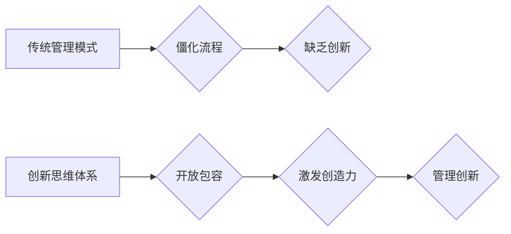

                 

## 思维体系对管理创新的推动作用

> 关键词：创新、思维体系、管理模式、组织文化、技术驱动、跨界融合、敏捷开发、数据驱动、人工智能

## 1. 背景介绍

在当今瞬息万变的科技时代，创新已成为企业持续发展的关键驱动力。然而，单纯依靠技术革新不足以保证企业长远竞争力。管理层对于创新的理解和引导，对于激发员工的创造力、构建创新文化、推动创新落地至关重要。

传统管理模式往往强调流程规范、层级管理和短期目标，这不利于激发员工的创新热情和创造力。随着人工智能、大数据等新技术的快速发展，企业需要更加灵活、敏捷的管理模式来应对挑战，并充分利用新技术的力量推动创新。

## 2. 核心概念与联系

**2.1 思维体系**

思维体系是指一个人或一个群体在认知、理解和解决问题时所遵循的思维方式、方法和模式。它包括认知结构、知识体系、价值观、信念体系等多个方面，对个人的行为、决策和创造力都具有深远影响。

**2.2 管理创新**

管理创新是指在管理理念、管理模式、管理方法等方面进行的创新，以提高企业效率、效益和竞争力。它包括组织结构创新、管理流程创新、管理制度创新、管理文化创新等多个方面。

**2.3 联系**

思维体系是管理创新的基础。一个开放、包容、鼓励创新的思维体系，能够激发员工的创造力，促进管理创新的产生和落地。

**Mermaid 流程图**



## 3. 核心算法原理 & 具体操作步骤

**3.1 算法原理概述**

管理创新并非一个简单的算法，而是需要结合多种因素进行综合分析和决策的过程。 

**3.2 算法步骤详解**

1. **识别问题和需求**: 通过市场调研、用户反馈、内部数据分析等方式，识别企业面临的挑战和潜在的创新机会。
2. **激发创意**: 利用头脑风暴、设计思维、跨界融合等方法，激发员工的创意和想法。
3. **评估和筛选**: 对提出的创意进行评估和筛选，选择具有商业价值和可行性的方案。
4. **原型设计和测试**: 对选定的方案进行原型设计和测试，验证其可行性和有效性。
5. **迭代优化**: 根据测试结果，对方案进行迭代优化，不断完善和改进。
6. **落地实施**: 将经过优化和验证的方案落地实施，并进行跟踪评估。

**3.3 算法优缺点**

* **优点**: 

    * 能够有效地识别问题和需求，并找到创新的解决方案。
    * 能够激发员工的创造力，促进团队协作。
    * 能够提高管理效率，降低风险。

* **缺点**: 

    * 需要投入大量的时间和资源。
    * 需要具备一定的创新能力和管理经验。
    * 难以量化评估创新成果。

**3.4 算法应用领域**

* 产品研发
* 营销推广
* 运营管理
* 组织结构调整
* 文化建设

## 4. 数学模型和公式 & 详细讲解 & 举例说明

**4.1 数学模型构建**

管理创新可以看作是一个复杂系统，可以用数学模型来描述其内部的相互作用和演化过程。例如，我们可以用以下模型来描述创新过程中的知识积累和传播：

$$
K(t) = K(t-1) + \alpha * I(t) - \beta * K(t)
$$

其中：

* $K(t)$ 表示在时间 $t$ 时刻的知识积累量。
* $K(t-1)$ 表示在时间 $t-1$ 时刻的知识积累量。
* $\alpha$ 表示知识输入的速度。
* $I(t)$ 表示在时间 $t$ 时刻的创新输入量。
* $\beta$ 表示知识遗忘的速度。

**4.2 公式推导过程**

该模型的推导过程基于以下假设：

* 知识积累是一个累积的过程，即当前时刻的知识积累量等于前一时刻的知识积累量加上新的知识输入量减去知识遗忘量。
* 知识输入量和知识遗忘量都是时间相关的。

**4.3 案例分析与讲解**

假设一家科技公司投入大量资源进行研发，其知识输入速度 $\alpha$ 较高。同时，公司鼓励员工进行创新，其创新输入量 $I(t)$ 也较高。在这种情况下，公司的知识积累量 $K(t)$ 会快速增长。

## 5. 项目实践：代码实例和详细解释说明

**5.1 开发环境搭建**

* 操作系统：Linux/macOS/Windows
* 编程语言：Python
* 工具：Git、Jupyter Notebook

**5.2 源代码详细实现**

```python
import numpy as np

# 定义模型参数
alpha = 0.8  # 知识输入速度
beta = 0.2  # 知识遗忘速度

# 初始化知识积累量
K = 100

# 模拟时间步长
for t in range(10):
    # 知识输入量
    I = np.random.rand() * 10

    # 计算知识积累量
    K = K + alpha * I - beta * K

    # 打印结果
    print(f"时间步长 {t+1}: 知识积累量 {K:.2f}")
```

**5.3 代码解读与分析**

该代码实现了上述数学模型的模拟。

* `alpha` 和 `beta` 参数分别代表知识输入速度和知识遗忘速度。
* `I` 变量模拟了在每个时间步长上的创新输入量。
* `K` 变量存储了知识积累量，并根据模型公式进行更新。

**5.4 运行结果展示**

运行该代码后，会输出每个时间步长上的知识积累量，展示知识积累量的变化趋势。

## 6. 实际应用场景

**6.1 企业创新管理**

* 构建创新激励机制，鼓励员工提出创新想法。
* 建立开放的沟通平台，促进知识共享和跨部门合作。
* 利用数据分析工具，识别创新机会和潜在风险。

**6.2 产品研发创新**

* 采用敏捷开发模式，快速迭代产品原型。
* 利用用户反馈，不断优化产品功能和体验。
* 探索新技术和新材料，开发颠覆性产品。

**6.3 组织文化建设**

* 倡导创新文化，鼓励员工勇于尝试和突破。
* 建立学习型组织，不断提升员工的创新能力。
* 营造包容和信任的氛围，激发员工的创造力。

**6.4 未来应用展望**

随着人工智能、大数据等技术的不断发展，管理创新将更加智能化、数据化和个性化。

* 人工智能将能够帮助企业识别创新机会、评估创新方案和预测创新成果。
* 大数据将能够帮助企业洞察用户需求、分析市场趋势和优化创新流程。
* 个性化管理将能够帮助企业根据员工的个性特点和能力，制定个性化的创新激励机制和发展路径。

## 7. 工具和资源推荐

**7.1 学习资源推荐**

* 书籍：《创新者的窘境》、《零到一》、《从优秀到卓越》
* 课程：Coursera 上的《创新管理》课程
* 网站：IDEO、Harvard Business Review

**7.2 开发工具推荐**

* 项目管理工具：Jira、Trello
* 协作工具：Slack、Microsoft Teams
* 数据分析工具：Tableau、Power BI

**7.3 相关论文推荐**

* Clayton M. Christensen, The Innovator's Dilemma: When New Technologies Cause Great Firms to Fail
* Eric Ries, The Lean Startup: How Today's Entrepreneurs Use Continuous Innovation to Create Radically Successful Businesses
* Peter Drucker, Innovation and Entrepreneurship: Practice and Principles

## 8. 总结：未来发展趋势与挑战

**8.1 研究成果总结**

本文探讨了思维体系对管理创新的推动作用，并介绍了相关的数学模型、算法原理和实践案例。

**8.2 未来发展趋势**

未来，管理创新将更加智能化、数据化和个性化，人工智能、大数据等技术将发挥越来越重要的作用。

**8.3 面临的挑战**

* 如何构建更加开放、包容、鼓励创新的思维体系。
* 如何有效地利用人工智能和数据分析技术，推动管理创新的落地。
* 如何培养员工的创新能力和创造力，激发他们的创新热情。

**8.4 研究展望**

未来研究将重点关注以下几个方面：

* 探索不同类型思维体系对管理创新的影响。
* 研究人工智能在管理创新中的应用场景和最佳实践。
* 建立更加完善的管理创新评价体系，量化评估创新成果。


## 9. 附录：常见问题与解答

**9.1 如何激发员工的创新热情？**

* 建立开放的沟通平台，鼓励员工提出想法和建议。
* 设立创新奖励机制，对创新成果进行表彰和奖励。
* 组织创新培训和交流活动，提升员工的创新能力。

**9.2 如何评估管理创新的效果？**

* 通过数据分析，评估创新方案的经济效益和社会效益。
* 通过员工反馈，评估创新方案对员工工作效率和工作满意度的影响。
* 通过市场调研，评估创新方案对企业竞争力的提升。


作者：禅与计算机程序设计艺术 / Zen and the Art of Computer Programming 
<end_of_turn>

