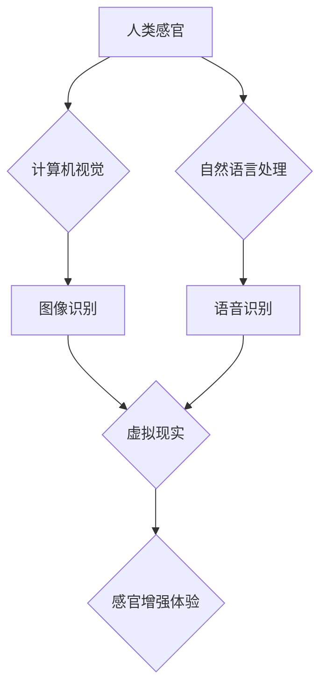

                 

## 感官增强：AI技术与人类体验的融合

> 关键词：人工智能、感官增强、虚拟现实、增强现实、深度学习、计算机视觉、自然语言处理、用户体验

### 1. 背景介绍

人类历史上的每一次重大科技进步都深刻地改变了我们的生活方式和感知世界的方式。从火的使用到印刷术的出现，再到互联网的普及，每一次突破都拓展了人类的认知边界，丰富了我们的体验。如今，人工智能（AI）正以惊人的速度发展，并有望开启一个全新的时代——感官增强时代。

感官增强是指利用人工智能技术，扩展和增强人类的感官能力，使其能够感知到超出自然界范围的信息和体验。这不仅意味着我们可以看到更清晰的图像、听到更丰富的音效，还可以感知到新的信息维度，例如温度、压力、情绪等。

### 2. 核心概念与联系

感官增强技术的核心概念是将人工智能与人类感官系统相结合。这涉及到多个领域的技术融合，包括：

* **计算机视觉：** 赋予计算机“看”的能力，识别、理解和解释图像和视频信息。
* **自然语言处理：** 赋予计算机“听”和“说”的能力，理解和生成人类语言。
* **深度学习：** 一种机器学习算法，能够从海量数据中学习复杂的模式和关系。
* **虚拟现实（VR）和增强现实（AR）：** 创建沉浸式虚拟环境或将虚拟信息叠加到现实世界中，增强用户的感知体验。

**核心概念与联系流程图：**



### 3. 核心算法原理 & 具体操作步骤

#### 3.1 算法原理概述

感官增强算法的核心原理是利用深度学习技术，训练模型能够从原始感官数据中提取特征，并将其转化为人类能够理解的感知信息。例如，在视觉增强领域，深度学习模型可以学习识别图像中的物体、场景和人物，并将其转化为文字描述、情绪标签或其他有意义的信息。

#### 3.2 算法步骤详解

感官增强算法的具体操作步骤通常包括以下几个阶段：

1. **数据采集和预处理：** 收集大量相关感官数据，例如图像、视频、音频、文本等，并进行预处理，例如图像裁剪、音频降噪、文本分词等。
2. **特征提取：** 利用深度学习模型，从原始感官数据中提取特征，例如图像中的边缘、纹理、颜色等，或音频中的音调、节奏、语调等。
3. **模型训练：** 使用训练数据，训练深度学习模型，使其能够将提取的特征映射到人类能够理解的感知信息。
4. **模型评估和优化：** 使用测试数据评估模型的性能，并根据评估结果进行模型优化，例如调整模型参数、增加训练数据等。
5. **应用部署：** 将训练好的模型部署到实际应用场景中，例如虚拟现实设备、智能眼镜、智能家居等。

#### 3.3 算法优缺点

**优点：**

* **增强感知能力：** 可以扩展和增强人类的感官能力，感知到超出自然界范围的信息。
* **个性化体验：** 可以根据用户的需求和喜好，定制个性化的感官增强体验。
* **提升效率和准确性：** 可以帮助用户更快、更准确地获取信息和完成任务。

**缺点：**

* **技术复杂性：** 感官增强技术涉及多个领域的技术融合，开发难度较高。
* **数据依赖性：** 深度学习模型需要大量数据进行训练，数据质量和数量直接影响模型性能。
* **伦理和安全问题：** 感官增强技术可能带来一些伦理和安全问题，例如隐私泄露、信息操纵、虚拟现实成瘾等。

#### 3.4 算法应用领域

感官增强算法在多个领域都有广泛的应用前景，例如：

* **医疗保健：** 帮助医生诊断疾病、进行手术、提供远程医疗服务。
* **教育培训：** 创建沉浸式学习环境，增强学生的学习体验和记忆效果。
* **娱乐休闲：** 提供更加逼真的游戏体验、增强现实互动体验等。
* **工业制造：** 帮助工人进行远程操作、进行缺陷检测、提高生产效率。

### 4. 数学模型和公式 & 详细讲解 & 举例说明

#### 4.1 数学模型构建

感官增强算法通常基于深度学习模型，例如卷积神经网络（CNN）和循环神经网络（RNN）。这些模型可以看作是复杂的数学函数，其参数通过训练数据进行优化。

#### 4.2 公式推导过程

深度学习模型的训练过程本质上是一个优化问题，目标是找到模型参数，使得模型在训练数据上的预测误差最小化。常用的优化算法包括梯度下降法和其变种算法。

**梯度下降法公式：**

$$
\theta = \theta - \alpha \nabla J(\theta)
$$

其中：

* $\theta$ 是模型参数
* $\alpha$ 是学习率
* $J(\theta)$ 是损失函数，表示模型预测误差

#### 4.3 案例分析与讲解

例如，在图像识别任务中，CNN模型可以学习图像特征，并将这些特征映射到不同的类别标签。训练过程中，模型会根据图像标签和预测结果计算损失函数，然后利用梯度下降法更新模型参数，使得模型预测结果越来越准确。

### 5. 项目实践：代码实例和详细解释说明

#### 5.1 开发环境搭建

感官增强项目开发通常需要以下开发环境：

* **操作系统：** Linux、macOS 或 Windows
* **编程语言：** Python
* **深度学习框架：** TensorFlow、PyTorch 或 Keras
* **虚拟环境：** conda 或 virtualenv

#### 5.2 源代码详细实现

以下是一个简单的图像识别项目代码示例，使用 TensorFlow 和 Keras 框架实现：

```python
import tensorflow as tf
from tensorflow.keras.models import Sequential
from tensorflow.keras.layers import Conv2D, MaxPooling2D, Flatten, Dense

# 定义模型结构
model = Sequential()
model.add(Conv2D(32, (3, 3), activation='relu', input_shape=(28, 28, 1)))
model.add(MaxPooling2D((2, 2)))
model.add(Conv2D(64, (3, 3), activation='relu'))
model.add(MaxPooling2D((2, 2)))
model.add(Flatten())
model.add(Dense(10, activation='softmax'))

# 编译模型
model.compile(optimizer='adam',
              loss='sparse_categorical_crossentropy',
              metrics=['accuracy'])

# 训练模型
model.fit(x_train, y_train, epochs=5)

# 评估模型
loss, accuracy = model.evaluate(x_test, y_test)
print('Test loss:', loss)
print('Test accuracy:', accuracy)
```

#### 5.3 代码解读与分析

这段代码定义了一个简单的卷积神经网络模型，用于识别手写数字。模型包含两个卷积层、两个池化层、一个全连接层和一个输出层。

* **Conv2D层：** 用于提取图像特征。
* **MaxPooling2D层：** 用于降低特征图尺寸，提高模型鲁棒性。
* **Flatten层：** 用于将多维特征图转换为一维向量。
* **Dense层：** 用于分类，将特征向量映射到不同的类别标签。

#### 5.4 运行结果展示

训练完成后，模型可以用来预测新的图像数据。

### 6. 实际应用场景

感官增强技术已经开始在多个领域得到应用，例如：

#### 6.1 医疗保健

* **远程医疗：** 感官增强技术可以帮助医生远程诊断患者，例如通过虚拟现实设备查看患者的病历和影像数据。
* **手术辅助：** 感官增强技术可以帮助医生进行更精准的手术，例如通过增强现实设备在手术过程中显示患者的血管和神经结构。

#### 6.2 教育培训

* **沉浸式学习：** 感官增强技术可以创建沉浸式的学习环境，例如通过虚拟现实设备让学生体验历史事件或探索宇宙。
* **个性化学习：** 感官增强技术可以根据学生的学习进度和需求，提供个性化的学习内容和体验。

#### 6.3 娱乐休闲

* **增强现实游戏：** 感官增强技术可以将虚拟游戏元素叠加到现实世界中，例如通过增强现实眼镜在现实世界中捕捉精灵或完成任务。
* **虚拟旅游：** 感官增强技术可以让人们体验虚拟旅游，例如通过虚拟现实设备参观世界各地名胜古迹。

#### 6.4 未来应用展望

未来，感官增强技术将应用到更多领域，例如：

* **工业制造：** 感官增强技术可以帮助工人进行远程操作、进行缺陷检测、提高生产效率。
* **智能家居：** 感官增强技术可以使智能家居更加智能化，例如通过语音识别控制家电、通过图像识别识别用户的身份。
* **人机交互：** 感官增强技术可以改变人机交互的方式，例如通过脑机接口控制虚拟设备。

### 7. 工具和资源推荐

#### 7.1 学习资源推荐

* **书籍：**
    * 《深度学习》 by Ian Goodfellow, Yoshua Bengio, and Aaron Courville
    * 《动手学深度学习》 by Aurélien Géron
* **在线课程：**
    * TensorFlow 官方教程：https://www.tensorflow.org/tutorials
    * PyTorch 官方教程：https://pytorch.org/tutorials/

#### 7.2 开发工具推荐

* **深度学习框架：** TensorFlow、PyTorch、Keras
* **虚拟现实平台：** Oculus、HTC Vive、PlayStation VR
* **增强现实平台：** ARKit、ARCore

#### 7.3 相关论文推荐

* **《ImageNet Classification with Deep Convolutional Neural Networks》 by Alex Krizhevsky, Ilya Sutskever, and Geoffrey E. Hinton**
* **《Attention Is All You Need》 by Ashish Vaswani, Noam Shazeer, Niki Parmar, Jakob Uszkoreit, Llion Jones, Aidan N. Gomez, Łukasz Kaiser, and Illia Polosukhin**

### 8. 总结：未来发展趋势与挑战

#### 8.1 研究成果总结

感官增强技术近年来取得了显著进展，深度学习算法的不断发展使得感官增强技术更加成熟和强大。

#### 8.2 未来发展趋势

未来，感官增强技术将朝着以下几个方向发展：

* **更逼真的感官体验：** 通过更先进的算法和硬件，创造更加逼真的虚拟和增强现实体验。
* **更个性化的体验：** 根据用户的需求和喜好，定制个性化的感官增强体验。
* **更广泛的应用场景：** 感官增强技术将应用到更多领域，例如医疗保健、教育培训、工业制造等。

#### 8.3 面临的挑战

感官增强技术也面临一些挑战：

* **技术复杂性：** 感官增强技术涉及多个领域的技术融合，开发难度较高。
* **数据依赖性：** 深度学习模型需要大量数据进行训练，数据质量和数量直接影响模型性能。
* **伦理和安全问题：** 感官增强技术可能带来一些伦理和安全问题，例如隐私泄露、信息操纵、虚拟现实成瘾等。

#### 8.4 研究展望

未来，我们需要继续加强对感官增强技术的研发，解决技术难题，并制定相应的伦理和安全规范，确保感官增强技术能够安全、健康地发展，造福人类社会。

### 9. 附录：常见问题与解答

#### 9.1 什么是感官增强？

感官增强是指利用人工智能技术，扩展和增强人类的感官能力，使其能够感知到超出自然界范围的信息和体验。

#### 9.2 感官增强技术的应用场景有哪些？

感官增强技术的应用场景非常广泛，例如医疗保健、教育培训、娱乐休闲、工业制造等。

#### 9.3 感官增强技术有哪些挑战？

感官增强技术面临的技术挑战包括技术复杂性、数据依赖性和伦理安全问题。

#### 9.4 未来感官增强技术的发展趋势是什么？

未来感官增强技术将朝着更逼真的感官体验、更个性化的体验和更广泛的应用场景发展。


作者：禅与计算机程序设计艺术 / Zen and the Art of Computer Programming 
<end_of_turn>

