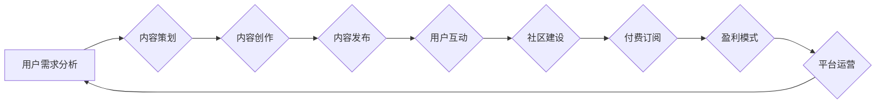

                 

## 打造知识付费专栏:内容策划与运营

> 关键词：知识付费、专栏运营、内容策划、技术博客、社区建设、付费订阅、市场营销

## 1. 背景介绍

近年来，随着互联网技术的快速发展和知识经济的兴起，知识付费模式逐渐成为一种备受关注的商业模式。知识付费专栏作为一种新型的知识传播平台，以其专业性、权威性和便捷性，吸引了越来越多的用户和创作者。

**1.1 知识付费市场现状**

中国知识付费市场规模持续增长，预计未来几年将保持高速发展态势。用户对高质量知识的需求日益增长，而创作者也渴望通过知识付费获得收益。

**1.2 技术博客的机遇与挑战**

技术博客作为一种专业性强的知识传播平台，在知识付费领域拥有独特的优势。

* **优势:**
    * **专业性:** 技术博客通常由技术专家或工程师撰写，内容专业性强，能够满足用户对专业知识的需求。
    * **权威性:** 技术博客的作者通常拥有丰富的行业经验和技术背景，能够提供权威的知识和见解。
    * **便捷性:** 用户可以通过互联网随时随地访问技术博客，获取所需知识。

* **挑战:**
    * **内容竞争激烈:** 技术领域知识更新迭代快，内容竞争激烈，需要不断更新和创作高质量内容。
    * **用户付费意愿:** 用户对付费内容的接受度和付费意愿仍然存在一定程度的限制。
    * **平台运营成本:** 建立和运营一个成功的技术博客需要投入一定的成本，包括内容创作、平台维护、推广等。

## 2. 核心概念与联系

知识付费专栏的运营需要结合内容策划、社区建设、付费订阅等多个环节，形成一个完整的闭环系统。

**2.1 内容策划**

内容策划是知识付费专栏运营的核心环节，需要根据目标用户需求和市场趋势，制定合理的主题、内容结构和发布策略。

**2.2 社区建设**

社区建设是知识付费专栏用户粘性提升的关键。通过建立线上线下社区，鼓励用户互动交流，形成知识共享和学习氛围。

**2.3 付费订阅**

付费订阅是知识付费专栏的盈利模式。通过提供不同等级的付费内容和服务，满足用户不同需求，实现可持续发展。

**2.4 流程图**



## 3. 核心算法原理 & 具体操作步骤

知识付费专栏的运营需要借助一些算法和工具来提高效率和效果。

**3.1 算法原理概述**

* **内容推荐算法:** 基于用户行为数据和内容特征，推荐用户感兴趣的内容。
* **社区活跃度算法:** 衡量社区用户活跃度，识别活跃用户和优质内容。
* **付费转化算法:** 分析用户付费行为，优化付费策略和内容结构。

**3.2 算法步骤详解**

* **内容推荐算法:**
    1. 收集用户行为数据，例如浏览记录、点赞、评论等。
    2. 分析内容特征，例如主题、标签、作者等。
    3. 利用机器学习算法，构建用户兴趣模型和内容相似度模型。
    4. 根据模型预测，推荐用户感兴趣的内容。

* **社区活跃度算法:**
    1. 统计用户参与度，例如发帖、回复、点赞等。
    2. 计算用户活跃度得分，衡量用户活跃程度。
    3. 识别活跃用户和优质内容，给予优先展示和推荐。

* **付费转化算法:**
    1. 分析用户付费行为，例如付费类型、付费金额、付费时间等。
    2. 构建用户付费模型，预测用户付费意愿。
    3. 根据模型结果，优化付费策略和内容结构，提高付费转化率。

**3.3 算法优缺点**

* **优点:**
    * 自动化推荐和运营，提高效率和精准度。
    * 数据驱动决策，优化运营策略。
    * 个性化内容体验，提升用户粘性。

* **缺点:**
    * 算法模型需要不断更新和优化。
    * 数据隐私和安全问题需要重视。
    * 过度依赖算法可能会忽略用户体验。

**3.4 算法应用领域**

* 内容推荐系统
* 社区运营平台
* 付费订阅服务
* 用户行为分析

## 4. 数学模型和公式 & 详细讲解 & 举例说明

知识付费专栏的运营可以借助数学模型和公式来进行分析和预测。

**4.1 数学模型构建**

* **用户价值模型:** 

$$
User Value = f(Content Quality, User Interest, Community Engagement)
$$

其中:

* User Value: 用户价值
* Content Quality: 内容质量
* User Interest: 用户兴趣
* Community Engagement: 社区参与度

* **付费转化模型:**

$$
Conversion Rate = g(Content Value, Price, Promotion)
$$

其中:

* Conversion Rate: 付费转化率
* Content Value: 内容价值
* Price: 价格
* Promotion: 推广力度

**4.2 公式推导过程**

* **用户价值模型推导:**

用户价值取决于内容质量、用户兴趣和社区参与度。内容质量越高，用户兴趣越强，社区参与度越高，用户价值就越高。

* **付费转化模型推导:**

付费转化率取决于内容价值、价格和推广力度。内容价值越高，价格越合理，推广力度越大，付费转化率就越高。

**4.3 案例分析与讲解**

* **案例:** 假设一个技术博客发布了一篇高质量的编程教程，该教程获得了用户高度评价，并吸引了大量用户参与讨论。

* **分析:** 该案例说明了内容质量和社区参与度对用户价值的影响。高质量的内容能够吸引用户兴趣，并促进用户之间的互动交流，从而提升用户价值。

## 5. 项目实践：代码实例和详细解释说明

以下是一个简单的技术博客内容管理系统的代码实例，使用 Python 和 Flask 框架开发。

**5.1 开发环境搭建**

* Python 3.x
* Flask 框架
* 数据库 (例如 MySQL 或 PostgreSQL)

**5.2 源代码详细实现**

```python
from flask import Flask, render_template, request

app = Flask(__name__)

# 数据库连接配置

@app.route('/')
def index():
    # 从数据库获取最新文章
    articles = get_latest_articles()
    return render_template('index.html', articles=articles)

@app.route('/article/<int:article_id>')
def article(article_id):
    # 从数据库获取指定文章
    article = get_article_by_id(article_id)
    return render_template('article.html', article=article)

if __name__ == '__main__':
    app.run(debug=True)
```

**5.3 代码解读与分析**

* `Flask` 框架用于构建 Web 应用。
* `render_template` 函数用于渲染 HTML 模板。
* `get_latest_articles` 和 `get_article_by_id` 函数用于从数据库获取文章数据。
* `index.html` 和 `article.html` 是 HTML 模板文件，用于展示文章列表和文章内容。

**5.4 运行结果展示**

运行代码后，访问 `http://127.0.0.1:5000/`，即可看到技术博客首页，展示最新文章列表。点击文章标题，即可查看文章内容。

## 6. 实际应用场景

知识付费专栏可以应用于各种领域，例如技术、教育、金融、健康等。

**6.1 技术领域**

* **编程教程:** 提供编程语言、框架和工具的学习教程。
* **技术博客:** 分享技术经验、案例和研究成果。
* **在线课程:** 提供深度技术培训和职业技能提升课程。

**6.2 教育领域**

* **学科辅导:** 提供学科知识讲解、习题解答和考试辅导。
* **兴趣班:** 提供兴趣爱好课程，例如绘画、音乐、写作等。
* **在线教育平台:** 提供各种类型的在线课程和学习资源。

**6.3 金融领域**

* **投资理财:** 提供投资策略、理财知识和市场分析。
* **金融产品:** 提供金融产品介绍、风险评估和投资建议。
* **金融教育:** 提供金融知识普及和金融技能培训。

**6.4 健康领域**

* **健康知识:** 提供健康养生、疾病预防和医疗保健知识。
* **健身指导:** 提供健身计划、运动技巧和营养建议。
* **心理咨询:** 提供心理健康咨询和情绪管理指导。

**6.5 未来应用展望**

随着人工智能、虚拟现实和增强现实等技术的不断发展，知识付费专栏将更加智能化、个性化和互动化。

## 7. 工具和资源推荐

**7.1 学习资源推荐**

* **书籍:**
    * 《知识付费时代》
    * 《互联网思维》
    * 《内容营销》

* **网站:**
    * 知乎
    * 掘金
    * CSDN

**7.2 开发工具推荐**

* **内容管理系统:** WordPress, Ghost, Drupal
* **博客平台:** Medium, Substack, Patreon
* **支付平台:** Alipay, WeChat Pay, Stripe

**7.3 相关论文推荐**

* **知识付费市场研究:**
    * 《中国知识付费市场发展现状及趋势分析》
    * 《知识付费模式的创新与发展》

* **内容推荐算法:**
    * 《基于协同过滤的推荐算法》
    * 《基于深度学习的内容推荐算法》

## 8. 总结：未来发展趋势与挑战

**8.1 研究成果总结**

知识付费专栏的运营需要结合内容策划、社区建设、付费订阅等多个环节，并借助算法和工具来提高效率和效果。

**8.2 未来发展趋势**

* **智能化:** 利用人工智能技术，实现内容推荐、社区运营和付费转化等方面的智能化。
* **个性化:** 根据用户需求和兴趣，提供个性化的内容和服务。
* **互动化:** 鼓励用户互动交流，形成知识共享和学习氛围。

**8.3 面临的挑战**

* **内容质量:** 需要持续创作高质量内容，满足用户需求。
* **用户付费意愿:** 需要不断提升用户付费意愿，实现可持续发展。
* **平台运营成本:** 需要控制平台运营成本，保证盈利能力。

**8.4 研究展望**

未来研究方向包括:

* **更精准的内容推荐算法:** 
* **更有效的社区运营策略:** 
* **更合理的付费模式:** 


## 9. 附录：常见问题与解答

**9.1 如何选择合适的知识付费平台？**

选择知识付费平台需要考虑以下因素:

* 平台用户规模和活跃度
* 平台收费标准和分成比例
* 平台功能和服务

**9.2 如何提高知识付费专栏的收益？**

提高知识付费专栏收益的方法包括:

* 创作高质量内容
* 积极推广和营销
* 提供优质的客户服务
* 探索多元化盈利模式

**9.3 如何应对知识付费市场竞争？**

应对知识付费市场竞争的方法包括:

* 差异化定位
* 持续创新
* 建立品牌优势
* 关注用户体验


作者：禅与计算机程序设计艺术 / Zen and the Art of Computer Programming 
<end_of_turn>

