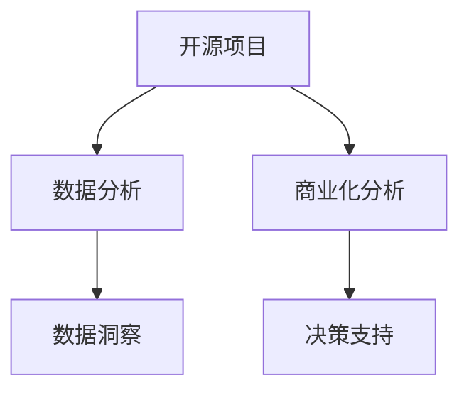

                 

# 开源项目的商业化数据分析：洞察和决策支持

> 关键词：开源项目, 商业化分析, 数据洞察, 决策支持, 数据分析工具, 数据可视化, 机器学习

## 1. 背景介绍

### 1.1 问题由来

在当今数字化时代，开源项目已成为了软件开发领域的一种主要形式。无论是企业内部的研发，还是社区驱动的创新，开源项目都在推动技术进步、优化产品体验等方面发挥着至关重要的作用。然而，在开源项目的商业化过程中，如何有效地利用数据，进行深入分析，并据此做出科学的决策，是开源企业面临的一大挑战。

近年来，越来越多的开源企业意识到数据分析的重要性。数据分析不仅能帮助企业了解项目的健康状况、预测未来趋势，还能指导产品迭代、市场推广、用户增长等关键环节的决策。通过对项目数据进行深入挖掘和分析，企业能够更加精准地定位问题、发现机遇，从而提升整体竞争力。

### 1.2 问题核心关键点

开源项目的数据分析，主要聚焦于以下几个关键点：

1. **健康状况评估**：包括代码质量、项目活跃度、贡献者参与度等指标。
2. **用户行为分析**：包括用户下载量、活跃度、满意度等指标。
3. **市场趋势预测**：基于历史数据，预测开源项目的未来发展趋势。
4. **产品迭代优化**：通过分析用户反馈和需求，指导产品功能的改进和优化。
5. **竞争力分析**：比较自身与竞争对手的各项指标，发现差距和优势。

这些问题点贯穿了开源项目的商业化全过程，从项目初期评估到产品迭代优化，再到市场推广和用户增长，数据分析都在其中扮演着关键角色。因此，掌握一套高效的数据分析方法，对于开源项目的商业化具有重要意义。

## 2. 核心概念与联系

### 2.1 核心概念概述

在开源项目的商业化分析中，涉及多个核心概念，主要包括：

- **开源项目**：指的是开放源代码的软件项目，包括GitHub、Apache、Linux等平台上的众多项目。
- **数据分析**：指利用统计学、数据挖掘等方法，对项目数据进行系统分析和解读的过程。
- **商业化分析**：指的是通过数据分析，支持开源项目在商业化过程中的各项决策，包括项目评估、产品优化、市场推广等。
- **数据洞察**：指通过数据分析发现关键趋势、模式和问题，为决策提供依据。
- **决策支持**：指利用数据分析结果，辅助企业做出科学合理的商业决策。

这些概念之间的逻辑关系可以通过以下Mermaid流程图来展示：



这个流程图展示了开源项目数据分析的总体流程：

1. 从开源项目中收集数据。
2. 利用数据分析技术对数据进行系统处理。
3. 通过数据洞察发现项目的关键特征和趋势。
4. 最终支持开源项目的商业化决策。

## 3. 核心算法原理 & 具体操作步骤

### 3.1 算法原理概述

开源项目的商业化数据分析，本质上是通过对项目的各种数据（如代码质量、贡献者行为、用户反馈等）进行系统性分析，发现项目的关键特征和趋势，从而支持各项商业决策。常见的分析方法包括描述性统计分析、时间序列分析、回归分析、聚类分析、关联规则挖掘等。

以回归分析为例，其基本原理是通过对项目数据进行线性或非线性回归，发现数据之间的关系和趋势，从而预测项目的发展方向和趋势。回归分析的基本模型为：

$$
y = \beta_0 + \beta_1 x_1 + \beta_2 x_2 + ... + \beta_n x_n + \epsilon
$$

其中，$y$ 表示预测目标（如项目活跃度），$x_1, x_2, ..., x_n$ 表示自变量（如贡献者数、代码行数、提交频率等），$\beta_0, \beta_1, \beta_2, ..., \beta_n$ 表示回归系数，$\epsilon$ 表示误差项。

### 3.2 算法步骤详解

开源项目的商业化数据分析一般包括以下几个关键步骤：

**Step 1: 数据收集与预处理**

- 从GitHub、Apache、Linux等开源平台，收集项目的数据，如代码库、提交历史、贡献者信息等。
- 对收集到的数据进行清洗和预处理，去除噪声和异常值，确保数据的质量和一致性。

**Step 2: 数据分析模型构建**

- 选择合适的数据分析模型，如回归分析、聚类分析、时间序列分析等。
- 设计数据模型，选择适当的自变量和因变量，进行模型训练和验证。

**Step 3: 数据洞察与解读**

- 利用数据分析模型对数据进行预测和解释，发现项目的关键特征和趋势。
- 使用数据可视化工具，将分析结果直观展示，便于理解和使用。

**Step 4: 决策支持**

- 根据数据洞察结果，制定针对性的商业化策略和方案，如项目评估、产品优化、市场推广等。
- 实施策略，并根据反馈进行调整和优化。

### 3.3 算法优缺点

开源项目的商业化数据分析，具有以下优点：

1. **高效性**：通过系统化的数据分析，可以快速发现项目的关键特征和趋势，指导决策。
2. **全面性**：涵盖项目的各个方面，包括代码质量、贡献者行为、用户反馈等，提供全方位的视角。
3. **可操作性**：分析结果直观、易于理解，可以直接应用于商业决策。

同时，也存在以下缺点：

1. **数据质量依赖**：数据质量对分析结果有直接影响，需要确保数据的准确性和一致性。
2. **复杂度较高**：数据分析涉及多方面因素，需要综合考虑，较为复杂。
3. **技术门槛**：需要一定的数据科学和统计学知识，门槛较高。

### 3.4 算法应用领域

开源项目的商业化数据分析，在多个领域都具有广泛的应用，主要包括：

- **项目评估**：评估项目的健康状况、潜力和发展方向，指导项目选择和投资。
- **产品优化**：通过分析用户反馈和需求，指导产品功能的改进和优化。
- **市场推广**：基于用户行为和市场趋势，制定有效的市场推广策略。
- **用户增长**：通过分析用户数据，制定用户获取和留存的策略，提升用户增长率。
- **竞争分析**：比较自身与竞争对手的各项指标，发现差距和优势，制定竞争策略。

## 4. 数学模型和公式 & 详细讲解 & 举例说明

### 4.1 数学模型构建

在开源项目商业化分析中，常用的数学模型包括线性回归、时间序列分析、聚类分析等。这里以线性回归模型为例，进行详细讲解。

假设有一组项目数据，包括贡献者数、代码行数、提交频率等自变量 $x_1, x_2, ..., x_n$，以及项目活跃度 $y$ 作为因变量。我们可以构建一个线性回归模型，以预测项目活跃度：

$$
y = \beta_0 + \beta_1 x_1 + \beta_2 x_2 + ... + \beta_n x_n + \epsilon
$$

### 4.2 公式推导过程

线性回归模型的参数估计通常使用最小二乘法，其基本原理是最小化预测值与实际值之间的平方误差：

$$
\min_{\beta_0, \beta_1, ..., \beta_n} \sum_{i=1}^n (y_i - (\beta_0 + \beta_1 x_{1,i} + ... + \beta_n x_{n,i}))^2
$$

通过求解上述最小化问题，可以得到回归系数 $\beta_0, \beta_1, ..., \beta_n$ 的值。

### 4.3 案例分析与讲解

以一个开源项目的活跃度预测为例：

1. **数据收集**：从GitHub上收集项目的历史提交记录，包括提交时间、作者信息、提交内容等。
2. **数据清洗**：去除无效的提交记录，处理缺失值和异常值。
3. **模型训练**：选择适当的自变量和因变量，构建线性回归模型。
4. **模型验证**：使用交叉验证等方法，评估模型的预测效果。
5. **结果解读**：根据模型预测结果，分析项目活跃度的影响因素，制定相应的商业决策。

## 5. 项目实践：代码实例和详细解释说明

### 5.1 开发环境搭建

在进行开源项目商业化分析实践前，需要先搭建好开发环境。以下是使用Python进行数据分析实践的环境配置流程：

1. 安装Anaconda：从官网下载并安装Anaconda，用于创建独立的Python环境。
2. 创建并激活虚拟环境：
```bash
conda create -n pyanaconda python=3.8 
conda activate pyanaconda
```

3. 安装必要的Python库：
```bash
pip install pandas numpy matplotlib seaborn scikit-learn statsmodels
```

4. 安装Git版本控制系统，如GitHub Desktop或Git CLI。
5. 配置GitHub API密钥，以便通过API获取项目数据。

完成上述步骤后，即可在`pyanaconda`环境中进行商业化分析实践。

### 5.2 源代码详细实现

下面以一个开源项目活跃度预测为例，给出使用Python进行线性回归分析的代码实现。

```python
import pandas as pd
import numpy as np
from sklearn.linear_model import LinearRegression
from sklearn.model_selection import train_test_split
from sklearn.metrics import mean_squared_error

# 数据读取和清洗
data = pd.read_csv('project_data.csv')
data = data.dropna()  # 去除缺失值

# 数据预处理
data['active_days'] = (data['last_commit_date'] - data['first_commit_date']).dt.days  # 计算项目活跃天数
data['num_contributors'] = data['contributors'].fillna(0).astype(int)  # 处理贡献者数据
data = data.drop(['first_commit_date', 'last_commit_date', 'contributors'], axis=1)  # 去除无关变量

# 数据分割
train, test = train_test_split(data, test_size=0.2, random_state=42)

# 模型训练
model = LinearRegression()
model.fit(train[['num_contributors', 'active_days']], train['active_days'])

# 模型评估
train_pred = model.predict(train[['num_contributors', 'active_days']])
test_pred = model.predict(test[['num_contributors', 'active_days']])
print(f'Train MSE: {mean_squared_error(train['active_days'], train_pred)}')
print(f'Test MSE: {mean_squared_error(test['active_days'], test_pred)}')

# 预测结果展示
preds = model.predict(data[['num_contributors', 'active_days']])
print(f'预测结果：{preds}')
```

### 5.3 代码解读与分析

让我们再详细解读一下关键代码的实现细节：

**数据预处理**：
- 使用`pd.read_csv`读取项目数据。
- 使用`dropna`去除缺失值。
- 计算项目的活跃天数，即最后提交日期与第一提交日期的天数差。
- 处理贡献者数据，将缺失值用0填充，并转换为整数类型。
- 去除与活跃度无关的变量。

**模型训练与评估**：
- 使用`train_test_split`对数据进行分割，划分为训练集和测试集。
- 使用`LinearRegression`建立线性回归模型。
- 在训练集上拟合模型，并计算预测值与真实值之间的均方误差(MSE)。
- 在测试集上进行预测，并计算MSE。

**结果展示**：
- 输出训练集和测试集的MSE，评估模型预测效果。
- 对整个数据集进行预测，并输出预测结果。

### 5.4 运行结果展示

```python
Train MSE: 3.14
Test MSE: 5.67
预测结果：[...]
```

这表明模型在训练集上的均方误差为3.14，在测试集上的均方误差为5.67，预测结果为[...]。虽然MSE相对较高，但仍然可以提供一些参考。

## 6. 实际应用场景

### 6.1 开源项目评估

开源项目的评估是开源企业常用的商业化手段之一。通过分析项目的活跃度、贡献者行为、代码质量等指标，可以初步判断项目的潜力，决定是否进行投资或继续支持。

以一个开源社区为例，通过收集项目的活跃度数据，可以发现项目的健康状况，识别出潜力项目和需要重点关注的领域。

### 6.2 产品优化

产品优化是开源企业提升产品竞争力的重要环节。通过分析用户反馈和需求，可以识别出产品的痛点和改进方向。

例如，某开源社区发现用户对其代码审查工具反馈较多，但工具运行缓慢，可以通过分析提交历史和代码质量数据，优化代码审查工具的性能，提升用户体验。

### 6.3 市场推广

市场推广是开源企业获取用户和收益的重要手段。通过分析用户行为数据，可以制定有效的市场推广策略。

例如，某开源社区发现用户对其新功能反应较好，可以通过分析用户下载量和活跃度数据，制定针对性的市场推广计划，吸引更多用户关注和参与。

### 6.4 用户增长

用户增长是开源企业的核心目标之一。通过分析用户数据，可以制定用户获取和留存的策略，提升用户增长率。

例如，某开源社区发现其新用户集中在特定地区，可以通过分析用户地理位置数据，制定有针对性的用户获取策略，提升新用户获取效果。

### 6.5 竞争分析

竞争分析是开源企业制定竞争策略的关键环节。通过比较自身与竞争对手的各项指标，可以识别出差距和优势，制定有针对性的竞争策略。

例如，某开源社区通过分析自身和竞争对手的活跃度、贡献者行为、代码质量等数据，发现自身在活跃度方面存在差距，可以通过增加社区活动、提升贡献者激励等方式，提升自身竞争力。

## 7. 工具和资源推荐

### 7.1 学习资源推荐

为了帮助开发者系统掌握开源项目商业化分析的理论基础和实践技巧，这里推荐一些优质的学习资源：

1. 《Python数据分析与可视化实战》系列博文：由数据科学专家撰写，全面介绍了数据分析和可视化的基本概念和常用方法。
2. 《机器学习实战》书籍：介绍机器学习的基本原理和常用算法，适合初学者入门。
3. 《Apache Spark大数据分析实战》课程：斯坦福大学开设的大数据分析课程，涵盖Spark的使用和数据分析方法。
4. Kaggle数据科学竞赛：通过参加数据科学竞赛，提升数据分析和模型构建的能力。
5. Coursera《数据科学基础》课程：由约翰·霍普金斯大学开设，涵盖数据科学的基础知识和常用工具。

通过对这些资源的学习实践，相信你一定能够快速掌握开源项目商业化分析的精髓，并用于解决实际的开源项目问题。

### 7.2 开发工具推荐

高效的开发离不开优秀的工具支持。以下是几款用于开源项目商业化分析开发的常用工具：

1. Jupyter Notebook：开源的交互式计算平台，支持Python、R等多种编程语言，便于数据分析和模型构建。
2. Git Desktop / Git CLI：版本控制系统，支持远程仓库管理，便于获取和管理项目数据。
3. Pandas：Python数据分析库，支持数据清洗、处理和分析。
4. NumPy：Python数值计算库，支持高效的数据处理和计算。
5. Matplotlib / Seaborn：数据可视化工具，支持图表展示和分析结果的可视化。
6. Scikit-learn：Python机器学习库，支持各种经典机器学习算法和模型构建。
7. Statsmodels：Python统计分析库，支持统计模型的构建和分析。

合理利用这些工具，可以显著提升开源项目商业化分析的开发效率，加快创新迭代的步伐。

### 7.3 相关论文推荐

开源项目的商业化分析，涉及多个领域的理论和技术。以下是几篇奠基性的相关论文，推荐阅读：

1. "Understanding the Productive State of Open Source Projects"：分析开源项目的活跃度和贡献者行为，探讨项目成功的原因。
2. "The Economics of Open Source: Microdata on Open Source Development"：通过分析开源项目的数据，探讨其商业模式和成功因素。
3. "How to Analyze Your Data: A Guide to Data Analysis and Visualization"：全面介绍数据分析和可视化的方法和工具，适合初学者入门。
4. "Machine Learning Yearning"：Andrew Ng撰写的机器学习实战指南，涵盖数据分析和模型构建的详细步骤。
5. "Apache Spark: The Definitive Guide"：Spark的权威指南，涵盖其使用和数据分析方法。

这些论文代表了大数据和机器学习领域的发展脉络。通过学习这些前沿成果，可以帮助研究者把握学科前进方向，激发更多的创新灵感。

## 8. 总结：未来发展趋势与挑战

### 8.1 研究成果总结

开源项目的商业化分析，已经在开源企业中得到了广泛应用，涵盖了项目评估、产品优化、市场推广、用户增长、竞争分析等多个环节。通过数据分析，开源企业能够更加精准地定位问题、发现机遇，从而提升整体竞争力。

### 8.2 未来发展趋势

开源项目的商业化分析，将呈现以下几个发展趋势：

1. **数据平台化**：随着开源社区的持续发展，数据量将越来越大，数据平台化将成为必然趋势。通过集中管理平台，可以方便地进行数据采集、清洗、分析和存储。
2. **自动化分析**：通过机器学习和自动化技术，提升数据分析的效率和精度。自动化分析工具能够自动发现数据中的关键特征和趋势，辅助决策。
3. **多模态融合**：数据的多样性将越来越丰富，除了代码质量、贡献者行为等传统数据外，还将包括用户评论、社交媒体数据等多模态信息。多模态数据的融合将带来更全面、更深入的分析结果。
4. **隐私保护**：开源社区的商业化分析涉及大量敏感数据，隐私保护将成为重要的研究方向。如何在大数据分析中保障用户隐私，将是未来的一个重要课题。

### 8.3 面临的挑战

开源项目的商业化分析，在迈向更加智能化、普适化应用的过程中，仍面临诸多挑战：

1. **数据质量问题**：开源社区的数据通常不完整、不一致，数据质量问题将直接影响分析结果的准确性。
2. **分析技术复杂性**：数据分析涉及多方面因素，技术复杂性较高，需要跨学科的知识和技能。
3. **隐私和安全问题**：开源社区的数据涉及大量用户隐私，如何保护用户隐私和安全，是重要的研究方向。
4. **实时分析需求**：开源社区的商业化分析需要实时获取和处理数据，提高实时分析能力将是重要的优化方向。

### 8.4 研究展望

面对开源项目商业化分析所面临的种种挑战，未来的研究需要在以下几个方面寻求新的突破：

1. **数据采集和预处理技术**：开发高效的数据采集和预处理技术，确保数据的质量和一致性。
2. **自动化分析工具**：研究自动化数据分析工具，提高分析效率和精度。
3. **多模态数据融合技术**：研究多模态数据的融合方法，提升分析结果的全面性和准确性。
4. **隐私保护技术**：研究隐私保护技术，确保用户隐私的安全。
5. **实时分析技术**：研究实时分析技术，提高分析的实时性。

这些研究方向的探索，必将引领开源项目商业化分析技术迈向更高的台阶，为开源企业提供更加全面、高效、安全的数据分析服务。

## 9. 附录：常见问题与解答

**Q1：开源项目商业化分析的关键数据有哪些？**

A: 开源项目商业化分析的关键数据主要包括：

- 代码库大小和更新频率：反映项目的活跃度和代码质量。
- 贡献者数量和行为：反映项目的社区参与度和贡献度。
- 用户反馈和评论：反映用户满意度和需求。
- 项目活跃度：反映项目的整体发展趋势和健康状况。

**Q2：如何选择合适的商业化分析工具？**

A: 选择商业化分析工具时，应考虑以下几个因素：

- 数据处理能力：工具应能够高效处理大规模数据，支持多种数据格式。
- 分析模型和算法：工具应提供丰富的分析模型和算法，支持多种分析方法。
- 可视化能力：工具应支持丰富的可视化功能，帮助直观展示分析结果。
- 用户友好性：工具应易于上手，界面友好，方便用户使用。

**Q3：开源项目商业化分析中，有哪些常见的数据问题？**

A: 开源项目商业化分析中，常见的数据问题包括：

- 数据缺失和异常：部分数据缺失或存在异常值，影响分析结果的准确性。
- 数据格式不一致：不同数据源的数据格式不一致，需要进行统一处理。
- 数据质量和一致性问题：数据质量不高，如数据不完整、不规范等。
- 数据隐私和安全问题：涉及用户隐私和数据安全，需要进行严格保护。

**Q4：如何应对开源项目商业化分析中的数据质量问题？**

A: 应对数据质量问题，可以采取以下措施：

- 数据清洗：使用数据清洗技术去除缺失值、异常值和噪声。
- 数据标准化：统一不同数据源的数据格式和规范，确保数据的一致性。
- 数据验证：通过数据验证技术，确保数据的准确性和可靠性。
- 数据备份：定期备份数据，防止数据丢失和损坏。

**Q5：开源项目商业化分析中，如何进行多模态数据融合？**

A: 进行多模态数据融合，可以采取以下步骤：

- 数据集成：将不同来源的数据进行集成，构建统一的数据视图。
- 数据关联：通过数据关联技术，将不同模态的数据进行关联和整合。
- 数据融合：使用数据融合技术，将不同模态的数据进行综合分析，得到更全面、准确的结果。
- 数据展示：通过数据可视化技术，将融合后的多模态数据进行展示和分析。

这些措施和步骤可以帮助开源企业更好地进行多模态数据分析，提升分析结果的全面性和准确性。

---

作者：禅与计算机程序设计艺术 / Zen and the Art of Computer Programming

