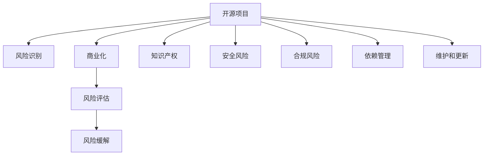

                 

# 开源项目的商业化风险管理：风险识别和Mitigation

> 关键词：开源项目，商业化，风险管理，风险识别，风险缓解

## 1. 背景介绍

### 1.1 问题由来
在当今开源软件盛行的时代，越来越多的企业依赖开源项目来实现产品功能。开源项目以其灵活性、创新性和成本效益，成为企业技术创新和产品开发的重要工具。然而，开源项目同样伴随着复杂的商业化挑战，包括但不限于：

1. **知识产权风险**：开源项目中的代码可能包含复杂的开源协议，这些协议对代码使用、修改、分发等行为有严格的限制，可能与企业的商业需求冲突。
2. **安全风险**：开源代码可能存在漏洞和后门，成为攻击者的目标，威胁企业的系统和数据安全。
3. **合规风险**：开源项目的商业化使用需要遵守多方面的法律和标准，如数据隐私、反垄断、国际贸易等，企业需要确保合规性。
4. **依赖管理**：开源项目通常依赖于其他开源组件，版本管理不当可能导致依赖链断裂或冲突。
5. **维护和更新**：开源项目的维护成本和更新频率，可能超出企业内部资源的负担。

这些风险因素要求企业不仅关注开源代码的使用，还需全面管理开源项目的商业化过程，确保项目的安全、合规和高效运行。

## 2. 核心概念与联系

### 2.1 核心概念概述

为更好地理解开源项目的商业化风险管理，本节将介绍几个关键概念：

- **开源项目（Open Source Project, OSP）**：由社区贡献、遵循自由开源许可证的代码库，可用于商业和开发活动。
- **商业化（Commercialization）**：将开源项目或其衍生品转换为具有商业价值的产品和服务的过程。
- **风险管理（Risk Management）**：识别、评估和缓解商业化过程中的潜在风险，以保障项目成功和运营安全。
- **风险识别（Risk Identification）**：识别和分类商业化过程中的各类风险。
- **风险缓解（Risk Mitigation）**：采取措施降低或消除识别到的风险。

这些概念之间存在紧密联系，通过识别风险、评估风险、缓解风险，确保开源项目的商业化过程顺利进行。

### 2.2 核心概念原理和架构的 Mermaid 流程图



该图展示了开源项目商业化过程中，风险识别、评估和缓解的主要步骤和相关概念的联系。

## 3. 核心算法原理 & 具体操作步骤

### 3.1 算法原理概述

开源项目商业化过程中的风险管理，本质上是一个风险识别、评估和缓解的过程。其核心思想是：通过系统化的风险识别和评估，找到项目中的潜在风险点，并采取相应的缓解措施，以降低风险发生概率和影响范围。

### 3.2 算法步骤详解

开源项目商业化风险管理的核心步骤包括：

1. **风险识别**：识别项目中的所有潜在风险，包括但不限于知识产权、安全、合规、依赖管理和维护更新等。
2. **风险评估**：对已识别的风险进行定量或定性的评估，确定风险的概率和影响程度。
3. **风险缓解**：针对评估结果，采取适当的措施降低或消除风险。
4. **风险监控**：持续监控风险状态，定期更新评估和缓解策略。

### 3.3 算法优缺点

开源项目商业化风险管理的优势在于：

- **全面性**：通过系统化的风险识别和评估，覆盖项目各环节的潜在风险。
- **动态性**：风险管理是一个持续的过程，需要定期监控和调整策略。
- **可控性**：通过采取措施缓解风险，企业可以主动控制项目的安全和合规。

然而，风险管理也存在一些局限：

- **复杂性**：风险识别和评估需要专业知识，过程较为复杂。
- **成本高**：风险管理需要投入大量时间和资源，尤其在大型项目中。
- **依赖外部**：开源项目的依赖管理和维护，依赖外部社区的支持和反馈。

### 3.4 算法应用领域

开源项目商业化风险管理的应用领域广泛，包括但不限于：

- **企业级应用**：大型企业在使用开源项目构建核心业务系统时，需全面评估和管理相关风险。
- **开源生态建设**：开源项目的发起者和维护者需要评估和管理项目及其社区的安全性和合规性。
- **软件开发平台**：如DevOps平台、容器编排工具等，需要确保开源依赖的安全和合规。
- **云服务提供商**：云服务使用开源项目作为基础设施，需评估和管理相关的风险。

## 4. 数学模型和公式 & 详细讲解 & 举例说明

### 4.1 数学模型构建

风险管理通常使用定量和定性相结合的模型。以风险概率和影响程度为基础，构建如下数学模型：

$$
Risk = Probability \times Impact
$$

其中，$Risk$ 表示风险水平，$Probability$ 表示风险发生的概率，$Impact$ 表示风险发生后的影响程度。

### 4.2 公式推导过程

设风险集合为 $R$，包含 $n$ 个风险 $r_i$，每个风险的概率和影响程度分别为 $p_i$ 和 $c_i$，则风险管理模型的构建过程如下：

1. 确定所有潜在风险 $r_i$ 和其相关参数 $p_i, c_i$。
2. 计算每个风险 $r_i$ 的加权风险值 $w_i = p_i \times c_i$。
3. 计算总风险水平 $Risk = \sum_{i=1}^n w_i$。
4. 根据总风险水平，采取相应的缓解措施。

### 4.3 案例分析与讲解

以一个开源项目的企业级应用为例，分析风险管理的过程：

- **风险识别**：识别开源项目依赖的第三方组件，可能存在的安全漏洞和依赖冲突。
- **风险评估**：通过分析组件的历史安全报告、社区活跃度等，评估依赖组件的风险水平。
- **风险缓解**：采取升级依赖组件版本、替换高风险依赖、加入黑名单等方式，缓解风险。
- **风险监控**：持续监控依赖组件的安全状态，及时响应新发现的风险。

## 5. 项目实践：代码实例和详细解释说明

### 5.1 开发环境搭建

在进行开源项目商业化风险管理实践前，我们需要准备好开发环境。以下是使用Python进行开发的常用环境配置：

1. 安装Python：根据项目需求，选择合适的Python版本，确保安装所需的依赖库。
2. 配置环境变量：将Python和依赖库的路径添加到系统环境变量中，确保项目运行。
3. 安装依赖库：使用pip安装项目所需的所有依赖库。

### 5.2 源代码详细实现

以下是一个简单的开源项目风险管理系统的代码实现，用于演示核心功能的开发：

```python
# 风险识别模块
class RiskIdentification:
    def __init__(self, dependencies):
        self.dependencies = dependencies
    
    def identify(self):
        # 识别所有依赖组件的风险
        risk_list = []
        for dependency in self.dependencies:
            risk_list.append((dependency, self.check_vulnerability(dependency)))
        return risk_list
    
    def check_vulnerability(self, dependency):
        # 检查依赖组件的安全性
        # 使用第三方工具或API获取依赖组件的安全状态
        # 返回风险水平值
        pass

# 风险评估模块
class RiskAssessment:
    def __init__(self, risk_list):
        self.risk_list = risk_list
    
    def assess(self):
        # 评估所有风险的加权风险值
        total_risk = 0
        for risk in self.risk_list:
            total_risk += risk[1] * self.calculate_impact(risk[0])
        return total_risk
    
    def calculate_impact(self, dependency):
        # 计算依赖组件的影响程度
        # 使用社区活跃度、历史漏洞等信息计算
        pass

# 风险缓解模块
class RiskMitigation:
    def __init__(self, risk_list):
        self.risk_list = risk_list
    
    def mitigate(self):
        # 针对每个风险采取缓解措施
        for risk in self.risk_list:
            if risk[1] > threshold:
                self.apply_mitigation(risk[0])
    
    def apply_mitigation(self, dependency):
        # 具体缓解措施的实现
        # 如升级版本、替换依赖、加入黑名单等
        pass

# 风险监控模块
class RiskMonitoring:
    def __init__(self, risk_list):
        self.risk_list = risk_list
    
    def monitor(self):
        # 持续监控依赖组件的安全状态
        # 定期触发风险评估
        pass
```

### 5.3 代码解读与分析

代码中定义了四个核心模块：

1. **RiskIdentification模块**：用于识别开源项目的所有依赖组件及其安全状态。
2. **RiskAssessment模块**：根据依赖组件的风险状态，计算项目的总风险水平。
3. **RiskMitigation模块**：针对高风险依赖采取具体的缓解措施。
4. **RiskMonitoring模块**：持续监控依赖组件的安全状态，定期触发风险评估和缓解。

每个模块都定义了相应的核心方法，用于实现风险管理的各个环节。

### 5.4 运行结果展示

运行上述代码，可以实现一个基本的功能：

1. 识别所有依赖组件及其安全状态。
2. 计算项目总风险水平。
3. 针对高风险依赖采取缓解措施。
4. 持续监控依赖组件的安全状态。

运行结果将以报告形式展示，包含依赖组件的风险评估、缓解措施和监控状态。

## 6. 实际应用场景

### 6.1 企业级应用

开源项目在企业级应用中广泛使用，涉及各种核心业务系统。例如，使用OpenStack构建云平台、使用Hadoop构建大数据处理系统等。在这些场景下，风险管理尤为重要：

- **基础设施依赖**：如使用开源数据库构建核心业务系统，需评估数据库的安全性和合规性。
- **数据处理依赖**：如使用开源机器学习库进行数据分析，需评估算法的准确性和可靠性。
- **业务流程依赖**：如使用开源开发框架构建Web应用，需评估框架的安全性和性能。

企业级应用通常具有复杂性和高风险性，需系统化地进行风险管理。

### 6.2 开源生态建设

开源项目的发起者和维护者也需关注其商业化过程中的风险管理：

- **社区贡献管理**：需评估社区贡献者的代码质量和贡献方式，确保项目健康发展。
- **代码审查流程**：需建立严格的代码审查流程，确保代码质量和安全性。
- **项目维护成本**：需合理分配项目维护成本，确保项目的长期稳定运行。

开源生态建设不仅关注技术创新，还需关注社区和项目的长期发展，风险管理在其中起到关键作用。

### 6.3 云服务提供商

云服务提供商使用开源项目作为基础设施，需确保其安全性和合规性：

- **服务质量保障**：需评估基础设施的安全性和可靠性，确保服务质量。
- **合规性管理**：需确保使用开源项目的过程符合相关法规和标准，如数据隐私、反垄断等。
- **风险监控机制**：需建立完善的风险监控机制，及时响应潜在风险。

云服务提供商的风险管理，直接影响其市场竞争力和用户信任度。

## 7. 工具和资源推荐

### 7.1 学习资源推荐

为了帮助开发者系统掌握开源项目商业化风险管理的理论基础和实践技巧，这里推荐一些优质的学习资源：

1. **《开源项目管理与实践》**：介绍了开源项目管理的基本流程和风险管理策略，适合初学者入门。
2. **《软件风险管理》**：深入讲解了软件开发生命周期中的风险管理方法，包括开源项目风险管理。
3. **《开源安全与合规》**：讲解了开源项目中的安全问题及其合规性要求，是开源项目管理的必备读物。
4. **Open Source Security Toolkit (OSST)**：由Open Source Foundation推出的开源安全工具包，提供了一系列检测和管理开源项目安全的工具和指南。
5. **Sonatype Security Labs**：提供开源项目安全分析工具和解决方案，帮助企业评估和缓解开源项目中的安全风险。

通过这些资源的学习实践，相信你一定能够快速掌握开源项目商业化风险管理的精髓，并用于解决实际的开源项目问题。

### 7.2 开发工具推荐

高效的开发离不开优秀的工具支持。以下是几款用于开源项目风险管理的常用工具：

1. **SonarQube**：开源代码质量检测工具，支持多种编程语言，提供代码审查、代码重构、漏洞检测等功能。
2. **OWASP Dependency Check**：开源依赖安全检测工具，扫描开源项目的依赖库，检查潜在的安全漏洞。
3. **GitLab Security Dashboard**：GitLab的安全仪表板，提供开源项目的安全审计、漏洞扫描等功能。
4. **CVE Tracker**：跟踪和修复开源项目中的安全漏洞，帮助企业快速响应安全事件。
5. **Black Duck**：开源依赖管理和安全检测工具，帮助企业管理开源依赖的安全风险。

合理利用这些工具，可以显著提升开源项目商业化风险管理的效率和效果。

### 7.3 相关论文推荐

开源项目商业化风险管理的研究源于学界的持续研究。以下是几篇奠基性的相关论文，推荐阅读：

1. **《开源风险管理：理论、实践与挑战》**：系统介绍了开源风险管理的理论基础和实践方法，探讨了开源项目商业化的风险因素和缓解策略。
2. **《开源项目安全检测与评估》**：介绍了开源项目安全检测的方法和工具，提供了一套全面的开源项目安全管理方案。
3. **《开源项目合规性管理》**：讲解了开源项目合规性管理的基本流程和工具，帮助企业确保项目的合规性。
4. **《开源项目依赖管理》**：介绍了开源项目依赖管理的最佳实践，提供了一套系统化的依赖管理策略。
5. **《开源项目维护与优化》**：讲解了开源项目维护和优化的策略和方法，帮助企业提高项目效率和质量。

这些论文代表了大规模开源项目商业化风险管理的研究进展，通过学习这些前沿成果，可以帮助研究者把握学科前进方向，激发更多的创新灵感。

## 8. 总结：未来发展趋势与挑战

### 8.1 总结

本文对开源项目商业化风险管理方法进行了全面系统的介绍。首先阐述了开源项目商业化的背景和意义，明确了风险管理在保障项目成功和运营安全中的重要地位。其次，从原理到实践，详细讲解了风险识别、评估和缓解的数学模型和关键步骤，给出了风险管理的完整代码实例。同时，本文还广泛探讨了风险管理在企业级应用、开源生态建设和云服务提供商等场景下的具体应用，展示了风险管理的广泛价值。此外，本文精选了风险管理的各类学习资源，力求为读者提供全方位的技术指引。

通过本文的系统梳理，可以看到，开源项目商业化风险管理已经成为开源项目开发和维护中的重要环节，对于保障项目的稳定性和安全性具有重要意义。未来，伴随开源项目的商业化进程，开源风险管理将面临更多新的挑战和机遇。

### 8.2 未来发展趋势

展望未来，开源项目商业化风险管理将呈现以下几个发展趋势：

1. **自动化和智能化**：通过引入人工智能和自动化工具，实现风险管理的智能化和自动化，减少人工干预，提高效率。
2. **全生命周期管理**：将风险管理融入开源项目开发的全生命周期，从项目启动到交付的全过程进行风险评估和缓解。
3. **社区和生态协作**：加强开源社区和生态系统中的风险管理协作，共享信息和资源，共同应对开源项目的风险挑战。
4. **动态和持续监控**：引入动态风险监控机制，实时评估开源项目的安全和合规状态，及时响应潜在风险。
5. **多层次管理**：将风险管理扩展到项目、组织和行业等多个层次，实现全方位的风险管理。

这些趋势凸显了开源项目商业化风险管理的广阔前景，为开源项目的持续发展和创新提供了有力保障。

### 8.3 面临的挑战

尽管开源项目商业化风险管理已经取得了不少进展，但在迈向更加智能化、普适化应用的过程中，仍面临诸多挑战：

1. **技术复杂性**：开源项目商业化风险管理涉及多方面的技术和工具，如代码审计、依赖管理、安全检测等，技术复杂度较高。
2. **成本高昂**：风险管理需要投入大量时间和资源，尤其在大规模开源项目中，成本问题较为突出。
3. **依赖社区**：开源项目的依赖管理和维护，高度依赖外部社区的支持和反馈，难以完全自主控制。
4. **安全漏洞多**：开源项目中的安全漏洞和后门较多，增加了风险管理难度。
5. **合规标准多**：不同国家和地区的法律法规不同，增加了开源项目合规管理的复杂性。

解决这些挑战，需要开源社区、企业和技术供应商共同努力，建立更加完善的风险管理框架和工具体系。

### 8.4 研究展望

面对开源项目商业化风险管理所面临的挑战，未来的研究需要在以下几个方面寻求新的突破：

1. **引入人工智能**：利用人工智能技术，自动化和智能化开源项目风险管理，减少人工干预，提高效率。
2. **建立多层次管理框架**：构建系统化的风险管理框架，覆盖项目、组织和行业等多个层次，实现全面的风险管理。
3. **开发智能监控工具**：开发动态风险监控工具，实时评估开源项目的安全和合规状态，及时响应潜在风险。
4. **加强社区协作**：加强开源社区和生态系统中的协作，共享信息和资源，共同应对开源项目的风险挑战。
5. **引入更多工具和技术**：引入更多先进的技术和工具，如代码审计、依赖管理、安全检测等，提高风险管理的准确性和效率。

这些研究方向的探索，必将引领开源项目商业化风险管理技术迈向更高的台阶，为开源项目的商业化进程提供有力保障。

## 9. 附录：常见问题与解答

**Q1：开源项目商业化过程中，如何选择合适的开源许可证？**

A: 选择合适的开源许可证是开源项目商业化过程中必须面对的重要问题。一般选择与企业业务需求和市场环境相匹配的许可证，如：

1. **GPL v3或AGPL**：强制要求公开源代码，适合学术研究或开源社区贡献。
2. **LGPL**：允许二进制分发，适合商业产品的开发。
3. **Apache**：宽松的许可证，允许自由商业化使用。
4. **MIT**：最宽松的许可证，适合企业内部项目和开源贡献。

选择合适的许可证，需充分考虑项目的商业目标、市场需求和合规要求。

**Q2：开源项目商业化过程中，如何管理开源依赖？**

A: 开源项目依赖管理是开源项目商业化过程中必须面对的重要问题。一般通过以下方法进行管理：

1. **版本控制**：使用版本控制系统（如Git）管理项目依赖，确保依赖库的稳定性和可靠性。
2. **依赖分析工具**：使用依赖分析工具（如OWASP Dependency Check）扫描项目依赖，检查潜在的安全漏洞和依赖冲突。
3. **依赖策略**：制定严格的依赖管理策略，避免使用高风险依赖和存在安全漏洞的依赖。
4. **持续集成**：使用持续集成工具（如Jenkins、GitLab CI）自动化依赖管理和版本发布，确保项目依赖的稳定性。

通过有效的依赖管理，可以显著降低开源项目商业化过程中依赖库的风险。

**Q3：开源项目商业化过程中，如何确保项目的合规性？**

A: 开源项目商业化过程中，确保项目的合规性是至关重要的。一般通过以下方法进行管理：

1. **法律法规了解**：全面了解相关法律法规，如数据隐私、反垄断等，确保项目的合规性。
2. **合规审查**：建立合规审查流程，定期审核项目的合规性，确保遵守法律法规。
3. **合规工具**：使用合规工具（如SonarQube）进行合规性检查，发现潜在的风险点。
4. **法律咨询**：定期与法律顾问沟通，确保项目合规性，避免法律风险。

通过有效的合规管理，可以确保开源项目在商业化过程中合法合规，避免潜在的法律风险。

**Q4：开源项目商业化过程中，如何管理安全风险？**

A: 开源项目商业化过程中，管理安全风险是至关重要的。一般通过以下方法进行管理：

1. **安全扫描**：使用安全扫描工具（如OWASP Dependency Check、SonarQube）定期扫描项目依赖和安全漏洞。
2. **安全策略**：制定严格的安全策略，避免使用高风险依赖和存在安全漏洞的依赖。
3. **安全培训**：定期对团队进行安全培训，提高安全意识和技能。
4. **安全监控**：使用安全监控工具（如CVE Tracker）实时监控项目的安全状态，及时响应安全事件。

通过有效的安全管理，可以显著降低开源项目商业化过程中安全风险的发生概率。

**Q5：开源项目商业化过程中，如何建立有效的风险管理流程？**

A: 开源项目商业化过程中，建立有效的风险管理流程是保障项目成功的关键。一般通过以下步骤建立风险管理流程：

1. **风险识别**：识别项目中的所有潜在风险，包括但不限于知识产权、安全、合规、依赖管理和维护更新等。
2. **风险评估**：对已识别的风险进行定量或定性的评估，确定风险的概率和影响程度。
3. **风险缓解**：针对评估结果，采取适当的措施降低或消除风险。
4. **风险监控**：持续监控风险状态，定期更新评估和缓解策略。

通过系统化的风险管理流程，可以确保开源项目商业化过程的风险得到有效控制，保障项目的成功。

总之，开源项目商业化风险管理是开源项目开发和维护中的重要环节，需要通过系统化的风险识别、评估和缓解，确保项目的稳定性和安全性。未来，伴随开源项目的商业化进程，开源风险管理将面临更多新的挑战和机遇，需要通过持续创新和改进，提高风险管理的效率和效果。

---

作者：禅与计算机程序设计艺术 / Zen and the Art of Computer Programming

