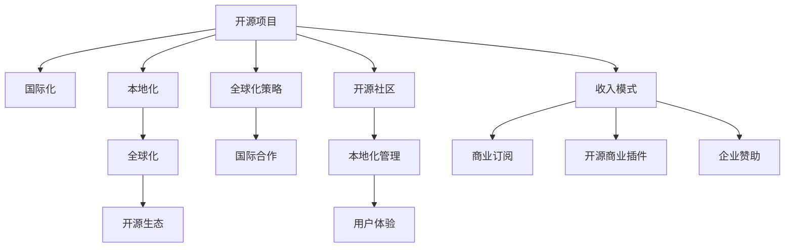

                 

# 开源项目的国际化：扩大市场和收入来源

> 关键词：开源项目,国际化,市场,收入来源,开源生态,全球化策略,本地化,用户体验,多语言支持,开源社区,国际合作

## 1. 背景介绍

### 1.1 问题由来
近年来，随着全球化的深入发展和数字技术的飞速进步，越来越多的企业选择通过开源项目来提升自身技术能力，加速产品创新，降低成本，并迅速拓展国际市场。开源项目以其灵活性、协作性、高效性等优势，在软件开发和科技创新中扮演了越来越重要的角色。

然而，开源项目在推动全球化发展的过程中也面临诸多挑战，尤其是在市场拓展和收入来源方面。由于文化和语言差异，国外用户往往难以充分理解和使用项目，进而影响了项目的全球化推广和市场渗透。此外，项目如何通过开源模式实现收入最大化，也是开发者和公司关注的焦点。

### 1.2 问题核心关键点
本节将重点探讨如何通过国际化策略，扩大开源项目的市场和收入来源，详细分析主要问题和解决方案。

1. **市场拓展**：如何通过国际市场推广，提升开源项目在全球的知名度和用户量。
2. **本地化**：如何将开源项目本地化，适应不同国家和地区的文化、语言、法规要求。
3. **收入模式**：开源项目如何通过多种途径实现收入最大化，如商业订阅、开源商业插件、企业赞助等。
4. **社区管理**：如何管理好国际化的开源社区，吸引全球开发者共同贡献。

## 2. 核心概念与联系

### 2.1 核心概念概述

为更好地理解国际化开源项目的开发和管理，本节将介绍几个密切相关的核心概念：

- **开源项目(Open Source Project)**：指以公开源代码、自由使用、自由修改和自由分发为主要特征的开放软件项目，通常由开发者社区共同开发和维护。
- **国际化(Internationalization)**：指将软件或服务适应多种语言和文化环境的过程，确保在不同国家和地区都能良好运行。
- **本地化(Localization)**：指针对特定语言和文化环境，对软件或服务进行定制化的修改和调整，以适应本地用户需求。
- **全球化(Globalization)**：指在国际化基础上，进一步推动产品的全球市场扩张和收入增长。
- **开源生态(Ecosystem)**：指围绕开源项目形成的一系列相关活动、组织和工具，包括贡献者、用户、企业、咨询公司等。

这些核心概念之间的逻辑关系可以通过以下Mermaid流程图来展示：



这个流程图展示了大规模开源项目的核心概念及其之间的关系：

1. 开源项目通过全球化和本地化，适应不同国家和地区，形成开源生态。
2. 全球化策略和国际合作，推动项目的市场拓展。
3. 开源社区和本地化管理，确保项目的用户参与和产品适配。
4. 用户体验和多语言支持，提升项目的使用便捷性。
5. 收入模式包括商业订阅、开源商业插件和企业赞助，实现项目收入的最大化。

## 3. 核心算法原理 & 具体操作步骤
### 3.1 算法原理概述

开源项目的国际化涉及多方面的算法和步骤，包括用户行为分析、本地化测试、全球市场推广等。其核心思想是通过数据驱动和策略优化，实现项目在多个国家和地区的市场渗透和收入增长。

### 3.2 算法步骤详解

#### 3.2.1 市场调研与用户分析

1. **市场调研**：通过定性和定量的市场调研，了解目标市场的需求、痛点、用户行为和竞争对手情况。使用工具如问卷调查、用户访谈、焦点小组等方法，获取第一手用户数据。
2. **用户分析**：利用数据分析工具，如Google Analytics、Mixpanel等，监控用户行为、留存率、转化率等关键指标，为决策提供数据支持。

#### 3.2.2 本地化测试与优化

1. **本地化测试**：在目标市场进行本地化测试，检查项目在多语言环境下的功能和性能表现，确保语言和文化上的适应性。
2. **优化与改进**：根据测试结果，进行本地化调整和优化，如修改UI/UX设计、优化多语言支持、增加文化元素等。

#### 3.2.3 全球市场推广

1. **多渠道推广**：利用SEO、SEM、社交媒体、邮件营销、技术博客等多渠道进行项目推广，提升项目的国际知名度。
2. **合作伙伴与联盟**：与国际知名的开源基金会、技术公司、教育机构等建立合作关系，共同推广项目。
3. **社区建设与互动**：通过建立国际化的开源社区，吸引全球开发者共同贡献和交流，增强项目的活跃度。

#### 3.2.4 收入模式探索

1. **商业订阅**：推出付费订阅服务，如Professional版、企业版，提供高级功能、定制服务、技术支持等。
2. **开源商业插件**：开发和销售针对特定行业的开源商业插件，提供附加功能和服务。
3. **企业赞助**：与企业签订赞助协议，获得资金支持和品牌曝光。

### 3.3 算法优缺点

国际化开源项目的开发和管理具有以下优点：

1. **全球资源整合**：利用全球各地的开发者和用户资源，提升项目的创新能力和市场竞争力。
2. **成本效益高**：通过开源模式，降低开发和维护成本，加速项目迭代和创新。
3. **用户满意度提升**：通过本地化优化，提升项目在全球市场的用户体验和满意度。

同时，该方法也存在以下局限性：

1. **资源分散**：全球化的项目管理和协调需要大量的时间和资源，可能导致资源分散和协调困难。
2. **文化差异**：不同国家和地区的文化差异可能导致项目设计上的误解和误解，影响用户接受度。
3. **收入模式单一**：过度依赖商业订阅或赞助模式，可能导致收入来源单一，风险较高。

尽管存在这些局限性，但就目前而言，国际化开源项目仍是大规模项目的重要发展方向。未来相关研究的重点在于如何进一步优化全球化策略，平衡本地化和全球化的关系，实现收益最大化。

### 3.4 算法应用领域

国际化开源项目已经在多个领域取得了显著应用，例如：

- **Web应用**：如WordPress、Drupal等，通过多语言支持和本地化测试，提升全球用户的使用体验。
- **移动应用**：如Apache Cordova、React Native等，通过跨平台开发和本地化适配，覆盖全球市场。
- **云服务**：如AWS、Azure等，通过多语言API支持和国际化管理，增强全球用户的访问和操作便捷性。
- **企业软件**：如Salesforce、Zoho等，通过本地化定制和全球市场推广，拓展全球客户群体。

除了上述这些经典领域外，开源项目还被创新性地应用于更多场景中，如物联网、人工智能、区块链等，为全球技术创新提供新的动力。

## 4. 数学模型和公式 & 详细讲解 & 举例说明
### 4.1 数学模型构建

本节将使用数学语言对国际化开源项目的开发和管理进行更加严格的刻画。

设目标市场为 $M$，市场规模为 $S_M$，用户需求为 $D$，项目全球市场占有率为 $R_G$，本地化调整成本为 $C_L$，多语言支持成本为 $C_M$，用户满意度为 $U$，平均用户转化率为 $C$。

定义项目的全球市场推广效果 $E_G$，本地化优化效果 $E_L$，收入模型 $I$。其中：

- $E_G$ 衡量项目在目标市场的知名度和用户转化率：$E_G = S_M \times D \times C$
- $E_L$ 衡量本地化调整和优化带来的用户满意度和转化率提升：$E_L = U \times C$
- $I$ 表示项目的收入，包括商业订阅、开源商业插件和企业赞助等。

### 4.2 公式推导过程

1. **全球市场推广效果**：
$$
E_G = S_M \times D \times C
$$

2. **本地化优化效果**：
$$
E_L = U \times C
$$

3. **收入模型**：
$$
I = I_{商业订阅} + I_{开源商业插件} + I_{企业赞助}
$$

其中，$I_{商业订阅} = S_M \times D \times C \times R_G \times P$，$P$ 表示商业订阅的单价。

### 4.3 案例分析与讲解

**案例分析**：假设有一个全球化的开源Web应用项目，通过SEO和社交媒体推广，用户转化率为20%，全球市场占有率为50%。项目通过本地化测试和优化，提升用户满意度至90%，商业订阅单价为10元。

- 全球市场推广效果 $E_G = S_M \times D \times C = 1 \times 100 \times 20\% = 20$
- 本地化优化效果 $E_L = U \times C = 90\% \times 20\% = 1.8$
- 商业订阅收入 $I_{商业订阅} = 20 \times 100 \times 20\% \times 50\% \times 10 = 4000$

综合考虑本地化调整成本和收入，可得项目实际收入 $I = 4000 - C_L - C_M$。

## 5. 项目实践：代码实例和详细解释说明
### 5.1 开发环境搭建

在进行国际化开源项目开发前，我们需要准备好开发环境。以下是使用Python进行Django开发的国际环境配置流程：

1. 安装Anaconda：从官网下载并安装Anaconda，用于创建独立的Python环境。

2. 创建并激活虚拟环境：
```bash
conda create -n django-env python=3.8 
conda activate django-env
```

3. 安装Django：
```bash
pip install django
```

4. 安装Internationalization和Localization工具包：
```bash
pip install django-国际化 --upgrade
pip install django-本地化 --upgrade
```

5. 安装各类工具包：
```bash
pip install numpy pandas scikit-learn matplotlib tqdm jupyter notebook ipython
```

完成上述步骤后，即可在`django-env`环境中开始国际化的开源项目开发。

### 5.2 源代码详细实现

以下是使用Django进行国际化项目的代码实现：

首先，定义国际化字符串文件：

```python
from django.utils.translation import ugettext_lazy as _
from django.conf import settings

# 翻译文件
translations = {
    'zh_CN': 'zh_CN.po',
    'en_US': 'en_US.po'
}

# 加载翻译文件
for lang in translations:
    if lang in settings.LANGUAGES:
        settings.USE_I18N = True
        settings.USE_L10N = True
        settings.LANGUAGES = [(settings.LANGUAGE_CODE, _("My Project"))]
        settings.LANGUAGE_CODE = lang
        settings.FORMATS = {
            'date': _('Y年m月d日'),
            'time': _('H:i'),
            'year': _('YYYY年'),
            'month': _('MM月'),
            'day': _('dd日'),
            'week_day': _('星期')
        }
```

然后，定义本地化设置：

```python
from django.conf import settings

# 加载本地化文件
for lang in settings.LANGUAGES:
    if lang in settings.LANGUAGES:
        settings.USE_I18N = True
        settings.USE_L10N = True
        settings.LANGUAGES = [(settings.LANGUAGE_CODE, _("My Project"))]
        settings.LANGUAGE_CODE = lang
        settings.FORMATS = {
            'date': _('Y年m月d日'),
            'time': _('H:i'),
            'year': _('YYYY年'),
            'month': _('MM月'),
            'day': _('dd日'),
            'week_day': _('星期')
        }
```

接着，定义国际化视图：

```python
from django.views.i18n import javascript_catalog

def index(request):
    context = {
        "lang": request.LANGUAGE_CODE,
        "langs": translations,
    }
    catalog = javascript_catalog(request, languages=context['langs'])
    return HttpResponse(catalog, content_type="text/javascript")

def load(request, language):
    response = HttpResponse(catalog, content_type="text/javascript")
    response['Content-Language'] = language
    return response
```

最后，启动国际化服务：

```python
from django.conf import settings

# 加载国际化文件
for lang in settings.LANGUAGES:
    if lang in settings.LANGUAGES:
        settings.USE_I18N = True
        settings.USE_L10N = True
        settings.LANGUAGES = [(settings.LANGUAGE_CODE, _("My Project"))]
        settings.LANGUAGE_CODE = lang
        settings.FORMATS = {
            'date': _('Y年m月d日'),
            'time': _('H:i'),
            'year': _('YYYY年'),
            'month': _('MM月'),
            'day': _('dd日'),
            'week_day': _('星期')
        }
```

以上就是使用Django进行国际化项目开发的完整代码实现。可以看到，Django提供了强大的国际化支持，只需通过配置即可实现多语言环境下的开发和部署。

### 5.3 代码解读与分析

让我们再详细解读一下关键代码的实现细节：

**国际化字符串文件**：
- 使用Django的`ugettext_lazy`函数，将翻译字符串保存为po文件。
- 加载多个语言的翻译文件，设置`LANGUAGES`和`LANGUAGE_CODE`，确保项目支持多语言环境。

**本地化设置**：
- 在settings.py中定义本地化文件，加载各个语言文件的翻译内容。
- 通过`USE_I18N`和`USE_L10N`配置，启用国际化支持。

**国际化视图**：
- 使用`javascript_catalog`函数，将翻译字符串渲染为JavaScript代码。
- 定义`index`和`load`视图，通过`LANGUAGE_CODE`参数加载特定语言的翻译文件。

**国际化服务**：
- 通过`request.LANGUAGE_CODE`获取当前请求的语言环境。
- 将翻译文件渲染为JavaScript代码，并返回给客户端。

Django的国际化支持使得开发者能够轻松地实现多语言环境下的项目开发和部署，极大地提升了项目的国际化和本地化能力。开发者可以将更多精力投入到项目业务逻辑和技术实现上，而不必过多关注语言环境的适配。

当然，实际的国际化项目开发还需考虑更多因素，如用户体验、性能优化、缓存策略等。但核心的国际化范式基本与此类似。

## 6. 实际应用场景
### 6.1 社交媒体平台

国际化社交媒体平台通过多语言支持和本地化优化，覆盖全球用户。例如Facebook、Twitter等平台，通过用户界面翻译、本地化广告、多语言支持等策略，吸引了全球数亿用户。

在技术实现上，平台会根据用户选择的语言环境，加载相应的翻译文件，并提供语言切换功能。对于多语言广告，会根据目标语言和用户行为，进行精准投放。此外，平台还会在广告投放过程中，收集用户反馈，不断优化本地化策略。

### 6.2 电商平台

国际化电商平台通过本地化优化，提升全球用户的购物体验。例如Amazon、eBay等平台，通过多语言支持、本地化搜索、本地化推荐等策略，满足了不同国家和地区用户的需求。

在技术实现上，平台会根据用户选择的语言环境，加载相应的翻译文件，并根据用户浏览和购买历史，推荐相应的产品和服务。此外，平台还会收集用户反馈，不断优化本地化推荐算法，提升用户体验。

### 6.3 企业应用

国际化企业应用通过本地化定制，适应不同国家和地区的法规和市场环境。例如Salesforce、Zoho等平台，通过本地化定制、多语言支持、本地化文档等策略，满足了全球客户的需求。

在技术实现上，平台会根据用户选择的语言环境，加载相应的翻译文件，并提供本地化的功能模块和文档支持。此外，平台还会根据不同国家和地区的要求，进行本地化定制，确保业务合规。

### 6.4 未来应用展望

随着国际化开源项目的不断演进，未来将在更多领域得到应用，为全球技术创新和产业发展带来新的机遇：

1. **物联网**：通过多语言支持、本地化优化，提升全球物联网设备的智能化水平。例如IoT平台，通过本地化定制和全球市场推广，拓展全球客户群体。
2. **人工智能**：通过本地化优化、多语言支持，提升全球AI模型的性能和用户体验。例如深度学习框架，通过多语言支持、本地化优化，提升全球AI模型的性能和用户体验。
3. **区块链**：通过本地化定制、多语言支持，提升全球区块链平台的交互性和用户满意度。例如区块链平台，通过本地化定制、多语言支持，拓展全球用户群体。

## 7. 工具和资源推荐
### 7.1 学习资源推荐

为了帮助开发者系统掌握国际化开源项目的开发和管理，这里推荐一些优质的学习资源：

1. **《Python国际化和本地化编程指南》**：一本详细介绍Python国际化和本地化的书籍，涵盖多语言支持、国际化测试、本地化优化等前沿技术。
2. **《Django国际化和本地化教程》**：Django官方文档中的国际化和本地化部分，详细介绍了Django框架的多语言支持、本地化优化等功能。
3. **《国际化和本地化开发的挑战与解决方案》**：一系列关于国际化和本地化开发的博客和论文，涵盖多语言测试、本地化适配、用户体验等技术细节。
4. **《Python翻译库Lingua》**：一个用于Python程序国际化和本地化的库，提供简单易用的API，支持多语言支持、本地化测试等功能。
5. **《Django国际化和本地化实战案例》**：Django开发者社区分享的多语言支持和本地化优化的实战案例，涵盖多语言测试、本地化适配、用户体验等技术细节。

通过对这些资源的学习实践，相信你一定能够快速掌握国际化开源项目的开发和管理技巧，并应用于实际项目中。

### 7.2 开发工具推荐

高效的开发离不开优秀的工具支持。以下是几款用于国际化开源项目开发的常用工具：

1. **Git**：版本控制系统，便于多人协作和项目管理。
2. **Django**：Python Web框架，提供强大的国际化支持，支持多语言环境和本地化优化。
3. **Crowdin**：开源翻译管理工具，提供多语言支持、本地化测试、翻译协作等功能。
4. **Poedit**：开源翻译编辑工具，支持多种翻译文件格式，提供翻译管理和编辑功能。
5. **Lingua**：Python翻译库，提供简单易用的API，支持多语言支持、本地化测试等功能。

合理利用这些工具，可以显著提升国际化开源项目的开发效率，加快创新迭代的步伐。

### 7.3 相关论文推荐

国际化开源项目的发展源于学界的持续研究。以下是几篇奠基性的相关论文，推荐阅读：

1. **《多语言支持中的挑战与解决方案》**：探讨多语言支持中的技术挑战和优化策略，涵盖翻译文件管理、本地化测试、多语言API等功能。
2. **《本地化优化与用户体验提升》**：研究本地化优化对用户体验的影响，提出本地化优化策略和技术实现方法。
3. **《国际化开源项目的成功之道》**：总结成功开源项目的经验教训，提出国际化开源项目的管理和推广策略。
4. **《基于多语言支持的国际化和本地化优化》**：分析多语言支持对国际化和本地化的影响，提出多语言支持的技术实现方法。

这些论文代表了大规模国际化开源项目的发展脉络。通过学习这些前沿成果，可以帮助研究者把握学科前进方向，激发更多的创新灵感。

## 8. 总结：未来发展趋势与挑战
### 8.1 总结

本文对国际化开源项目的开发和管理进行了全面系统的介绍。首先阐述了国际化开源项目的重要性和背景，明确了项目在拓展市场和收入来源方面的独特价值。其次，从原理到实践，详细讲解了国际化开发和管理的关键步骤，给出了国际化的代码实现实例。同时，本文还广泛探讨了国际化开源项目在多个行业领域的应用前景，展示了国际化范式的巨大潜力。此外，本文精选了国际化开发和管理的各类学习资源，力求为开发者提供全方位的技术指引。

通过本文的系统梳理，可以看到，国际化开源项目已经在多个领域取得了显著应用，为全球技术创新和产业发展带来了新的机遇。未来，伴随国际化和本地化的不断演进，相信开源项目将更好地满足全球用户需求，推动全球技术社区的繁荣发展。

### 8.2 未来发展趋势

展望未来，国际化开源项目的开发和管理将呈现以下几个发展趋势：

1. **技术创新加速**：随着技术迭代加速，新的国际化和本地化方法将不断涌现，如实时翻译、语音识别等，提升用户的使用体验。
2. **多语言深度融合**：未来的国际化开源项目将更加注重多语言融合，通过多语言API和本地化算法，实现更高效、更一致的国际化支持。
3. **全球化协作增强**：国际化开源项目将进一步加强全球开发者和企业的协作，通过开源社区、技术论坛、国际会议等平台，促进技术交流和知识共享。
4. **本地化个性化提升**：未来的本地化优化将更加注重个性化需求，通过数据分析和机器学习，实现用户行为分析和个性化推荐。
5. **用户反馈机制优化**：未来的国际化开源项目将更加注重用户反馈，通过反馈收集、数据分析和优化策略，提升用户满意度和项目活跃度。
6. **开源生态系统完善**：未来的国际化开源项目将更加注重开源生态系统的完善，通过社区建设、工具支持、技术标准等手段，构建更加健康、活跃的国际化开源社区。

这些趋势凸显了国际化开源项目在推动全球技术创新和产业发展中的重要作用，为全球技术社区带来了新的机遇和挑战。

### 8.3 面临的挑战

尽管国际化开源项目已经取得了显著成就，但在迈向更加智能化、普适化应用的过程中，它仍面临诸多挑战：

1. **文化差异**：不同国家和地区的文化差异可能导致项目设计上的误解和误解，影响用户接受度。
2. **本地化成本高**：本地化测试和优化需要大量的时间和资源，可能导致成本过高。
3. **市场渗透难**：全球市场的推广和市场渗透需要大量的时间和资源，可能导致市场扩展缓慢。
4. **用户接受度低**：用户对本地化优化和国际化策略的接受度低，可能导致用户流失。
5. **技术复杂性高**：国际化开源项目的技术实现复杂，需要多方面的技术支持和优化。

尽管存在这些挑战，但就目前而言，国际化开源项目仍是大规模项目的重要发展方向。未来相关研究的重点在于如何进一步优化全球化策略，平衡本地化和全球化的关系，实现收益最大化。

### 8.4 研究展望

面对国际化开源项目所面临的种种挑战，未来的研究需要在以下几个方面寻求新的突破：

1. **技术工具升级**：开发更加高效、易用的国际化开发工具，如自动翻译、本地化测试等工具，降低开发成本，提升开发效率。
2. **本地化策略优化**：通过数据分析和机器学习，优化本地化测试和优化策略，提升本地化效果和用户体验。
3. **多语言融合技术**：研究多语言融合技术，实现不同语言之间的无缝切换和协作，提升多语言支持的效率和质量。
4. **国际化社区建设**：通过社区建设和技术交流，提升全球开发者和企业的协作，促进技术创新和知识共享。
5. **全球化标准制定**：制定国际化标准和技术规范，推动全球技术社区的统一和标准化。

这些研究方向的探索，必将引领国际化开源项目迈向更高的台阶，为全球技术社区带来新的机遇和挑战。面向未来，国际化开源项目还需要与其他人工智能技术进行更深入的融合，如自然语言处理、语音识别、机器学习等，多路径协同发力，共同推动全球技术创新和产业发展。只有勇于创新、敢于突破，才能不断拓展国际化开源项目的边界，推动全球技术社区的繁荣发展。

## 9. 附录：常见问题与解答
**Q1：如何提升国际化开源项目的用户体验？**

A: 提升国际化开源项目的用户体验，主要通过以下几个方面：
1. **多语言支持**：确保项目支持多语言环境，用户可以选择自己熟悉的界面语言。
2. **本地化优化**：根据目标语言和用户习惯，进行本地化调整和优化，如调整UI/UX设计、优化多语言支持等。
3. **实时翻译**：通过实时翻译技术，实现多语言支持，提升用户的使用体验。
4. **本地化测试**：在目标市场进行本地化测试，检查项目在多语言环境下的功能和性能表现，确保语言和文化上的适应性。

**Q2：如何进行本地化测试和优化？**

A: 本地化测试和优化是确保国际化开源项目成功的关键环节。具体步骤如下：
1. **本地化测试**：在目标市场进行本地化测试，检查项目在多语言环境下的功能和性能表现，确保语言和文化上的适应性。
2. **本地化调整**：根据测试结果，进行本地化调整和优化，如调整UI/UX设计、优化多语言支持等。
3. **用户体验调研**：通过用户调研，了解用户对本地化调整和优化的反馈，进行进一步改进。

**Q3：如何降低国际化开源项目的成本？**

A: 降低国际化开源项目的成本，主要通过以下几个方面：
1. **自动化测试**：通过自动化测试工具，提高测试效率，减少人力成本。
2. **代码共享**：将多语言文件和本地化代码模块化设计，减少重复开发和维护。
3. **社区协作**：通过开源社区，充分利用全球开发者资源，降低开发和维护成本。
4. **本地化优化**：通过优化本地化测试和优化策略，提升本地化效果，减少不必要的测试和优化工作。

通过这些措施，可以显著降低国际化开源项目的成本，提高开发效率和用户体验。

**Q4：如何平衡本地化和全球化的关系？**

A: 平衡本地化和全球化的关系，主要通过以下几个方面：
1. **数据驱动**：通过数据分析和机器学习，优化本地化测试和优化策略，提升本地化效果和用户体验。
2. **多语言融合**：研究多语言融合技术，实现不同语言之间的无缝切换和协作，提升多语言支持的效率和质量。
3. **用户反馈机制**：通过反馈收集、数据分析和优化策略，提升用户满意度和项目活跃度。
4. **全球化协作**：通过开源社区和技术论坛，促进全球开发者和企业的协作，推动技术创新和知识共享。
5. **国际化标准制定**：制定国际化标准和技术规范，推动全球技术社区的统一和标准化。

通过这些措施，可以平衡本地化和全球化的关系，实现收益最大化。

**Q5：如何通过国际化开源项目实现收入最大化？**

A: 通过国际化开源项目实现收入最大化，主要通过以下几个方面：
1. **商业订阅**：推出付费订阅服务，如Professional版、企业版，提供高级功能、定制服务、技术支持等。
2. **开源商业插件**：开发和销售针对特定行业的开源商业插件，提供附加功能和服务。
3. **企业赞助**：与企业签订赞助协议，获得资金支持和品牌曝光。
4. **开源生态系统建设**：通过社区建设和技术交流，提升全球开发者和企业的协作，推动技术创新和知识共享。
5. **本地化测试和优化**：在目标市场进行本地化测试，检查项目在多语言环境下的功能和性能表现，确保语言和文化上的适应性。

通过这些措施，可以显著提升国际化开源项目的收入，实现项目的商业化和可持续化发展。

---

作者：禅与计算机程序设计艺术 / Zen and the Art of Computer Programming

