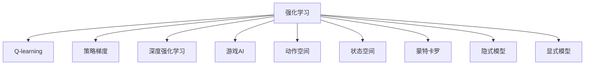

                 

## 1. 背景介绍

### 1.1 问题由来

近年来，随着人工智能技术的迅猛发展，强化学习在游戏AI领域展现了强大的威力。例如AlphaGo的成功，标志着AI在策略性游戏上已经能够超越人类顶级选手。强化学习不仅能够解决策略性游戏问题，还能在更广泛的体育赛事、智能控制和自动化等多个领域中取得突破。

游戏AI的应用，涉及游戏策略分析、玩家行为建模、动作优化等多个方面。其关键在于如何在有限的时间步内，通过学习环境的动态变化，优化决策过程，最终实现超越人类玩家的目标。

### 1.2 问题核心关键点

强化学习在游戏AI中的关键在于以下几个核心点：

- **游戏规则理解**：玩家需要理解和分析游戏的规则、目标和复杂度，以便制定有效的策略。
- **状态表示与环境建模**：如何高效地将游戏状态转换为机器可处理的格式，是强化学习游戏AI的另一个核心问题。
- **探索与利用权衡**：在未知的策略空间中探索最优策略，同时利用已知的知识优化当前策略，是强化学习的精髓。
- **自适应性**：AI需要随着游戏的动态变化而自适应地调整策略，以应对不断变化的局面。
- **泛化能力**：AI需要在不同游戏版本和环境下保持一致的高水平表现。

### 1.3 问题研究意义

研究强化学习在游戏AI中的应用，具有重要的理论意义和实际价值：

- 推动AI技术的发展：强化学习是AI领域的一个重要分支，通过在游戏中的成功应用，可以推动AI技术的整体进步。
- 提升AI的决策能力：游戏AI的挑战性高，需要AI具备复杂多变的决策能力，游戏AI的成功应用可以带动AI决策能力的提升。
- 促进AI在工业领域的应用：游戏AI的成功经验可以转化为其他领域的AI应用，推动智能制造、智慧医疗等行业的发展。
- 推动AI伦理和社会问题研究：游戏AI的成功应用，也涉及AI的伦理和公平性问题，有助于引导公众对AI的认知。

## 2. 核心概念与联系

### 2.1 核心概念概述

为了更好地理解强化学习在游戏AI中的应用，本节将介绍几个密切相关的核心概念：

- **强化学习(Reinforcement Learning, RL)**：一种通过与环境交互，通过奖励信号引导学习者调整策略的机器学习方法。核心思想是最大化累积奖励。
- **Q-learning**：一种经典的强化学习算法，通过动作-奖励的序列学习最优策略。
- **策略梯度方法(如PG、PPO)**：通过直接优化策略分布，提升决策质量，避免陷入局部最优。
- **深度强化学习**：将深度神经网络与强化学习结合，提升模型决策能力和泛化能力。
- **游戏AI**：指应用AI技术于游戏领域，提升游戏的智能化水平，增强游戏体验和竞技性。
- **动作空间与状态空间**：分别指游戏中的可行动作集和游戏状态集，对强化学习来说至关重要。
- **蒙特卡罗方法**：一种基于随机抽样的强化学习算法，可以处理高维度状态空间。
- **隐式模型与显式模型**：分别指通过环境交互或基于先验知识建模，两种不同的环境建模方式。

这些核心概念之间的逻辑关系可以通过以下Mermaid流程图来展示：



这个流程图展示了几者之间的关系：

1. 强化学习是核心思想。
2. Q-learning是基础算法。
3. 策略梯度方法和深度强化学习是进阶算法。
4. 游戏AI是应用场景。
5. 动作空间与状态空间是基本概念。
6. 蒙特卡罗方法、隐式模型和显式模型是不同的方法路径。

## 3. 核心算法原理 & 具体操作步骤

### 3.1 算法原理概述

强化学习在游戏AI中的应用，通常分为两个阶段：

1. **预训练阶段**：通过自我对弈或与专家对弈，学习初始策略。
2. **微调阶段**：通过与对手的对抗，不断调整策略，提升决策水平。

核心思想是通过与环境的互动，收集反馈信息，调整游戏策略，以最大化累计奖励。

### 3.2 算法步骤详解

1. **环境建模**：
   - 定义游戏规则：如棋盘游戏、即时战略游戏、实时战术游戏等。
   - 确定状态空间：状态空间可以是连续的，也可以是离散的。
   - 确定动作空间：动作空间可以是离散的，如移动、攻击等，也可以是连续的，如移动的方向和距离。

2. **策略设计**：
   - 设计基于深度学习的策略网络：常用的有深度Q网络(DQN)、策略梯度网络(如PGN)等。
   - 设计动作选择策略：可以是ε-greedy策略，也可以是softmax策略。

3. **训练过程**：
   - 初始化策略网络：如使用随机初始化或预训练的策略网络。
   - 与环境交互：通过模拟或实际环境，让策略网络不断与环境互动，收集反馈信息。
   - 优化策略：通过奖励信号反馈，调整策略网络参数，提升决策质量。
   - 持续更新：通过不断的模拟和实际对弈，不断更新策略网络，逐步提升决策水平。

4. **评估与部署**：
   - 评估模型：通过与人类玩家或高级AI模型对抗，评估策略网络的性能。
   - 部署模型：将训练好的策略网络部署到游戏环境中，进行实际应用。

### 3.3 算法优缺点

强化学习在游戏AI中的优缺点如下：

**优点**：
- 鲁棒性：强化学习策略在复杂多变的环境下具有良好的适应性。
- 自我学习：AI可以自主学习和改进策略，无需人工干预。
- 可扩展性：强化学习可以应用于各种类型的游戏，包括回合制和即时制游戏。

**缺点**：
- 学习速度慢：在复杂的策略空间中，强化学习往往需要大量的训练样本。
- 动作空间过大：在高维度的动作空间中，强化学习算法容易出现局部最优。
- 状态空间复杂：在连续的状态空间中，强化学习算法可能会陷入“过拟合”问题。
- 稳定性问题：策略网络可能会在训练过程中出现不稳定的情况，影响最终效果。

### 3.4 算法应用领域

强化学习在游戏AI中的应用，已经覆盖了诸多领域：

- **棋盘游戏**：如象棋、围棋、五子棋等。AlphaGo的胜利展示了强化学习在策略性游戏中的强大能力。
- **即时战略游戏**：如星际争霸、星际争霸II等。AI通过深度强化学习，逐步接近甚至超越人类玩家。
- **体育赛事**：如足球、篮球、扑克等。AI通过对比赛过程的分析，优化战术决策，提升竞技水平。
- **电子竞技**：如Dota2、英雄联盟等。AI通过实时策略决策，提升游戏性能和竞争力。
- **机器人控制**：如无人车、无人机等。通过强化学习，AI可以自主学习控制策略，提升环境适应能力。

## 4. 数学模型和公式 & 详细讲解 & 举例说明

### 4.1 数学模型构建

为了更好地理解强化学习在游戏AI中的应用，我们将使用数学语言对强化学习过程进行严格的描述。

假设游戏环境为马尔可夫决策过程(MDP)，其中：
- **状态空间**：$S$；
- **动作空间**：$A$；
- **状态转移概率**：$P(s'|s,a)$；
- **奖励函数**：$R(s,a)$；
- **折扣因子**：$\gamma$；
- **当前状态**：$s_t$；
- **动作**：$a_t$；
- **状态值函数**：$V(s)$；
- **状态-动作值函数**：$Q(s,a)$；
- **策略函数**：$\pi(a|s)$。

定义**值迭代方程**：
$$
V_{t+1}(s_t) = \mathbb{E}[R_{t+1} + \gamma V_{t+1}(s_{t+1}) | s_t, a_t]
$$
即：
$$
V_{t+1}(s_t) = \sum_{a \in A} \pi(a|s_t) Q(s_t,a) + \gamma \sum_{s' \in S} P(s'|s_t,a_t) V_{t+1}(s')
$$

**策略迭代方程**：
$$
\pi_{t+1}(a|s_t) \propto \exp(Q(s_t,a_t))
$$
即：
$$
\pi_{t+1}(a|s_t) = \frac{\exp(Q(s_t,a_t))}{\sum_{a \in A} \exp(Q(s_t,a_t))}
$$

### 4.2 公式推导过程

**值迭代方程的推导**：
从状态值函数$V_{t+1}(s_t)$的定义出发，可以推导出：
$$
V_{t+1}(s_t) = \mathbb{E}[R_{t+1} + \gamma V_{t+1}(s_{t+1}) | s_t, a_t]
$$
即：
$$
V_{t+1}(s_t) = \sum_{a \in A} \pi(a|s_t) Q(s_t,a) + \gamma \sum_{s' \in S} P(s'|s_t,a_t) V_{t+1}(s')
$$

**策略迭代方程的推导**：
通过最大化$Q$值函数的期望值，可以得到策略迭代方程：
$$
\pi_{t+1}(a|s_t) \propto \exp(Q(s_t,a_t))
$$
即：
$$
\pi_{t+1}(a|s_t) = \frac{\exp(Q(s_t,a_t))}{\sum_{a \in A} \exp(Q(s_t,a_t))}
$$

**贝尔曼方程的推导**：
贝尔曼方程是强化学习中的核心方程，可以推导出：
$$
V_{t+1}(s_t) = R(s_t, a_t) + \gamma V_{t+1}(s_{t+1})
$$
即：
$$
V_{t+1}(s_t) = Q(s_t,a_t) + \gamma \sum_{s' \in S} P(s'|s_t,a_t) V_{t+1}(s')
$$

### 4.3 案例分析与讲解

**AlphaGo**：
AlphaGo通过蒙特卡罗树搜索(MCTS)和深度神经网络(DNN)的结合，展示了强化学习在游戏AI中的强大威力。具体过程如下：

1. **初始策略网络**：AlphaGo通过深度神经网络学习和预测游戏策略。
2. **蒙特卡罗树搜索**：AlphaGo通过蒙特卡罗树搜索，模拟游戏进程，评估当前策略的优劣。
3. **策略更新**：AlphaGo根据蒙特卡罗树搜索的结果，更新深度神经网络的参数，提升策略水平。
4. **对抗学习**：AlphaGo通过与人类玩家和自身策略网络进行对抗，不断提升策略质量。

AlphaGo的成功，标志着强化学习在游戏AI领域实现了突破。

## 5. 项目实践：代码实例和详细解释说明

### 5.1 开发环境搭建

在进行强化学习游戏AI的开发前，我们需要准备好开发环境。以下是使用Python进行TensorFlow开发的环境配置流程：

1. 安装Anaconda：从官网下载并安装Anaconda，用于创建独立的Python环境。

2. 创建并激活虚拟环境：
```bash
conda create -n tensorflow-env python=3.8 
conda activate tensorflow-env
```

3. 安装TensorFlow：根据CUDA版本，从官网获取对应的安装命令。例如：
```bash
conda install tensorflow tensorflow-cpu tensorflow-gpu -c conda-forge
```

4. 安装各类工具包：
```bash
pip install numpy pandas scikit-learn matplotlib tqdm jupyter notebook ipython
```

完成上述步骤后，即可在`tensorflow-env`环境中开始游戏AI的开发。

### 5.2 源代码详细实现

下面以棋盘游戏五子棋为例，给出使用TensorFlow进行强化学习的PyTorch代码实现。

首先，定义游戏规则和状态表示方法：

```python
import tensorflow as tf
import numpy as np

# 定义棋盘状态
class Board:
    def __init__(self):
        self.board = np.zeros((15, 15), dtype=np.int32)

    def __getitem__(self, idx):
        return self.board[idx]

    def __setitem__(self, idx, val):
        self.board[idx] = val

    def clone(self):
        return Board(self.board.copy())

    def is_valid_move(self, x, y):
        return 0 <= x < 15 and 0 <= y < 15 and self.board[x, y] == 0

    def is_winner(self, player):
        # 判断是否为玩家胜利
        for i in range(15):
            if self.board[i, 0] == player:
                return True
            if self.board[0, i] == player:
                return True
            if self.board[4, i] == player:
                return True
            if self.board[i, 4] == player:
                return True

        # 判断是否为玩家有5个连续棋子
        for i in range(15):
            for j in range(15):
                if self.board[i, j] == player:
                    if (self.board[i, j-1] == player and self.board[i, j+1] == player) and \
                       (self.board[i-1, j] == player and self.board[i+1, j] == player) and \
                       (self.board[i-4, j] == player and self.board[i+4, j] == player) and \
                       (self.board[i, j-4] == player and self.board[i, j+4] == player):
                        return True
        return False

    def is_draw(self):
        # 判断是否为平局
        return all(self.board != 0)

# 定义游戏状态空间
class State:
    def __init__(self, board):
        self.board = board
        self.player = 1

    def __str__(self):
        return str(self.board)

    def is_terminal(self):
        return self.is_winner(1) or self.is_winner(2) or self.is_draw()

    def successors(self):
        valid_moves = []
        for x in range(15):
            for y in range(15):
                if self.is_valid_move(x, y):
                    valid_moves.append((x, y))
        return valid_moves

    def reward(self):
        if self.is_winner(1):
            return 1
        elif self.is_winner(2):
            return -1
        elif self.is_draw():
            return 0
        else:
            return 0
```

然后，定义强化学习算法：

```python
from tensorflow.keras.layers import Dense
from tensorflow.keras.models import Sequential

class QNetwork:
    def __init__(self, input_dim, output_dim):
        self.model = Sequential()
        self.model.add(Dense(64, input_dim=input_dim, activation='relu'))
        self.model.add(Dense(64, activation='relu'))
        self.model.add(Dense(output_dim, activation='linear'))
        self.model.compile(optimizer='adam', loss='mse')

    def predict(self, x):
        return self.model.predict(x)

    def update(self, x, a, r, xp):
        q_values = self.predict(x)
        q_values = q_values[:, a]
        target = r + self.gamma * np.max(self.predict(xp), axis=1)
        self.model.fit(x, target, epochs=1, verbose=0)
```

最后，定义强化学习训练过程：

```python
from gym import spaces

def make_gym_env():
    # 定义游戏环境
    board = Board()
    state = State(board)
    env = gym.make('FiveInARow-v0', board)
    env.action_space = spaces.Discrete(2)
    env.observation_space = spaces.Dense(225)
    return env, state

def train(env, model, episodes, gamma=0.99, epsilon=0.1):
    env, state = make_gym_env()
    model = QNetwork(225, 2)
    for episode in range(episodes):
        x = state.board.reshape(-1)
        state.board = state.board.clone()
        state.player = 1 if state.player == 2 else 2
        while not state.is_terminal():
            if np.random.rand() < epsilon:
                # 随机动作
                a = np.random.randint(2)
            else:
                # 利用Q网络选择动作
                a = np.argmax(model.predict(x))
            state.board[x[a]] = state.player
            x = state.board.reshape(-1)
            r = state.reward()
            if state.is_terminal():
                break
            state.player = 1 if state.player == 2 else 2
        model.update(x, a, r, state.board.reshape(-1))
```

以上就是使用TensorFlow进行五子棋游戏AI的完整代码实现。可以看到，通过定义游戏规则和状态表示方法，以及构建Q网络，我们完成了强化学习算法的搭建。

### 5.3 代码解读与分析

让我们再详细解读一下关键代码的实现细节：

**Board类**：
- 定义了棋盘状态，提供了访问和修改棋盘状态的接口。
- 判断给定坐标的合法性，返回当前棋盘状态的值。
- 判断玩家是否获胜，是否为平局。

**State类**：
- 定义了游戏状态，包括当前棋盘状态和当前玩家。
- 提供字符串表示和是否为终态的判断。
- 提供合法动作的生成和奖励计算。

**QNetwork类**：
- 定义了Q网络的构建和训练过程。
- 提供Q值的预测和更新接口。
- 使用Adam优化器和均方误差损失函数进行模型训练。

**train函数**：
- 生成游戏环境，并初始化Q网络。
- 模拟游戏进程，执行强化学习训练。
- 随机动作探索与利用Q网络选择动作的策略平衡。

以上代码展示了强化学习在游戏AI中的实际应用。通过定义棋盘状态、游戏状态和Q网络，以及训练算法，我们完成了五子棋游戏AI的搭建。

## 6. 实际应用场景

### 6.1 智能游戏竞技

强化学习在游戏竞技领域有着广泛的应用，尤其是电子竞技游戏。智能游戏AI不仅可以提升游戏体验，还可以改变游戏格局。例如：

- **Dota2**：Valiant AI通过强化学习，在Dota2上取得了显著的成绩。AI通过学习游戏数据和策略，能够在比赛中做出更优的决策。
- **英雄联盟**：H2K游戏团队通过强化学习，训练出了首个能够超越人类玩家的游戏AI。AI通过实时策略优化，提升了游戏的竞技水平。

### 6.2 机器人控制

强化学习在机器人控制中也具有重要应用。例如：

- **无人车**：通过强化学习，无人车能够自主学习和优化驾驶策略，提升环境适应能力。
- **无人机**：通过强化学习，无人机能够自主学习飞行控制策略，提高任务完成效率。

### 6.3 体育赛事分析

强化学习在体育赛事中也有广泛应用，例如：

- **篮球**：通过强化学习，AI可以对球员的表现进行分析和预测，提升教练的决策水平。
- **足球**：AI通过分析比赛数据，预测球队的战术和表现，帮助球队制定最优策略。

### 6.4 未来应用展望

随着强化学习技术的发展，其在AI游戏AI中的应用前景将更加广阔。未来，AI将能够在更多类型的游戏上取得突破，实现超人类的智能水平。同时，AI在游戏AI中的应用也将推动其他领域的AI技术发展，例如自动驾驶、机器人控制等。

## 7. 工具和资源推荐

### 7.1 学习资源推荐

为了帮助开发者系统掌握强化学习在游戏AI中的应用，这里推荐一些优质的学习资源：

1. **《Reinforcement Learning: An Introduction》**：由Richard S. Sutton和Andrew G. Barto所著，是强化学习的经典教材，提供了全面深入的理论知识和实际案例。
2. **DeepMind博客**：DeepMind团队发布的强化学习相关论文和案例，展示了AlphaGo、AlphaStar等AI在游戏中的应用。
3. **Google AI博客**：Google AI团队发布的强化学习相关论文和案例，展示了OpenAI Five等AI在游戏中的应用。
4. **ArXiv预印本**：最新的强化学习论文和算法，提供了前沿的研究动态和技术进展。
5. **Github代码库**：许多开源的强化学习代码和模型，可以帮助开发者快速上手并实现游戏AI。

### 7.2 开发工具推荐

高效的开发离不开优秀的工具支持。以下是几款用于强化学习游戏AI开发的常用工具：

1. **TensorFlow**：由Google主导开发的开源深度学习框架，支持强化学习和深度学习，是游戏AI开发的首选工具。
2. **PyTorch**：由Facebook主导开发的开源深度学习框架，同样支持强化学习和深度学习，提供了灵活的模型构建和训练工具。
3. **OpenAI Gym**：由OpenAI开发的游戏环境库，支持多种游戏环境，便于游戏AI的测试和部署。
4. **TensorBoard**：TensorFlow配套的可视化工具，可以实时监测模型训练状态，提供丰富的图表展示。
5. **GymServer**：提供游戏环境的远程控制和访问，方便在多台机器上并行训练游戏AI。

合理利用这些工具，可以显著提升强化学习在游戏AI开发中的效率和效果。

### 7.3 相关论文推荐

强化学习在游戏AI中的应用源于学界的持续研究。以下是几篇奠基性的相关论文，推荐阅读：

1. **Human-level Control through Deep Reinforcement Learning**：由DeepMind团队发表，展示了AlphaGo的成功，标志着强化学习在策略性游戏中的突破。
2. **Mastering Chess with Monte Carlo Tree Search**：由DeepMind团队发表，展示了AlphaZero的胜利，展示了强化学习在棋盘游戏中的应用。
3. **Playing Atari with Deep Reinforcement Learning**：由DeepMind团队发表，展示了AlphaStar的成功，展示了强化学习在即时战略游戏中的应用。
4. **Human vs. AI: Who’s Winning in Video Games?**：由OpenAI团队发表，展示了AlphaGo Zero和AlphaStar的胜利，展示了强化学习在电子竞技游戏中的应用。
5. **Super Mario Bros using Deep Reinforcement Learning**：由Google团队发表，展示了AI通过强化学习学习玩超级马里奥兄弟，展示了强化学习在游戏AI中的广泛应用。

这些论文代表了大语言模型微调技术的发展脉络。通过学习这些前沿成果，可以帮助研究者把握学科前进方向，激发更多的创新灵感。

## 8. 总结：未来发展趋势与挑战

### 8.1 总结

本文对强化学习在游戏AI中的应用进行了全面系统的介绍。首先阐述了强化学习在游戏AI中的应用背景和意义，明确了强化学习在AI游戏AI中的重要地位。其次，从原理到实践，详细讲解了强化学习的核心算法和具体操作步骤，给出了游戏AI开发的完整代码实例。同时，本文还广泛探讨了强化学习在游戏AI中的实际应用场景，展示了强化学习在游戏竞技、机器人控制、体育赛事等多个领域中的广泛应用。此外，本文精选了强化学习的各类学习资源，力求为读者提供全方位的技术指引。

通过本文的系统梳理，可以看到，强化学习在游戏AI中的应用已经取得了显著的成果，推动了AI技术在游戏领域的发展。未来，随着强化学习技术的不断进步，强化学习在游戏AI中的应用前景将更加广阔。

### 8.2 未来发展趋势

展望未来，强化学习在游戏AI中的应用将呈现以下几个发展趋势：

1. **深度强化学习与神经网络的结合**：未来，深度强化学习将继续与神经网络结合，提升游戏AI的决策能力和泛化能力。
2. **多智能体学习的应用**：未来，多智能体学习将在游戏AI中得到广泛应用，例如合作和对抗游戏的AI。
3. **动态环境适应能力**：未来，强化学习AI将具备更强的环境适应能力，能够应对动态变化的游戏环境和对手策略。
4. **多模态信息的融合**：未来，多模态信息的融合将提升游戏AI的感知和决策能力，例如视觉、听觉等多模态数据的协同建模。
5. **大规模并行训练**：未来，大规模并行训练将使游戏AI更快地迭代和优化，提升训练效率和效果。
6. **学习迁移能力的增强**：未来，强化学习AI将具备更强的学习迁移能力，能够更快地适应新的游戏版本和环境。

以上趋势将进一步推动强化学习在游戏AI中的应用，提升游戏AI的智能化水平，促进游戏产业的发展。

### 8.3 面临的挑战

尽管强化学习在游戏AI中的应用已经取得了显著的成果，但在迈向更加智能化、普适化应用的过程中，它仍面临诸多挑战：

1. **训练成本高**：高维度状态空间和高复杂度动作空间的强化学习，需要大量的训练样本和计算资源，训练成本较高。
2. **鲁棒性不足**：强化学习AI面对复杂多变的环境和对手策略时，泛化能力有限，容易发生鲁棒性不足的问题。
3. **过拟合问题**：在高复杂度环境中，强化学习AI容易出现过拟合问题，影响最终效果。
4. **安全性问题**：强化学习AI的学习过程中，可能会产生有害行为，影响用户体验和系统安全。
5. **解释性不足**：强化学习AI的决策过程缺乏可解释性，难以理解其内部工作机制和决策逻辑。

### 8.4 研究展望

面对强化学习在游戏AI中所面临的挑战，未来的研究需要在以下几个方面寻求新的突破：

1. **多智能体强化学习**：研究多智能体学习算法，提升游戏AI的合作和对抗能力。
2. **模型压缩与优化**：研究模型压缩和优化算法，提高强化学习AI的计算效率和泛化能力。
3. **迁移学习和多任务学习**：研究迁移学习和多任务学习算法，提升游戏AI的适应性和泛化能力。
4. **因果学习和模型推理**：研究因果学习和模型推理算法，提升游戏AI的决策能力和泛化能力。
5. **强化学习与符号学习结合**：研究强化学习与符号学习相结合的方法，提升游戏AI的逻辑推理和知识表示能力。

这些研究方向的探索，必将引领强化学习在游戏AI中的应用走向更高的台阶，为AI技术的普及和发展提供新的动力。面向未来，强化学习在游戏AI中的应用还需要与其他AI技术进行更深入的融合，共同推动AI技术的整体进步。总之，强化学习在游戏AI中的应用前景广阔，未来将有更多创新和突破。

## 9. 附录：常见问题与解答

**Q1：强化学习在游戏AI中的应用有哪些？**

A: 强化学习在游戏AI中的应用非常广泛，主要包括以下几个方面：
- 策略性游戏，如围棋、象棋、五子棋等。
- 即时战略游戏，如星际争霸、星际争霸II等。
- 电子竞技游戏，如Dota2、英雄联盟等。
- 机器人控制，如无人车、无人机等。
- 体育赛事分析，如篮球、足球等。

**Q2：如何选择合适的强化学习算法？**

A: 选择合适的强化学习算法取决于具体的应用场景和问题特点：
- 对于简单的游戏，可以使用Q-learning等基于值函数的算法。
- 对于复杂的游戏，可以使用策略梯度算法或深度强化学习算法。
- 对于多智能体的游戏，可以使用多智能体学习算法。
- 对于高维度的状态空间，可以使用蒙特卡罗方法或隐式模型算法。

**Q3：强化学习在游戏AI中需要注意哪些问题？**

A: 强化学习在游戏AI中需要注意以下几个问题：
- 数据效率，即如何在少量训练样本下取得良好效果。
- 鲁棒性，即在复杂多变的环境中保持稳定。
- 过拟合，即在训练过程中避免过拟合。
- 安全性，即在学习和应用过程中避免有害行为。
- 解释性，即理解强化学习AI的决策过程和逻辑。

**Q4：如何提升强化学习AI的泛化能力？**

A: 提升强化学习AI的泛化能力，可以从以下几个方面入手：
- 增加训练数据的多样性，涵盖不同的游戏版本和环境。
- 使用迁移学习和多任务学习算法，提升模型的适应性。
- 引入模型压缩和优化算法，提高模型的泛化能力。
- 研究因果学习和符号学习算法，提升模型的逻辑推理和知识表示能力。

**Q5：强化学习在游戏AI中如何处理高维度的状态空间？**

A: 处理高维度的状态空间，可以通过以下几种方法：
- 使用蒙特卡罗方法，通过随机采样简化状态表示。
- 使用隐式模型，通过环境模拟生成状态表示。
- 使用多模态融合，将视觉、听觉等非文本数据与状态表示结合。
- 使用深度神经网络，提升状态表示的表示能力和泛化能力。

以上问题及解答，有助于理解强化学习在游戏AI中的应用和优化，推动AI技术在游戏领域的普及和发展。

---

作者：禅与计算机程序设计艺术 / Zen and the Art of Computer Programming

