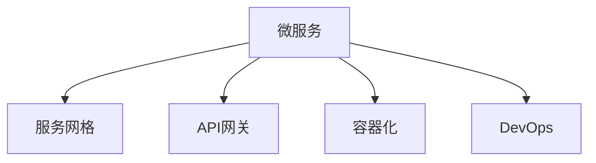

                 

## 1. 背景介绍

### 1.1 问题由来

随着互联网和技术的不断进步，企业系统规模越来越大，复杂度也越来越高。传统单块应用逐渐暴露出许多问题，如系统难以扩展、维护成本高、升级风险大等。如何构建一个能够灵活应对业务变化、快速迭代部署、低成本高可靠的系统架构，成为了所有企业IT部门的共同挑战。

微服务架构的提出，正是为了解决这一问题。它将一个复杂的应用系统拆分成一组独立、自治的服务单元，每个服务单元只负责特定的业务功能。通过微服务的组合和编排，可以实现系统的高度灵活和敏捷性。

微服务架构的思想最早源于2014年的Netflix公司，并迅速被各大互联网公司所采用。从2015年开始，微服务架构成为云计算和DevOps领域的热点话题。越来越多的企业开始构建基于微服务的系统，以提升IT系统的稳定性、可扩展性和效率。

### 1.2 问题核心关键点

微服务架构的构建和治理，主要涉及以下几个关键点：

- **服务拆分**：将应用拆分成一组独立、自治的服务单元，并合理设计服务间的依赖关系。
- **服务治理**：通过服务注册、服务发现、负载均衡、熔断、限流等机制，保证服务的可靠性和稳定性。
- **通信协议**：选择和设计服务间通信的方式，如RESTful API、gRPC、AMQP等，确保服务的交互高效性。
- **服务安全**：通过API网关、OAuth2、JWT等机制，保护服务的安全性和隐私性。
- **持续集成与部署**：构建CI/CD流水线，实现服务的快速构建、测试、发布和回滚。
- **监控与日志**：部署监控、日志收集与分析工具，及时发现和解决服务故障。

这些关键点构成了一个完整的微服务架构体系，通过各模块的有效协作，可以实现系统的平稳运行和持续发展。

## 2. 核心概念与联系

### 2.1 核心概念概述

为更好地理解微服务架构的构建与治理，本节将介绍几个关键概念：

- **微服务（Microservice）**：独立、自治的服务单元，负责特定的业务功能，具有独立的进程和网络通信能力。
- **服务网格（Service Mesh）**：一种分布式通信基础设施，提供服务发现、负载均衡、熔断、限流等网络功能。
- **API网关（API Gateway）**：充当客户端和服务之间的接口，负责请求路由、身份验证、缓存等功能。
- **容器化（Containerization）**：将应用和依赖打包成容器，实现跨平台、高效部署和运维。
- **DevOps**：通过持续集成、持续交付、持续监控等手段，实现软件的快速迭代和交付。

这些核心概念之间的逻辑关系可以通过以下Mermaid流程图来展示：



这个流程图展示出微服务架构的关键组件和其间的联系：

1. **微服务**：核心组件，承担具体的业务功能。
2. **服务网格**：通过网络基础设施支持微服务间的通信。
3. **API网关**：作为微服务的入口，提供统一接口和服务管理功能。
4. **容器化**：实现应用的打包和部署，提高运维效率。
5. **DevOps**：通过持续集成与交付机制，保证软件的快速迭代和高质量交付。

这些概念共同构成了一个完整的微服务架构体系，能够支持复杂应用的灵活构建和高效运维。

## 3. 核心算法原理 & 具体操作步骤

### 3.1 算法原理概述

微服务架构的核心算法原理，主要体现在以下几个方面：

- **服务拆分**：通过领域驱动设计（DDD）方法，将应用拆分成多个子领域，每个子领域负责一个特定的业务功能。
- **服务编排**：通过RESTful API、gRPC、AMQP等通信协议，实现服务间的通信和数据交换。
- **服务治理**：通过服务注册和发现机制，确保服务实例的动态管理；通过负载均衡、熔断、限流等机制，保障服务的稳定性和可靠性。
- **持续集成与交付**：通过CI/CD流水线，实现软件的快速构建、测试、发布和回滚。
- **监控与日志**：通过监控、日志收集与分析工具，及时发现和解决服务故障。

### 3.2 算法步骤详解

微服务架构的构建和治理，通常包含以下几个关键步骤：

**Step 1: 领域驱动设计（DDD）**

- 通过领域模型分析业务需求，将应用拆分成多个子领域，每个子领域负责一个特定的业务功能。
- 定义领域模型的实体、聚合根、值对象等组件，确保领域的独立性和自治性。

**Step 2: 服务编排**

- 选择合适的通信协议，如RESTful API、gRPC、AMQP等，实现服务间的通信。
- 设计服务接口，确保接口的清晰和稳定，方便服务间的协作。
- 实现接口的封装和抽象，避免服务间的耦合。

**Step 3: 服务治理**

- 使用服务注册和发现机制，确保服务实例的动态管理。
- 实现负载均衡、熔断、限流等机制，保障服务的稳定性和可靠性。
- 设计服务的安全策略，确保服务的安全性和隐私性。

**Step 4: 容器化和持续集成与交付**

- 将应用和依赖打包成容器，实现跨平台、高效部署和运维。
- 构建CI/CD流水线，实现软件的快速构建、测试、发布和回滚。

**Step 5: 监控与日志**

- 部署监控、日志收集与分析工具，及时发现和解决服务故障。
- 分析监控和日志数据，持续优化服务性能和稳定性和可靠性。

### 3.3 算法优缺点

微服务架构具有以下优点：

- **灵活性**：通过服务拆分和组合，实现系统的灵活构建和快速迭代。
- **独立部署**：服务可以独立部署和维护，减少系统耦合和升级风险。
- **高扩展性**：服务间的松耦合性，使系统能够轻松扩展和伸缩。
- **高可用性**：服务治理机制确保服务的稳定性和可靠性。

同时，微服务架构也存在一定的缺点：

- **复杂性**：微服务架构的实现和运维复杂性较高，需要多方面的技术支持。
- **性能开销**：服务间的通信和数据交换会增加系统的性能开销，需要合理设计通信协议和数据格式。
- **分布式一致性**：服务间的分布式调用和数据一致性管理，增加了系统的复杂性。
- **安全性**：服务间的通信和数据交换增加了安全风险，需要采用更复杂的安全策略。

### 3.4 算法应用领域

微服务架构已经在多个领域得到了广泛的应用，例如：

- **电商系统**：通过微服务拆分，实现商品的展示、购买、支付等功能，支持大规模并发和复杂业务场景。
- **金融系统**：通过微服务实现交易、结算、风控等功能，保障金融服务的稳定性和安全性。
- **移动应用**：通过微服务拆分，实现前后端分离，提高应用的性能和扩展性。
- **物联网系统**：通过微服务实现设备管理、数据采集、应用服务等，支持多种设备和数据格式。
- **电信系统**：通过微服务实现网络接入、计费、客服等功能，保障电信服务的稳定性和可靠性。

除了以上这些典型应用外，微服务架构还被创新性地应用到更多场景中，如云平台、供应链、医疗等，为各行业的数字化转型提供了新的技术路径。

## 4. 数学模型和公式 & 详细讲解 & 举例说明

### 4.1 数学模型构建

本节将使用数学语言对微服务架构的构建过程进行更加严格的刻画。

记微服务架构中的服务数量为 $N$，每个服务实例的响应时间为 $t_i$，网络通信延迟为 $d$。定义系统的总响应时间为 $T$，即所有服务的响应时间之和：

$$
T = \sum_{i=1}^N t_i + (N-1)d
$$

其中 $(N-1)d$ 表示服务间的通信延迟。

定义服务间的负载均衡因子为 $\rho$，表示服务实例在不同时间内的负载分布情况。则系统的平均响应时间为：

$$
T_{avg} = \frac{1}{N}\sum_{i=1}^N \frac{t_i}{\rho_i}
$$

其中 $\rho_i$ 表示服务实例 $i$ 在总负载 $N$ 中的占比。

### 4.2 公式推导过程

以下我们以两个服务间的通信为例，推导微服务架构的总响应时间公式。

假设服务 $A$ 和 $B$ 的响应时间分别为 $t_A$ 和 $t_B$，网络通信延迟为 $d$。服务 $A$ 到服务 $B$ 的调用路径可能存在多种情况，如直接调用、通过服务网格路由、通过API网关等。不同路径的响应时间不同，但总体公式为：

$$
T_{AB} = t_A + t_B + d
$$

如果服务 $A$ 和 $B$ 之间有多个实例，则总响应时间为：

$$
T_{AB} = N_A \times t_A + N_B \times t_B + (N_A + N_B - 1)d
$$

其中 $N_A$ 和 $N_B$ 分别表示服务 $A$ 和 $B$ 的实例数量。

通过上述公式可以看出，微服务架构的总响应时间不仅取决于单个服务的响应时间，还受到服务间的通信延迟和实例数量影响。因此，优化微服务架构，需要从服务拆分、通信协议、服务治理等方面综合考虑。

### 4.3 案例分析与讲解

**案例一：电商系统的微服务拆分**

电商系统可以拆分为商品管理、订单管理、库存管理等多个子领域，每个子领域负责一个特定的业务功能。例如，商品管理服务负责商品的展示、添加、编辑等操作，订单管理服务负责订单的生成、支付、物流等操作。

在服务拆分后，可以通过RESTful API或gRPC等方式实现服务间的通信。例如，订单管理服务可以通过RESTful API调用商品管理服务，获取商品信息。订单管理服务也可以调用库存管理服务，查询库存情况。

为了保障服务的稳定性和可靠性，可以采用服务注册和发现机制，实现服务的动态管理。例如，订单管理服务注册到服务网格中，服务网格负责将请求路由到具体的服务实例。

通过容器化和持续集成与交付机制，可以实现服务的快速构建、测试、发布和回滚。例如，订单管理服务可以打包成Docker容器，通过CI/CD流水线自动构建和部署。

**案例二：金融系统的微服务治理**

金融系统需要处理大规模并发和高频交易，因此需要特别关注服务的稳定性和可靠性。为了保障服务的稳定性和可靠性，可以采用负载均衡、熔断、限流等机制。

负载均衡可以确保请求被均匀分配到不同服务实例，避免某个实例的负载过重。例如，可以通过服务网格实现负载均衡，将请求路由到不同的订单管理服务实例。

熔断机制可以在服务出现故障时，快速断开与服务实例的连接，避免故障扩散。例如，订单管理服务可以配置熔断机制，当服务实例出现异常时，自动切换到备用实例或降级处理。

限流机制可以限制服务的并发请求数量，防止服务过载。例如，订单管理服务可以配置限流机制，限制同一时间内的请求数量，避免系统过载。

通过服务治理机制，可以实现服务的稳定性和可靠性，保障金融服务的正常运行。

## 5. 项目实践：代码实例和详细解释说明

### 5.1 开发环境搭建

在进行微服务架构的实践前，我们需要准备好开发环境。以下是使用Docker和Kubernetes进行微服务开发的流程：

1. 安装Docker：从官网下载并安装Docker，用于构建和运行容器化应用。

2. 安装Kubernetes：从官网下载并安装Kubernetes，用于容器编排和管理。

3. 构建Docker镜像：将应用和依赖打包成Docker镜像，并上传到Docker Hub。

4. 部署Kubernetes集群：在公有云或私有云中部署Kubernetes集群，并连接到Kubernetes集群。

5. 部署微服务应用：将Docker镜像部署到Kubernetes集群中，实现服务的自动扩展和伸缩。

完成上述步骤后，即可在Kubernetes集群中部署微服务应用。

### 5.2 源代码详细实现

这里我们以电商系统的订单管理服务为例，给出使用Spring Boot和Kubernetes构建微服务的PyTorch代码实现。

首先，定义订单管理服务的数据模型和接口：

```java
@Entity
@Table(name = "orders")
public class Order {
    @Id
    @GeneratedValue(strategy = GenerationType.IDENTITY)
    private Long id;
    
    @Column(name = "user_id")
    private Long userId;
    
    @Column(name = "product_id")
    private Long productId;
    
    @Column(name = "quantity")
    private Integer quantity;
    
    // getter and setter methods
}
```

```java
@RestController
@RequestMapping("/orders")
public class OrderController {
    @Autowired
    private OrderService orderService;
    
    @GetMapping("/{id}")
    public Order getOrder(@PathVariable("id") Long id) {
        return orderService.findById(id);
    }
    
    @PostMapping
    public Order createOrder(@RequestBody Order order) {
        return orderService.create(order);
    }
    
    // other methods
}
```

然后，定义订单管理服务的业务逻辑和数据访问层：

```java
@Service
public class OrderService {
    @Autowired
    private OrderRepository orderRepository;
    
    public Order findById(Long id) {
        return orderRepository.findById(id).orElse(null);
    }
    
    public Order create(Order order) {
        return orderRepository.save(order);
    }
    
    // other methods
}
```

最后，定义订单管理服务的Spring Boot启动类和Kubernetes Deployment文件：

```java
@SpringBootApplication
public class OrderApplication {
    public static void main(String[] args) {
        SpringApplication.run(OrderApplication.class, args);
    }
}
```

```yaml
apiVersion: apps/v1
kind: Deployment
metadata:
  name: order-service
spec:
  replicas: 3
  selector:
    matchLabels:
      app: order-service
  template:
    metadata:
      labels:
        app: order-service
    spec:
      containers:
      - name: order-service
        image: my-docker-image:latest
        ports:
        - containerPort: 8080
```

通过上述代码，我们可以快速构建和部署电商系统的订单管理服务。需要注意的是，订单管理服务需要注册到服务网格中，并实现负载均衡、熔断、限流等机制，以保障服务的稳定性和可靠性。

### 5.3 代码解读与分析

让我们再详细解读一下关键代码的实现细节：

**Order实体类**：
- `@Entity` 和 `@Table` 注解：定义订单实体和数据库表。
- `@Id` 和 `@GeneratedValue` 注解：定义主键和自增长策略。
- `@Column` 注解：定义字段名和数据类型。
- getter和setter方法：实现属性的访问和修改。

**OrderController控制器**：
- `@RestController` 注解：定义RESTful风格的控制器。
- `@RequestMapping` 注解：定义请求映射路径。
- `@GetMapping` 和 `@PostMapping` 注解：定义HTTP请求方法和路径。
- `@RequestBody` 注解：定义请求体参数。
- 业务逻辑方法：实现订单的获取、创建等操作。

**OrderService业务逻辑层**：
- `@Service` 注解：定义Spring的业务服务。
- `@Autowired` 注解：注入依赖。
- `OrderRepository` 接口：定义订单的数据访问层。
- 业务逻辑方法：实现订单的查找、创建等操作。

**OrderApplication启动类**：
- `@SpringBootApplication` 注解：定义Spring Boot的启动类。
- `main` 方法：启动Spring Boot应用。

**Kubernetes Deployment配置文件**：
- `apiVersion`：指定Kubernetes的API版本。
- `kind`：指定资源类型。
- `metadata`：定义资源的元数据。
- `spec`：定义资源的具体配置。
- `replicas`：指定复制数量。
- `selector`：指定选择器。
- `template`：定义Pod的模板。
- `containers`：定义Pod中的容器。
- `ports`：定义容器的端口。

通过上述代码，我们可以看出Spring Boot和Kubernetes在构建微服务架构中的强大功能和易用性。开发者可以将更多精力放在业务逻辑的实现上，而不必过多关注容器化和编排的细节。

当然，工业级的系统实现还需考虑更多因素，如多环境配置、负载均衡、监控告警等。但核心的微服务构建和部署流程基本与此类似。

## 6. 实际应用场景

### 6.1 智能客服系统

基于微服务架构的智能客服系统，可以构建一个高度灵活和可扩展的系统。传统客服往往需要配备大量人力，高峰期响应缓慢，且一致性和专业性难以保证。微服务架构的智能客服系统，可以通过快速迭代和扩展，满足不同场景下的客户需求。

在技术实现上，可以收集企业内部的历史客服对话记录，将问题和最佳答复构建成监督数据，在此基础上对预训练模型进行微调。微调后的模型可以与微服务架构的智能客服系统结合，实现自动理解和匹配客户问题，生成最佳答复。对于客户提出的新问题，还可以接入检索系统实时搜索相关内容，动态组织生成回答。如此构建的智能客服系统，能大幅提升客户咨询体验和问题解决效率。

### 6.2 电商平台

微服务架构的电商平台，可以实现商品的展示、购买、支付等功能，支持大规模并发和复杂业务场景。通过微服务拆分，可以将电商平台的各个模块独立部署和维护，减少系统耦合和升级风险。例如，商品管理服务负责商品的展示、添加、编辑等操作，订单管理服务负责订单的生成、支付、物流等操作。

为了保障服务的稳定性和可靠性，可以采用负载均衡、熔断、限流等机制。例如，订单管理服务可以配置负载均衡机制，将请求路由到不同的商品管理服务实例。订单管理服务也可以配置熔断机制，当服务实例出现异常时，自动切换到备用实例或降级处理。限流机制可以限制服务的并发请求数量，防止服务过载。例如，订单管理服务可以配置限流机制，限制同一时间内的请求数量，避免系统过载。

通过微服务架构的电商平台，可以实现系统的灵活构建和快速迭代，提升用户体验和业务效率。

### 6.3 金融系统

微服务架构的金融系统，需要处理大规模并发和高频交易，因此需要特别关注服务的稳定性和可靠性。金融系统通常需要处理复杂的业务逻辑，如交易、结算、风控等，因此需要采用微服务拆分和组合，实现系统的灵活构建和快速迭代。例如，交易服务负责订单的生成、支付、结算等操作，风控服务负责风险评估和预警等操作。

为了保障服务的稳定性和可靠性，可以采用负载均衡、熔断、限流等机制。例如，交易服务可以配置负载均衡机制，将请求路由到不同的风控服务实例。交易服务也可以配置熔断机制，当服务实例出现异常时，自动切换到备用实例或降级处理。限流机制可以限制服务的并发请求数量，防止服务过载。例如，交易服务可以配置限流机制，限制同一时间内的请求数量，避免系统过载。

通过微服务架构的金融系统，可以实现系统的稳定性和可靠性，保障金融服务的正常运行。

### 6.4 未来应用展望

随着微服务架构和相关技术的发展，其在更多领域的应用前景值得期待。

- **智能制造**：通过微服务架构，可以实现设备和数据的实时监控和优化，提升生产效率和质量。例如，工厂内部的设备状态监测、质量检测、生产调度等功能，可以通过微服务架构实现。
- **智慧城市**：通过微服务架构，可以实现城市管理的智能化和协同化，提升城市治理效率和服务水平。例如，交通管理、环境监测、安全监控等功能，可以通过微服务架构实现。
- **医疗健康**：通过微服务架构，可以实现医疗数据的共享和分析，提升医疗服务的质量和效率。例如，电子病历、健康监测、远程诊疗等功能，可以通过微服务架构实现。
- **物联网**：通过微服务架构，可以实现物联网设备的智能化和互联互通，提升物联网的应用价值。例如，智能家居、工业物联网、智慧农业等功能，可以通过微服务架构实现。

未来，微服务架构将进一步拓展其应用领域，推动各行业的数字化转型，为经济社会发展注入新的动力。

## 7. 工具和资源推荐

### 7.1 学习资源推荐

为了帮助开发者系统掌握微服务架构的理论基础和实践技巧，这里推荐一些优质的学习资源：

1. **《微服务架构设计》**：一本深入浅出介绍微服务架构设计原则和方法的书籍。
2. **Spring Cloud官方文档**：Spring Cloud是微服务架构的核心技术栈之一，提供了丰富的微服务组件和服务治理功能。
3. **Kubernetes官方文档**：Kubernetes是微服务架构的容器编排和管理工具，提供了强大的集群管理和资源调度功能。
4. **Netflix的微服务架构实践**：Netflix公司是微服务架构的开创者，其微服务实践经验和教训值得学习和借鉴。
5. **《Designing Data-Intensive Applications》**：一本系统介绍分布式系统设计和微服务架构的书籍。

通过对这些资源的学习实践，相信你一定能够快速掌握微服务架构的精髓，并用于解决实际的IT问题。

### 7.2 开发工具推荐

高效的开发离不开优秀的工具支持。以下是几款用于微服务架构开发的常用工具：

1. **Spring Boot**：基于Spring框架的快速开发框架，支持微服务架构的构建和部署。
2. **Docker**：容器化解决方案，实现应用的打包和部署，提高运维效率。
3. **Kubernetes**：容器编排和管理工具，实现微服务的自动扩展和伸缩。
4. **Prometheus**：监控和报警系统，实时监控微服务的运行状态。
5. **Grafana**：可视化工具，展示监控数据的图表和仪表盘。
6. **Jenkins**：持续集成和持续交付工具，实现微服务的快速构建和部署。

合理利用这些工具，可以显著提升微服务架构的开发效率，加快创新迭代的步伐。

### 7.3 相关论文推荐

微服务架构和相关技术的发展源于学界的持续研究。以下是几篇奠基性的相关论文，推荐阅读：

1. **《Microservices: A design methodology and guide》**：Spring Cloud之父Michelouse和各种架构师联合撰写的一篇综述性论文，系统介绍微服务架构设计方法和最佳实践。
2. **《Deploying Microservices: A Tutorial》**：Netflix公司的一篇技术博客，介绍微服务架构的部署实践和工具选择。
3. **《Designing Data-Intensive Applications》**：系统介绍分布式系统设计和微服务架构的书籍，提供了丰富的案例和代码实现。
4. **《Microservices Design Patterns》**：系统介绍微服务架构设计模式和方法的书籍，提供了丰富的案例和代码实现。

这些论文代表了大微服务架构发展的趋势，通过学习这些前沿成果，可以帮助研究者把握学科前进方向，激发更多的创新灵感。

## 8. 总结：未来发展趋势与挑战

### 8.1 总结

本文对微服务架构的构建与治理进行了全面系统的介绍。首先阐述了微服务架构的背景和意义，明确了微服务在构建灵活、高效、可扩展系统中的独特价值。其次，从原理到实践，详细讲解了微服务架构的数学模型和核心算法，给出了微服务架构的完整代码实现。同时，本文还广泛探讨了微服务架构在多个行业领域的应用前景，展示了微服务架构的广阔发展空间。

通过本文的系统梳理，可以看到，微服务架构正在成为IT系统构建的重要范式，极大地提升了系统的灵活性和可扩展性。微服务架构的应用已经覆盖了电商、金融、医疗等多个领域，为各行业的数字化转型提供了新的技术路径。未来，随着微服务架构和相关技术的不断演进，其在更多领域的应用前景值得期待。

### 8.2 未来发展趋势

展望未来，微服务架构的发展趋势如下：

1. **服务治理能力的提升**：随着微服务架构的普及，服务治理的重要性将进一步凸显。未来的微服务架构将更加注重服务的稳定性和可靠性，引入更丰富的服务治理机制，如分布式事务、数据一致性管理等。

2. **容器化技术的成熟**：容器化技术将成为微服务架构的基础设施，未来的微服务架构将更加依赖容器化技术，提升系统的灵活性和可扩展性。

3. **微服务生态的丰富**：未来的微服务架构将依赖更多开源组件和工具，构建更加丰富的微服务生态，提升开发效率和运维水平。

4. **微服务治理平台的应用**：微服务治理平台将成为微服务架构的核心组成部分，提供统一的服务管理、监控、告警、治理等功能，提升系统的稳定性和可靠性。

5. **微服务架构的跨云部署**：微服务架构将更加注重跨云部署，实现应用的平滑迁移和扩展，提升应用的灵活性和可靠性。

以上趋势凸显了微服务架构的发展方向，通过这些方面的持续优化和演进，微服务架构将能够更好地应对业务变化，提升系统的灵活性和可扩展性。

### 8.3 面临的挑战

尽管微服务架构已经取得了显著的成就，但在迈向更加智能化、普适化应用的过程中，它仍面临诸多挑战：

1. **微服务架构的复杂性**：微服务架构的实现和运维复杂性较高，需要多方面的技术支持。开发者需要具备较高的技术水平和经验。

2. **服务间的通信开销**：服务间的通信和数据交换会增加系统的性能开销，需要合理设计通信协议和数据格式。

3. **分布式一致性**：微服务架构的服务间的分布式调用和数据一致性管理，增加了系统的复杂性。

4. **安全性**：服务间的通信和数据交换增加了安全风险，需要采用更复杂的安全策略。

5. **成本和运维复杂性**：微服务架构的运维成本较高，需要专门的运维团队和技术支持。

6. **开发和交付周期长**：微服务架构的开发和交付周期较长，需要持续集成和持续交付的支持。

正视微服务架构面临的这些挑战，积极应对并寻求突破，将使微服务架构在未来的发展中更具竞争力。

### 8.4 研究展望

面对微服务架构所面临的挑战，未来的研究需要在以下几个方面寻求新的突破：

1. **微服务治理平台的研发**：开发更加智能和自动化的微服务治理平台，提供统一的服务管理、监控、告警、治理等功能，提升系统的稳定性和可靠性。

2. **容器化技术的优化**：进一步优化容器化技术，提升容器的启动、运行、部署效率，减少服务间的通信延迟。

3. **微服务架构的跨云部署**：实现微服务架构的跨云部署，提升应用的灵活性和可靠性。

4. **微服务架构的跨领域应用**：拓展微服务架构在更多领域的应用，提升各行业的数字化转型水平。

5. **微服务架构的自动化运维**：开发自动化运维工具，实现微服务架构的自动部署、回滚、扩展等操作。

6. **微服务架构的可扩展性**：提升微服务架构的可扩展性，支持海量数据的处理和高并发场景。

这些研究方向将推动微服务架构的不断演进和优化，为构建稳定、可靠、可扩展的系统奠定坚实基础。面向未来，微服务架构将结合更多的技术和思想，实现更高的性能和可靠性，为数字化转型注入新的动力。

## 9. 附录：常见问题与解答

**Q1: 微服务架构的优缺点有哪些？**

A: 微服务架构的优点包括：
- 灵活性：通过服务拆分和组合，实现系统的灵活构建和快速迭代。
- 独立部署：服务可以独立部署和维护，减少系统耦合和升级风险。
- 高扩展性：服务间的松耦合性，使系统能够轻松扩展和伸缩。
- 高可用性：服务治理机制确保服务的稳定性和可靠性。

微服务架构的缺点包括：
- 复杂性：微服务架构的实现和运维复杂性较高，需要多方面的技术支持。
- 性能开销：服务间的通信和数据交换会增加系统的性能开销，需要合理设计通信协议和数据格式。
- 分布式一致性：服务间的分布式调用和数据一致性管理，增加了系统的复杂性。
- 安全性：服务间的通信和数据交换增加了安全风险，需要采用更复杂的安全策略。

**Q2: 如何选择合适的微服务架构？**

A: 选择微服务架构需要综合考虑以下几个方面：
- 应用规模：对于大规模和高并发的应用，微服务架构的优势更加明显。
- 业务复杂度：对于业务逻辑复杂且变化频繁的应用，微服务架构能够提供更高的灵活性和可扩展性。
- 技术能力：开发团队需要具备较高的技术水平和经验，以便实现微服务架构的复杂性。
- 系统可靠性：需要综合考虑系统的稳定性和可靠性，引入丰富的服务治理机制。
- 成本和运维复杂性：需要考虑微服务架构的开发和运维成本，合理评估技术的性价比。

**Q3: 微服务架构的开发流程有哪些步骤？**

A: 微服务架构的开发流程通常包括以下几个步骤：
- 领域驱动设计（DDD）：将应用拆分成多个子领域，每个子领域负责一个特定的业务功能。
- 服务编排：选择合适的通信协议，实现服务间的通信和数据交换。
- 服务治理：通过服务注册和发现机制，确保服务实例的动态管理；通过负载均衡、熔断、限流等机制，保障服务的稳定性和可靠性。
- 容器化和持续集成与交付：将应用和依赖打包成容器，实现跨平台、高效部署和运维。
- 监控与日志：部署监控、日志收集与分析工具，及时发现和解决服务故障。

通过这些步骤，可以实现微服务架构的灵活构建和高效运维。

**Q4: 微服务架构的持续集成与交付有哪些工具？**

A: 微服务架构的持续集成与交付工具包括：
- Jenkins：持续集成和持续交付工具，实现微服务的快速构建和部署。
- GitLab CI/CD：基于GitLab的持续集成和持续交付平台，支持代码版本管理和自动化构建。
- CircleCI：基于云端的持续集成和持续交付工具，支持多平台和多种语言的构建和部署。
- Travis CI：基于云端的持续集成和持续交付工具，支持多种语言的构建和部署。
- GitLab：基于Git的代码管理平台，提供持续集成和持续交付功能。

这些工具可以大大提升微服务架构的开发效率和质量，缩短开发和交付周期。

**Q5: 微服务架构的治理机制有哪些？**

A: 微服务架构的治理机制包括：
- 服务注册和发现：通过服务注册和发现机制，确保服务实例的动态管理。
- 负载均衡：通过负载均衡机制，将请求路由到不同的服务实例。
- 熔断：通过熔断机制，在服务出现故障时，快速断开与服务实例的连接，避免故障扩散。
- 限流：通过限流机制，限制服务的并发请求数量，防止服务过载。
- 监控和告警：通过监控和告警机制，及时发现和解决服务故障。

这些机制可以保障微服务架构的稳定性和可靠性，提升系统的性能和用户体验。

---

作者：禅与计算机程序设计艺术 / Zen and the Art of Computer Programming

