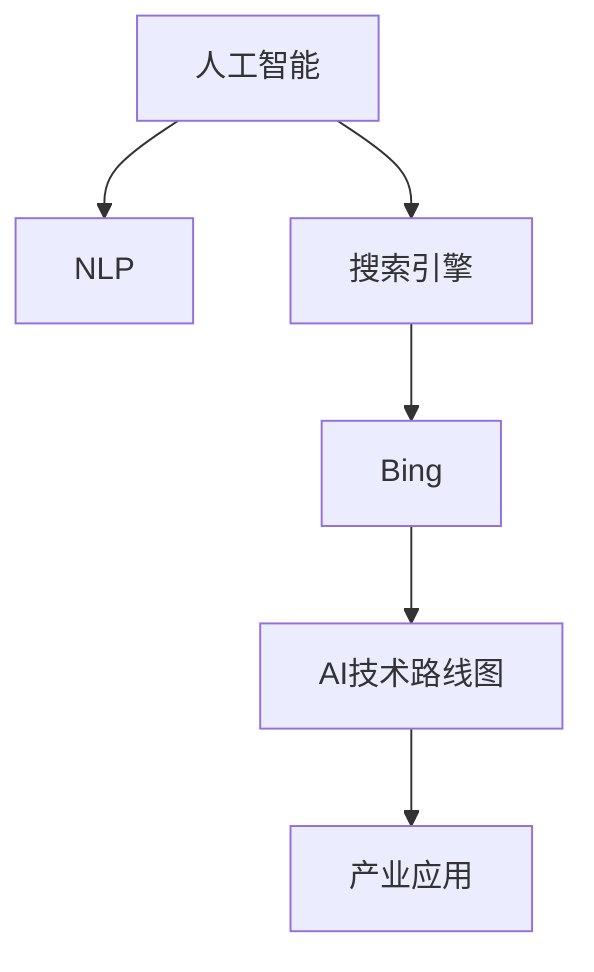

                 

# 微软的AI战略对行业的影响：Bing升级的启示与借鉴

> 关键词：人工智能, 自然语言处理, 搜索引擎, AI技术, 转型升级

## 1. 背景介绍

### 1.1 问题由来
微软作为全球科技巨头，一直以来都在积极推进AI技术的发展与应用。近期，微软在搜索引擎领域的重要举措——Bing升级，引发了广泛关注。其背后所反映的AI战略和转型思路，对于整个行业具有重要借鉴意义。

本文旨在探讨微软的AI战略对行业的影响，特别是Bing升级对于搜索引擎技术演进和产业应用的启示。通过分析微软的AI技术路线图，我们可以窥见AI在未来数字经济的潜力与趋势。

## 2. 核心概念与联系

### 2.1 核心概念概述

为更好地理解微软的AI战略及其对Bing升级的影响，本节将介绍几个关键概念：

- **人工智能（Artificial Intelligence, AI）**：旨在模拟人类智能行为，通过算法和计算能力实现自主决策、学习和适应的技术。

- **自然语言处理（Natural Language Processing, NLP）**：研究计算机如何理解、处理和生成自然语言的技术。Bing作为搜索引擎，其核心依赖于NLP技术。

- **搜索引擎（Search Engine）**：帮助用户快速获取信息的软件，如Google、Bing等。微软的Bing升级，意味着搜索引擎的AI化趋势不断加强。

- **AI技术路线图**：描述了AI技术从基础研究到实际应用的全过程，包括模型训练、算法优化、应用落地等关键环节。

- **产业应用**：AI技术在各行业的具体应用，如智能客服、医疗诊断、自动驾驶等。Bing升级为AI技术在搜索引擎领域的深度融合提供了典型案例。

这些核心概念之间的逻辑关系可以通过以下Mermaid流程图来展示：



这个流程图展示了从AI到具体应用场景的逻辑链条：

1. AI作为核心驱动力，推动NLP等技术的发展。
2. NLP技术在搜索引擎中的应用，提升搜索体验。
3. Bing作为搜索引擎的代表，其升级展示了AI技术的落地效果。
4. AI技术路线图描绘了从基础研究到产业应用的全过程。
5. 最终AI技术在各行业的应用，推动数字经济发展。

## 3. 核心算法原理 & 具体操作步骤
### 3.1 算法原理概述

微软在Bing的升级中，采用了多种AI技术，包括自然语言处理、图像识别、多模态融合等。这些技术的核心原理可简要概述如下：

- **深度学习**：通过多层神经网络对数据进行建模，提升模型学习能力。
- **卷积神经网络（CNN）**：用于图像识别和特征提取，从像素级别的信息中提取语义。
- **循环神经网络（RNN）及其变体LSTM、GRU**：处理序列数据，用于自然语言理解和生成。
- **Transformer架构**：特别是BERT、GPT等模型，通过自注意力机制提升模型对语言的理解能力。
- **多模态融合**：结合文本、图像、音频等多种信息源，提升搜索引擎的全面性和准确性。

这些技术相互结合，共同支撑了Bing搜索引擎的升级。

### 3.2 算法步骤详解

微软Bing的升级涉及多个算法步骤，具体如下：

1. **数据收集与预处理**：从Web上爬取数据，并对其进行清洗、分词、向量化等预处理。

2. **模型训练**：使用大规模语料库和标注数据，对深度学习模型进行训练。例如，使用BERT模型进行预训练，再在其基础上进行微调。

3. **多模态融合**：将图像、音频等数据与文本数据融合，提升搜索结果的相关性。

4. **实时处理**：在搜索结果中引入实时数据，如新闻、社交媒体等，提升搜索体验。

5. **优化与部署**：通过A/B测试等方法，不断优化模型和算法，并将其部署到Bing搜索引擎中。

### 3.3 算法优缺点

#### 优点：

- **准确性提升**：通过深度学习等先进算法，显著提升了搜索结果的准确性和相关性。
- **用户体验改善**：多模态融合和实时数据处理，丰富了搜索结果形式，提升了用户体验。
- **可扩展性强**：AI技术的可扩展性使得Bing可以不断适应新的搜索需求。

#### 缺点：

- **计算资源需求高**：深度学习模型和大规模数据处理需要高昂的计算资源。
- **数据隐私问题**：大规模数据收集和处理可能引发用户隐私问题。
- **技术壁垒高**：需要专业技术人员对AI技术进行持续优化和维护。

### 3.4 算法应用领域

Bing的AI升级涵盖了以下应用领域：

- **搜索算法优化**：使用深度学习和多模态融合技术，提升搜索结果的精度和相关性。
- **自然语言处理**：利用自然语言处理技术，理解用户查询意图，提供更精准的搜索结果。
- **图像识别**：结合图像识别技术，丰富搜索结果的多样性。
- **实时数据处理**：引入实时数据，提升搜索信息的及时性和新鲜度。

这些应用领域展示了AI技术在搜索引擎领域的广泛应用，具有重要的参考价值。

## 4. 数学模型和公式 & 详细讲解 & 举例说明

### 4.1 数学模型构建

Bing升级过程中，使用了多个数学模型，包括文本分类、情感分析、实体识别等。以文本分类为例，其数学模型可表示为：

$$
\theta^* = \arg\min_\theta \frac{1}{N} \sum_{i=1}^N \ell(\hat{y_i}, y_i)
$$

其中，$\theta$ 为模型参数，$\ell$ 为损失函数，$N$ 为样本数量，$y_i$ 为真实标签，$\hat{y_i}$ 为模型预测标签。

### 4.2 公式推导过程

以BERT模型的训练过程为例，其关键公式为：

$$
\mathcal{L} = \sum_{i=1}^N \big[ \text{CLS}(y_i) + \sum_{j=1}^{m_i} \text{MLM}(x_j, y_j)\big]
$$

其中，$\text{CLS}$ 为句子表示向量，$\text{MLM}$ 为掩码语言模型，$m_i$ 为样本中单词数量。

通过反向传播算法，不断优化模型参数 $\theta$，最小化损失函数 $\mathcal{L}$。

### 4.3 案例分析与讲解

以BERT模型为例，其训练过程包括以下步骤：

1. **预训练阶段**：在大规模无标签文本上，使用掩码语言模型进行预训练，学习通用的语言表示。
2. **微调阶段**：在有标签数据上进行微调，学习特定任务的表示。例如，在Bing中，微调阶段可能涉及查询意图识别和实体抽取等任务。
3. **测试阶段**：在验证集和测试集上进行评估，选择最优模型。

通过这样的流程，Bing可以不断优化和改进，提升搜索效果。

## 5. 项目实践：代码实例和详细解释说明

### 5.1 开发环境搭建

为进行Bing搜索引擎的AI升级，首先需要搭建开发环境。以下是使用Python和TensorFlow进行环境配置的步骤：

1. 安装Anaconda：从官网下载并安装Anaconda，用于创建独立的Python环境。
2. 创建并激活虚拟环境：
```bash
conda create -n pytorch-env python=3.8 
conda activate pytorch-env
```

3. 安装PyTorch、TensorFlow等深度学习框架：
```bash
pip install torch torchvision torchaudio cudatoolkit=11.1 -c pytorch -c conda-forge
pip install tensorflow==2.5
```

4. 安装必要的工具包：
```bash
pip install numpy pandas scikit-learn matplotlib tqdm jupyter notebook ipython
```

5. 安装BERT模型：
```bash
pip install transformers
```

### 5.2 源代码详细实现

以下是使用TensorFlow和Transformers库进行BERT模型微调的代码实现：

```python
import tensorflow as tf
from transformers import BertTokenizer, BertForSequenceClassification, AdamW

# 设置设备
device = tf.device('/gpu:0')

# 定义超参数
num_labels = 2
learning_rate = 2e-5
epochs = 3
batch_size = 32

# 初始化BERT模型和分词器
tokenizer = BertTokenizer.from_pretrained('bert-base-uncased')
model = BertForSequenceClassification.from_pretrained('bert-base-uncased', num_labels=num_labels)

# 定义优化器
optimizer = AdamW(model.parameters(), lr=learning_rate)

# 加载训练数据
train_dataset = ...
train_dataset = tf.data.Dataset.from_tensor_slices((train_data, train_labels))

# 定义模型训练函数
@tf.function
def train_step(inputs):
    with tf.GradientTape() as tape:
        predictions = model(inputs.input_ids, training=True)
        loss = tf.keras.losses.sparse_categorical_crossentropy(labels=inputs.labels, logits=predictions)
    gradients = tape.gradient(loss, model.trainable_variables)
    optimizer.apply_gradients(zip(gradients, model.trainable_variables))
    return loss

# 定义模型评估函数
@tf.function
def evaluate_step(inputs):
    predictions = model(inputs.input_ids, training=False)
    labels = inputs.labels
    return tf.metrics.sparse_categorical_accuracy(labels, predictions)

# 模型训练循环
for epoch in range(epochs):
    for batch in train_dataset:
        loss = train_step(batch)
        print(f'Epoch {epoch+1}, loss: {loss.numpy()}')
    evaluation = evaluate_step(test_dataset)
    print(f'Epoch {epoch+1}, evaluation accuracy: {evaluation.numpy()}')
```

### 5.3 代码解读与分析

上述代码实现了使用TensorFlow和Transformers库对BERT模型进行微调的流程。具体解释如下：

1. **环境搭建**：使用Anaconda创建Python虚拟环境，并使用pip安装必要的工具包。
2. **模型初始化**：使用Transformers库加载BERT模型和分词器，并使用TensorFlow定义优化器和损失函数。
3. **数据加载**：使用TensorFlow的Data API加载训练数据，并转换成模型所需格式。
4. **模型训练**：定义训练步骤，通过梯度下降更新模型参数。
5. **模型评估**：定义评估步骤，计算模型在测试集上的准确率。

## 6. 实际应用场景

### 6.1 搜索算法优化

Bing的AI升级，显著提升了搜索算法的优化效果。通过深度学习和多模态融合技术，Bing能够更准确地理解用户查询意图，提供更相关、更全面的搜索结果。

### 6.2 自然语言处理

利用自然语言处理技术，Bing能够处理复杂查询，识别关键词，理解上下文，从而提升搜索结果的相关性和准确性。

### 6.3 图像识别

结合图像识别技术，Bing可以在搜索结果中展示图片，丰富信息形式。例如，用户搜索“美食”时，Bing不仅展示文本信息，还展示相关美食图片。

### 6.4 实时数据处理

引入实时数据，Bing能够提供最新的新闻、博客、论坛等信息，增强搜索结果的时效性和新鲜度。例如，用户搜索“股票”时，Bing展示最新财经新闻和股票价格。

### 6.5 未来应用展望

未来，Bing将继续在AI技术驱动下进行升级，提升搜索体验。具体展望如下：

1. **更智能的推荐系统**：结合用户行为数据，提供个性化搜索结果。
2. **多语言支持**：支持更多语言，提供全球化的搜索体验。
3. **知识图谱融合**：结合知识图谱，提升搜索结果的全面性和准确性。
4. **交互式搜索结果**：通过语音、图像等交互方式，提升用户体验。

## 7. 工具和资源推荐

### 7.1 学习资源推荐

为了帮助开发者系统掌握Bing升级背后的AI技术，以下是一些优质的学习资源：

1. **《深度学习》课程**：斯坦福大学提供的深度学习课程，涵盖深度学习的基本原理和应用。
2. **《自然语言处理》课程**：Coursera提供的自然语言处理课程，涉及NLP技术的核心算法和应用。
3. **Transformers官方文档**：详细介绍了如何使用Transformers库进行深度学习模型的微调。
4. **TensorFlow官方文档**：提供了TensorFlow的使用指南和API文档，帮助开发者进行深度学习模型的训练和优化。
5. **《自然语言处理综论》书籍**：自然语言处理的经典教材，涵盖NLP技术的理论和实践。

### 7.2 开发工具推荐

为了提升Bing升级的开发效率，以下是一些推荐的开发工具：

1. **Jupyter Notebook**：交互式编程环境，便于代码调试和数据可视化。
2. **TensorFlow**：灵活的深度学习框架，支持多种模型和算法。
3. **Transformers**：强大的NLP工具库，提供了多种预训练语言模型和微调API。
4. **Git**：版本控制工具，帮助开发者进行代码管理和协作。
5. **Docker**：容器化技术，帮助开发者构建可移植的开发环境。

### 7.3 相关论文推荐

Bing升级背后的AI技术涉及多个前沿研究方向，以下是几篇奠基性的相关论文：

1. **《Attention is All You Need》**：Transformer架构的奠基论文，展示了注意力机制在NLP中的应用。
2. **《BERT: Pre-training of Deep Bidirectional Transformers for Language Understanding》**：BERT模型的重要论文，展示了预训练语言模型在NLP任务上的显著效果。
3. **《No Free Lunch in Machine Learning》**：经典的机器学习理论论文，探讨了机器学习中的一些基本问题。
4. **《Deep Learning》**：深度学习领域的经典教材，涵盖深度学习的基本原理和应用。
5. **《Human-Computer Interaction》**：人机交互领域的经典教材，探讨了人机交互的基本原理和应用。

## 8. 总结：未来发展趋势与挑战

### 8.1 研究成果总结

微软在Bing的AI升级中，展示了深度学习、自然语言处理、多模态融合等技术的强大威力。通过这一系列技术的应用，Bing搜索引擎的搜索体验得到了显著提升。

### 8.2 未来发展趋势

未来，AI技术将在搜索引擎领域继续发挥重要作用。以下是未来可能的发展趋势：

1. **更智能的算法**：深度学习和多模态融合技术将进一步提升搜索算法的智能性。
2. **更个性化的推荐**：结合用户行为数据，提供更加精准的个性化搜索结果。
3. **更全面的信息**：结合知识图谱和实时数据，提供更全面、准确的信息。
4. **更友好的交互方式**：通过语音、图像等交互方式，提升用户体验。

### 8.3 面临的挑战

尽管Bing的AI升级取得了显著成效，但在实际应用中也面临一些挑战：

1. **数据隐私**：大规模数据收集和处理可能引发用户隐私问题。
2. **计算资源**：深度学习模型和大规模数据处理需要高昂的计算资源。
3. **技术复杂性**：AI技术的应用需要专业的技术团队进行持续优化和维护。

### 8.4 研究展望

未来，AI技术将在搜索引擎领域继续深化应用，面临的挑战也将逐步被克服。研究展望如下：

1. **数据隐私保护**：研究如何保护用户数据隐私，避免数据泄露。
2. **计算资源优化**：研究如何优化计算资源，降低深度学习模型的计算成本。
3. **模型可解释性**：研究如何提高模型的可解释性，增强用户信任。
4. **多模态融合技术**：研究如何更好地融合文本、图像、语音等数据，提升搜索结果的多样性和全面性。

## 9. 附录：常见问题与解答

**Q1: 微软的AI战略对行业的影响有哪些？**

A: 微软的AI战略对行业的影响主要体现在以下几个方面：
1. **技术推动**：微软通过AI技术推动NLP、搜索引擎等领域的发展，提升了整个行业的技术水平。
2. **市场竞争**：微软的AI战略使其在搜索引擎等领域的竞争力显著提升，对其他厂商形成了压力。
3. **用户体验**：AI技术的应用，提升了搜索引擎的搜索体验，改善了用户的使用感受。

**Q2: 如何理解Bing升级中的多模态融合技术？**

A: 多模态融合技术是指将文本、图像、音频等多种信息源融合在一起，提升搜索结果的相关性和全面性。Bing升级中的多模态融合技术主要体现在以下几个方面：
1. **图像识别**：Bing能够自动识别图片中的文字、物体等信息，并将其与搜索结果结合。
2. **语音识别**：Bing支持语音搜索，用户可以通过语音输入查询，Bing能够自动识别并处理。
3. **视频处理**：Bing能够处理视频内容，识别视频中的文字和场景，提供更全面的搜索结果。

**Q3: 微软在Bing升级中采用了哪些深度学习模型？**

A: 微软在Bing升级中主要采用了以下深度学习模型：
1. **BERT**：用于预训练和微调，提升语言模型的理解能力。
2. **GPT**：用于自然语言生成，提高搜索结果的创造性。
3. **CNN**：用于图像识别，提升搜索结果的多样性。
4. **RNN**：用于处理序列数据，提升查询意图的理解能力。

这些模型的结合使用，使得Bing能够提供更全面、准确的搜索结果。

**Q4: 微软在Bing升级中采用了哪些自然语言处理技术？**

A: 微软在Bing升级中主要采用了以下自然语言处理技术：
1. **词向量表示**：使用词向量技术，将单词转换为向量表示，提升模型的表达能力。
2. **掩码语言模型**：使用掩码语言模型，提升模型的泛化能力。
3. **意图识别**：使用意图识别技术，理解用户查询意图，提供更精准的搜索结果。
4. **实体抽取**：使用实体抽取技术，识别文本中的实体，提升搜索结果的相关性。

这些技术的结合使用，使得Bing能够更好地理解用户查询，提供更精准的搜索结果。

---

作者：禅与计算机程序设计艺术 / Zen and the Art of Computer Programming

