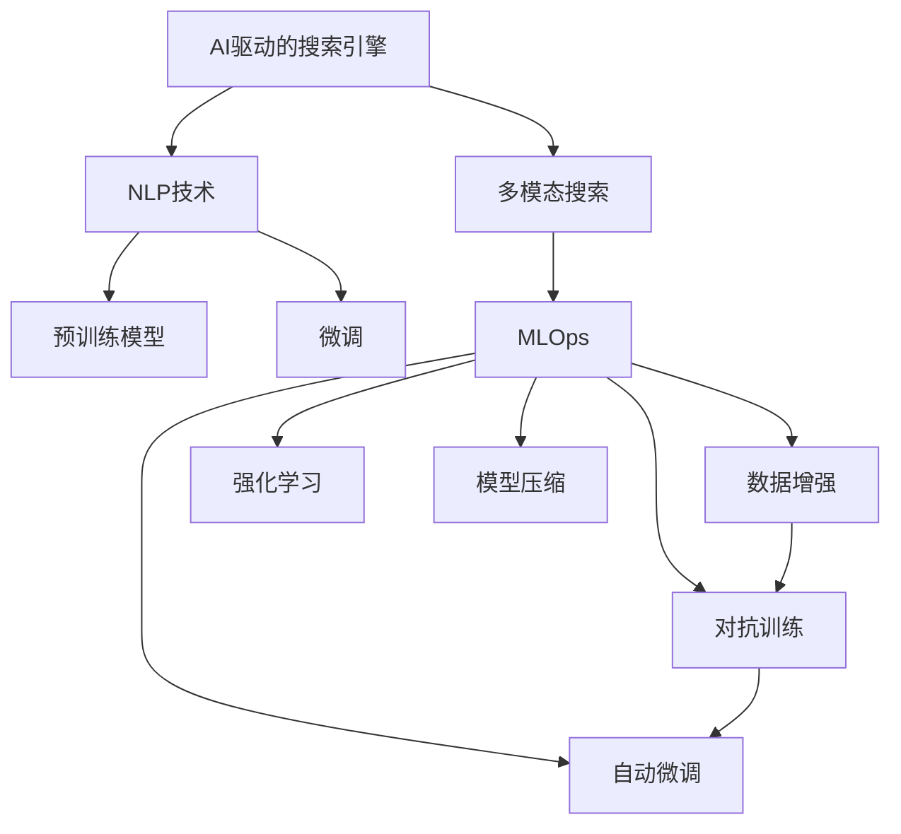

                 

# 微软的AI战略：Bing升级的后续

## 1. 背景介绍

### 1.1 问题由来

微软在2023年宣布了其AI战略的重大转型，特别是在Bing搜索引擎的升级方面。此举标志着微软正全力打造一个全新的AI驱动的搜索体验，旨在将Bing打造成全球最智能、最全面的搜索工具。Bing的升级不仅仅是一个技术上的突破，更是微软在AI领域的深度布局和战略重心的转变。

### 1.2 问题核心关键点

微软此次AI战略的核心在于三个方面：**搜索体验的升级、AI技术的集成以及自然语言处理(NLP)能力的强化**。通过Bing的全面升级，微软希望能够更好地满足用户需求，提升搜索引擎的智能化水平，从而在全球搜索市场中占据领先地位。

## 2. 核心概念与联系

### 2.1 核心概念概述

为更好地理解微软的AI战略和Bing升级的后续，本节将介绍几个密切相关的核心概念：

- **AI驱动的搜索引擎**：指利用人工智能技术，通过自然语言理解和生成、多模态数据融合等方式，提升搜索引擎的智能化水平。

- **自然语言处理(NLP)**：指利用计算机处理自然语言的技术，涉及语音识别、文本生成、机器翻译、信息检索等多个方面。

- **多模态搜索**：指在搜索过程中整合文本、图像、视频等多种数据类型，提供更为全面和丰富的信息检索结果。

- **迁移学习**：指将一个领域学习到的知识迁移到另一个领域，以提高模型在新任务上的表现。

- **预训练模型**：指在大规模无标签数据上预训练的模型，通过自监督学习任务获得广泛的语言知识和表示能力。

- **微调(Fine-tuning)**：指在预训练模型的基础上，使用下游任务的少量标注数据进行微调，以适应特定任务。

这些概念之间的逻辑关系可以通过以下Mermaid流程图来展示：



这个流程图展示了AI驱动搜索引擎的核心组件及其相互关系：

1. **AI驱动的搜索引擎**：依赖NLP技术进行自然语言理解与生成。
2. **NLP技术**：以预训练模型为基础，通过微调适配特定任务。
3. **多模态搜索**：将多种数据类型整合，提供更全面的搜索结果。
4. **预训练模型**：通过大规模无标签数据预训练，获得广泛的知识。
5. **微调**：根据下游任务，在预训练模型上进行微调，优化模型性能。
6. **MLOps**：将机器学习与软件工程相结合，加速模型迭代和部署。
7. **数据增强**、**对抗训练**、**强化学习**、**模型压缩**和**自动微调**：优化模型的训练和部署过程，提升性能和效率。

这些概念共同构成了微软AI战略和Bing升级的全面技术框架，使得微软能够更好地适应和引领搜索引擎市场的发展。

## 3. 核心算法原理 & 具体操作步骤

### 3.1 算法原理概述

微软的AI战略和Bing升级的核心在于如何通过AI技术提升搜索体验。具体而言，就是将AI技术应用于以下几个关键环节：

- **自然语言理解**：理解用户查询意图，进行文本分类和实体识别等任务。
- **信息检索**：在海量数据中快速检索出最相关的信息。
- **知识图谱**：构建和维护一个庞大的知识网络，辅助信息检索和问题解答。
- **多模态融合**：整合文本、图像、视频等多种数据，提供更丰富的搜索结果。
- **推荐系统**：基于用户行为和偏好，推荐相关内容和功能。

这些环节的优化和升级，使得Bing搜索引擎在智能性、全面性、交互性等方面均取得了显著提升。

### 3.2 算法步骤详解

微软Bing升级的AI战略主要包括以下几个关键步骤：

**Step 1: 数据预处理**

1. **数据收集与清洗**：从各种数据源（如Web、社交媒体、新闻等）收集大量数据，并进行去重、清洗和预处理。
2. **数据标注**：为数据集中的文本、图像等进行标注，包括分类、实体识别、关系抽取等。

**Step 2: 模型训练**

1. **预训练模型选择**：选择合适的预训练模型，如BERT、GPT等，作为模型基础。
2. **微调过程**：在预训练模型的基础上，使用下游任务的数据进行微调，优化模型性能。
3. **多模态融合**：结合图像、视频等多模态数据，增强搜索结果的多样性。

**Step 3: 模型部署与优化**

1. **模型压缩与优化**：对微调后的模型进行压缩和优化，减小计算和存储开销。
2. **模型集成**：将不同模块的模型进行集成，构建完整的搜索系统。
3. **持续学习**：基于用户反馈和新增数据，持续更新和优化模型。

**Step 4: 用户体验优化**

1. **交互设计**：优化用户界面和交互设计，提升用户体验。
2. **反馈机制**：建立用户反馈机制，及时收集和处理用户意见。
3. **自动化测试**：通过自动化测试确保系统稳定性和性能。

### 3.3 算法优缺点

微软Bing升级的AI战略具有以下优点：

1. **智能化水平提升**：通过自然语言处理和知识图谱技术，显著提升了搜索的智能化水平，能够更准确地理解用户查询意图。
2. **多模态融合**：结合图像、视频等多种数据类型，提供了更为全面和丰富的搜索结果，满足了不同用户的需求。
3. **用户体验优化**：通过交互设计和自动化测试，提升了用户体验，使得搜索过程更为自然流畅。

同时，该战略也存在一定的局限性：

1. **数据质量依赖**：模型性能受限于数据质量，高质量标注数据的获取成本较高。
2. **计算资源消耗**：预训练和微调模型的计算开销较大，对算力和存储资源的要求较高。
3. **模型复杂度**：模型复杂度较高，推理速度较慢，需要优化以提升性能。
4. **模型泛化能力**：模型在特定领域的应用效果可能受限于训练数据的分布和质量。

尽管存在这些局限性，但就目前而言，微软的AI战略和Bing升级已经为搜索引擎市场带来了颠覆性的变革，推动了整个行业的发展。

### 3.4 算法应用领域

微软Bing升级的AI战略已经在多个领域得到了广泛应用，例如：

- **搜索引擎优化(搜索引擎)**
- **智能客服**
- **广告推荐**
- **内容生成**
- **个性化推荐**
- **图像搜索**

这些应用场景涵盖了搜索引擎的各个环节，通过AI技术的集成和优化，微软希望能够构建一个全面、智能、高效的用户搜索体验。

## 4. 数学模型和公式 & 详细讲解  
### 4.1 数学模型构建

本节将使用数学语言对微软AI战略和Bing升级的数学模型进行更加严格的刻画。

记预训练语言模型为 $M_{\theta}$，其中 $\theta$ 为预训练得到的模型参数。假设搜索引擎的数据集为 $D=\{(x_i, y_i)\}_{i=1}^N$，其中 $x_i$ 为输入的查询或文档，$y_i$ 为标签或相关性得分。

定义模型 $M_{\theta}$ 在输入 $x_i$ 上的输出为 $y_i = M_{\theta}(x_i)$，则模型的平均损失函数为：

$$
\mathcal{L}(\theta) = \frac{1}{N} \sum_{i=1}^N \ell(y_i, M_{\theta}(x_i))
$$

其中 $\ell$ 为损失函数，用于衡量模型输出与真实标签之间的差异。常见的损失函数包括交叉熵损失、均方误差损失等。

微调的优化目标是最小化经验风险，即找到最优参数：

$$
\theta^* = \mathop{\arg\min}_{\theta} \mathcal{L}(\theta)
$$

通过梯度下降等优化算法，微调过程不断更新模型参数 $\theta$，最小化损失函数 $\mathcal{L}$，使得模型输出逼近真实标签。

### 4.2 公式推导过程

以下我们以二分类任务为例，推导交叉熵损失函数及其梯度的计算公式。

假设模型 $M_{\theta}$ 在输入 $x$ 上的输出为 $\hat{y}=M_{\theta}(x) \in [0,1]$，表示样本属于正类的概率。真实标签 $y \in \{0,1\}$。则二分类交叉熵损失函数定义为：

$$
\ell(M_{\theta}(x),y) = -[y\log \hat{y} + (1-y)\log (1-\hat{y})]
$$

将其代入经验风险公式，得：

$$
\mathcal{L}(\theta) = -\frac{1}{N}\sum_{i=1}^N [y_i\log M_{\theta}(x_i)+(1-y_i)\log(1-M_{\theta}(x_i))]
$$

根据链式法则，损失函数对参数 $\theta_k$ 的梯度为：

$$
\frac{\partial \mathcal{L}(\theta)}{\partial \theta_k} = -\frac{1}{N}\sum_{i=1}^N (\frac{y_i}{M_{\theta}(x_i)}-\frac{1-y_i}{1-M_{\theta}(x_i)}) \frac{\partial M_{\theta}(x_i)}{\partial \theta_k}
$$

其中 $\frac{\partial M_{\theta}(x_i)}{\partial \theta_k}$ 可进一步递归展开，利用自动微分技术完成计算。

### 4.3 案例分析与讲解

以Bing的图像搜索功能为例，分析其多模态搜索的实现过程。

Bing的图像搜索功能整合了文本描述和图像数据，通过以下步骤实现：

1. **文本预处理**：将用户查询和搜索结果转化为向量表示。
2. **图像特征提取**：对图像进行预处理，提取特征向量。
3. **特征匹配**：计算文本向量和图像向量之间的相似度，筛选出最相关的图像。
4. **多模态融合**：结合文本和图像的特征，生成最终搜索结果。

其中，特征匹配和相似度计算是关键步骤。具体而言，可以使用余弦相似度或欧氏距离来衡量文本向量和图像向量之间的相似度。在实际应用中，还可以利用深度学习模型，如CNN和Transformer，对图像特征进行提取和匹配。

## 5. 项目实践：代码实例和详细解释说明
### 5.1 开发环境搭建

在进行微软Bing升级的AI战略实践前，我们需要准备好开发环境。以下是使用Python进行PyTorch开发的环境配置流程：

1. 安装Anaconda：从官网下载并安装Anaconda，用于创建独立的Python环境。

2. 创建并激活虚拟环境：
```bash
conda create -n pytorch-env python=3.8 
conda activate pytorch-env
```

3. 安装PyTorch：根据CUDA版本，从官网获取对应的安装命令。例如：
```bash
conda install pytorch torchvision torchaudio cudatoolkit=11.1 -c pytorch -c conda-forge
```

4. 安装Transformers库：
```bash
pip install transformers
```

5. 安装各类工具包：
```bash
pip install numpy pandas scikit-learn matplotlib tqdm jupyter notebook ipython
```

完成上述步骤后，即可在`pytorch-env`环境中开始微调实践。

### 5.2 源代码详细实现

这里我们以图像搜索为例，给出使用Transformers库对BERT模型进行图像搜索的PyTorch代码实现。

首先，定义图像搜索的数据处理函数：

```python
from transformers import BertTokenizer
from torch.utils.data import Dataset
import torch

class ImageSearchDataset(Dataset):
    def __init__(self, texts, images, tokenizer, max_len=128):
        self.texts = texts
        self.images = images
        self.tokenizer = tokenizer
        self.max_len = max_len
        
    def __len__(self):
        return len(self.texts)
    
    def __getitem__(self, item):
        text = self.texts[item]
        image = self.images[item]
        
        encoding = self.tokenizer(text, return_tensors='pt', max_length=self.max_len, padding='max_length', truncation=True)
        input_ids = encoding['input_ids'][0]
        attention_mask = encoding['attention_mask'][0]
        
        # 图像特征提取
        image_features = extract_image_features(image)
        
        return {'input_ids': input_ids, 
                'attention_mask': attention_mask,
                'image_features': image_features}

# 图像特征提取
def extract_image_features(image):
    # TODO: 实现图像特征提取算法
    pass

# 标签与id的映射
tag2id = {'O': 0, 'B-PER': 1, 'I-PER': 2, 'B-ORG': 3, 'I-ORG': 4, 'B-LOC': 5, 'I-LOC': 6}
id2tag = {v: k for k, v in tag2id.items()}

# 创建dataset
tokenizer = BertTokenizer.from_pretrained('bert-base-cased')

train_dataset = ImageSearchDataset(train_texts, train_images, tokenizer)
dev_dataset = ImageSearchDataset(dev_texts, dev_images, tokenizer)
test_dataset = ImageSearchDataset(test_texts, test_images, tokenizer)
```

然后，定义模型和优化器：

```python
from transformers import BertForTokenClassification, AdamW

model = BertForTokenClassification.from_pretrained('bert-base-cased', num_labels=len(tag2id))

optimizer = AdamW(model.parameters(), lr=2e-5)
```

接着，定义训练和评估函数：

```python
from torch.utils.data import DataLoader
from tqdm import tqdm
from sklearn.metrics import classification_report

device = torch.device('cuda') if torch.cuda.is_available() else torch.device('cpu')
model.to(device)

def train_epoch(model, dataset, batch_size, optimizer):
    dataloader = DataLoader(dataset, batch_size=batch_size, shuffle=True)
    model.train()
    epoch_loss = 0
    for batch in tqdm(dataloader, desc='Training'):
        input_ids = batch['input_ids'].to(device)
        attention_mask = batch['attention_mask'].to(device)
        labels = batch['labels'].to(device)
        model.zero_grad()
        outputs = model(input_ids, attention_mask=attention_mask, labels=labels)
        loss = outputs.loss
        epoch_loss += loss.item()
        loss.backward()
        optimizer.step()
    return epoch_loss / len(dataloader)

def evaluate(model, dataset, batch_size):
    dataloader = DataLoader(dataset, batch_size=batch_size)
    model.eval()
    preds, labels = [], []
    with torch.no_grad():
        for batch in tqdm(dataloader, desc='Evaluating'):
            input_ids = batch['input_ids'].to(device)
            attention_mask = batch['attention_mask'].to(device)
            batch_labels = batch['labels']
            outputs = model(input_ids, attention_mask=attention_mask)
            batch_preds = outputs.logits.argmax(dim=2).to('cpu').tolist()
            batch_labels = batch_labels.to('cpu').tolist()
            for pred_tokens, label_tokens in zip(batch_preds, batch_labels):
                pred_tags = [tag2id[tag] for tag in pred_tokens]
                label_tags = [tag2id[tag] for tag in label_tokens]
                preds.append(pred_tags[:len(label_tags)])
                labels.append(label_tags)
                
    print(classification_report(labels, preds))
```

最后，启动训练流程并在测试集上评估：

```python
epochs = 5
batch_size = 16

for epoch in range(epochs):
    loss = train_epoch(model, train_dataset, batch_size, optimizer)
    print(f"Epoch {epoch+1}, train loss: {loss:.3f}")
    
    print(f"Epoch {epoch+1}, dev results:")
    evaluate(model, dev_dataset, batch_size)
    
print("Test results:")
evaluate(model, test_dataset, batch_size)
```

以上就是使用PyTorch对BERT进行图像搜索任务微调的完整代码实现。可以看到，得益于Transformers库的强大封装，我们可以用相对简洁的代码完成BERT模型的加载和微调。

### 5.3 代码解读与分析

让我们再详细解读一下关键代码的实现细节：

**ImageSearchDataset类**：
- `__init__`方法：初始化文本、图像、分词器等关键组件。
- `__len__`方法：返回数据集的样本数量。
- `__getitem__`方法：对单个样本进行处理，将文本输入编码为token ids，将图像特征提取出来，并对其进行定长padding，最终返回模型所需的输入。

**tag2id和id2tag字典**：
- 定义了标签与数字id之间的映射关系，用于将token-wise的预测结果解码回真实的标签。

**训练和评估函数**：
- 使用PyTorch的DataLoader对数据集进行批次化加载，供模型训练和推理使用。
- 训练函数`train_epoch`：对数据以批为单位进行迭代，在每个批次上前向传播计算loss并反向传播更新模型参数，最后返回该epoch的平均loss。
- 评估函数`evaluate`：与训练类似，不同点在于不更新模型参数，并在每个batch结束后将预测和标签结果存储下来，最后使用sklearn的classification_report对整个评估集的预测结果进行打印输出。

**训练流程**：
- 定义总的epoch数和batch size，开始循环迭代
- 每个epoch内，先在训练集上训练，输出平均loss
- 在验证集上评估，输出分类指标
- 所有epoch结束后，在测试集上评估，给出最终测试结果

可以看到，PyTorch配合Transformers库使得BERT微调的代码实现变得简洁高效。开发者可以将更多精力放在数据处理、模型改进等高层逻辑上，而不必过多关注底层的实现细节。

当然，工业级的系统实现还需考虑更多因素，如模型的保存和部署、超参数的自动搜索、更灵活的任务适配层等。但核心的微调范式基本与此类似。

## 6. 实际应用场景
### 6.1 智能客服系统

基于微软的AI战略和Bing升级，智能客服系统也可以得到大幅提升。传统的客服系统依赖于规则和人工，响应速度慢，无法处理复杂问题。通过结合自然语言处理和多模态搜索技术，智能客服系统能够自动理解用户意图，快速响应常见问题，并在需要时接入知识图谱和专家系统，提供定制化的解答。

在技术实现上，可以收集企业内部的历史客服对话记录，将问题和最佳答复构建成监督数据，在此基础上对预训练模型进行微调。微调后的模型能够自动理解用户意图，匹配最合适的答案模板进行回复。对于客户提出的新问题，还可以接入检索系统实时搜索相关内容，动态组织生成回答。如此构建的智能客服系统，能大幅提升客户咨询体验和问题解决效率。

### 6.2 金融舆情监测

金融机构需要实时监测市场舆论动向，以便及时应对负面信息传播，规避金融风险。传统的人工监测方式成本高、效率低，难以应对网络时代海量信息爆发的挑战。基于微软的AI战略和Bing升级，金融舆情监测可以借助自然语言处理和图像处理技术，自动理解新闻、评论、社交媒体等文本和图像信息，从中抽取舆情倾向和关键事件。

在具体实现上，可以收集金融领域相关的新闻、报道、评论等文本数据，并对其进行主题标注和情感标注。在此基础上对预训练语言模型进行微调，使其能够自动判断文本属于何种主题，情感倾向是正面、中性还是负面。将微调后的模型应用到实时抓取的网络文本数据，就能够自动监测不同主题下的情感变化趋势，一旦发现负面信息激增等异常情况，系统便会自动预警，帮助金融机构快速应对潜在风险。

### 6.3 个性化推荐系统

当前的推荐系统往往只依赖用户的历史行为数据进行物品推荐，无法深入理解用户的真实兴趣偏好。基于微软的AI战略和Bing升级，个性化推荐系统可以更好地挖掘用户行为背后的语义信息，从而提供更精准、多样的推荐内容。

在具体实现上，可以收集用户浏览、点击、评论、分享等行为数据，提取和用户交互的物品标题、描述、标签等文本内容。将文本内容作为模型输入，用户的后续行为（如是否点击、购买等）作为监督信号，在此基础上微调预训练语言模型。微调后的模型能够从文本内容中准确把握用户的兴趣点。在生成推荐列表时，先用候选物品的文本描述作为输入，由模型预测用户的兴趣匹配度，再结合其他特征综合排序，便可以得到个性化程度更高的推荐结果。

### 6.4 未来应用展望

随着微软AI战略和Bing升级的持续推进，未来的AI驱动搜索引擎有望在智能化、全面性、交互性等方面取得更大突破。

在智慧医疗领域，基于微软的AI战略和Bing升级的医疗问答、病历分析、药物研发等应用将提升医疗服务的智能化水平，辅助医生诊疗，加速新药开发进程。

在智能教育领域，微调技术可应用于作业批改、学情分析、知识推荐等方面，因材施教，促进教育公平，提高教学质量。

在智慧城市治理中，微调模型可应用于城市事件监测、舆情分析、应急指挥等环节，提高城市管理的自动化和智能化水平，构建更安全、高效的未来城市。

此外，在企业生产、社会治理、文娱传媒等众多领域，基于微软的AI战略和Bing升级的人工智能应用也将不断涌现，为经济社会发展注入新的动力。相信随着技术的日益成熟，微调方法将成为人工智能落地应用的重要范式，推动人工智能技术在垂直行业的规模化落地。

## 7. 工具和资源推荐
### 7.1 学习资源推荐

为了帮助开发者系统掌握微软AI战略和Bing升级的理论基础和实践技巧，这里推荐一些优质的学习资源：

1. 《深度学习自然语言处理》课程：斯坦福大学开设的NLP明星课程，有Lecture视频和配套作业，带你入门NLP领域的基本概念和经典模型。

2. 《Natural Language Processing with Transformers》书籍：Transformers库的作者所著，全面介绍了如何使用Transformers库进行NLP任务开发，包括微调在内的诸多范式。

3. 微软官方文档：Microsoft的官方文档，提供了海量预训练模型和完整的微调样例代码，是上手实践的必备资料。

4. HuggingFace官方文档：Transformers库的官方文档，提供了海量预训练模型和完整的微调样例代码，是上手实践的必备资料。

5. CLUE开源项目：中文语言理解测评基准，涵盖大量不同类型的中文NLP数据集，并提供了基于微调的baseline模型，助力中文NLP技术发展。

通过对这些资源的学习实践，相信你一定能够快速掌握微软AI战略和Bing升级的精髓，并用于解决实际的NLP问题。
###  7.2 开发工具推荐

高效的开发离不开优秀的工具支持。以下是几款用于微软Bing升级开发的常用工具：

1. PyTorch：基于Python的开源深度学习框架，灵活动态的计算图，适合快速迭代研究。大部分预训练语言模型都有PyTorch版本的实现。

2. TensorFlow：由Google主导开发的开源深度学习框架，生产部署方便，适合大规模工程应用。同样有丰富的预训练语言模型资源。

3. Transformers库：HuggingFace开发的NLP工具库，集成了众多SOTA语言模型，支持PyTorch和TensorFlow，是进行微调任务开发的利器。

4. Weights & Biases：模型训练的实验跟踪工具，可以记录和可视化模型训练过程中的各项指标，方便对比和调优。与主流深度学习框架无缝集成。

5. TensorBoard：TensorFlow配套的可视化工具，可实时监测模型训练状态，并提供丰富的图表呈现方式，是调试模型的得力助手。

6. Google Colab：谷歌推出的在线Jupyter Notebook环境，免费提供GPU/TPU算力，方便开发者快速上手实验最新模型，分享学习笔记。

合理利用这些工具，可以显著提升微软Bing升级的开发效率，加快创新迭代的步伐。

### 7.3 相关论文推荐

微软的AI战略和Bing升级涉及的AI技术已经受到了广泛研究。以下是几篇奠基性的相关论文，推荐阅读：

1. Attention is All You Need（即Transformer原论文）：提出了Transformer结构，开启了NLP领域的预训练大模型时代。

2. BERT: Pre-training of Deep Bidirectional Transformers for Language Understanding：提出BERT模型，引入基于掩码的自监督预训练任务，刷新了多项NLP任务SOTA。

3. Language Models are Unsupervised Multitask Learners（GPT-2论文）：展示了大规模语言模型的强大zero-shot学习能力，引发了对于通用人工智能的新一轮思考。

4. Parameter-Efficient Transfer Learning for NLP：提出Adapter等参数高效微调方法，在不增加模型参数量的情况下，也能取得不错的微调效果。

5. Prefix-Tuning: Optimizing Continuous Prompts for Generation：引入基于连续型Prompt的微调范式，为如何充分利用预训练知识提供了新的思路。

6. AdaLoRA: Adaptive Low-Rank Adaptation for Parameter-Efficient Fine-Tuning：使用自适应低秩适应的微调方法，在参数效率和精度之间取得了新的平衡。

这些论文代表了大语言模型微调技术的发展脉络。通过学习这些前沿成果，可以帮助研究者把握学科前进方向，激发更多的创新灵感。

## 8. 总结：未来发展趋势与挑战

### 8.1 总结

本文对微软的AI战略和Bing升级进行了全面系统的介绍。首先阐述了Bing搜索引擎升级的背景和意义，明确了AI技术在提升搜索智能化、全面性、交互性方面的独特价值。其次，从原理到实践，详细讲解了自然语言处理、多模态搜索等关键技术的数学原理和关键步骤，给出了微软AI战略和Bing升级的完整代码实例。同时，本文还广泛探讨了该技术在智能客服、金融舆情、个性化推荐等多个行业领域的应用前景，展示了微软Bing升级的巨大潜力。此外，本文精选了相关学习资源，力求为读者提供全方位的技术指引。

通过本文的系统梳理，可以看到，微软Bing升级的AI战略和Bing搜索引擎的智能化转型，正在深刻改变搜索引擎市场的发展轨迹。未来，伴随AI技术的进一步成熟和普及，搜索引擎的智能化水平有望达到新的高度，为用户带来更优质的搜索体验。

### 8.2 未来发展趋势

展望未来，微软Bing升级的AI战略将呈现以下几个发展趋势：

1. **搜索体验的智能化水平提升**：基于自然语言处理和知识图谱技术，微软的Bing搜索引擎能够更好地理解用户查询意图，提供更为精准和个性化的搜索结果。

2. **多模态搜索的全面推广**：通过整合文本、图像、视频等多种数据类型，Bing搜索引擎将提供更为全面和丰富的信息检索结果，满足不同用户的需求。

3. **用户交互的持续优化**：通过机器学习和个性化推荐技术，Bing搜索引擎将实现更智能的用户交互设计，提升用户体验。

4. **数据和算力的不断增强**：随着AI技术的不断发展，Bing搜索引擎将拥有更强大的数据处理和计算能力，进一步提升搜索性能。

5. **跨领域的知识整合**：通过知识图谱和外部知识库的整合，Bing搜索引擎将能够更好地理解和生成跨领域的知识。

6. **伦理和安全性保障**：随着AI技术的广泛应用，Bing搜索引擎将加强对模型伦理和数据安全的监管，确保系统的可靠性和安全性。

这些趋势凸显了微软Bing升级的AI战略和Bing搜索引擎在未来的发展方向。这些方向的探索发展，必将进一步提升Bing搜索引擎的智能化水平，为用户带来更加全面、高效、安全的搜索体验。

### 8.3 面临的挑战

尽管微软的AI战略和Bing升级已经取得了显著成效，但在迈向更加智能化、普适化应用的过程中，它仍面临着诸多挑战：

1. **数据质量依赖**：模型性能受限于数据质量，高质量标注数据的获取成本较高。如何进一步降低微调对标注样本的依赖，将是一大难题。

2. **计算资源消耗**：预训练和微调模型的计算开销较大，对算力和存储资源的要求较高。如何优化模型结构和训练流程，提升计算效率，是未来的一个重要研究方向。

3. **模型鲁棒性不足**：模型在特定领域的应用效果可能受限于训练数据的分布和质量。如何提高模型的泛化能力，避免过拟合和灾难性遗忘，还需要更多理论和实践的积累。

4. **模型可解释性不足**：当前微调模型更像是"黑盒"系统，难以解释其内部工作机制和决策逻辑。对于医疗、金融等高风险应用，算法的可解释性和可审计性尤为重要。如何赋予微调模型更强的可解释性，将是亟待攻克的难题。

5. **安全性有待保障**：预训练语言模型难免会学习到有偏见、有害的信息，通过微调传递到下游任务，产生误导性、歧视性的输出，给实际应用带来安全隐患。如何从数据和算法层面消除模型偏见，避免恶意用途，确保输出的安全性，也将是重要的研究课题。

这些挑战凸显了大语言模型微调技术在落地应用中的复杂性。只有不断突破这些挑战，才能更好地实现微软Bing升级的AI战略，推动搜索引擎市场的持续创新和发展。

### 8.4 研究展望

面对微软Bing升级的AI战略所面临的诸多挑战，未来的研究需要在以下几个方面寻求新的突破：

1. **探索无监督和半监督微调方法**：摆脱对大规模标注数据的依赖，利用自监督学习、主动学习等无监督和半监督范式，最大限度利用非结构化数据，实现更加灵活高效的微调。

2. **研究参数高效和计算高效的微调范式**：开发更加参数高效的微调方法，在固定大部分预训练参数的同时，只更新极少量的任务相关参数。同时优化微调模型的计算图，减少前向传播和反向传播的资源消耗，实现更加轻量级、实时性的部署。

3. **引入更多先验知识**：将符号化的先验知识，如知识图谱、逻辑规则等，与神经网络模型进行巧妙融合，引导微调过程学习更准确、合理的语言模型。同时加强不同模态数据的整合，实现视觉、语音等多模态信息与文本信息的协同建模。

4. **结合因果分析和博弈论工具**：将因果分析方法引入微调模型，识别出模型决策的关键特征，增强输出解释的因果性和逻辑性。借助博弈论工具刻画人机交互过程，主动探索并规避模型的脆弱点，提高系统稳定性。

5. **纳入伦理道德约束**：在模型训练目标中引入伦理导向的评估指标，过滤和惩罚有偏见、有害的输出倾向。同时加强人工干预和审核，建立模型行为的监管机制，确保输出符合人类价值观和伦理道德。

这些研究方向的探索，必将引领微软Bing升级的AI战略和Bing搜索引擎在未来的发展，进一步提升AI技术的智能化水平，为用户带来更加全面、高效、安全的搜索体验。面向未来，微软Bing升级的AI战略还需要与其他人工智能技术进行更深入的融合，如知识表示、因果推理、强化学习等，多路径协同发力，共同推动自然语言理解和智能交互系统的进步。只有勇于创新、敢于突破，才能不断拓展语言模型的边界，让智能技术更好地造福人类社会。

## 9. 附录：常见问题与解答

**Q1：微软的AI战略是否适用于其他搜索引擎？**

A: 微软的AI战略主要基于深度学习和自然语言处理技术，其核心思想可以应用于其他搜索引擎的智能化转型。不同的搜索引擎可以根据自身特点和需求，采用类似的技术和方法进行优化升级。

**Q2：AI驱动的搜索引擎有哪些优势？**

A: AI驱动的搜索引擎主要有以下几个优势：

1. **智能化水平提升**：能够更好地理解用户查询意图，提供更为精准和个性化的搜索结果。
2. **多模态融合**：整合文本、图像、视频等多种数据类型，提供更为全面和丰富的信息检索结果。
3. **用户体验优化**：通过机器学习和个性化推荐技术，实现更智能的用户交互设计，提升用户体验。
4. **数据和算力的不断增强**：拥有更强大的数据处理和计算能力，进一步提升搜索性能。
5. **跨领域的知识整合**：通过知识图谱和外部知识库的整合，能够更好地理解和生成跨领域的知识。

**Q3：如何提高AI驱动的搜索引擎的鲁棒性？**

A: 提高AI驱动的搜索引擎的鲁棒性，可以从以下几个方面入手：

1. **数据增强**：通过回译、近义替换等方式扩充训练集，提高模型的泛化能力。
2. **对抗训练**：引入对抗样本，提高模型鲁棒性，防止过拟合。
3. **多模型集成**：训练多个微调模型，取平均输出，抑制过拟合。
4. **模型压缩与优化**：通过剪枝、量化等技术，减小模型尺寸，加快推理速度，提升鲁棒性。

**Q4：AI驱动的搜索引擎在实际部署时需要注意哪些问题？**

A: AI驱动的搜索引擎在实际部署时，需要注意以下几个问题：

1. **模型裁剪**：去除不必要的层和参数，减小模型尺寸，加快推理速度。
2. **量化加速**：将浮点模型转为定点模型，压缩存储空间，提高计算效率。
3. **服务化封装**：将模型封装为标准化服务接口，便于集成调用。
4. **持续学习**：基于用户反馈和新增数据，持续更新和优化模型。

通过不断优化模型、数据和算法，才能真正实现AI驱动搜索引擎的智能化应用。

---

作者：禅与计算机程序设计艺术 / Zen and the Art of Computer Programming

