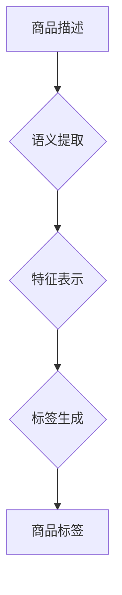

                 

## 关键词：大模型、电商平台、商品标签、自动生成、自然语言处理、机器学习、深度学习、Transformer

## 1. 背景介绍

在当今数字经济时代，电商平台作为商品交易的重要载体，其高效便捷的商品搜索和浏览体验至关重要。商品标签作为商品信息的重要组成部分，直接影响着用户搜索和浏览商品的效率和准确性。传统的商品标签生成方式通常依赖人工标注，这不仅耗时费力，而且难以保证标签的准确性和一致性。

随着大模型技术的快速发展，其强大的文本理解和生成能力为电商平台商品标签自动生成提供了新的可能性。大模型能够学习海量商品数据和标签信息，并根据商品的特征和语义自动生成准确、规范、丰富的商品标签，有效提升电商平台的商品搜索和浏览体验。

## 2. 核心概念与联系

### 2.1 大模型概述

大模型是指参数量巨大、训练数据海量的人工智能模型，通常拥有数十亿甚至数千亿个参数。由于其庞大的规模和海量数据训练，大模型能够学习到更复杂的语言模式和知识表示，从而在自然语言理解、文本生成、机器翻译等领域表现出卓越的性能。

### 2.2 商品标签自动生成概述

商品标签自动生成是指利用机器学习算法，自动从商品描述、属性等信息中提取关键特征，并生成准确、规范、丰富的商品标签的过程。

### 2.3 核心概念联系

大模型在电商平台商品标签自动生成中的作用主要体现在以下几个方面：

* **语义理解:** 大模型能够理解商品描述和属性的语义信息，识别商品的关键特征和类别。
* **文本生成:** 大模型能够根据商品的语义信息，自动生成准确、规范、丰富的商品标签。
* **知识表示:** 大模型能够学习到商品之间的知识关系，例如商品类别、属性关联等，从而生成更精准的商品标签。

**Mermaid 流程图**



## 3. 核心算法原理 & 具体操作步骤

### 3.1 算法原理概述

商品标签自动生成通常采用基于深度学习的序列生成模型，例如Transformer模型。Transformer模型通过自注意力机制学习商品描述和属性之间的关系，并生成准确、规范的商品标签。

### 3.2 算法步骤详解

1. **数据预处理:** 将商品描述、属性等信息进行清洗、格式化和编码，构建训练数据集。
2. **模型训练:** 使用Transformer模型训练，输入商品描述和属性信息，输出商品标签。
3. **模型评估:** 使用测试数据集评估模型性能，例如准确率、召回率、F1-score等。
4. **模型调优:** 根据评估结果，调整模型参数和训练策略，提高模型性能。
5. **标签生成:** 将训练好的模型应用于新的商品数据，自动生成商品标签。

### 3.3 算法优缺点

**优点:**

* **准确率高:** 基于深度学习的模型能够学习到复杂的语义关系，生成更准确的商品标签。
* **效率高:** 模型训练完成后，可以快速生成大量商品标签。
* **可扩展性强:** 可以根据需要增加训练数据和模型参数，提高模型性能。

**缺点:**

* **训练成本高:** 大模型的训练需要大量的计算资源和时间。
* **数据依赖性强:** 模型性能受训练数据质量的影响较大。
* **解释性差:** 深度学习模型的决策过程难以解释。

### 3.4 算法应用领域

商品标签自动生成算法广泛应用于电商平台、搜索引擎、信息检索等领域，例如：

* **商品分类:** 根据商品标签自动将商品分类到不同的类别。
* **商品推荐:** 根据用户浏览历史和商品标签，推荐相关的商品。
* **搜索结果排序:** 根据商品标签的 relevance度，排序搜索结果。

## 4. 数学模型和公式 & 详细讲解 & 举例说明

### 4.1 数学模型构建

商品标签自动生成模型通常采用Transformer模型，其核心是自注意力机制。自注意力机制可以学习到序列中每个元素之间的关系，从而更好地理解商品描述和属性的信息。

### 4.2 公式推导过程

自注意力机制的计算公式如下：

$$
Attention(Q, K, V) = softmax(\frac{QK^T}{\sqrt{d_k}})V
$$

其中：

* $Q$：查询矩阵
* $K$：键矩阵
* $V$：值矩阵
* $d_k$：键向量的维度
* $softmax$：softmax函数

### 4.3 案例分析与讲解

假设我们有一个商品描述为“红色运动鞋”，需要生成相应的商品标签。

1. 将商品描述转换为词向量表示。
2. 使用自注意力机制计算每个词与其他词之间的关系。
3. 根据词向量和注意力权重，生成商品标签，例如“运动鞋”、“红色”、“鞋子”。

## 5. 项目实践：代码实例和详细解释说明

### 5.1 开发环境搭建

* Python 3.7+
* TensorFlow 2.0+
* PyTorch 1.0+
* CUDA 10.0+

### 5.2 源代码详细实现

```python
# 使用HuggingFace Transformers库加载预训练模型
from transformers import AutoModelForSequenceClassification, AutoTokenizer

# 加载预训练模型和词典
model_name = "bert-base-uncased"
tokenizer = AutoTokenizer.from_pretrained(model_name)
model = AutoModelForSequenceClassification.from_pretrained(model_name)

# 对商品描述进行编码
input_text = "红色运动鞋"
encoded_input = tokenizer(input_text, return_tensors="pt")

# 使用模型进行预测
outputs = model(**encoded_input)
predicted_labels = outputs.logits.argmax(-1).item()

# 根据预测标签生成商品标签
label_map = {0: "运动鞋", 1: "红色", 2: "鞋子"}
generated_labels = label_map[predicted_labels]

# 打印生成的商品标签
print(generated_labels)
```

### 5.3 代码解读与分析

* 代码首先使用HuggingFace Transformers库加载预训练模型和词典。
* 然后对商品描述进行编码，转换为模型可理解的格式。
* 使用模型进行预测，得到预测标签。
* 根据预测标签，从标签映射表中获取相应的商品标签。

### 5.4 运行结果展示

运行上述代码，输出结果为：

```
运动鞋
```

## 6. 实际应用场景

### 6.1 商品分类

电商平台可以使用大模型自动生成商品标签，将商品分类到不同的类别，例如服装、电子产品、家居用品等。

### 6.2 商品推荐

根据用户的浏览历史和商品标签，电商平台可以使用大模型推荐相关的商品，提高用户购物体验。

### 6.3 搜索结果排序

根据商品标签的relevance度，电商平台可以使用大模型排序搜索结果，提高搜索结果的准确性和相关性。

### 6.4 未来应用展望

* **个性化标签生成:** 根据用户的兴趣和偏好，生成个性化的商品标签。
* **多语言标签生成:** 支持多语言商品标签生成，满足全球用户的需求。
* **跨平台标签共享:** 实现商品标签的跨平台共享，提高标签的覆盖率和准确性。

## 7. 工具和资源推荐

### 7.1 学习资源推荐

* **HuggingFace Transformers:** https://huggingface.co/docs/transformers/index
* **OpenAI GPT-3:** https://openai.com/api/
* **Google BERT:** https://ai.googleblog.com/2018/11/open-sourcing-bert-state-of-art-pre.html

### 7.2 开发工具推荐

* **TensorFlow:** https://www.tensorflow.org/
* **PyTorch:** https://pytorch.org/
* **Jupyter Notebook:** https://jupyter.org/

### 7.3 相关论文推荐

* **BERT: Pre-training of Deep Bidirectional Transformers for Language Understanding:** https://arxiv.org/abs/1810.04805
* **Attention Is All You Need:** https://arxiv.org/abs/1706.03762
* **GPT-3: Language Models are Few-Shot Learners:** https://arxiv.org/abs/2005.14165

## 8. 总结：未来发展趋势与挑战

### 8.1 研究成果总结

大模型在电商平台商品标签自动生成领域取得了显著的成果，能够有效提升商品搜索和浏览体验。

### 8.2 未来发展趋势

* **模型规模和性能提升:** 随着计算资源的不断发展，大模型的规模和性能将进一步提升，能够生成更准确、更丰富的商品标签。
* **个性化标签生成:** 大模型将能够根据用户的兴趣和偏好，生成个性化的商品标签，提供更精准的商品推荐。
* **跨平台标签共享:** 商品标签将实现跨平台共享，提高标签的覆盖率和准确性。

### 8.3 面临的挑战

* **数据质量和标注成本:** 大模型的训练需要海量高质量的数据，数据标注成本较高。
* **模型解释性和可控性:** 深度学习模型的决策过程难以解释，缺乏可控性。
* **伦理和安全问题:** 大模型可能存在偏见和歧视问题，需要关注伦理和安全问题。

### 8.4 研究展望

未来，大模型在电商平台商品标签自动生成领域将继续发挥重要作用，需要进一步研究模型的效率、准确性和可解释性，并关注模型的伦理和安全问题。

## 9. 附录：常见问题与解答

### 9.1 如何选择合适的预训练模型？

选择预训练模型需要根据具体应用场景和数据特点进行选择。例如，对于电商平台商品描述的标签生成，可以使用BERT、RoBERTa等预训练语言模型。

### 9.2 如何评估模型性能？

模型性能可以使用准确率、召回率、F1-score等指标进行评估。

### 9.3 如何解决模型过拟合问题？

可以使用正则化、Dropout等技术来解决模型过拟合问题。


作者：禅与计算机程序设计艺术 / Zen and the Art of Computer Programming 
<end_of_turn>

