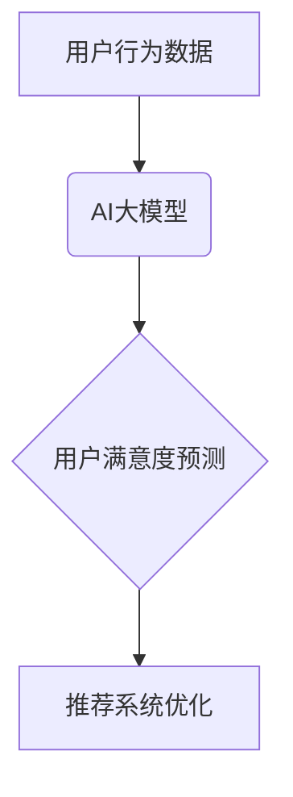

                 

## 推荐系统中AI大模型的用户满意度预测

> 关键词：推荐系统、AI大模型、用户满意度预测、机器学习、深度学习、自然语言处理、用户行为分析

## 1. 背景介绍

推荐系统作为互联网时代的重要技术之一，在电商、社交媒体、视频平台等领域发挥着越来越重要的作用。传统的推荐系统主要依赖于协同过滤、内容过滤等方法，但随着用户行为数据的爆炸式增长和推荐场景的多样化，传统的推荐算法逐渐难以满足用户的个性化需求。

近年来，人工智能大模型（AI Large Models）的快速发展为推荐系统带来了新的机遇。AI大模型，例如Transformer、BERT等，拥有强大的语义理解和文本生成能力，能够从海量用户数据中挖掘更深层的用户偏好和需求，从而提供更精准、更个性化的推荐结果。

然而，仅仅提供精准的推荐结果并不能保证用户满意度。用户对推荐结果的满意度受到多种因素的影响，例如推荐结果的准确性、相关性、新颖性、时效性等。因此，如何利用AI大模型预测用户对推荐结果的满意度，并根据预测结果进行动态调整和优化，成为推荐系统研究的热点问题。

## 2. 核心概念与联系

**2.1 推荐系统与用户满意度**

推荐系统旨在根据用户的历史行为、偏好和上下文信息，预测用户可能感兴趣的内容，并将其推荐给用户。用户满意度则是用户对推荐结果的整体评价，它反映了推荐系统是否能够满足用户的需求和期望。

**2.2 AI大模型与用户满意度预测**

AI大模型能够从海量用户数据中学习用户行为模式和偏好，并将其用于预测用户对推荐结果的满意度。例如，可以利用AI大模型分析用户的浏览历史、购买记录、评论内容等数据，识别用户的兴趣爱好、需求特征和评价标准，从而更准确地预测用户对推荐结果的满意度。

**2.3 核心概念架构**



## 3. 核心算法原理 & 具体操作步骤

**3.1 算法原理概述**

用户满意度预测算法通常基于机器学习或深度学习技术，通过训练模型来学习用户行为数据与用户满意度之间的关系。常见的算法包括：

* **线性回归:**  一种简单的监督学习算法，用于预测连续型变量，例如用户对推荐结果的评分。
* **逻辑回归:**  一种用于分类问题的监督学习算法，可以预测用户是否会点击、购买或评价推荐结果。
* **支持向量机 (SVM):**  一种强大的分类算法，可以处理高维数据，并具有良好的泛化能力。
* **决策树:**  一种树形结构的分类算法，可以直观地展示决策规则。
* **随机森林:**  一种基于多个决策树的集成学习算法，可以提高预测精度。
* **深度神经网络:**  一种更复杂的机器学习算法，可以学习更深层的用户行为特征和模式。

**3.2 算法步骤详解**

1. **数据收集和预处理:** 收集用户行为数据，例如浏览历史、购买记录、评论内容等，并进行清洗、转换和特征工程，以便于模型训练。
2. **模型选择和训练:** 根据具体任务和数据特点选择合适的算法，并使用训练数据训练模型。
3. **模型评估和调参:** 使用测试数据评估模型的性能，并根据评估结果调整模型参数，以提高预测精度。
4. **模型部署和应用:** 将训练好的模型部署到推荐系统中，并根据预测结果进行推荐结果的排序、过滤和个性化调整。

**3.3 算法优缺点**

不同的算法具有不同的优缺点，需要根据具体应用场景选择合适的算法。

* **线性回归:**  简单易懂，训练速度快，但对非线性关系的捕捉能力有限。
* **逻辑回归:**  适用于二分类问题，但对多分类问题效果较差。
* **SVM:**  具有良好的泛化能力，但训练时间较长，参数选择较为复杂。
* **决策树:**  易于理解和解释，但容易过拟合。
* **随机森林:**  集成多个决策树，可以提高预测精度，但训练时间较长。
* **深度神经网络:**  可以学习更深层的特征，但训练时间较长，参数选择较为复杂，需要大量的训练数据。

**3.4 算法应用领域**

用户满意度预测算法广泛应用于各种推荐系统，例如：

* **电商推荐:**  预测用户对商品的购买意愿，提高商品推荐的准确性和转化率。
* **视频推荐:**  预测用户对视频的观看兴趣，提高视频推荐的个性化和用户粘性。
* **音乐推荐:**  预测用户对音乐的喜好，提高音乐推荐的精准度和用户体验。
* **新闻推荐:**  预测用户对新闻的阅读兴趣，提高新闻推荐的时效性和用户参与度。

## 4. 数学模型和公式 & 详细讲解 & 举例说明

**4.1 数学模型构建**

用户满意度预测模型通常可以表示为一个回归问题，即预测用户对推荐结果的评分或点击概率。假设用户 $u$ 对推荐结果 $i$ 的评分为 $r_{ui}$，则可以构建以下线性回归模型：

$$r_{ui} = \beta_0 + \beta_1 x_{u1} + \beta_2 x_{u2} + ... + \beta_n x_{un} + \epsilon$$

其中：

* $r_{ui}$: 用户 $u$ 对推荐结果 $i$ 的评分
* $\beta_0$: 截距项
* $\beta_1, \beta_2, ..., \beta_n$: 模型参数
* $x_{u1}, x_{u2}, ..., x_{un}$: 用户 $u$ 的特征向量，例如用户年龄、性别、浏览历史、购买记录等
* $\epsilon$: 误差项

**4.2 公式推导过程**

模型参数 $\beta_0, \beta_1, ..., \beta_n$ 可以通过最小二乘法进行估计，即最小化模型预测值与实际评分之间的平方误差。

**4.3 案例分析与讲解**

假设我们想要预测用户对电影的评分，可以将用户的年龄、性别、观看过的电影类型等作为特征，并训练一个线性回归模型。

例如，如果模型参数估计为：

* $\beta_0 = 3$
* $\beta_1 = 0.5$ (年龄特征)
* $\beta_2 = 1$ (性别特征，女性为1，男性为0)

则对于一个30岁女性用户，如果她观看过的电影类型为动作片，则模型预测的评分为：

$$r_{ui} = 3 + 0.5 * 30 + 1 = 18$$

## 5. 项目实践：代码实例和详细解释说明

**5.1 开发环境搭建**

* Python 3.6+
* TensorFlow/PyTorch
* scikit-learn

**5.2 源代码详细实现**

```python
import pandas as pd
from sklearn.model_selection import train_test_split
from sklearn.linear_model import LinearRegression
from sklearn.metrics import mean_squared_error

# 加载用户行为数据
data = pd.read_csv('user_behavior.csv')

# 特征工程
data['age'] = data['age'].astype(int)
data['gender'] = data['gender'].astype(int)

# 划分训练集和测试集
X = data[['age', 'gender']]
y = data['rating']
X_train, X_test, y_train, y_test = train_test_split(X, y, test_size=0.2, random_state=42)

# 创建线性回归模型
model = LinearRegression()

# 训练模型
model.fit(X_train, y_train)

# 预测测试集结果
y_pred = model.predict(X_test)

# 评估模型性能
mse = mean_squared_error(y_test, y_pred)
print('Mean Squared Error:', mse)
```

**5.3 代码解读与分析**

* 代码首先加载用户行为数据，并进行特征工程，将年龄和性别特征转换为整数类型。
* 然后使用 `train_test_split` 函数将数据划分成训练集和测试集。
* 创建一个线性回归模型，并使用 `fit` 方法训练模型。
* 使用训练好的模型预测测试集结果，并使用 `mean_squared_error` 函数评估模型性能。

**5.4 运行结果展示**

运行代码后，会输出测试集的均方误差值，该值越小，模型的预测精度越高。

## 6. 实际应用场景

**6.1 电商推荐**

在电商平台，用户满意度预测可以用于优化商品推荐结果。例如，可以根据用户的浏览历史、购买记录和评价内容，预测用户对特定商品的购买意愿，并将其推荐给用户。

**6.2 视频推荐**

在视频平台，用户满意度预测可以用于提高视频推荐的个性化和用户粘性。例如，可以根据用户的观看历史、点赞记录和评论内容，预测用户对特定视频的观看兴趣，并将其推荐给用户。

**6.3 音乐推荐**

在音乐平台，用户满意度预测可以用于提高音乐推荐的精准度和用户体验。例如，可以根据用户的播放历史、收藏记录和评论内容，预测用户对特定音乐的喜好，并将其推荐给用户。

**6.4 未来应用展望**

随着AI大模型技术的不断发展，用户满意度预测算法将更加精准、更加个性化。未来，用户满意度预测将应用于更多场景，例如：

* **新闻推荐:**  预测用户对新闻的阅读兴趣，提高新闻推荐的时效性和用户参与度。
* **教育推荐:**  预测用户对课程的学习兴趣，提高教育资源的匹配度和学习效果。
* **医疗推荐:**  预测用户对医疗服务的需求，提高医疗资源的分配效率和患者体验。

## 7. 工具和资源推荐

**7.1 学习资源推荐**

* **书籍:**
    * 《深度学习》 by Ian Goodfellow, Yoshua Bengio, and Aaron Courville
    * 《机器学习》 by Tom Mitchell
* **在线课程:**
    * Coursera: Machine Learning by Andrew Ng
    * Udacity: Deep Learning Nanodegree
* **博客和网站:**
    * Towards Data Science
    * Machine Learning Mastery

**7.2 开发工具推荐**

* **Python:**  一个开源的编程语言，广泛应用于机器学习和深度学习领域。
* **TensorFlow:**  一个开源的机器学习框架，支持多种深度学习模型的训练和部署。
* **PyTorch:**  另一个开源的机器学习框架，以其灵活性和易用性而闻名。
* **scikit-learn:**  一个用于机器学习的Python库，提供多种算法和工具。

**7.3 相关论文推荐**

* **BERT: Pre-training of Deep Bidirectional Transformers for Language Understanding**
* **Attention Is All You Need**
* **Recurrent Neural Networks for Sequence Learning**

## 8. 总结：未来发展趋势与挑战

**8.1 研究成果总结**

近年来，AI大模型在用户满意度预测领域取得了显著的成果，能够更准确地预测用户对推荐结果的满意度，并根据预测结果进行动态调整和优化，从而提高推荐系统的性能和用户体验。

**8.2 未来发展趋势**

* **模型复杂度提升:**  未来，用户满意度预测模型将更加复杂，例如利用Transformer等更强大的模型架构，并结合多模态数据，例如文本、图像、音频等，以更全面地理解用户的需求和偏好。
* **个性化程度增强:**  未来，用户满意度预测将更加个性化，例如根据用户的实时状态、上下文信息和行为模式，动态调整推荐结果，以提供更精准、更符合用户当前需求的推荐。
* **解释性增强:**  未来，用户满意度预测模型将更加可解释，例如通过可视化技术或其他方法，解释模型的预测结果，帮助用户理解推荐系统的决策过程。

**8.3 面临的挑战**

* **数据质量:**  用户满意度预测算法依赖于高质量的用户行为数据，而现实中用户行为数据往往存在噪声、缺失和不完整等问题，需要进行有效的数据清洗和处理。
* **模型训练成本:**  训练复杂的AI大模型需要大量的计算资源和时间，这对于一些资源有限的机构或个人来说是一个挑战。
* **伦理问题:**  用户满意度预测算法可能会被用于操纵用户行为，例如通过推荐更具吸引力的内容，从而引导用户做出特定的决策。因此，需要关注算法的伦理问题，并制定相应的规范和制度。

**8.4 研究展望**

未来，用户满意度预测领域将继续朝着更精准、更个性化、更可解释的方向发展。研究者将继续探索新的算法、模型和技术，以解决上述挑战，并推动用户满意度预测技术的应用和发展。

## 9. 附录：常见问题与解答

**9.1 如何选择合适的用户满意度预测算法？**

选择合适的算法需要根据具体应用场景和数据特点进行考虑。例如，对于简单的二分类问题，逻辑回归是一个不错的选择；对于更复杂的回归问题，可以考虑使用深度神经网络。

**9.2 如何处理用户行为数据中的噪声和缺失？**

可以采用多种方法处理用户行为数据中的噪声和缺失，例如：

* **数据清洗:**  删除明显错误的数据，例如重复数据、异常值等。
* **数据填充:**  使用平均值、中位数或其他方法填充缺失数据。
* **数据降维:**  使用主成分分析等方法降低数据维度，减少噪声的影响。

**9.3 如何评估用户满意度预测模型的性能？**

常用的评估指标包括均方误差 (MSE)、平均绝对误差 (MAE) 和 R-squared 等。

**9.4 如何提高用户满意度预测模型的解释性？**

可以使用可视化技术或其他方法解释模型的预测结果，例如：

* **特征重要性分析:**  分析哪些特征对模型预测结果影响最大。
* **决策边界可视化:**  可视化模型的决策边界，帮助用户理解模型的决策规则。


作者：禅与计算机程序设计艺术 / Zen and the Art of Computer Programming<end_of_turn>

