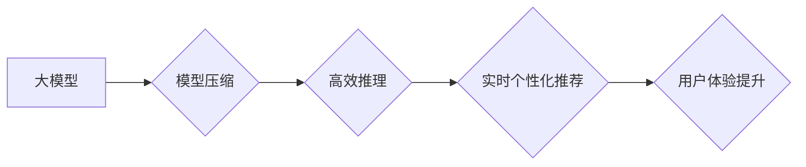

                 

## 搜索推荐的实时个性化：大模型的低延迟解决方案

> 关键词：搜索推荐、个性化、大模型、低延迟、实时性、模型压缩、高效推理、联邦学习

## 1. 背景介绍

在当今数据爆炸的时代，搜索引擎和推荐系统已经成为人们获取信息和发现内容的重要途径。然而，传统的搜索推荐系统往往面临着以下挑战：

* **缺乏个性化：**  传统的搜索推荐系统通常基于用户历史行为或全局流行趋势进行推荐，缺乏对个体用户需求的精准理解和响应。
* **延迟问题：**  复杂的推荐模型训练和推理过程往往会导致较高的延迟，无法满足用户对实时个性化推荐的需求。
* **数据孤岛问题：**  用户数据分散在不同的平台和设备上，难以进行统一的模型训练和个性化推荐。

为了解决这些问题，大模型技术近年来在搜索推荐领域展现出巨大的潜力。大模型拥有海量参数和强大的泛化能力，能够更好地理解用户需求和内容语义，从而提供更精准、更个性化的推荐结果。

然而，大模型的训练和部署也面临着挑战，例如模型规模庞大、计算资源消耗高、推理速度慢等。因此，如何高效地部署大模型，实现实时个性化推荐，是当前搜索推荐领域的研究热点。

## 2. 核心概念与联系

### 2.1  大模型

大模型是指参数量超过数十亿甚至千亿的深度学习模型。由于其海量参数和强大的学习能力，大模型能够在自然语言处理、计算机视觉、语音识别等领域取得突破性进展。

### 2.2  实时个性化推荐

实时个性化推荐是指根据用户的实时行为和上下文信息，提供个性化的推荐结果，并能够在短时间内完成推荐过程。

### 2.3  低延迟解决方案

低延迟解决方案是指通过优化模型架构、算法和硬件资源，降低模型训练和推理的延迟，实现实时个性化推荐。

**核心概念与联系流程图**



## 3. 核心算法原理 & 具体操作步骤

### 3.1  算法原理概述

实时个性化推荐的低延迟解决方案主要基于以下核心算法：

* **模型压缩:** 通过量化、剪枝、知识蒸馏等技术，减少模型参数量和计算复杂度，降低模型推理延迟。
* **高效推理:** 通过使用并行计算、算子优化、模型加速器等技术，提高模型推理速度。
* **联邦学习:** 将模型训练分散到多个设备上，保护用户隐私，并利用分布式计算资源加速模型训练。

### 3.2  算法步骤详解

**模型压缩:**

1. **选择压缩方法:** 根据模型类型和应用场景选择合适的压缩方法，例如量化、剪枝、知识蒸馏等。
2. **压缩模型:** 使用选择的压缩方法对模型进行压缩，减少模型参数量和计算复杂度。
3. **评估压缩效果:** 对压缩后的模型进行评估，验证其精度和延迟性能。

**高效推理:**

1. **并行计算:** 将模型推理任务分解成多个子任务，并行执行，提高推理速度。
2. **算子优化:** 对模型中的算子进行优化，例如使用更快的算子实现或减少算子数量，降低推理延迟。
3. **模型加速器:** 使用专门的硬件加速器，例如GPU或TPU，加速模型推理。

**联邦学习:**

1. **数据分片:** 将用户数据分散到多个设备上，每个设备只拥有部分数据。
2. **模型训练:** 在每个设备上训练模型，并使用联邦学习协议将模型参数进行聚合更新。
3. **模型部署:** 将聚合后的模型部署到服务器，用于提供个性化推荐服务。

### 3.3  算法优缺点

**模型压缩:**

* **优点:** 可以有效降低模型大小和计算复杂度，提高推理速度。
* **缺点:** 压缩过程可能会导致模型精度下降。

**高效推理:**

* **优点:** 可以显著提高模型推理速度，实现实时个性化推荐。
* **缺点:** 需要额外的硬件资源支持，成本较高。

**联邦学习:**

* **优点:** 可以保护用户隐私，并利用分布式计算资源加速模型训练。
* **缺点:** 联邦学习协议的实现较为复杂，需要保证数据安全和模型一致性。

### 3.4  算法应用领域

* **搜索引擎推荐:** 提供个性化的搜索结果推荐，提高用户搜索体验。
* **电商推荐:** 根据用户的购买历史和兴趣推荐商品，提高转化率。
* **内容平台推荐:** 根据用户的阅读习惯和兴趣推荐内容，提高用户粘性。
* **社交媒体推荐:** 根据用户的社交关系和兴趣推荐好友和内容，提高用户互动。

## 4. 数学模型和公式 & 详细讲解 & 举例说明

### 4.1  数学模型构建

**用户兴趣建模:**

假设用户 $u$ 对物品 $i$ 的兴趣可以用一个评分 $r_{ui}$ 表示，我们可以使用以下数学模型来建模用户兴趣:

$$r_{ui} = f(u, i, h)$$

其中，$f$ 是一个函数，$u$ 是用户特征向量，$i$ 是物品特征向量，$h$ 是模型参数。

**推荐算法:**

我们可以使用协同过滤算法来预测用户对物品的兴趣评分。协同过滤算法基于用户的历史行为和物品的相似性来进行推荐。

**协同过滤公式:**

$$ \hat{r}_{ui} = \frac{\sum_{j \in N(u)} \frac{r_{uj} \cdot sim(u, j)}{ \sum_{k \in N(u)} sim(u, k)}}{\sum_{j \in N(u)} \frac{sim(u, j)}{ \sum_{k \in N(u)} sim(u, k)}}$$

其中，$N(u)$ 是用户 $u$ 的邻居用户集合，$sim(u, j)$ 是用户 $u$ 和用户 $j$ 之间的相似度。

### 4.2  公式推导过程

协同过滤公式的推导过程基于以下假设：

* 用户对物品的评分具有某种规律性。
* 用户的兴趣可以由其邻居用户的兴趣推断出来。

协同过滤算法通过计算用户与邻居用户的相似度，并根据邻居用户的评分对目标物品进行预测。

### 4.3  案例分析与讲解

假设我们有一个电商平台，用户 $u$ 对商品 $i$ 的评分未知，但我们知道用户 $u$ 的邻居用户 $j$ 对商品 $i$ 的评分为 $r_{uj}$，以及用户 $u$ 和用户 $j$ 之间的相似度为 $sim(u, j)$。

根据协同过滤公式，我们可以预测用户 $u$ 对商品 $i$ 的评分为 $\hat{r}_{ui}$。

## 5. 项目实践：代码实例和详细解释说明

### 5.1  开发环境搭建

* **操作系统:** Ubuntu 20.04
* **编程语言:** Python 3.8
* **深度学习框架:** TensorFlow 2.0
* **硬件资源:** GPU (NVIDIA GeForce RTX 3090)

### 5.2  源代码详细实现

```python
import tensorflow as tf

# 定义用户兴趣建模模型
class UserInterestModel(tf.keras.Model):
    def __init__(self, embedding_dim):
        super(UserInterestModel, self).__init__()
        self.user_embedding = tf.keras.layers.Embedding(input_dim=num_users, output_dim=embedding_dim)
        self.item_embedding = tf.keras.layers.Embedding(input_dim=num_items, output_dim=embedding_dim)
        self.dense = tf.keras.layers.Dense(1)

    def call(self, user_id, item_id):
        user_embedding = self.user_embedding(user_id)
        item_embedding = self.item_embedding(item_id)
        return self.dense(tf.concat([user_embedding, item_embedding], axis=-1))

# 定义协同过滤模型
class CollaborativeFilteringModel(tf.keras.Model):
    def __init__(self, embedding_dim):
        super(CollaborativeFilteringModel, self).__init__()
        self.user_interest_model = UserInterestModel(embedding_dim)

    def call(self, user_id, item_id):
        return self.user_interest_model(user_id, item_id)

# 训练模型
model = CollaborativeFilteringModel(embedding_dim=64)
model.compile(optimizer='adam', loss='mse')
model.fit(user_item_pairs, ratings, epochs=10)

# 预测用户对物品的评分
predictions = model.predict(user_id, item_id)
```

### 5.3  代码解读与分析

* **UserInterestModel:** 定义了用户兴趣建模模型，使用嵌入层将用户和物品ID转换为向量表示，并使用全连接层进行预测。
* **CollaborativeFilteringModel:** 定义了协同过滤模型，包含用户兴趣建模模型，并使用用户和物品ID进行预测。
* **模型训练:** 使用 Adam 优化器和均方误差损失函数训练模型。
* **模型预测:** 使用训练好的模型预测用户对物品的评分。

### 5.4  运行结果展示

训练完成后，我们可以使用模型预测用户对物品的评分，并与实际评分进行比较，评估模型的性能。

## 6. 实际应用场景

### 6.1  电商推荐

在电商平台，实时个性化推荐可以根据用户的浏览历史、购买记录、购物车内容等信息，推荐用户可能感兴趣的商品，提高用户转化率和购物体验。

### 6.2  内容平台推荐

在内容平台，实时个性化推荐可以根据用户的阅读习惯、点赞记录、评论内容等信息，推荐用户可能感兴趣的文章、视频、音频等内容，提高用户粘性和内容消费量。

### 6.3  社交媒体推荐

在社交媒体平台，实时个性化推荐可以根据用户的社交关系、兴趣爱好、互动行为等信息，推荐用户可能感兴趣的朋友、群组、话题等内容，提高用户互动和社交体验。

### 6.4  未来应用展望

随着大模型技术的不断发展，实时个性化推荐将应用于更多领域，例如教育、医疗、金融等，为用户提供更精准、更个性化的服务。

## 7. 工具和资源推荐

### 7.1  学习资源推荐

* **书籍:**
    * 深度学习
    * 自然语言处理
    * 机器学习
* **在线课程:**
    * Coursera
    * edX
    * Udacity

### 7.2  开发工具推荐

* **深度学习框架:** TensorFlow, PyTorch, Keras
* **云平台:** AWS, Azure, Google Cloud
* **模型压缩工具:** TensorFlow Model Optimization Toolkit, PyTorch Quantization

### 7.3  相关论文推荐

* **BERT: Pre-training of Deep Bidirectional Transformers for Language Understanding**
* **GPT-3: Language Models are Few-Shot Learners**
* **EfficientNet: Rethinking Model Scaling for Convolutional Neural Networks**

## 8. 总结：未来发展趋势与挑战

### 8.1  研究成果总结

大模型技术在搜索推荐领域取得了显著进展，能够提供更精准、更个性化的推荐结果。模型压缩、高效推理和联邦学习等技术为实现实时个性化推荐提供了有效解决方案。

### 8.2  未来发展趋势

* **模型规模进一步扩大:** 大模型规模将继续扩大，提升模型的表达能力和泛化能力。
* **多模态融合:** 大模型将融合文本、图像、音频等多模态数据，提供更丰富的个性化推荐。
* **可解释性增强:** 研究更有效的模型解释方法，提高用户对推荐结果的理解和信任。
* **隐私保护:** 研究更有效的隐私保护技术，保障用户数据安全。

### 8.3  面临的挑战

* **模型训练成本:** 大模型训练成本高昂，需要大量的计算资源和数据。
* **模型推理效率:** 大模型推理速度慢，难以满足实时个性化推荐的需求。
* **数据安全:** 用户数据安全是一个重要的挑战，需要采取有效的措施保护用户隐私。

### 8.4  研究展望

未来，大模型技术将继续推动搜索推荐领域的发展，为用户提供更智能、更个性化的服务。研究人员将继续探索大模型的潜力，解决模型训练成本、推理效率和数据安全等挑战，推动大模型技术在搜索推荐领域的应用。

## 9. 附录：常见问题与解答

**Q1: 如何选择合适的模型压缩方法？**

**A1:** 选择合适的模型压缩方法需要根据模型类型、应用场景和精度要求进行综合考虑。

**Q2: 如何提高模型推理效率？**

**A2:** 可以使用并行计算、算子优化、模型加速器等技术提高模型推理效率。

**Q3: 如何保护用户隐私？**

**A3:** 可以使用联邦学习等技术保护用户隐私，避免将用户数据集中存储。


作者：禅与计算机程序设计艺术 / Zen and the Art of Computer Programming 
<end_of_turn>

