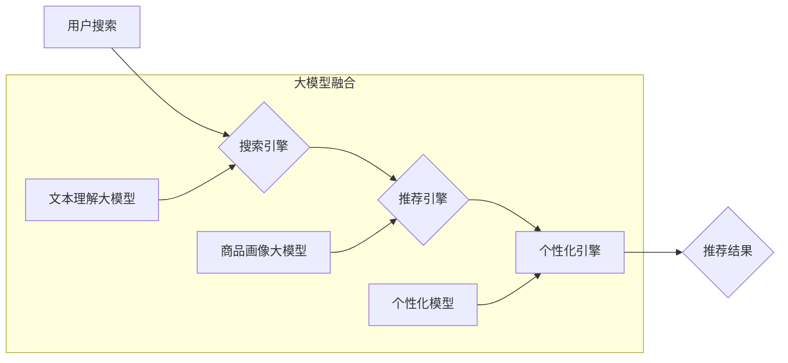

                 

## 1. 背景介绍

在当今数据爆炸的时代，电商平台面临着日益激烈的竞争。用户在海量商品中寻找所需产品，效率和体验成为关键。传统的搜索推荐系统，往往依赖于基于规则的算法和特征工程，难以捕捉用户细微需求和商品复杂关联。

近年来，人工智能（AI）技术蓬勃发展，特别是大模型的出现，为搜索推荐系统带来了革命性变革。大模型凭借其强大的学习能力和泛化能力，能够从海量数据中学习用户偏好、商品属性和潜在关系，从而提供更精准、个性化的推荐结果。

## 2. 核心概念与联系

### 2.1  搜索推荐系统

搜索推荐系统旨在帮助用户快速找到所需商品，并根据用户的兴趣和行为推荐相关商品。它通常由以下几个模块组成：

* **搜索引擎:** 处理用户搜索词，并返回相关商品列表。
* **推荐引擎:** 基于用户历史行为、商品属性等信息，推荐用户可能感兴趣的商品。
* **个性化引擎:** 根据用户的个人特征和偏好，对搜索结果和推荐结果进行个性化定制。

### 2.2  大模型

大模型是指参数量巨大的人工智能模型，通常拥有数十亿甚至数千亿个参数。它们通过大量的训练数据学习复杂的模式和关系，能够在自然语言处理、图像识别、语音合成等多个领域展现出强大的能力。

### 2.3  AI 大模型融合

AI 大模型融合是指将多个大模型组合在一起，发挥各自优势，实现更强大的功能。在搜索推荐系统中，可以将大模型用于搜索、推荐、个性化等各个模块，从而提升系统的整体性能。

**Mermaid 流程图**



## 3. 核心算法原理 & 具体操作步骤

### 3.1  算法原理概述

大模型融合在搜索推荐系统中的核心算法原理是基于深度学习和Transformer架构。

* **深度学习:** 通过多层神经网络学习数据特征，提取更深层次的语义信息。
* **Transformer架构:** 利用注意力机制，捕捉文本序列中的长距离依赖关系，提升模型的理解能力。

### 3.2  算法步骤详解

1. **数据预处理:** 收集用户搜索历史、商品信息、用户画像等数据，进行清洗、转换和特征工程。
2. **模型训练:** 使用深度学习框架（如TensorFlow、PyTorch）训练大模型，包括文本理解大模型、商品画像大模型和个性化模型。
3. **模型融合:** 将训练好的多个大模型组合在一起，形成一个完整的搜索推荐系统。
4. **线上部署:** 将融合后的模型部署到线上环境，实时处理用户请求，提供个性化推荐结果。

### 3.3  算法优缺点

**优点:**

* **精准度提升:** 大模型能够学习更复杂的模式和关系，提升推荐结果的精准度。
* **个性化增强:** 通过用户画像和行为分析，提供更个性化的推荐体验。
* **泛化能力强:** 大模型能够适应不同的数据分布和场景，具有较强的泛化能力。

**缺点:**

* **训练成本高:** 大模型训练需要大量的计算资源和时间。
* **模型复杂度高:** 大模型的结构复杂，调试和维护难度较大。
* **数据依赖性强:** 大模型的性能依赖于训练数据的质量和数量。

### 3.4  算法应用领域

大模型融合在搜索推荐系统中的应用领域非常广泛，包括：

* **电商平台:** 推荐商品、个性化商品展示、搜索结果优化。
* **内容平台:** 推荐文章、视频、音乐等内容。
* **社交平台:** 推荐好友、群组、话题等内容。
* **金融平台:** 推荐理财产品、贷款服务等。

## 4. 数学模型和公式 & 详细讲解 & 举例说明

### 4.1  数学模型构建

在搜索推荐系统中，常用的数学模型包括协同过滤模型、内容基模型和混合模型。

* **协同过滤模型:** 基于用户-商品交互数据，预测用户对商品的评分或偏好。
* **内容基模型:** 基于商品的属性和描述信息，预测用户对商品的兴趣。
* **混合模型:** 将协同过滤模型和内容基模型结合起来，利用两者优势，提升推荐效果。

### 4.2  公式推导过程

协同过滤模型中常用的公式是基于矩阵分解的，例如：

$$
R = U V^T
$$

其中：

* $R$ 是用户-商品评分矩阵。
* $U$ 是用户特征矩阵。
* $V$ 是商品特征矩阵。

通过最小化预测误差，学习用户和商品的特征向量，从而预测用户对商品的评分。

### 4.3  案例分析与讲解

假设有一个电商平台，用户购买了以下商品：

* 用户 A: 商品 1, 商品 3
* 用户 B: 商品 2, 商品 3
* 用户 C: 商品 1, 商品 2, 商品 4

可以使用协同过滤模型学习用户和商品的特征，预测用户对其他商品的兴趣。例如，可以预测用户 A 是否会喜欢商品 2。

## 5. 项目实践：代码实例和详细解释说明

### 5.1  开发环境搭建

* Python 3.x
* TensorFlow 或 PyTorch
* Jupyter Notebook

### 5.2  源代码详细实现

```python
# 导入必要的库
import tensorflow as tf

# 定义用户-商品评分矩阵
ratings = tf.constant([[5, 0, 3],
                      [0, 4, 2],
                      [3, 2, 5]])

# 定义用户和商品的特征维度
user_dim = 2
item_dim = 2

# 创建用户和商品特征矩阵
user_embeddings = tf.Variable(tf.random.normal([3, user_dim]))
item_embeddings = tf.Variable(tf.random.normal([3, item_dim]))

# 计算预测评分
predictions = tf.matmul(user_embeddings, tf.transpose(item_embeddings))

# 损失函数
loss = tf.reduce_mean(tf.square(predictions - ratings))

# 优化器
optimizer = tf.keras.optimizers.Adam()

# 训练模型
for epoch in range(100):
    with tf.GradientTape() as tape:
        loss_value = loss
    gradients = tape.gradient(loss_value, [user_embeddings, item_embeddings])
    optimizer.apply_gradients(zip(gradients, [user_embeddings, item_embeddings]))

# 打印预测结果
print(predictions)
```

### 5.3  代码解读与分析

* 代码首先定义了用户-商品评分矩阵和用户、商品特征维度。
* 然后创建了用户和商品特征矩阵，并使用矩阵乘法计算预测评分。
* 损失函数采用均方误差，优化器使用Adam优化器。
* 最后，训练模型并打印预测结果。

### 5.4  运行结果展示

运行代码后，会输出预测评分矩阵，其中每个元素代表模型预测的用户对商品的评分。

## 6. 实际应用场景

### 6.1  电商平台推荐

大模型融合在电商平台的应用场景非常广泛，例如：

* **商品推荐:** 根据用户的历史购买记录、浏览记录和兴趣偏好，推荐相关商品。
* **个性化商品展示:** 根据用户的个人特征和行为，个性化展示商品，提升用户体验。
* **搜索结果优化:** 利用大模型理解用户搜索意图，优化搜索结果排名，提升用户搜索效率。

### 6.2  内容平台推荐

大模型融合在内容平台的应用场景包括：

* **文章推荐:** 根据用户的阅读历史、点赞记录和评论内容，推荐相关文章。
* **视频推荐:** 根据用户的观看历史、点赞记录和评论内容，推荐相关视频。
* **音乐推荐:** 根据用户的播放历史、收藏记录和评论内容，推荐相关音乐。

### 6.3  社交平台推荐

大模型融合在社交平台的应用场景包括：

* **好友推荐:** 根据用户的兴趣爱好、社交关系和行为模式，推荐潜在好友。
* **群组推荐:** 根据用户的兴趣爱好、社交关系和行为模式，推荐相关群组。
* **话题推荐:** 根据用户的兴趣爱好、社交关系和行为模式，推荐相关话题。

### 6.4  未来应用展望

大模型融合在搜索推荐系统中的应用前景广阔，未来可能在以下方面得到进一步发展：

* **多模态融合:** 将文本、图像、音频等多模态数据融合，提升推荐系统的理解能力和推荐效果。
* **实时推荐:** 利用大模型的实时推理能力，实现实时个性化推荐，提升用户体验。
* **解释性推荐:** 增强大模型的解释性，让用户了解推荐结果背后的逻辑，提升用户信任度。

## 7. 工具和资源推荐

### 7.1  学习资源推荐

* **书籍:**
    * 《深度学习》
    * 《自然语言处理》
    * 《推荐系统》
* **在线课程:**
    * Coursera: 深度学习
    * Udacity: 自然语言处理
    * fast.ai: 深度学习
* **博客和论坛:**
    * TensorFlow Blog
    * PyTorch Blog
    * Kaggle

### 7.2  开发工具推荐

* **深度学习框架:** TensorFlow, PyTorch
* **数据处理工具:** Pandas, NumPy
* **云计算平台:** AWS, Azure, GCP

### 7.3  相关论文推荐

* 《BERT: Pre-training of Deep Bidirectional Transformers for Language Understanding》
* 《Attention Is All You Need》
* 《Collaborative Filtering for Implicit Feedback Datasets》

## 8. 总结：未来发展趋势与挑战

### 8.1  研究成果总结

大模型融合在搜索推荐系统中的应用取得了显著成果，提升了推荐精准度、个性化程度和用户体验。

### 8.2  未来发展趋势

未来，大模型融合在搜索推荐系统中的发展趋势包括：

* **多模态融合:** 将文本、图像、音频等多模态数据融合，提升推荐系统的理解能力和推荐效果。
* **实时推荐:** 利用大模型的实时推理能力，实现实时个性化推荐，提升用户体验。
* **解释性推荐:** 增强大模型的解释性，让用户了解推荐结果背后的逻辑，提升用户信任度。

### 8.3  面临的挑战

大模型融合在搜索推荐系统中的应用也面临着一些挑战：

* **训练成本高:** 大模型训练需要大量的计算资源和时间。
* **模型复杂度高:** 大模型的结构复杂，调试和维护难度较大。
* **数据依赖性强:** 大模型的性能依赖于训练数据的质量和数量。

### 8.4  研究展望

未来，需要进一步研究大模型融合的算法、模型架构和训练方法，降低训练成本，提升模型效率和解释性，从而更好地服务于搜索推荐系统的应用。

## 9. 附录：常见问题与解答

**问题 1:** 大模型融合的训练成本很高，如何降低成本？

**解答:** 可以采用以下方法降低大模型融合的训练成本：

* 使用更小的模型规模。
* 使用预训练模型，并进行微调。
* 使用分布式训练，将模型训练任务分摊到多个机器上。

**问题 2:** 大模型的解释性较差，如何提升解释性？

**解答:** 可以采用以下方法提升大模型的解释性：

* 使用可解释性模型，例如线性模型或决策树。
* 使用注意力机制，分析模型对输入数据的关注点。
* 使用反向传播算法，分析模型参数对输出的影响。


作者：禅与计算机程序设计艺术 / Zen and the Art of Computer Programming 
<end_of_turn>

