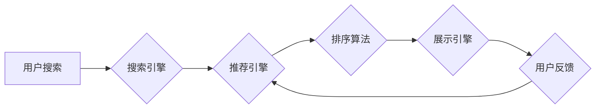

                 

## 1. 背景介绍

在当今数据爆炸的时代，电商平台面临着激烈的竞争。用户在海量商品中寻找所需产品，效率和精准度成为关键。搜索推荐系统作为电商平台的核心功能之一，直接影响着用户体验和商业转化率。传统的搜索推荐系统主要依赖于基于规则的算法和协同过滤等方法，但随着用户行为数据的复杂性和多样性增加，这些方法逐渐难以满足需求。

近年来，人工智能（AI）技术蓬勃发展，特别是大模型的出现，为搜索推荐系统的升级带来了新的机遇。大模型凭借其强大的学习能力和泛化能力，能够从海量数据中挖掘更深层的用户需求和商品关联，从而提供更精准、个性化的推荐结果。

## 2. 核心概念与联系

### 2.1 搜索推荐系统

搜索推荐系统旨在根据用户的搜索意图和历史行为，从海量商品中推荐最相关的产品。它通常由以下几个模块组成：

* **搜索引擎:** 处理用户搜索词，并返回相关商品列表。
* **推荐引擎:** 基于用户画像、商品特征和历史行为，推荐个性化的商品列表。
* **排序算法:** 对推荐结果进行排序，将最相关的商品排在前面。
* **展示引擎:** 将推荐结果以用户友好的方式展示给用户。

### 2.2 大模型

大模型是指参数规模庞大、训练数据海量的人工智能模型。它通常基于Transformer架构，能够学习到复杂的语言模式和语义关系。

### 2.3 AI 大模型融合

AI 大模型融合是指将大模型技术应用于搜索推荐系统，以提升推荐精准度、个性化程度和用户体验。

**Mermaid 流程图**



## 3. 核心算法原理 & 具体操作步骤

### 3.1 算法原理概述

AI 大模型融合在搜索推荐系统中主要采用以下几种算法：

* **BERT (Bidirectional Encoder Representations from Transformers):** 用于理解用户搜索词的语义和上下文信息，提升搜索结果的精准度。
* **GPT (Generative Pre-trained Transformer):** 用于生成个性化的商品描述和推荐文案，提升用户体验。
* **Transformer-based Recommender:** 基于Transformer架构，学习用户商品交互数据，进行个性化商品推荐。

### 3.2 算法步骤详解

以Transformer-based Recommender为例，其具体操作步骤如下：

1. **数据预处理:** 将用户商品交互数据转换为模型可理解的格式，例如用户ID、商品ID、评分等。
2. **模型训练:** 使用Transformer架构构建推荐模型，并利用海量用户商品交互数据进行训练。
3. **模型评估:** 使用测试数据评估模型的推荐效果，例如准确率、召回率等指标。
4. **模型部署:** 将训练好的模型部署到线上环境，用于实时推荐商品。

### 3.3 算法优缺点

**优点:**

* 能够学习到更深层的用户需求和商品关联。
* 推荐结果更精准、个性化。
* 提升用户体验和商业转化率。

**缺点:**

* 模型训练成本高，需要海量数据和计算资源。
* 模型解释性较差，难以理解模型的推荐决策。

### 3.4 算法应用领域

* **电商平台:** 个性化商品推荐、搜索结果优化。
* **内容平台:** 个性化内容推荐、用户兴趣挖掘。
* **社交媒体:** 个性化好友推荐、内容推荐。

## 4. 数学模型和公式 & 详细讲解 & 举例说明

### 4.1 数学模型构建

Transformer-based Recommender模型通常采用以下数学模型：

* **用户嵌入:** 将用户ID映射到低维向量空间，表示用户的兴趣和偏好。
* **商品嵌入:** 将商品ID映射到低维向量空间，表示商品的特征和属性。
* **注意力机制:** 计算用户和商品之间的相关性，权重不同的商品特征。
* **预测评分:** 使用用户和商品嵌入以及注意力机制的输出，预测用户对商品的评分。

### 4.2 公式推导过程

**用户嵌入:**

$$
u_i = W_u x_i
$$

其中，$u_i$ 是用户 $i$ 的嵌入向量，$x_i$ 是用户 $i$ 的ID，$W_u$ 是用户嵌入矩阵。

**商品嵌入:**

$$
v_j = W_v y_j
$$

其中，$v_j$ 是商品 $j$ 的嵌入向量，$y_j$ 是商品 $j$ 的ID，$W_v$ 是商品嵌入矩阵。

**注意力机制:**

$$
a_{ij} = \frac{exp(score(u_i, v_j))}{\sum_{k=1}^{N} exp(score(u_i, v_k))}
$$

其中，$a_{ij}$ 是用户 $i$ 对商品 $j$ 的注意力权重，$score(u_i, v_j)$ 是用户 $i$ 和商品 $j$ 之间的相似度得分。

**预测评分:**

$$
\hat{r}_{ij} = W_r \cdot (a_{ij} \cdot v_j) + b_r
$$

其中，$\hat{r}_{ij}$ 是模型预测的用户 $i$ 对商品 $j$ 的评分，$W_r$ 是评分预测矩阵，$b_r$ 是偏置项。

### 4.3 案例分析与讲解

假设用户 $A$ 对商品 $X$ 和 $Y$ 的评分分别为 5 和 4，模型预测用户 $A$ 对商品 $Z$ 的评分为 3.5。

通过分析注意力权重，可以发现用户 $A$ 对商品 $X$ 的注意力权重较高，说明用户 $A$ 对商品 $X$ 的兴趣更强。

## 5. 项目实践：代码实例和详细解释说明

### 5.1 开发环境搭建

* Python 3.7+
* TensorFlow 2.0+
* PyTorch 1.0+
* CUDA 10.0+

### 5.2 源代码详细实现

```python
import tensorflow as tf

# 定义用户嵌入层
user_embedding = tf.keras.layers.Embedding(input_dim=num_users, output_dim=embedding_dim)

# 定义商品嵌入层
item_embedding = tf.keras.layers.Embedding(input_dim=num_items, output_dim=embedding_dim)

# 定义注意力机制层
attention_layer = tf.keras.layers.MultiHeadAttention(num_heads=8, key_dim=embedding_dim)

# 定义评分预测层
prediction_layer = tf.keras.layers.Dense(1)

# 定义模型
model = tf.keras.Sequential([
    user_embedding,
    item_embedding,
    attention_layer,
    prediction_layer
])

# 编译模型
model.compile(optimizer='adam', loss='mse')

# 训练模型
model.fit(train_data, train_labels, epochs=10)

# 预测评分
predictions = model.predict(test_data)
```

### 5.3 代码解读与分析

* 用户嵌入层和商品嵌入层将用户ID和商品ID映射到低维向量空间。
* 注意力机制层计算用户和商品之间的相关性，权重不同的商品特征。
* 评分预测层使用用户和商品嵌入以及注意力机制的输出，预测用户对商品的评分。

### 5.4 运行结果展示

训练完成后，可以使用测试数据评估模型的推荐效果，例如准确率、召回率等指标。

## 6. 实际应用场景

### 6.1 电商平台

AI 大模型融合在电商平台的应用场景包括：

* **个性化商品推荐:** 根据用户的浏览历史、购买记录、兴趣偏好等信息，推荐个性化的商品列表。
* **搜索结果优化:** 理解用户搜索词的语义和上下文信息，提升搜索结果的精准度。
* **商品分类和标签:** 利用大模型学习商品特征，自动进行商品分类和标签标注。

### 6.2 内容平台

AI 大模型融合在内容平台的应用场景包括：

* **个性化内容推荐:** 根据用户的阅读历史、点赞记录、关注内容等信息，推荐个性化的内容列表。
* **内容生成:** 利用大模型生成个性化的文章、视频、音频等内容。
* **内容审核:** 利用大模型识别违规内容，进行内容审核和过滤。

### 6.3 社交媒体

AI 大模型融合在社交媒体的应用场景包括：

* **个性化好友推荐:** 根据用户的社交关系、兴趣偏好等信息，推荐潜在的好友。
* **内容推荐:** 根据用户的兴趣偏好和社交关系，推荐相关的帖子、图片、视频等内容。
* **用户画像构建:** 利用大模型分析用户的社交行为和兴趣偏好，构建用户画像。

### 6.4 未来应用展望

随着AI技术的不断发展，AI大模型融合在搜索推荐系统中的应用场景将更加广泛，例如：

* **多模态推荐:** 将文本、图像、视频等多模态数据融合，提供更丰富的推荐结果。
* **实时推荐:** 利用实时数据流，进行动态的推荐更新。
* **个性化营销:** 利用用户画像和推荐结果，进行精准的营销推广。

## 7. 工具和资源推荐

### 7.1 学习资源推荐

* **书籍:**
    * Deep Learning by Ian Goodfellow, Yoshua Bengio, and Aaron Courville
    * Natural Language Processing with Python by Steven Bird, Ewan Klein, and Edward Loper
* **在线课程:**
    * TensorFlow Tutorials: https://www.tensorflow.org/tutorials
    * PyTorch Tutorials: https://pytorch.org/tutorials/

### 7.2 开发工具推荐

* **TensorFlow:** https://www.tensorflow.org/
* **PyTorch:** https://pytorch.org/
* **Hugging Face Transformers:** https://huggingface.co/transformers/

### 7.3 相关论文推荐

* BERT: Pre-training of Deep Bidirectional Transformers for Language Understanding
* Transformer: Attention Is All You Need
* A Unified Framework for Recommendation Systems

## 8. 总结：未来发展趋势与挑战

### 8.1 研究成果总结

AI 大模型融合在搜索推荐系统中的应用取得了显著成果，能够提升推荐精准度、个性化程度和用户体验。

### 8.2 未来发展趋势

* **模型规模和能力的提升:** 大模型的规模和能力将不断提升，能够学习到更深层的用户需求和商品关联。
* **多模态融合:** 将文本、图像、视频等多模态数据融合，提供更丰富的推荐结果。
* **实时推荐:** 利用实时数据流，进行动态的推荐更新。

### 8.3 面临的挑战

* **模型训练成本:** 大模型的训练成本高，需要海量数据和计算资源。
* **模型解释性:** 大模型的决策过程难以理解，缺乏可解释性。
* **数据隐私:** 大模型的训练需要大量用户数据，如何保护用户隐私是一个重要挑战。

### 8.4 研究展望

未来研究方向包括：

* 开发更有效的训练方法，降低模型训练成本。
* 研究大模型的可解释性，提高模型的透明度和信任度。
* 开发隐私保护机制，保障用户数据安全。

## 9. 附录：常见问题与解答

* **Q1: AI 大模型融合的成本高吗？**

A1: AI 大模型融合的成本确实较高，需要海量数据和计算资源。但随着技术的进步和成本的下降，AI 大模型融合将变得更加普及。

* **Q2: AI 大模型融合的推荐结果是否准确？**

A2: AI 大模型融合的推荐结果通常比传统方法更准确，但准确度取决于模型的训练数据和模型本身的复杂度。

* **Q3: AI 大模型融合会侵犯用户隐私吗？**

A3: AI 大模型融合的训练需要大量用户数据，如何保护用户隐私是一个重要挑战。需要开发隐私保护机制，确保用户数据的安全和隐私。


作者：禅与计算机程序设计艺术 / Zen and the Art of Computer Programming 
<end_of_turn>

