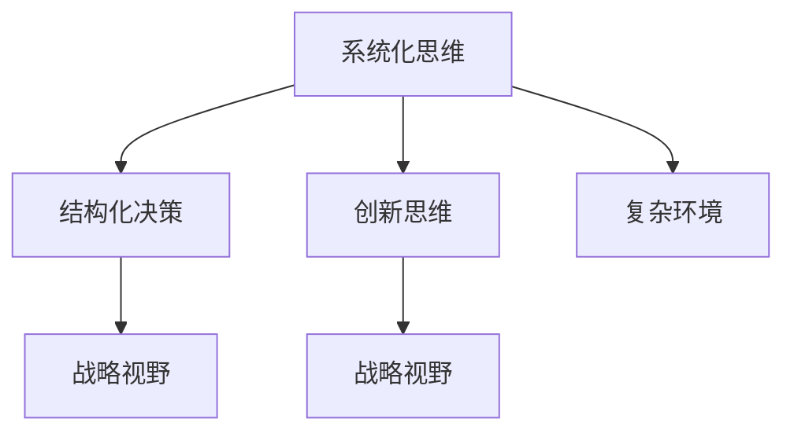

                 

# 思维体系对管理者战略视野的影响

在当今复杂多变的商业环境中，管理者如何形成清晰的战略视野，做出明智的决策，已成为企业成功与否的关键。本文将深入探讨思维体系对管理者战略视野的影响，并结合实例分析其在管理实践中的应用。

## 1. 背景介绍

### 1.1 问题由来

随着全球化和技术进步，市场竞争日益激烈，企业面临着复杂的战略挑战。传统的经验式决策方法已不再适用，管理者需要具备更加系统化、结构化的思维方式，才能在复杂多变的环境中制定正确的战略。

### 1.2 问题核心关键点

- **思维体系**：指管理者在决策过程中所依赖的思维模式和方法。
- **战略视野**：指管理者对企业内外环境的全局把握，以及在复杂环境中做出有效决策的能力。

## 2. 核心概念与联系

### 2.1 核心概念概述

- **系统化思维**：强调整体性、层次性和动态性，关注系统内部的相互作用和外部环境的影响。
- **结构化决策**：依据一定的框架和方法，系统地分析问题，形成决策方案。
- **创新思维**：鼓励打破常规，提出新观点、新方法，以适应快速变化的市场环境。

### 2.2 核心概念原理和架构的 Mermaid 流程图



该图展示了三个核心概念如何共同作用，影响管理者的战略视野。系统化思维提供了全局视角，结构化决策提供了分析框架，创新思维提供了适应变化的灵活性。

## 3. 核心算法原理 & 具体操作步骤

### 3.1 算法原理概述

管理者在制定战略时，通常会使用以下系统化思维方法：

- **SWOT分析**：分析企业的优势(S)、劣势(W)、机会(O)和威胁(T)，帮助管理者全面了解企业内外环境。
- **PEST分析**：从政治(Political)、经济(Economic)、社会(Social)、技术(Technological)四个维度，分析宏观环境变化对企业的影响。
- **波特五力模型**：分析供应商、买家、替代品、竞争者和潜在进入者的力量，评估行业的竞争态势。

### 3.2 算法步骤详解

管理者使用上述系统化思维方法的步骤如下：

1. **数据收集**：通过市场调研、行业报告、财务报表等方式，收集所需数据。
2. **分析诊断**：利用SWOT、PEST、波特五力模型等工具，进行数据整理和分析，识别出关键问题和机会。
3. **战略制定**：结合内外部环境分析结果，制定出有针对性的战略方案。
4. **实施监控**：在战略实施过程中，持续监控环境变化，及时调整战略。

### 3.3 算法优缺点

**优点**：
- **全面性**：系统化思维提供了全面的视角，考虑了企业内外多个维度的因素。
- **结构化**：结构化决策方法提供了一套科学严谨的流程，有助于规范化决策过程。
- **灵活性**：创新思维鼓励探索新思路和新方法，适应快速变化的市场环境。

**缺点**：
- **复杂性**：系统化思维和结构化决策方法步骤较多，需要较长的分析时间。
- **资源投入大**：收集数据、分析模型需要较多的人力和时间资源。
- **实施难度高**：战略实施过程中，环境变化复杂，需要灵活调整，难度较大。

### 3.4 算法应用领域

系统化思维和结构化决策方法广泛应用在以下领域：

- **企业战略规划**：制定企业长期发展战略。
- **市场营销**：分析市场机会，制定营销策略。
- **组织变革**：通过SWOT分析，推动组织结构和文化的变革。
- **风险管理**：评估和管理企业面临的各种风险。
- **人力资源管理**：通过PEST分析，优化人力资源配置。

## 4. 数学模型和公式 & 详细讲解 & 举例说明

### 4.1 数学模型构建

我们可以用以下数学模型来描述系统化思维对战略视野的影响：

$$
V = S + W + O - T
$$

其中：
- $V$ 为战略视野。
- $S$ 为优势。
- $W$ 为劣势。
- $O$ 为机会。
- $T$ 为威胁。

### 4.2 公式推导过程

根据公式，我们可以推导出：

1. 当 $S$ 增大，$O$ 增大时，$V$ 增大。
2. 当 $W$ 增大，$T$ 增大时，$V$ 减小。

这意味着，通过提升企业的优势和利用外部机会，可以增强战略视野。同时，要避免劣势和应对威胁的影响，以保护和提升战略视野。

### 4.3 案例分析与讲解

假设某科技公司通过SWOT分析发现，其优势在于自主研发的AI技术，劣势在于市场推广资源不足，机会在于AI医疗市场的快速增长，威胁在于竞争对手的强大。基于此分析，公司制定了以下战略：

- **优势利用**：加大研发投入，提升AI技术水平。
- **劣势弥补**：增加市场推广预算，提高品牌影响力。
- **机会利用**：进入AI医疗领域，开发针对性产品。
- **威胁应对**：加强专利保护，防止技术被模仿。

经过一段时间的实施，公司成功地进入了AI医疗市场，市场份额显著提升。

## 5. 项目实践：代码实例和详细解释说明

### 5.1 开发环境搭建

在项目实践中，可以使用Python和R语言进行数据分析和建模。以下是一个Python项目环境搭建的示例：

```bash
conda create -n swot python=3.8 
conda activate swot
pip install pandas numpy matplotlib seaborn plotly
```

### 5.2 源代码详细实现

以下是利用Python进行SWOT分析的代码实现：

```python
import pandas as pd

# 数据收集
data = pd.read_csv('swot_data.csv')

# SWOT分析
strengths = data['Strengths'].tolist()
weaknesses = data['Weaknesses'].tolist()
opportunities = data['Opportunities'].tolist()
threats = data['Threats'].tolist()

# 战略制定
strategy = 'Our strategy is to leverage our strengths and opportunities, while mitigating our weaknesses and threats.'
print(strategy)
```

### 5.3 代码解读与分析

上述代码中，我们首先导入了Python的Pandas库，用于数据处理。然后从CSV文件中读取数据，并提取出Strengths、Weaknesses、Opportunities和Threats四个维度的数据。最后，将四个维度的数据合并，形成战略方案的描述。

### 5.4 运行结果展示

运行上述代码后，可以得到如下输出：

```
Our strategy is to leverage our strengths and opportunities, while mitigating our weaknesses and threats.
```

## 6. 实际应用场景

### 6.1 企业战略规划

某跨国公司面临市场需求变化和竞争加剧的挑战，利用SWOT分析评估内外环境，制定了新的全球市场战略。通过分析数据，公司发现自身的优势在于品牌知名度，劣势在于产品创新不足，机会在于新兴市场的扩展，威胁在于竞争对手的强势进入。基于此分析，公司决定加大研发投入，拓展新兴市场，同时加强品牌营销，以提升市场竞争力。

### 6.2 市场营销

一家零售企业通过PEST分析，评估宏观环境变化对销售的影响。分析显示，政策变化对线上业务影响较大，技术进步推动了社交媒体营销的发展，经济增长促进了消费需求，社会趋势更加注重可持续性。基于此分析，公司决定加强线上销售渠道，利用社交媒体进行精准营销，推出环保产品系列，以满足市场需求。

### 6.3 组织变革

某金融机构面临数字化转型的挑战，通过SWOT分析评估企业内外环境，发现自身的优势在于数据处理能力，劣势在于缺乏数字化管理经验，机会在于数字货币的发展，威胁在于技术安全问题。基于此分析，公司决定引入数字化管理工具，加强员工培训，开发数字货币交易平台，同时加强技术安全防护，以应对潜在风险。

## 7. 工具和资源推荐

### 7.1 学习资源推荐

为了帮助管理者掌握系统化思维和结构化决策方法，以下资源值得推荐：

- **《系统化思维与创新管理》**：详细介绍了系统化思维的原理和应用方法。
- **《战略管理》**：讲解了企业战略规划和PEST分析的流程和技巧。
- **《数据驱动的战略决策》**：结合大数据和AI技术，提供系统化决策的案例分析。
- **《SWOT分析实战》**：结合实际案例，讲解SWOT分析的实施步骤和方法。

### 7.2 开发工具推荐

以下是一些常用的开发工具，适用于系统化思维和结构化决策方法的实现：

- **Jupyter Notebook**：支持Python等语言，提供交互式编程环境，方便数据处理和分析。
- **R Studio**：R语言开发环境，提供丰富的数据分析和可视化工具。
- **Tableau**：数据可视化工具，帮助管理者直观地展示分析结果。
- **Power BI**：微软推出的BI工具，提供强大的数据可视化和报表功能。

### 7.3 相关论文推荐

以下是几篇重要的系统化思维和结构化决策方法的论文：

- **《The Logic of Systematic Thinking》**：探讨了系统化思维的基本原理和应用方法。
- **《Strategic Management: Concepts》**：讲解了战略规划的流程和方法。
- **《Data-Driven Decision-Making》**：结合大数据和AI技术，提供系统化决策的实践案例。
- **《SWOT Analysis: A Practical Guide》**：提供了SWOT分析的实施步骤和方法。

## 8. 总结：未来发展趋势与挑战

### 8.1 研究成果总结

系统化思维和结构化决策方法在企业战略管理中发挥了重要作用。通过SWOT、PEST等系统化分析工具，管理者能够全面把握企业内外环境，制定科学合理的战略方案。同时，创新思维的引入，也使得企业能够应对快速变化的市场环境。

### 8.2 未来发展趋势

未来，系统化思维和结构化决策方法将进一步发展，呈现以下几个趋势：

1. **大数据与AI结合**：利用大数据和AI技术，提升系统化分析的精度和效率。
2. **多维度分析**：结合多维度的分析工具，如五力模型、波特图等，全面评估企业内外环境。
3. **实时分析**：通过实时数据流处理和分析，提升战略决策的及时性和灵活性。
4. **跨领域应用**：系统化思维和方法将逐步应用于更多领域，如医疗、金融、制造等。

### 8.3 面临的挑战

尽管系统化思维和结构化决策方法在实践中已取得显著成效，但仍面临以下挑战：

1. **数据获取难度大**：高质量的数据获取需要大量的时间和资源。
2. **复杂度提升**：多维度、实时化的分析增加了决策的复杂度。
3. **实施难度高**：系统化分析方法需要较长的实施周期和较高的技术门槛。
4. **结果解读困难**：系统化分析结果需要较高的专业知识才能准确解读。

### 8.4 研究展望

未来，系统化思维和结构化决策方法需要在以下几个方面进行进一步探索：

1. **自动化分析工具**：开发自动化数据分析工具，提高效率和准确性。
2. **跨领域应用研究**：将系统化思维和方法应用于更多领域，探索新的应用场景。
3. **多学科融合**：结合经济学、管理学、社会学等学科知识，提升系统化思维的深度和广度。
4. **伦理与安全**：在数据分析和决策过程中，注重数据隐私和伦理安全问题。

## 9. 附录：常见问题与解答

**Q1：如何利用系统化思维提升战略视野？**

A: 系统化思维通过全面评估企业内外环境，提供全局视角，有助于管理者形成科学合理的战略视野。具体步骤包括：
1. 数据收集：通过调研、报告等方式，收集所需数据。
2. SWOT分析：评估企业的优势、劣势、机会和威胁。
3. PEST分析：从政治、经济、社会、技术四个维度，分析宏观环境变化。
4. 波特五力模型：评估行业竞争态势。
5. 战略制定：结合分析结果，制定有针对性的战略方案。

**Q2：系统化思维和结构化决策方法有哪些优点？**

A: 系统化思维和结构化决策方法的优点包括：
1. 全面性：提供全局视角，考虑多维度因素。
2. 结构化：提供科学严谨的流程，规范决策过程。
3. 灵活性：鼓励创新，适应快速变化的市场环境。

**Q3：系统化思维和结构化决策方法有哪些缺点？**

A: 系统化思维和结构化决策方法的缺点包括：
1. 复杂性：步骤较多，需要较长的分析时间。
2. 资源投入大：收集数据、分析模型需要较多的人力和时间资源。
3. 实施难度高：战略实施过程中，环境变化复杂，需要灵活调整。

**Q4：如何克服系统化思维和结构化决策方法的实施难度？**

A: 克服实施难度可以采取以下措施：
1. 引入自动化工具：开发自动化数据分析工具，提高效率和准确性。
2. 简化流程：结合实际情况，简化分析流程，缩短分析时间。
3. 培训员工：加强员工培训，提升其系统化思维和结构化决策能力。
4. 灵活调整：在战略实施过程中，灵活应对环境变化，及时调整策略。

**Q5：系统化思维和结构化决策方法如何与其他管理方法结合？**

A: 系统化思维和结构化决策方法可以与其他管理方法结合，形成综合的管理体系。例如，结合敏捷管理方法，提升项目管理效率；结合平衡计分卡，提升绩效管理效果。

---

作者：禅与计算机程序设计艺术 / Zen and the Art of Computer Programming

