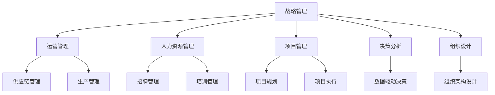

                 

# 思维工具在管理中的实际应用

## 1. 背景介绍

### 1.1 问题由来

在信息化、全球化迅速发展的背景下，企业规模不断扩大，管理复杂性日益增加。如何有效地管理组织，提升企业绩效，已成为现代企业管理面临的重要挑战。传统的管理方法，如层级制度、行政命令、人工监督等，已经难以适应新时期的管理需求。因此，迫切需要引入新的思维工具，提升企业管理的效率和质量。

### 1.2 问题核心关键点

现代企业管理中的核心问题在于：

1. 如何合理配置资源：在有限的资源下，如何最大化利用人力资源和财务资源，实现企业目标。
2. 如何激励员工：如何让员工充分发挥其潜力和创造力，提升工作效率和质量。
3. 如何优化决策：如何通过科学的方法，减少决策中的主观性和不确定性，提高决策的准确性和效率。
4. 如何实施监控与反馈：如何实时监控企业运营状况，及时反馈并调整策略，确保企业健康发展。

## 2. 核心概念与联系

### 2.1 核心概念概述

为更好地理解管理中的思维工具，本节将介绍几个密切相关的核心概念：

- **战略管理（Strategic Management）**：制定和执行企业的长期发展计划，包括目标设定、竞争分析、资源配置等。
- **运营管理（Operations Management）**：通过优化生产流程、供应链管理、质量控制等手段，提升企业运营效率和产品/服务的质量。
- **人力资源管理（Human Resource Management）**：通过招聘、培训、绩效评估、薪酬激励等措施，管理企业的人力资源，激发员工的积极性和创造力。
- **项目管理（Project Management）**：通过规划、执行、监控和评估项目，确保项目按时、按预算、按质量完成。
- **决策分析（Decision Analysis）**：利用数据、算法和模型，辅助企业进行科学决策，减少决策中的不确定性和主观性。
- **组织设计（Organization Design）**：通过合理的组织结构设计，提升企业的管理效率和协作能力。

这些核心概念之间的逻辑关系可以通过以下Mermaid流程图来展示：



这个流程图展示了大企业管理中的核心概念及其之间的关系：

1. 战略管理制定企业发展的总体规划，是运营、人力资源、项目管理、决策分析、组织设计等各方面工作的基础。
2. 运营管理通过优化生产流程和供应链管理，提升企业运营效率和产品质量。
3. 人力资源管理通过招聘、培训、绩效评估、薪酬激励等措施，激发员工的积极性和创造力。
4. 项目管理通过规划、执行、监控和评估项目，确保项目按时、按预算、按质量完成。
5. 决策分析通过数据、算法和模型，辅助企业进行科学决策，减少决策中的不确定性和主观性。
6. 组织设计通过合理的组织结构设计，提升企业的管理效率和协作能力。

## 3. 核心算法原理 & 具体操作步骤

### 3.1 算法原理概述

在企业管理中，应用思维工具的目的是通过科学的方法，提升管理效率和决策质量。本文将重点介绍两种常用的思维工具：SWOT分析和六西格玛管理，探讨其算法原理和具体操作步骤。

### 3.2 算法步骤详解

#### SWOT分析

SWOT分析是一种战略规划工具，通过分析企业的优势（Strengths）、劣势（Weaknesses）、机会（Opportunities）和威胁（Threats），帮助企业制定战略。SWOT分析的主要步骤如下：

1. 确定分析目标：明确分析对象和目的，如企业的市场定位、产品策略等。
2. 收集信息：通过调研、市场分析、竞争对手分析等方式，收集相关数据和信息。
3. 列出SWOT：将收集到的信息按照优势、劣势、机会和威胁四类进行分类，列出SWOT矩阵。
4. 分析与评估：对SWOT矩阵中的各项进行分析，评估其对企业的实际影响。
5. 制定战略：根据SWOT分析结果，制定相应的战略措施。

#### 六西格玛管理

六西格玛管理是一种质量控制方法，通过数据驱动的方法，系统化地提升企业运营质量。六西格玛管理的主要步骤如下：

1. 定义（Define）：明确项目的目标和范围，识别关键过程和指标。
2. 测量（Measure）：收集和分析数据，建立数据模型，评估当前过程的状态。
3. 分析（Analyze）：通过数据分析，找出影响过程的关键因素。
4. 改进（Improve）：根据分析结果，制定改进方案，并实施改进措施。
5. 控制（Control）：建立过程监控机制，确保改进效果持续稳定。

### 3.3 算法优缺点

#### SWOT分析

**优点**：

- 简单易用：不需要复杂的数学模型和算法，易于理解和使用。
- 全面覆盖：能够从多方面、多角度分析企业的优势和劣势，机会和威胁。
- 战略导向：帮助企业制定更科学、更合理的战略。

**缺点**：

- 主观性强：SWOT分析依赖于分析者的经验和判断，可能存在主观偏差。
- 缺乏定量支持：SWOT分析主要依赖定性分析，缺乏数据支持。
- 需要经验：对分析者的经验和技能要求较高，缺乏经验的分析者可能导致结果不准确。

#### 六西格玛管理

**优点**：

- 数据驱动：基于数据的分析，减少主观性。
- 系统化方法：通过系统化的流程，确保质量改进的科学性和有效性。
- 持续改进：通过持续监控和反馈，保证改进效果的持续性。

**缺点**：

- 复杂度高：需要建立复杂的数据模型和分析方法，对分析者要求高。
- 时间成本高：实施六西格玛管理需要大量的时间和资源投入。
- 适用性有限：不适用于所有类型的企业，特别是规模较小、流程简单的企业。

### 3.4 算法应用领域

#### SWOT分析

SWOT分析广泛应用于企业战略规划、市场分析、产品策略制定等方面，帮助企业识别机会和威胁，制定科学合理的战略。

#### 六西格玛管理

六西格玛管理主要应用于质量控制和流程优化领域，帮助企业提升产品质量、降低生产成本、提高运营效率。

## 4. 数学模型和公式 & 详细讲解 & 举例说明

### 4.1 数学模型构建

#### SWOT分析

SWOT分析主要依赖定性分析，没有严格的数学模型和公式。其核心在于通过经验判断和分析，得出企业的优势、劣势、机会和威胁。

#### 六西格玛管理

六西格玛管理基于统计学和数据驱动的方法，主要包括以下数学模型和公式：

1. 控制图（Control Chart）：通过控制图，实时监控过程的稳定性和异常情况。
2. 直方图（Histogram）：通过直方图，分析数据的分布情况。
3. 散点图（Scatter Plot）：通过散点图，分析两个变量之间的关系。
4. 过程能力指数（Process Capability Index，Cp）：衡量过程的稳定性和一致性，公式为：

$$ Cp = \frac{USL - LSL}{3\sigma} $$

其中，USL和LSL分别为过程的上限和下限，$\sigma$为过程的标准差。

### 4.2 公式推导过程

#### 控制图

控制图是六西格玛管理中的重要工具，用于实时监控过程的稳定性和异常情况。其主要思路是，通过绘制控制图，判断过程是否处于稳定状态。

控制图的基本原理是：假设过程在理想状态下，数据点应围绕中心线对称分布。如果数据点偏离中心线，则说明过程出现异常。具体计算公式如下：

$$ X_{t} = \bar{X} + \mu $$

其中，$X_t$为当前数据点，$\bar{X}$为样本均值，$\mu$为控制限。

#### 直方图

直方图用于分析数据的分布情况，主要用来判断数据是否服从正态分布。正态分布的直方图应呈钟形，中间高、两边低。

直方图的计算公式如下：

$$ H(x) = \frac{1}{\sigma\sqrt{2\pi}}e^{-\frac{(x-\mu)^2}{2\sigma^2}} $$

其中，$H(x)$为直方图的概率密度函数，$\mu$为均值，$\sigma$为标准差。

#### 散点图

散点图用于分析两个变量之间的关系。如果两个变量之间呈线性关系，则散点应呈直线分布。

散点图的计算公式如下：

$$ y = a + bx $$

其中，$y$为因变量，$x$为自变量，$a$和$b$为回归系数。

#### 过程能力指数

过程能力指数用于衡量过程的稳定性和一致性。其计算公式如下：

$$ Cp = \frac{USL - LSL}{3\sigma} $$

其中，$USL$为过程的上限，$LSL$为过程的下限，$\sigma$为过程的标准差。

### 4.3 案例分析与讲解

#### 案例1：SWOT分析在企业战略规划中的应用

某知名科技企业面临市场竞争加剧、产品更新速度加快的挑战。通过SWOT分析，企业识别出以下优势和劣势：

- 优势：强大的研发团队、良好的品牌声誉、丰富的技术积累。
- 劣势：高昂的研发成本、内部管理复杂、市场反应速度慢。
- 机会：新兴市场、技术创新、政策支持。
- 威胁：竞争对手的激烈竞争、市场波动、技术变革。

基于SWOT分析结果，企业制定了相应的战略措施：

- 优势利用：加大研发投入，加快产品创新。
- 劣势改进：优化内部管理，提高市场响应速度。
- 机会把握：拓展新兴市场，抓住技术创新趋势。
- 威胁应对：加强风险管理，调整产品策略。

#### 案例2：六西格玛管理在质量控制中的应用

某制造企业生产的手机质量不稳定，退货率较高。通过六西格玛管理，企业逐步实施了以下改进措施：

1. 定义阶段：明确手机生产过程中的关键环节，如焊接、组装、测试等，设定质量指标。
2. 测量阶段：收集生产过程中的数据，建立数据模型，分析质量问题的原因。
3. 分析阶段：通过数据分析，发现焊接工艺不稳定是主要原因，焊接温度控制不均匀。
4. 改进阶段：调整焊接工艺，优化温度控制，进行生产流程优化。
5. 控制阶段：建立焊接质量监控机制，实时监控焊接温度，确保质量稳定。

通过六西格玛管理，企业成功提升了手机生产质量，退货率大幅降低。

## 5. 项目实践：代码实例和详细解释说明

### 5.1 开发环境搭建

在进行管理工具的实践时，我们需要准备好开发环境。以下是使用Python进行数据分析和可视化环境配置流程：

1. 安装Anaconda：从官网下载并安装Anaconda，用于创建独立的Python环境。

2. 创建并激活虚拟环境：
```bash
conda create -n management-env python=3.8 
conda activate management-env
```

3. 安装Python包：
```bash
conda install numpy pandas matplotlib seaborn scipy scikit-learn jupyter notebook ipython
```

4. 安装Jupyter Notebook：
```bash
pip install jupyterlab
```

完成上述步骤后，即可在`management-env`环境中开始数据分析和可视化实践。

### 5.2 源代码详细实现

下面我们以SWOT分析和六西格玛管理为例，给出使用Python进行数据分析和可视化的代码实现。

#### SWOT分析

```python
from IPython.display import display
import pandas as pd
import seaborn as sns

# 定义SWOT分析表
swot = pd.DataFrame({
    'Strengths': ['强大的研发团队', '良好的品牌声誉', '丰富的技术积累'],
    'Weaknesses': ['高昂的研发成本', '内部管理复杂', '市场反应速度慢'],
    'Opportunities': ['新兴市场', '技术创新', '政策支持'],
    'Threats': ['竞争对手的激烈竞争', '市场波动', '技术变革']
})

# 显示SWOT分析表
display(swot)

# 使用seaborn绘制SWOT图
sns.set(style='darkgrid')
sns.heatmap(swot, annot=True, cmap='coolwarm')
```

#### 六西格玛管理

```python
import numpy as np
import matplotlib.pyplot as plt
from scipy.stats import norm

# 生成随机数据
np.random.seed(0)
x = np.random.normal(0, 1, 100)
y = np.random.normal(0, 1, 100)

# 绘制散点图
plt.scatter(x, y)
plt.title('Scatter Plot')
plt.xlabel('X')
plt.ylabel('Y')
plt.show()

# 计算过程能力指数
mu = 0
sigma = 1
usl = 3*sigma + mu
lsr = -3*sigma + mu
cp = (usl - lsr) / (6*sigma)
print('Cp =', cp)

# 绘制控制图
x = np.linspace(-5, 5, 100)
plt.plot(x, norm.pdf(x, mu, sigma))
plt.title('Normal Distribution')
plt.xlabel('X')
plt.ylabel('Probability Density')
plt.show()
```

### 5.3 代码解读与分析

#### SWOT分析

在代码中，我们首先使用Pandas创建了一个SWOT分析表，并使用IPython.display.display函数将其展示出来。然后，使用Seaborn库绘制了一个热图，展示了SWOT矩阵中的各项内容。

#### 六西格玛管理

在代码中，我们首先生成了两组随机数据，并使用Matplotlib库绘制了一个散点图，展示了两个变量之间的关系。然后，计算了过程能力指数Cp，并使用Scipy库的norm函数绘制了一个正态分布图，展示了过程数据的分布情况。

## 6. 实际应用场景

### 6.1 智能制造

在智能制造领域，SWOT分析和六西格玛管理可以有效地提升生产效率和质量。通过SWOT分析，企业可以识别生产流程中的优势和劣势，制定相应的改进措施。通过六西格玛管理，企业可以系统化地提升生产过程的稳定性和一致性，确保产品质量。

#### 案例分析

某汽车制造企业通过SWOT分析和六西格玛管理，实现了生产流程的全面优化。首先，通过SWOT分析，企业识别出生产线自动化程度低、人员技能不足等劣势，制定了引进自动化设备和培训员工等改进措施。然后，通过六西格玛管理，企业对生产流程进行了系统化分析，识别出生产过程中的瓶颈环节，进行了流程优化和设备改造。最终，企业成功提升了生产效率，降低了生产成本，产品质量也得到了显著提升。

### 6.2 医疗健康

在医疗健康领域，SWOT分析和六西格玛管理可以有效地提升服务质量和运营效率。通过SWOT分析，医院可以识别出自身优势和劣势，制定相应的管理策略。通过六西格玛管理，医院可以系统化地提升服务流程的稳定性和一致性，确保医疗服务质量。

#### 案例分析

某知名医院通过SWOT分析和六西格玛管理，实现了医疗服务的全面优化。首先，通过SWOT分析，医院识别出医护人员不足、服务流程复杂等劣势，制定了增加人员配置、优化服务流程等改进措施。然后，通过六西格玛管理，医院对服务流程进行了系统化分析，识别出服务过程中的瓶颈环节，进行了流程优化和资源配置调整。最终，医院成功提升了服务效率，降低了患者等待时间，医疗服务质量也得到了显著提升。

### 6.3 金融投资

在金融投资领域，SWOT分析和六西格玛管理可以有效地提升风险管理和投资决策质量。通过SWOT分析，金融机构可以识别出自身的优势和劣势，制定相应的风险管理策略。通过六西格玛管理，金融机构可以系统化地提升投资决策的准确性和稳定性，确保投资收益。

#### 案例分析

某大型基金公司通过SWOT分析和六西格玛管理，实现了投资决策的全面优化。首先，通过SWOT分析，公司识别出市场预测不准确、投资策略不完善等劣势，制定了改进市场预测模型、优化投资策略等改进措施。然后，通过六西格玛管理，公司对投资决策流程进行了系统化分析，识别出决策过程中的关键因素，进行了模型优化和策略调整。最终，公司成功提升了投资决策质量，实现了投资收益的最大化。

## 7. 工具和资源推荐

### 7.1 学习资源推荐

为了帮助开发者系统掌握管理中的思维工具，这里推荐一些优质的学习资源：

1. 《数据分析与可视化基础》：一本经典的数据分析入门书籍，介绍了数据清洗、处理、可视化等基本技能。
2. 《Python数据分析实战》：一本实战型的Python数据分析书籍，结合案例讲解了Python在数据分析中的应用。
3. 《数据驱动的决策分析》：一本系统介绍数据驱动决策的书籍，详细讲解了数据收集、处理、分析等流程。
4. 《SWOT分析实战指南》：一本实战型的SWOT分析书籍，结合案例讲解了SWOT分析在企业管理中的应用。
5. 《六西格玛管理实战指南》：一本实战型的六西格玛管理书籍，结合案例讲解了六西格玛管理在质量控制中的应用。

通过对这些资源的学习实践，相信你一定能够快速掌握管理中的思维工具，并用于解决实际的管理问题。

### 7.2 开发工具推荐

高效的开发离不开优秀的工具支持。以下是几款用于数据分析和可视化的常用工具：

1. Python：作为数据分析和可视化的主要编程语言，Python具有丰富的数据处理和分析库，如Pandas、NumPy、SciPy等。
2. Jupyter Notebook：一个强大的交互式笔记本环境，支持Python和其他语言的编程，适合数据科学和数据分析的开发和分享。
3. Matplotlib：一个Python绘图库，可以生成高质量的静态图表，支持多种绘图风格。
4. Seaborn：一个基于Matplotlib的高级绘图库，支持更复杂的统计图表和可视化效果。
5. Plotly：一个交互式绘图库，可以生成动态图表和可视化效果，适合展示数据和分析结果。

合理利用这些工具，可以显著提升数据分析和可视化的开发效率，加快创新迭代的步伐。

### 7.3 相关论文推荐

管理中的思维工具的发展源于学界的持续研究。以下是几篇奠基性的相关论文，推荐阅读：

1. SWOT分析的历史和应用：SWOT分析的提出和应用过程，由哈佛商学院提出的经典战略规划工具。
2. 六西格玛管理的原理和实践：六西格玛管理的提出和实践过程，由摩托罗拉公司提出并广泛应用的质量管理方法。
3. 数据分析在企业管理中的应用：数据分析在企业管理中的应用，介绍数据分析在决策、监控、优化等方面的应用。
4. 数据驱动的决策分析：数据驱动的决策分析方法，介绍数据驱动决策的基本流程和应用。
5. 人工智能在管理中的应用：人工智能在企业管理中的应用，介绍AI技术在数据分析、决策、优化等方面的应用。

这些论文代表了大管理工具的发展脉络。通过学习这些前沿成果，可以帮助研究者把握学科前进方向，激发更多的创新灵感。

## 8. 总结：未来发展趋势与挑战

### 8.1 总结

本文对管理中的思维工具进行了全面系统的介绍。首先阐述了SWOT分析和六西格玛分析的研究背景和意义，明确了这些工具在企业管理中的独特价值。其次，从原理到实践，详细讲解了SWOT分析和六西格玛管理的数学原理和关键步骤，给出了工具实现的完整代码实例。同时，本文还广泛探讨了这些工具在智能制造、医疗健康、金融投资等多个行业领域的应用前景，展示了管理工具的巨大潜力。

通过本文的系统梳理，可以看到，基于数据和算法的思维工具正在成为企业管理的重要范式，极大地提升了管理效率和决策质量。这些工具为企业管理者提供了科学的方法论支持，帮助他们更好地应对管理复杂性和不确定性。未来，伴随数据科学和人工智能技术的发展，基于数据的思维工具将得到更广泛的应用，推动企业管理向智能化、自动化方向迈进。

### 8.2 未来发展趋势

展望未来，管理中的思维工具将呈现以下几个发展趋势：

1. 数据驱动：数据驱动将成为管理工具的主流，利用大数据和机器学习技术，提升决策的科学性和准确性。
2. 人工智能：人工智能技术在管理中的应用将越来越广泛，提升决策效率和自动化水平。
3. 实时分析：实时数据分析和监控将成为企业管理的重要手段，提升管理反应速度和灵活性。
4. 多模态融合：利用多模态数据，如文本、图像、视频等，提升管理决策的全面性和准确性。
5. 自动化流程：通过流程自动化和机器人流程自动化，提升管理效率和质量，降低人工成本。
6. 持续改进：利用持续改进和PDCA循环，不断优化管理流程和决策方法。

以上趋势凸显了管理工具的智能化、自动化和数据化发展方向。这些方向的探索发展，必将进一步提升企业管理水平，推动企业向更高的目标迈进。

### 8.3 面临的挑战

尽管管理中的思维工具已经取得了显著成效，但在迈向更加智能化、普适化应用的过程中，它仍面临诸多挑战：

1. 数据质量问题：数据质量不高，如数据不完整、数据偏差、数据噪声等，可能导致决策误导。
2. 模型复杂性：数据驱动和管理工具的复杂性增加，对分析师和开发者的要求提高。
3. 技术壁垒：技术壁垒较高，需要具备一定的数据科学和人工智能知识。
4. 资源投入：数据收集、处理、分析需要大量的时间和资源投入，对企业的资源配置提出挑战。
5. 隐私和安全：数据隐私和安全问题，如数据泄露、数据滥用等，需要严格的数据保护措施。
6. 文化变革：管理工具的应用需要企业文化的变革，引入数据驱动和智能化管理方式。

这些挑战需要企业在实践中不断应对和优化，才能充分发挥管理工具的潜力。

### 8.4 研究展望

面对管理工具面临的这些挑战，未来的研究需要在以下几个方面寻求新的突破：

1. 数据质量提升：利用先进的数据清洗和处理技术，提升数据质量，确保数据驱动决策的准确性。
2. 模型简化：通过模型压缩和简化，降低模型复杂度，提升模型的可解释性和可操作性。
3. 技术普及：开发易用的管理工具和技术，降低使用门槛，普及数据驱动和管理工具的应用。
4. 资源优化：通过云计算和大数据技术，优化资源配置，提升管理工具的效率和灵活性。
5. 隐私保护：制定严格的数据隐私和安全保护措施，确保数据安全。
6. 文化融合：通过文化变革，推动企业引入数据驱动和智能化管理方式，提升企业管理的水平和质量。

这些研究方向将引领管理工具的发展，帮助企业在数据驱动的时代中取得更大的成功。

## 9. 附录：常见问题与解答

**Q1：SWOT分析和六西格玛管理有哪些区别？**

A: SWOT分析主要依赖定性分析，通过经验和判断识别企业的优势和劣势，机会和威胁。六西格玛管理则基于数据和统计学方法，通过系统化的流程，提升企业运营质量和效率。SWOT分析适用于企业战略规划和决策分析，六西格玛管理适用于质量控制和流程优化。

**Q2：SWOT分析和六西格玛管理如何结合使用？**

A: SWOT分析和六西格玛管理可以结合使用，通过SWOT分析识别企业的优势和劣势，机会和威胁，通过六西格玛管理系统化地提升运营质量和效率。例如，通过SWOT分析识别出生产线效率低下是企业的劣势，通过六西格玛管理进行流程优化，提升生产效率。

**Q3：SWOT分析和六西格玛管理在应用中需要注意哪些问题？**

A: SWOT分析和六西格玛管理在应用中需要注意以下问题：

- 数据质量：数据质量不高可能导致分析结果不准确，需要确保数据的完整性、一致性和可靠性。
- 模型选择：选择适当的模型和算法，确保分析结果的科学性和准确性。
- 技术门槛：需要具备一定的数据科学和统计学知识，建议引入专业的分析师和数据科学家。
- 资源投入：数据收集、处理、分析需要大量的时间和资源投入，需要合理规划资源配置。
- 文化变革：管理工具的应用需要企业文化的变革，引入数据驱动和智能化管理方式。

**Q4：SWOT分析和六西格玛管理的应用场景有哪些？**

A: SWOT分析和六西格玛管理在各行各业都有广泛的应用，具体应用场景包括：

- 企业战略规划：通过SWOT分析识别企业的优势和劣势，机会和威胁，制定科学合理的战略。
- 质量控制：通过六西格玛管理提升生产过程的稳定性和一致性，确保产品质量。
- 项目管理：通过SWOT分析和六西格玛管理优化项目流程，提升项目管理效率。
- 人力资源管理：通过SWOT分析和六西格玛管理优化人力资源配置，提升员工绩效和满意度。
- 金融投资：通过SWOT分析和六西格玛管理提升风险管理和投资决策质量。

通过这些应用场景，可以看到SWOT分析和六西格玛管理的广泛适用性。

---

作者：禅与计算机程序设计艺术 / Zen and the Art of Computer Programming

