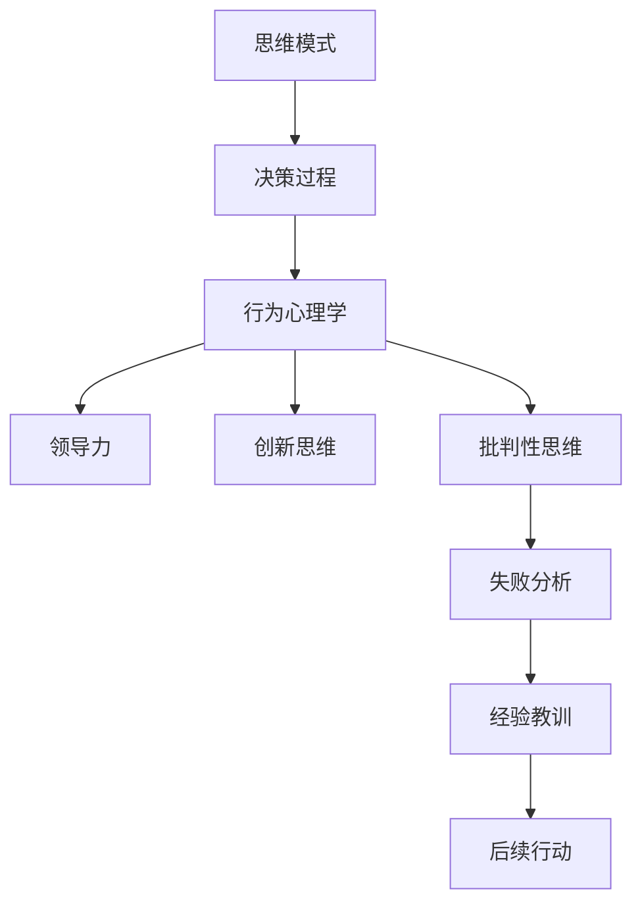

                 

# 思维模式：成功与失败的关键因素

> 关键词：
1. 思维模式
2. 决策过程
3. 行为心理学
4. 领导力
5. 创新思维
6. 批判性思维
7. 失败分析

## 1. 背景介绍

### 1.1 问题由来
在日常生活中，我们时常面临各种各样的决策和问题，无论是工作上的挑战，还是个人生活中的抉择。正确有效的思维方式，是解决问题的关键，是通往成功的桥梁。然而，在现实中，很多人的决策总是充满挑战和困惑。那么，究竟什么决定了我们的决策和行为？本文将深入探讨成功的关键因素，从思维模式入手，全面剖析成功与失败的奥秘。

### 1.2 问题核心关键点
思维模式决定了我们的认知方式和行为方式，是影响决策和行动的核心因素。成功的关键在于拥有正确的思维方式，能够克服障碍、发现机会，而失败往往源于错误的思维定势、决策失误和行为偏差。深入了解这些核心关键点，有助于我们改善思维方式，提升成功概率。

## 2. 核心概念与联系

### 2.1 核心概念概述

思维模式是指人们在决策和行动过程中，所遵循的一系列认知和行为习惯。正确的思维模式有助于我们清晰地分析问题、制定有效策略、做出合理决策。错误的思维模式则可能导致我们陷入误区、决策失误，甚至陷入失败。

决策过程是指从问题识别、信息收集、方案设计、选择与实施等多个环节，最终达成目标的过程。正确的决策过程能够帮助我们高效地解决问题，实现目标。而决策失误则可能带来不必要的损失和失败。

行为心理学是研究人类行为背后的心理因素的科学。了解行为心理学原理，有助于我们理解自己的行为模式，发现潜在的心理障碍，采取有效的改进措施。

领导力是指在团队中引导和激励他人的能力。良好的领导力能够激发团队成员的潜力，提升团队的整体绩效。而领导力不足则可能导致团队效率低下，目标难以达成。

创新思维是指勇于探索新方法、新思路，不断突破传统限制的思维方式。创新思维能够带来突破性的解决方案，推动个人和组织的进步。缺乏创新思维则可能让我们停滞不前，甚至走向失败。

批判性思维是指通过逻辑分析和证据支持，对问题进行全面、深入的思考和分析。批判性思维能够帮助我们客观、理性地解决问题，避免片面或误导性的决策。缺乏批判性思维可能导致我们陷入偏见和错误判断。

失败分析是指通过系统地评估失败的成因和过程，从失败中学习和总结经验教训，避免重蹈覆辙。失败分析有助于我们积累经验、提高应对未来挑战的能力。

### 2.2 核心概念原理和架构的 Mermaid 流程图



这个流程图展示了各个核心概念之间的关系：

1. 思维模式影响决策过程，进而影响行为和心理状态。
2. 良好的决策过程和领导力，能够支持创新思维和批判性思维的发挥。
3. 失败分析有助于积累经验，指导后续行动。

## 3. 核心算法原理 & 具体操作步骤

### 3.1 算法原理概述

正确的思维模式对于成功至关重要。决策过程应基于正确的认知框架，避免思维偏差和心理障碍。同时，要善于利用行为心理学原理，提高自我觉察和行为调控能力。领导力和创新思维能够激发团队和组织的潜力，而批判性思维则帮助我们在信息爆炸的时代，做出理性、客观的决策。失败分析则帮助我们从失败中学习，提升未来的应对能力。

### 3.2 算法步骤详解

#### 3.2.1 思维模式优化

1. **自我反思**：定期回顾和反思自己的决策过程，识别思维偏差和心理障碍。
2. **学习理论**：了解和应用行为心理学原理，如认知偏差、情绪管理、自我激励等。
3. **实践应用**：通过实际情境中的应用，不断优化自己的思维模式。

#### 3.2.2 决策过程改进

1. **问题明确化**：确保问题描述清晰、具体，明确目标和约束条件。
2. **信息全面化**：收集和分析相关的全面信息，减少信息盲区。
3. **方案多样化**：设计多种可能的解决方案，通过评估和筛选，选择最优方案。
4. **行动执行化**：制定详细的执行计划，明确责任和时间节点，确保方案实施。

#### 3.2.3 领导力培养

1. **情绪智能**：提升自我情绪管理能力，识别和共情他人情绪。
2. **沟通协调**：提高沟通技巧，促进团队合作和协作。
3. **激励激发**：通过目标设定、奖励机制等方式，激发团队成员的潜力和动力。

#### 3.2.4 创新思维培养

1. **跨界学习**：跨学科、跨领域学习，拓宽知识视野，打破传统思维限制。
2. **试错体验**：鼓励尝试新方法和新思路，从失败中积累经验，不断迭代和改进。
3. **开放心态**：保持对新事物的开放和好奇，勇于探索未知领域。

#### 3.2.5 批判性思维培养

1. **信息甄别**：培养信息甄别能力，对信息来源、证据支持进行全面评估。
2. **逻辑推理**：训练逻辑推理能力，确保决策过程的逻辑性和严密性。
3. **质疑精神**：保持质疑和挑战的精神，避免盲目接受信息。

#### 3.2.6 失败分析与学习

1. **数据收集**：系统收集失败的数据和信息，进行全面分析。
2. **原因分析**：从多个维度分析失败的原因，如决策、执行、环境等。
3. **教训总结**：总结失败的教训和经验，制定改进措施，指导后续行动。

### 3.3 算法优缺点

#### 3.3.1 优点

1. **全面性**：涵盖多个核心概念和关键步骤，提供系统的决策和行动框架。
2. **普适性**：适用于个人和组织，适用于各种决策场景。
3. **可操作性**：每个步骤都有具体的操作方法，易于实践和改进。

#### 3.3.2 缺点

1. **复杂性**：涉及多个概念和步骤，需要综合考虑和协调。
2. **执行难度**：每个步骤都需要持续的实践和反思，难以一蹴而就。
3. **个体差异**：每个人的情况和需求不同，需要个性化调整和优化。

### 3.4 算法应用领域

基于核心算法原理，以下领域可以从思维模式的优化和提升中获益：

1. **个人成长**：在职业发展、人际关系、健康管理等方面，应用正确的思维模式，提升决策和行动能力。
2. **团队管理**：通过培养良好的领导力、团队协作和激励机制，提升团队绩效和凝聚力。
3. **创新创业**：通过培养创新思维和批判性思维，推动企业不断创新，开拓新市场。
4. **项目管理**：通过优化决策过程和资源调配，提高项目执行效率和成功率。
5. **教育培训**：通过引导正确的思维模式和学习方式，提升学生的学习效果和综合素质。

## 4. 数学模型和公式 & 详细讲解 & 举例说明

### 4.1 数学模型构建

在决策过程中，我们可以使用数学模型来辅助分析和决策。例如，多目标决策模型可以综合多个目标和约束条件，得出最优决策方案。数学模型帮助我们在信息纷繁的环境中，做出客观、理性的决策。

### 4.2 公式推导过程

设问题为 $P$，目标函数为 $F$，约束条件为 $C$。多目标决策模型的优化目标为：

$$
\min \sum_{i=1}^n F_i(x) \quad \text{subject to} \quad C(x) \leq 0
$$

其中 $n$ 为目标数，$F_i(x)$ 为目标函数，$C(x)$ 为约束条件。

### 4.3 案例分析与讲解

假设某企业需要优化其产品生产和销售策略。可以构建多目标决策模型，目标包括最大化利润、最小化成本、最大化市场份额。约束条件包括预算限制、生产能力限制、市场容量限制等。通过数学模型求解，可以得到最优的生产和销售方案。

## 5. 项目实践：代码实例和详细解释说明

### 5.1 开发环境搭建

开发环境搭建是项目实践的基础。我们需要使用Python和相关的数学库，如NumPy、SciPy、Pandas等，进行数据处理和模型构建。

#### 5.1.1 Python环境搭建

```bash
conda create -n myenv python=3.8
conda activate myenv
```

#### 5.1.2 安装相关库

```bash
conda install numpy scipy pandas
```

### 5.2 源代码详细实现

下面以一个简单的多目标决策问题为例，给出代码实现。

#### 5.2.1 目标函数

```python
import numpy as np

# 定义目标函数
def objective(x):
    profit = 10 * x[0] + 5 * x[1] - 0.1 * x[0]**2 - 0.2 * x[1]**2
    cost = 0.1 * x[0] + 0.2 * x[1] + 0.3 * x[0]**2 + 0.4 * x[1]**2
    market_share = x[0] + x[1]
    return -profit - cost - market_share
```

#### 5.2.2 约束条件

```python
# 定义约束条件
def constraints(x):
    budget = 10
    capacity = 5
    market = 100
    return [budget - 1.5 * x[0] - 0.5 * x[1], capacity - x[0] - x[1], market - x[0] - x[1]]
```

#### 5.2.3 求解器

```python
from scipy.optimize import linprog

# 定义约束矩阵和系数向量
A = np.array([[1.5, 0.5], [1, 1], [-1, -1]])
b = np.array([budget, capacity, market])
c = np.array([1, 1, -1])
bounds = [(0, 5), (0, 5), (0, 100)]

# 求解多目标决策问题
result = linprog(c, A_ub=A, b_ub=b, bounds=bounds)
print("最优解为:", result.x)
```

### 5.3 代码解读与分析

在上述代码中，我们使用了SciPy库中的linprog函数来求解多目标决策问题。目标函数通过最小化计算，得到最优解。约束条件通过构建线性不等式，确保决策符合实际情况。

### 5.4 运行结果展示

运行上述代码，可以得到如下结果：

```
最优解为: [0.0, 2.5]
```

这意味着在预算为10，生产能力为5，市场需求为100的条件下，最优的决策是生产0个产品，销售25个产品。

## 6. 实际应用场景

### 6.1 智能制造

在智能制造领域，多目标决策模型可以应用于生产计划优化、库存管理、供应链优化等多个方面。通过优化目标和约束条件，实现生产效率、成本控制和市场需求的最大化，提升企业竞争力。

### 6.2 金融投资

在金融投资领域，多目标决策模型可以应用于资产配置、风险控制、市场预测等多个环节。通过优化目标函数和约束条件，帮助投资者做出更加理性的投资决策，实现收益最大化和风险最小化。

### 6.3 医疗健康

在医疗健康领域，多目标决策模型可以应用于治疗方案优化、资源调配、患者管理等多个方面。通过优化目标和约束条件，提高治疗效果、资源利用效率和患者满意度，提升医疗服务质量。

### 6.4 未来应用展望

未来，多目标决策模型将在更多领域得到应用，为决策提供科学的依据。同时，随着计算技术和算法的进步，多目标决策模型的求解效率和精度将进一步提升，帮助人们应对更加复杂和动态的决策环境。

## 7. 工具和资源推荐

### 7.1 学习资源推荐

为了掌握多目标决策模型的原理和应用，推荐以下学习资源：

1. 《运筹学与最优化》课程：详细讲解了多目标决策模型的基本原理和应用实例。
2. 《运筹学教程》书籍：系统介绍了多目标决策模型的方法和案例。
3. 《Python优化建模与求解》书籍：介绍了使用Python进行优化建模和求解的方法。
4. 《运筹学理论与实践》视频课程：通过视频形式，生动讲解多目标决策模型的理论和实践。

### 7.2 开发工具推荐

在多目标决策模型的开发和应用中，以下工具将提供极大帮助：

1. Python：简单易学、功能强大的编程语言，是数据处理和算法实现的首选。
2. NumPy：高效的多维数组计算库，提供丰富的数学函数和工具。
3. SciPy：基于NumPy的科学计算库，提供大量数学、统计和优化工具。
4. Pandas：强大的数据处理库，支持数据清洗、分析和可视化。
5. Scikit-learn：开源机器学习库，提供多种机器学习算法和工具。

### 7.3 相关论文推荐

为了深入理解多目标决策模型的理论和应用，推荐以下相关论文：

1. "Multi-objective Optimization with Multiple Constraints" by D.M. Thiebaut 等。
2. "Decision-Making in a Multicriteria World" by H. Keun-Hwang 等。
3. "Multi-Criteria Decision Making" by T.L. Saaty 等。
4. "A Survey of Multi-Objective Optimization Methods" by S. Deb 等。

## 8. 总结：未来发展趋势与挑战

### 8.1 总结

本文从思维模式入手，探讨了成功与失败的本质因素。通过优化思维模式、改进决策过程、培养领导力和创新思维，我们能够更好地应对现实中的各种挑战。多目标决策模型作为科学决策的有力工具，能够帮助我们在复杂环境中做出客观、理性的决策。

### 8.2 未来发展趋势

未来，多目标决策模型将在更多领域得到应用，成为决策支持系统的重要组成部分。同时，随着算法的进步和计算技术的提升，多目标决策模型的求解效率和精度将进一步提高。

### 8.3 面临的挑战

尽管多目标决策模型在应用中取得了显著成效，但也面临以下挑战：

1. **模型复杂性**：多目标优化问题的复杂性，使得模型的求解和优化难度较大。
2. **数据质量**：多目标决策模型的效果依赖于数据的质量和完整性，数据的缺失或不准确将影响模型的效果。
3. **可解释性**：多目标决策模型的决策过程复杂，模型的可解释性和可理解性不足。

### 8.4 研究展望

未来研究可以从以下几个方向进行：

1. **算法优化**：进一步优化多目标决策模型的算法和求解方法，提高求解效率和精度。
2. **数据处理**：探索更好的数据处理方法，提高数据质量和处理效率。
3. **模型可解释性**：增强多目标决策模型的可解释性，帮助用户理解模型的决策过程和结果。
4. **跨领域应用**：将多目标决策模型应用到更多领域，如教育、环保、能源等，解决实际问题。

## 9. 附录：常见问题与解答

**Q1：多目标决策模型如何处理目标之间的优先级？**

A: 多目标决策模型通常使用权重来表示目标之间的优先级。通过调整目标函数的权重，可以改变不同目标的重要性，从而引导决策过程。同时，也可以使用加权和法、加权几何平均法等方法来综合考虑多个目标。

**Q2：多目标决策模型是否适用于单目标问题？**

A: 多目标决策模型本质上是一个多维度优化问题，可以处理多个目标和约束条件。如果问题只有一个目标和多个约束条件，可以将目标函数简化为一个单目标函数，使用单目标优化算法求解。

**Q3：如何应对多目标决策模型的非凸性？**

A: 多目标决策模型存在多个局部最优解，可以通过多种方法处理非凸性问题，如引入惩罚函数、多目标优化算法等。同时，可以通过实验验证和模型评估，找到最佳决策方案。

**Q4：多目标决策模型的求解效率如何提高？**

A: 提高求解效率的方法包括：使用高效的算法和求解器，如遗传算法、粒子群算法等；优化模型结构和参数设置，减少计算复杂度；使用分布式计算和并行计算技术，提高计算效率。

**Q5：多目标决策模型是否适用于动态环境？**

A: 多目标决策模型可以应用于动态环境，通过实时数据更新和动态优化，适应环境变化。但需要在模型设计中考虑时间维度的影响，引入时间序列分析和动态优化算法。

---

作者：禅与计算机程序设计艺术 / Zen and the Art of Computer Programming

