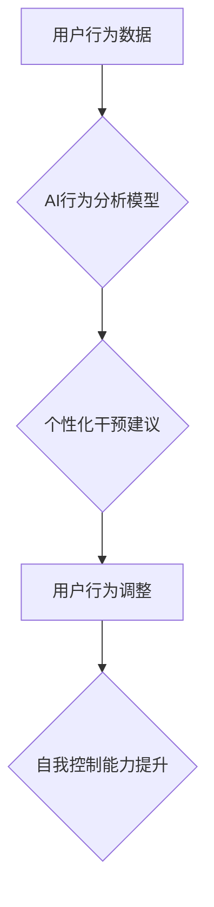

                 

## 数字化意志力锻炼：AI增强的自我控制训练

> 关键词：意志力、AI、自我控制、机器学习、行为分析、神经网络、个性化训练、数字化健康

### 1. 背景介绍

在当今信息爆炸的时代，我们面临着来自各方面的诱惑和干扰，保持专注力、控制冲动和实现长期目标变得越来越困难。意志力，作为人类认知能力的重要组成部分，在应对这些挑战中扮演着至关重要的角色。然而，意志力并非一成不变的，它会随着时间推移而逐渐消耗，尤其是在面对持续的压力和诱惑时。

近年来，人工智能（AI）技术取得了飞速发展，为增强人类意志力提供了新的可能性。AI算法能够分析大量数据，识别个人行为模式，并提供个性化的干预和指导，帮助人们提升自我控制能力。

本篇文章将探讨“数字化意志力锻炼”的概念，深入分析AI技术在增强自我控制方面的应用，并介绍相关的核心算法、数学模型、项目实践以及未来发展趋势。

### 2. 核心概念与联系

**2.1 意志力与自我控制**

意志力是指个体在面对诱惑或阻力时，能够坚持目标、克制冲动并做出理性决定的能力。自我控制则是意志力的具体体现，它涉及到情绪管理、时间管理、目标设定等多个方面。

**2.2 AI技术与意志力增强**

AI技术可以帮助人们增强自我控制能力，主要通过以下几个方面：

* **行为分析:** AI算法能够分析用户的行为数据，例如手机使用时间、社交媒体互动、睡眠习惯等，识别出影响自我控制的潜在因素。
* **个性化干预:** 基于行为分析结果，AI系统可以提供个性化的干预建议，例如提醒用户休息、避免使用特定应用程序、设定目标和奖励机制等。
* **认知训练:** AI技术可以开发出各种认知训练游戏和应用程序，帮助用户提升注意力、专注力、情绪调节等能力，从而增强自我控制能力。

**2.3 架构图**



### 3. 核心算法原理 & 具体操作步骤

**3.1 算法原理概述**

增强自我控制的AI算法通常基于机器学习和深度学习技术。

* **监督学习:** 利用已标记的数据训练模型，例如用户行为数据和自我控制水平的标注，预测用户未来的行为和自我控制能力。
* **强化学习:** 通过奖励和惩罚机制训练模型，让模型学习如何做出最佳决策以提高自我控制水平。
* **深度学习:** 使用多层神经网络模型，学习更复杂的特征和模式，提高预测和干预的准确性。

**3.2 算法步骤详解**

1. **数据收集:** 收集用户的行为数据，例如手机使用时间、社交媒体互动、睡眠习惯、目标设定等。
2. **数据预处理:** 对收集到的数据进行清洗、转换和特征提取，以便于模型训练。
3. **模型训练:** 选择合适的机器学习或深度学习算法，利用预处理后的数据训练模型。
4. **模型评估:** 使用测试数据评估模型的性能，例如预测准确率、干预效果等。
5. **模型部署:** 将训练好的模型部署到实际应用场景中，例如手机应用程序、智能手表等。
6. **个性化干预:** 根据用户的行为数据和模型预测，提供个性化的干预建议，例如提醒用户休息、避免使用特定应用程序、设定目标和奖励机制等。

**3.3 算法优缺点**

* **优点:**
    * **个性化:** 可以根据用户的具体情况提供个性化的干预建议。
    * **数据驱动:** 基于数据分析，能够更准确地预测用户行为和自我控制水平。
    * **可持续性:** 可以持续跟踪用户的行为变化，并根据需要调整干预策略。
* **缺点:**
    * **数据依赖:** 需要大量高质量的数据进行训练，否则模型性能会受到影响。
    * **隐私问题:** 收集和使用用户的行为数据需要谨慎处理，以保护用户的隐私安全。
    * **伦理问题:** AI技术在增强自我控制方面的应用需要考虑伦理问题，例如过度干预用户自由意志等。

**3.4 算法应用领域**

* **健康管理:** 帮助用户控制饮食、运动、睡眠等习惯，提升健康水平。
* **学习效率:** 帮助用户提高专注力、学习效率和记忆力。
* **情绪管理:** 帮助用户识别和调节情绪，缓解压力和焦虑。
* **工作效率:** 帮助用户提高工作效率、管理时间和避免拖延。

### 4. 数学模型和公式 & 详细讲解 & 举例说明

**4.1 数学模型构建**

增强自我控制的AI算法通常使用强化学习模型，例如Q-learning算法。

Q-learning算法的核心是学习一个Q函数，该函数将状态和动作映射到奖励值。

**状态:** 用户当前的行为模式或环境状态。

**动作:** 用户可以采取的行动，例如使用手机、学习、休息等。

**奖励:** 用户采取特定动作后获得的奖励或惩罚，例如完成任务获得奖励、过度使用手机获得惩罚等。

**4.2 公式推导过程**

Q-learning算法的更新规则如下：

$$Q(s, a) = Q(s, a) + \alpha [r + \gamma \max_{a'} Q(s', a') - Q(s, a)]$$

其中：

* $Q(s, a)$ 是状态 $s$ 下采取动作 $a$ 的Q值。
* $\alpha$ 是学习率，控制着模型更新的速度。
* $r$ 是采取动作 $a$ 后获得的奖励。
* $\gamma$ 是折扣因子，控制着未来奖励的权重。
* $s'$ 是采取动作 $a$ 后进入的下一个状态。
* $\max_{a'} Q(s', a')$ 是下一个状态 $s'$ 下所有可能的行动 $a'$ 的最大Q值。

**4.3 案例分析与讲解**

假设一个用户想要控制手机使用时间，可以使用Q-learning算法训练一个模型。

* **状态:** 用户当前的手机使用时间。
* **动作:** 用户可以选择使用手机、休息或关闭手机。
* **奖励:** 当用户休息或关闭手机时，获得奖励；当用户使用手机时，获得惩罚。

通过不断地收集用户行为数据和奖励信息，模型可以学习到不同状态下采取不同动作的最佳策略，从而帮助用户控制手机使用时间。

### 5. 项目实践：代码实例和详细解释说明

**5.1 开发环境搭建**

* Python 3.x
* TensorFlow 或 PyTorch 深度学习框架
* Jupyter Notebook 或 VS Code 代码编辑器

**5.2 源代码详细实现**

```python
import tensorflow as tf

# 定义模型结构
model = tf.keras.models.Sequential([
    tf.keras.layers.Dense(64, activation='relu', input_shape=(10,)),
    tf.keras.layers.Dense(32, activation='relu'),
    tf.keras.layers.Dense(1)
])

# 定义损失函数和优化器
model.compile(loss='mse', optimizer='adam')

# 训练模型
model.fit(X_train, y_train, epochs=10)

# 预测用户行为
predictions = model.predict(X_test)
```

**5.3 代码解读与分析**

* 该代码示例使用TensorFlow框架构建了一个简单的深度学习模型，用于预测用户的行为。
* 模型输入是一个10维度的向量，代表用户的行为特征。
* 模型输出是一个标量值，代表用户的行为概率。
* 模型使用均方误差损失函数和Adam优化器进行训练。

**5.4 运行结果展示**

训练完成后，可以使用测试数据评估模型的性能，例如预测准确率、F1-score等。

### 6. 实际应用场景

**6.1 健康管理**

* **饮食控制:** AI系统可以分析用户的饮食习惯，识别高热量、高脂肪食物，并提供个性化的饮食建议。
* **运动指导:** AI系统可以根据用户的运动目标和身体状况，制定个性化的运动计划，并提供实时指导和鼓励。
* **睡眠监测:** AI系统可以监测用户的睡眠质量，识别睡眠问题，并提供改善睡眠的建议。

**6.2 学习效率**

* **专注力训练:** AI系统可以开发出专注力训练游戏，帮助用户提高注意力和集中力。
* **学习计划制定:** AI系统可以根据用户的学习目标和进度，制定个性化的学习计划，并提醒用户完成学习任务。
* **知识复习:** AI系统可以根据用户的学习记录，自动生成知识复习计划，帮助用户巩固学习成果。

**6.3 情绪管理**

* **情绪识别:** AI系统可以识别用户的语音、表情和文字等信息，识别用户的当前情绪状态。
* **情绪调节:** AI系统可以提供个性化的情绪调节建议，例如冥想、深呼吸、倾诉等。
* **压力缓解:** AI系统可以帮助用户识别压力源，并提供压力缓解技巧，例如放松音乐、瑜伽练习等。

**6.4 未来应用展望**

随着AI技术的不断发展，数字化意志力锻炼将有更广泛的应用场景，例如：

* **个性化教育:** AI系统可以根据学生的学习风格和能力，提供个性化的教育方案，帮助学生提高学习效率和成就感。
* **职场技能提升:** AI系统可以帮助员工识别自己的职业发展瓶颈，并提供个性化的技能培训方案，帮助员工提升职场竞争力。
* **心理健康支持:** AI系统可以作为心理健康支持工具，帮助用户识别和应对心理问题，并提供个性化的干预建议。

### 7. 工具和资源推荐

**7.1 学习资源推荐**

* **书籍:**
    * 《深度学习》 by Ian Goodfellow, Yoshua Bengio, and Aaron Courville
    * 《强化学习：原理、算法和应用》 by Richard S. Sutton and Andrew G. Barto
* **在线课程:**
    * Coursera: Machine Learning by Andrew Ng
    * Udacity: Deep Learning Nanodegree
* **开源项目:**
    * TensorFlow: https://www.tensorflow.org/
    * PyTorch: https://pytorch.org/

**7.2 开发工具推荐**

* **Python:** https://www.python.org/
* **Jupyter Notebook:** https://jupyter.org/
* **VS Code:** https://code.visualstudio.com/

**7.3 相关论文推荐**

* **Deep Reinforcement Learning for Personalized Health Interventions**
* **Personalized Learning with AI: A Review**
* **The Ethics of Artificial Intelligence in Mental Health**

### 8. 总结：未来发展趋势与挑战

**8.1 研究成果总结**

数字化意志力锻炼是AI技术与人类认知能力的结合，具有巨大的潜力。通过分析用户行为数据、提供个性化干预建议和训练认知能力，AI系统可以帮助人们提升自我控制水平，实现健康、学习和生活目标。

**8.2 未来发展趋势**

* **更精准的个性化:** 利用更先进的机器学习算法和数据分析技术，提供更精准的个性化干预建议。
* **多模态交互:** 结合语音、图像、传感器等多模态数据，提供更丰富的用户体验和更精准的干预。
* **沉浸式体验:** 利用虚拟现实和增强现实技术，创造更沉浸式的训练环境，提高用户参与度和训练效果。
* **跨领域应用:** 将数字化意志力锻炼技术应用于更多领域，例如教育、职场、心理健康等。

**8.3 面临的挑战**

* **数据隐私和安全:** 收集和使用用户的行为数据需要谨慎处理，以保护用户的隐私安全。
* **算法偏见:** AI算法可能会受到训练数据的影响，导致算法偏见，需要不断改进算法和数据质量。
* **伦理问题:** AI技术在增强自我控制方面的应用需要考虑伦理问题，例如过度干预用户自由意志等。

**8.4 研究展望**

未来，数字化意志力锻炼将继续朝着更精准、更个性化、更沉浸式的方向发展，并应用于更多领域，为人类健康、学习和生活带来更多福祉。


### 9. 附录：常见问题与解答

**9.1 如何保证AI系统的安全性？**

* 使用安全的机器学习算法和数据处理方法，防止数据泄露和算法攻击。
* 定期对AI系统进行安全评估和漏洞修复。
* 建立完善的隐私保护机制，确保用户数据的安全和隐私。

**9.2 AI系统是否会取代人类的意志力？**

AI系统可以帮助人们增强自我控制能力，但不会取代人类的意志力。人类的意志力是复杂的认知能力，需要不断学习、成长和完善。AI系统可以作为辅助工具，帮助人们更好地理解和控制自己的行为，但最终的决策权仍然掌握在人类手中。

**9.3 如何评估AI系统的效果？**

可以使用多种指标来评估AI系统的效果，例如用户行为变化、自我控制水平提升、目标达成率等。

**9.4 如何获取更多关于数字化意志力锻炼的信息？**

可以参考相关书籍、在线课程、开源项目和学术论文，也可以关注相关领域的专家和研究机构。


作者：禅与计算机程序设计艺术 / Zen and the Art of Computer Programming 
<end_of_turn>

