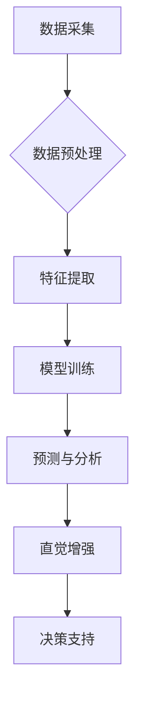

                 

## 数字化直觉增强：AI辅助的第六感开发

> 关键词：人工智能、直觉、第六感、机器学习、深度学习、数据分析、模式识别、预测

### 1. 背景介绍

在当今数据爆炸的时代，人类面临着海量信息的冲击。如何从纷繁复杂的数字世界中提取有价值的信息，并做出快速、准确的决策，成为一个至关重要的挑战。传统的逻辑思维和理性分析方式，在面对复杂、动态的场景时显得捉襟见肘。因此，人们开始探索新的认知方式，寻求一种能够超越理性思维的“第六感”。

人工智能（AI）技术的快速发展为这一探索提供了新的可能性。AI算法能够从海量数据中识别出人类难以察觉的模式和趋势，并将其转化为可理解的洞察和预测。通过AI辅助，我们可以增强我们的直觉，开发出一种更敏锐、更精准的“数字化直觉”。

### 2. 核心概念与联系

**2.1  直觉与第六感**

直觉是一种基于经验和潜意识的快速、非理性的判断。它往往是基于大量信息积累和隐性知识的综合，并能帮助我们快速做出决策。第六感则是一种更高级的直觉，它能够感知到超出人类感知范围的信息，并做出预判。

**2.2  AI辅助直觉**

AI辅助直觉是指利用人工智能技术，帮助人类增强直觉能力。通过训练AI模型识别复杂数据中的模式和趋势，我们可以获得更深入的洞察，并做出更准确的预测。

**2.3  数字化直觉**

数字化直觉是指在数字化环境下，通过AI辅助，增强人类直觉能力，并将其转化为可操作的决策依据。

**2.4  架构图**



### 3. 核心算法原理 & 具体操作步骤

**3.1  算法原理概述**

AI辅助直觉的核心算法主要包括机器学习和深度学习。

* **机器学习**：通过训练模型，让其从数据中学习规律，并进行预测。常见的机器学习算法包括支持向量机、决策树、随机森林等。
* **深度学习**：利用多层神经网络，模拟人类大脑的学习过程，能够学习更复杂的模式和关系。常见的深度学习算法包括卷积神经网络（CNN）、循环神经网络（RNN）等。

**3.2  算法步骤详解**

1. **数据采集**: 收集与目标相关的海量数据，例如用户行为数据、市场趋势数据、传感器数据等。
2. **数据预处理**: 对收集到的数据进行清洗、转换、归一化等处理，使其适合模型训练。
3. **特征提取**: 从数据中提取有价值的特征，例如用户画像、文本主题、图像内容等。
4. **模型训练**: 选择合适的机器学习或深度学习算法，并利用训练数据训练模型。
5. **模型评估**: 使用测试数据评估模型的性能，并进行调参优化。
6. **预测与分析**: 将训练好的模型应用于新的数据，进行预测和分析，并将其结果转化为可理解的洞察。
7. **直觉增强**: 将模型的预测结果与人类的经验和知识结合，形成更精准的直觉判断。

**3.3  算法优缺点**

* **优点**:
    * 能够识别人类难以察觉的模式和趋势。
    * 能够进行快速、准确的预测。
    * 能够帮助人类做出更明智的决策。
* **缺点**:
    * 需要大量的数据进行训练。
    * 模型的性能取决于数据的质量和特征的提取。
    * 算法的解释性较差，难以理解模型的决策过程。

**3.4  算法应用领域**

* **金融**: 风险评估、欺诈检测、投资决策
* **医疗**: 疾病诊断、药物研发、个性化治疗
* **营销**: 客户画像、精准营销、广告投放
* **制造**: 故障预测、质量控制、生产优化
* **交通**: 交通预测、自动驾驶、智能交通管理

### 4. 数学模型和公式 & 详细讲解 & 举例说明

**4.1  数学模型构建**

AI辅助直觉的核心数学模型通常是基于概率论和统计学。

* **贝叶斯定理**: 用于计算事件发生的概率，根据已知条件更新事件发生的概率。
* **决策树**: 用于分类和回归问题，通过一系列决策规则将数据分类或预测目标值。
* **支持向量机**: 用于分类问题，寻找最佳的分隔超平面，将数据点分类。

**4.2  公式推导过程**

例如，使用贝叶斯定理进行疾病诊断，假设疾病的发生概率为P(D)，测试结果为阳性概率为P(T|D)，测试结果为阴性概率为P(T|¬D)。则根据贝叶斯定理，可以推导出测试结果为阳性的情况下，患病概率为：

$$P(D|T) = \frac{P(T|D)P(D)}{P(T)}$$

其中，P(T) 是测试结果为阳性的概率，可以由以下公式计算：

$$P(T) = P(T|D)P(D) + P(T|¬D)P(¬D)$$

**4.3  案例分析与讲解**

例如，在医疗领域，可以使用AI辅助直觉来诊断疾病。通过训练模型，让其学习患者的症状、病史、检查结果等数据，并预测患者患病的概率。医生可以根据模型的预测结果，结合自身的经验和知识，做出更准确的诊断。

### 5. 项目实践：代码实例和详细解释说明

**5.1  开发环境搭建**

* Python 3.x
* TensorFlow 或 PyTorch
* Jupyter Notebook

**5.2  源代码详细实现**

```python
import tensorflow as tf

# 定义模型结构
model = tf.keras.models.Sequential([
    tf.keras.layers.Dense(64, activation='relu', input_shape=(10,)),
    tf.keras.layers.Dense(32, activation='relu'),
    tf.keras.layers.Dense(1, activation='sigmoid')
])

# 编译模型
model.compile(optimizer='adam', loss='binary_crossentropy', metrics=['accuracy'])

# 训练模型
model.fit(X_train, y_train, epochs=10, batch_size=32)

# 评估模型
loss, accuracy = model.evaluate(X_test, y_test)
print('Loss:', loss)
print('Accuracy:', accuracy)

# 使用模型进行预测
predictions = model.predict(X_new)
```

**5.3  代码解读与分析**

* 代码首先定义了一个简单的多层感知机模型。
* 模型包含三个全连接层，第一层输入维度为10，最后一层输出维度为1，用于二分类问题。
* 使用Adam优化器、二分类交叉熵损失函数和准确率作为评估指标。
* 模型使用训练数据进行训练，并使用测试数据进行评估。
* 最后，使用训练好的模型对新的数据进行预测。

**5.4  运行结果展示**

运行结果将显示模型的训练损失、准确率以及对新数据的预测结果。

### 6. 实际应用场景

**6.1  金融领域**

* **欺诈检测**: AI模型可以分析交易数据，识别异常行为，并进行欺诈检测。
* **风险评估**: AI模型可以评估客户的信用风险，帮助金融机构做出贷款决策。
* **投资决策**: AI模型可以分析市场数据，预测股票价格走势，帮助投资者做出投资决策。

**6.2  医疗领域**

* **疾病诊断**: AI模型可以分析患者的症状、病史、检查结果等数据，辅助医生进行疾病诊断。
* **药物研发**: AI模型可以分析药物分子结构和生物活性数据，加速药物研发过程。
* **个性化治疗**: AI模型可以根据患者的基因信息和生活习惯，制定个性化的治疗方案。

**6.3  营销领域**

* **客户画像**: AI模型可以分析客户的行为数据，构建客户画像，帮助企业进行精准营销。
* **精准营销**: AI模型可以根据客户的兴趣和需求，推送个性化的广告和产品推荐。
* **广告投放**: AI模型可以优化广告投放策略，提高广告效果。

**6.4  未来应用展望**

随着人工智能技术的不断发展，AI辅助直觉将在更多领域得到应用，例如自动驾驶、智能家居、教育等。未来，AI将成为人类认知能力的扩展，帮助我们更好地理解世界，做出更明智的决策。

### 7. 工具和资源推荐

**7.1  学习资源推荐**

* **书籍**:
    * 《深度学习》
    * 《机器学习实战》
    * 《人工智能：一种现代方法》
* **在线课程**:
    * Coursera
    * edX
    * Udacity

**7.2  开发工具推荐**

* **Python**: 
    * TensorFlow
    * PyTorch
    * scikit-learn
* **云平台**:
    * AWS
    * Azure
    * Google Cloud

**7.3  相关论文推荐**

* **Attention Is All You Need**
* **BERT: Pre-training of Deep Bidirectional Transformers for Language Understanding**
* **Generative Adversarial Networks**

### 8. 总结：未来发展趋势与挑战

**8.1  研究成果总结**

AI辅助直觉的研究取得了显著进展，在金融、医疗、营销等领域取得了成功应用。

**8.2  未来发展趋势**

* **模型更加复杂**: 未来，AI模型将更加复杂，能够学习更复杂的模式和关系。
* **数据更加丰富**: 未来，数据将更加丰富，能够提供更全面的信息。
* **解释性更强**: 未来，AI模型的解释性将更加强，能够更好地解释模型的决策过程。

**8.3  面临的挑战**

* **数据隐私**: AI模型的训练需要大量数据，如何保护数据隐私是一个重要的挑战。
* **算法偏见**: AI模型可能存在算法偏见，需要进行公平性评估和修正。
* **伦理问题**: AI辅助直觉的应用可能引发伦理问题，需要进行深入探讨和规范。

**8.4  研究展望**

未来，AI辅助直觉的研究将继续深入，探索更有效的算法、更丰富的应用场景，并解决相关伦理和社会问题。


### 9. 附录：常见问题与解答

**9.1  Q: AI辅助直觉是否会取代人类的直觉？**

**A:** AI辅助直觉不会取代人类的直觉，而是会增强人类的直觉能力。人类的直觉是基于经验和潜意识的，而AI辅助直觉是基于数据和算法的，两者互补，共同帮助我们做出更明智的决策。

**9.2  Q: 如何评估AI辅助直觉的准确性？**

**A:** AI辅助直觉的准确性可以通过多种指标进行评估，例如预测准确率、召回率、F1-score等。此外，还需要结合实际应用场景进行评估，例如在金融领域，可以评估AI模型的欺诈检测准确率；在医疗领域，可以评估AI模型的疾病诊断准确率。

**9.3  Q: AI辅助直觉的应用有哪些伦理问题？**

**A:** AI辅助直觉的应用可能引发一些伦理问题，例如算法偏见、数据隐私、责任归属等。需要进行深入探讨和规范，确保AI技术应用的公平、公正、透明。


作者：禅与计算机程序设计艺术 / Zen and the Art of Computer Programming 
<end_of_turn>

