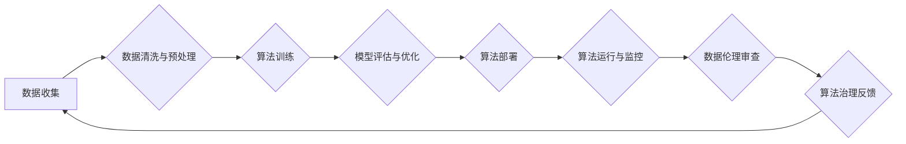

                 

## 数据伦理：算法治理与规范

> 关键词：数据伦理、算法治理、规范、公平性、透明度、可解释性、隐私保护

### 1. 背景介绍

在数据驱动的时代，人工智能（AI）算法正在各个领域发挥着越来越重要的作用，从医疗诊断到金融决策，从自动驾驶到个性化推荐，AI 正在深刻地改变着我们的生活。然而，随着 AI 技术的快速发展，其带来的伦理问题也日益凸显。

数据伦理是指在数据收集、使用、存储和共享过程中，遵循道德原则和社会规范，确保数据的使用安全、公平、透明和可控。算法治理则是指对 AI 算法的设计、开发、部署和使用进行规范和管理，以确保算法的公平性、透明度、可解释性和安全性。

数据伦理和算法治理是 AI 发展不可或缺的一部分，它们关系到个人的权利、社会公平、公共安全等核心价值。

### 2. 核心概念与联系

**2.1 数据伦理的核心概念**

* **公平性:** 算法应该对所有用户公平公正，避免因种族、性别、宗教等因素产生歧视。
* **透明度:** 算法的决策过程应该清晰可解释，用户应该能够了解算法是如何做出决定的。
* **可解释性:** 算法的决策结果应该能够被人类理解和解释，避免“黑箱”算法带来的不确定性和风险。
* **隐私保护:** 算法应该保护用户的个人隐私信息，避免数据泄露和滥用。
* **责任与问责:** 算法的开发、部署和使用都应该有明确的责任主体，并对算法可能带来的负面影响承担相应的责任。

**2.2 算法治理的核心原则**

* **原则性:** 算法治理应该建立在明确的伦理原则和法律法规的基础上。
* **规范性:** 算法的开发、部署和使用应该遵循相应的规范和标准。
* **可控性:** 算法的决策过程应该能够被人类控制和监督。
* **审计性:** 算法的运行结果应该能够被定期审计，确保算法的公平性和有效性。

**2.3 数据伦理与算法治理的联系**

数据伦理和算法治理是相互关联、相互促进的。数据伦理为算法治理提供了道德指南，而算法治理则为数据伦理提供了具体的实施路径。

**Mermaid 流程图**



### 3. 核心算法原理 & 具体操作步骤

**3.1 算法原理概述**

本节将介绍一种用于数据伦理评估的典型算法——公平性算法。公平性算法旨在确保算法对不同群体用户的决策结果公平，避免因种族、性别、宗教等因素产生歧视。

**3.2 算法步骤详解**

1. **数据收集与预处理:** 收集包含敏感属性（如种族、性别）和目标变量的数据。对数据进行清洗和预处理，例如处理缺失值、标准化特征等。
2. **特征选择:** 选择与目标变量相关的特征，并剔除可能导致歧视的敏感属性特征。
3. **模型训练:** 使用公平性算法训练模型，例如使用正则化技术或对抗训练等方法，来减少模型对敏感属性的依赖。
4. **模型评估:** 使用公平性指标评估模型的公平性，例如均等机会差、统计显著性检验等。
5. **模型优化:** 根据评估结果，调整模型参数或训练方法，以提高模型的公平性。
6. **部署与监控:** 将经过优化后的模型部署到实际应用场景，并持续监控模型的公平性，及时进行调整和改进。

**3.3 算法优缺点**

* **优点:** 可以有效地减少算法对敏感属性的依赖，提高算法的公平性。
* **缺点:** 

    * 需要大量的标注数据，且数据质量对算法效果有很大影响。
    * 难以完全消除算法的偏见，需要不断地进行评估和优化。

**3.4 算法应用领域**

* **金融领域:** 避免在贷款审批、信用卡授信等方面对不同群体用户产生歧视。
* **医疗领域:** 确保医疗资源分配和疾病诊断结果的公平性。
* **司法领域:** 避免在判决和刑罚方面对不同群体用户产生歧视。

### 4. 数学模型和公式 & 详细讲解 & 举例说明

**4.1 数学模型构建**

公平性算法通常使用以下数学模型来衡量算法的公平性：

* **均等机会差 (Equal Opportunity Difference,EOD):** 衡量不同群体用户在相同特征条件下获得目标变量的概率差异。

$$EOD = P(Y = 1 | X, S_1) - P(Y = 1 | X, S_2)$$

其中：

* $Y$ 是目标变量
* $X$ 是除敏感属性外的特征
* $S_1$ 和 $S_2$ 是两个不同的群体

* **统计显著性检验:** 通过统计检验来判断算法对不同群体用户的决策结果是否存在显著差异。

**4.2 公式推导过程**

EOD 公式的推导过程基于概率论和统计学原理。

**4.3 案例分析与讲解**

假设我们有一个用于预测贷款审批的算法，敏感属性为种族，目标变量为贷款审批结果。

如果 EOD 值为 0.1，则表示不同种族用户在相同特征条件下获得贷款审批的概率存在 0.1 的差异。

如果通过统计显著性检验发现算法对不同种族用户的决策结果存在显著差异，则表明该算法存在种族歧视。

### 5. 项目实践：代码实例和详细解释说明

**5.1 开发环境搭建**

本项目使用 Python 语言进行开发，需要安装以下软件包：

* scikit-learn
* pandas
* numpy

**5.2 源代码详细实现**

```python
import pandas as pd
from sklearn.linear_model import LogisticRegression
from sklearn.model_selection import train_test_split
from sklearn.metrics import classification_report

# 加载数据
data = pd.read_csv('loan_data.csv')

# 选择特征和目标变量
features = ['income', 'credit_score']
target = 'approved'

# 分割数据
X_train, X_test, y_train, y_test = train_test_split(data[features], data[target], test_size=0.2)

# 训练模型
model = LogisticRegression()
model.fit(X_train, y_train)

# 预测结果
y_pred = model.predict(X_test)

# 评估模型
print(classification_report(y_test, y_pred))

# 计算均等机会差
# ...
```

**5.3 代码解读与分析**

代码首先加载数据，然后选择特征和目标变量。接着使用 train_test_split 函数将数据分割成训练集和测试集。

然后使用 LogisticRegression 模型训练模型，并使用 classification_report 函数评估模型的性能。

最后，可以根据需要计算均等机会差等公平性指标。

**5.4 运行结果展示**

运行结果将显示模型的分类报告，包括准确率、召回率、F1-score 等指标。

此外，还可以根据需要计算均等机会差等公平性指标，并进行分析。

### 6. 实际应用场景

**6.1 金融领域**

* **贷款审批:** 确保贷款审批算法对不同种族、性别、收入水平的用户公平。
* **信用卡授信:** 避免信用卡授信算法对不同群体用户产生歧视。

**6.2 医疗领域**

* **疾病诊断:** 确保疾病诊断算法对不同种族、性别、年龄的用户公平。
* **医疗资源分配:** 避免医疗资源分配算法对不同群体用户产生歧视。

**6.3 司法领域**

* **判决和刑罚:** 避免判决和刑罚算法对不同种族、性别、社会背景的用户产生歧视。

**6.4 未来应用展望**

随着 AI 技术的不断发展，数据伦理和算法治理将变得更加重要。未来，我们将看到更多基于数据伦理的 AI 算法和工具的出现，帮助我们构建更加公平、透明和可控的 AI 系统。

### 7. 工具和资源推荐

**7.1 学习资源推荐**

* **书籍:**

    * 《数据伦理：算法治理与规范》
    * 《AI伦理》
    * 《算法的隐形世界》

* **在线课程:**

    * Coursera: 数据伦理
    * edX: AI 伦理

**7.2 开发工具推荐**

* **AIF360:** 用于评估和解释 AI 模型公平性的开源工具包。
* **Fairlearn:** 用于构建公平的机器学习模型的 Python 库。

**7.3 相关论文推荐**

* **On the Dangers of Stochastic Parrots: Can Language Models Be Too Big?**
* **Fairness and Machine Learning**
* **Algorithmic Fairness**

### 8. 总结：未来发展趋势与挑战

**8.1 研究成果总结**

近年来，数据伦理和算法治理领域取得了显著进展，涌现出许多新的理论、方法和工具。

**8.2 未来发展趋势**

* **更加注重数据隐私保护:** 随着 AI 技术的应用范围不断扩大，数据隐私保护将成为更加重要的议题。
* **更加强调算法的可解释性:** 为了增强公众对 AI 的信任，需要开发更加可解释的 AI 算法。
* **更加重视跨学科合作:** 数据伦理和算法治理是一个复杂的议题，需要来自不同领域的专家共同努力。

**8.3 面临的挑战**

* **缺乏统一的标准和规范:** 目前，数据伦理和算法治理缺乏统一的标准和规范，这使得其应用和监管更加困难。
* **技术实现难度:** 构建公平、透明和可控的 AI 算法仍然是一个技术挑战。
* **社会认知和接受度:** 提高公众对数据伦理和算法治理的认知和接受度是一个长期而艰巨的任务。

**8.4 研究展望**

未来，数据伦理和算法治理领域将继续朝着更加规范、可控、可解释的方向发展。

### 9. 附录：常见问题与解答

**9.1 如何评估算法的公平性？**

可以使用均等机会差、统计显著性检验等指标来评估算法的公平性。

**9.2 如何构建公平的 AI 算法？**

可以使用正则化技术、对抗训练等方法来构建公平的 AI 算法。

**9.3 如何解决算法偏见问题？**

需要从数据收集、特征选择、模型训练等各个环节入手，采取措施来减少算法偏见。


作者：禅与计算机程序设计艺术 / Zen and the Art of Computer Programming 
<end_of_turn>

