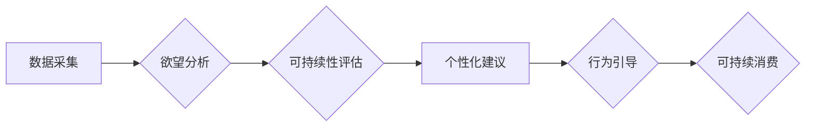

                 

## 欲望可持续性评估员：AI时代的消费伦理指南编撰者

> 关键词：人工智能、消费伦理、可持续发展、算法、数据分析、预测模型、行为引导、社会影响

## 1. 背景介绍

在当今数据爆炸和人工智能飞速发展的时代，消费行为正在经历前所未有的变革。互联网、社交媒体和移动设备的普及，使得消费者信息更加丰富，消费决策更加个性化和碎片化。与此同时，人工智能技术在数据分析、预测模型和行为引导等方面取得了突破性进展，为企业提供了精准营销和个性化推荐的强大工具。

然而，这种技术进步也引发了新的伦理问题。人工智能驱动的消费推荐系统，可能会加剧过度消费、物质主义和社会不平等等问题。消费者在算法的引导下，更容易陷入“欲望陷阱”，盲目追求满足感，而忽视自身需求和社会责任。

因此，我们需要思考如何利用人工智能技术，促进可持续消费，引导消费者做出更加理性、负责任的消费决策。

## 2. 核心概念与联系

**2.1 欲望可持续性评估员**

“欲望可持续性评估员”是一个概念性框架，旨在利用人工智能技术，评估和引导消费者的欲望，使其更加可持续。

**2.2 核心概念**

* **欲望：** 指消费者对某种商品或服务的强烈渴望，是消费行为的驱动力。
* **可持续性：** 指满足当前需求，同时不损害未来世代满足自身需求的能力。
* **人工智能：** 指能够模拟人类智能的计算机系统，例如机器学习、自然语言处理等。

**2.3 联系**

人工智能技术可以帮助我们更好地理解消费者的欲望，并根据其个人特征、消费行为和社会环境，提供个性化的可持续消费建议。

**2.4 流程图**



## 3. 核心算法原理 & 具体操作步骤

**3.1 算法原理概述**

欲望可持续性评估算法的核心是基于机器学习的预测模型，通过分析消费者的历史数据，预测其未来的消费行为，并评估其消费行为的可持续性。

**3.2 算法步骤详解**

1. **数据采集:** 收集消费者的各种数据，包括购买记录、浏览历史、社交媒体行为、个人信息等。
2. **数据预处理:** 对收集到的数据进行清洗、转换和特征提取，以便于模型训练。
3. **模型训练:** 利用机器学习算法，例如深度学习、支持向量机等，训练预测模型，预测消费者的未来消费行为。
4. **可持续性评估:** 基于预设的可持续性指标，例如环境影响、社会责任、经济效益等，评估消费者的消费行为的可持续性。
5. **个性化建议:** 根据消费者的消费行为预测和可持续性评估结果，提供个性化的可持续消费建议。
6. **行为引导:** 通过个性化推荐、价格激励、社交影响等方式，引导消费者做出更加可持续的消费决策。

**3.3 算法优缺点**

* **优点:**

    * 能够精准预测消费者的消费行为。
    * 可以根据个体差异提供个性化建议。
    * 有助于引导消费者做出更加理性、负责任的消费决策。

* **缺点:**

    * 数据隐私和安全问题。
    * 算法可能存在偏差，导致不公平的结果。
    * 消费者可能过度依赖算法建议，丧失自主决策能力。

**3.4 算法应用领域**

* **电商平台:** 提供个性化推荐、促进行业循环经济。
* **金融机构:** 评估消费者的信用风险和可持续性。
* **政府部门:** 制定政策，引导消费者行为，促进可持续发展。

## 4. 数学模型和公式 & 详细讲解 & 举例说明

**4.1 数学模型构建**

我们使用一个简单的线性回归模型来预测消费者的未来消费金额。

$$
y = \beta_0 + \beta_1 x_1 + \beta_2 x_2 + \epsilon
$$

其中：

* $y$：预测的消费金额
* $\beta_0$：截距
* $\beta_1$：特征 $x_1$ 的系数
* $\beta_2$：特征 $x_2$ 的系数
* $x_1$：消费者的收入
* $x_2$：消费者的年龄
* $\epsilon$：随机误差项

**4.2 公式推导过程**

通过最小二乘法，我们可以求解模型参数 $\beta_0$、$\beta_1$ 和 $\beta_2$。

**4.3 案例分析与讲解**

假设我们收集了 100 个消费者的数据，包括收入、年龄和消费金额。我们可以使用线性回归模型，训练一个预测模型，并评估其预测精度。

例如，我们可以发现模型预测结果表明，收入和年龄是影响消费金额的重要因素。

## 5. 项目实践：代码实例和详细解释说明

**5.1 开发环境搭建**

* Python 3.x
* Jupyter Notebook
* scikit-learn

**5.2 源代码详细实现**

```python
import pandas as pd
from sklearn.linear_model import LinearRegression

# 数据加载
data = pd.read_csv('消费数据.csv')

# 特征选择
X = data[['收入', '年龄']]
y = data['消费金额']

# 模型训练
model = LinearRegression()
model.fit(X, y)

# 模型评估
# ...

# 预测
new_data = pd.DataFrame({'收入': [50000], '年龄': [30]})
prediction = model.predict(new_data)
print(prediction)
```

**5.3 代码解读与分析**

* 我们首先使用 pandas 库加载消费数据。
* 然后，我们选择收入和年龄作为特征，消费金额作为目标变量。
* 使用 scikit-learn 库中的 LinearRegression 模型训练预测模型。
* 最后，我们使用训练好的模型预测新数据的消费金额。

**5.4 运行结果展示**

运行代码后，我们可以得到新数据的预测消费金额。

## 6. 实际应用场景

**6.1 电商平台**

* 个性化推荐：根据用户的消费历史和偏好，推荐可持续产品，例如环保产品、二手商品等。
* 促进行业循环经济：鼓励用户购买二手商品、租赁产品，减少资源浪费。

**6.2 金融机构**

* 评估消费者的信用风险和可持续性：根据消费者的消费行为和可持续性指标，评估其信用风险和可持续性，为贷款和投资决策提供参考。

**6.3 政府部门**

* 制定政策，引导消费者行为，促进可持续发展：根据消费者的消费行为数据，制定政策，鼓励消费者购买可持续产品，减少过度消费。

**6.4 未来应用展望**

* 结合虚拟现实和增强现实技术，为消费者提供更加沉浸式的可持续消费体验。
* 利用区块链技术，构建可信的消费数据平台，促进数据共享和协同治理。

## 7. 工具和资源推荐

**7.1 学习资源推荐**

* **书籍:**

    * 《人工智能：一种现代方法》
    * 《深度学习》

* **在线课程:**

    * Coursera: 人工智能
    * edX: 深度学习

**7.2 开发工具推荐**

* **Python:** 

    * scikit-learn
    * TensorFlow
    * PyTorch

* **数据可视化工具:**

    * Tableau
    * Power BI

**7.3 相关论文推荐**

* **可持续消费行为预测:**

    * "Predicting Sustainable Consumption Behavior Using Machine Learning"

* **人工智能伦理:**

    * "Ethical Considerations in Artificial Intelligence"

## 8. 总结：未来发展趋势与挑战

**8.1 研究成果总结**

欲望可持续性评估算法为促进可持续消费提供了新的思路和方法。

**8.2 未来发展趋势**

* 模型精度提升：利用更先进的机器学习算法和数据分析技术，提高模型预测精度。
* 跨领域融合：将人工智能技术与其他领域，例如心理学、经济学等，进行融合，构建更加全面的可持续消费评估模型。
* 个性化引导：根据用户的个性化需求和行为特征，提供更加精准和有效的可持续消费引导。

**8.3 面临的挑战**

* 数据隐私和安全问题：如何保护消费者的隐私数据，防止数据滥用。
* 算法偏见问题：如何避免算法产生偏见，确保公平公正的结果。
* 人机交互问题：如何设计更加人性化的人机交互方式，引导消费者积极参与可持续消费。

**8.4 研究展望**

未来，我们将继续致力于研究欲望可持续性评估算法，探索人工智能技术在促进可持续消费方面的更多应用场景，并积极应对算法伦理和社会影响等挑战。

## 9. 附录：常见问题与解答

**9.1 如何保证算法的公平性？**

* 使用多元化数据样本，避免算法训练过程中出现偏见。
* 定期评估算法的公平性，并进行调整和优化。
* 建立透明的算法评估机制，公开算法的原理和结果。

**9.2 如何保护消费者的隐私数据？**

* 采用数据加密和匿名化技术，保护消费者的个人信息。
* 明确告知消费者数据使用目的和方式，获得其同意。
* 建立完善的数据安全管理制度，防止数据泄露和滥用。


作者：禅与计算机程序设计艺术 / Zen and the Art of Computer Programming 
<end_of_turn>

