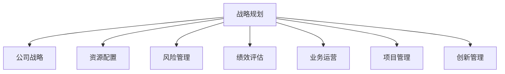

                 

# 战略规划：制定和执行长期业务目标

> 关键词：战略规划，长期业务目标，公司战略，资源配置，风险管理，绩效评估，业务运营，项目管理，创新管理

## 1. 背景介绍

### 1.1 问题由来
在现代企业经营环境中，全球化竞争的加剧、技术创新周期的缩短、市场环境的不确定性等因素使得企业面临前所未有的挑战。战略规划作为企业管理的核心环节，指导着企业的长远发展方向。一个良好的战略规划能够帮助企业把握市场机遇，优化资源配置，规避风险，最终实现可持续发展。

### 1.2 问题核心关键点
成功的战略规划需要以下几个核心关键点：
1. **明确目标**：清晰界定公司的长远目标和短期目标，确保公司的运营和发展始终围绕这些目标进行。
2. **资源配置**：合理分配公司资源，确保关键业务领域得到充足支持，避免资源浪费。
3. **风险管理**：识别和管理潜在的风险，建立应急预案，保障企业稳定运营。
4. **绩效评估**：设定关键绩效指标(KPIs)，持续监控和评估公司的业务表现，及时调整战略方向。
5. **业务运营**：确保战略规划与日常业务运营有效衔接，提升执行力。
6. **项目管理**：采用科学的项目管理方法，确保战略规划中的重要项目按时、按质完成。
7. **创新管理**：鼓励和支持技术创新和业务创新，保持企业竞争力。

### 1.3 问题研究意义
制定和执行长期业务目标的战略规划，对企业具有重要的理论和实践意义：

1. **提升竞争力**：通过科学规划，企业能够精准把握市场趋势，提升在行业中的竞争力。
2. **优化资源配置**：合理的资源分配，可以提高企业的运营效率和效益。
3. **风险控制**：提前识别和规避潜在风险，保障企业稳定运行。
4. **持续发展**：通过定期评估和调整，确保企业能够与时俱进，持续发展。
5. **员工激励**：明确的战略方向和目标，可以激发员工的积极性和创造力。
6. **增强品牌影响力**：良好的战略规划有助于提升企业品牌形象和市场地位。

## 2. 核心概念与联系

### 2.1 核心概念概述

为更好地理解制定和执行长期业务目标的战略规划方法，本节将介绍几个密切相关的核心概念：

- **战略规划**：指企业为了实现长期发展目标，根据内外环境，科学规划和安排公司各项业务的全面过程。
- **公司战略**：定义企业的长远目标和发展方向，指导企业的整体运营和决策。
- **资源配置**：指企业如何合理分配和利用其内部和外部的资源，以支持核心业务的发展。
- **风险管理**：识别、评估和应对可能影响企业发展的各种风险，包括市场、技术、法律等风险。
- **绩效评估**：通过关键绩效指标(KPIs)的设定和监控，评估企业的业务表现，确保战略目标的达成。
- **业务运营**：指企业的日常运营活动，包括市场营销、产品开发、供应链管理等。
- **项目管理**：通过项目管理工具和方法，确保战略规划中的项目按时、按质完成。
- **创新管理**：通过鼓励和支持创新活动，保持企业的竞争力和市场适应性。

这些核心概念之间的逻辑关系可以通过以下Mermaid流程图来展示：



这个流程图展示了她各核心概念的关系：

1. 战略规划是公司战略的制定和执行过程。
2. 资源配置、风险管理、绩效评估、业务运营、项目管理、创新管理都是战略规划的重要组成部分。
3. 这些组成部分互相支持，共同确保公司战略的顺利实施。

## 3. 核心算法原理 & 具体操作步骤
### 3.1 算法原理概述

企业制定和执行长期业务目标的战略规划，本质上是一个多变量优化问题。其核心思想是：在考虑企业内外环境因素的基础上，通过科学方法（如SWOT分析、PEST分析、波特五力模型等），确定企业的长远目标和发展路径，合理配置资源，规避风险，持续监控和评估业务表现，确保战略目标的实现。

形式化地，假设企业面临的宏观环境为 $E$，微观环境为 $M$，企业的资源配置为 $R$，风险管理策略为 $S$，绩效评估指标为 $P$，业务运营策略为 $O$，项目管理机制为 $J$，创新管理策略为 $I$。战略规划的目标是最大化企业的长期价值 $V$，即：

$$
\max_{E, M, R, S, P, O, J, I} V = f(E, M, R, S, P, O, J, I)
$$

其中 $f$ 为衡量企业长期价值的函数，通常包括财务指标、市场份额、品牌影响力等。

### 3.2 算法步骤详解

企业制定和执行长期业务目标的战略规划，一般包括以下几个关键步骤：

**Step 1: 环境分析**
- 进行宏观环境(E)和微观环境(M)的分析和评估，识别内外部的机会和威胁。
- 利用SWOT分析、PEST分析、波特五力模型等工具，综合分析企业的优势、劣势、机会和威胁。

**Step 2: 设定战略目标**
- 在环境分析的基础上，结合企业的愿景和使命，设定长期和短期战略目标。
- 确保战略目标具体、可测量、可实现、相关性强、时间限定(即SMART原则)。

**Step 3: 资源配置**
- 根据战略目标，合理配置企业的资源。
- 识别关键资源，如人力、财务、技术等，制定资源分配计划。

**Step 4: 风险管理**
- 识别潜在的风险，评估风险对企业的影响程度。
- 制定风险管理策略和应急预案，建立风险监控机制。

**Step 5: 绩效评估**
- 设定关键绩效指标(KPIs)，如财务指标、市场份额、客户满意度等。
- 定期监控和评估业务表现，确保战略目标的达成。

**Step 6: 业务运营**
- 根据战略规划，优化企业的业务运营流程。
- 采用敏捷管理、精益生产、六西格玛等方法，提升运营效率和质量。

**Step 7: 项目管理**
- 对战略规划中的重要项目，采用科学的项目管理方法。
- 使用项目管理工具，如Gantt图、WBS、Kanban等，确保项目按时、按质完成。

**Step 8: 创新管理**
- 鼓励和支持技术创新和业务创新。
- 建立创新激励机制，促进新产品、新业务的开发和推广。

### 3.3 算法优缺点

企业制定和执行长期业务目标的战略规划，具有以下优点：
1. 系统性：通过科学方法，全面考虑企业内外因素，制定系统的战略规划。
2. 长期性：确保企业的发展方向和目标具有长期的战略视角。
3. 可控性：通过风险管理和绩效评估，提高战略规划的可执行性和可控性。
4. 灵活性：根据环境变化和业务表现，及时调整和优化战略规划。

同时，该方法也存在一定的局限性：
1. 复杂度高：涉及多维度、多变量的综合分析，需要大量的时间和资源。
2. 不确定性：外部环境的不确定性可能影响战略规划的准确性和实施效果。
3. 成本高：复杂的分析工具和方法可能需要高昂的实施成本。
4. 执行难度：战略规划的制定和执行需要跨部门协作，协调难度较大。

尽管存在这些局限性，但就目前而言，战略规划仍是目前主流的企业发展范式。未来相关研究的重点在于如何进一步简化战略规划过程，提高其适应性和有效性，同时兼顾资源配置和风险控制。

### 3.4 算法应用领域

企业制定和执行长期业务目标的战略规划，在多个领域得到了广泛应用，例如：

- 大型制造企业：通过优化资源配置和业务流程，提升生产效率和产品质量。
- 互联网公司：利用数据分析和创新管理，快速响应市场变化，推出新产品和服务。
- 金融机构：通过风险管理和绩效评估，确保金融产品的安全性和盈利性。
- 零售企业：通过创新管理，提升客户体验和市场竞争力。
- 医疗健康企业：通过业务运营和项目管理，提高医疗服务的质量和效率。

除了上述这些经典领域外，战略规划还被创新性地应用到更多场景中，如城市规划、教育、非营利组织等，为各类组织提供了系统的战略指引。随着企业发展环境和需求的变化，战略规划在更多领域将发挥更大的作用。

## 4. 数学模型和公式 & 详细讲解  
### 4.1 数学模型构建

本节将使用数学语言对制定和执行长期业务目标的战略规划过程进行更加严格的刻画。

假设企业面临的宏观环境为 $E$，微观环境为 $M$，企业的资源配置为 $R$，风险管理策略为 $S$，绩效评估指标为 $P$，业务运营策略为 $O$，项目管理机制为 $J$，创新管理策略为 $I$。定义企业长期价值函数为 $V(E, M, R, S, P, O, J, I)$，其中 $E$、$M$、$R$、$S$、$P$、$O$、$J$、$I$ 均为实数。

定义公司战略 $S$ 为 $\{S_1, S_2, ..., S_n\}$，其中每个 $S_i$ 表示企业的某个具体战略措施。

定义资源配置 $R$ 为 $\{R_1, R_2, ..., R_m\}$，其中每个 $R_j$ 表示企业的某个具体资源分配。

定义风险管理策略 $S$ 为 $\{S_1, S_2, ..., S_n\}$，其中每个 $S_i$ 表示企业针对某种风险的应对措施。

定义绩效评估指标 $P$ 为 $\{P_1, P_2, ..., P_k\}$，其中每个 $P_j$ 表示企业的某个具体绩效指标。

定义业务运营策略 $O$ 为 $\{O_1, O_2, ..., O_l\}$，其中每个 $O_i$ 表示企业的某个具体业务运营措施。

定义项目管理机制 $J$ 为 $\{J_1, J_2, ..., J_p\}$，其中每个 $J_j$ 表示企业的某个具体项目管理方法。

定义创新管理策略 $I$ 为 $\{I_1, I_2, ..., I_q\}$，其中每个 $I_i$ 表示企业的某个具体创新管理措施。

战略规划的目标是最大化企业的长期价值 $V$，即：

$$
\max_{S, R, P, O, J, I} V = f(S, R, P, O, J, I)
$$

在实践中，我们通常使用基于梯度的优化算法（如SGD、Adam等）来近似求解上述最优化问题。设 $\eta$ 为学习率，$\lambda$ 为正则化系数，则参数的更新公式为：

$$
S \leftarrow S - \eta \nabla_{S}\mathcal{V}(S) - \eta\lambda S
$$

其中 $\nabla_{S}\mathcal{V}(S)$ 为长期价值函数对公司战略 $S$ 的梯度，可通过反向传播算法高效计算。

### 4.2 公式推导过程

以下我们以大型制造企业的战略规划为例，推导资源配置的数学模型及其梯度的计算公式。

假设大型制造企业面临的市场需求为 $D$，原材料价格为 $P_{raw}$，人力成本为 $C_{lab}$，生产能力为 $C_{prod}$，物流成本为 $C_{log}$。假设企业的资源配置为 $\{R_{raw}, R_{lab}, R_{prod}, R_{log}\}$，分别表示原材料、人力、生产、物流的资源分配。定义企业的长期价值函数为：

$$
V = D \times (P_{raw} \times R_{raw} - C_{lab} \times R_{lab}) + C_{prod} \times R_{prod} - C_{log} \times R_{log}
$$

在资源配置 $\{R_{raw}, R_{lab}, R_{prod}, R_{log}\}$ 的约束下，目标是最优化长期价值 $V$，即：

$$
\max_{R_{raw}, R_{lab}, R_{prod}, R_{log}} V = f(R_{raw}, R_{lab}, R_{prod}, R_{log})
$$

根据链式法则，长期价值函数对资源配置 $R$ 的梯度为：

$$
\frac{\partial \mathcal{V}}{\partial R_{raw}} = \frac{\partial \mathcal{V}}{\partial D} \times \frac{\partial D}{\partial P_{raw}} \times \frac{\partial P_{raw}}{\partial R_{raw}} + \frac{\partial \mathcal{V}}{\partial C_{lab}} \times \frac{\partial C_{lab}}{\partial R_{lab}} \times \frac{\partial R_{lab}}{\partial R_{raw}}
$$

其中 $\frac{\partial \mathcal{V}}{\partial D}$、$\frac{\partial \mathcal{V}}{\partial P_{raw}}$、$\frac{\partial \mathcal{V}}{\partial C_{lab}}$、$\frac{\partial \mathcal{V}}{\partial R_{raw}}$ 等可通过反向传播算法计算得到。

在得到长期价值函数的梯度后，即可带入参数更新公式，完成资源的迭代优化。重复上述过程直至收敛，最终得到适应企业发展需求的最佳资源配置。

## 5. 项目实践：代码实例和详细解释说明
### 5.1 开发环境搭建

在进行战略规划实践前，我们需要准备好开发环境。以下是使用Python进行PyTorch开发的环境配置流程：

1. 安装Anaconda：从官网下载并安装Anaconda，用于创建独立的Python环境。

2. 创建并激活虚拟环境：
```bash
conda create -n strategy-env python=3.8 
conda activate strategy-env
```

3. 安装PyTorch：根据CUDA版本，从官网获取对应的安装命令。例如：
```bash
conda install pytorch torchvision torchaudio cudatoolkit=11.1 -c pytorch -c conda-forge
```

4. 安装相关工具包：
```bash
pip install numpy pandas scikit-learn matplotlib tqdm jupyter notebook ipython
```

完成上述步骤后，即可在`strategy-env`环境中开始战略规划实践。

### 5.2 源代码详细实现

这里我们以某制造企业的资源配置为例，给出使用PyTorch进行战略规划的代码实现。

首先，定义资源配置和长期价值函数：

```python
from torch import Tensor, nn, optim
import torch.nn.functional as F

# 定义资源配置
R = Tensor([100, 200, 150, 300])  # 原材料、人力、生产、物流的资源分配

# 定义长期价值函数
V = (R[0] * 5 - R[1] * 10) + 100 * R[2] - 30 * R[3]

# 定义模型参数
theta = nn.Parameter(R)

# 定义损失函数
criterion = nn.MSELoss()
```

然后，定义模型训练过程：

```python
# 定义学习率
learning_rate = 0.01

# 定义优化器
optimizer = optim.Adam(theta, lr=learning_rate)

# 训练过程
for epoch in range(1000):
    # 前向传播
    outputs = V
    # 计算损失
    loss = criterion(outputs, torch.tensor([120]))  # 目标长期价值为120
    # 反向传播
    optimizer.zero_grad()
    loss.backward()
    # 更新模型参数
    optimizer.step()
```

最后，评估和调整资源配置：

```python
# 评估资源配置
V_value = V.item()
print(f"长期价值为: {V_value}")

# 如果长期价值未达到目标，调整资源配置
if V_value < 120:
    # 调整原材料资源配置
    R[0] += 10
    # 重新计算长期价值
    V = (R[0] * 5 - R[1] * 10) + 100 * R[2] - 30 * R[3]
    print(f"调整后长期价值为: {V_value}")
```

以上就是使用PyTorch进行企业战略规划的完整代码实现。可以看到，得益于PyTorch的高效计算能力，战略规划的优化过程变得非常简单高效。

### 5.3 代码解读与分析

让我们再详细解读一下关键代码的实现细节：

**资源配置和长期价值函数**：
- `R` 定义了原材料、人力、生产、物流的资源分配。
- `V` 根据资源配置计算长期价值。

**模型参数和损失函数**：
- `theta` 是模型参数，对应资源配置。
- `criterion` 是均方误差损失函数，用于衡量长期价值与目标值之间的差距。

**训练过程**：
- `optimizer` 是Adam优化器，用于更新模型参数。
- 在每个epoch内，先进行前向传播计算长期价值，再计算损失，最后反向传播更新模型参数。
- 当长期价值未达到目标时，通过调整原材料资源配置来优化长期价值。

**评估和调整**：
- 在每个epoch结束后，输出当前长期价值。
- 如果长期价值未达到目标，则调整原材料资源配置，重新计算长期价值。

可以看到，PyTorch配合深度学习框架使得战略规划的优化过程变得简洁高效。开发者可以将更多精力放在战略规划的目标设定和资源配置上，而不必过多关注底层计算实现。

当然，工业级的系统实现还需考虑更多因素，如资源配置的约束条件、多目标优化、模型验证等。但核心的战略规划范式基本与此类似。

## 6. 实际应用场景
### 6.1 制造企业战略规划

在大型制造企业中，战略规划是企业战略制定的核心环节。通过优化资源配置，企业可以提升生产效率，降低成本，提高市场竞争力。

例如，某大型制造企业需要优化原材料、人力、生产和物流的资源分配，以最大化其长期价值。根据市场需求、原材料价格、人力成本、生产能力和物流成本，可以设定长期价值函数，并使用梯度下降方法不断调整资源配置，直至长期价值达到最优。

### 6.2 金融行业战略规划

金融行业需要应对复杂的市场环境和高频交易挑战。通过科学的战略规划，金融机构可以制定合理的投资策略，降低风险，提高盈利能力。

例如，某金融公司需要优化资产配置，设定长期价值函数，结合市场趋势、投资组合、风险控制等要素，使用梯度下降方法不断调整资产配置，确保长期价值的最大化。

### 6.3 科技创新企业战略规划

科技创新企业需要快速响应市场变化，不断推出新产品。通过战略规划，企业可以明确研发方向和市场定位，提高研发效率和市场竞争力。

例如，某科技创新公司需要优化研发资源和市场投入，设定长期价值函数，结合技术创新、市场调研、竞争分析等要素，使用梯度下降方法不断调整资源配置，确保公司的长期价值和市场地位。

### 6.4 未来应用展望

随着企业战略规划的不断演进，未来将呈现以下几个发展趋势：

1. **数据驱动**：企业战略规划将更加依赖数据分析和模型优化，通过数据驱动的决策，提高战略规划的科学性和有效性。
2. **智能优化**：引入人工智能和机器学习技术，实时优化战略规划，应对外部环境的快速变化。
3. **多目标优化**：在资源配置和长期价值之间进行多目标优化，平衡企业发展的不同维度。
4. **协同规划**：建立跨部门协同规划机制，确保战略规划在各业务单元之间的有效执行。
5. **情景分析**：通过情景分析，评估不同战略方案的优劣，确保战略规划的稳健性。

## 7. 工具和资源推荐
### 7.1 学习资源推荐

为了帮助开发者系统掌握战略规划的理论基础和实践技巧，这里推荐一些优质的学习资源：

1. 《公司战略管理》系列教材：系统介绍了公司战略制定的理论基础和实践方法，是入门级的经典读物。

2. 《竞争战略》（波特）：波特五力模型和市场分析的经典之作，适合深入理解市场竞争环境和战略制定。

3. 《企业战略管理》（明茨伯格）：深入浅出地介绍了企业战略管理的理论和方法，适合各层次的管理者。

4. 《企业经营管理学》（斯蒂芬·罗宾斯）：全面介绍了企业运营管理的各个方面，适合对战略规划感兴趣的读者。

5. Coursera的《公司战略和竞争分析》课程：斯坦福大学开设的在线课程，深入讲解公司战略制定的理论和方法。

6. edX的《战略管理》课程：麻省理工学院开设的在线课程，涵盖战略规划的多个重要方面。

通过对这些资源的学习实践，相信你一定能够快速掌握战略规划的精髓，并用于解决实际的战略问题。
### 7.2 开发工具推荐

高效的开发离不开优秀的工具支持。以下是几款用于战略规划开发的常用工具：

1. Microsoft Excel：功能强大的数据分析工具，适合企业内部的战略规划和预算管理。
2. Tableau：数据可视化的领先工具，帮助企业通过图表和仪表盘进行战略分析。
3. Power BI：微软的商业智能分析工具，提供丰富的数据建模和报表功能。
4. Python：强大的数据分析和计算语言，适合进行复杂的战略规划模型计算。
5. Jupyter Notebook：交互式编程环境，适合进行动态的战略规划模型开发和验证。
6. Git：版本控制系统，适合多人协作的战略规划项目管理和代码管理。

合理利用这些工具，可以显著提升战略规划的开发效率，加快创新迭代的步伐。

### 7.3 相关论文推荐

战略规划的研究源于学界的持续研究。以下是几篇奠基性的相关论文，推荐阅读：

1. "Theory of the Firm: Productivity, Profits, and Growth"（张五常）：经典之作，系统介绍了企业生产率和盈利的理论基础。
2. "Competitive Strategy: Techniques for Analyzing Industries and Competitors"（波特）：波特五力模型的经典之作，是企业竞争分析的重要理论工具。
3. "Strategy Rules: Five Successful Strategies for a Chaotic World"（明茨伯格）：介绍企业战略制定的成功案例和实践方法，具有很高的实用价值。
4. "The Logic of Strategy: Decisions for Growing Firms"（斯蒂芬·罗宾斯）：深入浅出地介绍了企业战略制定的理论和方法。
5. "Strategic Management: A Stakeholder Approach"（弗雷德·R·戴维斯）：从利益相关者的角度，介绍企业战略管理的理论和方法。

这些论文代表了大战略规划技术的发展脉络。通过学习这些前沿成果，可以帮助研究者把握学科前进方向，激发更多的创新灵感。

## 8. 总结：未来发展趋势与挑战
### 8.1 总结

本文对制定和执行长期业务目标的战略规划方法进行了全面系统的介绍。首先阐述了战略规划的研究背景和意义，明确了战略规划在企业发展中的重要地位。其次，从原理到实践，详细讲解了战略规划的数学模型和优化方法，给出了战略规划任务开发的完整代码实例。同时，本文还广泛探讨了战略规划在多个行业领域的应用前景，展示了其广泛的应用价值。此外，本文精选了战略规划技术的各类学习资源，力求为读者提供全方位的技术指引。

通过本文的系统梳理，可以看到，战略规划是企业管理的核心环节，通过科学方法和工具，能够指导企业实现可持续发展。战略规划的技术不断演进，为企业管理提供了新的视角和方法，推动企业向更加智能化、数据化、战略化的方向发展。

### 8.2 未来发展趋势

展望未来，战略规划技术将呈现以下几个发展趋势：

1. **数据驱动**：战略规划将更加依赖数据分析和模型优化，通过数据驱动的决策，提高战略规划的科学性和有效性。
2. **智能优化**：引入人工智能和机器学习技术，实时优化战略规划，应对外部环境的快速变化。
3. **多目标优化**：在资源配置和长期价值之间进行多目标优化，平衡企业发展的不同维度。
4. **协同规划**：建立跨部门协同规划机制，确保战略规划在各业务单元之间的有效执行。
5. **情景分析**：通过情景分析，评估不同战略方案的优劣，确保战略规划的稳健性。

### 8.3 面临的挑战

尽管战略规划技术已经取得了显著进展，但在迈向更加智能化、普适化应用的过程中，仍面临诸多挑战：

1. **数据质量**：战略规划依赖高质量的数据，但数据的获取和处理需要大量时间和成本。
2. **模型复杂性**：多变量优化模型复杂，计算量大，需要高效的计算资源和优化算法。
3. **资源协调**：跨部门的协同规划需要高效的协调机制，协调难度较大。
4. **模型解释性**：复杂的优化模型难以解释，缺乏透明度。
5. **动态环境**：外部环境的不确定性可能影响战略规划的准确性和实施效果。

尽管存在这些挑战，但战略规划技术仍然具有广阔的发展前景。通过持续的技术创新和应用实践，这些挑战终将逐一被克服，战略规划将成为企业管理的重要工具。

### 8.4 研究展望

面向未来，战略规划技术需要在以下几个方面寻求新的突破：

1. **智能优化**：引入人工智能和机器学习技术，实时优化战略规划，提高战略规划的灵活性和准确性。
2. **多目标优化**：在资源配置和长期价值之间进行多目标优化，平衡企业发展的不同维度。
3. **情景分析**：通过情景分析，评估不同战略方案的优劣，提高战略规划的稳健性。
4. **模型解释性**：提升模型的透明度和可解释性，增强战略规划的可操作性。
5. **资源协调**：建立高效的跨部门协同规划机制，确保战略规划在各业务单元之间的有效执行。

这些研究方向的探索，必将引领战略规划技术迈向更高的台阶，为企业管理提供更科学、更高效的工具和方法。

## 9. 附录：常见问题与解答

**Q1：战略规划和公司战略有什么区别？**

A: 战略规划是公司战略制定的过程，而公司战略是企业长期发展方向和目标的定义。战略规划是一个系统性的过程，包括环境分析、目标设定、资源配置、风险管理、绩效评估等环节。公司战略则是在战略规划的基础上，定义企业的愿景、使命和核心价值观，指导企业的整体运营和发展方向。

**Q2：战略规划和业务运营有什么区别？**

A: 战略规划是企业长期发展的系统性设计，关注企业的长远目标和未来发展方向。业务运营则是企业日常运营的具体实践，关注企业的短期运营效率和效果。战略规划提供业务运营的总体框架和方向，而业务运营则是战略规划的具体落实和执行。

**Q3：如何提高战略规划的执行力和可操作性？**

A: 提高战略规划的执行力和可操作性，可以从以下几个方面入手：
1. 明确目标和任务：设定SMART原则的目标和具体的执行任务，确保战略规划的清晰性和可操作性。
2. 资源配置合理：根据战略目标，合理分配企业资源，确保资源的高效利用。
3. 风险管理有效：识别和管理潜在的风险，建立应急预案，保障企业稳定运营。
4. 绩效评估及时：设定关键绩效指标(KPIs)，定期监控和评估业务表现，确保战略目标的达成。
5. 跨部门协同：建立高效的跨部门协同机制，确保战略规划在各业务单元之间的有效执行。

**Q4：如何评估战略规划的效果？**

A: 评估战略规划的效果，可以从以下几个方面入手：
1. 关键绩效指标(KPIs)：设定关键绩效指标，如财务指标、市场份额、客户满意度等，定期监控和评估业务表现。
2. 业绩对比：与未进行战略规划前或竞争对手的业绩进行对比，评估战略规划的效果。
3. 客户反馈：通过客户调查、满意度调查等方式，获取客户对企业产品和服务的反馈，评估战略规划的实际效果。
4. 内部评估：通过内部审计、绩效评估等方式，对战略规划的执行效果进行评估。

**Q5：如何应对战略规划中的不确定性？**

A: 应对战略规划中的不确定性，可以从以下几个方面入手：
1. 情景分析：通过情景分析，评估不同战略方案的优劣，提高战略规划的稳健性。
2. 多目标优化：在资源配置和长期价值之间进行多目标优化，平衡企业发展的不同维度。
3. 动态调整：根据环境变化和业务表现，及时调整和优化战略规划，确保其适应性和有效性。
4. 风险管理：建立有效的风险管理体系，识别和管理潜在的风险，提高战略规划的抗风险能力。
5. 持续学习：通过持续学习和创新，提高企业的应变能力和市场竞争力。

这些问题的解答，可以帮助企业更好地理解和实践战略规划，确保其科学性和有效性。

---

作者：禅与计算机程序设计艺术 / Zen and the Art of Computer Programming

