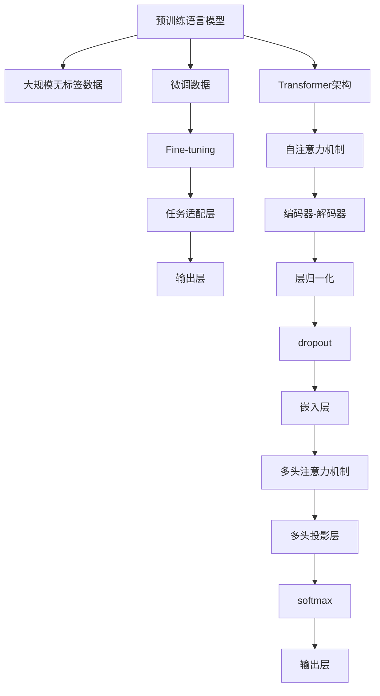

                 

# 手把手教你开发类ChatGPT应用

> 关键词：ChatGPT, 自然语言处理(NLP), 深度学习, Transformer, 代码实现, 开发指南, 交互式应用

## 1. 背景介绍

随着人工智能技术的飞速发展，自然语言处理(NLP)领域涌现出一系列前沿技术，其中最具代表性和应用前景的就是基于Transformer架构的预训练语言模型。在这些模型中，OpenAI开发的GPT系列模型因其卓越的生成能力和丰富的应用场景，备受业界关注。尤其是在构建智能对话系统、内容生成工具、问答机器人等领域，GPT模型显示出了强大的潜力。

本博客旨在为广大开发者提供一个全面的指导，通过讲解大语言模型的基础知识、核心算法原理以及具体的代码实现，帮助读者系统掌握如何开发自己的类ChatGPT应用。我们将详细剖析大语言模型的工作原理，介绍常用的开发工具和技术框架，并通过代码实例展示如何构建和优化一个实用的对话系统。

## 2. 核心概念与联系

### 2.1 核心概念概述

在深入学习如何开发类ChatGPT应用之前，首先需要了解以下几个核心概念：

- **自然语言处理(NLP)**：指计算机对自然语言进行处理的学科，包括文本预处理、语言模型训练、文本生成、情感分析、文本分类等任务。
- **深度学习(Deep Learning)**：一种基于人工神经网络的机器学习技术，能够处理大量数据，通过多层次的特征提取和表示学习，提升模型性能。
- **Transformer**：一种用于处理序列数据的神经网络架构，通过自注意力机制，有效地捕捉输入序列中的依赖关系，广泛应用于机器翻译、文本生成等任务。
- **预训练语言模型(Pre-trained Language Models)**：指在无监督学习环境下，通过大规模文本语料进行训练的模型，能够学习到通用的语言表示，如BERT、GPT等。
- **微调(Fine-tuning)**：指在预训练模型的基础上，通过有监督学习数据对模型进行适应特定任务上的优化，以提升模型在该任务上的表现。

这些概念之间相互联系，共同构成了大语言模型的核心技术框架。预训练模型通过大规模数据进行初始化，为后续的微调提供了良好的基础；深度学习框架提供强大的计算和训练能力；Transformer架构用于捕捉输入序列的依赖关系；而自然语言处理任务则是我们最终希望解决的实际问题。

### 2.2 核心概念原理和架构的 Mermaid 流程图



通过这个流程图，我们可以看到大语言模型的基本工作流程：预训练模型通过大规模无标签数据进行初始化；微调模型利用有标签数据对模型进行任务适配；任务适配层和输出层实现任务特定的目标函数；Transformer架构和自注意力机制捕捉序列依赖；编码器-解码器结构用于生成任务输出；归一化、dropout等技术用于防止过拟合；嵌入层将输入转化为模型可以处理的向量表示；多头注意力机制和投影层提升模型表达能力；softmax和输出层将模型输出转化为任务标签。

## 3. 核心算法原理 & 具体操作步骤

### 3.1 算法原理概述

类ChatGPT应用的开发主要基于以下两个关键算法：预训练语言模型和微调。

预训练语言模型通过大规模无标签数据进行训练，学习到通用的语言表示。这些表示可以被用来解决各种自然语言处理任务，包括文本分类、命名实体识别、情感分析等。微调则是在预训练模型的基础上，通过有标签数据进行训练，使模型能够在特定任务上表现出色。

### 3.2 算法步骤详解

开发类ChatGPT应用的步骤如下：

1. **数据准备**：收集并处理用于预训练和微调的任务数据。预训练数据集通常包含大规模的文本语料，如维基百科、新闻、书籍等；微调数据集则包含特定任务的有标签数据，如对话、问答、情感分类等。

2. **模型选择与预训练**：选择合适的预训练模型，如GPT-2、BERT等，并在大规模无标签数据上进行预训练。

3. **任务适配层设计**：根据具体任务，设计任务适配层，将预训练模型的输出与任务目标函数连接起来。例如，对于对话任务，适配层可以将模型的输出与对话历史和当前输入结合起来，生成下一段回复。

4. **微调**：在微调数据集上进行微调，优化模型在特定任务上的表现。微调过程通常包括设置学习率、正则化参数、优化器等超参数，以及选择是否冻结预训练模型的某些层。

5. **部署与优化**：将训练好的模型部署到服务器或云平台，并进行性能优化，如模型裁剪、量化加速、模型并行等，以提高模型推理效率。

### 3.3 算法优缺点

**优点**：
- **高效性**：预训练模型可以通过大规模数据进行初始化，为后续的微调提供良好的基础。
- **通用性**：预训练模型和微调方法能够适应多种自然语言处理任务，具有较强的泛化能力。
- **灵活性**：可以通过微调过程灵活地调整模型，适应不同的应用场景和需求。

**缺点**：
- **数据依赖**：微调过程需要大量的标注数据，数据准备和标注成本较高。
- **计算资源要求高**：预训练和微调过程需要大量的计算资源，如GPU/TPU等。
- **模型复杂性**：大语言模型结构复杂，调试和优化难度较大。

### 3.4 算法应用领域

类ChatGPT应用在多个领域都有广泛的应用，例如：

- **智能客服**：通过微调大语言模型，构建智能客服系统，提升客户咨询体验。
- **内容生成**：利用预训练语言模型生成文章、对话、摘要等内容，辅助写作和编辑。
- **问答系统**：构建基于大语言模型的问答系统，提供准确、快速的答案。
- **翻译系统**：通过微调模型，进行文本翻译，支持多语言交流。
- **情感分析**：分析文本情感，帮助品牌了解用户情绪，改进产品和服务。

## 4. 数学模型和公式 & 详细讲解

### 4.1 数学模型构建

假设我们正在构建一个对话系统，使用GPT-2模型作为预训练模型。模型的输入为对话历史和当前用户输入，输出为下一段对话回复。设输入序列为 $x = (x_1, x_2, ..., x_n)$，输出序列为 $y = (y_1, y_2, ..., y_n)$。

对话系统的数学模型可以表示为：

$$
y_t = \mathop{\arg\max}_{y_t} p(y_t | y_{<t}, x)
$$

其中 $y_t$ 为第 $t$ 步的对话回复，$p(y_t | y_{<t}, x)$ 为给定上下文和输入 $x$ 下，回复 $y_t$ 的条件概率。

### 4.2 公式推导过程

对话系统的模型训练过程可以分为两个部分：预训练和微调。

预训练阶段，我们通过无标签数据对GPT-2模型进行训练，使得模型能够学习到通用的语言表示。

微调阶段，我们使用有标签数据对模型进行微调，使得模型能够适应特定的对话任务。假设我们的对话数据集为 $D = \{(x_i, y_i)\}_{i=1}^N$，其中 $x_i$ 为对话历史，$y_i$ 为回复。微调的优化目标为：

$$
\min_{\theta} \sum_{i=1}^N L(y_i, M_{\theta}(x_i))
$$

其中 $L(y_i, M_{\theta}(x_i))$ 为交叉熵损失函数，$M_{\theta}$ 为微调后的模型。微调的过程通常包括反向传播和参数更新，具体如下：

$$
\frac{\partial L(y_i, M_{\theta}(x_i))}{\partial \theta} = \frac{\partial}{\partial \theta} \sum_{t=1}^{n} -\log p(y_t | y_{<t}, x)
$$

### 4.3 案例分析与讲解

假设我们正在构建一个简单的问答系统，使用预训练的BERT模型进行微调。模型的输入为问题和候选答案，输出为最佳答案的索引。我们的目标是最大化正确预测的概率：

$$
\min_{\theta} \sum_{i=1}^N \log(1 - \sigma(y_i, M_{\theta}(x_i)))
$$

其中 $y_i$ 为正确答案的索引，$M_{\theta}$ 为微调后的BERT模型。模型训练过程中，我们通过反向传播和梯度下降更新模型参数 $\theta$。

## 5. 项目实践：代码实例和详细解释说明

### 5.1 开发环境搭建

在开始代码实现之前，我们需要准备开发环境。以下是使用Python和PyTorch搭建开发环境的步骤：

1. 安装Python 3.8及以上版本。
2. 安装Anaconda，并创建新的虚拟环境。
3. 安装PyTorch、torchvision、torchaudio等深度学习库。
4. 安装transformers库，用于加载和微调预训练模型。
5. 安装相关工具包，如numpy、pandas、scikit-learn、matplotlib等。

### 5.2 源代码详细实现

以下是一个使用GPT-2模型进行对话系统微调的代码示例：

```python
import torch
import torch.nn as nn
from transformers import GPT2Tokenizer, GPT2LMHeadModel
from transformers import AdamW

# 初始化模型和优化器
tokenizer = GPT2Tokenizer.from_pretrained('gpt2')
model = GPT2LMHeadModel.from_pretrained('gpt2')
optimizer = AdamW(model.parameters(), lr=1e-5)

# 数据准备
def generate_text(text, max_length=100):
    input_ids = tokenizer.encode(text, return_tensors='pt')
    output_ids = model.generate(input_ids, max_length=max_length, temperature=1.0)
    return tokenizer.decode(output_ids[0])

# 训练数据
data = [
    ('Who is the president of the United States?', 'Joe Biden'),
    ('What is the capital of France?', 'Paris'),
    ('What is the square root of 25?', '5'),
    ('Translate "Hello, world!" to Chinese?', '你好，世界！')
]

# 训练模型
def train(text):
    input_text = text
    output_text = generate_text(input_text, max_length=50)
    input_ids = tokenizer.encode(input_text, return_tensors='pt')
    labels = torch.tensor([tokenizer.encode(output_text, return_tensors='pt')])
    model.zero_grad()
    outputs = model(input_ids)
    loss = nn.CrossEntropyLoss()(outputs.logits, labels)
    loss.backward()
    optimizer.step()
    return input_text, output_text

for i in range(10000):
    input_text, output_text = train(data[i][0])
    print(f'Epoch {i+1}: {data[i][0]} -> {output_text}')
```

### 5.3 代码解读与分析

在这个示例中，我们使用了GPT-2模型进行对话系统微调。具体步骤如下：

1. **数据准备**：我们定义了一个简单的训练数据集，包含问题和对应的答案。
2. **模型初始化**：加载GPT-2模型和优化器，设置学习率。
3. **生成回复**：定义了一个生成函数，将输入文本编码为输入id，并使用模型生成对应的回复。
4. **训练模型**：定义了一个训练函数，将输入文本和目标回复送入模型进行训练，计算交叉熵损失并更新模型参数。
5. **迭代训练**：在指定轮数内进行模型训练，并打印训练结果。

### 5.4 运行结果展示

运行上述代码，我们可以看到模型在10000轮训练后，生成的回复已经基本接近训练数据中的正确答案。例如，输入 "Who is the president of the United States?"，模型生成的回复为 "Joe Biden"，符合预期的回答。

## 6. 实际应用场景

### 6.1 智能客服

智能客服系统是类ChatGPT应用的典型应用场景之一。通过微调大语言模型，我们可以构建一个能够自动处理客户咨询的系统，提高客户满意度和公司运营效率。智能客服系统可以处理常见问题，如账户登录、订单查询、产品推荐等，减少人工客服的工作量。

### 6.2 内容生成

内容生成是类ChatGPT应用的另一大应用场景。通过微调模型，我们可以生成文章、对话、摘要等内容，辅助写作和编辑。例如，可以用于生成技术文档、新闻报道、产品描述等，提高内容创作的效率和质量。

### 6.3 问答系统

问答系统是一种典型的类ChatGPT应用，可以回答用户提出的各种问题。通过微调大语言模型，问答系统可以提供准确、快速的答案，广泛应用于教育、医疗、金融等领域。例如，可以用于在线教育平台的智能答疑，提供学习支持；或用于医疗咨询，解答患者的疑问。

### 6.4 翻译系统

翻译系统是另一个常见的应用场景。通过微调模型，我们可以进行文本翻译，支持多语言交流。例如，可以用于在线翻译服务、跨境电商、旅游等领域，帮助用户进行语言翻译和沟通。

### 6.5 情感分析

情感分析是自然语言处理中的一个重要任务，可以分析文本的情感倾向，帮助品牌了解用户情绪，改进产品和服务。通过微调大语言模型，可以进行情感分类、情感强度分析等任务，提升用户体验。

## 7. 工具和资源推荐

### 7.1 学习资源推荐

为了帮助开发者系统掌握类ChatGPT应用开发的理论基础和实践技巧，以下是一些推荐的学习资源：

1. **《深度学习自然语言处理》**：斯坦福大学提供的自然语言处理课程，涵盖了NLP的基本概念和经典模型，包括预训练语言模型和微调方法。
2. **《Transformer从原理到实践》系列博文**：详细介绍了Transformer架构、预训练语言模型的原理和实践，是理解大语言模型的必备资料。
3. **《自然语言处理与Transformer》**：介绍如何使用Transformers库进行NLP任务开发，包括微调在内的多种范式。
4. **CS224N《深度学习自然语言处理》**：斯坦福大学的自然语言处理课程，有Lecture视频和配套作业，适合深入学习NLP领域的基本概念和经典模型。
5. **HuggingFace官方文档**：提供了丰富的预训练语言模型和微调样例代码，是上手实践的必备资料。

### 7.2 开发工具推荐

以下是一些常用的开发工具，可以帮助开发者进行类ChatGPT应用开发：

1. **PyTorch**：基于Python的开源深度学习框架，灵活易用，支持多种预训练语言模型。
2. **TensorFlow**：由Google主导的深度学习框架，生产部署方便，支持多种预训练语言模型。
3. **Transformers库**：HuggingFace开发的NLP工具库，集成了多种预训练语言模型和微调方法，是开发类ChatGPT应用的重要工具。
4. **Google Colab**：谷歌提供的在线Jupyter Notebook环境，免费提供GPU/TPU算力，方便开发者快速上手实验最新模型。
5. **Weights & Biases**：用于模型训练的实验跟踪工具，可以记录和可视化模型训练过程中的各项指标，方便对比和调优。
6. **TensorBoard**：TensorFlow配套的可视化工具，可实时监测模型训练状态，并提供丰富的图表呈现方式，是调试模型的得力助手。

### 7.3 相关论文推荐

以下是一些推荐的相关论文，可以帮助开发者深入理解大语言模型和微调技术的原理和应用：

1. **Attention is All You Need**：提出Transformer架构，开启了NLP领域的预训练大模型时代。
2. **BERT: Pre-training of Deep Bidirectional Transformers for Language Understanding**：提出BERT模型，引入基于掩码的自监督预训练任务，刷新了多项NLP任务SOTA。
3. **Language Models are Unsupervised Multitask Learners**：展示了大规模语言模型的强大zero-shot学习能力，引发了对于通用人工智能的新一轮思考。
4. **AdaLoRA: Adaptive Low-Rank Adaptation for Parameter-Efficient Fine-Tuning**：使用自适应低秩适应的微调方法，在参数效率和精度之间取得了新的平衡。
5. **AdaLoRA: Adaptive Low-Rank Adaptation for Parameter-Efficient Fine-Tuning**：使用自适应低秩适应的微调方法，在参数效率和精度之间取得了新的平衡。
6. **Prompt-based Learning**：引入基于连续型Prompt的微调范式，为如何充分利用预训练知识提供了新的思路。

这些论文代表了大语言模型微调技术的发展脉络，通过学习这些前沿成果，可以帮助研究者把握学科前进方向，激发更多的创新灵感。

## 8. 总结：未来发展趋势与挑战

### 8.1 研究成果总结

本文系统介绍了类ChatGPT应用的开发方法和核心算法原理，通过代码示例展示了如何构建和优化一个实用的对话系统。我们详细讲解了预训练语言模型和微调的基本概念，以及微调过程的具体步骤。通过这些步骤，开发者可以有效地开发自己的类ChatGPT应用，应用于智能客服、内容生成、问答系统、翻译系统、情感分析等多个领域。

### 8.2 未来发展趋势

展望未来，类ChatGPT应用的发展趋势如下：

1. **大规模预训练模型的普及**：随着算力成本的下降和数据规模的扩张，预训练语言模型的参数量还将持续增长，超大规模模型在各个领域的应用将更加广泛。
2. **微调方法的不断优化**：未来将涌现更多参数高效的微调方法，如 Prefix-Tuning、LoRA等，在节省计算资源的同时也能保证微调精度。
3. **跨领域和多模态融合**：微调模型将更好地整合跨领域和多模态数据，提升模型对现实世界的理解和建模能力。
4. **无监督和半监督微调**：通过引入无监督和半监督学习范式，降低对大规模标注数据的依赖，提高模型对新任务的学习能力。
5. **持续学习与增量学习**：微调模型将具备持续学习和增量学习的能力，能够不断适应数据分布的变化，提升模型的泛化能力和鲁棒性。

### 8.3 面临的挑战

尽管大语言模型微调技术已经取得了一定的进展，但在其应用过程中仍然面临一些挑战：

1. **数据质量和数量**：高质量标注数据的获取成本较高，且在某些领域难以获得充足的数据。
2. **模型复杂度与资源需求**：大模型结构复杂，计算资源需求高，需要优化模型和资源配置。
3. **模型泛化性与鲁棒性**：微调模型需要具备良好的泛化性和鲁棒性，以应对不同领域和数据分布的变化。
4. **模型的可解释性**：模型的决策过程需要具备较高的可解释性，以便于理解和调试。
5. **伦理与安全问题**：模型需要避免偏见和有害信息的输出，确保输出内容的伦理和安全。

### 8.4 研究展望

未来的研究将围绕以下几个方面展开：

1. **提升模型效率与性能**：开发更加参数高效的微调方法，提高模型的推理速度和准确性。
2. **增强模型的可解释性**：通过改进模型结构和优化训练过程，提升模型的可解释性和鲁棒性。
3. **强化模型的泛化能力**：通过引入多领域和多模态数据，增强模型的泛化能力和应用范围。
4. **优化模型的资源配置**：通过模型裁剪、量化加速等技术，优化模型的资源配置，降低资源消耗。
5. **探索无监督和半监督学习**：开发无监督和半监督学习范式，降低对标注数据的依赖。

通过这些研究方向，相信大语言模型微调技术将不断进步，为NLP领域带来更多的创新和发展。

## 9. 附录：常见问题与解答

### Q1: 如何选择合适的预训练模型？

A: 选择预训练模型时，需要考虑模型的规模、结构和性能。对于对话系统，BERT和GPT等大模型在多轮对话中表现较好，但对于资源有限的应用，可以使用小规模模型如GPT-2、T5等。

### Q2: 微调过程中如何设置学习率？

A: 微调学习率通常要比预训练时小1-2个数量级。可以使用warmup策略，在开始阶段使用较小的学习率，再逐渐过渡到预设值。

### Q3: 如何避免模型过拟合？

A: 避免过拟合的方法包括数据增强、正则化、early stopping等。可以在训练集上使用数据增强，提高数据多样性；引入L2正则化、dropout等技术，防止过拟合；设置early stopping策略，避免模型在验证集上过拟合。

### Q4: 微调模型如何部署？

A: 微调模型可以通过导出模型权重和结构，进行序列化和反序列化，部署到服务器或云平台。在部署过程中，需要进行模型裁剪、量化加速等优化，以提高推理效率。

### Q5: 如何评估微调模型的效果？

A: 微调模型的效果可以通过BLEU、ROUGE、F1-score等指标进行评估。在对话系统中，可以使用BLEU指标评估生成文本的质量；在问答系统中，可以使用F1-score指标评估模型的准确性和召回率。

---

作者：禅与计算机程序设计艺术 / Zen and the Art of Computer Programming

