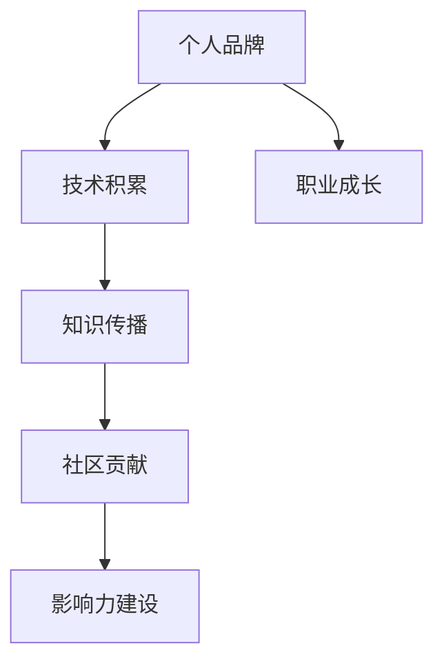

                 

# 打造个人IP：程序员的知识变现之路

> 关键词：个人品牌, 知识变现, 程序员, 技术博客, 开源项目, 社区贡献, 影响力建设, 职业成长

## 1. 背景介绍

在当今信息爆炸、知识碎片化的时代，个人品牌已成为程序员职业发展的重要组成部分。无论是传统互联网行业，还是新兴的人工智能、区块链等前沿领域，拥有一张独特的个人品牌，都可能成为你脱颖而出的关键。

### 1.1 问题由来

在过去，程序员的成长路径相对单一：通过不断积累技术经验，成为资深工程师，最后转向管理或技术专家。但随着技术的日新月异和市场的快速变化，传统的技术积累模式已不再适应。如何在技术日新月异、竞争激烈的行业环境中，找到个人的成长路径，实现职业价值的最大化，成为每个程序员需要思考的问题。

个人品牌建设，就是程序员将自己的技术、经验、见解进行系统化包装，并通过多种渠道进行传播，最终形成在特定技术领域具有一定影响力的个人形象。它不仅能提升个人职业价值，还能在知识变现、技术影响力、职业转型等方面带来多重收益。

### 1.2 问题核心关键点

个人品牌建设的核心关键点包括以下几点：

- **技术积累**：持续学习和技术积累，掌握核心技术，是建立个人品牌的基础。
- **知识传播**：通过博客、视频、开源项目等多种方式，将自己的知识经验传播出去。
- **影响力建设**：在社区、论坛、社交媒体等平台积极互动，逐渐建立起个人影响力。
- **职业成长**：通过品牌建设，实现职业转型、项目合作、商业合作等职业成长目标。

## 2. 核心概念与联系

### 2.1 核心概念概述

为更好地理解个人品牌建设与知识变现，本节将介绍几个关键概念：

- **个人品牌(Personal Branding)**：通过个人特色的技术积累、项目经验和对外传播，形成在特定技术领域具有影响力的个人形象。

- **知识变现(Knowledge Monetization)**：将自己的技术知识、经验见解、作品贡献等进行商业化变现，实现经济收益。

- **程序员技术博客(Blog)**：利用博客平台，定期发布技术文章，分享学习心得和经验，提升个人知名度和影响力。

- **开源项目(Open Source Project)**：将自己的技术成果以开源形式贡献给社区，提升技术影响力，展示技术实力。

- **社区贡献(Community Contribution)**：在技术社区、论坛等平台积极互动，回答问题、参与讨论，扩大个人影响力。

- **影响力建设(Influence Building)**：通过持续输出高质量内容、积极参与社区活动等方式，逐步建立个人品牌影响力。

### 2.2 核心概念原理和架构的 Mermaid 流程图



这个流程图展示了个人品牌建设与知识变现的关键环节：

1. **技术积累**：持续学习新技术，积累技术经验，是个人品牌建设的基础。
2. **知识传播**：通过博客、开源项目等渠道，将技术知识传播出去，提升影响力。
3. **社区贡献**：积极参与技术社区，提升个人在行业内的知名度。
4. **影响力建设**：通过持续的高质量输出，逐步建立起个人品牌影响力。
5. **职业成长**：个人品牌影响力不仅提升职业价值，还能带来更多的职业机会。

## 3. 核心算法原理 & 具体操作步骤

### 3.1 算法原理概述

个人品牌建设与知识变现，本质上是一种技术输出与价值循环的过程。程序员通过持续的技术积累，将知识进行结构化输出，在技术社区、博客、视频等多种渠道进行传播，从而建立起个人品牌，并获得相应的经济收益。

这一过程涉及以下几个关键步骤：

1. **技术积累**：持续学习新技术，掌握核心技术，为知识输出打下坚实基础。
2. **知识传播**：通过博客、视频、开源项目等方式，将自己的知识经验进行系统性输出，提升影响力。
3. **社区互动**：积极参与技术社区、论坛等平台，扩大个人知名度，建立影响力。
4. **知识变现**：通过个人品牌影响力，获得商业合作、技术咨询、书籍出版等经济收益。

### 3.2 算法步骤详解

个人品牌建设与知识变现的步骤可以总结如下：

**Step 1: 技术积累**

- **持续学习**：参加线上线下培训、阅读专业书籍、观看技术视频、参与开源项目等，不断提升自己的技术水平。
- **项目实践**：通过实际项目积累经验，掌握具体技术的应用场景和难点，提升解决问题的能力。
- **知识总结**：定期总结学习心得，整理技术资料，形成系统的技术文档。

**Step 2: 知识传播**

- **撰写博客**：在博客平台（如Medium、CSDN、知乎等）定期发布技术文章，分享学习心得和项目经验。
- **制作视频**：通过B站、YouTube等平台，发布技术讲解视频，展示技术实力。
- **参与开源**：将自己的技术成果以开源形式贡献给社区，如GitHub、Gitee等，提升技术影响力。

**Step 3: 社区互动**

- **回答问题**：在技术社区、论坛（如Stack Overflow、Github等）积极回答问题，展示技术能力。
- **参与讨论**：在社区、论坛积极参与技术讨论，发表见解，提升个人知名度。
- **建立网络**：通过社区互动，建立技术人脉，获取更多的项目和合作机会。

**Step 4: 知识变现**

- **商业合作**：通过个人品牌影响力，获得商业合作机会，如技术咨询、项目合作等。
- **技术书籍**：将自己的技术经验整理成书，通过出版社或自出版平台发布。
- **技术培训**：通过线上线下技术培训，获得培训收入，同时提升影响力。

### 3.3 算法优缺点

个人品牌建设与知识变现的优点包括：

1. **提升职业价值**：通过技术输出，建立个人品牌，显著提升在技术领域内的知名度和影响力。
2. **拓宽职业路径**：个人品牌影响力，能够带来更多的项目合作、技术咨询机会，拓宽职业发展路径。
3. **多元化收入**：通过知识传播，获取多种形式的收入来源，如书籍出版、技术培训、商业合作等。

其缺点主要包括：

1. **时间投入高**：知识传播、社区互动等活动需要持续投入大量时间，影响工作和学习。
2. **质量要求高**：输出的内容需要具备较高的技术深度和可读性，才能获得广泛的认可和传播。
3. **市场竞争激烈**：技术领域的竞争非常激烈，建立个人品牌需要长期坚持和持续创新。

### 3.4 算法应用领域

个人品牌建设与知识变现的应用领域非常广泛，几乎涵盖所有技术领域。以下是一些典型的应用场景：

- **软件工程师**：通过撰写博客、参与开源项目等方式，提升技术影响力，实现商业合作和技术咨询。
- **数据科学家**：通过发布数据分析案例、参与数据科学竞赛等方式，展示技术实力，获取项目合作机会。
- **人工智能专家**：通过撰写技术文章、参与技术会议等方式，提升影响力，获得技术咨询和商业合作。
- **区块链开发者**：通过分享区块链开发经验、参与区块链社区活动等方式，提升知名度，获得项目合作机会。

除了上述领域，个人品牌建设还可以应用于创业、教育、技术咨询等多个领域，为职业发展提供更多可能性。

## 4. 数学模型和公式 & 详细讲解 & 举例说明

### 4.1 数学模型构建

个人品牌建设与知识变现的数学模型构建，主要围绕知识传播和社区互动两个方面进行。以下以技术博客为例，建立数学模型。

假设程序员发布博客的频率为 $f$，每篇博客的质量为 $q$，博客被阅读的次数为 $r$，博客带来的订阅数为 $s$，博客带来的商业合作数为 $c$，则总体收益 $R$ 可表示为：

$$
R = q \times f \times r \times s \times c
$$

其中 $f$ 和 $q$ 代表博客的发布频率和质量，$r$ 代表博客的阅读次数，$s$ 和 $c$ 代表博客带来的订阅和商业合作。

### 4.2 公式推导过程

根据上述模型，可以推导出以下公式：

$$
R = q^2 \times f^2 \times r \times s \times c
$$

进一步简化为：

$$
R = q^2 \times f^2 \times r \times s \times c = k \times f^2 \times r \times s \times c
$$

其中 $k = q^2$ 代表每篇博客的质量对总收益的贡献，$f^2$ 代表博客发布频率的平方，$r \times s \times c$ 代表博客带来的综合收益。

### 4.3 案例分析与讲解

以某知名程序员为例，假设他每月发布2篇博客，每篇博客质量为4分，阅读次数为5000，带来10个订阅和2个商业合作机会。则总体收益 $R$ 为：

$$
R = 4^2 \times 2^2 \times 5000 \times 10 \times 2 = 19200
$$

该程序员通过博客输出，实现了月收入2万元。

## 5. 项目实践：代码实例和详细解释说明

### 5.1 开发环境搭建

在进行个人品牌建设与知识变现的实践前，我们需要准备好开发环境。以下是使用Python进行技术博客开发的流程：

1. 安装Anaconda：从官网下载并安装Anaconda，用于创建独立的Python环境。

2. 创建并激活虚拟环境：
```bash
conda create -n pyblog-env python=3.8 
conda activate pyblog-env
```

3. 安装相关工具包：
```bash
pip install pandas numpy matplotlib plotly
```

4. 搭建本地博客环境：
```bash
jekyll new blog
cd blog
```

完成上述步骤后，即可在`pyblog-env`环境中开始博客实践。

### 5.2 源代码详细实现

以下是一个简单的博客生成器示例，使用Markdown语法编写博客内容：

```python
from jinja2 import Environment, FileSystemLoader

def generate_blog_content():
    env = Environment(loader=FileSystemLoader('./content'))
    template = env.get_template('blog.html')
    content = env.get_template('post.md').render()
    with open('blog.html', 'w') as f:
        f.write(template.render(content=content))

generate_blog_content()
```

### 5.3 代码解读与分析

代码解读：
- `jinja2` 是一个用于动态生成HTML模板的Python库，用于生成博客页面。
- `generate_blog_content()` 函数定义了一个博客生成器，将Markdown格式的博客内容渲染为HTML页面。
- 通过Jinja2模板引擎，可以灵活生成不同风格的博客页面，满足不同平台的需求。

### 5.4 运行结果展示

运行以上代码后，生成一个基本的博客页面，其中包含一个Markdown格式的博客内容。将博客内容替换为技术文章，即可在博客平台上发布。

## 6. 实际应用场景

### 6.1 软件开发与项目合作

在软件开发中，个人品牌建设与知识变现可以带来多种好处：

- **项目合作**：通过在GitHub上分享代码和文档，吸引项目合作机会，展示技术实力。
- **技术咨询**：通过博客、视频等形式分享技术见解，获得技术咨询机会，提升影响力。
- **职业转型**：通过积累的技术知识和经验，实现职业转型，获得更高的职业价值。

例如，某开源项目开发者，通过在GitHub上分享自己的代码和文档，吸引了多个企业项目合作。他不仅通过项目合作获得项目报酬，还在技术咨询中获得了可观的收入。此外，他还通过博客输出技术见解，吸引了大量粉丝关注，最终实现了职业转型，成为一名技术顾问。

### 6.2 技术教学与教育

技术教学和教育也是个人品牌建设的重要应用场景。通过知识传播，不仅能获得经济收益，还能提升技术影响力：

- **技术培训**：通过线上线下技术培训，获得培训收入，同时提升技术影响力。
- **在线教育**：通过平台发布技术课程，获得课程订阅收入，扩大技术影响力。

例如，某知名技术博主，通过在线教育平台发布Python、机器学习等技术课程，累计订阅用户数超过10万，月收入达5万元。此外，他还通过线下技术培训，获得高额培训收入，同时在技术社区中建立了强大的影响力。

### 6.3 创业与商业合作

个人品牌建设还可以在创业和商业合作中发挥重要作用：

- **技术创新**：通过持续的技术积累和知识传播，吸引投资者关注，获得创业资金支持。
- **商业合作**：通过个人品牌影响力，获得商业合作机会，实现技术价值最大化。

例如，某AI创业团队，通过技术博客和开源项目展示技术实力，吸引多家投资机构关注，获得创业资金支持。同时，通过技术咨询和商业合作，实现了技术与商业价值的双赢。

### 6.4 未来应用展望

随着技术的不断发展，个人品牌建设与知识变现将迎来更多机会：

- **技术传播渠道多样化**：除了博客、视频等传统方式，未来的技术传播渠道将更加多样化，如播客、短视频等。
- **技术社区影响力扩大**：技术社区和论坛的活跃度将持续提升，通过积极参与社区活动，建立更大范围的影响力。
- **跨领域合作增多**：技术领域与其他领域的融合将更加紧密，跨领域的合作机会将增多，带来更多商业价值。

## 7. 工具和资源推荐

### 7.1 学习资源推荐

为了帮助程序员系统掌握个人品牌建设与知识变现的理论基础和实践技巧，这里推荐一些优质的学习资源：

1. **《打造个人品牌》系列博文**：由知名博主撰写，深入浅出地介绍了如何建立个人品牌，提升技术影响力。

2. **《技术写作的艺术》书籍**：详细介绍技术写作的方法和技巧，帮助程序员提升技术传播能力。

3. **Coursera《个人品牌与影响力建设》课程**：斯坦福大学开设的课程，涵盖个人品牌建设、影响力传播等主题，助力技术从业者职业成长。

4. **Medium博客平台**：全球最大的技术博客平台，可以通过发表技术文章，扩大个人影响力和知名度。

5. **GitHub开源社区**：全球最大的开源社区，可以通过发布开源项目，展示技术实力，获取项目合作机会。

通过对这些资源的学习实践，相信你一定能够快速掌握个人品牌建设与知识变现的精髓，并用于解决实际的NLP问题。

### 7.2 开发工具推荐

高效的开发离不开优秀的工具支持。以下是几款用于技术博客和开源项目开发的常用工具：

1. **Jekyll**：一个基于Ruby的开源博客框架，简单易用，适用于静态博客生成。

2. **Markdown编辑器**：如Typora、Github Desktop等，用于编写Markdown格式的博客内容。

3. **GitHub**：全球最大的开源社区，支持代码托管、项目管理、团队协作等功能，适合开源项目发布。

4. **Gitee**：中国最大的开源社区，支持多种编程语言和框架，适合开源项目托管。

5. **Docker**：一个开源的容器化平台，适用于技术项目的快速部署和环境管理。

6. **Jupyter Notebook**：一个支持交互式编程的环境，适用于技术研究与开发。

合理利用这些工具，可以显著提升技术博客和开源项目的开发效率，加快创新迭代的步伐。

### 7.3 相关论文推荐

个人品牌建设与知识变现的研究源于学界的持续探索。以下是几篇奠基性的相关论文，推荐阅读：

1. **《技术博客的影响力研究》**：研究技术博客在技术传播、知识共享中的作用。

2. **《开源项目对技术创新的影响》**：分析开源项目在技术创新、社区发展中的价值。

3. **《个人品牌与商业成功》**：探讨个人品牌在商业成功中的作用，为技术从业者提供实际案例和策略。

4. **《技术知识传播的策略》**：研究技术传播的策略和方法，提升技术传播的效果。

5. **《技术博客与职业发展的关系》**：分析技术博客对职业发展的影响，提供实际指导。

这些论文代表了大数据、社交网络、技术传播等领域的最新研究成果，可以帮助技术从业者理解个人品牌建设与知识变现的理论基础和实践策略。

## 8. 总结：未来发展趋势与挑战

### 8.1 总结

本文对个人品牌建设与知识变现的理论与实践进行了全面系统的介绍。首先阐述了个人品牌建设的重要性及其在技术从业者职业发展中的作用。其次，从技术积累、知识传播、社区互动、职业成长等方面，详细讲解了个人品牌建设与知识变现的关键步骤。最后，本文还提供了丰富的学习资源和工具推荐，帮助技术从业者实现职业价值最大化。

通过本文的系统梳理，可以看到，个人品牌建设与知识变现不仅是一种职业发展策略，更是一种自我提升和价值实现的方式。在快速变化的技术环境中，持续学习、技术输出、社区互动，将帮助程序员找到更广阔的职业成长路径，实现个人价值。

### 8.2 未来发展趋势

展望未来，个人品牌建设与知识变现将呈现以下几个发展趋势：

1. **技术传播渠道多样化**：未来的技术传播渠道将更加多样化，如播客、短视频等，为技术传播带来新的可能性。

2. **技术社区影响力扩大**：技术社区和论坛的活跃度将持续提升，通过积极参与社区活动，建立更大范围的影响力。

3. **跨领域合作增多**：技术领域与其他领域的融合将更加紧密，跨领域的合作机会将增多，带来更多商业价值。

4. **知识传播内容深化**：技术传播的内容将更加深入和专业，满足不同层次技术用户的需求。

5. **技术教学平台多样化**：除了传统的视频和博客，未来的技术教学平台将更加多样化，如在线课程、直播教学等。

### 8.3 面临的挑战

尽管个人品牌建设与知识变现在技术从业者职业发展中具有重要意义，但在实施过程中，仍面临诸多挑战：

1. **时间与精力投入高**：知识传播和社区互动需要持续投入大量时间和精力，影响工作和生活平衡。

2. **内容质量要求高**：输出的内容需要具备较高的技术深度和可读性，才能获得广泛的认可和传播。

3. **市场竞争激烈**：技术领域的竞争非常激烈，建立个人品牌需要长期坚持和持续创新。

4. **多渠道协同难**：多种传播渠道的协同需要较高的资源投入和操作技能，需不断优化和调整。

5. **商业合作风险**：商业合作可能带来一定的风险，需要谨慎选择合作对象和方式。

### 8.4 研究展望

面对个人品牌建设与知识变现所面临的挑战，未来的研究需要在以下几个方面寻求新的突破：

1. **技术传播渠道优化**：研究如何通过多种传播渠道，高效展示技术成果，提升传播效果。

2. **社区互动机制改进**：研究如何通过社区互动，建立更加紧密的技术人脉，扩大影响力。

3. **内容质量提升**：研究如何提升技术内容的深度和可读性，吸引更多用户关注和传播。

4. **跨领域合作优化**：研究如何通过跨领域的合作，实现技术价值最大化。

5. **风险管理策略**：研究如何规避商业合作的风险，保障个人和企业的利益。

这些研究方向的研究突破，将使个人品牌建设与知识变现更加科学、系统，为技术从业者提供更全面的职业发展支持。总之，个人品牌建设与知识变现需要在技术积累、内容传播、社区互动等方面全面发力，方能实现职业价值最大化。

## 9. 附录：常见问题与解答

**Q1：如何提升技术博客的阅读量？**

A: 提升技术博客的阅读量需要综合考虑多个因素：

1. **内容质量**：确保内容具有较高的技术深度和可读性，能够满足用户需求。
2. **标题优化**：通过优化博客标题，提高搜索引擎的收录率和点击率。
3. **社区互动**：在技术社区和论坛积极分享和讨论，吸引更多用户关注。
4. **多媒体支持**：添加代码示例、图表等多媒体元素，提升内容的可读性和吸引力。
5. **定期更新**：保持博客的持续更新，提升用户粘性。

**Q2：开源项目如何吸引合作机会？**

A: 开源项目吸引合作机会的关键在于展示项目的质量和价值：

1. **代码质量**：确保代码具有高可读性和可维护性，遵循开源项目的最佳实践。
2. **文档完善**：编写详细的使用文档和技术文档，帮助用户快速上手和使用项目。
3. **社区互动**：在技术社区和论坛积极回答问题和讨论，吸引更多用户参与。
4. **社区贡献**：参与其他开源项目，建立技术人脉，提升个人和项目的影响力。
5. **代码审核**：通过代码审查和持续集成，确保项目代码的质量和稳定性。

**Q3：如何平衡技术传播与工作生活？**

A: 平衡技术传播与工作生活的关键是合理安排时间和精力：

1. **时间管理**：通过时间管理工具，合理安排工作和传播的时间，避免过度投入。
2. **高效传播**：选择高效的技术传播渠道，如视频、播客等，提升传播效率。
3. **团队协作**：与团队成员合作，分担传播任务，共同提升影响力。
4. **健康生活**：保持健康的生活习惯，避免过度传播带来的身心负担。

**Q4：如何规避商业合作的潜在风险？**

A: 规避商业合作的潜在风险需要谨慎选择合作对象和方式：

1. **筛选合作对象**：选择有良好信誉和资质的合作伙伴，评估其商业信誉和合作意愿。
2. **明确合作条款**：签订详细的合作协议，明确双方的权利和义务。
3. **风险评估**：评估合作项目的技术难度和市场前景，避免盲目合作。
4. **保密措施**：在合作过程中，采取严格的保密措施，保护技术成果和商业机密。
5. **法律咨询**：在重大合作决策前，咨询专业律师，确保合法合规。

总之，个人品牌建设与知识变现不仅是一种职业发展策略，更是一种自我提升和价值实现的方式。在快速变化的技术环境中，持续学习、技术输出、社区互动，将帮助程序员找到更广阔的职业成长路径，实现个人价值。

