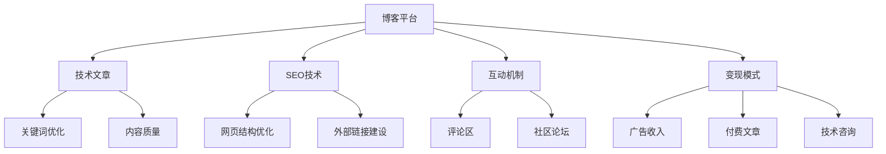

                 

# 打造个人技术博客:知识变现的基础

> 关键词：博客建设,知识变现,技术分享,编程技巧,社区互动

## 1. 背景介绍

在互联网时代，技术知识不再被视为纯粹的学术成果，而逐渐演变成一种宝贵的资产。对于广大技术工作者而言，构建个人技术博客成为了知识变现和专业成长的重要途径。通过技术博客，不仅能够分享和传播自己的专业知识，还能获得物质和精神上的双重回报。本文将系统介绍如何打造一个有价值、可持续的个人技术博客，使其成为技术分享和知识变现的重要平台。

### 1.1 问题由来
随着技术交流和合作的需求日益增长，个人技术博客作为一种技术分享和知识变现的新形式，正逐渐受到各领域技术专家的青睐。特别是在互联网、软件开发、人工智能等快速发展的技术领域，个人技术博客能够帮助作者与全球技术爱好者进行互动交流，分享最新技术动态，积累业内声誉，甚至通过博客变现获得更多收益。

### 1.2 问题核心关键点
打造一个有影响力的个人技术博客，需要关注以下几个关键点：

- **内容质量**：提供有价值、原创性的技术文章是吸引用户、建立品牌的关键。
- **用户体验**：博客界面设计简洁、导航清晰，用户体验良好。
- **SEO优化**：通过SEO优化提升博客的搜索引擎排名，吸引更多流量。
- **互动机制**：设置评论区、问答平台等互动机制，与读者进行有效沟通。
- **变现模式**：通过广告、付费文章、技术咨询等方式变现博客收益。

## 2. 核心概念与联系

### 2.1 核心概念概述

要打造一个成功的个人技术博客，首先需要了解几个核心概念及其相互关系：

- **博客平台**：如WordPress、GitHub Pages等，提供发布和管理技术文章的基础功能。
- **技术文章**：包含原创性、深度、广度并具有实用性的技术分享内容。
- **SEO技术**：搜索引擎优化，通过关键词优化、页面设计等手段提升博客在搜索引擎中的排名。
- **互动机制**：评论区、社区论坛、直播等互动功能，增强用户粘性。
- **变现模式**：通过广告收入、付费会员、技术咨询等方式实现收益。

### 2.2 核心概念原理和架构的 Mermaid 流程图



此图展示了博客平台、技术文章、SEO技术、互动机制和变现模式之间的相互关系和依赖关系。

## 3. 核心算法原理 & 具体操作步骤

### 3.1 算法原理概述

打造个人技术博客的核心在于内容的原创性和深度，同时需要关注SEO技术以提高博客的可见性。此外，通过合理的互动机制和变现模式，能够进一步增强博客的吸引力。

### 3.2 算法步骤详解

以下将详细解释每个关键步骤的操作流程：

#### 步骤1：选择合适的博客平台
- **WordPress**：功能强大，易于使用，拥有丰富的插件和主题。适合初学者和中级用户。
- **GitHub Pages**：与GitHub深度集成，适合代码示例和开源项目。适合有一定编程基础的开发者。
- **Zhihu Live**：知乎的直播平台，适合技术演讲和实时互动。适合具有一定演讲能力的开发者。

#### 步骤2：准备内容
- **选题和规划**：选择感兴趣的、具有市场需求的、前沿的技术话题，如云计算、人工智能、机器学习等。
- **撰写和优化**：保持内容的质量和原创性，同时使用合适的标题、标签、目录和图片，增加可读性。
- **SEO优化**：研究目标读者在搜索引擎中使用的关键词，优化标题、meta标签、图片ALT标签等。

#### 步骤3：发布与推广
- **发布**：在选择的博客平台上发布技术文章。
- **推广**：通过社交媒体（如Twitter、LinkedIn、Facebook）分享文章，利用SEO技术提高搜索引擎排名。

#### 步骤4：互动与变现
- **互动机制**：在文章末尾添加评论区，鼓励读者留言互动。定期在评论区回答读者提问，建立良好的互动环境。
- **变现模式**：
  - **广告收入**：通过博客平台提供广告投放服务，按点击量或展示量收费。
  - **付费文章**：通过博客平台或第三方平台，设置付费文章，针对特定读者群体提供深度技术分享。
  - **技术咨询**：提供一对一的技术咨询服务，通过邮件或实时聊天工具进行沟通。

### 3.3 算法优缺点

打造个人技术博客的算法有其明显的优缺点：

#### 优点：
- **提升技术影响力**：通过持续发布高质量技术文章，提升在技术社区中的影响力和声誉。
- **多样化的变现途径**：多种变现模式相结合，可以提升博客的整体收益。
- **广泛的受众**：通过SEO优化，吸引更多全球技术爱好者访问，扩大了知识传播的范围。

#### 缺点：
- **时间和精力投入大**：需要持续发布高质量文章，并不断进行SEO优化和互动管理。
- **内容质量要求高**：原创性、深度和广度是吸引用户的关键，需要不断提升内容质量。
- **竞争激烈**：技术领域竞争激烈，需要持续创新和不断提升博客内容。

### 3.4 算法应用领域

个人技术博客的应用领域广泛，主要集中在以下几个方面：

- **软件开发**：提供编程技巧、开发工具、框架介绍等技术文章。
- **人工智能**：分享机器学习、深度学习、自然语言处理等领域的最新研究成果和应用案例。
- **网络安全**：介绍网络安全技术、漏洞分析、防护措施等。
- **数据科学**：提供数据处理、数据可视化、大数据分析等技术分享。
- **云计算**：介绍云计算技术、云服务应用、云架构设计等。

## 4. 数学模型和公式 & 详细讲解 & 举例说明

### 4.1 数学模型构建

为了更好地理解和操作SEO技术，我们可以构建一个简单的数学模型。假设博客的访问量为$V$，搜索引擎排名为$R$，网页权重为$W$。则访问量$V$可以表示为：

$$ V = \frac{W}{k} \times R $$

其中$k$为常数，表示权重对访问量的影响程度。

### 4.2 公式推导过程

通过上述模型，我们可以推导出提升搜索引擎排名的策略：

1. **权重提升**：通过增加博客的权重$W$，可以显著提升访问量$V$。权重提升可以通过高质量内容、SEO优化、外部链接建设等方式实现。
2. **排名优化**：直接提升搜索引擎排名$R$，可以通过优化关键词、增加页面相关性、提高页面质量等方式实现。

### 4.3 案例分析与讲解

以一篇关于“深度学习框架TensorFlow 2.0新特性”的文章为例：

- **关键词优化**：在文章标题和内容中多次使用“TensorFlow 2.0”、“深度学习”等关键词。
- **内容质量**：文章详细介绍了TensorFlow 2.0的新特性，包括API变更、性能提升、新功能等，内容深度广度兼具。
- **SEO优化**：使用合适的标题标签、meta标签，包含清晰的目录和图片，并引入外部链接，提升页面的权重。

## 5. 项目实践：代码实例和详细解释说明

### 5.1 开发环境搭建

搭建博客平台的具体步骤如下：

1. **WordPress搭建**：
   - 注册域名和主机。
   - 安装WordPress并配置数据库。
   - 安装合适的主题和插件。

2. **GitHub Pages搭建**：
   - 创建GitHub仓库。
   - 安装Jekyll或Hugo框架，并配置页面布局。
   - 部署到GitHub Pages上。

3. **Zhihu Live搭建**：
   - 注册知乎账号并认证。
   - 申请Zhihu Live直播资格。
   - 设置直播内容和互动机制。

### 5.2 源代码详细实现

以使用GitHub Pages搭建技术博客为例，具体代码实现如下：

1. **安装Jekyll框架**：
```bash
gem install jekyll
```

2. **创建Jekyll项目**：
```bash
jekyll new myblog
cd myblog
```

3. **配置博客信息**：
- 在`_config.yml`文件中设置博客名称、描述、作者信息等。

4. **撰写技术文章**：
- 在`_posts`目录中添加Markdown格式的文章文件。
- 文章文件命名格式为`YYYY-MM-DD-文章标题.md`。

5. **生成静态页面**：
```bash
jekyll build
```

6. **部署到GitHub Pages**：
```bash
git init
git add .
git commit -m "Initial commit"
git remote add origin https://github.com/<你的GitHub用户名>/myblog.git
git push -u origin master
```

### 5.3 代码解读与分析

在Jekyll框架下，技术博客的实现主要依赖于Markdown和 Liquid 模板语言。Markdown用于撰写和排版技术文章，Liquid用于动态生成页面内容和展示效果。

- **Markdown**：使用Markdown语法撰写技术文章，支持标题、列表、链接、代码块等元素。
- **Liquid**：通过Liquid模板语言，动态生成页面导航、友情链接、文章列表等。

## 6. 实际应用场景

### 6.1 技术社区活跃分子
技术博客成为技术社区活跃分子的展示平台，通过分享专业知识和项目经验，提升个人品牌影响力。

### 6.2 开源项目贡献者
开源项目贡献者通过技术博客记录项目进展、分享开发心得、解答社区问题，积累业内声誉，吸引更多贡献者和用户。

### 6.3 技术公司员工
技术公司员工通过技术博客分享公司技术栈、产品案例、技术挑战和解决方案，提升公司品牌和技术声誉。

### 6.4 自由职业者
自由职业者通过技术博客展示技术能力、项目案例、服务流程和定价信息，吸引潜在客户和合作伙伴。

### 6.5 学术研究者
学术研究者通过技术博客分享最新研究进展、论文解读、技术实验等，提升学术影响力，促进学术交流。

## 7. 工具和资源推荐

### 7.1 学习资源推荐

为了帮助技术开发者系统掌握技术博客的建设技巧，这里推荐一些优质的学习资源：

1. **《打造个人品牌：从零开始建设影响力》**：介绍了如何通过技术博客和社交媒体打造个人品牌，提升影响力。
2. **《技术博客的SEO优化：从0到1》**：详细讲解了技术博客SEO优化的具体方法和技巧。
3. **《编程之美》**：深度介绍编程技巧、算法设计和最佳实践。
4. **《GitHub Pages指南》**：详细介绍了GitHub Pages的使用方法和最佳实践。
5. **《Jekyll官网文档》**：Jekyll框架的官方文档，提供了完整的配置和使用指南。

### 7.2 开发工具推荐

高效的技术博客建设离不开优秀的工具支持。以下是几款常用的技术博客建设工具：

1. **Jekyll**：基于Ruby的静态网站生成器，易于扩展和定制。
2. **Hugo**：基于Go语言的静态网站生成器，速度较快，适合构建大规模技术博客。
3. **WordPress**：功能强大的内容管理系统，适合初学者和中级开发者。
4. **GitHub Pages**：与GitHub深度集成的静态网站托管服务，适合技术项目展示。
5. **Zhihu Live**：知乎的直播平台，适合技术演讲和实时互动。

合理利用这些工具，可以显著提升技术博客的建设效率，加快创新迭代的步伐。

### 7.3 相关论文推荐

技术博客建设领域的理论和实践研究不断深入，以下是几篇经典论文，推荐阅读：

1. **《技术博客的社区影响力和知识传播》**：研究了技术博客对技术社区的影响和知识传播效果。
2. **《开源项目社区的博客建设与管理》**：介绍了开源项目社区通过技术博客进行知识共享和社区管理的方法。
3. **《技术博客SEO优化策略》**：详细分析了技术博客SEO优化的多种方法和技巧。
4. **《编程与技术博客的结合》**：探讨了编程技术与博客内容结合的多种方式。

## 8. 总结：未来发展趋势与挑战

### 8.1 研究成果总结

通过系统介绍个人技术博客的建设过程和优化方法，本文帮助读者了解如何通过技术博客实现知识变现和专业成长。

### 8.2 未来发展趋势

展望未来，技术博客建设将呈现以下几个发展趋势：

1. **内容多样化和个性化**：技术博客将从单纯的技术分享，扩展到包括教育、娱乐、生活等多样化内容，满足不同受众的需求。
2. **视频和直播结合**：技术博客结合视频和直播内容，提高用户体验和互动效果。
3. **社交媒体集成**：技术博客与社交媒体深度集成，实现内容一键分享和互动。
4. **数据驱动的SEO优化**：利用大数据分析技术，优化SEO策略，提升博客访问量。
5. **社区和协作平台**：技术博客集成社区和协作平台，提升用户参与度和知识共享效率。

### 8.3 面临的挑战

尽管技术博客建设具有良好的前景，但在迈向更广泛的受众和更深的社区参与过程中，仍面临诸多挑战：

1. **内容原创性**：保持内容的原创性和深度，避免抄袭和重复内容。
2. **SEO优化**：提高博客的搜索引擎排名，吸引更多用户访问。
3. **互动机制**：增强用户互动和社区管理，提升用户体验。
4. **变现模式**：探索多样化的变现模式，提高博客收益。
5. **技术更新**：保持技术的前沿性，不断更新博客内容和技术栈。

### 8.4 研究展望

面对技术博客建设所面临的挑战，未来的研究需要在以下几个方面寻求新的突破：

1. **自动化工具**：开发自动化工具，帮助技术开发者快速构建和管理技术博客。
2. **AI驱动的内容生成**：利用AI技术自动生成高质量博客内容，提升内容创作效率。
3. **多平台集成**：实现技术博客与社交媒体、视频平台、社区平台的深度集成，提升用户粘性和互动效果。
4. **知识图谱技术**：通过知识图谱技术，提升技术文章的知识链接和推荐效果。
5. **区块链技术**：利用区块链技术，保障技术博客内容的真实性和版权保护。

通过不断探索和创新，技术博客必将在未来成为技术知识变现和社区互动的重要平台，为技术工作者提供更加丰富的内容和服务。

## 9. 附录：常见问题与解答

### 9.1 常见问题

**Q1：如何提升技术博客的SEO效果？**

A: 提升技术博客SEO效果的关键在于关键词优化、页面结构和外部链接建设。具体措施包括：
1. 使用目标读者常用的关键词。
2. 优化标题标签、meta标签、H1标签等。
3. 使用合适的图片ALT标签。
4. 增加外部链接，尤其是高质量的反向链接。

**Q2：如何吸引更多用户访问技术博客？**

A: 吸引用户访问技术博客的策略包括：
1. 发布高质量、有深度的技术文章，提供实用信息。
2. 利用社交媒体平台推广博客内容。
3. 设置评论区，鼓励用户留言互动。
4. 定期更新博客内容，保持内容的新鲜性和时效性。

**Q3：如何利用技术博客进行知识变现？**

A: 知识变现的方式多种多样，包括：
1. 广告收入：通过博客平台提供的广告系统进行收益。
2. 付费文章：设置付费文章，针对特定读者群体提供深度技术分享。
3. 技术咨询：提供一对一的技术咨询服务。
4. 开源项目赞助：通过博客展示技术能力和项目成果，吸引赞助。

通过不断优化博客内容和互动机制，技术博客可以在提供有价值信息的同时，实现经济和社会效益的双丰收。

通过本文的系统介绍，我们详细阐述了如何打造一个有价值、可持续的个人技术博客，帮助技术工作者通过知识变现实现专业成长。希望读者能够从中受益，开启自己的技术博客之旅。

---

作者：禅与计算机程序设计艺术 / Zen and the Art of Computer Programming

