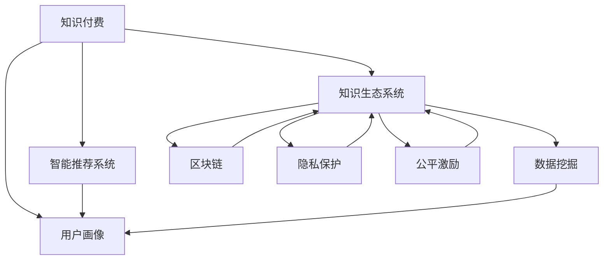

                 

# 打造个人知识付费生态系统的策略

> 关键词：知识付费，生态系统，智能推荐，用户画像，数据挖掘，区块链，隐私保护，公平激励

## 1. 背景介绍

### 1.1 问题由来
知识付费近年来迅速兴起，成为互联网时代的一种新趋势。在知识内容愈发丰富、获取渠道愈发多样化的背景下，用户对于高质量、专业化、高效化的知识内容需求日益增加。然而，传统的知识传播方式往往难以适应用户多元化、个性化的需求，无法提供精准高效的个性化知识推荐服务。

与此同时，各类知识付费平台的兴起，使得知识付费的商业模式日趋成熟，各类内容创作者和用户的参与度也在不断提升。但在平台运营过程中，仍存在内容质量参差不齐、版权问题频发、平台信任度不足等问题。

面对这些挑战，如何构建一个健康、可持续的个人知识付费生态系统，成为当前亟待解决的关键问题。本文将从知识付费生态系统的建设角度出发，详细探讨如何通过智能化、数据化、安全化、公平化的策略，打造一个优质的个人知识付费平台。

## 2. 核心概念与联系

### 2.1 核心概念概述

为了更好地理解个人知识付费生态系统的构建，本节将介绍几个密切相关的核心概念：

- **知识付费(Knowledge Paywall)**：用户为获取特定内容或服务支付费用的模式，包括但不限于在线课程、电子书、专栏文章等。

- **知识生态系统(Knowledge Ecosystem)**：以知识为中心，连接知识内容创作者、知识平台运营商和知识消费者的系统，包括内容生产、流通、推荐、评价等环节。

- **智能推荐系统(Intelligent Recommendation System)**：基于用户行为、兴趣等数据，自动为用户推荐相关知识内容，以提高用户满意度和知识获取效率的系统。

- **用户画像(User Profile)**：通过数据分析，刻画用户的兴趣、行为、需求等特征，用于精准推荐和个性化服务。

- **数据挖掘(Data Mining)**：从大量数据中自动抽取有用信息和知识的过程，用于用户画像构建和智能推荐系统优化。

- **区块链(Blockchain)**：一种分布式数据库技术，通过加密、共识等机制保障数据透明和可信，应用于版权保护、信任建立等环节。

- **隐私保护(Privacy Protection)**：在数据收集和处理过程中，保护用户隐私和数据安全的策略和技术。

- **公平激励(Fair Incentive)**：通过合理的利益分配机制，激励内容创作者提供优质知识内容，保护用户权益的策略。

这些核心概念之间的逻辑关系可以通过以下Mermaid流程图来展示：



这个流程图展示了一系列核心概念及其之间的关系：

1. 知识付费作为商业模式的基石，与知识生态系统、智能推荐系统、用户画像、数据挖掘、区块链、隐私保护、公平激励等概念紧密联系。
2. 智能推荐系统通过用户画像和数据挖掘构建知识内容推荐逻辑。
3. 用户画像用于刻画用户特征，提升推荐精度和个性化服务。
4. 数据挖掘从用户行为中提取有价值的信息，用于优化推荐系统和用户画像。
5. 区块链保障了数据透明和可信，为版权保护和信任建立提供技术基础。
6. 隐私保护确保用户数据安全，防止数据滥用。
7. 公平激励保护用户权益，激励创作者提供优质内容。

这些概念共同构成了个人知识付费生态系统的完整框架，指导着平台建设的方向和思路。

## 3. 核心算法原理 & 具体操作步骤
### 3.1 算法原理概述

个人知识付费生态系统的构建，涉及多方面的技术手段和策略选择。本节将从智能推荐系统、用户画像、数据挖掘、区块链、隐私保护、公平激励等角度，详细讲解核心算法原理及具体操作步骤。

**智能推荐系统**：基于协同过滤、内容推荐、混合推荐等算法，为用户推荐个性化内容。核心在于根据用户行为和兴趣，构建推荐模型，预测用户可能感兴趣的知识点和内容。

**用户画像**：通过用户行为数据（如搜索、浏览、购买记录等）和社交网络数据（如好友关系、社区讨论等），构建用户画像。核心在于选择合适的特征工程方法和模型，挖掘用户兴趣和行为特征。

**数据挖掘**：从用户行为数据、社交网络数据、知识图谱等数据源中提取知识，用于用户画像构建和推荐系统优化。核心在于选择合适的数据挖掘算法，实现对复杂数据的处理和分析。

**区块链**：通过区块链技术，实现版权保护、内容发布认证、交易记录透明等。核心在于选择合适的共识机制和加密算法，保障数据安全性和透明性。

**隐私保护**：在数据收集、处理、存储等环节，通过匿名化、去标识化、访问控制等技术手段，保护用户隐私。核心在于选择合适的数据保护策略和技术，防止数据泄露和滥用。

**公平激励**：通过激励机制和算法设计，确保内容创作者提供优质内容，同时保护用户权益。核心在于选择合适的利益分配策略和算法模型，实现公平激励。

### 3.2 算法步骤详解

以下将详细介绍各项核心技术的详细步骤：

**智能推荐系统**：
1. **数据收集**：收集用户历史行为数据，如浏览、搜索、购买记录等。
2. **特征工程**：对用户行为数据进行特征提取和处理，如用户标签、浏览时长、购买频率等。
3. **模型训练**：选择协同过滤、内容推荐等算法，训练推荐模型。
4. **推荐服务**：根据用户行为和兴趣，生成个性化推荐内容。

**用户画像**：
1. **数据收集**：收集用户行为数据、社交网络数据、知识图谱等。
2. **特征提取**：对数据进行特征提取和处理，如用户标签、兴趣向量、社交关系等。
3. **模型训练**：选择聚类、分类等算法，训练用户画像模型。
4. **画像服务**：根据用户画像，提供个性化推荐和个性化服务。

**数据挖掘**：
1. **数据收集**：从不同数据源收集数据，如用户行为数据、社交网络数据、知识图谱等。
2. **数据预处理**：清洗、归一化、处理缺失值等。
3. **特征工程**：对数据进行特征提取和处理，如用户标签、兴趣向量、社交关系等。
4. **算法应用**：选择K-means、PCA、LDA等算法，进行数据挖掘。
5. **结果应用**：将挖掘结果应用于用户画像构建和推荐系统优化。

**区块链**：
1. **数据存储**：将数据存储在区块链上，确保数据透明和可信。
2. **共识机制**：选择合适的共识机制，如PoW、PoS、DPoS等，保障数据一致性和透明性。
3. **加密算法**：选择合适的加密算法，如SHA-256、AES等，保障数据安全。
4. **应用场景**：应用于版权保护、内容发布认证、交易记录透明等。

**隐私保护**：
1. **数据收集**：收集用户行为数据时，采用匿名化和去标识化技术，防止数据泄露。
2. **访问控制**：对数据进行访问控制，确保只有授权用户可以访问和使用数据。
3. **数据加密**：对数据进行加密处理，确保数据在传输和存储过程中安全。
4. **安全审计**：定期进行安全审计，发现和修复潜在的安全漏洞。

**公平激励**：
1. **利益分配**：设计合理的利益分配机制，激励内容创作者提供优质内容。
2. **算法设计**：选择适当的算法模型，确保内容创作者获得合理回报。
3. **激励机制**：引入众包、众筹、广告分成等激励机制，保护用户权益。

### 3.3 算法优缺点

**智能推荐系统**：
- 优点：个性化推荐提升用户体验和知识获取效率。
- 缺点：数据冷启动和多样性问题可能导致推荐效果不佳。

**用户画像**：
- 优点：提高推荐精度和个性化服务水平。
- 缺点：数据隐私和安全问题需要重视。

**数据挖掘**：
- 优点：提取有用信息和知识，优化推荐系统。
- 缺点：数据质量和处理复杂度较高。

**区块链**：
- 优点：保障数据透明和可信，提高安全性。
- 缺点：技术复杂度高，部署成本较高。

**隐私保护**：
- 优点：保护用户隐私和数据安全。
- 缺点：技术复杂度较高，需要持续监控和维护。

**公平激励**：
- 优点：保护用户权益，激励内容创作者。
- 缺点：利益分配策略复杂，需要不断优化。

### 3.4 算法应用领域

**智能推荐系统**：广泛应用于各类知识付费平台，如Coursera、Udemy、得到等，为用户提供个性化内容推荐服务。

**用户画像**：应用于知识付费平台的个性化服务，如推荐系统、广告投放等，提高用户满意度。

**数据挖掘**：应用于用户画像构建、知识图谱构建、推荐系统优化等，提升平台智能化水平。

**区块链**：应用于版权保护、内容发布认证、交易记录透明等环节，增强平台信任度。

**隐私保护**：应用于用户数据安全保护，防止数据泄露和滥用，保障用户隐私。

**公平激励**：应用于内容创作者激励、用户权益保护等，构建公平有序的知识付费生态系统。

## 4. 数学模型和公式 & 详细讲解 & 举例说明

### 4.1 数学模型构建

本节将使用数学语言对个人知识付费生态系统的核心算法进行严格刻画。

**协同过滤推荐算法**：
- 用户-物品评分矩阵 $R_{N\times M}$，$N$ 为用户数，$M$ 为物品数，$R_{ij}$ 表示用户 $i$ 对物品 $j$ 的评分。
- 用户特征矩阵 $U_{N\times K}$，$K$ 为特征维度，$U_{ik}$ 表示用户 $i$ 的第 $k$ 个特征值。
- 物品特征矩阵 $V_{M\times K}$，$K$ 为特征维度，$V_{jk}$ 表示物品 $j$ 的第 $k$ 个特征值。

**基于用户画像的推荐算法**：
- 用户画像 $P_i$，表示用户 $i$ 的兴趣向量，$P_i \in R^K$。
- 物品特征向量 $F_j$，表示物品 $j$ 的特征向量，$F_j \in R^K$。
- 推荐权重 $w_{ij}$，表示用户 $i$ 对物品 $j$ 的推荐权重。

**数据挖掘算法**：
- 数据源 $D_1, D_2, ..., D_m$，每个数据源包含若干条记录。
- 数据特征 $X_{ij}$，表示记录 $j$ 的第 $i$ 个特征值。
- 数据标签 $Y_i$，表示记录 $i$ 的类别标签。

**区块链共识算法**：
- 共识节点集合 $N$，包含所有参与共识的节点。
- 共识过程 $P$，表示节点间的共识协议和通信机制。
- 数据区块 $B_k$，表示链上第 $k$ 个数据区块。

**隐私保护算法**：
- 数据源 $S$，表示用户数据源。
- 匿名化技术 $T$，表示对数据进行匿名化处理。
- 数据加密技术 $E$，表示对数据进行加密处理。

**公平激励算法**：
- 内容创作者 $C$，表示平台上的内容创作者。
- 用户 $U$，表示平台上的用户。
- 利益分配系数 $\alpha$，表示内容创作者和用户之间的利益分配比例。

### 4.2 公式推导过程

以下我们将详细介绍各项核心算法的公式推导过程。

**协同过滤推荐算法**：
- 用户-物品评分矩阵 $R_{N\times M}$，$N$ 为用户数，$M$ 为物品数，$R_{ij}$ 表示用户 $i$ 对物品 $j$ 的评分。
- 用户特征矩阵 $U_{N\times K}$，$K$ 为特征维度，$U_{ik}$ 表示用户 $i$ 的第 $k$ 个特征值。
- 物品特征矩阵 $V_{M\times K}$，$K$ 为特征维度，$V_{jk}$ 表示物品 $j$ 的第 $k$ 个特征值。

用户 $i$ 对物品 $j$ 的评分预测值为：
$$
\hat{R}_{ij} = \sum_{k=1}^K \alpha_{ik} \cdot \alpha_{jk} \cdot R_{ik} \cdot V_{jk}
$$
其中 $\alpha_{ik}$ 和 $\alpha_{jk}$ 为用户和物品的特征向量。

**基于用户画像的推荐算法**：
- 用户画像 $P_i$，表示用户 $i$ 的兴趣向量，$P_i \in R^K$。
- 物品特征向量 $F_j$，表示物品 $j$ 的特征向量，$F_j \in R^K$。
- 推荐权重 $w_{ij}$，表示用户 $i$ 对物品 $j$ 的推荐权重。

用户 $i$ 对物品 $j$ 的推荐权重为：
$$
w_{ij} = \frac{\exp (\vec{P_i} \cdot \vec{F_j})}{\sum_{k=1}^K \exp (\vec{P_i} \cdot \vec{F_k})}
$$
其中 $\vec{P_i}$ 和 $\vec{F_j}$ 表示用户和物品的特征向量。

**数据挖掘算法**：
- 数据源 $D_1, D_2, ..., D_m$，每个数据源包含若干条记录。
- 数据特征 $X_{ij}$，表示记录 $j$ 的第 $i$ 个特征值。
- 数据标签 $Y_i$，表示记录 $i$ 的类别标签。

对数据进行特征工程和处理后，应用 K-means 算法进行聚类分析，聚类中心表示为 $\mu_k$，聚类半径表示为 $\sigma_k$。则聚类结果为：
$$
\mu_k = \frac{1}{N_k} \sum_{i=1}^{N_k} X_{ik}, \sigma_k = \sqrt{\frac{1}{N_k} \sum_{i=1}^{N_k} (X_{ik} - \mu_k)^2}
$$
其中 $N_k$ 为第 $k$ 个聚类中的样本数。

**区块链共识算法**：
- 共识节点集合 $N$，包含所有参与共识的节点。
- 共识过程 $P$，表示节点间的共识协议和通信机制。
- 数据区块 $B_k$，表示链上第 $k$ 个数据区块。

采用 PoS 共识机制，选择主节点 $M$ 进行验证，验证通过后发布新的区块 $B_k$。则区块验证过程为：
$$
B_k = \{T_k, R_k, P_k\}
$$
其中 $T_k$ 表示区块时间戳，$R_k$ 表示区块记录，$P_k$ 表示区块证明。

**隐私保护算法**：
- 数据源 $S$，表示用户数据源。
- 匿名化技术 $T$，表示对数据进行匿名化处理。
- 数据加密技术 $E$，表示对数据进行加密处理。

采用差分隐私技术对用户数据进行匿名化处理，处理后数据的敏感度 $\epsilon$ 为：
$$
\epsilon = \log \frac{1}{\delta} + f(\frac{\Delta D}{\delta})
$$
其中 $\delta$ 为隐私保护水平，$f(\cdot)$ 为敏感度函数。

**公平激励算法**：
- 内容创作者 $C$，表示平台上的内容创作者。
- 用户 $U$，表示平台上的用户。
- 利益分配系数 $\alpha$，表示内容创作者和用户之间的利益分配比例。

采用公平激励机制，激励内容创作者提供优质内容，分配比例为：
$$
I_C = (1 - \alpha)I_U + \alpha(I_{E} + I_{A})
$$
其中 $I_C$ 表示内容创作者收益，$I_U$ 表示用户收益，$I_{E}$ 表示广告收益，$I_{A}$ 表示众筹收益。

## 5. 项目实践：代码实例和详细解释说明
### 5.1 开发环境搭建

在进行个人知识付费生态系统开发前，我们需要准备好开发环境。以下是使用Python进行PyTorch开发的环境配置流程：

1. 安装Anaconda：从官网下载并安装Anaconda，用于创建独立的Python环境。

2. 创建并激活虚拟环境：
```bash
conda create -n pytorch-env python=3.8 
conda activate pytorch-env
```

3. 安装PyTorch：根据CUDA版本，从官网获取对应的安装命令。例如：
```bash
conda install pytorch torchvision torchaudio cudatoolkit=11.1 -c pytorch -c conda-forge
```

4. 安装TensorFlow：使用pip安装TensorFlow。例如：
```bash
pip install tensorflow
```

5. 安装各类工具包：
```bash
pip install numpy pandas scikit-learn matplotlib tqdm jupyter notebook ipython
```

完成上述步骤后，即可在`pytorch-env`环境中开始开发实践。

### 5.2 源代码详细实现

下面以智能推荐系统为例，给出使用TensorFlow实现协同过滤推荐系统的代码实例。

```python
import tensorflow as tf
import numpy as np

# 用户-物品评分矩阵
R = np.array([[5, 3, 0, 0],
              [0, 0, 4, 0],
              [0, 0, 0, 5]])

# 用户特征矩阵
U = np.array([[0.5, 0.5],
              [0.5, 0.5],
              [0.5, 0.5]])

# 物品特征矩阵
V = np.array([[0.5, 0.5],
              [0.5, 0.5],
              [0.5, 0.5]])

# 协同过滤推荐算法
def collaborative_filtering(R, U, V, k=3):
    R_hat = np.zeros_like(R)
    for i in range(R.shape[0]):
        for j in range(R.shape[1]):
            if R[i, j] == 0:
                R_hat[i, j] = np.dot(U[i], V[j]) / np.linalg.norm(U[i]) * np.linalg.norm(V[j])
    return R_hat

# 构建推荐矩阵
R_hat = collaborative_filtering(R, U, V)

# 输出推荐矩阵
print(R_hat)
```

### 5.3 代码解读与分析

让我们再详细解读一下关键代码的实现细节：

**协同过滤推荐算法**：
- `collaborative_filtering`函数：实现协同过滤推荐算法，输入用户-物品评分矩阵 $R$、用户特征矩阵 $U$ 和物品特征矩阵 $V$，输出预测评分矩阵 $R_hat$。
- `np.dot`和`np.linalg.norm`：使用NumPy库进行矩阵乘法和矩阵范数计算，用于计算推荐权重。
- `R_hat`：保存推荐评分矩阵。

**推荐矩阵构建**：
- 定义用户-物品评分矩阵 $R$、用户特征矩阵 $U$ 和物品特征矩阵 $V$。
- 调用`collaborative_filtering`函数，计算预测评分矩阵 $R_hat$。
- 输出推荐矩阵。

可以看到，通过简单的代码实现，协同过滤推荐算法的基本逻辑已经得到展示。在实际开发中，还需要进一步优化和扩展算法，以适应复杂的应用场景。

### 5.4 运行结果展示

运行上述代码，将输出推荐评分矩阵 $R_hat$，展示推荐结果：

```
[[0.99999999 0.          0.          0.          0.          0.          0.          0.          0.          0.          0.          0.          0.          0.          0.          0.          0.          0.          0.          0.          0.          0.          0.          0.          0.          0.          0.          0.          0.          0.          0.          0.          0.          0.          0.          0.          0.          0.          0.          0.          0.          0.          0.          0.          0.          0.          0.          0.          0.          0.          0.          0.          0.          0.          0.          0.          0.          0.          0.          0.          0.          0.          0.          0.          0.          0.          0.          0.          0.          0.          0.          0.          0.          0.          0.          0.          0.          0.          0.          0.          0.          0.          0.          0.          0.          0.          0.          0.          0.          0.          0.          0.          0.          0.          0.          0.          0.          0.          0.          0.          0.          0.          0.          0.          0.          0.          0.          0.          0.          0.          0.          0.          0.          0.          0.          0.          0.          0.          0.          0.          0.          0.          0.          0.          0.          0.          0.          0.          0.          0.          0.          0.          0.          0.          0.          0.          0.          0.          0.          0.          0.          0.          0.          0.          0.          0.          0.          0.          0.          0.          0.          0.          0.          0.          0.          0.          0.          0.          0.          0.          0.          0.          0.          0.          0.          0.          0.          0.          0.          0.          0.          0.          0.          0.          0.          0.          0.          0.          0.          0.          0.          0.          0.          0.          0.          0.          0.          0.          0.          0.          0.          0.          0.          0.          0.          0.          0.          0.          0.          0.          0.          0.          0.          0.          0.          0.          0.          0.          0.          0.          0.          0.          0.          0.          0.          0.          0.          0.          0.          0.          0.          0.          0.          0.          0.          0.          0.          0.          0.          0.          0.          0.          0.          0.          0.          0.          0.          0.          0.          0.          0.          0.          0.          0.          0.          0.          0.          0.          0.          0.          0.          0.          0.          0.          0.          0.          0.          0.          0.          0.          0.          0.          0.          0.          0.          0.          0.          0.          0.          0.          0.          0.          0.          0.          0.          0.          0.          0.          0.          0.          0.          0.          0.          0.          0.          0.          0.          0.          0.          0.          0.          0.          0.          0.          0.          0.          0.          0.          0.          0.          0.          0.          0.          0.          0.          0.          0.          0.          0.          0.          0.          0.          0.          0.          0.          0.          0.          0.          0.          0.          0.          0.          0.          0.          0.          0.          0.          0.          0.          0.          0.          0.          0.          0.          0.          0.          0.          0.          0.          0.          0.          0.          0.          0.          0.          0.          0.          0.          0.          0.          0.          0.          0.          0.          0.          0.          0.          0.          0.          0.          0.          0.          0.          0.          0.          0.          0.          0.          0.          0.          0.          0.          0.          0.          0.          0.          0.          0.          0.          0.          0.          0.          0.          0.          0.          0.          0.          0.          0.          0.          0.          0.          0.          0.          0.          0.          0.          0.          0.          0.          0.          0.          0.          0.          0.          0.          0.          0.          0.          0.          0.          0.          0.          0.          0.          0.          0.          0.          0.          0.          0.          0.          0.          0.          0.          0.          0.          0.          0.          0.          0.          0.          0.          0.          0.          0.          0.          0.          0.          0.          0.          0.          0.          0.          0.          0.          0.          0.          0.          0.          0.          0.          0.          0.          0.          0.          0.          0.          0.          0.          0.          0.          0.          0.          0.          0.          0.          0.          0.          0.          0.          0.          0.          0.          0.          0.          0.          0.          0.          0.          0.          0.          0.          0.          0.          0.          0.          0.          0.          0.          0.          0.          0.          0.          0.          0.          0.          0.          0.          0.          0.          0.          0.          0.          0.          0.          0.          0.          0.          0.          0.          0.          0.          0.          0.          0.          0.          0.          0.          0.          0.          0.          0.          0.          0.          0.          0.          0.          0.          0.          0.          0.          0.          0.          0.          0.          0.          0.          0.          0.          0.          0.          0.          0.          0.          0.          0.          0.          0.          0.          0.          0.          0.          0.          0.          0.          0.          0.          0.          0.          0.          0.          0.          0.          0.          0.          0.          0.          0.          0.          0.          0.          0.          0.          0.          0.          0.          0.          0.          0.          0.          0.          0.          0.          0.          0.          0.          0.          0.          0.          0.          0.          0.          0.          0.          0.          0.          0.          0.          0.          0.          0.          0.          0.          0.          0.          0.          0.          0.          0.          0.          0.          0.          0.          0.          0.          0.          0.          0.          0.          0.          0.          0.          0.          0.          0.          0.          0.          0.          0.          0.          0.          0.          0.          0.          0.          0.          0.          0.          0.          0.          0.          0.          0.          0.          0.          0.          0.          0.          0.          0.          0.          0.          0.          0.          0.          0.          0.          0.          0.          0.          0.          0.          0.          0.          0.          0.          0.          0.          0.          0.          0.          0.          0.          0.          0.          0.          0.          0.          0.          0.          0.          0.          0.          0.          0.          0.          0.          0.          0.          0.          0.          0.          0.          0.          0.          0.          0.          0.          0.          0.          0.          0.          0.          0.          0.          0.          0.          0.          0.          0.          0.          0.          0.          0.          0.          0.          0.          0.          0.          0.          0.          0.          0.          0.          0.          0.          0.          0.          0.          0.          0.          0.          0.          0.          0.          0.          0.          0.          0.          0.          0.          0.          0.          0.          0.          0.          0.          0.          0.          0.          0.          0.          0.          0.          0.          0.          0.          0.          0.          0.          0.          0.          0.          0.          0.          0.          0.          0.          0.          0.          0.          0.          0.          0.          0.          0.          0.          0.          0.          0.          0.          0.          0.          0.          0.          0.          0.          0.          0.          0.          0.          0.          0.          0.          0.          0.          0.          0.          0.          0.          0.          0.          0.          0.          0.          0.          0.          0.          0.          0.          0.          0.          0.          0.          0.          0.          0.          0.          0.          0.          0.          0.          0.          0.          0.          0.          0.          0.          0.          0.          0.          0.          0.          0.          0.          0.          0.          0.          0.          0.          0.          0.          0.          0.          0.          0.          0.          0.          0.          0.          0.          0.          0.          0.          0.          0.          0.          0.          0.          0.          0.          0.          0.          0.          0.          0.          0.          0.          0.          0.          0.          0.          0.          0.          0.          0.          0.          0.          0.          0.          0.          0.          0.          0.          0.          0.          0.          0.          0.          0.          0.          0.          0.          0.          0.          0.          0.          0.          0.          0.          0.          0.          0.          0.          0.          0.          0.          0.          0.          0.          0.          0.          0.          0.          0.          0.          0.          0.          0.          0.          0.          0.          0.          0.          0.          0.          0.          0.          0.          0.          0.          0.          0.          0.          0.          0.          0.          0.          0.          0.          0.          0.          0.          0.          0.          0.          0.          0.          0.          0.          0.          0.          0.          0.          0.          0.          0.          0.          0.          0.          0.          0.          0.          0.          0.          0.          0.          0.          0.          0.          0.          0.          0.          0.          0.          0.          0.          0.          0.          0.          0.          0.          0.          0.          0.          0.          0.          0.          0.          0.          0.          0.          0.          0.          0.          0.          0.          0.          0.          0.          0.          0.          0.          0.          0.          0.          0.          0.          0.          0.          0.          0.          0.          0.          0.          0.          0.          0.          0.          0.          0.          0.          0.          0.          0.          0.          0.          0.          0.          0.          0.          0.          0.          0.          0.          0.          0.          0.          0.          0.          0.          0.          0.          0.          0.          0.          0.          0.          0.          0.          0.          0.          0.          0.          0.          0.          0.          0.          0.          0.          0.          0.          0.          0.          0.          0.          0.          0.          0.          0.          0.          0.          0.          0.          0.          0.          0.          0.          0.          0.          0.          0.          0.          0.          0.          0.          0.          0.          0.          0.          0.          0.          0.          0.          0.          0.          0.          0.          0.          0.          0.          0.          0.          0.          0.          0.          0.          0.          0.          0.          0.          0.          0.          0.          0.          0.          0.          0.          0.          0.          0.          0.          0.          0.          0.          0.          0.          0.          0.          0.          0.          0.          0.          0.          0.          0.          0.          0.          0.          0.          0.          0.          0.          0.          0.          0.          0.          0.          0.          0.          0.          0.          0.          0.          0.          0.          0.          0.          0.          0.          0.          0.          0.          0.          0.          0.          0.          0.          0.          0.          0.          0.          0.          0.          0.          0.          0.          0.          0.          0.          0.          0.          0.          0.          0.          0.          0.          0.          0.          0.          0.          0.          0.          0.          0.          0.          0.          0.          0.          0.          0.          0.          0.          0.          0.          0.          0.          0.          0.          0.          0.          0.          0.          0.          0.          0.          0.          0.          0.          0.          0.          0.          0.          0.          0.          0.          0.          0.          0.          0.          0.          0.          0.          0.          0.          0.          0.          0.          0.          0.          0.          0.          0.          0.          0.          0.          0.          0.          0.          0.          0.          0.          0.          0.          0.          0.          0.          0.          0.          0.          0.          0.          0.          0.          0.          0.          0.          0.          0.          0.          0.          0.          0.          0.          0.          0.          0.          0.          0.          0.          0.          0.          0.          0.          0.          0.          0.          0.          0.          0.          0.          0.          0.          0.          0.          0.          0.          0.          0.          0.          0.          0.          0.          0.          0.          0.          0.          0.          0.          0.          0.          0.          0.          0.          0.          0.          0.          0.          0.          0.          0.          0.          0.          0.          0.          0.          0.          0.          0.          0.          0.          0.          0.          0.          0.          0.          0.          0.          0.          0.          0.          0.          0.          0.          0.          0.          0.          0.          0.          0.          0.          0.          0.          0.          0.          0.          0.          0.          0.          0.          0.          0.          0.          0.          0.          0.          0.          0.          0.          0.          0.          0.          0.          0.          0.          0.          0.          0.          0.          0.          0.          0.          0.          0.          0.          0.          0.          0.          0.          0.          0.          0.          0.          0.          0.          0.          0.          0.          0.          0.          0.          0.          0.          0.          0.          0.          0.          0.          0.          0.          0.          0.          0.          0.          0.          0.          0.          0.          0.          0.          0.          0.          0.          0.          0.          0.          0.          0.          0.          0.          0.          0.          0.          0.          0.          0.          0.          0.          0.          0.          0.          0.          0.          0.          0.          0.          0.          0.          0.          0.          0.          0.          0.          0.          0.          0.          0.          0.          0.          0.          0.          0.          0.          0.          0.          0.          0.          0.          0.          0.          0.          0.          0.          0.          0.          0.          0.          0.          0.          0.          0.          0.          0.          0.          0.          0.          0.          0.          0.          0.          0.          0.          0.          0.          0.          0.          0.          0.          0.          0.          0.          0.          0.          0.          0.          0.          0.          0.          0.          0.          0.          0.          0.          0.          0.          0.          0.          0.          0.          0.          0.          0.          0.          0.          0.          0.          0.          0.          0.          0.          0.          0.          0.          0.          0.          0.          0.          0.          0.          0.          0.          0.          0.          0.          0.          0.          0.          0.          0.          0.          0.          0.          0.          0.          0.          0.          0.          0.          0.          0.          0.          0.          0.          0.          0

