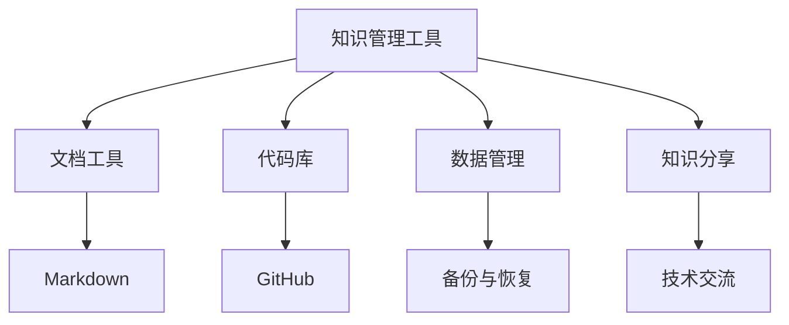

                 

# 打造个人知识管理工具:程序员实战

> 关键词：知识管理工具, 程序员, 信息组织, 代码库, 数据管理, 文档工具, 知识分享

## 1. 背景介绍

### 1.1 问题由来
在现代社会，信息爆炸和知识更新速度的加快使得个人知识管理变得尤为重要。特别是在科技领域，程序员等专业人士需要不断学习新技术、积累经验、维护文档，才能跟上行业的快速发展。但同时，大量的文档、代码、项目资料等使得个人知识管理成为一项繁琐而又复杂的工作。为了解决这个问题，开发者们开始尝试利用各种工具和方法来更好地组织和存储个人知识，从而提高工作效率和创造力。

### 1.2 问题核心关键点
本文将聚焦于利用现有的软件和技术，打造一套适用于程序员的个性化知识管理工具。该工具旨在帮助程序员更好地组织和利用个人的技术知识、项目文档、代码库等，从而提升工作效率和代码质量。核心关键点包括：

- 选择合适的软件和技术栈。
- 设计合适的信息组织结构。
- 开发和集成个性化功能。
- 提高知识管理工具的易用性。
- 确保数据安全和隐私保护。

## 2. 核心概念与联系

### 2.1 核心概念概述

- **知识管理工具**：任何辅助个人或团队组织、存储、共享和利用知识的软件或系统。常见的有文档管理、代码库、笔记应用等。
- **程序员**：从事软件开发、系统维护、测试等工作的专业人士。
- **信息组织**：通过分类、标签、目录等方法，将信息按照一定的规则进行组织，便于检索和利用。
- **代码库**：存储和共享代码的场所，如GitHub、GitLab等。
- **数据管理**：对数据进行组织、存储、备份和恢复的过程，保证数据的完整性和可用性。
- **文档工具**：用于创建、编辑、发布和管理文档的应用，如Markdown、Confluence等。
- **知识分享**：通过分享个人和团队的知识，促进技术交流和学习，提高团队整体水平。

这些核心概念之间的联系通过以下Mermaid流程图来展示：



这个流程图展示了知识管理工具与文档工具、代码库、数据管理和知识分享之间的联系。通过使用这些工具，程序员可以更好地管理自己的知识和技能，提高工作效率。

## 3. 核心算法原理 & 具体操作步骤

### 3.1 算法原理概述

打造个人知识管理工具的核心在于信息的组织和利用。通过合理的信息组织结构，以及高效的搜索和检索算法，可以极大地提升知识管理工具的实用性。本文将介绍几种常见的信息组织和搜索算法，并展示如何利用这些算法构建高效的知识管理工具。

### 3.2 算法步骤详解

#### 3.2.1 选择合适的信息组织结构

1. **标签分类**：使用标签对文档、代码和数据进行分类。例如，可以使用GitHub的“组织与团队”功能，为项目或文档创建标签。
2. **目录结构**：设计合适的目录结构，便于信息的层次化和导航。例如，可以使用Bash或Windows的文件系统，或者采用Docker的层级目录结构。
3. **知识图谱**：构建知识图谱，通过图形化的方式展示信息之间的关联。例如，可以使用Jena或Neo4j构建和查询知识图谱。

#### 3.2.2 高效的搜索和检索算法

1. **倒排索引**：构建倒排索引，快速查询包含特定关键词的文档。例如，可以使用Elasticsearch或Solr构建倒排索引。
2. **全文搜索**：使用全文搜索算法，如BM25，在大量文档中快速定位包含特定信息的内容。例如，可以使用Elasticsearch或Apache Lucene。
3. **自然语言处理**：利用自然语言处理技术，如词向量、TF-IDF等，提升搜索和检索的精准度。例如，可以使用Google的BERT或HuggingFace的Transformers库。

#### 3.2.3 实际操作步骤

1. **选择工具和环境**：根据个人需求选择合适的知识管理工具和技术栈。例如，可以使用Jekyll和GitHub Pages构建静态博客，使用Docker和Kubernetes构建容器化应用。
2. **设计信息组织结构**：设计合适的信息分类和目录结构，确保信息的层次化和可导航性。例如，可以使用Zettlr或Evernote创建和组织文档。
3. **集成搜索和检索功能**：在信息管理工具中集成倒排索引和全文搜索功能，提升信息的检索效率。例如，可以在Jekyll中使用Elasticsearch进行搜索。
4. **开发个性化功能**：开发和集成如笔记同步、版本控制、代码高亮等功能，提升工具的实用性。例如，可以使用GitHub和GitLab集成版本控制和协作功能。
5. **测试和优化**：对知识管理工具进行测试和优化，确保其稳定性和易用性。例如，可以使用Jest和Selenium进行自动化测试。

### 3.3 算法优缺点

#### 3.3.1 优点

- **高效组织**：利用标签和目录结构，可以将信息组织得更加条理清晰，便于检索和利用。
- **快速检索**：通过倒排索引和全文搜索算法，可以快速定位和检索所需的信息。
- **易于扩展**：通过使用现成的技术和框架，可以快速构建和集成新功能。
- **广泛应用**：知识管理工具可以应用于文档、代码、数据等多种信息类型。

#### 3.3.2 缺点

- **复杂度较高**：设计和实现知识管理工具需要较高的技术水平和经验。
- **数据隐私**：个人信息和敏感数据需要妥善保护，防止泄露和滥用。
- **成本较高**：某些高级功能如知识图谱、自然语言处理等可能需要较高的成本和技术门槛。
- **用户体验**：工具的易用性和可操作性直接影响使用体验，需要不断优化和改进。

### 3.4 算法应用领域

知识管理工具在多个领域都有广泛应用，例如：

- **软件开发**：通过代码库、文档工具和数据管理，提高代码质量和工作效率。
- **数据科学**：通过数据管理和知识分享，加速数据处理和分析，促进团队协作。
- **学术研究**：通过笔记工具和文档管理，组织和分享研究资料，提升科研效率。
- **教育培训**：通过知识图谱和文档管理，提供教学资源，促进知识共享和学习。
- **个人学习**：通过笔记应用和文档工具，记录和整理学习笔记，提高学习效果。

## 4. 数学模型和公式 & 详细讲解 & 举例说明

### 4.1 数学模型构建

知识管理工具的数学模型主要涉及信息组织、搜索和检索等几个方面。以下是一个简单的数学模型构建示例：

1. **信息组织模型**：
   - **标签分类**：使用二值向量表示标签和文档的关联，例如 $L=\{l_1,l_2,\dots,l_n\}$，其中 $l_i$ 表示第 $i$ 个标签，$D=\{d_1,d_2,\dots,d_m\}$ 表示所有文档。
   - **目录结构**：使用树形结构表示文档的层次关系，例如 $T=(V,E)$，其中 $V$ 表示节点，$E$ 表示边。

2. **搜索和检索模型**：
   - **倒排索引**：使用哈希表或B+树构建倒排索引，例如 $I=\{(i,t)|i\in I_t\}$，其中 $I_t$ 表示包含关键词 $t$ 的文档集。
   - **全文搜索**：使用BM25算法计算文档的相关度，例如 $R=S_t(x,q)=\sum_{i=1}^m (l_{i,t} + k_1 \cdot l_{i,d} \cdot L_t \cdot log \frac{N}{N_t})$，其中 $S_t(x,q)$ 表示文档 $x$ 的相关度，$l_{i,t}$ 表示文档 $i$ 中关键词 $t$ 的频率，$l_{i,d}$ 表示文档 $i$ 的长度，$L_t$ 表示全部文档中关键词 $t$ 的频率，$k_1$ 和 $k_2$ 是BM25算法的参数。

### 4.2 公式推导过程

#### 4.2.1 标签分类

在标签分类中，可以使用向量表示每个标签和文档的关联关系。假设有一个文档 $d$ 与标签 $l_i$ 关联，可以表示为：

$$
d_l = \{d_1, d_2, \dots, d_n\}
$$

其中 $d_l[i] = 1$ 表示文档 $d$ 与标签 $l_i$ 关联，否则为0。

#### 4.2.2 目录结构

在目录结构中，可以使用树形结构表示文档的层次关系。假设有一个文档 $d$ 在目录 $t$ 中，可以表示为：

$$
t_d = \{t_1, t_2, \dots, t_n\}
$$

其中 $t_d[i] = 1$ 表示文档 $d$ 在目录 $t_i$ 中，否则为0。

#### 4.2.3 倒排索引

在倒排索引中，可以使用哈希表或B+树表示关键词和文档的关联关系。假设有一个关键词 $t$ 与文档 $d_i$ 关联，可以表示为：

$$
I_t = \{(i_1, d_1), (i_2, d_2), \dots, (i_n, d_n)\}
$$

其中 $i_j$ 表示关键词 $t$ 与文档 $d_j$ 的关联关系，$1 \leq i_j \leq n$。

#### 4.2.4 全文搜索

在全文搜索中，可以使用BM25算法计算文档的相关度。假设有一个文档 $x$ 与查询 $q$ 相关，可以表示为：

$$
R(x,q) = \sum_{i=1}^m (l_{i,t} + k_1 \cdot l_{i,d} \cdot L_t \cdot log \frac{N}{N_t})
$$

其中 $l_{i,t}$ 表示文档 $i$ 中关键词 $t$ 的频率，$l_{i,d}$ 表示文档 $i$ 的长度，$L_t$ 表示全部文档中关键词 $t$ 的频率，$k_1$ 和 $k_2$ 是BM25算法的参数。

### 4.3 案例分析与讲解

#### 4.3.1 倒排索引

假设有一个文档数据库 $D=\{d_1, d_2, \dots, d_n\}$，包含关键词 $t_1, t_2, \dots, t_m$。构建倒排索引 $I=\{(i_1, d_1), (i_2, d_2), \dots, (i_n, d_n)\}$，可以步骤如下：

1. 遍历所有文档，统计每个文档中每个关键词的频率 $l_{i,t}$。
2. 遍历每个关键词，构建倒排索引 $I_t$，其中 $I_t=\{(i_1, d_1), (i_2, d_2), \dots, (i_n, d_n)\}$。
3. 将所有关键词的倒排索引合并为整体倒排索引 $I$。

例如，假设有一个包含5个文档和3个关键词的文档数据库，可以构建如下倒排索引：

| 关键词 | 文档1 | 文档2 | 文档3 | 文档4 | 文档5 |
| --- | --- | --- | --- | --- | --- |
| $t_1$ | (1, 1) | (2, 1) | (3, 1) | (4, 1) | (5, 1) |
| $t_2$ | (1, 2) | (3, 2) | (4, 2) | (5, 2) | ( ) |
| $t_3$ | (1, 3) | (2, 3) | (3, 3) | (5, 3) | ( ) |

#### 4.3.2 全文搜索

假设有一个查询 $q$，包含关键词 $t_1, t_2, t_3$。使用BM25算法计算文档的相关度，可以步骤如下：

1. 遍历所有文档，统计每个文档中每个关键词的频率 $l_{i,t}$。
2. 遍历每个关键词，计算文档的相关度 $R_i$。
3. 将所有文档的相关度合并为整体相关度 $R$。

例如，假设有一个包含5个文档和3个关键词的文档数据库，使用BM25算法计算查询 $q$ 的相关度：

| 文档 | $t_1$ | $t_2$ | $t_3$ | $L_t$ | $R_i$ |
| --- | --- | --- | --- | --- | --- |
| 文档1 | 3 | 2 | 1 | 1 | 1.5 |
| 文档2 | 1 | 2 | 3 | 1 | 1.5 |
| 文档3 | 2 | 3 | 2 | 1 | 1.8 |
| 文档4 | 2 | 1 | 1 | 1 | 1.5 |
| 文档5 | 1 | 3 | 2 | 1 | 2.0 |

假设 $k_1=1.2$，$k_2=0.5$，则文档的相关度计算公式为：

$$
R_i = \frac{(l_{i,t} + k_1 \cdot l_{i,d} \cdot L_t \cdot log \frac{N}{N_t})}{k_2(1 + k_1 \cdot L_t)}
$$

## 5. 项目实践：代码实例和详细解释说明

### 5.1 开发环境搭建

#### 5.1.1 工具和库

- **Python**：作为知识管理工具开发的主要语言。
- **Jekyll**：用于构建静态博客，展示文档和代码。
- **GitHub Pages**：用于托管和发布Jekyll生成的静态网站。
- **GitHub**：用于存储和版本控制文档和代码。
- **GitLab**：用于协作开发和项目管理。
- **Elasticsearch**：用于构建倒排索引和全文搜索功能。
- **Markdown**：用于编写和格式化文档。

#### 5.1.2 安装和配置

1. **安装Python**：
   - 在Linux或MacOS上，可以使用包管理器安装Python，如apt-get、brew等。
   - 在Windows上，可以使用Anaconda或Miniconda安装Python。

2. **安装Jekyll**：
   - 在命令行中运行 `gem install jekyll` 安装Jekyll。
   - 创建Jekyll项目，运行 `jekyll new mysite`，进入项目目录。

3. **配置GitHub Pages**：
   - 在GitHub上创建一个仓库，并将本地Jekyll项目上传。
   - 在GitHub仓库的设置页面中，将主分支链接到GitHub Pages。

4. **安装Git和GitLab**：
   - 在Linux或MacOS上，可以使用包管理器安装Git和GitLab。
   - 在Windows上，可以使用Git客户端和GitLab桌面版安装Git和GitLab。

### 5.2 源代码详细实现

#### 5.2.1 创建文档和代码库

1. **创建文档**：
   - 在Jekyll项目中创建Markdown文件，用于编写和格式化文档。
   - 使用Jekyll的语法，如标题、列表、代码块等，编写文档内容。

2. **创建代码库**：
   - 在GitHub或GitLab中创建仓库，用于存储代码和项目文件。
   - 使用Git进行版本控制，记录代码变更历史。

#### 5.2.2 集成搜索和检索功能

1. **集成倒排索引**：
   - 在Elasticsearch中创建索引，存储文档和标签信息。
   - 使用Elasticsearch的API，构建倒排索引和查询文档。

2. **集成全文搜索**：
   - 在Elasticsearch中创建索引，存储文档和关键词信息。
   - 使用Elasticsearch的API，构建全文索引和查询文档。

#### 5.2.3 开发个性化功能

1. **笔记同步**：
   - 使用Git版本控制，记录笔记的修改历史。
   - 在GitHub或GitLab中集成笔记应用，支持同步和协作功能。

2. **代码高亮**：
   - 使用Pygments或Prism库，对代码进行高亮显示。
   - 在Jekyll中嵌入代码块，支持代码的展示和执行。

### 5.3 代码解读与分析

#### 5.3.1 Jekyll配置文件

在Jekyll项目中，`_config.yml`文件用于配置网站和博客的基本信息，例如：

```yaml
name: My Blog
theme: jekyll-theme-minimal
```

#### 5.3.2 Git配置文件

在Git仓库中，`.gitignore`文件用于忽略不需要的目录和文件，例如：

```
*.tmp
*.iml
*.classpath
*.history
```

#### 5.3.3 Elasticsearch配置文件

在Elasticsearch中，`settings.json`文件用于配置索引和分片的设置，例如：

```json
{
  "settings": {
    "index": {
      "number_of_shards": 5,
      "number_of_replicas": 1
    }
  }
}
```

#### 5.3.4 GitLab配置文件

在GitLab中，`.gitlab-ci.yml`文件用于配置CI/CD流水线，例如：

```yaml
build:
  script:
    - echo "Building the project..."
    - jekyll build

deploy:
  script:
    - echo "Deploying the project..."
    - rsync -avz _site/ user@host:/var/www/html/myblog
```

### 5.4 运行结果展示

#### 5.4.1 Jekyll网站展示

在GitHub Pages上部署Jekyll项目后，可以通过浏览器访问生成的静态网站。例如，可以访问 `http://example.github.io/myblog`，查看文档和博客内容。

#### 5.4.2 Elasticsearch搜索结果

在Elasticsearch中，可以通过API进行全文搜索和倒排索引查询。例如，可以使用以下代码查询包含关键词 "GitHub" 的文档：

```python
from elasticsearch import Elasticsearch

es = Elasticsearch(['http://localhost:9200'])

query = {
  "query": {
    "match": {
      "text": "GitHub"
    }
  }
}

result = es.search(index="myblog", body=query)
```

## 6. 实际应用场景

### 6.1 软件开发

在软件开发中，知识管理工具可以用于记录和分享代码变更历史、文档和设计文档，以及团队协作管理。例如，可以使用GitLab存储代码库，使用Confluence或Notion记录和分享设计文档，使用Trello或Jira进行项目管理。

### 6.2 数据科学

在数据科学中，知识管理工具可以用于存储和共享数据集、模型和分析报告，以及记录和分享研究进展。例如，可以使用Docker存储数据集和模型，使用Jupyter Notebook记录分析过程，使用Google Scholar或ResearchGate分享研究成果。

### 6.3 学术研究

在学术研究中，知识管理工具可以用于记录和分享研究笔记、论文和实验结果，以及进行文献管理和学术交流。例如，可以使用Zotero或Mendeley管理参考文献，使用Overleaf或GitHub Pages发布研究文档，使用社交媒体进行学术交流。

### 6.4 个人学习

在个人学习中，知识管理工具可以用于记录和分享学习笔记、书籍和课程资源，以及进行知识整理和复习。例如，可以使用Evernote记录学习笔记，使用Anki进行知识复习，使用YouTube观看在线课程。

## 7. 工具和资源推荐

### 7.1 学习资源推荐

1. **《深入浅出GitHub Pages》**：介绍GitHub Pages的基本使用方法和最佳实践。
2. **《Jekyll实战》**：详细讲解Jekyll的配置和使用技巧，包括Markdown语法、静态网站生成等。
3. **《Elasticsearch权威指南》**：深入介绍Elasticsearch的配置、使用和优化技巧，涵盖全文搜索和倒排索引等。
4. **《GitLab用户指南》**：详细讲解GitLab的安装、配置和使用技巧，包括CI/CD、项目管理等功能。
5. **《Confluence用户手册》**：介绍Confluence的基本使用方法和最佳实践，涵盖文档管理和团队协作等功能。

### 7.2 开发工具推荐

1. **PyCharm**：功能强大的Python IDE，支持代码高亮、自动补全、调试等功能。
2. **Visual Studio Code**：灵活的开发环境，支持多种语言和插件扩展，适合开发各种类型的知识管理工具。
3. **GitKraken**：功能丰富的Git客户端，支持可视化分支管理、合并冲突解决等功能。
4. **Jekyll**：轻量级的静态博客生成器，适合生成简洁美观的文档网站。
5. **Elasticsearch**：高性能的全文搜索和倒排索引工具，支持复杂的搜索和数据分析。

### 7.3 相关论文推荐

1. **《Knowledge Graphs in the Sciences》**：介绍知识图谱在科学研究中的应用，涵盖数据集成、语义分析和推理等。
2. **《A Survey on Knowledge Management System》**：综述知识管理系统的现状和发展，涵盖分类、存储、检索和共享等功能。
3. **《Information Retrieval: The Text Retrieval Conference》**：介绍信息检索的基本理论和算法，涵盖倒排索引、全文搜索等。
4. **《Collaborative Filtering》**：介绍推荐系统中的协同过滤算法，涵盖基于用户和基于物品的协同过滤等。
5. **《Knowledge Sharing in Large-Scale Collaborative Systems》**：介绍知识共享在大型协作系统中的应用，涵盖社交网络和知识网络等。

## 8. 总结：未来发展趋势与挑战

### 8.1 研究成果总结

本文主要介绍了如何利用现有的软件和技术，构建适用于程序员的个人知识管理工具。通过信息组织、搜索和检索等技术手段，可以极大地提升知识管理工具的实用性和可操作性。

### 8.2 未来发展趋势

1. **多模态知识管理**：未来的知识管理工具将更加注重多模态信息的整合，如图像、语音、视频等，提供更全面和深入的知识表示和检索能力。
2. **智能化知识推荐**：利用机器学习和自然语言处理技术，智能推荐与用户相关的知识资源，提高知识管理工具的个性化和实用性。
3. **实时协作和同步**：未来的知识管理工具将更加注重实时协作和同步功能，提供更高效的知识共享和协作环境。
4. **数据隐私和安全**：未来的知识管理工具将更加注重数据隐私和安全保护，提供更可靠的数据存储和传输机制。
5. **跨平台和跨设备**：未来的知识管理工具将更加注重跨平台和跨设备兼容性，提供更灵活和便捷的使用体验。

### 8.3 面临的挑战

1. **数据隐私和安全**：知识管理工具需要妥善保护用户的数据隐私，防止数据泄露和滥用。
2. **系统复杂度**：知识管理工具的复杂度较高，需要较高的技术水平和经验，开发者需要不断学习和提升。
3. **用户接受度**：知识管理工具的用户体验需要不断优化，提高用户接受度和使用频率。
4. **成本问题**：某些高级功能如知识图谱、自然语言处理等可能需要较高的成本和技术门槛，难以普及。

### 8.4 研究展望

未来的知识管理工具将朝着智能化、个性化、实时化和跨平台化方向发展。通过进一步利用人工智能技术和多模态数据，知识管理工具将具备更强大的知识表示和检索能力，更好地满足用户的知识管理和信息获取需求。

## 9. 附录：常见问题与解答

**Q1：如何选择适合的知识管理工具？**

A: 选择知识管理工具时，需要考虑以下几个因素：
1. **功能需求**：根据个人的知识管理需求，选择具备相应功能的工具。例如，需要版本控制，可以选择GitLab或GitHub；需要协作，可以选择Confluence或Notion。
2. **技术栈**：根据个人的技术栈，选择适合的技术工具。例如，熟悉Python，可以选择Jekyll或Pygments；熟悉JavaScript，可以选择Visual Studio Code或GitKraken。
3. **使用成本**：考虑工具的使用成本，包括购买费用、部署成本、维护成本等。例如，需要高可靠性，可以选择Elasticsearch或Amazon RDS。

**Q2：如何优化知识管理工具的性能？**

A: 优化知识管理工具的性能，可以从以下几个方面入手：
1. **数据库优化**：使用Elasticsearch等高性能数据库，优化索引和搜索性能。
2. **缓存机制**：使用缓存机制，减少数据库的查询压力，提高检索速度。
3. **并发控制**：使用并发控制机制，提高系统的稳定性和可扩展性。
4. **代码优化**：优化代码结构，减少冗余和重复代码，提高性能和可维护性。
5. **版本控制**：使用Git等版本控制工具，记录和回溯代码变更历史，保证系统的稳定性和可回溯性。

**Q3：如何保护知识管理工具中的数据隐私？**

A: 保护知识管理工具中的数据隐私，可以从以下几个方面入手：
1. **数据加密**：使用数据加密技术，保护数据的机密性和完整性。例如，使用AES或RSA加密算法对数据进行加密。
2. **访问控制**：使用访问控制机制，限制数据访问权限，防止数据泄露。例如，使用RBAC或ABAC进行访问控制。
3. **数据匿名化**：对数据进行匿名化处理，保护用户的隐私。例如，使用假名、脱敏等技术对数据进行处理。
4. **审计和监控**：对数据访问和使用进行审计和监控，及时发现和应对异常情况。例如，使用日志分析和异常检测技术进行监控。

**Q4：如何处理知识管理工具中的数据冗余？**

A: 处理知识管理工具中的数据冗余，可以从以下几个方面入手：
1. **数据去重**：使用数据去重技术，消除重复的数据。例如，使用MD5或SHA-256哈希算法对数据进行去重。
2. **版本控制**：使用版本控制工具，记录和回溯数据变更历史，避免重复数据。例如，使用Git或SVN进行版本控制。
3. **数据归档**：对冗余数据进行归档和压缩，减少存储空间。例如，使用Gzip或LZ4压缩算法对数据进行压缩。
4. **数据合并**：将冗余数据合并到一个数据库或文件中，减少数据存储和传输成本。例如，使用MySQL或SQLite进行数据库合并。

**Q5：如何优化知识管理工具的文档搜索功能？**

A: 优化知识管理工具的文档搜索功能，可以从以下几个方面入手：
1. **增加关键词**：增加关键词的多样性和覆盖范围，提高文档的相关度。例如，使用同义词、近义词等增加关键词。
2. **优化索引**：优化倒排索引和全文索引，减少查询时间和资源消耗。例如，使用Elasticsearch等高性能数据库。
3. **改进算法**：改进搜索算法，提高文档的相关度和排序精度。例如，使用BM25算法改进全文搜索。
4. **缓存机制**：使用缓存机制，减少数据库的查询压力，提高检索速度。例如，使用Redis或Memcached进行缓存。
5. **并行查询**：使用并行查询机制，提高查询效率和系统性能。例如，使用Apache Flink或Apache Spark进行并行查询。

---

作者：禅与计算机程序设计艺术 / Zen and the Art of Computer Programming

