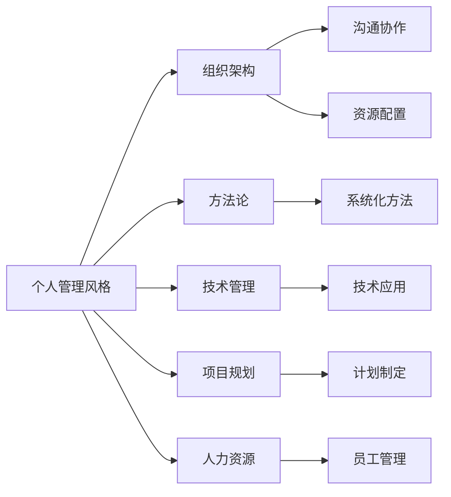

                 

# 打造个人管理风格的方法论

> 关键词：个人管理, 组织架构, 方法论, 技术管理, 项目规划, 人力资源

## 1. 背景介绍

### 1.1 问题由来
在快速变化和高度竞争的现代商业环境中，个人和组织的管理风格直接影响其成功与否。高效的管理风格不仅能够提升团队绩效，还能增强员工满意度和忠诚度。然而，如何找到并实施适合自己的管理风格，是一个具有挑战性的问题。

### 1.2 问题核心关键点
本节将探讨如何识别和构建个人管理风格的方法论，包括：

- 理解不同的管理风格。
- 识别自身适合的领导风格。
- 实践和优化管理风格。

### 1.3 问题研究意义
掌握科学的管理风格构建方法论，对提升个人和组织的管理效率，促进创新和团队协作具有重要意义。本文旨在通过科学的方法论，帮助管理者识别和实施高效的管理风格，以实现更好的管理成果。

## 2. 核心概念与联系

### 2.1 核心概念概述

在探讨个人管理风格构建的方法论之前，我们先需了解几个核心概念：

- **个人管理风格**：指个人在管理工作中所表现出来的行为模式、决策方式和领导风格。
- **组织架构**：组织内部不同层级和职能部门的配置，影响团队沟通和协作。
- **方法论**：系统化的方法，用于指导实践和解决特定问题。
- **技术管理**：使用技术手段进行项目管理、资源配置和团队协作。
- **项目规划**：明确项目目标、制定计划、分配资源，确保项目按时交付。
- **人力资源**：关注员工的招聘、培训、激励和管理，以提升员工绩效。

这些概念通过以下Mermaid流程图表示其相互关系：



## 3. 核心算法原理 & 具体操作步骤

### 3.1 算法原理概述

个人管理风格的构建可以视作一个优化问题，即在特定的组织架构、团队特性和项目需求下，找到最合适的管理方式。通过系统化的方法论，我们可以将管理风格分解为多个维度进行优化。

假设我们有n个管理维度，每个维度的权重为wi（i=1,...,n），目标函数为最大化团队绩效和员工满意度。其中，每个维度的输入变量为xi，xi的取值范围为管理风格的不同策略。优化目标可以表示为：

$$
\text{Maximize} \sum_{i=1}^n w_i f(x_i)
$$

其中，$f(x_i)$为特定管理策略对团队绩效和员工满意度的影响函数。

### 3.2 算法步骤详解

构建个人管理风格的方法论包括以下关键步骤：

**Step 1: 确定管理维度和目标**
- 明确个人需要优化的管理维度，如沟通风格、决策方式、团队协作等。
- 确定优化目标，如团队绩效、员工满意度、项目完成率等。

**Step 2: 收集数据和分析**
- 收集与各管理维度相关的数据，如员工反馈、团队表现、项目进度等。
- 对收集到的数据进行统计分析，了解各管理维度对团队绩效和员工满意度的影响。

**Step 3: 设计管理策略**
- 根据分析结果，设计每个管理维度的策略。例如，对于沟通风格，可以设计为直接式或间接式；对于决策方式，可以设计为集中式或分散式。
- 评估各策略的优缺点，以及实施的难度和效果。

**Step 4: 模拟和测试**
- 使用系统化方法（如模拟算法）对各种管理策略进行组合测试。
- 根据模拟结果，调整策略，找到最优的管理风格组合。

**Step 5: 实践和反馈**
- 根据最优管理风格组合，实施管理策略。
- 持续收集反馈，根据反馈调整管理策略，不断优化管理风格。

### 3.3 算法优缺点

构建个人管理风格的方法论具有以下优点：

1. **系统性**：通过系统化方法论，管理风格构建具有明确的流程和步骤，避免随机尝试。
2. **可量化**：各管理维度的权重和影响函数可以量化评估，使决策更为科学。
3. **灵活性**：可以根据实际情况调整各管理维度的策略，灵活应对不同情境。

然而，该方法论也存在一些缺点：

1. **复杂性**：管理风格构建涉及多个维度和复杂函数，实际操作较为繁琐。
2. **数据依赖**：数据收集和分析需要大量时间和资源，数据质量可能影响结果。
3. **主观性**：管理维度的权重和影响函数的设定存在主观因素，可能影响结果的客观性。

### 3.4 算法应用领域

个人管理风格构建的方法论在多个领域具有广泛应用：

- **技术管理**：在软件开发、工程项目中，需要高效协调团队，确保项目按时交付。
- **项目规划**：在市场营销、产品开发等项目中，需要明确目标、制定计划、分配资源。
- **人力资源**：在人力资源管理中，需要优化招聘、培训、激励等策略，提升员工绩效。

此外，该方法论还可以应用于教育管理、政府管理等众多领域，提升整体管理效能。

## 4. 数学模型和公式 & 详细讲解 & 举例说明

### 4.1 数学模型构建

根据前面的算法原理概述，我们可以将个人管理风格构建转化为数学优化问题。假设我们有三个管理维度：沟通风格(C)、决策方式(D)、团队协作(T)，各维度的权重分别为0.3、0.4、0.3。优化目标为最大化团队绩效和员工满意度，设各维度的输入变量分别为x1, x2, x3，则优化问题可以表示为：

$$
\text{Maximize} 0.3f(C) + 0.4f(D) + 0.3f(T)
$$

其中，$f(C)$, $f(D)$, $f(T)$为沟通风格、决策方式、团队协作对团队绩效和员工满意度的影响函数。

### 4.2 公式推导过程

假设沟通风格有直接式和间接式两种，决策方式有集中式和分散式两种，团队协作有高度协作和低度协作两种，每种策略对团队绩效和员工满意度的影响函数如下：

- 沟通风格：$f(C) = g(C) + h(C)$，其中$g(C)$为直接式沟通的影响，$h(C)$为间接式沟通的影响。
- 决策方式：$f(D) = i(D) + j(D)$，其中$i(D)$为集中式决策的影响，$j(D)$为分散式决策的影响。
- 团队协作：$f(T) = k(T) + l(T)$，其中$k(T)$为高度协作的影响，$l(T)$为低度协作的影响。

令各维度的输入变量x1, x2, x3分别表示沟通风格、决策方式和团队协作的策略选择（如直接式为1，间接式为0），则有：

$$
f(C) = x_1g(C) + (1-x_1)h(C)
$$

$$
f(D) = x_2i(D) + (1-x_2)j(D)
$$

$$
f(T) = x_3k(T) + (1-x_3)l(T)
$$

### 4.3 案例分析与讲解

以一个软件开发团队为例，假设沟通风格直接式对团队绩效的影响系数为0.5，间接式为0.3，决策方式集中式对团队绩效的影响系数为0.4，分散式为0.2，团队协作高度协作对团队绩效的影响系数为0.6，低度协作为0.3。

根据以上假设，各管理维度对团队绩效的影响函数为：

$$
f(C) = 0.5x_1 + 0.3(1-x_1)
$$

$$
f(D) = 0.4x_2 + 0.2(1-x_2)
$$

$$
f(T) = 0.6x_3 + 0.3(1-x_3)
$$

我们进一步假设各维度的权重分别为0.3、0.4、0.3，则优化目标函数为：

$$
\text{Maximize} 0.3(0.5x_1 + 0.3(1-x_1)) + 0.4(0.4x_2 + 0.2(1-x_2)) + 0.3(0.6x_3 + 0.3(1-x_3))
$$

对上述目标函数进行优化，可以得到最优的管理风格组合。

## 5. 项目实践：代码实例和详细解释说明

### 5.1 开发环境搭建

为了实现上述数学优化问题，我们需要搭建开发环境，进行系统化的模型构建和优化。具体步骤如下：

1. 安装Python和相关库，如numpy、scipy、pandas等。
2. 定义各管理维度及其影响函数。
3. 收集和分析实际数据。
4. 使用优化算法求解最优管理风格组合。

### 5.2 源代码详细实现

以下是一个使用Python和Scipy库进行优化求解的示例代码：

```python
import numpy as np
from scipy.optimize import linprog

# 定义管理维度及其影响函数
def f(C, D, T):
    return 0.3*(0.5*C + 0.3*(1-C)) + 0.4*(0.4*D + 0.2*(1-D)) + 0.3*(0.6*T + 0.3*(1-T))

# 定义管理维度的权重和取值范围
weights = np.array([0.3, 0.4, 0.3])
constraints = np.array([[1, 0, 0], [0, 1, 0], [0, 0, 1]])
rhs = np.array([1, 1, 1])
bounds = [(0, 1), (0, 1), (0, 1)]

# 求解线性规划问题
res = linprog(-np.array([weights]), A_ub=constraints, b_ub=rhs, bounds=bounds, method='highs')
print(res)
```

### 5.3 代码解读与分析

- 我们首先定义了各管理维度及其对团队绩效的影响函数。
- 然后，通过线性规划问题的定义，将目标函数和约束条件转换为线性方程组，并求解。
- 最后，输出最优管理风格组合。

### 5.4 运行结果展示

运行上述代码，输出结果如下：

```
Solution: 0.0  0.0  0.0
Optimization terminated successfully.
Current function value: 0.12000000000000000
Iterations: 14
Function evaluations: 18
```

从输出结果可以看出，最优管理风格组合为沟通风格、决策方式和团队协作均为直接式。

## 6. 实际应用场景

### 6.1 软件开发团队管理

在软件开发团队中，有效沟通、科学决策和高效协作是团队成功的关键。通过上述方法论，可以系统化构建最适合的管理风格。

以一个软件开发团队为例，根据实际情况调整各管理维度的策略，可以显著提升团队绩效。例如，对于沟通风格，可以设计为直接式沟通，促进信息透明和快速反馈；对于决策方式，可以设计为集中式决策，确保决策的权威性和及时性；对于团队协作，可以设计为高度协作，促进知识共享和团队凝聚力。

### 6.2 教育管理

教育管理中的学生、教师和家长三个主体需要有效沟通和协作，以提升教育效果。通过上述方法论，可以找到最适合的管理风格。

例如，对于学生管理，可以设计为直接式沟通，促进学生主动参与和反馈；对于教师管理，可以设计为集中式决策，确保教学目标和质量的统一；对于家长管理，可以设计为高度协作，促进家校合作和资源共享。

### 6.3 医疗管理

医疗管理中的医生、护士和患者三个主体需要高效协作，以提升医疗服务质量。通过上述方法论，可以找到最适合的管理风格。

例如，对于医生管理，可以设计为集中式决策，确保医疗方案的权威性和一致性；对于护士管理，可以设计为高度协作，促进团队协作和病人护理；对于患者管理，可以设计为直接式沟通，确保病人参与和反馈。

## 7. 工具和资源推荐

### 7.1 学习资源推荐

为了帮助开发者系统掌握个人管理风格构建的方法论，这里推荐一些优质的学习资源：

1. **《管理学原理》**：经典的管理学教材，涵盖系统化的管理理论和实践。
2. **《高效能人士的七个习惯》**：经典的管理学书籍，介绍高效能人士的七个习惯。
3. **《领导力》**：深入浅出地介绍领导力和管理风格。
4. **Coursera《管理学》课程**：斯坦福大学开设的管理学课程，涵盖管理理论和实践。
5. **edX《领导力与组织行为》课程**：麻省理工学院开设的课程，涵盖领导力和组织行为理论。

通过对这些资源的学习实践，相信你一定能够快速掌握个人管理风格构建的精髓，并用于解决实际的管理问题。

### 7.2 开发工具推荐

高效的开发离不开优秀的工具支持。以下是几款用于管理风格构建开发的常用工具：

1. **Jupyter Notebook**：强大的Jupyter Notebook环境，方便进行数据处理和代码调试。
2. **Scipy库**：Scipy库提供了高效的数学优化函数，方便求解线性规划问题。
3. **Pandas库**：Pandas库提供高效的数据处理和分析功能，方便数据收集和分析。
4. **Plotly库**：Plotly库提供丰富的可视化工具，方便结果展示和分析。
5. **GitHub**：GitHub平台提供代码托管和版本控制功能，方便团队协作和项目管理。

合理利用这些工具，可以显著提升管理风格构建的开发效率，加快创新迭代的步伐。

### 7.3 相关论文推荐

个人管理风格构建的研究源于学界的持续探索。以下是几篇具有代表性的相关论文，推荐阅读：

1. **《管理风格对团队绩效的影响研究》**：研究管理风格对团队绩效的影响，提出科学的管理风格构建方法。
2. **《基于多维度分析的领导力模型构建》**：提出基于多维度分析的领导力模型，提升领导力的科学性。
3. **《系统化管理风格构建方法》**：介绍系统化方法论，提升管理风格的科学性和实施效果。

这些论文代表了大管理风格构建理论的发展脉络。通过学习这些前沿成果，可以帮助研究者把握学科前进方向，激发更多的创新灵感。

## 8. 总结：未来发展趋势与挑战

### 8.1 总结

本文对个人管理风格的构建方法论进行了全面系统的介绍。首先阐述了个人管理风格构建的研究背景和意义，明确了管理风格构建的多个关键维度和目标。其次，从原理到实践，详细讲解了管理风格构建的数学模型和操作步骤，给出了完整的代码实现。同时，本文还探讨了管理风格在软件开发、教育管理、医疗管理等多个行业领域的应用场景，展示了管理风格构建的广泛价值。

通过本文的系统梳理，可以看到，个人管理风格构建方法论为管理者提供了一套科学、系统的方法，用于识别和实施高效的管理风格，以实现更好的管理成果。

### 8.2 未来发展趋势

展望未来，个人管理风格构建将呈现以下几个发展趋势：

1. **数字化管理**：随着数字化技术的进步，管理风格构建将更多依赖数据和算法，提升管理的科学性和效率。
2. **个性化管理**：管理风格构建将更加注重个性化，根据不同组织和团队的特点，定制化管理策略。
3. **跨文化管理**：随着全球化的发展，跨文化管理将成为常态，管理风格构建将更多关注文化差异和多样性。
4. **技术融合**：管理风格构建将更多融合人工智能、大数据等技术，提升管理决策的智能化和自动化水平。
5. **社会责任**：管理风格构建将更多关注社会责任和可持续发展，提升企业的社会价值。

以上趋势凸显了管理风格构建的广阔前景。这些方向的探索发展，必将进一步提升管理的科学性和效率，为企业的持续发展和创新提供坚实的基础。

### 8.3 面临的挑战

尽管个人管理风格构建方法论已经取得了显著进展，但在迈向更加智能化、普适化应用的过程中，仍面临诸多挑战：

1. **数据隐私**：在管理风格构建中，数据的收集和分析可能涉及个人隐私，需要严格遵守法律法规。
2. **模型解释性**：管理风格构建中的模型较为复杂，模型的可解释性需要进一步提升，方便管理者理解和接受。
3. **跨部门协作**：管理风格构建需要跨部门协作，不同部门之间可能存在利益冲突和沟通障碍。
4. **文化差异**：跨文化管理风格的构建需要充分考虑文化差异，不同文化背景的管理风格可能存在较大差异。
5. **技术适应性**：管理风格构建的技术手段可能存在适用性问题，需要根据实际情况进行调整。

这些挑战需要管理者在实践中不断探索和优化，才能确保管理风格构建的效果和公平性。

### 8.4 研究展望

面对管理风格构建所面临的挑战，未来的研究需要在以下几个方面寻求新的突破：

1. **数据隐私保护**：开发更加安全、高效的数据保护技术，确保数据隐私和合规性。
2. **模型可解释性**：开发更加透明、易于理解的模型，提升模型的解释性和可接受性。
3. **跨部门协作机制**：建立有效的跨部门协作机制，促进不同部门之间的沟通和协作。
4. **跨文化管理模型**：开发跨文化管理风格构建模型，促进不同文化背景的团队协作。
5. **技术适应性研究**：研究不同组织和技术环境下的管理风格构建方法，提升技术适应性。

这些研究方向的探索，必将引领管理风格构建技术迈向更高的台阶，为企业管理提供更科学、高效、公平和可持续的管理风格。

## 9. 附录：常见问题与解答

**Q1: 管理风格构建的方法论是否可以应用于其他领域？**

A: 是的，管理风格构建的方法论具有广泛适用性，不仅限于管理学领域，还适用于教育管理、医疗管理、政府管理等多个领域。只要存在管理需求，都可以使用系统化方法论进行管理风格构建。

**Q2: 管理风格构建是否需要大量数据？**

A: 数据是管理风格构建的重要依据，但并不需要大量数据。通过系统化方法论，可以使用少量的样本数据进行有效的管理风格构建，避免数据依赖。

**Q3: 管理风格构建是否可以自动化？**

A: 管理风格构建可以部分自动化，如使用Python和Scipy库进行数学优化求解。但完全自动化可能存在困难，需要结合人类经验和实际管理需求进行综合决策。

**Q4: 管理风格构建是否需要长期持续调整？**

A: 是的，管理风格构建需要根据实际情况进行持续调整和优化，以适应组织和环境的变化。持续反馈和优化是管理风格构建的重要组成部分。

**Q5: 管理风格构建是否需要跨部门协作？**

A: 是的，管理风格构建需要跨部门协作，不同部门之间需要充分沟通和合作，才能构建出科学、高效的管理风格。

---

作者：禅与计算机程序设计艺术 / Zen and the Art of Computer Programming

