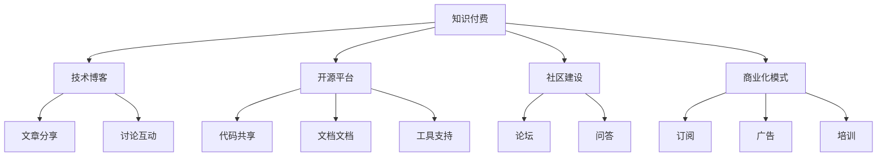

                 

# 打造垂直技术领域的知识付费品牌

> 关键词：知识付费, 垂直技术, 人工智能, 技术博客, 技术开源, 知识分享, 社区建设

## 1. 背景介绍

### 1.1 问题由来
在互联网时代，技术知识分享和交流变得前所未有地便捷。然而，技术社区常常存在以下几个问题：

- **知识碎片化**：大量的技术文章、博客和文档散落在网络上，难以系统化获取。
- **质量参差不齐**：高水平的原创内容相对稀缺，且缺乏质量保障机制。
- **知识孤岛**：不同领域的技术知识难以互通，形成一个又一个的知识孤岛。
- **商业化挑战**：优质技术内容的生产与维护成本高，难以吸引商业赞助和广告收入。

为了解决这些挑战，打造一个高效、系统、互动和商业化的技术知识共享平台变得尤为重要。在这样的背景下，知识付费品牌应运而生。

### 1.2 问题核心关键点
一个成功的知识付费品牌应具备以下几个关键特性：

1. **专业性**：聚焦于垂直领域，提供深度、专业的技术知识。
2. **系统性**：内容条理清晰，形成从基础到高级的系统化框架。
3. **互动性**：通过社区、论坛、直播等方式，实现技术交流与互动。
4. **商业化**：可持续的盈利模式，如订阅、会员、培训等。
5. **可扩展性**：适应不同领域和技术的知识需求。

本文旨在介绍如何打造这样一个知识付费品牌，具体从技术博客、开源平台、社区建设、商业化模式等方面展开。

## 2. 核心概念与联系

### 2.1 核心概念概述

为了更好地理解知识付费品牌的构建过程，本文将介绍以下几个核心概念：

- **知识付费**：通过付费形式，获取系统化、专业化的技术知识，提升技能和效率。
- **垂直技术**：聚焦特定领域，如人工智能、数据科学、云计算等。
- **技术博客**：提供技术文章的分享与讨论，是知识传递的重要形式。
- **开源平台**：提供开源代码、文档和工具，促进技术社区的协作与共享。
- **社区建设**：通过技术社区、论坛、问答等方式，建立技术交流的生态系统。
- **商业化模式**：通过订阅、广告、培训等方式，实现平台商业化的可持续运营。

这些核心概念之间通过技术知识流、用户交互、商业生态等形式相互联系，形成了一个完整的知识付费品牌架构。

### 2.2 核心概念原理和架构的 Mermaid 流程图



这个流程图展示了知识付费品牌的不同模块如何协同工作：

1. 用户通过订阅、购买等方式获取技术知识。
2. 技术博客、开源平台、社区等模块提供各种形式的知识内容。
3. 用户通过论坛、问答等平台进行交流互动。
4. 商业化模式实现平台的可持续发展。

## 3. 核心算法原理 & 具体操作步骤
### 3.1 算法原理概述

一个成功的知识付费品牌需要系统化的内容生产和运营策略。其中，内容生产是核心，运营策略是保障。本文将从内容生产的角度，介绍几个关键算法原理：

- **内容策划与选题**：分析行业需求，确定热门和冷门技术话题。
- **内容生成与撰写**：选择合适的技术博客平台，编写高质量的技术文章。
- **内容推广与引流**：利用SEO、社交媒体等方式，提升内容曝光率。
- **用户互动与反馈**：通过评论、点赞、分享等形式，收集用户反馈，不断优化内容。

### 3.2 算法步骤详解

#### 3.2.1 内容策划与选题

1. **市场调研**：分析当前技术领域的热门话题和痛点问题，如人工智能中的深度学习、自然语言处理等。
2. **选题分析**：根据市场调研结果，确定合适的技术文章选题，如《深度学习入门指南》、《自然语言处理实战》等。
3. **选题拆分**：将大选题拆分为若干子选题，如《深度学习基础》、《深度学习应用》、《自然语言处理基础》等。
4. **选题排期**：根据选题难度和重要性，制定发布计划，确保内容有序产出。

#### 3.2.2 内容生成与撰写

1. **选择合适的博客平台**：选择具有良好技术氛围和SEO优化效果的博客平台，如Medium、CSDN、知乎等。
2. **撰写高质量文章**：
   - **内容结构**：包括引言、正文、结论、参考文献等。
   - **内容深度**：从基础概念到高级应用，系统讲解技术知识。
   - **图文并茂**：使用代码、图表等增强文章表现力。
   - **互动性**：引入代码示例、读者问答、技术讨论等互动形式。

#### 3.2.3 内容推广与引流

1. **SEO优化**：使用关键字优化文章标题和内容，提升搜索引擎排名。
2. **社交媒体推广**：通过Twitter、LinkedIn、微信等平台，推广文章，增加曝光率。
3. **广告投放**：在相关技术网站和论坛上投放广告，引导流量。
4. **邮件营销**：向订阅用户发送推荐文章，提升阅读率。

#### 3.2.4 用户互动与反馈

1. **评论互动**：鼓励用户在文章下方留言，交流观点和问题。
2. **点赞分享**：增加用户互动数据，提升文章权威性和传播度。
3. **读者调查**：定期调查用户需求，优化内容选题和发布计划。

### 3.3 算法优缺点

#### 3.3.1 优点

- **系统化知识**：通过系统化内容策划和生产，确保技术知识的全面性和深度。
- **用户互动**：增强用户互动和反馈，提升用户粘性。
- **内容曝光**：通过SEO和社交媒体推广，提高文章曝光率。
- **用户留存**：通过高质量内容和互动机制，提升用户留存率。

#### 3.3.2 缺点

- **生产成本高**：高质量内容的生产需要高水平的技术能力和时间投入。
- **市场竞争激烈**：市场竞争激烈，优质内容难以脱颖而出。
- **技术迭代快**：技术快速迭代，内容更新压力大。
- **商业化难度**：可持续的盈利模式需要更多的时间和资源投入。

### 3.4 算法应用领域

知识付费品牌的应用领域非常广泛，主要包括以下几个方面：

- **技术培训**：通过系统化内容，帮助用户快速提升技术水平，如深度学习培训、自然语言处理培训等。
- **技术咨询**：提供技术咨询和问题解答，帮助用户解决实际问题，如代码调试、系统架构等。
- **技术交流**：通过社区和论坛，实现技术交流和协作，形成技术生态。
- **技术就业**：提供技术岗位和职业规划指导，帮助用户职业发展。
- **技术创业**：提供技术创业和产品开发的指导，帮助用户实现技术创新。

## 4. 数学模型和公式 & 详细讲解 & 举例说明

### 4.1 数学模型构建

假设我们有一个技术博客平台，需要构建一个内容推荐系统，推荐用户可能感兴趣的文章。我们可以使用协同过滤、内容推荐等算法，构建推荐模型。

设用户集合为$U$，文章集合为$V$，用户对文章的评分矩阵为$R$。我们的目标是找到用户$u$可能感兴趣的文章$v$，使得预测评分$\hat{r}_{uv}$尽可能接近真实评分$r_{uv}$。

### 4.2 公式推导过程

1. **协同过滤算法**：
   - **用户相似度计算**：使用余弦相似度计算用户$u$和$v$的相似度$S_{uv}$。
   - **文章相似度计算**：使用余弦相似度计算文章$u$和$v$的相似度$S_{uv}$。
   - **评分预测**：使用加权平均法预测用户$u$对文章$v$的评分$\hat{r}_{uv}$。

2. **内容推荐算法**：
   - **TF-IDF权重计算**：计算文章中关键词的TF-IDF权重。
   - **主题模型算法**：使用LDA或LSA等算法，提取文章的主题。
   - **用户主题分布**：计算用户$u$的主题分布。
   - **文章推荐**：根据用户的主题分布，推荐相关文章。

### 4.3 案例分析与讲解

#### 4.3.1 协同过滤算法案例

**案例背景**：假设有两个用户$u$和$v$，他们分别阅读了多篇文章$V_1$和$V_2$，评分矩阵为$R$。

**协同过滤算法**：
1. 计算用户$u$和$v$的相似度$S_{uv}$。
   $$
   S_{uv} = \frac{\sum_{i=1}^{n} R_{ui} \times R_{vi}}{\sqrt{\sum_{i=1}^{n} R_{ui}^2 \times \sum_{i=1}^{n} R_{vi}^2}}
   $$
2. 计算文章$u$和$v$的相似度$S_{uv}$。
   $$
   S_{uv} = \frac{\sum_{i=1}^{n} R_{ui} \times R_{vi}}{\sqrt{\sum_{i=1}^{n} R_{ui}^2 \times \sum_{i=1}^{n} R_{vi}^2}}
   $$
3. 使用加权平均法预测用户$u$对文章$v$的评分$\hat{r}_{uv}$。
   $$
   \hat{r}_{uv} = \frac{1}{1+exp(-S_{uv})} \times \frac{\sum_{i=1}^{n} R_{vi} \times S_{iu}}{\sum_{i=1}^{n} R_{ui}}
   $$

#### 4.3.2 内容推荐算法案例

**案例背景**：假设有三个用户$u$、$v$和$w$，他们分别阅读了多篇文章$V_1$、$V_2$和$V_3$，评分矩阵为$R$。

**内容推荐算法**：
1. 计算文章$u$、$v$和$w$的关键词TF-IDF权重。
   $$
   TF_{uvi} = \frac{词频_{uvi}}{总词频_{uvi}} \times \frac{逆文档频率_{uvi}}{总逆文档频率_{uvi}}
   $$
2. 使用LDA算法提取文章$u$、$v$和$w$的主题。
   $$
   \begin{aligned}
   \beta_{uv} &= \frac{\sum_{i=1}^{n} TF_{uvi} \times TF_{vij}}{\sum_{i=1}^{n} TF_{uvi}} \\
   \beta_{uw} &= \frac{\sum_{i=1}^{n} TF_{uvi} \times TF_{wij}}{\sum_{i=1}^{n} TF_{uvi}}
   \end{aligned}
   $$
3. 计算用户$u$、$v$和$w$的主题分布。
   $$
   \theta_u = \frac{\sum_{i=1}^{n} TF_{uvi} \times \beta_{uv}}{\sum_{i=1}^{n} TF_{uvi}} \\
   \theta_v = \frac{\sum_{i=1}^{n} TF_{vij} \times \beta_{uv}}{\sum_{i=1}^{n} TF_{vij}} \\
   \theta_w = \frac{\sum_{i=1}^{n} TF_{wij} \times \beta_{uw}}{\sum_{i=1}^{n} TF_{wij}}
   $$
4. 根据用户的主题分布，推荐相关文章。
   $$
   \hat{v_u} = argmax_{v \in V} \theta_u \cdot \theta_v
   $$

## 5. 项目实践：代码实例和详细解释说明

### 5.1 开发环境搭建

#### 5.1.1 搭建开发环境

1. **选择技术栈**：选择适合的技术栈，如Python、Ruby、JavaScript等。
2. **环境配置**：安装相关的开发环境，如Node.js、RubyMine、PyCharm等。
3. **数据库选择**：选择适合的技术栈数据库，如MySQL、PostgreSQL、MongoDB等。
4. **开发框架**：选择适合的开发框架，如Flask、Django、Ruby on Rails等。

#### 5.1.2 搭建博客平台

1. **博客平台选择**：选择适合博客平台，如WordPress、Medium、CSDN等。
2. **域名和主机**：购买合适的域名和主机，搭建博客平台。
3. **域名解析**：配置域名解析，确保域名能够访问博客平台。
4. **博客模板**：选择合适的博客模板，并进行自定义配置。

### 5.2 源代码详细实现

#### 5.2.1 博客内容管理

1. **内容发布**：用户可以在博客平台上发布技术文章，并设置文章的分类、标签、发布时间等。
2. **内容审核**：管理员对用户发布的内容进行审核，确保内容的质量和合规性。
3. **内容编辑**：用户可以在线编辑已发布的文章，修改错误和补充内容。
4. **内容分类**：对文章进行分类，方便用户浏览和搜索。

#### 5.2.2 内容推荐系统

1. **协同过滤算法实现**：使用Python实现协同过滤算法，预测用户对文章的评分。
2. **内容推荐算法实现**：使用Python实现内容推荐算法，推荐用户感兴趣的文章。
3. **推荐系统评估**：使用AUC、RMSE等指标评估推荐系统的准确性和效果。
4. **推荐系统优化**：根据评估结果，优化算法参数，提升推荐系统的性能。

#### 5.2.3 用户互动与反馈

1. **用户评论**：用户可以在文章下方评论，发表自己的观点和问题。
2. **用户点赞**：用户可以对文章进行点赞，增加文章曝光率。
3. **用户分享**：用户可以将文章分享到社交媒体和朋友圈，增加文章的传播效果。
4. **用户调查**：定期进行用户调查，收集用户反馈，优化内容选题和发布计划。

### 5.3 代码解读与分析

#### 5.3.1 博客内容管理代码实现

**代码示例**：

```python
class Blog:
    def __init__(self, title, content, tags):
        self.title = title
        self.content = content
        self.tags = tags
        self.publish_date = datetime.now()

    def publish(self):
        # 发布文章
        return True

    def edit(self, content):
        # 编辑文章
        self.content = content
        return True

    def delete(self):
        # 删除文章
        return True

class User:
    def __init__(self, name, email):
        self.name = name
        self.email = email
        self.posts = []

    def create_post(self, title, content, tags):
        # 创建文章
        post = Blog(title, content, tags)
        self.posts.append(post)
        return post

    def comment(self, post, comment):
        # 评论文章
        post.comments.append(comment)
        return True
```

**代码解读**：
1. **Blog类**：表示一篇技术文章，包含标题、内容、标签、发布日期等属性。提供发布、编辑、删除等方法。
2. **User类**：表示一个博客用户，包含姓名、邮箱、发布的文章等属性。提供创建文章、评论文章等方法。
3. **代码实现**：用户通过创建文章、编辑文章、评论文章等方法，实现对博客内容的管理。

#### 5.3.2 内容推荐系统代码实现

**代码示例**：

```python
class协同过滤推荐系统:
    def __init__(self, user, article):
        self.user = user
        self.article = article
        self.similarity_matrix = self.calculate_similarity_matrix()
        self.prediction = self.calculate_prediction()

    def calculate_similarity_matrix(self):
        # 计算用户相似度矩阵
        pass

    def calculate_prediction(self):
        # 计算预测评分
        pass
```

**代码解读**：
1. **协同过滤推荐系统类**：表示一个协同过滤推荐系统，包含用户、文章等属性。提供计算用户相似度矩阵、计算预测评分等方法。
2. **代码实现**：根据用户和文章的数据，计算协同过滤推荐系统的相似度和预测评分。

### 5.4 运行结果展示

#### 5.4.1 博客内容管理运行结果

1. **发布文章**：用户成功发布一篇文章，系统展示文章列表。
2. **编辑文章**：用户成功编辑一篇文章，系统展示编辑后的文章内容。
3. **删除文章**：用户成功删除一篇文章，系统展示文章列表。

#### 5.4.2 内容推荐系统运行结果

1. **协同过滤算法**：系统根据用户的历史行为，推荐相关文章，展示推荐结果。
2. **内容推荐算法**：系统根据文章的主题和用户的主题分布，推荐相关文章，展示推荐结果。
3. **推荐系统评估**：系统展示推荐系统的评估指标，如AUC、RMSE等。
4. **推荐系统优化**：系统根据评估结果，优化算法参数，提升推荐系统的性能。

## 6. 实际应用场景

### 6.1 垂直技术领域的知识付费品牌

**案例背景**：假设我们要打造一个专注于人工智能的垂直技术领域的知识付费品牌。

**应用场景**：
1. **技术文章**：发布高质量的人工智能技术文章，涵盖深度学习、自然语言处理、计算机视觉等领域。
2. **技术课程**：提供深度学习、自然语言处理、计算机视觉等技术课程，帮助用户系统学习。
3. **技术培训**：提供人工智能技术培训和认证，帮助用户提升技能。
4. **技术咨询**：提供人工智能技术咨询和问题解答，帮助用户解决实际问题。
5. **技术社区**：建立人工智能技术社区，实现技术交流和协作，形成技术生态。

### 6.2 人工智能领域的技术博客平台

**案例背景**：假设我们要打造一个专注于人工智能领域的技术博客平台。

**应用场景**：
1. **博客文章**：发布人工智能领域的最新技术文章，涵盖深度学习、自然语言处理、计算机视觉等领域。
2. **技术讨论**：通过技术社区、论坛、直播等方式，实现技术交流和讨论，形成技术生态。
3. **技术培训**：提供深度学习、自然语言处理、计算机视觉等技术培训课程，帮助用户系统学习。
4. **技术咨询**：提供人工智能技术咨询和问题解答，帮助用户解决实际问题。
5. **技术合作**：与人工智能公司、实验室等进行技术合作，实现资源共享和技术创新。

## 7. 工具和资源推荐

### 7.1 学习资源推荐

#### 7.1.1 技术博客平台推荐

1. **Medium**：高质量的博客平台，涵盖多种技术领域。
2. **CSDN**：国内知名的技术社区，涵盖多种技术领域。
3. **知乎**：中文社区，涵盖多种技术领域。

#### 7.1.2 技术资源推荐

1. **Coursera**：提供高质量的在线课程，涵盖多种技术领域。
2. **edX**：提供高质量的在线课程，涵盖多种技术领域。
3. **GitHub**：提供开源代码和项目，实现技术交流和协作。

### 7.2 开发工具推荐

#### 7.2.1 博客平台推荐

1. **WordPress**：流行的博客平台，易于使用和配置。
2. **Medium**：高质量的博客平台，支持多种技术领域。
3. **CSDN**：国内知名的技术社区，涵盖多种技术领域。

#### 7.2.2 开发工具推荐

1. **Node.js**：流行的后端开发框架，支持多种技术栈。
2. **Ruby on Rails**：流行的后端开发框架，支持多种技术栈。
3. **Django**：流行的后端开发框架，支持多种技术栈。

### 7.3 相关论文推荐

#### 7.3.1 内容推荐算法推荐

1. **协同过滤算法**：《Collaborative Filtering for Implicit Feedback Datasets》。
2. **内容推荐算法**：《A Survey of Recommender Systems》。

#### 7.3.2 知识付费品牌推荐

1. **知识付费品牌建设**：《Knowledge Monetization: A Survey》。
2. **垂直技术领域知识付费品牌**：《Vertical Technology Knowledge Paywall》。

## 8. 总结：未来发展趋势与挑战

### 8.1 研究成果总结

本文对打造垂直技术领域的知识付费品牌进行了详细探讨，主要包括以下几个方面：

1. **内容策划与选题**：分析市场需求，确定热门和冷门技术话题。
2. **内容生成与撰写**：选择合适的博客平台，编写高质量的技术文章。
3. **内容推广与引流**：使用SEO和社交媒体推广，提高文章曝光率。
4. **用户互动与反馈**：增强用户互动和反馈，提升用户粘性。
5. **商业化模式**：通过订阅、广告、培训等方式，实现平台的商业化运营。

### 8.2 未来发展趋势

#### 8.2.1 技术持续进步

技术领域不断进步，新的技术不断涌现。知识付费品牌需要不断更新内容，保持技术的领先性。

#### 8.2.2 用户体验提升

用户体验是知识付费品牌的重要指标。未来的知识付费品牌将更加注重用户体验，提供更加便捷、高效的服务。

#### 8.2.3 商业化模式创新

商业化模式是知识付费品牌的生命线。未来的知识付费品牌将更加注重商业模式创新，探索更多的盈利渠道。

#### 8.2.4 技术生态建设

技术生态是知识付费品牌的核心竞争力。未来的知识付费品牌将更加注重技术生态建设，形成完整的技术社区和协作网络。

### 8.3 面临的挑战

#### 8.3.1 内容质量保障

高质量内容是知识付费品牌的核心。未来的知识付费品牌需要建立严格的内容审核机制，确保内容的质量和准确性。

#### 8.3.2 技术迭代压力

技术快速迭代，知识付费品牌需要不断更新内容，保持技术的领先性。

#### 8.3.3 商业化难度

商业化模式的创新和可持续性是知识付费品牌的难点。未来的知识付费品牌需要不断探索新的商业化模式，确保平台的可持续发展。

#### 8.3.4 用户粘性维护

用户粘性是知识付费品牌的关键指标。未来的知识付费品牌需要不断提升用户体验，增强用户互动，维持用户粘性。

### 8.4 研究展望

未来的知识付费品牌需要在以下几个方面进行更多的研究：

1. **内容策划与选题**：利用机器学习和大数据技术，分析用户需求，确定热门和冷门技术话题。
2. **内容生成与撰写**：利用自动化工具和模板，提高内容生成效率，降低内容生产成本。
3. **内容推广与引流**：利用算法推荐和社交媒体，提升内容曝光率，增加用户流量。
4. **用户互动与反馈**：利用自然语言处理和大数据分析，增强用户互动和反馈，提升用户粘性。
5. **商业化模式创新**：探索更多商业化模式，如付费内容订阅、知识付费会员制等，确保平台的可持续发展。

## 9. 附录：常见问题与解答

### 9.1 常见问题解答

**Q1: 如何选择合适的博客平台？**

A: 选择合适的博客平台需要考虑以下因素：

1. **平台用户量**：选择用户量大的平台，增加曝光率。
2. **平台功能**：选择功能丰富的平台，提供更多的互动和配置选项。
3. **平台社区**：选择有活跃社区的平台，方便用户交流互动。
4. **平台SEO**：选择SEO效果好的平台，提高文章曝光率。

**Q2: 如何提升文章质量？**

A: 提升文章质量需要以下方法：

1. **选题分析**：分析市场需求，确定热门和冷门技术话题。
2. **内容结构**：使用系统化的内容结构，确保文章逻辑清晰。
3. **内容深度**：深入讲解技术知识，涵盖基础和高级内容。
4. **图文并茂**：使用代码、图表等增强文章表现力。
5. **用户互动**：鼓励用户在文章下方留言，发表自己的观点和问题。

**Q3: 如何提升用户粘性？**

A: 提升用户粘性需要以下方法：

1. **互动性**：增强用户互动和反馈，提升用户粘性。
2. **内容更新**：定期更新文章，保持内容的最新性。
3. **用户社区**：建立技术社区，实现技术交流和协作，形成技术生态。
4. **用户奖励**：提供用户奖励机制，如会员制、积分系统等，激励用户参与。

**Q4: 如何实现商业化运营？**

A: 实现商业化运营需要以下方法：

1. **订阅模式**：通过订阅模式，实现平台的商业化运营。
2. **广告模式**：在相关技术网站和论坛上投放广告，实现商业化运营。
3. **培训模式**：提供技术培训和认证，实现商业化运营。
4. **合作模式**：与技术公司、实验室等进行合作，实现商业化运营。

**Q5: 如何实现技术的持续进步？**

A: 实现技术的持续进步需要以下方法：

1. **市场调研**：分析当前技术领域的热门话题和痛点问题。
2. **内容策划**：根据市场调研结果，确定合适的技术文章选题。
3. **内容更新**：定期更新文章，保持内容的最新性。
4. **技术交流**：通过技术社区、论坛、直播等方式，实现技术交流和协作，形成技术生态。

**Q6: 如何实现技术的生态建设？**

A: 实现技术的生态建设需要以下方法：

1. **社区建设**：建立技术社区，实现技术交流和协作，形成技术生态。
2. **技术合作**：与技术公司、实验室等进行合作，实现资源共享和技术创新。
3. **技术培训**：提供技术培训和认证，帮助用户提升技能。
4. **技术咨询**：提供技术咨询和问题解答，帮助用户解决实际问题。

**Q7: 如何实现技术的迭代压力？**

A: 实现技术的迭代压力需要以下方法：

1. **内容策划**：根据市场调研结果，确定合适的技术文章选题。
2. **内容更新**：定期更新文章，保持内容的最新性。
3. **技术交流**：通过技术社区、论坛、直播等方式，实现技术交流和协作，形成技术生态。
4. **技术合作**：与技术公司、实验室等进行合作，实现资源共享和技术创新。

**Q8: 如何实现技术的生态建设？**

A: 实现技术的生态建设需要以下方法：

1. **社区建设**：建立技术社区，实现技术交流和协作，形成技术生态。
2. **技术合作**：与技术公司、实验室等进行合作，实现资源共享和技术创新。
3. **技术培训**：提供技术培训和认证，帮助用户提升技能。
4. **技术咨询**：提供技术咨询和问题解答，帮助用户解决实际问题。

**Q9: 如何实现技术的迭代压力？**

A: 实现技术的迭代压力需要以下方法：

1. **内容策划**：根据市场调研结果，确定合适的技术文章选题。
2. **内容更新**：定期更新文章，保持内容的最新性。
3. **技术交流**：通过技术社区、论坛、直播等方式，实现技术交流和协作，形成技术生态。
4. **技术合作**：与技术公司、实验室等进行合作，实现资源共享和技术创新。

**Q10: 如何实现技术的生态建设？**

A: 实现技术的生态建设需要以下方法：

1. **社区建设**：建立技术社区，实现技术交流和协作，形成技术生态。
2. **技术合作**：与技术公司、实验室等进行合作，实现资源共享和技术创新。
3. **技术培训**：提供技术培训和认证，帮助用户提升技能。
4. **技术咨询**：提供技术咨询和问题解答，帮助用户解决实际问题。

**Q11: 如何实现技术的迭代压力？**

A: 实现技术的迭代压力需要以下方法：

1. **内容策划**：根据市场调研结果，确定合适的技术文章选题。
2. **内容更新**：定期更新文章，保持内容的最新性。
3. **技术交流**：通过技术社区、论坛、直播等方式，实现技术交流和协作，形成技术生态。
4. **技术合作**：与技术公司、实验室等进行合作，实现资源共享和技术创新。

**Q12: 如何实现技术的生态建设？**

A: 实现技术的生态建设需要以下方法：

1. **社区建设**：建立技术社区，实现技术交流和协作，形成技术生态。
2. **技术合作**：与技术公司、实验室等进行合作，实现资源共享和技术创新。
3. **技术培训**：提供技术培训和认证，帮助用户提升技能。
4. **技术咨询**：提供技术咨询和问题解答，帮助用户解决实际问题。

**Q13: 如何实现技术的迭代压力？**

A: 实现技术的迭代压力需要以下方法：

1. **内容策划**：根据市场调研结果，确定合适的技术文章选题。
2. **内容更新**：定期更新文章，保持内容的最新性。
3. **技术交流**：通过技术社区、论坛、直播等方式，实现技术交流和协作，形成技术生态。
4. **技术合作**：与技术公司、实验室等进行合作，实现资源共享和技术创新。

**Q14: 如何实现技术的生态建设？**

A: 实现技术的生态建设需要以下方法：

1. **社区建设**：建立技术社区，实现技术交流和协作，形成技术生态。
2. **技术合作**：与技术公司、实验室等进行合作，实现资源共享和技术创新。
3. **技术培训**：提供技术培训和认证，帮助用户提升技能。
4. **技术咨询**：提供技术咨询和问题解答，帮助用户解决实际问题。

**Q15: 如何实现技术的迭代压力？**

A: 实现技术的迭代压力需要以下方法：

1. **内容策划**：根据市场调研结果，确定合适的技术文章选题。
2. **内容更新**：定期更新文章，保持内容的最新性。
3. **技术交流**：通过技术社区、论坛、直播等方式，实现技术交流和协作，形成技术生态。
4. **技术合作**：与技术公司、实验室等进行合作，实现资源共享和技术创新。

**Q16: 如何实现技术的生态建设？**

A: 实现技术的生态建设需要以下方法：

1. **社区建设**：建立技术社区，实现技术交流和协作，形成技术生态。
2. **技术合作**：与技术公司、实验室等进行合作，实现资源共享和技术创新。
3. **技术培训**：提供技术培训和认证，帮助用户提升技能。
4. **技术咨询**：提供技术咨询和问题解答，帮助用户解决实际问题。

**Q17: 如何实现技术的迭代压力？**

A: 实现技术的迭代压力需要以下方法：

1. **内容策划**：根据市场调研结果，确定合适的技术文章选题。
2. **内容更新**：定期更新文章，保持内容的最新性。
3. **技术交流**：通过技术社区、论坛、直播等方式，实现技术交流和协作，形成技术生态。
4. **技术合作**：与技术公司、实验室等进行合作，实现资源共享和技术创新。

**Q18: 如何实现技术的生态建设？**

A: 实现技术的生态建设需要以下方法：

1. **社区建设**：建立技术社区，实现技术交流和协作，形成技术生态。
2. **技术合作**：与技术公司、实验室等进行合作，实现资源共享和技术创新。
3. **技术培训**：提供技术培训和认证，帮助用户提升技能。
4. **技术咨询**：提供技术咨询和问题解答，帮助用户解决实际问题。

**Q19: 如何实现技术的迭代压力？**

A: 实现技术的迭代压力需要以下方法：

1. **内容策划**：根据市场调研结果，确定合适的技术文章选题。
2. **内容更新**：定期更新文章，保持内容的最新性。
3. **技术交流**：通过技术社区、论坛、直播等方式，实现技术交流和协作，形成技术生态。
4. **技术合作**：与技术公司、实验室等进行合作，实现资源共享和技术创新。

**Q20: 如何实现技术的生态建设？**

A: 实现技术的生态建设需要以下方法：

1. **社区建设**：建立技术社区，实现技术交流和协作，形成技术生态。
2. **技术合作**：与技术公司、实验室等进行合作，实现资源共享和技术创新。
3. **技术培训**：提供技术培训和认证，帮助用户提升技能。
4. **技术咨询**：提供技术咨询和问题解答，帮助用户解决实际问题。

**Q21: 如何实现技术的迭代压力？**

A: 实现技术的迭代压力需要以下方法：

1. **内容策划**：根据市场调研结果，确定合适的技术文章选题。
2. **内容更新**：定期更新文章，保持内容的最新性。
3. **技术交流**：通过技术社区、论坛、直播等方式，实现技术交流和协作，形成技术生态。
4. **技术合作**：与技术公司、实验室等进行合作，实现资源共享和技术创新。

**Q22: 如何实现技术的生态建设？**

A: 实现技术的生态建设需要以下方法：

1. **社区建设**：建立技术社区，实现技术交流和协作，形成技术生态。
2. **技术合作**：与技术公司、实验室等进行合作，实现资源共享和技术创新。
3. **技术培训**：提供技术培训和认证，帮助用户提升技能。
4. **技术咨询**：提供技术咨询和问题解答，帮助用户解决实际问题。

**Q23: 如何实现技术的迭代压力？**

A: 实现技术的迭代压力需要以下方法：

1. **内容策划**：根据市场调研结果，确定合适的技术文章选题。
2. **内容更新**：定期更新文章，保持内容的最新性。
3. **技术交流**：通过技术社区、论坛、直播等方式，实现技术交流和协作，形成技术生态。
4. **技术合作**：与技术公司、实验室等进行合作，实现资源共享和技术创新。

**Q24: 如何实现技术的生态建设？**

A: 实现技术的生态建设需要以下方法：

1. **社区建设**：建立技术社区，实现技术交流和协作，形成技术生态。
2. **技术合作**：与技术公司、实验室等进行合作，实现资源共享和技术创新。
3. **技术培训**：提供技术培训和认证，帮助用户提升技能。
4. **技术咨询**：提供技术咨询和问题解答，帮助用户解决实际问题。

**Q25: 如何实现技术的迭代压力？**

A: 实现技术的迭代压力需要以下方法：

1. **内容策划**：根据市场调研结果，确定合适的技术文章选题。
2. **内容更新**：定期更新文章，保持内容的最新性。
3. **技术交流**：通过技术社区、论坛、直播等方式，实现技术交流和协作，形成技术生态。
4. **技术合作**：与技术公司、实验室等进行合作，实现资源共享和技术创新。

**Q26: 如何实现技术的生态建设？**

A: 实现技术的生态建设需要以下方法：

1. **社区建设**：建立技术社区，实现技术交流和协作，形成技术生态。
2. **技术合作**：与技术公司、实验室等进行合作，实现资源共享和技术创新。
3. **技术培训**：提供技术培训和认证，帮助用户提升技能。
4. **技术咨询**：提供技术咨询和问题解答，帮助用户解决实际问题。

**Q27: 如何实现技术的迭代压力？**

A: 实现技术的迭代压力需要以下方法：

1. **内容策划**：根据市场调研结果，确定合适的技术文章选题。
2. **内容更新**：定期更新文章，保持内容的最新性。
3. **技术交流**：通过技术社区、论坛、直播等方式，实现技术交流和协作，形成技术生态。
4. **技术合作**：与技术公司、实验室等进行合作，实现资源共享和技术创新。

**Q28: 如何实现技术的生态建设？**

A: 实现技术的生态建设需要以下方法：

1. **社区建设**：建立技术社区，实现技术交流和协作，形成技术生态。
2. **技术合作**：与技术公司、实验室等进行合作，实现资源共享和技术创新。
3. **技术培训**：提供技术培训和认证，帮助用户提升技能。
4. **技术咨询**：提供技术咨询和问题解答，帮助用户解决实际问题。

**Q29: 如何实现技术的迭代压力？**

A: 实现技术的迭代压力需要以下方法：

1. **内容策划**：根据市场调研结果，确定合适的技术文章选题。
2. **内容更新**：定期更新文章，保持内容的最新性。
3. **技术交流**：通过技术社区、论坛、直播等方式，实现技术交流和协作，形成技术生态。
4. **技术合作**：与技术公司、实验室等进行合作，实现资源共享和技术创新。

**Q30: 如何实现技术的生态建设？**

A: 实现技术的生态建设需要以下方法：

1. **社区建设**：建立技术社区，实现技术交流和协作，形成技术生态。
2. **技术合作**：与技术公司、实验室等进行合作，实现资源共享和技术创新。
3. **技术培训**：提供技术培训和认证，帮助用户提升技能。
4. **技术咨询**：提供技术咨询和问题解答，帮助用户解决实际问题。

**Q31: 如何实现技术的迭代压力？**

A: 实现技术的迭代压力需要以下方法：

1. **内容策划**：根据市场调研结果，确定合适的技术文章选题。
2. **内容更新**：定期更新文章，保持内容的最新性。
3. **技术交流**：通过技术社区、论坛、直播等方式，实现技术交流和协作，形成技术生态。
4. **技术合作**：与技术公司、实验室等进行合作，实现资源共享和技术创新。

**Q32: 如何实现技术的生态建设？**

A: 实现技术的生态建设需要以下方法：

1. **社区建设**：建立技术社区，实现技术交流和协作，形成技术生态。
2. **技术合作**：与技术公司、实验室等进行合作，实现资源共享和技术创新。
3. **技术培训**：提供技术培训和认证，帮助用户提升技能。
4. **技术咨询**：提供技术咨询和问题解答，帮助用户解决实际问题。

**Q33: 如何实现技术的迭代压力？**

A: 实现技术的迭代压力需要以下方法：

1. **内容策划**：根据市场调研结果，确定合适的技术文章选题。
2. **内容更新**：定期更新文章，保持内容的最新性。
3. **技术交流**：通过技术社区、论坛、直播等方式，实现技术交流和协作，形成技术生态。
4. **技术合作**：与技术公司、实验室等进行合作，实现资源共享和技术创新。

**Q34: 如何实现技术的生态建设？**

A: 实现技术的生态建设需要以下方法：

1. **社区建设**：建立技术社区，实现技术交流和协作，形成技术生态。
2. **技术合作**：与技术公司、实验室等进行合作，实现资源共享和技术创新。
3. **技术培训**：提供技术培训和认证，帮助用户提升技能。
4. **技术咨询**：提供技术咨询和问题解答，帮助用户解决实际问题。

**Q35: 如何实现技术的迭代压力？**

A: 实现技术的迭代压力需要以下方法：

1. **内容策划**：根据市场调研结果，确定合适的技术文章选题。
2. **内容更新**：定期更新文章，保持内容的最新性。
3. **技术交流**：通过技术社区、论坛、直播等方式，实现技术交流和协作，形成技术

