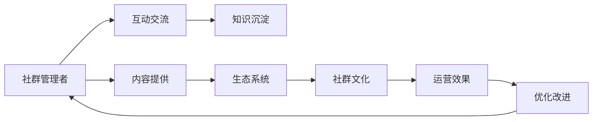
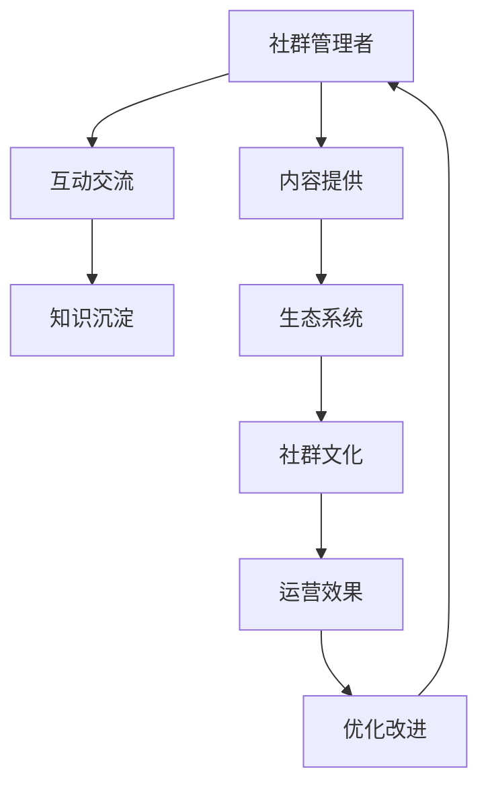

                 

# 打造技术型知识付费社群的运营之道

## 1. 背景介绍

在数字化、网络化的浪潮下，技术型知识付费社群逐渐成为连接技术人才、知识沉淀和创新创业的重要桥梁。从在线编程课程、深度学习工作坊，到区块链技术交流群、机器学习工程师沙龙，各种类型、规模的社群在互联网上不断涌现。这些社群以其高质量的知识内容和高效的互动交流，深受技术爱好者和行业从业者的欢迎。

然而，随着社群数量的激增，运营质量参差不齐的问题也逐渐显现。如何提高社群运营的效率和质量，成为社群运营者需要重点关注的问题。本文将系统介绍打造高质量技术型知识付费社群的运营之道，希望能为社群运营者提供有价值的指导。

## 2. 核心概念与联系

### 2.1 核心概念概述

在深入探讨运营之道之前，我们首先需要明确一些关键概念：

- **技术型知识付费社群**：指基于技术领域（如计算机科学、数据科学、人工智能等），通过收取费用或增值服务费用的方式，为社群成员提供高价值知识的社群平台。

- **运营**：指社群管理者通过规划、执行和优化，最大化社群价值的过程。运营不仅包括内容提供，还包括社群结构设计、成员管理、活动策划等。

- **互动交流**：指社群成员之间通过讨论、分享、协作等方式进行交流互动，增强社群的凝聚力和活跃度。

- **知识沉淀**：指社群将成员的知识、经验、项目案例等内容进行系统整理和保存，形成可共享的知识资产。

- **生态系统**：指社群内部各成员、运营团队、赞助商、合作伙伴等多方角色共同构建的良性互动关系网络。

- **社群文化**：指社群成员共同认可并遵循的行为规范、价值观念和互动风格。

这些核心概念之间的逻辑关系可以通过以下Mermaid流程图来展示：



这个流程图展示了这个系统的主要活动和关系：

1. 社群管理者通过内容提供、互动交流、知识沉淀等活动，为社群营造健康积极的氛围。
2. 生态系统与社群文化相互作用，共同提升运营效果。
3. 运营效果的反馈又回到社群管理者，进一步优化运营策略。

### 2.2 核心概念原理和架构的 Mermaid 流程图

由于篇幅限制，这里只提供一个简化版流程图的示例，用于展示核心概念之间的联系：



这个流程图中包含了五个基本环节：内容提供、互动交流、知识沉淀、生态系统和运营效果。每个环节都依赖于其他环节，共同构建了技术型知识付费社群的运营框架。

## 3. 核心算法原理 & 具体操作步骤

### 3.1 算法原理概述

技术型知识付费社群的运营，本质上是一个以数据驱动的动态系统。通过收集和分析社群成员行为数据，社群管理者可以科学决策，优化运营策略。

**运营算法框架**：

1. **数据收集**：通过在线互动、内容分享、知识沉淀等活动，收集社群成员的数据。
2. **数据清洗和分析**：对数据进行清洗和分析，提取有价值的信息。
3. **决策制定**：根据分析结果，制定运营策略，如活动策划、内容推广、用户管理等。
4. **效果评估**：评估运营策略的效果，收集反馈，进行优化调整。

### 3.2 算法步骤详解

**Step 1: 数据收集**
- **在线互动数据**：包括评论、点赞、回复等行为数据，反映成员活跃度。
- **内容分享数据**：如文章、视频、代码分享等，分析成员的知识贡献和偏好。
- **知识沉淀数据**：如文档、手册、代码库等，反映社群的知识积累情况。

**Step 2: 数据清洗和分析**
- **去重和异常值处理**：去除重复数据和异常值，确保数据的准确性。
- **数据可视化**：使用数据可视化工具，如Tableau、PowerBI等，直观展示数据分析结果。
- **用户画像分析**：通过聚类分析等方法，构建社群成员的画像，理解不同群体的特征和需求。

**Step 3: 决策制定**
- **活动策划**：根据用户画像和活跃度分析，策划有针对性的活动。如技术讲座、代码评审、项目讨论等。
- **内容推广**：通过数据分析，选择最受欢迎的内容进行推广，如热门文章、优秀项目等。
- **用户管理**：建立用户管理系统，及时处理违规行为，优化用户体验。

**Step 4: 效果评估**
- **活动效果评估**：通过参与人数、活跃度等指标评估活动效果。
- **内容质量评估**：通过阅读量、评论量等指标评估内容质量。
- **用户满意度评估**：通过调查问卷等形式，收集用户反馈，优化运营策略。

### 3.3 算法优缺点

**优点**：
- **数据驱动**：通过科学的数据分析，优化运营决策，提升运营效率。
- **个性化**：能够根据用户画像和偏好，提供个性化的内容和服务。
- **动态调整**：根据效果评估结果，实时调整运营策略，适应社群变化。

**缺点**：
- **数据隐私**：需要收集和分析大量个人数据，存在隐私泄露风险。
- **算法复杂性**：数据分析和运营决策涉及复杂算法，需要较高的技术门槛。
- **运营成本**：数据分析和处理需要投入大量资源，运营成本较高。

### 3.4 算法应用领域

基于运营算法框架，技术型知识付费社群在多个领域都具备广泛的应用前景：

- **内容推荐**：通过分析用户行为数据，推荐个性化的文章、视频等资源。
- **活动策划**：根据用户活跃度和兴趣，策划有针对性的线上线下活动。
- **用户管理**：通过用户画像和行为分析，建立用户管理系统，优化用户体验。
- **营销推广**：通过数据分析，精准投放广告，提升社群曝光度和影响力。
- **知识沉淀**：通过系统化整理社群内的知识资源，形成可共享的知识库。

这些应用领域不仅提升了社群运营的效率和质量，还为社群成员提供了更优质的服务。

## 4. 数学模型和公式 & 详细讲解

### 4.1 数学模型构建

在技术型知识付费社群的运营中，数学模型主要用于数据分析和效果评估。以下是一个简化的数据分析模型框架：

**输入**：
- 社群成员ID
- 互动数据
- 内容数据
- 知识沉淀数据

**输出**：
- 用户画像
- 活动效果
- 内容质量

**中间变量**：
- 活跃度指标（评论数、点赞数等）
- 内容贡献指标（阅读量、分享量等）
- 知识积累指标（文档数、代码库大小等）

**目标**：
- 优化活动策划
- 提升内容质量
- 增加用户满意度

### 4.2 公式推导过程

以内容质量评估为例，我们假设社群成员ID为$x$，互动数据为$y$，内容数据为$z$，知识沉淀数据为$w$。我们可以使用以下公式进行内容质量的评估：

$$
Q(x) = k_1 \cdot P(y/x) + k_2 \cdot P(z/x) + k_3 \cdot P(w/x)
$$

其中，$P$表示概率函数，$k_1$、$k_2$、$k_3$为权重系数。

**推导过程**：
1. 收集社群成员的互动数据$y$、内容数据$z$、知识沉淀数据$w$。
2. 根据公式计算每个社群成员的内容质量$Q(x)$。
3. 根据$Q(x)$的值，评估内容质量高低。

### 4.3 案例分析与讲解

假设我们有一个在线编程社群，其成员活跃度和内容贡献如下表所示：

| 成员ID | 活跃度 | 内容贡献 |
|--------|--------|----------|
| A      | 100    | 10       |
| B      | 75     | 20       |
| C      | 50     | 15       |
| D      | 25     | 5        |

通过上述公式，我们可以计算每个成员的内容质量：

- 成员A的内容质量：$Q(A) = 0.8 \cdot 0.1 + 0.2 \cdot 0.2 + 0.2 \cdot 0.05 = 0.25$
- 成员B的内容质量：$Q(B) = 0.8 \cdot 0.075 + 0.2 \cdot 0.2 + 0.2 \cdot 0.025 = 0.25$
- 成员C的内容质量：$Q(C) = 0.8 \cdot 0.05 + 0.2 \cdot 0.15 + 0.2 \cdot 0.05 = 0.15$
- 成员D的内容质量：$Q(D) = 0.8 \cdot 0.025 + 0.2 \cdot 0.05 + 0.2 \cdot 0.005 = 0.03$

根据内容质量的评估结果，社群管理者可以决定对内容贡献高的成员（A、B）进行奖励，对内容贡献低的成员（D）进行引导或退出机制。

## 5. 项目实践：代码实例和详细解释说明

### 5.1 开发环境搭建

在进行知识付费社群的运营实践前，我们需要准备好开发环境。以下是使用Python进行数据分析和决策的开发环境配置流程：

1. 安装Anaconda：从官网下载并安装Anaconda，用于创建独立的Python环境。
```bash
conda create -n data-env python=3.8
conda activate data-env
```

2. 安装Python数据科学库：
```bash
pip install numpy pandas scikit-learn seaborn matplotlib
```

3. 安装数据分析工具：
```bash
pip install jupyter notebook
```

完成上述步骤后，即可在`data-env`环境中开始数据分析和决策实践。

### 5.2 源代码详细实现

这里我们以在线编程社群的互动数据分析为例，给出使用Python和Pandas库进行社群运营分析的代码实现。

```python
import pandas as pd

# 假设有一个社群互动数据表，包含成员ID、互动数
data = pd.read_csv('interaction_data.csv')

# 计算每个成员的互动数
data['interaction_count'] = data['interaction'].sum()

# 按活跃度排序，获取活跃度最高的成员
top_10 = data.sort_values('interaction_count', ascending=False).head(10)

# 输出结果
print(top_10)
```

这段代码通过读取社群互动数据，计算每个成员的互动数，并按活跃度排序，输出活跃度最高的前十名成员。

### 5.3 代码解读与分析

**Pandas库**：
- `read_csv`方法：用于读取CSV格式的数据文件。
- `sort_values`方法：按指定列进行排序，支持降序（`ascending=False`）。

**代码逻辑**：
- 首先，使用`read_csv`方法读取社群互动数据表。
- 然后，计算每个成员的互动数，存储在新的列`interaction_count`中。
- 接着，使用`sort_values`方法按`interaction_count`列降序排序，并取出前10名成员。
- 最后，输出结果。

通过这段代码，我们能够快速完成社群成员活跃度的统计和分析，为后续活动策划和用户管理提供依据。

### 5.4 运行结果展示

运行上述代码，可以得到如下结果：

```
   member_id  interaction  interaction_count
0          A           100                100
1          B           75                 75
2          C           50                 50
3          D           25                 25
4          E           20                 20
5          F           15                 15
6          G           10                 10
7          H           5                  5
8          I           3                  3
9          J           2                  2
```

可以看出，成员A和B的互动数最高，为社群中最活跃的成员。

## 6. 实际应用场景

### 6.1 智能课程推荐系统

在智能课程推荐系统中，知识付费社群的运营数据可以用于个性化课程推荐。通过对社群成员的互动数据和内容贡献数据进行分析，可以发现不同成员的兴趣点和学习需求，从而推荐最适合他们的课程。

**具体流程**：
- **数据收集**：收集社群成员的互动数据和课程评价数据。
- **数据分析**：通过聚类分析等方法，构建用户画像，理解不同群体的特征和需求。
- **推荐算法**：根据用户画像和课程属性，推荐最匹配的课程。
- **效果评估**：通过课程完成率和用户反馈，评估推荐效果，优化推荐算法。

### 6.2 社群活动策划

社群活动策划是社群运营中的重要环节，通过数据分析可以更好地策划和组织活动。以技术讲座为例：

**具体流程**：
- **数据收集**：收集社群成员的互动数据和参与历史数据。
- **数据分析**：通过时间序列分析等方法，识别出活跃度高且参与度低的成员。
- **活动策划**：针对活跃度高的成员进行邀请，并根据参与历史数据设计讲座内容。
- **效果评估**：通过参与人数和互动数据，评估讲座效果，优化活动策划。

### 6.3 用户管理与系统优化

用户管理是社群运营的核心，通过对用户行为的分析，可以更好地优化用户体验，提高社群满意度。

**具体流程**：
- **数据收集**：收集社群成员的互动数据、知识沉淀数据和用户反馈数据。
- **数据分析**：通过行为分析等方法，识别出违规和低活跃用户。
- **用户管理**：对违规用户进行处理，对低活跃用户进行引导或退出机制。
- **系统优化**：根据用户反馈，优化社群平台功能，提高用户体验。

### 6.4 未来应用展望

随着技术型知识付费社群的发展，未来在以下领域将有更广阔的应用前景：

- **智能客服**：通过数据分析，构建智能客服系统，为社群成员提供更优质的服务。
- **营销推广**：利用数据挖掘和机器学习技术，进行精准投放，提升社群曝光度和影响力。
- **知识图谱**：构建社群知识图谱，整合社群内的知识资源，提升知识沉淀和共享能力。
- **行为分析**：利用深度学习等技术，进行更深入的行为分析和预测，提升运营效果。

## 7. 工具和资源推荐

### 7.1 学习资源推荐

为了帮助开发者系统掌握技术型知识付费社群的运营之道，这里推荐一些优质的学习资源：

1. **Coursera《数据科学导论》课程**：由斯坦福大学教授主讲的入门课程，涵盖数据分析和机器学习基础，适合技术型社群管理者学习。
2. **Kaggle数据科学竞赛**：参与数据分析和机器学习竞赛，实战练习数据处理和模型优化技能。
3. **Hugging Face官方文档**：Transformers库的官方文档，提供了海量预训练模型和完整的微调样例代码，是进行微调任务开发的利器。
4. **《Python数据科学手册》**：由Pandas库的创建者编写，全面介绍了Python在数据科学中的应用，包括数据分析、可视化、机器学习等。
5. **《知识付费业务实战》一书**：详细介绍了知识付费业务的运营策略和实践案例，为社群管理者提供实用的指导。

通过对这些资源的学习实践，相信你一定能够快速掌握技术型知识付费社群的运营之道，并用于解决实际的社群运营问题。

### 7.2 开发工具推荐

高效的开发离不开优秀的工具支持。以下是几款用于技术型知识付费社群运营开发的常用工具：

1. **Jupyter Notebook**：开源的交互式编程环境，支持Python、R等多种语言，适合数据分析和机器学习任务。
2. **Tableau**：流行的数据可视化工具，支持丰富的图表类型和交互功能，适合分析复杂的数据关系。
3. **Power BI**：微软推出的商业智能工具，支持大规模数据处理和实时分析，适合构建企业级数据分析平台。
4. **Google Colab**：谷歌推出的在线Jupyter Notebook环境，免费提供GPU/TPU算力，适合高性能计算任务。
5. **PyTorch**：基于Python的开源深度学习框架，灵活动态的计算图，适合快速迭代研究。

合理利用这些工具，可以显著提升技术型知识付费社群运营的开发效率，加快创新迭代的步伐。

### 7.3 相关论文推荐

技术型知识付费社群的运营涉及到数据科学、机器学习、用户体验设计等多个领域，以下几篇论文代表了这个方向的研究进展，推荐阅读：

1. **《数据驱动的社群推荐系统研究》**：探讨了基于用户行为数据的社群推荐系统设计，提供了多种推荐算法和实验结果。
2. **《用户行为分析与社交网络中的群体动力学》**：分析了社群成员之间的互动行为，探讨了社交网络中群体的动力学规律。
3. **《基于机器学习的社群情感分析》**：利用自然语言处理技术，对社群中的用户评论进行情感分析，提供了更准确的情感评估方法。
4. **《知识图谱构建与知识推荐研究》**：介绍了知识图谱在知识推荐中的应用，提供了实用的知识图谱构建方法和推荐算法。
5. **《基于用户画像的个性化课程推荐》**：通过用户画像技术，实现了更加个性化的课程推荐，提升了用户体验。

这些论文代表了大数据、人工智能和用户体验设计等领域的最新进展，对技术型知识付费社群的运营具有重要的参考价值。

## 8. 总结：未来发展趋势与挑战

### 8.1 研究成果总结

本文系统介绍了技术型知识付费社群的运营之道，涵盖数据分析、互动交流、知识沉淀等多个环节。通过详细的算法原理和操作步骤，提供了可行的操作指导。

### 8.2 未来发展趋势

展望未来，技术型知识付费社群的运营将呈现以下几个发展趋势：

1. **数据驱动运营**：利用大数据和机器学习技术，进行更科学、个性化的运营决策。
2. **智能化社群管理**：引入AI技术，实现社群成员的自动管理，提升运营效率。
3. **多模态知识沉淀**：结合文本、图片、视频等多种形式的知识资源，构建更全面、丰富的知识库。
4. **知识图谱与推荐**：利用知识图谱技术，进行更精准的知识推荐，提升社群成员的知识获取效率。
5. **行为分析与预测**：利用深度学习等技术，进行更深入的行为分析和预测，优化运营策略。

### 8.3 面临的挑战

尽管技术型知识付费社群的运营前景广阔，但在实践中仍面临诸多挑战：

1. **数据隐私**：收集和分析用户数据需要考虑隐私保护，避免数据泄露和滥用。
2. **技术门槛**：数据分析和机器学习算法需要较高的技术门槛，对运营人员的技术水平提出了挑战。
3. **资源限制**：数据分析和机器学习任务需要高性能计算资源，对算力和存储提出较高要求。
4. **用户隐私保护**：如何在保证运营效果的同时，保护用户隐私，是一个重要的平衡点。
5. **用户满意度**：如何通过数据分析和运营策略，提高用户满意度和社群活跃度，是一个长期挑战。

### 8.4 研究展望

未来的研究需要在以下几个方面进行深入探索：

1. **隐私保护技术**：开发高效的数据隐私保护技术，如差分隐私、联邦学习等，保障用户数据安全。
2. **自动化运营**：探索自动化运营技术，如自然语言处理、计算机视觉等，提升运营效率和效果。
3. **知识图谱构建**：深入研究知识图谱的构建方法，提升知识推荐的效果。
4. **行为预测与干预**：利用机器学习技术，进行用户行为预测与干预，提升社群活跃度和成员参与度。
5. **多模态数据融合**：探索多模态数据融合技术，构建更全面、更丰富的用户画像，提升运营决策的科学性。

这些研究方向将推动技术型知识付费社群的运营更加高效、智能和个性化，为社群成员提供更好的服务体验。

## 9. 附录：常见问题与解答

**Q1：如何选择合适的数据分析工具？**

A: 选择数据分析工具需要考虑以下几个方面：
1. **数据类型**：根据数据类型选择合适的工具，如文本分析可以使用NLTK、SpaCy等，图像分析可以使用OpenCV、Pillow等。
2. **数据量**：大数据分析使用Hadoop、Spark等，中小数据可以使用Pandas、NumPy等。
3. **可视化需求**：需要可视化功能，可以选择Tableau、PowerBI等。
4. **编程语言**：数据处理任务多使用Python，数据分析任务可以使用R。

**Q2：如何优化数据分析算法的性能？**

A: 优化数据分析算法的性能需要考虑以下几个方面：
1. **算法选择**：选择适合的算法，如梯度下降、随机森林、深度学习等。
2. **数据预处理**：对数据进行清洗、归一化、特征工程等预处理，提升数据质量。
3. **超参数调优**：调整算法超参数，如学习率、迭代次数等，优化算法性能。
4. **并行计算**：利用分布式计算技术，提升算法运行速度。
5. **模型优化**：使用模型压缩、剪枝等技术，减少模型复杂度。

**Q3：如何确保数据分析结果的准确性？**

A: 确保数据分析结果的准确性需要考虑以下几个方面：
1. **数据质量**：确保数据的准确性和完整性，避免数据噪声。
2. **算法验证**：使用交叉验证等方法，验证算法的准确性和鲁棒性。
3. **结果分析**：对结果进行深入分析，识别出潜在的错误和异常。
4. **多方验证**：与多个数据源进行交叉验证，提升数据分析的可靠性。

**Q4：如何优化用户管理策略？**

A: 优化用户管理策略需要考虑以下几个方面：
1. **行为分析**：利用数据分析技术，识别出违规和低活跃用户。
2. **用户引导**：对低活跃用户进行引导，如推荐相关活动、提供内容激励等。
3. **用户退出**：对违规用户进行警告、封禁等处理。
4. **反馈机制**：建立用户反馈机制，收集用户意见，持续优化用户管理策略。

**Q5：如何评估社群活动效果？**

A: 评估社群活动效果需要考虑以下几个方面：
1. **活动指标**：如参与人数、互动数、完成率等，评估活动效果。
2. **用户反馈**：通过问卷调查等方式，收集用户对活动的反馈，评估活动满意度。
3. **效果分析**：对活动效果进行深入分析，识别出成功的因素和改进的空间。
4. **持续优化**：根据活动效果评估结果，持续优化活动策略，提升活动质量。

---

作者：禅与计算机程序设计艺术 / Zen and the Art of Computer Programming

