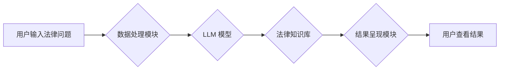

                 

## 法律研究助手：LLM 简化法律复杂性

> 关键词：LLM, 大语言模型, 法律研究, 自然语言处理, 法律科技, 法律分析, 合同审查, 法律文本生成

### 1. 背景介绍

法律领域以其复杂性、庞大的信息量和高度的专业性而闻名。传统法律研究方法依赖于人工阅读和分析大量的法律文件，这既耗时又费力。随着人工智能技术的快速发展，特别是大语言模型（LLM）的出现，为法律研究带来了新的机遇。LLM 能够理解和生成人类语言，具备强大的文本处理能力，为简化法律复杂性、提高法律研究效率提供了新的可能性。

### 2. 核心概念与联系

**2.1  大语言模型 (LLM)**

大语言模型是一种基于深度学习的强大人工智能模型，能够理解和生成人类语言。它们通过训练在海量文本数据上，学习语言的语法、语义和上下文关系。LLM 拥有以下关键特征：

* **强大的文本理解能力:** 能够理解复杂的法律文本，识别关键信息和法律概念。
* **高效的文本生成能力:** 可以生成法律文件、合同条款、法律意见书等法律文本。
* **灵活的应用场景:** 可用于法律研究、合同审查、法律咨询、法律文本摘要等多个领域。

**2.2  法律研究助手**

法律研究助手是指利用 LLM 技术开发的软件工具，旨在辅助律师、法官和其他法律专业人员进行法律研究。它可以帮助用户快速查找相关法律法规、分析法律案例、生成法律文件，从而提高法律研究效率和准确性。

**2.3  核心架构**

LLM 法律研究助手通常由以下核心组件组成：

* **LLM 模型:** 作为核心引擎，负责理解和生成法律文本。
* **法律知识库:** 包含法律法规、案例判例、法律条文等法律知识，为 LLM 提供背景信息和专业知识。
* **用户界面:** 提供用户友好的交互界面，方便用户输入查询条件、浏览结果和生成法律文件。
* **数据处理模块:** 处理用户输入的法律问题，将其转化为 LLM 可以理解的格式。
* **结果呈现模块:** 将 LLM 生成的结果以可读的方式呈现给用户。

**Mermaid 流程图**



### 3. 核心算法原理 & 具体操作步骤

**3.1  算法原理概述**

LLM 法律研究助手主要基于 Transformer 架构，是一种深度学习模型，能够有效捕捉文本中的长距离依赖关系。其核心算法包括：

* **自注意力机制:** 允许模型关注文本中不同部分之间的关系，理解上下文信息。
* **多头注意力机制:** 使用多个注意力头，从不同的角度捕捉文本信息。
* **前馈神经网络:** 对每个词的嵌入向量进行非线性变换，提取更深层次的特征。

**3.2  算法步骤详解**

1. **数据预处理:** 将法律文本进行清洗、分词、标记等预处理操作，使其适合 LLM 模型训练。
2. **模型训练:** 使用海量法律文本数据训练 LLM 模型，使其能够理解法律语言和法律概念。
3. **用户输入:** 用户输入法律问题或查询条件。
4. **文本编码:** 将用户输入的文本转换为数字向量，作为模型输入。
5. **模型推理:** LLM 模型根据训练数据和输入文本，进行推理和计算，生成相应的法律文本或分析结果。
6. **结果解码:** 将模型输出的数字向量解码为可读的法律文本。
7. **结果呈现:** 将解码后的法律文本以用户友好的方式呈现给用户。

**3.3  算法优缺点**

**优点:**

* **强大的文本理解能力:** 能够理解复杂的法律文本，识别关键信息和法律概念。
* **高效的文本生成能力:** 可以生成法律文件、合同条款、法律意见书等法律文本。
* **提高法律研究效率:** 自动化法律研究流程，节省时间和人力成本。

**缺点:**

* **数据依赖性:** LLM 模型的性能取决于训练数据的质量和数量。
* **解释性不足:** LLM 模型的决策过程难以解释，缺乏透明度。
* **法律知识更新:** 法律法规和案例判例不断更新，需要定期更新 LLM 模型的知识库。

**3.4  算法应用领域**

* **法律研究:** 快速查找相关法律法规、分析法律案例、生成法律意见书。
* **合同审查:** 自动识别合同条款中的风险和漏洞，提高合同审查效率。
* **法律咨询:** 提供基于法律知识的在线咨询服务，解答用户的法律问题。
* **法律文本生成:** 自动生成法律文件、合同条款、诉状等法律文本。

### 4. 数学模型和公式 & 详细讲解 & 举例说明

**4.1  数学模型构建**

LLM 模型通常基于 Transformer 架构，其核心是自注意力机制和多头注意力机制。

* **自注意力机制:** 用于计算每个词与其他词之间的相关性，捕捉文本中的长距离依赖关系。其计算公式如下：

$$
Attention(Q, K, V) = softmax(\frac{QK^T}{\sqrt{d_k}})V
$$

其中：

* $Q$：查询矩阵
* $K$：键矩阵
* $V$：值矩阵
* $d_k$：键向量的维度
* $softmax$：softmax 函数，用于归一化注意力权重

* **多头注意力机制:** 使用多个注意力头，从不同的角度捕捉文本信息。每个注意力头独立计算注意力权重，然后将结果进行拼接，形成最终的注意力输出。

**4.2  公式推导过程**

自注意力机制的计算过程可以分为以下步骤：

1. 将输入序列中的每个词转换为查询向量 $Q$、键向量 $K$ 和值向量 $V$。
2. 计算每个词与所有其他词之间的注意力权重。
3. 使用注意力权重对值向量进行加权求和，得到每个词的上下文表示。

**4.3  案例分析与讲解**

例如，在分析法律文本“合同违约导致损失”时，自注意力机制可以捕捉到“违约”和“损失”之间的关系，理解它们之间的因果关系。多头注意力机制可以从不同的角度分析文本，例如，一个注意力头可能关注“违约”的具体内容，另一个注意力头可能关注“损失”的金额和类型。

### 5. 项目实践：代码实例和详细解释说明

**5.1  开发环境搭建**

* **操作系统:** Linux 或 macOS
* **编程语言:** Python
* **深度学习框架:** TensorFlow 或 PyTorch
* **其他工具:** Git、Jupyter Notebook

**5.2  源代码详细实现**

以下是一个使用 TensorFlow 实现简单 LLM 法律研究助手代码示例：

```python
import tensorflow as tf

# 定义模型架构
model = tf.keras.Sequential([
    tf.keras.layers.Embedding(input_dim=vocab_size, output_dim=embedding_dim),
    tf.keras.layers.LSTM(units=128),
    tf.keras.layers.Dense(units=vocab_size, activation='softmax')
])

# 编译模型
model.compile(optimizer='adam', loss='sparse_categorical_crossentropy', metrics=['accuracy'])

# 训练模型
model.fit(train_data, train_labels, epochs=10)

# 使用模型进行预测
predictions = model.predict(test_data)
```

**5.3  代码解读与分析**

* **Embedding 层:** 将输入的词转换为稠密的向量表示。
* **LSTM 层:** 用于捕捉文本中的长距离依赖关系。
* **Dense 层:** 输出层，预测下一个词的概率分布。

**5.4  运行结果展示**

训练完成后，可以使用模型对新的法律文本进行预测，例如，根据输入的法律问题，生成相应的法律意见书。

### 6. 实际应用场景

**6.1  法律研究助手**

* **法律法规查找:** 快速查找相关法律法规，节省时间和精力。
* **案例分析:** 分析法律案例，识别判例中的关键信息和法律适用范围。
* **法律意见书生成:** 根据法律问题，自动生成法律意见书草稿。

**6.2  合同审查助手**

* **风险识别:** 自动识别合同条款中的风险和漏洞，提醒律师进行审查。
* **条款比较:** 对不同版本的合同条款进行比较，识别差异和潜在问题。
* **合同生成:** 根据用户需求，自动生成合同条款草稿。

**6.3  法律咨询助手**

* **在线咨询:** 提供基于法律知识的在线咨询服务，解答用户的法律问题。
* **法律信息检索:** 根据用户的法律问题，检索相关法律法规和案例判例。
* **法律风险评估:** 根据用户的具体情况，评估潜在的法律风险。

**6.4  未来应用展望**

* **更精准的法律分析:** 利用更先进的 LLMs 和法律知识库，实现更精准的法律分析和预测。
* **个性化的法律服务:** 根据用户的具体需求，提供个性化的法律服务。
* **法律智能化:** 将 LLM 技术与其他人工智能技术结合，实现法律智能化，例如，自动生成法律文件、自动进行法律诉讼等。

### 7. 工具和资源推荐

**7.1  学习资源推荐**

* **书籍:**
    * 《深度学习》 by Ian Goodfellow, Yoshua Bengio, and Aaron Courville
    * 《自然语言处理》 by Dan Jurafsky and James H. Martin
* **在线课程:**
    * Coursera: Natural Language Processing Specialization
    * edX: Deep Learning
* **博客和论坛:**
    * TensorFlow Blog
    * PyTorch Blog
    * Stack Overflow

**7.2  开发工具推荐**

* **深度学习框架:** TensorFlow, PyTorch
* **自然语言处理库:** NLTK, spaCy
* **代码编辑器:** VS Code, Atom
* **云平台:** Google Cloud Platform, Amazon Web Services

**7.3  相关论文推荐**

* **BERT:** Devlin, J., Chang, M. W., Lee, K., & Toutanova, K. (2018). BERT: Pre-training of deep bidirectional transformers for language understanding. arXiv preprint arXiv:1810.04805.
* **GPT-3:** Brown, T. B., Mann, B., Ryder, N., Subbiah, M., Kaplan, J., Dhariwal, P., ... & Amodei, D. (2020). Language models are few-shot learners. arXiv preprint arXiv:2005.14165.
* **T5:** Raffel, C., Shazeer, N., Roberts, A., Lee, K., Narang, S., Matena, M., ... & Dean, J. (2019). Exploring the limits of transfer learning with a unified text-to-text transformer. arXiv preprint arXiv:1910.10683.

### 8. 总结：未来发展趋势与挑战

**8.1  研究成果总结**

LLM 法律研究助手在法律研究、合同审查、法律咨询等领域展现出巨大的潜力，能够提高法律工作效率，降低成本，并为用户提供更便捷的法律服务。

**8.2  未来发展趋势**

* **模型规模和性能提升:** 随着计算能力的提升，LLM 模型规模将进一步扩大，性能将得到显著提升。
* **法律知识库的完善:** 法律知识库将更加完善，涵盖更广泛的法律法规和案例判例。
* **多模态法律分析:** 将 LLMs 与其他模态数据（例如图像、音频）结合，实现多模态法律分析。
* **法律伦理和可解释性:** 研究 LLMs 在法律领域的伦理问题和可解释性，确保其安全、可靠和透明的使用。

**8.3  面临的挑战**

* **数据质量和偏见:** LLM 模型的性能依赖于训练数据的质量，而法律数据往往存在不完整、不准确和偏见等问题。
* **法律知识的动态性:** 法律法规和案例判例不断更新，需要不断更新 LLM 模型的知识库。
* **法律解释的复杂性:** 法律解释往往需要考虑多种因素和上下文信息，LLM 模型难以完全模拟人类的法律判断能力。
* **法律责任和监管:** LLMs 在法律领域的应用涉及法律责任和监管问题，需要制定相应的法律法规和规范。

**8.4  研究展望**

未来，LLM 法律研究助手将继续朝着更智能、更精准、更安全的方向发展，为法律工作者提供更强大的工具和服务，推动法律行业的数字化转型。


### 9. 附录：常见问题与解答

**9.1  LLM 法律研究助手可以替代律师吗？**

LLM 法律研究助手可以辅助律师进行法律研究和分析，但不能完全替代律师。律师需要具备丰富的法律知识、专业经验和批判性思维能力，才能为客户提供全面的法律服务。

**9.2  LLM 法律研究助手的数据安全如何保障？**

LLM 法律研究助手需要处理大量的法律数据，数据安全是至关重要的。开发商需要采取相应的技术措施和安全策略，确保数据的 confidentiality、integrity 和 availability。

**9.3  LLM 法律研究助手如何应对法律知识的动态性？**

LLM 法律研究助手需要定期更新法律知识库，以应对法律法规和案例判例的不断变化。开发商可以采用自动更新机制，或定期由法律专家进行知识库维护。

**9.4  LLM 法律研究助手如何保证法律解释的准确性？**

LLM 法律研究助手在法律解释方面仍然存在局限性，需要结合人类的法律判断能力。开发商可以采用多模型融合、专家审核等方法，提高法律解释的准确性。


作者：禅与计算机程序设计艺术 / Zen and the Art of Computer Programming 
<end_of_turn>

