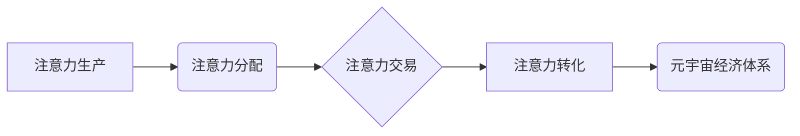

                 

## 注意力产业链：元宇宙经济体系的核心

> 关键词：注意力、元宇宙、经济体系、深度学习、神经网络、注意力机制、数据驱动、商业模式

## 1. 背景介绍

元宇宙概念的兴起，标志着人类进入一个全新的数字世界。这个虚拟世界将融合现实世界中的社交、娱乐、工作等多种场景，并以沉浸式体验为核心，构建一个更加丰富、交互、虚拟化的生活方式。然而，元宇宙的构建并非仅仅依靠技术手段，更需要一个完善的经济体系来支撑其发展。而注意力，作为人类认知的核心要素，将成为元宇宙经济体系的基石。

传统互联网时代，注意力被视为一种稀缺资源，广告主通过各种手段争夺用户的注意力，而用户则在海量信息中寻找自己感兴趣的内容。元宇宙时代，注意力将更加重要，因为虚拟世界将更加沉浸、交互，用户在虚拟世界中投入的时间和精力将更多。这意味着，元宇宙经济体系需要更加高效地分配和利用注意力资源，才能实现可持续发展。

## 2. 核心概念与联系

**2.1 元宇宙经济体系**

元宇宙经济体系是指在元宇宙环境中形成的经济活动体系，它涵盖了虚拟资产交易、数字内容创作、虚拟服务提供等多种领域。元宇宙经济体系的核心是用户，用户通过参与虚拟世界中的各种活动，创造、消费和交易价值，从而推动整个经济体系的运转。

**2.2 注意力机制**

注意力机制是一种模仿人类认知机制的深度学习技术，它能够帮助模型聚焦于输入数据中最重要的部分，从而提高模型的学习效率和准确性。在自然语言处理、计算机视觉等领域，注意力机制已经取得了显著的成果。

**2.3 注意力产业链**

注意力产业链是指围绕元宇宙经济体系，以注意力为核心资源，构建的一系列价值链。它包括注意力生产、注意力分配、注意力交易、注意力转化等环节，每个环节都扮演着重要的角色。

**2.4  注意力产业链架构**



**2.5  注意力产业链的价值**

注意力产业链能够有效地分配和利用注意力资源，为元宇宙经济体系的健康发展提供保障。它能够帮助用户更好地发现和获取自己感兴趣的内容，提升用户体验；同时，也能帮助内容创作者和服务提供者更精准地触达目标用户，提高商业效率。

## 3. 核心算法原理 & 具体操作步骤

### 3.1  算法原理概述

注意力机制的核心思想是通过学习一个权重向量，来突出输入数据中与当前任务相关的部分，并抑制无关的部分。这种机制能够帮助模型更好地理解输入数据，提高模型的性能。

常见的注意力机制包括：

* **自注意力机制 (Self-Attention):**  用于处理序列数据，能够捕捉序列中不同元素之间的关系。
* **交叉注意力机制 (Cross-Attention):** 用于处理多个序列数据，能够捕捉不同序列之间的关系。

### 3.2  算法步骤详解

**自注意力机制的具体操作步骤如下：**

1. **计算查询 (Query)、键 (Key) 和值 (Value) 向量:** 将输入序列中的每个元素映射到三个不同的向量空间，分别表示查询、键和值。
2. **计算注意力权重:**  通过计算查询向量与键向量的点积，得到注意力权重。
3. **加权求和:**  将值向量与注意力权重进行加权求和，得到输出向量。

**交叉注意力机制的具体操作步骤如下：**

1. **计算查询 (Query)、键 (Key) 和值 (Value) 向量:** 将两个序列中的每个元素映射到三个不同的向量空间，分别表示查询、键和值。
2. **计算注意力权重:**  通过计算查询向量与键向量的点积，得到注意力权重。
3. **加权求和:**  将值向量与注意力权重进行加权求和，得到输出向量。

### 3.3  算法优缺点

**优点:**

* 能够捕捉序列数据中长距离依赖关系。
* 能够提高模型的学习效率和准确性。

**缺点:**

* 计算复杂度较高。
* 训练数据量较大。

### 3.4  算法应用领域

注意力机制在自然语言处理、计算机视觉、语音识别等领域都有广泛的应用。

* **自然语言处理:**  机器翻译、文本摘要、问答系统等。
* **计算机视觉:**  图像分类、目标检测、图像 Captioning 等。
* **语音识别:**  语音转文本、语音合成等。

## 4. 数学模型和公式 & 详细讲解 & 举例说明

### 4.1  数学模型构建

注意力机制的数学模型可以概括为以下公式：

$$
\text{Attention}(Q, K, V) = \text{softmax}\left(\frac{Q K^T}{\sqrt{d_k}}\right) V
$$

其中：

* $Q$：查询向量
* $K$：键向量
* $V$：值向量
* $d_k$：键向量的维度
* $\text{softmax}$：softmax 函数，用于将注意力权重归一化到 [0, 1] 之间。

### 4.2  公式推导过程

注意力机制的公式推导过程可以分为以下几个步骤：

1. 计算查询向量 $Q$ 与键向量 $K$ 的点积，得到一个得分矩阵。
2. 对得分矩阵进行归一化，得到注意力权重矩阵。
3. 将注意力权重矩阵与值向量 $V$ 进行加权求和，得到输出向量。

### 4.3  案例分析与讲解

**举例说明：**

假设我们有一个句子 "The cat sat on the mat"，我们想要计算每个词语对句子整体语义的贡献。我们可以将每个词语映射到查询向量、键向量和值向量，然后使用注意力机制计算每个词语的注意力权重。

通过注意力权重，我们可以看到哪些词语对句子整体语义贡献更大，例如 "cat" 和 "sat" 两个词语的注意力权重较高，而 "the" 和 "on" 两个词语的注意力权重较低。

## 5. 项目实践：代码实例和详细解释说明

### 5.1  开发环境搭建

* Python 3.7+
* TensorFlow 或 PyTorch 深度学习框架
* Jupyter Notebook 或 VS Code 开发环境

### 5.2  源代码详细实现

```python
import tensorflow as tf

# 定义自注意力机制
def self_attention(query, key, value, mask=None):
    # 计算查询向量与键向量的点积
    scores = tf.matmul(query, key, transpose_b=True)
    # 对得分矩阵进行归一化
    scores = tf.nn.softmax(scores, axis=-1)
    # 将注意力权重矩阵与值向量进行加权求和
    output = tf.matmul(scores, value)
    return output

# 示例代码
# 定义查询向量、键向量和值向量
query = tf.random.normal([1, 5, 64])
key = tf.random.normal([1, 5, 64])
value = tf.random.normal([1, 5, 64])

# 计算自注意力机制输出
output = self_attention(query, key, value)
print(output.shape)
```

### 5.3  代码解读与分析

* `self_attention` 函数实现了一个基本的自注意力机制。
* 函数首先计算查询向量与键向量的点积，得到一个得分矩阵。
* 然后对得分矩阵进行 softmax 操作，得到注意力权重矩阵。
* 最后将注意力权重矩阵与值向量进行加权求和，得到输出向量。

### 5.4  运行结果展示

运行上述代码，输出结果为 `(1, 5, 64)`，表示注意力机制输出的维度与值向量相同。

## 6. 实际应用场景

### 6.1 元宇宙游戏

注意力机制可以用于元宇宙游戏中的角色扮演、剧情设计等方面，让游戏更加沉浸和交互。例如，游戏可以根据玩家的注意力分布，动态调整游戏场景和剧情走向，提供更加个性化的游戏体验。

### 6.2 元宇宙社交

注意力机制可以用于元宇宙社交平台中的内容推荐、用户匹配等方面，提高用户粘性和活跃度。例如，平台可以根据用户的注意力分布，推荐更加符合用户兴趣的内容，并帮助用户找到志趣相投的朋友。

### 6.3 元宇宙教育

注意力机制可以用于元宇宙教育平台中的知识点讲解、互动练习等方面，提高学习效率和效果。例如，平台可以根据学生的注意力分布，动态调整学习内容和节奏，并提供个性化的学习建议。

### 6.4  未来应用展望

随着元宇宙技术的不断发展，注意力机制将在元宇宙经济体系中发挥更加重要的作用。未来，注意力机制可能被应用于元宇宙中的更多领域，例如：

* 元宇宙虚拟资产交易
* 元宇宙数字内容创作
* 元宇宙虚拟服务提供
* 元宇宙商业模式创新

## 7. 工具和资源推荐

### 7.1  学习资源推荐

* **书籍:**
    * 《深度学习》
    * 《Attention Is All You Need》
* **在线课程:**
    * Coursera: 深度学习
    * Udacity: 自然语言处理
* **博客:**
    * Jay Alammar's Blog: https://jalammar.github.io/

### 7.2  开发工具推荐

* **TensorFlow:** https://www.tensorflow.org/
* **PyTorch:** https://pytorch.org/
* **Jupyter Notebook:** https://jupyter.org/

### 7.3  相关论文推荐

* **Attention Is All You Need:** https://arxiv.org/abs/1706.03762
* **BERT: Pre-training of Deep Bidirectional Transformers for Language Understanding:** https://arxiv.org/abs/1810.04805

## 8. 总结：未来发展趋势与挑战

### 8.1  研究成果总结

注意力机制在元宇宙经济体系中具有重要的应用价值，能够有效地分配和利用注意力资源，推动元宇宙经济的健康发展。

### 8.2  未来发展趋势

未来，注意力机制的研究将更加深入，并朝着以下几个方向发展：

* **更有效的注意力机制:**  开发更加高效、准确的注意力机制，能够更好地捕捉复杂数据中的关系。
* **可解释性更强的注意力机制:**  研究注意力机制的内部机制，提高模型的可解释性。
* **跨模态注意力机制:**  研究能够处理多种模态数据的注意力机制，例如文本、图像、音频等。

### 8.3  面临的挑战

注意力机制在元宇宙经济体系中的应用也面临一些挑战：

* **数据隐私问题:**  注意力机制需要大量用户数据进行训练，如何保护用户隐私是一个重要的挑战。
* **算法公平性问题:**  注意力机制可能会存在偏见，导致算法结果不公平。
* **伦理问题:**  注意力机制可能会被用于操纵用户行为，需要考虑其伦理问题。

### 8.4  研究展望

未来，我们需要更加重视注意力机制的伦理问题，并制定相应的规范和制度，确保注意力机制的健康发展。同时，还需要加强对注意力机制的安全性研究，防止其被恶意利用。


## 9. 附录：常见问题与解答

**Q1: 注意力机制与传统机器学习模型有什么区别？**

**A1:** 传统机器学习模型通常是基于特征工程，需要人工提取特征，而注意力机制则能够自动学习数据中的重要特征，无需人工干预。

**Q2: 注意力机制的计算复杂度较高，如何进行优化？**

**A2:**  可以通过使用更有效的注意力机制算法、并行计算等方法来降低注意力机制的计算复杂度。

**Q3: 注意力机制的应用场景有哪些？**

**A3:** 注意力机制的应用场景非常广泛，包括自然语言处理、计算机视觉、语音识别等领域。

**Q4: 如何评估注意力机制的性能？**

**A4:**  可以通过使用准确率、召回率、F1-score等指标来评估注意力机制的性能。


作者：禅与计算机程序设计艺术 / Zen and the Art of Computer Programming 
<end_of_turn>

