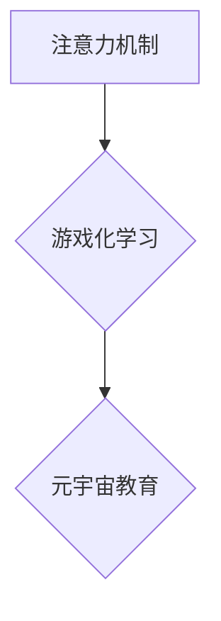

                 

## 1. 背景介绍

元宇宙概念的兴起，为教育领域带来了前所未有的机遇。其沉浸式、交互式、个性化的特性，有望彻底改变传统的教育模式，构建更加生动、有趣、有效的学习体验。然而，元宇宙教育的成功实施离不开对学习效果的有效评估。

传统的教育评估方法往往局限于考试成绩和课堂参与度，难以全面衡量学习者的认知、情感、行为等多维度发展。而注意力，作为学习过程中至关重要的认知资源，对其进行量化评估，将有助于我们更深入地理解元宇宙教育的成效，并为其优化发展提供科学依据。

## 2. 核心概念与联系

### 2.1 注意力机制

注意力机制是近年来深度学习领域取得突破性进展的关键技术之一。它模拟了人类认知过程中的注意力机制，能够自动学习哪些信息对任务完成最为重要，并将其重点关注，从而提高模型的学习效率和准确性。

### 2.2 游戏化学习

游戏化学习是指将游戏元素融入学习过程，以增强学习者的兴趣、参与度和动机。游戏化学习的核心在于利用游戏机制，例如目标设定、奖励机制、竞争机制等，激发学习者的内在动力，引导他们主动学习和探索。

### 2.3 元宇宙教育

元宇宙教育是指利用元宇宙技术构建虚拟学习环境，为学习者提供沉浸式、交互式、个性化的学习体验。元宇宙教育可以打破时间和空间的限制，创造更加丰富多彩的学习场景，并通过虚拟角色扮演、协作学习等方式，激发学习者的学习兴趣和参与度。

**核心概念联系流程图**



## 3. 核心算法原理 & 具体操作步骤

### 3.1 算法原理概述

本研究将注意力机制与游戏化学习相结合，构建了一种新的元宇宙教育评估模型。该模型的核心思想是：通过游戏化学习机制，引导学习者在元宇宙环境中主动学习和探索，同时利用注意力机制，对学习者的注意力分布进行实时监测和分析，从而量化评估学习效果。

### 3.2 算法步骤详解

1. **构建元宇宙学习环境:** 利用虚拟现实技术和增强现实技术，构建一个沉浸式、交互式的元宇宙学习环境。
2. **设计游戏化学习任务:** 设计一系列与学习内容相关的游戏化学习任务，例如虚拟角色扮演、知识竞赛、协作探险等。
3. **嵌入注意力机制:** 在游戏化学习任务中嵌入注意力机制，例如利用注意力网络对学习者的眼动轨迹、鼠标点击行为等进行分析，识别学习者对哪些内容最为关注。
4. **收集学习数据:** 在学习过程中实时收集学习者的行为数据，例如学习时间、任务完成情况、注意力分布等。
5. **数据分析与评估:** 利用机器学习算法对收集到的学习数据进行分析，量化评估学习者的学习效果，例如学习进度、知识掌握程度、学习兴趣等。

### 3.3 算法优缺点

**优点:**

* **沉浸式体验:** 元宇宙环境能够提供更加沉浸式、交互式的学习体验，激发学习者的学习兴趣和参与度。
* **个性化学习:** 通过注意力机制，可以根据学习者的个体差异，提供个性化的学习内容和学习路径。
* **实时评估:** 注意力机制能够实时监测学习者的注意力分布，从而对学习效果进行实时评估。

**缺点:**

* **技术难度:** 构建元宇宙学习环境和嵌入注意力机制需要较高的技术水平。
* **成本投入:** 元宇宙教育的建设和运营需要较大的成本投入。
* **伦理问题:** 元宇宙教育需要关注数据隐私、信息安全等伦理问题。

### 3.4 算法应用领域

本研究的注意力游戏化学习效果评估模型，可以应用于以下领域:

* **K-12教育:** 提升学生学习兴趣和参与度，个性化教学方案。
* **高等教育:** 评估学生学习效果，优化教学内容和教学方法。
* **职业培训:** 提升培训效果，提高学员的技能掌握程度。
* **在线教育:** 提升在线学习的互动性和参与度，提高学习效果。

## 4. 数学模型和公式 & 详细讲解 & 举例说明

### 4.1 数学模型构建

本研究采用注意力机制与游戏化学习相结合的数学模型，其核心思想是通过注意力机制对学习者的行为数据进行加权，从而量化评估学习效果。

**模型公式:**

$$
Score = \sum_{i=1}^{N} \alpha_i * f(x_i)
$$

其中:

* $Score$ 代表学习效果得分
* $N$ 代表学习者的行为数据数量
* $\alpha_i$ 代表学习者对第 $i$ 个行为数据的注意力权重
* $f(x_i)$ 代表第 $i$ 个行为数据的价值函数

### 4.2 公式推导过程

注意力权重 $\alpha_i$ 可以通过以下公式计算:

$$
\alpha_i = \frac{exp(e_i)}{\sum_{j=1}^{N} exp(e_j)}
$$

其中:

* $e_i$ 代表第 $i$ 个行为数据的特征向量与注意力网络的权重向量之间的点积

### 4.3 案例分析与讲解

假设学习者在元宇宙学习环境中完成了一个虚拟角色扮演任务，其行为数据包括学习时间、任务完成情况、与其他学习者的互动次数等。

通过注意力网络，我们可以计算出学习者对每个行为数据的注意力权重。例如，如果学习者对与其他学习者的互动次数最为关注，那么对应的注意力权重将会较高。

然后，我们可以根据每个行为数据的价值函数，计算出学习者在该任务中的得分。例如，学习时间可以作为价值函数的一部分，完成任务的次数也可以作为价值函数的一部分。

最后，通过将注意力权重与行为数据的价值函数相乘，并求和，我们可以得到学习者的总得分。

## 5. 项目实践：代码实例和详细解释说明

### 5.1 开发环境搭建

本项目使用Python语言开发，所需环境包括：

* Python 3.7+
* TensorFlow 2.0+
* PyTorch 1.0+
* Jupyter Notebook

### 5.2 源代码详细实现

```python
# 导入必要的库
import tensorflow as tf
import numpy as np

# 定义注意力网络
class AttentionNetwork(tf.keras.Model):
    def __init__(self, units):
        super(AttentionNetwork, self).__init__()
        self.dense = tf.keras.layers.Dense(units)

    def call(self, inputs):
        return self.dense(inputs)

# 定义价值函数
def value_function(behavior_data):
    # 计算行为数据的价值
    return behavior_data * 0.1

# 定义注意力游戏化学习效果评估模型
class AttentionGameBasedLearningModel(tf.keras.Model):
    def __init__(self, units):
        super(AttentionGameBasedLearningModel, self).__init__()
        self.attention_network = AttentionNetwork(units)
        self.value_function = value_function

    def call(self, behavior_data):
        # 计算注意力权重
        attention_weights = self.attention_network(behavior_data)
        # 计算学习效果得分
        score = tf.reduce_sum(attention_weights * self.value_function(behavior_data))
        return score

# 实例化模型
model = AttentionGameBasedLearningModel(units=128)

# 输入行为数据
behavior_data = np.random.rand(10, 5)

# 计算学习效果得分
score = model(behavior_data)

# 打印学习效果得分
print(score)
```

### 5.3 代码解读与分析

* **注意力网络:** 该代码定义了一个简单的注意力网络，其输入是学习者的行为数据，输出是每个行为数据的注意力权重。
* **价值函数:** 该代码定义了一个简单的价值函数，其输入是学习者的行为数据，输出是每个行为数据的价值。
* **注意力游戏化学习效果评估模型:** 该代码定义了一个注意力游戏化学习效果评估模型，其输入是学习者的行为数据，输出是学习效果得分。该模型将注意力网络和价值函数相结合，通过注意力权重对行为数据进行加权，从而量化评估学习效果。

### 5.4 运行结果展示

运行上述代码，可以得到学习者在该任务中的得分。该得分可以作为评估学习效果的指标之一。

## 6. 实际应用场景

### 6.1 元宇宙课堂

在元宇宙课堂中，教师可以利用注意力机制，实时监测学生的注意力分布，并根据学生的注意力情况，调整教学内容和教学方法。例如，如果发现学生对某个知识点没有集中注意力，教师可以调整教学节奏，使用更生动有趣的教学方式，吸引学生的注意力。

### 6.2 元宇宙实验室

在元宇宙实验室中，学生可以进行虚拟实验，并通过注意力机制，评估学生的实验操作能力和问题解决能力。例如，如果学生在进行虚拟化学实验时，注意力集中在实验步骤上，则说明学生对实验操作较为熟练；如果学生在进行虚拟物理实验时，注意力集中在实验结果的分析上，则说明学生对问题解决能力较强。

### 6.3 元宇宙游戏化学习平台

在元宇宙游戏化学习平台中，学生可以参与各种游戏化学习任务，例如虚拟角色扮演、知识竞赛、协作探险等。通过注意力机制，可以评估学生的学习兴趣、参与度和学习效果。例如，如果学生在虚拟角色扮演游戏中，注意力集中在角色扮演和剧情发展上，则说明学生对该游戏感兴趣；如果学生在知识竞赛游戏中，注意力集中在知识点和答题策略上，则说明学生对知识掌握较为深入。

### 6.4 未来应用展望

随着元宇宙技术的不断发展，注意力游戏化学习效果评估模型将有更广泛的应用场景。例如，可以应用于个性化学习、远程教育、职业培训等领域。

## 7. 工具和资源推荐

### 7.1 学习资源推荐

* **深度学习入门书籍:**

    * 《深度学习》 - Ian Goodfellow, Yoshua Bengio, Aaron Courville
    * 《动手学深度学习》 -  李沐

* **注意力机制相关论文:**

    * 《Attention Is All You Need》 - Vaswani et al.
    * 《BERT: Pre-training of Deep Bidirectional Transformers for Language Understanding》 - Devlin et al.

### 7.2 开发工具推荐

* **深度学习框架:** TensorFlow, PyTorch
* **虚拟现实开发平台:** Unity, Unreal Engine
* **元宇宙平台:** Sandbox, Decentraland

### 7.3 相关论文推荐

* 《The Impact of Gamification on Learning: A Systematic Review》 - Hamari et al.
* 《Attention-Based Deep Learning for Education》 -  Wang et al.

## 8. 总结：未来发展趋势与挑战

### 8.1 研究成果总结

本研究提出了一种注意力游戏化学习效果评估模型，该模型将注意力机制与游戏化学习相结合，能够有效地量化评估元宇宙教育的学习效果。该模型具有以下优势:

* 沉浸式体验: 元宇宙环境能够提供更加沉浸式、交互式的学习体验，激发学习者的学习兴趣和参与度。
* 个性化学习: 通过注意力机制，可以根据学习者的个体差异，提供个性化的学习内容和学习路径。
* 实时评估: 注意力机制能够实时监测学习者的注意力分布，从而对学习效果进行实时评估。

### 8.2 未来发展趋势

未来，注意力游戏化学习效果评估模型将朝着以下方向发展:

* **更精准的注意力评估:** 利用更先进的注意力机制，例如Transformer注意力机制，对学习者的注意力进行更精准的评估。
* **更丰富的游戏化学习内容:** 设计更丰富、更具趣味性的游戏化学习内容，以提高学习者的学习兴趣和参与度。
* **更智能的学习路径推荐:** 利用机器学习算法，根据学习者的学习数据，智能推荐个性化的学习路径。

### 8.3 面临的挑战

注意力游戏化学习效果评估模型也面临着一些挑战:

* **技术难度:** 构建元宇宙学习环境和嵌入注意力机制需要较高的技术水平。
* **成本投入:** 元宇宙教育的建设和运营需要较大的成本投入。
* **伦理问题:** 元宇宙教育需要关注数据隐私、信息安全等伦理问题。

### 8.4 研究展望

尽管面临着一些挑战，但注意力游戏化学习效果评估模型具有巨大的潜力，相信随着技术的不断发展，该模型将在元宇宙教育领域发挥越来越重要的作用。


## 9. 附录：常见问题与解答

**Q1: 注意力机制是如何工作的？**

A1: 注意力机制模拟了人类认知过程中的注意力机制，能够自动学习哪些信息对任务完成最为重要，并将其重点关注。

**Q2: 游戏化学习有哪些优势？**

A2: 游戏化学习可以激发学习者的内在动力，引导他们主动学习和探索，从而提高学习兴趣和参与度。

**Q3: 元宇宙教育有哪些应用场景？**

A3: 元宇宙教育可以应用于K-12教育、高等教育、职业培训、在线教育等领域。

**Q4: 注意力游戏化学习效果评估模型有哪些挑战？**

A4: 该模型面临的技术难度、成本投入和伦理问题等挑战。

**作者：禅与计算机程序设计艺术 / Zen and the Art of Computer Programming**<end_of_turn>

