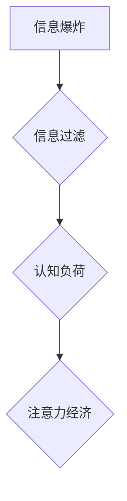

                 

##  注意力经济与个人信息过滤能力的培养

> 关键词：注意力经济、信息过滤、认知负荷、深度学习、个人成长

### 1. 背景介绍

在当今信息爆炸的时代，我们每天都被海量的信息淹没。从社交媒体的推送、新闻网站的滚动条到电子邮件的轰炸，信息无处不在，无时不刻地冲击着我们的感官和认知。这种信息过载状态，被称为“注意力经济”，它不仅影响着我们的工作效率和学习成果，更可能导致焦虑、抑郁等心理问题。

注意力经济的核心问题在于，我们的大脑拥有有限的注意力资源，而信息量却呈指数级增长。为了在信息洪流中生存和发展，我们需要培养强大的信息过滤能力，学会有效地筛选和处理信息，专注于真正重要的内容。

### 2. 核心概念与联系

#### 2.1 注意力经济

注意力经济是指在信息时代，注意力成为一种稀缺资源，而能够有效获取和利用注意力的人或组织，就拥有了巨大的竞争优势。

#### 2.2 信息过滤

信息过滤是指通过各种手段，从海量信息中筛选出与用户需求相符、价值最高的少量信息的过程。

#### 2.3 认知负荷

认知负荷是指大脑处理信息所需要消耗的资源，包括注意力、记忆力和执行功能等。当认知负荷过高时，我们的思维会变得混乱，难以集中注意力，做出明智的决策。

**Mermaid 流程图**



### 3. 核心算法原理 & 具体操作步骤

#### 3.1 算法原理概述

信息过滤算法的核心在于利用机器学习技术，根据用户的行为数据、偏好设置和上下文信息，预测用户对信息的兴趣程度，并将其排序或分类，最终呈现给用户。常见的算法包括：

* **基于内容的过滤算法:** 根据信息的主题、关键词、作者等特征，判断信息与用户的兴趣相符程度。
* **基于协同过滤的算法:** 根据其他用户对信息的评价和行为，预测用户对信息的喜好。
* **深度学习算法:** 利用神经网络模型，从海量数据中学习用户兴趣的复杂模式，实现更精准的信息过滤。

#### 3.2 算法步骤详解

1. **数据收集:** 收集用户的行为数据，例如浏览记录、点击记录、点赞记录、评论记录等。
2. **数据预处理:** 对收集到的数据进行清洗、转换和特征提取，以便于算法训练。
3. **模型训练:** 选择合适的算法模型，并利用训练数据进行模型训练，学习用户兴趣的模式。
4. **模型评估:** 使用测试数据评估模型的性能，例如准确率、召回率、F1-score等。
5. **模型部署:** 将训练好的模型部署到线上系统，实时过滤信息并推荐给用户。

#### 3.3 算法优缺点

**优点:**

* **个性化推荐:** 能够根据用户的兴趣和需求，提供个性化的信息推荐。
* **提高效率:** 帮助用户快速找到所需的信息，提高信息获取效率。
* **降低认知负荷:** 通过过滤无关信息，降低用户的认知负荷，提升专注力。

**缺点:**

* **数据依赖:** 算法的性能依赖于数据的质量和数量。
* **算法偏差:** 算法可能会存在偏差，导致推荐结果不准确或不公平。
* **信息茧房效应:** 过度依赖算法推荐，可能会导致用户陷入信息茧房，缺乏多元化信息获取。

#### 3.4 算法应用领域

信息过滤算法广泛应用于各个领域，例如：

* **搜索引擎:** 根据用户的搜索词，过滤和排序搜索结果。
* **社交媒体:** 推荐用户可能感兴趣的内容和人脉。
* **电商平台:** 推荐用户可能喜欢的商品和服务。
* **新闻网站:** 根据用户的阅读习惯，推荐新闻资讯。

### 4. 数学模型和公式 & 详细讲解 & 举例说明

#### 4.1 数学模型构建

信息过滤算法通常基于概率模型，例如贝叶斯网络或马尔可夫链。这些模型可以用来计算用户对特定信息的兴趣程度，并根据该概率进行信息排序或分类。

#### 4.2 公式推导过程

例如，在基于内容的过滤算法中，可以使用余弦相似度来衡量信息与用户兴趣之间的相关性。

$$
\text{余弦相似度} = \frac{\mathbf{A} \cdot \mathbf{B}}{||\mathbf{A}|| ||\mathbf{B}||}
$$

其中：

* $\mathbf{A}$ 代表信息的特征向量。
* $\mathbf{B}$ 代表用户的兴趣向量。
* $\cdot$ 代表向量点积。
* $||\mathbf{A}||$ 和 $||\mathbf{B}||$ 分别代表向量 $\mathbf{A}$ 和 $\mathbf{B}$ 的长度。

#### 4.3 案例分析与讲解

假设我们有一个信息库，包含关于科技、体育、娱乐等不同主题的信息。用户 A 对科技和体育感兴趣，用户 B 对娱乐和美食感兴趣。

如果我们使用余弦相似度来计算用户 A 和信息 A1（关于科技的新闻）之间的相关性，以及用户 B 和信息 B1（关于娱乐的电影评论）之间的相关性，那么：

* 如果 $\mathbf{A}$ 和 $\mathbf{A1}$ 的余弦相似度较高，则表示用户 A 对信息 A1 感兴趣。
* 如果 $\mathbf{B}$ 和 $\mathbf{B1}$ 的余弦相似度较高，则表示用户 B 对信息 B1 感兴趣。

### 5. 项目实践：代码实例和详细解释说明

#### 5.1 开发环境搭建

* Python 3.x
* scikit-learn 库
* pandas 库
* matplotlib 库

#### 5.2 源代码详细实现

```python
import pandas as pd
from sklearn.feature_extraction.text import TfidfVectorizer
from sklearn.metrics.pairwise import cosine_similarity

# 加载数据
data = pd.read_csv('data.csv')

# 特征提取
vectorizer = TfidfVectorizer()
tfidf_matrix = vectorizer.fit_transform(data['content'])

# 计算余弦相似度
cosine_similarities = cosine_similarity(tfidf_matrix, tfidf_matrix)

# 获取用户 A 和信息 A1 的相似度
user_a_index = 0
info_a1_index = 1
similarity = cosine_similarities[user_a_index][info_a1_index]

# 打印结果
print(f'用户 A 和信息 A1 的相似度: {similarity}')
```

#### 5.3 代码解读与分析

* 使用 `TfidfVectorizer` 将文本信息转换为特征向量。
* 使用 `cosine_similarity` 计算特征向量之间的余弦相似度。
* 根据用户和信息的索引，获取其之间的相似度。

#### 5.4 运行结果展示

运行代码后，会输出用户 A 和信息 A1 的余弦相似度值。

### 6. 实际应用场景

#### 6.1 个性化推荐系统

信息过滤算法可以用于构建个性化推荐系统，例如电商平台的商品推荐、社交媒体的内容推荐等。

#### 6.2 内容过滤系统

信息过滤算法可以用于构建内容过滤系统，例如过滤垃圾邮件、识别网络谣言、屏蔽敏感内容等。

#### 6.3 学习和研究辅助工具

信息过滤算法可以用于构建学习和研究辅助工具，例如自动生成学习笔记、筛选相关文献、推荐学习资源等。

#### 6.4 未来应用展望

随着人工智能技术的不断发展，信息过滤算法将会更加智能化、个性化和精准化。未来，信息过滤算法可能应用于更广泛的领域，例如医疗诊断、金融风险控制、城市管理等。

### 7. 工具和资源推荐

#### 7.1 学习资源推荐

* **书籍:**
    * 《深度学习》
    * 《机器学习实战》
    * 《自然语言处理入门》
* **在线课程:**
    * Coursera: 深度学习
    * edX: 机器学习
    * Udacity: 自然语言处理

#### 7.2 开发工具推荐

* **Python:** 
    * scikit-learn
    * TensorFlow
    * PyTorch

* **其他工具:**
    * Jupyter Notebook
    * Git

#### 7.3 相关论文推荐

* **Attention Is All You Need**
* **BERT: Pre-training of Deep Bidirectional Transformers for Language Understanding**
* **Recurrent Neural Networks for Sequence Learning**

### 8. 总结：未来发展趋势与挑战

#### 8.1 研究成果总结

信息过滤算法在信息时代发挥着越来越重要的作用，它帮助我们有效地处理海量信息，提高效率和专注力。

#### 8.2 未来发展趋势

* **更精准的个性化推荐:** 利用深度学习和强化学习等技术，实现更精准的个性化推荐。
* **跨模态信息过滤:** 将文本、图像、音频等多种模态信息融合，实现更全面的信息过滤。
* **可解释性增强:** 提高信息过滤算法的可解释性，帮助用户理解推荐结果背后的逻辑。

#### 8.3 面临的挑战

* **数据隐私和安全:** 信息过滤算法依赖于用户的个人数据，如何保护用户隐私和数据安全是一个重要的挑战。
* **算法偏差和公平性:** 算法可能会存在偏差，导致推荐结果不公平，需要不断改进算法模型，确保公平性。
* **信息茧房效应:** 过度依赖算法推荐，可能会导致用户陷入信息茧房，缺乏多元化信息获取，需要引导用户形成多元化信息获取习惯。

#### 8.4 研究展望

未来，信息过滤算法的研究将更加注重算法的公平性、可解释性和安全性，同时也将探索更先进的算法模型和应用场景。


### 9. 附录：常见问题与解答

#### 9.1 如何提高信息过滤能力？

* **明确自己的信息需求:** 思考自己真正需要获取哪些信息，并制定相应的筛选标准。
* **善用信息过滤工具:** 利用搜索引擎的筛选功能、新闻订阅服务、邮件过滤规则等工具，有效过滤无关信息。
* **培养批判性思维:** 不盲目相信所有信息，学会辨别真伪，分析信息来源和可靠性。
* **控制信息获取时间:** 制定合理的阅读和浏览时间，避免过度沉浸在信息洪流中。

#### 9.2 信息过滤算法会取代人类吗？

信息过滤算法可以帮助人类更高效地处理信息，但它并不会取代人类。人类的创造力、想象力和情感理解能力，是算法无法替代的。

#### 9.3 如何应对信息茧房效应？

* **主动寻求多元化信息来源:** 订阅不同观点的媒体，关注不同领域的专家，拓展自己的知识面。
* **与不同观点的人交流:** 与持有不同观点的人进行理性讨论，帮助自己跳出信息茧房，获得更全面的视角。
* **定期清理信息订阅:** 定期清理不必要的订阅和关注，避免被特定信息流所封闭。


作者：禅与计算机程序设计艺术 / Zen and the Art of Computer Programming 
<end_of_turn>

