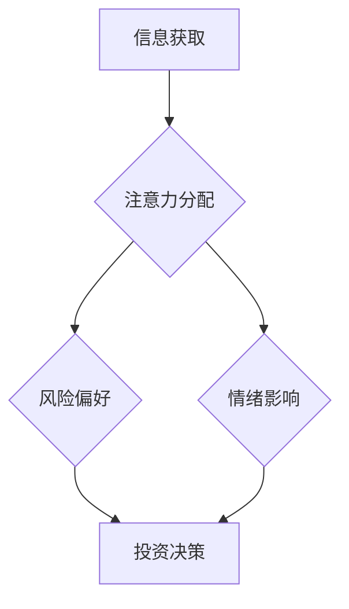

                 

## 1. 背景介绍

在当今信息爆炸的时代，人们面临着前所未有的信息过载。如何有效地获取、处理和利用信息成为了一个至关重要的挑战。注意力经济应运而生，它将注意力视为一种稀缺资源，并探讨如何有效地管理和利用这种资源。

个人理财行为也面临着新的挑战。传统的理财观念往往侧重于财务管理，而忽略了个人心理和行为因素的影响。注意力经济的理论为我们理解个人理财行为提供了新的视角。

## 2. 核心概念与联系

### 2.1 注意力经济

注意力经济的核心概念是“注意力是稀缺资源”。在信息爆炸的时代，人们每天接触的信息量巨大，而注意力是有限的。因此，如何有效地获取和利用注意力成为了一个重要的竞争要素。

注意力经济认为，人们会根据自身利益和需求选择关注哪些信息，而那些能够吸引和抓住人们注意力的信息，就能够获得更多的资源和机会。

### 2.2 个人理财行为

个人理财行为是指个人在收入、支出、储蓄、投资等方面所做的决策和行动。传统的理财观念往往侧重于财务管理，而忽略了个人心理和行为因素的影响。

### 2.3 连接

注意力经济与个人理财行为之间的联系在于，注意力会影响个人理财决策。

* **信息获取:** 个人理财决策需要大量的信息支持，而注意力决定了个人能够获取和处理的信息量。
* **风险偏好:** 注意力会影响个人对风险的感知和评估，从而影响其投资决策。
* **情绪影响:** 注意力会受到情绪的影响，情绪波动会影响个人理财决策的理性性。

**Mermaid 流程图**



## 3. 核心算法原理 & 具体操作步骤

### 3.1 算法原理概述

注意力机制是一种模仿人类注意力机制的算法，它能够帮助模型更好地关注输入数据中重要的信息。

注意力机制的核心思想是通过一个“注意力权重”来分配模型对不同输入元素的关注程度。注意力权重的大小代表了模型对该元素的关注程度。

### 3.2 算法步骤详解

1. **计算注意力权重:** 对于每个输入元素，计算其与模型输出的相似度。
2. **归一化注意力权重:** 将注意力权重归一化，使其总和为1。
3. **加权求和:** 将每个输入元素与其对应的注意力权重相乘，然后对所有元素进行加权求和，得到最终的输出。

### 3.3 算法优缺点

**优点:**

* 能够更好地关注输入数据中重要的信息。
* 能够处理长序列数据。
* 能够提高模型的准确率和效率。

**缺点:**

* 计算复杂度较高。
* 需要大量的训练数据。

### 3.4 算法应用领域

注意力机制在自然语言处理、计算机视觉、机器翻译等领域都有广泛的应用。

## 4. 数学模型和公式 & 详细讲解 & 举例说明

### 4.1 数学模型构建

注意力机制的数学模型可以表示为以下公式：

$$
\text{Attention}(Q, K, V) = \text{softmax}\left(\frac{Q K^T}{\sqrt{d_k}}\right) V
$$

其中：

* $Q$：查询矩阵
* $K$：键矩阵
* $V$：值矩阵
* $d_k$：键向量的维度
* $\text{softmax}$：softmax函数

### 4.2 公式推导过程

公式推导过程如下：

1. 计算查询矩阵 $Q$ 与键矩阵 $K$ 的点积，并除以 $\sqrt{d_k}$。
2. 应用 softmax 函数对点积结果进行归一化，得到注意力权重矩阵。
3. 将注意力权重矩阵与值矩阵 $V$ 进行加权求和，得到最终的输出。

### 4.3 案例分析与讲解

假设我们有一个句子：“我爱学习编程”。

* $Q$：查询向量
* $K$：键向量
* $V$：值向量

注意力机制会计算每个词的注意力权重，然后根据权重对每个词的值进行加权求和，得到最终的输出向量。

## 5. 项目实践：代码实例和详细解释说明

### 5.1 开发环境搭建

* Python 3.6+
* TensorFlow 2.0+
* PyTorch 1.0+

### 5.2 源代码详细实现

```python
import tensorflow as tf

# 定义注意力机制层
class Attention(tf.keras.layers.Layer):
    def __init__(self, units):
        super(Attention, self).__init__()
        self.W1 = tf.keras.layers.Dense(units)
        self.W2 = tf.keras.layers.Dense(units)
        self.W3 = tf.keras.layers.Dense(1)

    def call(self, query, key, value, mask=None):
        # 计算注意力权重
        score = tf.matmul(self.W1(query), self.W2(key), transpose_b=True)
        if mask is not None:
            score += (mask * -1e9)
        attention_weights = tf.nn.softmax(score, axis=-1)

        # 加权求和
        context = tf.matmul(attention_weights, value)
        return context

# 示例用法
query = tf.random.normal([1, 5, 128])
key = tf.random.normal([1, 5, 128])
value = tf.random.normal([1, 5, 64])

attention_layer = Attention(units=64)
context = attention_layer(query, key, value)
print(context.shape)
```

### 5.3 代码解读与分析

* `Attention` 类定义了一个注意力机制层。
* `__init__` 方法初始化三个稠密层：`W1`、`W2` 和 `W3`。
* `call` 方法计算注意力权重，并根据权重对值进行加权求和。
* 示例用法演示了如何使用 `Attention` 层。

### 5.4 运行结果展示

运行代码后，会输出一个形状为 `(1, 5, 64)` 的张量，表示注意力机制的输出。

## 6. 实际应用场景

### 6.1 个人理财决策辅助

注意力机制可以用于分析用户的理财行为数据，识别用户的风险偏好、投资习惯等特征，并根据用户的个人情况提供个性化的理财建议。

### 6.2 金融风险评估

注意力机制可以用于分析金融市场数据，识别潜在的风险因素，并对金融风险进行评估。

### 6.3 投资策略优化

注意力机制可以用于优化投资策略，例如，根据市场变化动态调整投资组合。

### 6.4 未来应用展望

随着注意力机制的发展，其在个人理财领域的应用场景将会更加广泛。例如，可以利用注意力机制构建智能理财机器人，帮助用户进行自动化的理财管理。

## 7. 工具和资源推荐

### 7.1 学习资源推荐

* **书籍:**
    * 《深度学习》
    * 《自然语言处理》
* **在线课程:**
    * Coursera: 深度学习
    * Udacity: 自然语言处理

### 7.2 开发工具推荐

* **TensorFlow:** 开源深度学习框架
* **PyTorch:** 开源深度学习框架
* **Keras:** 高级深度学习API

### 7.3 相关论文推荐

* **Attention Is All You Need:** https://arxiv.org/abs/1706.03762
* **BERT: Pre-training of Deep Bidirectional Transformers for Language Understanding:** https://arxiv.org/abs/1810.04805

## 8. 总结：未来发展趋势与挑战

### 8.1 研究成果总结

注意力机制在个人理财领域具有巨大的应用潜力，能够帮助用户更好地理解自己的理财行为，并做出更理性的决策。

### 8.2 未来发展趋势

* **更强大的注意力机制:** 研究人员将继续探索更强大的注意力机制，例如，自注意力机制、多头注意力机制等。
* **更广泛的应用场景:** 注意力机制将在更多个人理财场景中得到应用，例如，理财规划、风险管理、投资决策等。
* **个性化定制:** 注意力机制将被用于构建个性化的理财服务，根据用户的个人情况提供定制化的理财建议。

### 8.3 面临的挑战

* **数据隐私:** 个人理财数据涉及用户的隐私信息，需要采取有效的措施保护用户隐私。
* **算法解释性:** 注意力机制的决策过程较为复杂，需要提高算法的解释性，以便用户更好地理解模型的决策结果。
* **模型鲁棒性:** 注意力机制模型需要具备较强的鲁棒性，能够应对市场变化和数据噪声的影响。

### 8.4 研究展望

未来，注意力机制在个人理财领域的应用将会更加深入和广泛，为用户提供更智能、更个性化的理财服务。


## 9. 附录：常见问题与解答

### 9.1 如何理解注意力权重？

注意力权重表示模型对每个输入元素的关注程度。权重越大，表示模型对该元素的关注程度越高。

### 9.2 注意力机制的计算复杂度如何？

注意力机制的计算复杂度较高，特别是对于长序列数据。

### 9.3 注意力机制有哪些应用场景？

注意力机制在自然语言处理、计算机视觉、机器翻译等领域都有广泛的应用。

### 9.4 如何评估注意力机制的性能？

注意力机制的性能可以通过准确率、召回率、F1-score等指标进行评估。


作者：禅与计算机程序设计艺术 / Zen and the Art of Computer Programming 
<end_of_turn>

