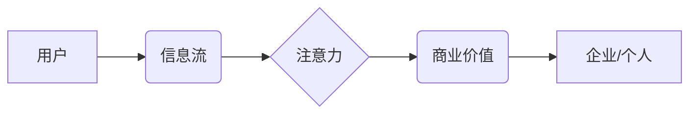

                 

## 1. 背景介绍

在当今信息爆炸的时代，人们每天面临着海量的资讯和内容。如何才能在众多信息中脱颖而出，吸引用户的注意力，并将其转化为忠实读者或客户，成为了内容创作者和企业面临的重大挑战。

注意力经济的概念应运而生，它强调了注意力是稀缺资源，而获取和保持用户注意力是至关重要的商业价值。 

随着互联网和移动互联网的发展，用户获取信息的方式发生了巨大变化。碎片化阅读、短视频、直播等新兴内容形式的兴起，进一步加剧了注意力经济的竞争。

内容策略规划与实施，成为了企业和个人在注意力经济中生存和发展的关键。

## 2. 核心概念与联系

### 2.1 注意力经济

注意力经济是指在信息过载的时代，注意力成为一种稀缺资源，而获取和保持用户注意力是至关重要的商业价值。

**核心原理：**

* **注意力稀缺：** 人类注意力有限，无法同时处理大量信息。
* **注意力竞争：** 各种信息和内容都在争夺用户的注意力。
* **注意力价值：** 获取和保持用户注意力可以带来商业价值，例如广告收入、用户转化等。

**架构图：**



### 2.2 内容策略

内容策略是指企业或个人在特定目标和受众群体下，围绕核心价值和品牌定位，制定和实施内容创作、发布、传播和管理的整体计划和方案。

**核心要素：**

* **目标受众：** 明确目标受众的特征、需求和兴趣。
* **内容主题：** 选择与目标受众相关、有价值的内容主题。
* **内容形式：** 根据目标受众和内容主题选择合适的格式，例如文章、视频、音频、图片等。
* **内容发布平台：** 选择合适的平台发布内容，例如网站、社交媒体、博客等。
* **内容传播策略：** 制定内容推广和传播计划，例如社交媒体营销、邮件营销等。

### 2.3 内容策略规划与实施

内容策略规划与实施是指根据企业或个人的目标和受众群体，制定内容策略，并将其付诸实践的过程。

**核心步骤：**

1. **目标设定：** 明确内容策略的目标，例如提高品牌知名度、增加用户流量、提升用户转化率等。
2. **受众分析：** 深入了解目标受众的特征、需求和兴趣。
3. **内容主题确定：** 选择与目标受众相关、有价值的内容主题。
4. **内容形式选择：** 根据目标受众和内容主题选择合适的格式。
5. **内容发布平台选择：** 选择合适的平台发布内容。
6. **内容传播策略制定：** 制定内容推广和传播计划。
7. **内容创作与发布：** 创作高质量的内容并将其发布到指定平台。
8. **内容分析与优化：** 定期分析内容的性能，并根据数据进行优化。

## 3. 核心算法原理 & 具体操作步骤

### 3.1 算法原理概述

在内容策略规划与实施中，算法可以帮助我们分析用户行为、预测内容受欢迎程度、优化内容推荐等。

一些常用的算法包括：

* **自然语言处理 (NLP)：** 用于分析文本内容，例如关键词提取、文本分类、情感分析等。
* **机器学习 (ML)：** 用于从数据中学习模式，例如用户行为预测、内容推荐等。
* **深度学习 (DL)：** 用于更复杂的数据分析，例如图像识别、语音识别等。

### 3.2 算法步骤详解

**用户行为分析算法：**

1. 收集用户行为数据，例如浏览记录、点击记录、停留时间等。
2. 使用数据清洗和预处理技术，去除噪声数据和异常值。
3. 使用机器学习算法，例如聚类算法，将用户分成不同的群体。
4. 分析不同用户群体的行为特征，例如兴趣偏好、阅读习惯等。

**内容推荐算法：**

1. 收集用户行为数据和内容特征数据。
2. 使用协同过滤算法，根据用户的历史行为推荐相似的用户喜欢的內容。
3. 使用内容基准算法，根据内容主题和关键词推荐与用户兴趣相关的內容。
4. 使用深度学习算法，学习用户行为和内容特征之间的复杂关系，推荐更精准的内容。

### 3.3 算法优缺点

**优点：**

* 自动化分析和推荐，提高效率。
* 基于数据分析，更精准的推荐和预测。
* 持续优化，不断提升推荐效果。

**缺点：**

* 需要大量数据支持。
* 算法模型需要不断更新和调整。
* 可能存在算法偏差和推荐盲点。

### 3.4 算法应用领域

* 内容平台：推荐文章、视频、音乐等内容。
* 社交媒体：推荐好友、话题、群组等内容。
* 电商平台：推荐商品、优惠券、促销活动等内容。
* 教育平台：推荐学习资源、课程、辅导等内容。

## 4. 数学模型和公式 & 详细讲解 & 举例说明

### 4.1 数学模型构建

**用户行为预测模型：**

我们可以使用线性回归模型来预测用户的行为，例如点击率、购买率等。

**模型公式：**

$$
y = \beta_0 + \beta_1 x_1 + \beta_2 x_2 + ... + \beta_n x_n + \epsilon
$$

其中：

* $y$ 是预测变量，例如点击率。
* $x_1, x_2, ..., x_n$ 是自变量，例如用户年龄、性别、浏览时间等。
* $\beta_0, \beta_1, ..., \beta_n$ 是模型参数。
* $\epsilon$ 是误差项。

### 4.2 公式推导过程

线性回归模型的目标是找到最佳的模型参数，使得预测值与实际值之间的误差最小。

可以使用最小二乘法来求解模型参数。

**最小二乘法公式：**

$$
\min_{\beta} \sum_{i=1}^{n} (y_i - \hat{y}_i)^2
$$

其中：

* $y_i$ 是实际值。
* $\hat{y}_i$ 是预测值。
* $n$ 是样本数量。

### 4.3 案例分析与讲解

假设我们想要预测用户的点击率，自变量包括用户年龄、性别、浏览时间等。

我们可以收集用户行为数据，并使用线性回归模型进行训练。

训练完成后，我们可以使用模型预测新用户的点击率。

## 5. 项目实践：代码实例和详细解释说明

### 5.1 开发环境搭建

* Python 3.x
* Jupyter Notebook
* scikit-learn

### 5.2 源代码详细实现

```python
import pandas as pd
from sklearn.linear_model import LinearRegression

# 加载数据
data = pd.read_csv('user_behavior.csv')

# 选择特征和目标变量
X = data[['age', 'gender', 'browse_time']]
y = data['click_rate']

# 创建线性回归模型
model = LinearRegression()

# 训练模型
model.fit(X, y)

# 预测新用户的点击率
new_user_data = pd.DataFrame({'age': [25], 'gender': [0], 'browse_time': [30]})
predicted_click_rate = model.predict(new_user_data)

# 打印预测结果
print(predicted_click_rate)
```

### 5.3 代码解读与分析

* 首先，我们加载用户行为数据，并选择特征和目标变量。
* 然后，我们创建线性回归模型，并使用训练数据训练模型。
* 训练完成后，我们可以使用模型预测新用户的点击率。

### 5.4 运行结果展示

运行代码后，会输出新用户的预测点击率。

## 6. 实际应用场景

### 6.1 内容推荐系统

* 根据用户的浏览历史、点赞记录等数据，推荐用户可能感兴趣的内容。
* 例如，Netflix、Amazon Prime Video 等视频平台使用内容推荐系统，推荐用户可能喜欢的电影和电视剧。

### 6.2 个性化内容营销

* 根据用户的兴趣爱好、购买行为等数据，推送个性化的广告和促销信息。
* 例如，电商平台根据用户的浏览记录，推荐相关的商品和优惠券。

### 6.3 内容优化和改进

* 分析用户对不同内容的反馈，例如阅读时长、点赞数、评论数等，优化内容质量和结构。
* 例如，博客网站可以根据文章的阅读量和评论数，调整文章的标题、内容和格式。

### 6.4 未来应用展望

* 随着人工智能技术的不断发展，内容策略规划与实施将更加智能化和自动化。
* 例如，可以使用深度学习算法，更精准地预测用户行为和内容受欢迎程度。
* 内容策略规划与实施将更加注重用户体验和个性化，提供更符合用户需求的内容。

## 7. 工具和资源推荐

### 7.1 学习资源推荐

* **书籍：**
    * 《内容营销》
    * 《内容策略》
    * 《注意力经济》
* **在线课程：**
    * Coursera
    * Udemy
    * edX

### 7.2 开发工具推荐

* **数据分析工具：**
    * Python (Pandas, NumPy, Scikit-learn)
    * R
    * Tableau
* **内容管理系统：**
    * WordPress
    * Drupal
    * Joomla

### 7.3 相关论文推荐

* **注意力机制在推荐系统中的应用**
* **深度学习在内容推荐中的应用**
* **内容策略规划与实施的最新研究进展**

## 8. 总结：未来发展趋势与挑战

### 8.1 研究成果总结

* 内容策略规划与实施已经成为企业和个人在注意力经济中生存和发展的关键。
* 算法可以帮助我们分析用户行为、预测内容受欢迎程度、优化内容推荐等。
* 内容策略规划与实施将更加智能化和自动化，更加注重用户体验和个性化。

### 8.2 未来发展趋势

* **更精准的个性化推荐：** 使用深度学习算法，更精准地预测用户行为和内容受欢迎程度。
* **更丰富的用户体验：** 提供更符合用户需求的内容，例如沉浸式体验、互动式内容等。
* **更智能化的内容创作：** 使用人工智能技术，辅助内容创作，提高效率和质量。

### 8.3 面临的挑战

* **数据隐私和安全：** 如何保护用户数据隐私和安全，是内容策略规划与实施面临的重要挑战。
* **算法偏差和公平性：** 算法模型可能存在偏差，导致推荐结果不公平，需要不断改进算法模型，确保公平性和公正性。
* **内容质量和真实性：** 如何保证内容质量和真实性，避免虚假信息和垃圾内容的传播，也是一个重要的挑战。

### 8.4 研究展望

* **更深入的用户行为研究：** 探索用户行为背后的更深层次的动机和心理机制。
* **更有效的算法模型：** 开发更精准、更鲁棒、更公平的算法模型。
* **更可持续的注意力经济：** 探索如何构建一个更加公平、可持续的注意力经济体系。

## 9. 附录：常见问题与解答

**Q1：如何确定目标受众？**

**A1：** 可以通过市场调研、用户分析、竞争对手分析等方式，了解目标受众的特征、需求和兴趣。

**Q2：如何选择合适的平台发布内容？**

**A2：** 需要根据目标受众的平台使用习惯和内容形式偏好选择合适的平台。

**Q3：如何评估内容策略的有效性？**

**A3：** 可以通过分析内容的阅读量、点赞数、评论数、转化率等指标，评估内容策略的有效性。


作者：禅与计算机程序设计艺术 / Zen and the Art of Computer Programming 
<end_of_turn>

