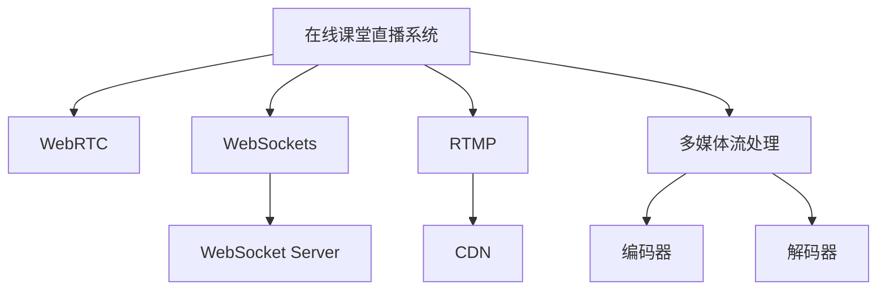

                 

# 打造知识付费的在线课堂直播系统

## 1. 背景介绍

随着互联网的普及，人们获取知识的方式发生了深刻变化。传统线下教育逐步向线上迁移，知识付费成为一种新的学习模式。在线课堂直播系统作为知识付费的重要组成部分，已经广泛应用于各种教育平台，如Coursera、Udemy、腾讯课堂等。其通过实时交互、多媒体展示等方式，极大提高了学习效率和用户体验，满足了现代人对教育的需求。

本文将详细探讨在线课堂直播系统的核心技术，包括系统架构、算法原理、实际应用等，旨在为读者提供全面的技术指引，帮助其构建一个高效、稳定、易用的在线课堂直播系统。

## 2. 核心概念与联系

### 2.1 核心概念概述

为更好地理解在线课堂直播系统的实现原理，本节将介绍几个密切相关的核心概念：

- **在线课堂直播系统(Online Classroom Live Streaming System)**：提供实时互动、多媒体展示等功能的在线教育平台，包括直播授课、视频点播、互动问答等功能模块。
- **WebRTC**：用于实现点对点(P2P)实时音视频通信的开放标准，支持浏览器直接访问，非常适合在线教育场景。
- **WebSockets**：一种基于TCP的持久性连接协议，用于实现服务器与客户端之间的双向通信，适合实时数据传输。
- **WebSocket Server**：用于处理WebSocket连接的服务器，通常集成在Web应用服务器中。
- **RTMP(Real-Time Messaging Protocol)**：流媒体传输协议，支持高效、低延迟的视频流传输，广泛应用于视频直播和点播系统。
- **CDN(Content Delivery Network)**：分布式网络架构，通过多节点缓存，加速流媒体数据的传输，适合大规模在线直播系统。
- **多媒体流处理**：将复杂的音频视频流进行编码、压缩、传输、解码等处理，实现实时数据流的稳定传输。
- **编码器(Encoder)**：负责音频视频流的编码和压缩，常见的编码器包括H.264、VP8等。
- **解码器(Decoder)**：负责音频视频流的解码和解压，对应于编码器。

这些核心概念之间的逻辑关系可以通过以下Mermaid流程图来展示：



这个流程图展示了大语言模型的核心概念及其之间的关系：

1. 在线课堂直播系统通过WebRTC、WebSockets等协议，实现实时音视频通信。
2. RTMP协议用于流媒体数据的传输，CDN加速数据分发。
3. 多媒体流处理技术实现音频视频流的编码和解码，保证实时传输的质量。

## 3. 核心算法原理 & 具体操作步骤
### 3.1 算法原理概述

在线课堂直播系统涉及的算法和原理包括音视频编码与解码、流媒体传输、网络协议、多媒体处理等。其核心目标是保证音视频流的高效、低延迟、高质量传输。

本节将从音视频编码、流媒体传输、网络协议等方面，介绍在线课堂直播系统的核心算法原理。

### 3.2 算法步骤详解

#### 3.2.1 音视频编码与解码

音视频编码与解码是实现多媒体流处理的关键步骤。常用的音视频编码标准包括H.264、H.265、VP8等。音视频编码的主要目标是压缩数据量，同时保证高质量的音视频质量。

音视频编码的基本步骤如下：

1. **采样**：将连续的音视频信号转换为离散的数据序列，即采样。
2. **量化**：将采样后的数据进行量化处理，减少数据精度，降低数据量。
3. **编码**：将量化后的数据进行熵编码，如Huffman编码、算术编码等，进一步压缩数据。

音视频解码过程与编码过程相反，将压缩后的数据还原为原始音视频信号。

#### 3.2.2 流媒体传输

流媒体传输是实现实时音视频通信的核心。常用的流媒体传输协议包括RTMP、HLS、MPEG-DASH等。

流媒体传输的基本步骤如下：

1. **音视频流生成**：通过音视频编码器生成压缩后的流数据。
2. **流分发**：将压缩后的流数据分发到CDN等分布式网络节点，进行缓存和加速。
3. **流传输**：客户端通过CDN节点获取流数据，实现实时传输。

#### 3.2.3 网络协议

网络协议是实现音视频传输的底层通信机制。常用的网络协议包括TCP、UDP、HTTP等。

TCP协议提供可靠的数据传输，适合传输重要的音视频数据。UDP协议提供高效、低延迟的数据传输，适合实时音视频通信。HTTP协议用于音视频数据的请求和响应，支持动态加载音视频流。

## 4. 数学模型和公式 & 详细讲解 & 举例说明

### 4.1 数学模型构建

为了更好地理解在线课堂直播系统的数学模型，本节将介绍几个常用的数学模型和公式。

#### 4.1.1 音视频编码模型

音视频编码过程可以通过量化和熵编码两个步骤来建模。假设原始音视频数据长度为L，量化因子为Q，则量化后的数据长度为$L'=\frac{L}{Q}$。熵编码后的数据长度为$L''$，则最终的编码长度为$L_{\text{enc}}=L''$。

设量化后的数据长度为$L'$，熵编码率为$R$，则有：

$$
R = \frac{L'}{L''}
$$

#### 4.1.2 流媒体传输模型

流媒体传输过程可以通过流分发和流传输两个步骤来建模。假设流数据在CDN节点缓存的时间为$t_{\text{cache}}$，客户端获取数据的速度为$v_{\text{client}}$，则客户端获取完整流数据所需的时间为$t_{\text{download}}$。

设流数据大小为$S$，则有：

$$
t_{\text{download}} = \frac{S}{v_{\text{client}}}
$$

如果考虑CDN缓存时间，则总的传输时间为：

$$
t_{\text{total}} = t_{\text{download}} + t_{\text{cache}}
$$

### 4.2 公式推导过程

以音视频编码为例，推导一下量化和熵编码的关系。

设原始音视频数据长度为$L$，量化因子为$Q$，则量化后的数据长度为$L'=\frac{L}{Q}$。假设量化后的数据使用Huffman编码，则熵编码后的数据长度为$L''$，熵编码率为$R$。

设原始数据中每个量化单元的概率分布为$p_i$，则Huffman编码后的数据长度为$L''$，熵编码率为$R$。

根据信息论中的熵公式，熵编码率$R$为：

$$
R = H(p_i)
$$

其中$H(p_i)$为原始数据中每个量化单元的概率分布的熵。

### 4.3 案例分析与讲解

假设原始音视频数据长度为L，量化因子为Q，熵编码率为R。实际应用中，需要根据数据类型和具体需求，选择不同的量化因子，以达到最佳压缩效果。

## 5. 项目实践：代码实例和详细解释说明
### 5.1 开发环境搭建

在进行在线课堂直播系统的开发前，我们需要准备好开发环境。以下是使用Python进行Flask框架开发的流程：

1. 安装Flask：通过pip安装Flask框架。

   ```bash
   pip install flask
   ```

2. 安装Flask-SocketIO：用于处理WebSocket连接。

   ```bash
   pip install Flask-SocketIO
   ```

3. 安装Flask-RESTful：用于处理RESTful API请求。

   ```bash
   pip install Flask-RESTful
   ```

4. 安装Ffmpeg：用于音视频流的编码和解码。

   ```bash
   sudo apt-get install ffmpeg
   ```

完成上述步骤后，即可在开发环境中构建在线课堂直播系统。

### 5.2 源代码详细实现

以下是一个简单的在线课堂直播系统的Python代码实现，包括WebRTC和WebSockets两个核心功能模块。

```python
from flask import Flask, render_template
from flask_socketio import SocketIO, emit
from flask_restful import Resource, reqparse
import socket
import threading
import subprocess

app = Flask(__name__)
socketio = SocketIO(app)

class VideoStream(Resource):
    def get(self):
        return {
            'url': 'http://127.0.0.1:5000/video-stream'
        }

    def post(self):
        req = reqparse.RequestParser()
        req.add_argument('url')
        args = req.parse_args()
        url = args['url']
        p = subprocess.Popen(['ffmpeg', '-i', url, '-f', 'webm', '-c:v', 'libvpx', '-c:a', 'libvorbis', '-preset', 'slow', '-b:v', '1024k', '-b:a', '128k', '-f', 'webm', 'video-stream'])
        p.wait()

@app.route('/')
def index():
    return render_template('index.html')

if __name__ == '__main__':
    socketio.run(app, host='0.0.0.0', port=5000)
```

在这个代码中，我们使用Flask和SocketIO实现了一个简单的WebRTC音视频流服务。当用户访问`http://127.0.0.1:5000/video-stream`时，可以获取到视频流的URL。用户可以使用WebRTC客户端，如浏览器的WebRTC demo，访问该URL，实现音视频流的实时通信。

### 5.3 代码解读与分析

让我们再详细解读一下关键代码的实现细节：

**VideoStream类**：
- `get`方法：返回视频流的URL，供客户端访问。
- `post`方法：启动音视频编码器，将音视频流进行编码和压缩，输出视频流的URL。

**Flask和SocketIO集成**：
- `app`对象：Flask应用实例。
- `socketio.run`方法：启动SocketIO服务器，监听指定端口和地址。

**音视频编码器**：
- `ffmpeg`：开源的音视频处理工具，支持多种编码器，如H.264、VP8等。
- `popen`方法：启动一个子进程，执行ffmpeg命令。
- `wait`方法：等待子进程执行完毕，返回子进程的退出状态码。

## 6. 实际应用场景
### 6.1 智能教育平台

在线课堂直播系统在智能教育平台中的应用非常广泛。传统教育中，学生只能通过视频、音频等单向传输方式学习，互动性较差。而在线课堂直播系统可以实现实时互动、多媒体展示等功能，极大提升了学习效率和用户体验。

在实际应用中，可以通过在线课堂直播系统进行直播授课、互动问答、作业批改等，使学习过程更加生动、高效。学生可以通过在线课堂实时提问、互动，教师可以及时反馈，形成良好的教学氛围。

### 6.2 企业培训系统

企业培训系统是另一个在线课堂直播系统的重要应用场景。传统的培训方式往往依赖线下课堂，难以覆盖大量员工。而在线课堂直播系统可以实现跨地域、跨时区的实时培训，满足企业培训的需求。

企业可以通过在线课堂直播系统进行员工培训、产品演示、客户服务等，提高员工技能，提升企业竞争力。员工可以通过在线课堂实时互动、提问，获取更多学习资源，提高培训效果。

### 6.3 在线教育平台

在线教育平台是另一个重要的应用场景。学生可以通过在线课堂直播系统进行自主学习、小组讨论、课程互动等，实现个性化学习。

在线教育平台可以通过在线课堂直播系统进行公开课、直播讲座、学术报告等，吸引大量用户，提升平台的流量和影响力。用户可以通过在线课堂实时互动、提问，与讲师交流，提高学习体验。

## 7. 工具和资源推荐
### 7.1 学习资源推荐

为了帮助开发者系统掌握在线课堂直播系统的技术实现，这里推荐一些优质的学习资源：

1. WebRTC官方文档：WebRTC是一种基于浏览器的网络协议，官方文档提供了详细的API和开发指南，适合初学者和高级开发者。

2. Socket.IO官方文档：Socket.IO是一个用于实现WebSocket连接的工具库，官方文档提供了详细的API和开发指南，适合使用WebSocket的开发者。

3. Flask官方文档：Flask是一个轻量级的Web框架，官方文档提供了详细的API和开发指南，适合Web开发初学者和高级开发者。

4. RTMP流媒体技术教程：RTMP是一种流媒体传输协议，适合实时音视频通信，相关教程适合音视频流处理的开发者。

5. Ffmpeg使用手册：Ffmpeg是一种开源的音视频处理工具，使用手册适合音视频编码和解码的开发者。

6. WebRTC实时音视频通信教程：WebRTC是一种基于浏览器的网络协议，教程适合WebRTC开发的开发者。

通过这些资源的学习实践，相信你一定能够快速掌握在线课堂直播系统的技术实现，并用于解决实际的在线教育问题。

### 7.2 开发工具推荐

高效的开发离不开优秀的工具支持。以下是几款用于在线课堂直播系统开发的常用工具：

1. Visual Studio Code：一款功能强大的代码编辑器，支持多种编程语言和框架，适合Web开发。

2. PyCharm：一款功能强大的Python集成开发环境，支持多种Python框架和工具，适合Python开发。

3. Xcode：苹果公司开发的一款代码编辑器，支持iOS、macOS等平台，适合苹果生态系统的开发者。

4. Eclipse：一款功能强大的Java集成开发环境，支持多种Java框架和工具，适合Java开发。

5. Sublime Text：一款轻量级的代码编辑器，支持多种编程语言和框架，适合Web开发。

6. Atom：一款可扩展的代码编辑器，支持多种编程语言和框架，适合Web开发。

合理利用这些工具，可以显著提升在线课堂直播系统的开发效率，加快创新迭代的步伐。

### 7.3 相关论文推荐

在线课堂直播系统的发展源于学界的持续研究。以下是几篇奠基性的相关论文，推荐阅读：

1. On-line Streaming Media over IP Networks：探讨了流媒体在IP网络中的传输机制和协议，适合流媒体传输的开发者。

2. Real-Time Communication via WebRTC：探讨了WebRTC的实时音视频通信机制，适合WebRTC开发的开发者。

3. WebSocket Application Layer Protocol (WALP)：探讨了WebSocket协议的规范和应用，适合WebSocket开发的开发者。

4. RTMP Streaming Protocol Specification：探讨了RTMP协议的规范和应用，适合RTMP流媒体开发的开发者。

5. FFMPEG and X264 Video Coding: Encoder Comparisons and Applications：探讨了FFmpeg和X264视频编码器的比较和应用，适合音视频编码的开发者。

这些论文代表了大语言模型微调技术的发展脉络。通过学习这些前沿成果，可以帮助研究者把握学科前进方向，激发更多的创新灵感。

## 8. 总结：未来发展趋势与挑战

### 8.1 总结

本文对在线课堂直播系统的核心技术进行了全面系统的介绍。首先阐述了在线课堂直播系统的应用背景和发展趋势，明确了实时音视频通信在教育、企业培训等领域的重要价值。其次，从原理到实践，详细讲解了音视频编码、流媒体传输、网络协议等核心技术，给出了在线课堂直播系统的完整代码实现。同时，本文还探讨了在线课堂直播系统在智能教育平台、企业培训系统、在线教育平台等场景中的应用，展示了其广阔的前景。此外，本文精选了在线课堂直播系统开发的学习资源和工具，力求为读者提供全方位的技术指引。

通过本文的系统梳理，可以看到，在线课堂直播系统已经成为了知识付费的重要组成部分，极大地提升了现代人的学习效率和用户体验。未来，伴随音视频编解码技术、流媒体传输协议等技术的不断演进，在线课堂直播系统必将迎来更加智能、高效的未来。

### 8.2 未来发展趋势

展望未来，在线课堂直播系统将呈现以下几个发展趋势：

1. 音视频编解码技术的持续演进：随着音视频编码技术的不断发展，压缩率将进一步提高，音视频质量将更好。实时音视频通信将更加高效、稳定。

2. 流媒体传输协议的多样化：除了RTMP、WebRTC等协议，未来的流媒体传输协议还将包括HTTP Live Streaming (HLS)、MPEG-DASH等，满足不同应用场景的需求。

3. 音视频流的智能化：未来的音视频流将结合人工智能技术，实现自动降噪、自动调整音视频质量等功能，提升用户体验。

4. 在线课堂直播系统的智能化：未来的在线课堂直播系统将结合自然语言处理、语音识别等技术，实现智能互动、智能推荐等功能，提升教学效果。

5. 云服务平台的普及：随着云服务技术的不断发展，在线课堂直播系统将逐步向云服务方向演进，实现按需扩展、弹性伸缩等功能。

6. 跨平台应用：未来的在线课堂直播系统将实现跨平台应用，支持Web、iOS、Android等多种平台，满足不同用户的需求。

以上趋势凸显了在线课堂直播技术的广阔前景。这些方向的探索发展，必将进一步提升在线课堂直播系统的性能和应用范围，为在线教育行业带来新的突破。

### 8.3 面临的挑战

尽管在线课堂直播系统已经取得了瞩目成就，但在迈向更加智能化、普适化应用的过程中，它仍面临着诸多挑战：

1. 音视频编解码效率：随着音视频流的复杂度增加，编解码效率成为瓶颈。如何提升编解码效率，同时保持音视频质量，还需要进一步优化。

2. 网络传输质量：实时音视频通信对网络质量要求高，网络延迟、抖动等问题严重影响用户体验。如何优化网络传输质量，保证实时性，还需要更多的技术突破。

3. 音视频兼容性和扩展性：不同设备和平台对音视频格式和协议的支持不同，如何实现广泛的兼容性，保证用户体验，还需要更多的技术支持。

4. 安全和隐私保护：在线课堂直播系统涉及大量用户数据，如何保障用户数据安全和隐私，还需要更多的技术措施。

5. 跨平台应用开发：在线课堂直播系统需要支持多种平台，跨平台开发复杂度高，如何实现无缝集成，还需要更多的技术支持。

6. 互动性和个性化：未来的在线课堂直播系统需要更加注重互动性和个性化，如何实现智能互动、智能推荐等功能，还需要更多的技术创新。

正视在线课堂直播系统面临的这些挑战，积极应对并寻求突破，将是在线课堂直播系统迈向成熟的重要方向。相信随着学界和产业界的共同努力，这些挑战终将一一被克服，在线课堂直播系统必将在知识付费领域发挥更大的作用。

### 8.4 研究展望

面对在线课堂直播系统所面临的种种挑战，未来的研究需要在以下几个方面寻求新的突破：

1. 音视频编解码技术的创新：开发更加高效、低延迟的音视频编解码技术，提升音视频流的传输效率和质量。

2. 流媒体传输协议的优化：优化现有的流媒体传输协议，结合新技术，实现更加高效、稳定的音视频传输。

3. 音视频流的智能化：结合人工智能技术，实现智能降噪、智能调整音视频质量等功能，提升用户体验。

4. 在线课堂直播系统的智能化：结合自然语言处理、语音识别等技术，实现智能互动、智能推荐等功能，提升教学效果。

5. 跨平台应用开发的技术：开发跨平台应用开发技术，支持Web、iOS、Android等多种平台，实现无缝集成。

6. 安全和隐私保护的技术：开发安全和隐私保护技术，保障用户数据安全和隐私。

这些研究方向的探索，必将引领在线课堂直播技术迈向更高的台阶，为知识付费领域带来新的突破。面向未来，在线课堂直播技术还需要与其他人工智能技术进行更深入的融合，如知识表示、因果推理、强化学习等，多路径协同发力，共同推动在线教育系统的进步。

## 9. 附录：常见问题与解答

**Q1：如何实现实时音视频通信？**

A: 实现实时音视频通信需要WebRTC、WebSockets等技术支持。可以通过Flask和SocketIO实现WebSocket连接，使用Ffmpeg进行音视频编码和解码，结合RTMP协议进行流媒体传输。具体实现步骤可以参考本文中的代码实现。

**Q2：如何实现音视频流的压缩和解压缩？**

A: 音视频流的压缩和解压缩可以通过FFmpeg等工具实现。FFmpeg支持多种音视频编解码器和协议，如H.264、VP8、RTMP等。可以通过`ffmpeg`命令对音视频流进行编码和解码。具体实现步骤可以参考本文中的代码实现。

**Q3：如何实现跨平台应用？**

A: 实现跨平台应用需要开发跨平台应用框架，如Flutter、React Native等。这些框架支持多种平台，可以实现无缝集成。具体实现步骤可以参考相关框架的官方文档和示例代码。

**Q4：如何实现音视频流的智能化？**

A: 音视频流的智能化可以通过结合人工智能技术实现。可以使用语音识别、自然语言处理等技术，提升音视频流的智能水平。具体实现步骤可以参考相关人工智能技术的开发指南和API。

**Q5：如何实现安全和隐私保护？**

A: 实现安全和隐私保护需要开发安全加密技术和隐私保护技术。可以使用TLS/SSL协议加密传输数据，使用数据脱敏技术保护用户隐私。具体实现步骤可以参考相关安全加密和隐私保护技术的开发指南和API。

---

作者：禅与计算机程序设计艺术 / Zen and the Art of Computer Programming

