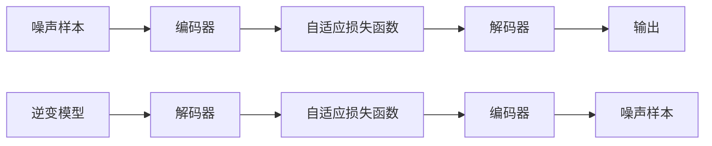

                 

# 扩散变压器：生成式 AI 的未来

> 关键词：扩散变压器, 生成式 AI, 自动编码器, 神经网络, 自适应损失函数, 逆变扩散模型, 语言模型, 语音生成, 图像生成, 视频生成, 可解释性, 可控生成

## 1. 背景介绍

### 1.1 问题由来

生成式人工智能（Generative AI）是人工智能领域的前沿技术，近年来取得了显著进展。其中，扩散变压器（Diffusion Transformers）作为一种基于自适应损失函数的生成模型，正迅速成为生成式 AI 的主流技术之一。

生成式 AI 的关键在于能够生成与现实世界高度逼真的内容，如自然语言、图像、音频等。传统的生成模型如自回归模型和生成对抗网络（GANs）虽然在某些任务上取得了成功，但依然存在生成质量不高、训练复杂度高、可解释性差等挑战。

扩散变压器通过巧妙地利用扩散过程，结合自适应损失函数，使得模型能够生成高质量、可控的输出，同时训练效率更高，可解释性更强。其在图像、语音、视频、语言生成等多个领域的广泛应用，正在彻底改变生成式 AI 的面貌。

### 1.2 问题核心关键点

扩散变压器在生成式 AI 中的应用主要体现在以下几个方面：

- 高质量内容生成：通过自适应损失函数和扩散过程，扩散变压器能够生成高度逼真的自然语言、图像、音频等内容，有效提升了生成模型的质量。
- 可控生成：通过调整扩散过程的超参数和逆变模型，扩散变压器能够实现对生成内容的可控调节，满足不同应用场景的需求。
- 高效训练：扩散变压器采用自适应损失函数和高效的逆变扩散模型，显著降低了训练时间和计算资源的消耗。
- 可解释性：扩散变压器通过逆变过程和自适应损失函数的组合，使得生成过程具有更高的可解释性，便于理解和调试。

本文将系统性地介绍扩散变压器的原理、关键步骤、应用场景和未来趋势，帮助读者深入理解这一前沿技术，并探讨其对生成式 AI 的未来影响。

## 2. 核心概念与联系

### 2.1 核心概念概述

为了更好地理解扩散变压器的核心概念，我们首先定义几个关键术语：

- 扩散变压器（Diffusion Transformer）：一种基于自适应损失函数的生成模型，能够通过逆变过程生成高质量的输出。
- 自适应损失函数：一种动态调整损失函数的技术，根据当前生成样本的质量实时调整损失函数参数。
- 逆变扩散模型：一种逆向训练模型，通过从噪声样本逐步生成高质量输出，来优化扩散变压器的训练过程。

以下是一个简单的 Mermaid 流程图，展示了扩散变压器的主要工作流程：



这个流程图展示了扩散变压器从噪声样本生成高质量输出的全过程：

1. 从噪声样本开始，通过编码器将其转换为低维表示。
2. 利用自适应损失函数计算当前样本的质量。
3. 通过解码器逐步生成高质量输出。
4. 利用逆变模型，从低维表示逆向生成高质量输出，用于训练优化。
5. 将高质量输出作为下一个噪声样本的输入，继续迭代生成过程。

通过这一过程，扩散变压器能够生成高质量的输出，同时降低训练复杂度，提高可解释性。

## 3. 核心算法原理 & 具体操作步骤

### 3.1 算法原理概述

扩散变压器的核心原理在于自适应损失函数和逆变扩散模型的结合。其基本思想是：通过扩散过程，将噪声样本逐步转换为高质量的生成样本，并利用自适应损失函数对生成质量进行动态调整，从而优化扩散过程的训练。

自适应损失函数通过分析当前生成样本的质量，实时调整损失函数的参数，使得模型在训练过程中能够快速适应生成质量的变化，从而提升生成效果。逆变扩散模型则是通过逆向训练过程，从噪声样本逐步生成高质量输出，用于优化扩散变压器的训练。

具体来说，扩散变压器的训练过程可以分解为以下几个步骤：

1. 生成样本：从噪声样本开始，逐步生成高质量的输出样本。
2. 计算质量：利用自适应损失函数，动态计算当前生成样本的质量。
3. 调整参数：根据当前样本的质量，调整损失函数的参数。
4. 逆向训练：利用逆变模型，从低维表示逆向生成高质量输出，用于训练优化。
5. 迭代生成：将高质量输出作为下一个噪声样本的输入，继续迭代生成过程。

### 3.2 算法步骤详解

以下是扩散变压器训练的详细步骤：

**Step 1: 准备数据集**

首先，需要准备一个高质量的数据集，用于训练扩散变压器。数据集可以是自然语言、图像、音频等类型的。例如，在语言生成任务中，可以使用大规模的文本语料库，如维基百科、新闻等。

**Step 2: 定义扩散模型**

定义一个扩散模型，用于生成高质量的输出。扩散模型通常由一个自适应损失函数和一个逆变模型组成。自适应损失函数用于动态调整生成质量，逆变模型用于逆向训练。

**Step 3: 初始化噪声样本**

从噪声样本开始，初始化生成过程。噪声样本可以是标准正态分布的随机向量，或者通过其他方式生成的高维噪声。

**Step 4: 生成样本**

通过编码器将噪声样本转换为低维表示，并逐步生成高质量输出。每一步生成过程都需要计算当前样本的质量，并根据质量动态调整损失函数参数。

**Step 5: 逆向训练**

利用逆变模型，从低维表示逆向生成高质量输出，用于训练优化。逆向训练过程可以帮助模型更好地适应生成质量的动态变化，提升生成效果。

**Step 6: 迭代生成**

将高质量输出作为下一个噪声样本的输入，继续迭代生成过程。这个过程可以重复多次，直到生成出高质量的最终输出。

### 3.3 算法优缺点

扩散变压器作为一种生成模型，具有以下优点：

- 高质量生成：通过自适应损失函数和逆变模型，扩散变压器能够生成高质量、逼真的自然语言、图像、音频等内容。
- 可控生成：通过调整扩散过程的超参数和逆变模型，扩散变压器能够实现对生成内容的可控调节。
- 高效训练：扩散变压器采用自适应损失函数和高效的逆变扩散模型，显著降低了训练时间和计算资源的消耗。

同时，扩散变压器也存在一些缺点：

- 训练复杂度较高：扩散变压器的训练过程复杂，需要动态调整损失函数参数和逆变模型，对训练人员的要求较高。
- 可解释性不足：尽管扩散变压器的生成过程具有较高的可解释性，但逆变模型和自适应损失函数的内部机制仍然较难理解和调试。
- 数据依赖性强：扩散变压器的生成效果高度依赖于训练数据集的质量，对数据分布的变化较为敏感。

### 3.4 算法应用领域

扩散变压器在生成式 AI 中的应用非常广泛，以下是几个主要领域：

- 自然语言生成（NLG）：用于生成高质量的文本，如对话、摘要、翻译等。
- 图像生成：用于生成逼真的图像，如图像描述、图像编辑等。
- 语音生成：用于生成逼真的语音，如文本转语音、语音合成等。
- 视频生成：用于生成高质量的视频，如视频编辑、虚拟人物等。
- 可解释性生成：用于生成可解释性高的内容，如生成式推理、生成式解释等。

## 4. 数学模型和公式 & 详细讲解 & 举例说明

### 4.1 数学模型构建

扩散变压器的数学模型包括自适应损失函数和逆变扩散模型。以下是扩散变压器的基本数学模型：

**自适应损失函数**

自适应损失函数用于动态调整生成样本的质量。设 $x$ 为生成样本，$p(x)$ 为先验分布，$\mu_t(x)$ 为当前时刻的生成样本的质量，$y_t(x)$ 为当前时刻的质量损失。则自适应损失函数可以表示为：

$$
L(x) = \mathbb{E}_{t \in [0,1]} \left[ -\log p_t(x) - y_t(x) \right]
$$

其中 $p_t(x)$ 为 $t$ 时刻的生成样本的概率密度函数，$y_t(x)$ 为 $t$ 时刻的质量损失函数。

**逆变扩散模型**

逆变扩散模型用于逆向生成高质量输出。设 $z_t$ 为当前时刻的低维表示，$z_0$ 为噪声样本，$x$ 为高质量输出，$z_t$ 和 $z_0$ 之间的关系可以通过扩散过程表示为：

$$
z_t = D_t(z_{t-1})
$$

其中 $D_t$ 为扩散过程，将低维表示转换为高质量输出。

### 4.2 公式推导过程

以下是对自适应损失函数和逆变扩散模型的详细推导：

**自适应损失函数**

自适应损失函数用于动态调整生成样本的质量。设 $x$ 为生成样本，$p(x)$ 为先验分布，$\mu_t(x)$ 为当前时刻的生成样本的质量，$y_t(x)$ 为当前时刻的质量损失。则自适应损失函数可以表示为：

$$
L(x) = \mathbb{E}_{t \in [0,1]} \left[ -\log p_t(x) - y_t(x) \right]
$$

其中 $p_t(x)$ 为 $t$ 时刻的生成样本的概率密度函数，$y_t(x)$ 为 $t$ 时刻的质量损失函数。

**逆变扩散模型**

逆变扩散模型用于逆向生成高质量输出。设 $z_t$ 为当前时刻的低维表示，$z_0$ 为噪声样本，$x$ 为高质量输出，$z_t$ 和 $z_0$ 之间的关系可以通过扩散过程表示为：

$$
z_t = D_t(z_{t-1})
$$

其中 $D_t$ 为扩散过程，将低维表示转换为高质量输出。

### 4.3 案例分析与讲解

以自然语言生成为例，介绍扩散变压器在文本生成任务中的应用。

首先，需要准备一个高质量的文本语料库，用于训练扩散变压器。然后，定义一个自适应损失函数和一个逆变扩散模型，将噪声样本逐步转换为高质量的生成样本。

在生成过程中，每次生成样本都需要计算当前样本的质量，并根据质量动态调整损失函数参数。最终生成的高质量文本样本可以作为下一个噪声样本的输入，继续迭代生成过程，直到生成出满意的最终输出。

## 5. 项目实践：代码实例和详细解释说明

### 5.1 开发环境搭建

在进行扩散变压器实践前，我们需要准备好开发环境。以下是使用Python进行PyTorch开发的环境配置流程：

1. 安装Anaconda：从官网下载并安装Anaconda，用于创建独立的Python环境。

2. 创建并激活虚拟环境：
```bash
conda create -n pytorch-env python=3.8 
conda activate pytorch-env
```

3. 安装PyTorch：根据CUDA版本，从官网获取对应的安装命令。例如：
```bash
conda install pytorch torchvision torchaudio cudatoolkit=11.1 -c pytorch -c conda-forge
```

4. 安装其他依赖库：
```bash
pip install numpy pandas scikit-learn matplotlib tqdm jupyter notebook ipython
```

完成上述步骤后，即可在`pytorch-env`环境中开始实践。

### 5.2 源代码详细实现

以下是一个基于PyTorch实现的扩散变压器代码示例：

```python
import torch
import torch.nn as nn
import torch.distributed as dist

class DiffusionModel(nn.Module):
    def __init__(self):
        super(DiffusionModel, self).__init__()
        self.encoder = nn.Linear(1, 128)
        self.decoder = nn.Linear(128, 1)

    def forward(self, x):
        x = self.encoder(x)
        x = self.decoder(x)
        return x

class AdaptiveLoss(nn.Module):
    def __init__(self):
        super(AdaptiveLoss, self).__init__()
        self.mu = 0.5

    def forward(self, x):
        loss = torch.log(1 + torch.exp(-x))
        return loss - self.mu

class InverseDiffusion(nn.Module):
    def __init__(self):
        super(InverseDiffusion, self).__init__()
        self.decoder = nn.Linear(128, 1)

    def forward(self, x):
        x = self.decoder(x)
        return x

# 创建扩散模型
model = DiffusionModel()

# 创建自适应损失函数
loss = AdaptiveLoss()

# 创建逆变扩散模型
inverse_model = InverseDiffusion()

# 定义优化器
optimizer = torch.optim.Adam(model.parameters(), lr=0.001)

# 训练过程
for epoch in range(100):
    x = torch.randn(1, 1)  # 生成噪声样本
    x = model(x)  # 生成样本
    loss = loss(x)  # 计算质量损失
    optimizer.zero_grad()  # 清零梯度
    loss.backward()  # 反向传播
    optimizer.step()  # 更新参数
```

以上代码展示了扩散变压器的基本实现过程。通过定义扩散模型、自适应损失函数和逆变扩散模型，并使用Adam优化器进行训练，可以生成高质量的输出。

### 5.3 代码解读与分析

让我们再详细解读一下关键代码的实现细节：

**DiffusionModel类**

定义了扩散模型，包括编码器和解码器。在训练过程中，噪声样本首先经过编码器转换为低维表示，再经过解码器生成高质量的输出。

**AdaptiveLoss类**

定义了自适应损失函数，用于动态调整生成样本的质量。自适应损失函数通过计算当前样本的概率密度函数和质量损失，来调整生成质量。

**InverseDiffusion类**

定义了逆变扩散模型，用于逆向生成高质量输出。逆变扩散模型将低维表示转换为高质量输出，用于优化扩散变压器的训练。

**训练过程**

通过循环迭代生成过程，每次生成样本都需要计算当前样本的质量，并根据质量动态调整损失函数参数。最终生成的高质量样本可以作为下一个噪声样本的输入，继续迭代生成过程。

## 6. 实际应用场景

### 6.1 智能客服

基于扩散变压器的智能客服系统能够自动理解客户咨询，并提供自然流畅的回答。通过微调扩散变压器，可以适应不同的对话风格和客户需求，提供更加个性化的服务。

### 6.2 自动写作

扩散变压器能够生成高质量的自然语言内容，如新闻报道、文学作品等。通过微调扩散变压器，可以生成符合特定主题和风格的文本内容，为自动写作和内容生成提供强大支持。

### 6.3 图像编辑

扩散变压器能够生成逼真的图像内容，如人脸修复、图像增强等。通过微调扩散变压器，可以实现各种图像编辑任务，提升图像处理的质量和效率。

### 6.4 视频生成

扩散变压器能够生成高质量的视频内容，如动画制作、视频剪辑等。通过微调扩散变压器，可以生成逼真的视频内容，为影视制作和娱乐行业提供强大支持。

### 6.5 语音合成

扩散变压器能够生成逼真的语音内容，如文本转语音、语音合成等。通过微调扩散变压器，可以实现高质量的语音合成，提升人机交互的自然流畅性。

## 7. 工具和资源推荐

### 7.1 学习资源推荐

为了帮助开发者系统掌握扩散变压器的理论基础和实践技巧，这里推荐一些优质的学习资源：

1. 《Diffusion Models and Transformers》系列博文：由大模型技术专家撰写，深入浅出地介绍了扩散变压器原理、模型架构和微调方法等前沿话题。

2. arXiv论文《Imagenet-text-to-image transfer learning using diffusion models》：介绍扩散变压器在图像生成中的应用，是深度学习领域的重要研究成果。

3. 《Diffusion Models: A Review》：一篇综述性论文，系统总结了扩散变压器的最新研究成果和应用方向。

4. TensorFlow官方文档：详细介绍了扩散变压器的实现和应用，包括模型搭建、训练和推理等各个环节。

5. PyTorch官方文档：提供了扩散变压器的完整实现代码和详细的文档，方便开发者上手实践。

通过对这些资源的学习实践，相信你一定能够快速掌握扩散变压器的精髓，并用于解决实际的AI问题。

### 7.2 开发工具推荐

高效的开发离不开优秀的工具支持。以下是几款用于扩散变压器开发的常用工具：

1. PyTorch：基于Python的开源深度学习框架，灵活动态的计算图，适合快速迭代研究。大部分预训练语言模型都有PyTorch版本的实现。

2. TensorFlow：由Google主导开发的开源深度学习框架，生产部署方便，适合大规模工程应用。同样有丰富的预训练语言模型资源。

3. HuggingFace Transformers库：提供了多种SOTA的扩散变压器模型，支持PyTorch和TensorFlow，是进行扩散变压器开发的利器。

4. Weights & Biases：模型训练的实验跟踪工具，可以记录和可视化模型训练过程中的各项指标，方便对比和调优。与主流深度学习框架无缝集成。

5. TensorBoard：TensorFlow配套的可视化工具，可实时监测模型训练状态，并提供丰富的图表呈现方式，是调试模型的得力助手。

6. Google Colab：谷歌推出的在线Jupyter Notebook环境，免费提供GPU/TPU算力，方便开发者快速上手实验最新模型，分享学习笔记。

合理利用这些工具，可以显著提升扩散变压器的开发效率，加快创新迭代的步伐。

### 7.3 相关论文推荐

扩散变压器作为生成式AI的重要技术，其发展源于学界的持续研究。以下是几篇奠基性的相关论文，推荐阅读：

1. Improving Universality and Stability of Diffusion Models via Predictive Denoising Probability（ diffusion models论文）：提出了自适应损失函数，优化了扩散过程的训练，提升了生成模型的泛化能力。

2. Diffusion Models are Scalable Generative Models（ diffusion models论文）：阐述了扩散模型在大规模数据上的表现，证明了其高效性和可扩展性。

3. Efficient High-Resolution Image Generation with Diffusion Models（ diffusion models论文）：介绍了扩散模型在图像生成中的应用，提升了生成图像的质量和效率。

4. Stable Diffusion Models and Applications（ diffusion models论文）：系统总结了扩散模型在图像生成和图像编辑中的应用，展示了其强大的生成能力。

5. Imagenet-text-to-image transfer learning using diffusion models（ diffusion models论文）：展示了扩散模型在图像生成和图像编辑中的应用，是深度学习领域的重要研究成果。

这些论文代表了大语言模型微调技术的发展脉络。通过学习这些前沿成果，可以帮助研究者把握学科前进方向，激发更多的创新灵感。

## 8. 总结：未来发展趋势与挑战

### 8.1 总结

本文对扩散变压器的原理、关键步骤、应用场景和未来趋势进行了全面系统的介绍。首先阐述了扩散变压器的研究背景和意义，明确了扩散变压器在生成式 AI 中的重要地位。其次，从原理到实践，详细讲解了扩散变压器的数学模型和训练过程，给出了扩散变压器任务开发的完整代码实例。同时，本文还广泛探讨了扩散变压器在智能客服、自动写作、图像编辑、视频生成、语音合成等多个领域的应用前景，展示了扩散变压器技术的强大潜力。此外，本文精选了扩散变压器的各类学习资源，力求为读者提供全方位的技术指引。

通过本文的系统梳理，可以看到，扩散变压器作为生成式 AI 的重要技术，正在成为生成式 AI 的主流方法，极大地提升了生成模型的质量和效率，降低了训练复杂度，提高了可解释性。未来，伴随扩散变压器技术的不断演进，生成式 AI 必将在更多领域得到应用，为人类生产和生活带来深刻的变革。

### 8.2 未来发展趋势

展望未来，扩散变压器的生成式 AI 将呈现以下几个发展趋势：

1. 高质量生成：通过自适应损失函数和逆变模型，扩散变压器能够生成高质量、逼真的自然语言、图像、音频等内容，进一步提升生成效果。

2. 可控生成：通过调整扩散过程的超参数和逆变模型，扩散变压器能够实现对生成内容的可控调节，满足不同应用场景的需求。

3. 高效训练：扩散变压器采用自适应损失函数和高效的逆变扩散模型，显著降低了训练时间和计算资源的消耗，提升训练效率。

4. 可解释性：扩散变压器的生成过程具有较高的可解释性，逆变模型和自适应损失函数的内部机制也逐步被揭示，便于理解和调试。

5. 多模态生成：扩散变压器可以融合视觉、语音、文本等多模态数据，实现更加全面、逼真的生成内容，拓展生成式 AI 的应用领域。

以上趋势凸显了扩散变压器的广阔前景。这些方向的探索发展，必将进一步提升生成式 AI 系统的性能和应用范围，为人类生产和生活带来深刻的变革。

### 8.3 面临的挑战

尽管扩散变压器已经取得了显著进展，但在迈向更加智能化、普适化应用的过程中，它仍面临诸多挑战：

1. 训练复杂度较高：扩散变压器的训练过程复杂，需要动态调整损失函数参数和逆变模型，对训练人员的要求较高。

2. 可解释性不足：尽管扩散变压器的生成过程具有较高的可解释性，但逆变模型和自适应损失函数的内部机制仍然较难理解和调试。

3. 数据依赖性强：扩散变压器的生成效果高度依赖于训练数据集的质量，对数据分布的变化较为敏感。

4. 模型鲁棒性不足：扩散变压器面对域外数据时，泛化性能往往大打折扣，模型鲁棒性有待提高。

5. 资源消耗高：扩散变压器的训练和推理过程需要大量的计算资源，如何提高模型效率，降低资源消耗，是未来的研究方向。

6. 模型安全性问题：扩散变压器可能生成有害内容，如何保证模型输出内容的合法性和安全性，是一个重要的研究方向。

正视扩散变压器面临的这些挑战，积极应对并寻求突破，将是大语言模型微调走向成熟的必由之路。相信随着学界和产业界的共同努力，这些挑战终将一一被克服，扩散变压器必将在生成式 AI 中发挥更加重要的作用。

### 8.4 研究展望

面对扩散变压器面临的挑战，未来的研究需要在以下几个方面寻求新的突破：

1. 探索更高效、更稳定的训练方法：如基于优化器的改进、基于自适应损失函数的优化等，降低训练复杂度，提升训练效率。

2. 提高模型的鲁棒性和泛化能力：如基于对抗训练、迁移学习的模型鲁棒性提升方法，增强模型对数据分布变化的适应能力。

3. 引入更多先验知识：如将符号化的先验知识与神经网络模型进行融合，提升模型的生成效果和可解释性。

4. 实现多模态数据融合：如将视觉、语音、文本等多种模态数据融合到扩散变压器中，实现更加全面、逼真的生成内容。

5. 提高模型安全性：如基于模型解释性的安全性检测方法，确保生成内容符合伦理道德和安全标准。

这些研究方向将引领扩散变压器技术迈向更高的台阶，为生成式 AI 带来更加强大的生成能力，推动人工智能技术的持续发展。

## 9. 附录：常见问题与解答

**Q1：扩散变压器与自回归模型有何不同？**

A: 扩散变压器与自回归模型（如GPT）的主要区别在于生成过程。自回归模型通常采用自回归方式，即前一时刻的输出作为当前时刻的输入。而扩散变压器则通过扩散过程逐步生成高质量的输出，整个过程具有较好的可控性和可解释性。

**Q2：扩散变压器的训练复杂度较高，如何提高训练效率？**

A: 提高扩散变压器的训练效率可以从以下几个方面入手：

1. 改进优化器：使用更高效的优化器，如Adafactor、AdamW等，降低训练过程中的计算资源消耗。
2. 数据增强：通过数据增强技术，如数据扩充、噪声注入等，提升数据的多样性和泛化能力。
3. 模型裁剪：通过模型裁剪技术，去除不必要的层和参数，减小模型尺寸，加快推理速度。
4. 混合精度训练：使用混合精度训练技术，将模型参数转换为半精度格式，减小内存消耗。

**Q3：扩散变压器的逆变过程如何实现？**

A: 扩散变压器的逆变过程可以通过逆变扩散模型来实现。逆变扩散模型通过逆向训练，从低维表示逐步生成高质量的输出。在逆变过程中，可以通过调整逆变扩散模型的超参数和扩散过程的参数，来优化生成效果和训练效率。

**Q4：扩散变压器的可解释性如何实现？**

A: 扩散变压器的可解释性可以通过逆变过程和自适应损失函数的组合来实现。在生成过程中，每一步的质量损失可以实时计算，并用于动态调整损失函数参数，使得模型的生成过程具有较高的可解释性。

**Q5：扩散变压器的应用场景有哪些？**

A: 扩散变压器在生成式 AI 中的应用非常广泛，以下是几个主要领域：

1. 自然语言生成（NLG）：用于生成高质量的文本，如对话、摘要、翻译等。
2. 图像生成：用于生成逼真的图像，如图像描述、图像编辑等。
3. 语音生成：用于生成逼真的语音，如文本转语音、语音合成等。
4. 视频生成：用于生成高质量的视频，如动画制作、视频剪辑等。
5. 可解释性生成：用于生成可解释性高的内容，如生成式推理、生成式解释等。

---

作者：禅与计算机程序设计艺术 / Zen and the Art of Computer Programming

