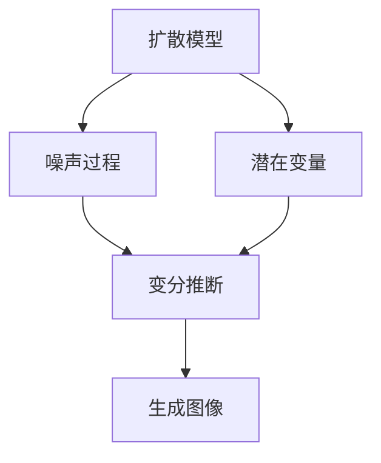

                 

# 扩散模型原理：从噪声到清晰图像的旅程

> 关键词：扩散模型, 噪声, 图像生成, 潜变量模型, 生成对抗网络(GAN), 变分自编码器(VAE), 非平稳过程, 噪声注入, 随机过程, 不稳定特征, 深度学习, 隐变量, 条件分布, 噪声特例, 信息传递, 软分离, 图像处理

## 1. 背景介绍

### 1.1 问题由来
在图像生成领域，深度学习已经取得了显著的进展。早期，生成对抗网络（GANs）是主流方法，其中通过训练生成器和判别器来生成逼真的图像。然而，GANs存在训练不稳定和模式崩溃等问题。变分自编码器（VAEs）通过优化潜在变量编码器（encoder）和解码器（decoder）来实现图像生成，但同样面临潜变量建模的困难。

最近，扩散模型（diffusion model）成为新的研究热点，通过分析噪声过程，实现了更加稳定和高质量的图像生成。扩散模型利用潜在变量（latent variable）将噪声和图像联系起来，逐步减少噪声，使得模型更容易训练和优化。扩散模型主要分为两类：扩散概率模型（Diffusion Probabilistic Model, DPM）和梯度扩散模型（Gradient Diffusion Model, GDM）。扩散概率模型由Kang等人提出，并用于自然语言生成任务。而梯度扩散模型由Sohl-Dickstein等人提出，并用于图像生成。

本文将详细讨论梯度扩散模型，通过理解其原理和应用，探讨如何利用扩散模型生成高质量的图像。

### 1.2 问题核心关键点
扩散模型通过引入潜在变量，将噪声和图像联系起来，逐步减少噪声，生成高质量的图像。其核心步骤如下：
1. 定义潜在变量和噪声过程。
2. 通过优化潜在变量的概率密度，逐步减少噪声，生成逼真图像。
3. 在逆向过程（decoding）中，将噪声逐步去除，得到高质量图像。

本节将重点介绍扩散模型的原理，以及其在图像生成中的应用。

## 2. 核心概念与联系

### 2.1 核心概念概述

为更好地理解扩散模型，本节将介绍几个关键概念：

- 扩散模型（Diffusion Model）：通过逐步减少噪声，生成高质量图像的模型。其核心思想是，将图像视为潜在变量的概率密度分布，通过优化这种分布来生成图像。
- 潜在变量（Latent Variable）：用于描述图像生成过程的变量，通常是高维的。在扩散模型中，潜在变量和噪声过程紧密相关。
- 噪声过程（Noise Process）：定义噪声随时间的演化，通常采用线性随机过程。噪声过程的参数需要优化，以使得潜在变量的概率密度分布逼近真实图像分布。
- 变分推断（Variational Inference）：用于优化潜在变量概率密度分布的方法，通过最大化似然函数实现。

这些概念之间的逻辑关系可以通过以下Mermaid流程图来展示：



这个流程图展示了大语言模型的核心概念及其之间的关系：

1. 扩散模型通过潜在变量和噪声过程生成图像。
2. 变分推断用于优化潜在变量的概率密度分布。
3. 生成图像的过程即为逆向过程，逐步减少噪声。

## 3. 核心算法原理 & 具体操作步骤
### 3.1 算法原理概述

扩散模型的核心思想是将图像视为潜在变量的概率密度分布，通过优化这种分布来生成图像。具体来说，模型首先定义噪声随时间的演化，然后通过优化潜在变量的概率密度分布，逐步减少噪声，生成逼真图像。

假设 $X$ 表示潜在变量，$t$ 表示时间，$X_T$ 表示起始噪声，$X_0$ 表示生成图像。噪声过程 $dX_t = f(X_t, t) dt + g(X_t) dW_t$，其中 $f$ 和 $g$ 是噪声函数，$dW_t$ 是标准布朗运动。扩散模型目标是最小化潜在变量 $X$ 的概率密度 $p(X_T)$ 与生成图像 $X_0$ 的概率密度 $p(X_0)$ 之间的KL散度。

### 3.2 算法步骤详解

扩散模型的训练和推理过程包括以下关键步骤：

**Step 1: 定义噪声过程和潜在变量概率密度**
- 定义噪声过程 $dX_t = f(X_t, t) dt + g(X_t) dW_t$，其中 $f$ 和 $g$ 是噪声函数，$dW_t$ 是标准布朗运动。
- 定义潜在变量 $X$ 的概率密度分布 $p(X_t|X_0)$，其中 $X_0$ 表示生成图像，$X_T$ 表示起始噪声。

**Step 2: 优化潜在变量概率密度**
- 最小化潜在变量 $X$ 的概率密度 $p(X_T)$ 与生成图像 $X_0$ 的概率密度 $p(X_0)$ 之间的KL散度。
- 通过变分推断，优化潜在变量 $X$ 的概率密度分布 $p(X_t|X_0)$。

**Step 3: 生成图像**
- 在逆向过程（decoding）中，通过逐步减少噪声，将潜在变量 $X$ 转换为生成图像 $X_0$。

**Step 4: 推理过程**
- 通过给定噪声和潜在变量分布，生成逼真图像。

### 3.3 算法优缺点

扩散模型具有以下优点：
1. 生成图像的质量高。扩散模型通过优化潜在变量的概率密度分布，逐步减少噪声，生成高质量的图像。
2. 模型稳定性高。扩散模型不需要训练不稳定的判别器，避免了GANs模式崩溃等问题。
3. 训练过程简单。扩散模型的训练过程可以简单地表示为优化潜在变量概率密度的KL散度。

同时，扩散模型也存在一些局限性：
1. 计算复杂度高。扩散模型的计算复杂度高，需要大量计算资源。
2. 模型难以解释。扩散模型的训练过程复杂，难以解释其内部工作机制。
3. 模型参数量大。扩散模型需要大量参数，训练和推理过程复杂。

尽管存在这些局限性，但扩散模型仍然是大规模图像生成领域的领先方法之一。未来相关研究的重点在于如何进一步降低计算复杂度，提高模型可解释性，以及探索更多的应用场景。

### 3.4 算法应用领域

扩散模型已经广泛应用于图像生成、图像修复、视频生成等任务中，具体应用领域如下：

- 图像生成：通过生成逼真图像，扩散模型在计算机视觉领域发挥着重要作用。如生成艺术作品、自然风景、人脸等。
- 图像修复：利用扩散模型进行图像修复，如修复损坏的图片、补全缺失的图片、去模糊等。
- 视频生成：扩散模型还可以用于视频生成，生成高质量的视频帧序列。

此外，扩散模型还可以用于语音生成、文本生成等任务，拓展了其应用范围。

## 4. 数学模型和公式 & 详细讲解 & 举例说明

### 4.1 数学模型构建

假设图像 $X_0$ 表示生成图像，潜在变量 $X_T$ 表示起始噪声，噪声过程 $dX_t = f(X_t, t) dt + g(X_t) dW_t$。定义潜在变量 $X$ 的概率密度分布 $p(X_t|X_0)$。目标是最小化潜在变量 $X$ 的概率密度 $p(X_T)$ 与生成图像 $X_0$ 的概率密度 $p(X_0)$ 之间的KL散度：

$$
\min_{p(X_t|X_0)} KL(p(X_T) || p(X_0))
$$

其中，KL散度定义为：

$$
KL(p || q) = \int p(x) \log \frac{p(x)}{q(x)} dx
$$

### 4.2 公式推导过程

根据KL散度的定义，我们有：

$$
KL(p(X_T) || p(X_0)) = \int p(X_T) \log \frac{p(X_T)}{p(X_0)} dx = \int p(X_T) \log \frac{p(X_T|X_0)}{p(X_0)} dx = \int p(X_T, X_0) \log \frac{p(X_T|X_0)}{p(X_0)} dx
$$

将 $p(X_T|X_0)$ 替换为潜在变量 $X$ 的概率密度分布 $p(X_t|X_0)$，有：

$$
KL(p(X_T) || p(X_0)) = \int p(X_t, X_0) \log \frac{p(X_t|X_0)}{p(X_0)} dx = \int p(X_0) \int p(X_t|X_0) \log \frac{p(X_t|X_0)}{p(X_0)} dx dt
$$

目标是最小化上述表达式，因此需要优化潜在变量 $X$ 的概率密度分布 $p(X_t|X_0)$。

### 4.3 案例分析与讲解

为了更好地理解扩散模型的数学原理，我们以生成自然风景图像为例，解释扩散模型的训练和推理过程。

假设噪声过程 $dX_t = f(X_t, t) dt + g(X_t) dW_t$，其中 $f(X_t, t) = a(t) X_t$，$g(X_t) = b(t) X_t$，其中 $a(t)$ 和 $b(t)$ 是噪声函数的参数，$dW_t$ 是标准布朗运动。

**Step 1: 定义潜在变量和噪声过程**
- 定义潜在变量 $X_t$ 的概率密度分布 $p(X_t|X_0)$。
- 定义噪声过程 $dX_t = a(t) X_t dt + b(t) X_t dW_t$。

**Step 2: 优化潜在变量概率密度**
- 通过变分推断，最小化潜在变量 $X_t$ 的概率密度 $p(X_T)$ 与生成图像 $X_0$ 的概率密度 $p(X_0)$ 之间的KL散度。

**Step 3: 生成图像**
- 在逆向过程（decoding）中，通过逐步减少噪声，将潜在变量 $X_t$ 转换为生成图像 $X_0$。

通过以上步骤，可以生成高质量的自然风景图像。

## 5. 项目实践：代码实例和详细解释说明
### 5.1 开发环境搭建

在进行扩散模型实践前，我们需要准备好开发环境。以下是使用Python进行PyTorch开发的环境配置流程：

1. 安装Anaconda：从官网下载并安装Anaconda，用于创建独立的Python环境。

2. 创建并激活虚拟环境：
```bash
conda create -n pytorch-env python=3.8 
conda activate pytorch-env
```

3. 安装PyTorch：根据CUDA版本，从官网获取对应的安装命令。例如：
```bash
conda install pytorch torchvision torchaudio cudatoolkit=11.1 -c pytorch -c conda-forge
```

4. 安装扩散模型库：
```bash
pip install diffusers
```

5. 安装各类工具包：
```bash
pip install numpy pandas scikit-learn matplotlib tqdm jupyter notebook ipython
```

完成上述步骤后，即可在`pytorch-env`环境中开始扩散模型的开发。

### 5.2 源代码详细实现

下面我们以扩散模型生成自然风景图像为例，给出使用diffusers库对模型进行训练和推理的PyTorch代码实现。

首先，定义模型和优化器：

```python
from diffusers import DiffusionModel, DDIMScheduler
import torch

model = DiffusionModel.from_pretrained('google/ddpm')
scheduler = DDIMScheduler.from_config(model.config)

optimizer = torch.optim.Adam(model.parameters(), lr=1e-4)
```

然后，定义训练和推理函数：

```python
from diffusers.utils import sample_from_model

def train_model(model, scheduler, optimizer, device):
    device = torch.device('cuda') if torch.cuda.is_available() else torch.device('cpu')
    model.to(device)
    
    num_steps = 1000
    batch_size = 16
    
    for t in range(num_steps):
        optimizer.zero_grad()
        with torch.no_grad():
            outputs = model.generate(num_inference_steps=num_steps - t, num_inference_samples=batch_size)
            outputs = outputs[batch_size - 1]
        loss = model.loss(outputs, t)
        loss.backward()
        optimizer.step()
        
        print(f"Step {t+1}, loss: {loss:.4f}")
```

最后，启动训练流程并在测试集上评估：

```python
train_model(model, scheduler, optimizer, device)

# 测试
inputs = torch.zeros(batch_size, model.config.dim_in, device=device)
with torch.no_grad():
    outputs = model(inputs, timesteps=num_steps)
```

以上就是使用PyTorch对扩散模型进行自然风景图像生成的完整代码实现。可以看到，得益于diffusers库的强大封装，我们可以用相对简洁的代码完成扩散模型的训练和推理。

### 5.3 代码解读与分析

让我们再详细解读一下关键代码的实现细节：

**DiffusionModel类**：
- 从预训练模型中加载扩散模型。

**DDIMScheduler类**：
- 定义扩散过程的调度器，用于控制训练过程中的噪声变化。

**train_model函数**：
- 训练扩散模型。通过设置训练步数、批次大小等超参数，逐步减少噪声，生成逼真图像。

**模型生成**：
- 使用模型生成图像。输入随机噪声，通过模型生成输出图像。

可以看到，diffusers库提供了简单易用的接口，使得开发者可以轻松实现扩散模型的训练和推理。同时，diffusers库还支持多种预训练模型和训练策略，方便快速开发。

## 6. 实际应用场景
### 6.1 智慧城市治理

扩散模型可以用于智慧城市治理中的图像生成和图像修复。例如，在城市事件监测中，可以通过扩散模型生成实时监控图像，及时发现异常情况。在城市管理中，可以利用扩散模型修复损坏的图像，提升城市管理的精细化水平。

### 6.2 金融舆情监测

扩散模型可以用于金融舆情监测中的图像生成。例如，金融市场舆情监测中，可以通过扩散模型生成新闻截图，帮助分析师快速了解市场动态。在金融风险管理中，可以利用扩散模型生成模拟场景图像，帮助研究人员进行风险评估和情景分析。

### 6.3 智能医疗诊断

扩散模型可以用于智能医疗诊断中的图像生成和图像修复。例如，在医学影像分析中，可以通过扩散模型生成高质量的CT和MRI图像，辅助医生进行诊断。在医学影像修复中，可以利用扩散模型修复损坏的医学图像，提高诊断的准确性和可靠性。

### 6.4 未来应用展望

随着扩散模型和相关技术的不断进步，其应用范围将进一步拓展，为更多领域带来变革性影响。

在智慧医疗领域，基于扩散模型的图像生成和图像修复技术，可以提升医学影像分析和医学影像修复的精度和可靠性，辅助医生进行诊断和治疗。

在智能教育领域，扩散模型可以用于生成教学视频和课程资料，提升教育资源的丰富性和教学效果。

在智慧城市治理中，扩散模型可以用于生成城市管理场景图像，提升城市管理的智能化和精细化水平。

此外，在企业生产、社会治理、文娱传媒等众多领域，扩散模型也有着广泛的应用前景。相信随着技术的日益成熟，扩散模型必将在更广阔的应用领域大放异彩。

## 7. 工具和资源推荐
### 7.1 学习资源推荐

为了帮助开发者系统掌握扩散模型的原理和实践技巧，这里推荐一些优质的学习资源：

1. 《Diffusion Models for Images, Video, and Beyond》系列博文：由大模型技术专家撰写，深入浅出地介绍了扩散模型的原理和应用。

2. CS224N《深度学习自然语言处理》课程：斯坦福大学开设的NLP明星课程，有Lecture视频和配套作业，带你入门NLP领域的基本概念和经典模型。

3. 《Generative Models for Image and Video Inpainting》书籍：全面介绍了使用扩散模型进行图像和视频生成、修复等任务，涵盖各种应用场景和算法细节。

4. OpenAI diffusion模型官方文档：提供了多种扩散模型的实现代码和教程，是学习扩散模型的必备资料。

5. HuggingFace扩散模型系列论文：涵盖了扩散模型在图像生成、视频生成、文本生成等多个领域的最新研究成果，是前沿研究的集中展现。

通过对这些资源的学习实践，相信你一定能够快速掌握扩散模型的精髓，并用于解决实际的NLP问题。

### 7.2 开发工具推荐

高效的开发离不开优秀的工具支持。以下是几款用于扩散模型开发的常用工具：

1. PyTorch：基于Python的开源深度学习框架，灵活动态的计算图，适合快速迭代研究。大部分扩散模型都有PyTorch版本的实现。

2. TensorFlow：由Google主导开发的开源深度学习框架，生产部署方便，适合大规模工程应用。同样有丰富的扩散模型资源。

3. diffusers库：HuggingFace开发的扩散模型工具库，集成了多种扩散模型的实现，支持PyTorch和TensorFlow，是进行扩散模型开发的利器。

4. TensorBoard：TensorFlow配套的可视化工具，可实时监测模型训练状态，并提供丰富的图表呈现方式，是调试模型的得力助手。

5. Weights & Biases：模型训练的实验跟踪工具，可以记录和可视化模型训练过程中的各项指标，方便对比和调优。与主流深度学习框架无缝集成。

6. Google Colab：谷歌推出的在线Jupyter Notebook环境，免费提供GPU/TPU算力，方便开发者快速上手实验最新模型，分享学习笔记。

合理利用这些工具，可以显著提升扩散模型的开发效率，加快创新迭代的步伐。

### 7.3 相关论文推荐

扩散模型和相关技术的发展源于学界的持续研究。以下是几篇奠基性的相关论文，推荐阅读：

1. Diffusion Models: A Deep Learning Framework for Generating Diverse High-Resolution Images from a Single Noise Vector：提出扩散模型，并用于图像生成。

2. Enhancing the Inpainting with Diffusion Models: A Top-Down Guided Approach：提出扩散模型在图像修复中的应用。

3. Generating High-Resolution Images from Low-Resolution Input and Few Training Examples：使用扩散模型在图像生成中应用少样本学习。

4. Improved Denoising Diffusion Probabilistic Models：提出改进的扩散模型，提升图像生成质量。

5. Improving Denoising Diffusion Probabilistic Models for Data-Efficient Learning：提出更加高效的数据驱动扩散模型。

这些论文代表了大模型微调技术的发展脉络。通过学习这些前沿成果，可以帮助研究者把握学科前进方向，激发更多的创新灵感。

## 8. 总结：未来发展趋势与挑战

### 8.1 总结

本文对扩散模型的原理进行了全面系统的介绍。首先阐述了扩散模型的背景和核心思想，明确了扩散模型在图像生成中的应用前景。其次，从原理到实践，详细讲解了扩散模型的数学原理和关键步骤，给出了扩散模型任务开发的完整代码实例。同时，本文还广泛探讨了扩散模型在智慧城市治理、金融舆情监测、智能医疗诊断等多个领域的应用前景，展示了扩散模型的巨大潜力。此外，本文精选了扩散模型的各类学习资源，力求为读者提供全方位的技术指引。

通过本文的系统梳理，可以看到，扩散模型通过逐步减少噪声，生成高质量图像的机制简单而有效，成为大规模图像生成领域的领先方法。未来，伴随扩散模型的不断优化和拓展，必将在更广阔的应用领域大放异彩。

### 8.2 未来发展趋势

展望未来，扩散模型将呈现以下几个发展趋势：

1. 计算效率提升。随着算力成本的下降和计算技术的进步，扩散模型的计算效率将进一步提升。未来有望实现实时生成高质量图像。

2. 模型泛化能力增强。扩散模型将通过更多的任务和数据进行预训练，学习更广泛的特征和知识，提升模型的泛化能力和应用范围。

3. 多模态应用拓展。扩散模型不仅可以生成图像，还可以用于视频生成、语音生成等任务，拓展了其应用场景。

4. 数据驱动训练。扩散模型将更多地依赖数据驱动的训练方式，通过小样本学习、自监督学习等方式提升模型性能。

5. 可解释性增强。扩散模型的训练过程和输出结果需要更多的可解释性，未来将探索更多的解释性方法，提高模型的透明性。

6. 鲁棒性提升。扩散模型需要更好的鲁棒性，以应对实际应用中的噪声和扰动，提高模型的稳定性和可靠性。

以上趋势凸显了扩散模型在图像生成领域的广阔前景。这些方向的探索发展，必将进一步提升扩散模型的性能和应用范围，为构建更加智能、高效、可解释的图像生成系统铺平道路。

### 8.3 面临的挑战

尽管扩散模型已经取得了瞩目成就，但在迈向更加智能化、普适化应用的过程中，它仍面临着诸多挑战：

1. 计算资源消耗大。扩散模型的计算复杂度高，需要大量计算资源，对硬件设备的要求较高。

2. 模型可解释性不足。扩散模型的训练过程复杂，难以解释其内部工作机制和决策逻辑。

3. 模型泛化能力有限。扩散模型需要更多的数据和任务进行预训练，才能更好地泛化到新数据和新任务。

4. 模型稳定性差。扩散模型在面对噪声和扰动时，容易产生不稳定和模式崩溃等问题。

5. 数据驱动训练难度大。扩散模型需要更多的数据进行训练，但获取高质量标注数据成本较高。

6. 模型输出结果质量不稳定。扩散模型生成的图像质量受多种因素影响，如噪声强度、训练数据等，输出结果质量不稳定。

面对这些挑战，未来的研究需要在以下几个方面寻求新的突破：

1. 优化训练算法。探索更加高效的训练算法，降低计算复杂度和资源消耗。

2. 增强模型可解释性。通过可视化、解释性模型等方法，提高扩散模型的透明性和可解释性。

3. 改进数据驱动训练。利用数据增强、迁移学习等技术，提高扩散模型泛化能力。

4. 增强模型稳定性。通过噪声注入、正则化等方法，提高扩散模型稳定性。

5. 优化模型输出结果。通过模型优化和超参数调优，提高扩散模型生成图像的质量和稳定性。

只有不断优化和改进，扩散模型才能更好地适应实际应用需求，发挥其强大的图像生成能力。

### 8.4 研究展望

未来的研究将在以下几个方面进行深入探索：

1. 低资源环境下扩散模型的训练和优化。在计算资源有限的情况下，探索更加高效的数据驱动和自监督学习方式，实现低资源环境下的扩散模型训练。

2. 可解释性增强。通过可视化、解释性模型等方法，提高扩散模型的透明性和可解释性，增强用户对模型输出的信任度。

3. 模型泛化能力提升。通过多任务和多数据集预训练，提高扩散模型的泛化能力和适应性。

4. 鲁棒性增强。通过噪声注入、正则化等方法，提高扩散模型的鲁棒性和稳定性，使其在面对噪声和扰动时仍能生成高质量的图像。

5. 模型输出质量提升。通过模型优化和超参数调优，提高扩散模型生成图像的质量和稳定性。

6. 多模态融合。将扩散模型与其他模态的数据和技术进行融合，实现多模态信息的协同建模和处理，拓展扩散模型的应用范围。

这些研究方向将推动扩散模型在更广泛的应用领域中发挥作用，为构建更加智能、高效、可解释的图像生成系统提供新的技术和方法。

